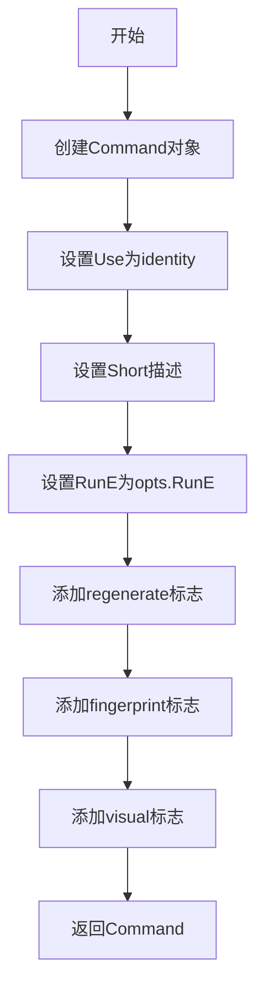
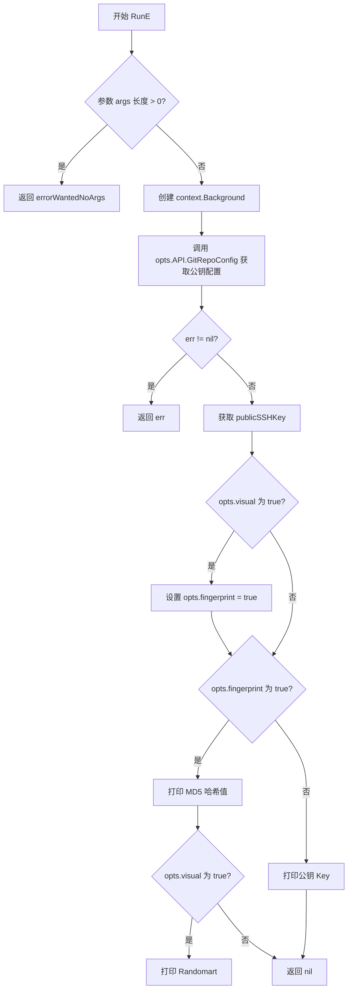
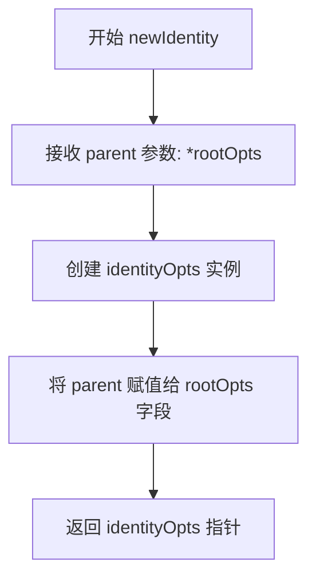
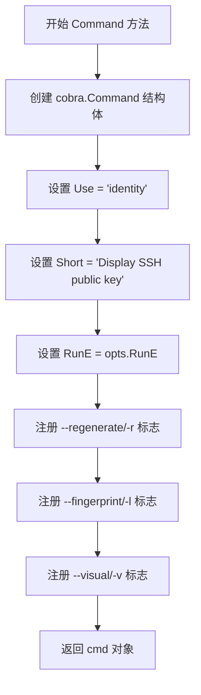

# `flux\cmd\fluxctl\identity_cmd.go` 详细设计文档

这是一个基于cobra框架的CLI命令模块，用于显示SSH公钥信息，支持三种展示模式：直接显示公钥、显示MD5指纹、以及显示带随机艺术图（randomart）的视觉化指纹，并可通过--regenerate参数重新生成SSH密钥。

## 整体流程

```mermaid
graph TD
    A[用户执行 identity 命令] --> B{解析命令行参数}
    B --> C{regenerate?}
    C -- 是 --> D[调用 opts.API.GitRepoConfig(ctx, true)]
    C -- 否 --> E[调用 opts.API.GitRepoConfig(ctx, false)]
    D --> F[获取仓库配置和公钥]
    E --> F
    F --> G{visual 选项为真?}
    G -- 是 --> H[设置 fingerprint = true]
    G -- 否 --> I{visual 选项为真?}
    I -- 是 --> J{执行指纹显示}
    I -- 否 --> K[执行公钥显示]
    H --> J
    J --> L[显示 MD5 哈希]
    L --> M{visual?}
    M -- 是 --> N[显示 Randomart]
    M -- 否 --> O[结束]
    K --> P[显示公钥内容]
    P --> O
```

## 类结构

```
rootOpts (根配置)
└── identityOpts (身份命令选项)
    ├── regenerate (布尔)
    ├── fingerprint (布尔)
    └── visual (布尔)
```

## 全局变量及字段


### `identityOpts.rootOpts`
    
指向根配置的指针，继承API和配置访问能力

类型：`*rootOpts`
    


### `identityOpts.regenerate`
    
是否重新生成SSH密钥的标志

类型：`bool`
    


### `identityOpts.fingerprint`
    
是否显示公钥指纹的标志

类型：`bool`
    


### `identityOpts.visual`
    
是否显示ASCII艺术形式的指纹（隐含fingerprint）

类型：`bool`
    
    

## 全局函数及方法


### `identityOpts.Command`

返回用于显示SSH公钥的Cobra命令实例，配置命令的使用方式、简短描述和关联的标志位。

参数：此方法无参数。

返回值：`*cobra.Command`，返回配置好的Cobra命令对象，可添加到根命令中。

#### 流程图



#### 带注释源码

```go
func (opts *identityOpts) Command() *cobra.Command {
    // 创建一个新的Cobra命令
    cmd := &cobra.Command{
        Use:   "identity",                  // 命令名称
        Short: "Display SSH public key",    // 简短描述
        RunE:  opts.RunE,                   // 绑定执行方法
    }
    
    // 注册 --regenerate / -r 标志，用于生成新身份
    cmd.Flags().BoolVarP(&opts.regenerate, "regenerate", "r", false, `Generate a new identity`)
    
    // 注册 --fingerprint / -l 标志，用于显示公钥指纹
    cmd.Flags().BoolVarP(&opts.fingerprint, "fingerprint", "l", false, `Show fingerprint of public key`)
    
    // 注册 --visual / -v 标志，用于显示ASCII艺术（隐含-l）
    cmd.Flags().BoolVarP(&opts.visual, "visual", "v", false, `Show ASCII art representation with fingerprint (implies -l)`)
    
    return cmd  // 返回配置好的命令
}
```

---

### `identityOpts.RunE`

执行identity命令的核心逻辑，调用API获取SSH公钥配置，根据标志位输出公钥、指纹或可视化ASCII艺术。

参数：

- `_`：`*cobra.Command`，命令对象占位符（未使用）
- `args`：`[]string`，命令参数列表

返回值：`error`，执行过程中的错误信息，若成功则返回nil。

#### 流程图



#### 带注释源码

```go
func (opts *identityOpts) RunE(_ *cobra.Command, args []string) error {
    // 检查是否有额外参数，identity命令不接受任何参数
    if len(args) > 0 {
        return errorWantedNoArgs  // 返回参数错误
    }

    // 创建空上下文用于API调用
    ctx := context.Background()

    // 调用API获取Git仓库配置，传入regenerate选项
    // 如果regenerate为true，会生成新的SSH密钥
    repoConfig, err := opts.API.GitRepoConfig(ctx, opts.regenerate)
    if err != nil {
        return err  // API调用失败，直接返回错误
    }
    
    // 从配置中获取公钥信息
    publicSSHKey := repoConfig.PublicSSHKey

    // 如果启用了visual模式，自动启用fingerprint模式
    if opts.visual {
        opts.fingerprint = true
    }

    // 根据fingerprint标志决定输出格式
    if opts.fingerprint {
        // 打印MD5指纹哈希值
        fmt.Println(publicSSHKey.Fingerprints["md5"].Hash)
        
        // 如果启用visual模式，额外打印随机艺术图
        if opts.visual {
            fmt.Print(publicSSHKey.Fingerprints["md5"].Randomart)
        }
    } else {
        // 默认打印原始公钥内容
        fmt.Print(publicSSHKey.Key)
    }
    
    return nil  // 成功执行
}
```

---

### `newIdentity`

构造函数，创建并初始化identityOpts实例，将父级rootOpts注入到新实例中。

参数：

- `parent`：`*rootOpts`，父级选项对象，包含共享的配置和API接口

返回值：`*identityOpts`，返回新创建的identityOpts实例指针。

#### 流程图

```mermaid
flowchart TD
    A[开始 newIdentity] --> B[接收 parent 参数]
    B --> C[创建 &identityOpts{rootOpts: parent}]
    C --> D[返回实例指针]
```

#### 带注释源码

```go
func newIdentity(parent *rootOpts) *identityOpts {
    // 使用父选项初始化identity选项
    // rootOpts通过嵌入方式传递给子命令
    return &identityOpts{rootOpts: parent}
}
```

---

### 关键组件信息

| 名称 | 描述 |
|------|------|
| `identityOpts` | 命令选项结构体，封装identity命令的所有配置和执行逻辑 |
| `rootOpts` | 父级选项结构体，通过嵌入提供共享的API和配置 |
| `cobra.Command` | Cobra库的命令对象，表示一个CLI命令 |
| `repoConfig.PublicSSHKey` | 包含公钥、指纹等信息的SSH配置对象 |

---

### 潜在的技术债务或优化空间

1. **错误处理不足**：`RunE`方法未对`repoConfig.PublicSSHKey`为nil或`Fingerprints["md5"]`不存在的情况进行校验，可能导致panic。

2. **硬编码的MD5算法**：指纹提取硬编码使用MD5，未支持SHA256等其他算法。

3. **缺乏单元测试**：代码缺少针对`RunE`逻辑的单元测试，尤其是边界条件（如空配置、缺失指纹等）。

4. **标志位与业务逻辑耦合**：fingerprint和visual的逻辑交织在同一方法中，可考虑拆分为更细粒度的职责。

5. **国际化支持缺失**：所有输出文本均为硬编码英文，未支持多语言。

---

### 其它项目

#### 设计目标与约束
- **设计目标**：提供简洁的CLI接口，用于展示SSH公钥信息，支持查看原始公钥、指纹和可视化图形。
- **约束**：
  - 命令不接受任何额外参数（`args`必须为空）
  - 默认输出原始公钥，仅在明确指定`-l`或`-v`时输出指纹信息

#### 错误处理与异常设计
- 参数错误：返回预定义的`errorWantedNoArgs`错误
- API错误：透传`GitRepoConfig`返回的错误，不做额外包装
- 空配置风险：未处理`publicSSHKey`或其字段为nil的情况（潜在panic风险）

#### 数据流与状态机
```
用户输入 → cobra解析 → RunE入口 → API获取配置 → 条件分支(visual/fingerprint) → 输出(公钥/指纹/Randomart)
```

#### 外部依赖与接口契约
- **依赖**：
  - `github.com/spf13/cobra`：CLI框架
  - `context`：用于API调用的上下文管理
  - `opts.API`：隐式依赖，需实现`GitRepoConfig(ctx context.Context, regenerate bool) (*RepoConfig, error)`方法


### `identityOpts.newIdentity`

该函数是 `identityOpts` 类型的构造函数，用于创建并初始化 `identityOpts` 实例，并将父级 `rootOpts` 注入到新实例中。

参数：

- `parent`：`*rootOpts`，父选项结构体指针，用于继承根命令的配置和功能

返回值：`*identityOpts`，返回新创建的 `identityOpts` 实例指针

#### 流程图



#### 带注释源码

```go
// newIdentity 是 identityOpts 的构造函数
// 参数 parent: 指向 rootOpts 的指针，包含父级配置
// 返回值: 指向新创建的 identityOpts 实例的指针
func newIdentity(parent *rootOpts) *identityOpts {
    // 创建并初始化 identityOpts 实例
    // 将 parent 赋值给 embedded 的 rootOpts 字段
    return &identityOpts{rootOpts: parent}
}
```


### `identityOpts.Command`

该方法构建并返回一个 Cobra 命令实例，用于显示 SSH 公钥，支持显示指纹、ASCII 艺术图形以及重新生成密钥等功能。

参数：
- （无显式参数，隐式接收者 `opts *identityOpts`）

返回值：`*cobra.Command`，返回配置好的 Cobra 命令对象，包含命令元数据（Use、Short）和三个布尔标志（regenerate、fingerprint、visual）

#### 流程图



#### 带注释源码

```go
// Command 构建并返回用于显示SSH公钥的Cobra命令实例
// 该命令没有子命令，主要通过flags控制输出行为
func (opts *identityOpts) Command() *cobra.Command {
    // 初始化cobra.Command结构体
    // Use: 命令调用名称
    // Short: 命令简短描述
    // RunE: 命令执行函数（返回error以支持错误传播）
    cmd := &cobra.Command{
        Use:   "identity",
        Short: "Display SSH public key",
        RunE:  opts.RunE,  // 绑定到identityOpts的RunE方法
    }
    
    // 注册 --regenerate/-r 标志
    // 用于控制是否生成新的SSH密钥
    cmd.Flags().BoolVarP(&opts.regenerate, "regenerate", "r", false, `Generate a new identity`)
    
    // 注册 --fingerprint/-l 标志
    // 用于控制是否显示公钥的MD5指纹
    cmd.Flags().BoolVarP(&opts.fingerprint, "fingerprint", "l", false, `Show fingerprint of public key`)
    
    // 注册 --visual/-v 标志
    // 用于控制是否显示ASCII艺术图形（隐含启用fingerprint）
    cmd.Flags().BoolVarP(&opts.visual, "visual", "v", false, `Show ASCII art representation with fingerprint (implies -l)`)
    
    // 返回配置完成的cobra.Command实例
    return cmd
}
```

#### 相关联的 RunE 方法（补充说明）

```go
// RunE 是 identity 命令的实际执行逻辑
// 参数: _ *cobra.Command (未使用), args []string (命令行参数)
// 返回: error (执行过程中的错误)
func (opts *identityOpts) RunE(_ *cobra.Command, args []string) error {
    // 验证无额外参数传入
    if len(args) > 0 {
        return errorWantedNoArgs
    }

    // 创建空上下文
    ctx := context.Background()

    // 调用API获取Git仓库配置（可能重新生成密钥）
    repoConfig, err := opts.API.GitRepoConfig(ctx, opts.regenerate)
    if err != nil {
        return err  // 错误传播
    }
    publicSSHKey := repoConfig.PublicSSHKey

    // visual标志隐含启用fingerprint
    if opts.visual {
        opts.fingerprint = true
    }

    // 根据fingerprint标志选择输出格式
    if opts.fingerprint {
        // 输出MD5指纹哈希值
        fmt.Println(publicSSHKey.Fingerprints["md5"].Hash)
        // 如果启用visual，额外输出Randomart图形
        if opts.visual {
            fmt.Print(publicSSHKey.Fingerprints["md5"].Randomart)
        }
    } else {
        // 默认输出公钥内容
        fmt.Print(publicSSHKey.Key)
    }
    return nil
}
```

#### 潜在技术债务与优化空间

| 问题 | 建议 |
|------|------|
| 硬编码 `"md5"` 字符串 | 应支持多种哈希算法（如SHA256），通过配置或参数指定 |
| `visual` 隐含修改 `fingerprint` 状态 | 逻辑副作用，建议在执行前显式检查而非修改标志值 |
| 错误处理不够细致 | 缺少对 `repoConfig` 或 `PublicSSHKey` 为 nil 的防御性检查 |
| 缺乏单元测试 | 建议为 `Command()` 和 `RunE` 方法添加测试覆盖 |
| 依赖 `rootOpts` 未显式声明接口 | 建议定义接口以解耦依赖，便于测试 Mock |


### `identityOpts.RunE`

该方法是 `identity` 命令的核心执行逻辑，用于获取并展示 SSH 公钥信息。通过调用 Git 仓库配置 API 获取公钥数据，根据命令行标志（`--fingerprint`、`--visual`）输出公钥、指纹或 ASCII 艺术图形。

参数：

- `cmd`：`*cobra.Command`，Cobra 命令对象（此参数未使用）
- `args`：`[]string`，命令行传入的额外参数列表

返回值：`error`，执行过程中的错误信息，如参数校验失败、API 调用失败等

#### 流程图

```mermaid
flowchart TD
    A[Start RunE] --> B{len(args) > 0?}
    B -->|Yes| C[return errorWantedNoArgs]
    B -->|No| D[ctx = context.Background]
    D --> E[opts.API.GitRepoConfig<br/>ctx, opts.regenerate]
    E --> F{err != nil?}
    F -->|Yes| G[return err]
    F -->|No| H[publicSSHKey =<br/>repoConfig.PublicSSHKey]
    H --> I{opts.visual?}
    I -->|Yes| J[opts.fingerprint = true]
    I -->|No| K{opts.fingerprint?}
    J --> K
    K -->|Yes| L[fmt.Println<br/>md5.Hash]
    K -->|No| M[fmt.Print<br/>publicSSHKey.Key]
    L --> N{opts.visual?}
    N -->|Yes| O[fmt.Print<br/>md5.Randomart]
    N -->|No| P[return nil]
    M --> P
    O --> P
```

#### 带注释源码

```go
// RunE 是 identity 命令的执行函数，处理 SSH 公钥的展示逻辑
// 参数 cmd 为 Cobra 命令对象（此方法中未使用）
// 参数 args 为命令行传入的额外参数
// 返回 error 类型，表示执行过程中的错误
func (opts *identityOpts) RunE(_ *cobra.Command, args []string) error {
    // 校验：不允许传入额外参数，identity 命令不接受任何位置参数
    if len(args) > 0 {
        return errorWantedNoArgs
    }

    // 创建默认的上下文对象，用于 API 调用
    ctx := context.Background()

    // 调用 API 获取 Git 仓库配置
    // 参数 opts.regenerate 决定是否生成新的身份密钥
    // 返回 repoConfig 包含公钥信息，err 表示调用是否成功
    repoConfig, err := opts.API.GitRepoConfig(ctx, opts.regenerate)
    if err != nil {
        // API 调用失败，直接返回错误
        return err
    }
    // 从配置中提取公钥数据
    publicSSHKey := repoConfig.PublicSSHKey

    // 处理 --visual 标志：该标志隐含启用 --fingerprint
    if opts.visual {
        opts.fingerprint = true
    }

    // 根据 fingerprint 标志决定输出内容
    if opts.fingerprint {
        // 输出 MD5 格式的指纹哈希值
        fmt.Println(publicSSHKey.Fingerprints["md5"].Hash)
        
        // 如果启用了 visual 模式，额外输出随机艺术图形（Randomart）
        if opts.visual {
            fmt.Print(publicSSHKey.Fingerprints["md5"].Randomart)
        }
    } else {
        // 默认行为：直接输出公钥内容
        fmt.Print(publicSSHKey.Key)
    }
    
    // 执行成功，无错误返回
    return nil
}
```

## 关键组件


### identityOpts 结构体

命令选项配置结构体，用于存储identity命令的所有配置参数，包括是否重新生成密钥、是否显示指纹、是否显示ASCII艺术等选项。

### newIdentity 构造函数

用于创建并初始化identityOpts实例的工厂函数，将父级rootOpts注入到结构体中，建立命令层级关系。

### Command 方法

构建cobra命令的核心方法，定义命令的使用方式、简短描述和运行时逻辑，并注册regenerate、fingerprint、visual三个命令行标志。

### RunE 方法

命令执行逻辑的核心方法，负责校验参数、调用API获取SSH配置、根据选项条件输出公钥、指纹或ASCII艺术 representation。

### rootOpts 依赖

根选项结构体，提供API接口和其他全局配置，identityOpts通过组合rootOpts来访问系统功能。

### errorWantedNoArgs 错误常量

预定义的错误常量，用于当用户传递了不需要的参数时返回错误提示。


## 问题及建议


### 已知问题

-   **缺少空指针检查**：`repoConfig` 和 `publicSSHKey` 可能为 nil，访问其字段会导致 panic
-   **硬编码字符串**：指纹类型 "md5" 被硬编码在代码中，降低了可维护性
-   **未使用传入的 context**：函数使用 `context.Background()` 而非调用者传入的 context，无法支持超时和取消
-   **缺少日志记录**：使用 `fmt.Println` 直接输出，无法满足生产环境的日志需求
-   **选项依赖逻辑隐式**：`visual` 选项自动启用 `fingerprint` 的逻辑在 RunE 中实现，不够直观
-   **无单元测试**：代码未包含任何测试，无法保证可靠性
-   **错误处理不完整**：未处理 `Fingerprints["md5"]` 不存在的情况
-   **未验证 rootOpts**：构造函数未检查 parent 参数是否为 nil

### 优化建议

-   在访问 `repoConfig.PublicSSHKey` 之前添加 nil 检查，返回明确的错误信息
-   将 "md5" 提取为常量或配置项，支持多种哈希算法
-   修改函数签名接受 context 参数：`RunE(ctx context.Context, ...)`
-   引入日志库（如 logrus、zap）替代 `fmt.Print` 进行日志记录
-   使用 cobra 的 `PreRunE` 或 `ValidateArgs` 钩子处理选项间的依赖关系
-   添加单元测试覆盖主要逻辑分支
-   在访问 map 前检查 key 是否存在：`if fp, ok := publicSSHKey.Fingerprints["md5"]; ok {...}`
-   在 `newIdentity` 函数中添加对 parent 参数的 nil 检查


## 其它


### 设计目标与约束

本CLI命令的设计目标是提供一个便捷的SSH公钥展示工具，支持三种展示模式：原始公钥、MD5指纹、以及带随机艺术图（Randomart）的可视化展示。设计约束包括：必须依赖rootOpts提供的API接口获取SSH配置；命令行参数遵循Unix风格（短参数）；错误处理采用Go的错误返回机制；输出目标为标准输出。

### 错误处理与异常设计

代码采用Go语言的错误处理模式，通过返回error类型供上层调用者处理。具体错误场景包括：参数校验错误（传入多余参数时返回errorWantedNoArgs）、API调用错误（GitRepoConfig调用失败时直接向上传递）、配置缺失错误（repoConfig或PublicSSHKey为nil时的隐式panic风险）。当前实现未对repoConfig和publicSSHKey进行空值检查，存在潜在的panic风险。异常设计遵循"快速失败"原则，但缺少对边界情况的防御性编程。

### 数据流与状态机

数据流如下：用户执行命令 → Cobra解析命令行参数 → RunE方法执行 → 调用API获取GitRepoConfig → 根据fingerprint和visual标志决定输出格式 → 输出到标准输出。状态转换主要体现在flags之间的隐式依赖关系：当visual为true时，fingerprint自动被设置为true。状态机可描述为：初始状态（无标志）→ 判断visual标志 → 若visual为true则转移至fingerprint=true状态 → 根据fingerprint状态选择输出分支。

### 外部依赖与接口契约

主要外部依赖包括：github.com/spf13/cobra（CLI框架）、context包（用于传递取消信号和超时）、fmt包（格式化输出）。隐式依赖包括rootOpts结构体及其API字段（必须提供GitRepoConfig方法）、errorWantedNoArgs全局错误变量。接口契约要求：opts.API.GitRepoConfig(ctx context.Context, regenerate bool)必须返回包含PublicSSHKey字段的配置对象，PublicSSHKey必须包含Key字段和Fingerprints映射（至少包含"md5"键，其值包含Hash和Randomart字段）。

### 安全性考虑

代码本身不直接处理敏感数据，但通过regenerate参数可能触发SSH密钥重新生成操作，需确保调用权限校验。当前实现未对regenerate操作进行确认提示，存在误操作风险。输出到标准输出的内容为公钥信息，理论上可安全展示，但建议在日志中记录公钥指纹而非完整公钥。

### 性能要求与优化空间

当前实现为同步执行，无并发优化。API调用（GitRepoConfig）可能存在网络延迟，可考虑添加超时控制（当前仅使用context.Background()，无超时设置）。fingerprint分支中两次访问publicSSHKey.Fingerprints["md5"]，可提取以减少映射查找开销。优化空间包括：添加context超时、使用缓存避免重复调用API、支持输出格式参数化以提高可测试性。

### 测试策略建议

建议编写单元测试覆盖以下场景：正常公钥输出、fingerprint输出、visual模式输出、参数校验（传入多余参数）、API调用失败场景、repoConfig为nil的防御性测试。测试可使用cobra命令的持久PreRunE钩子注入mock的API实现。由于当前代码直接依赖标准输出，建议重构输出逻辑以接受writer参数以便于测试。

### 配置管理与环境适配

该命令本身不直接读取配置文件，配置通过rootOpts从父级注入。regenerate参数控制是否生成新密钥，该操作可能受环境变量或配置文件控制。建议在文档中明确说明regenerate操作的幂等性和副作用，以及在CI/CD环境中的使用注意事项。

### 监控与可观测性

当前实现缺少日志记录和指标暴露。建议添加：命令执行成功/失败计数的Prometheus指标、API调用延迟的追踪（可使用OpenTelemetry）、结构化日志输出（包含命令参数和执行结果摘要）。这有助于在生产环境中监控该命令的使用情况和性能表现。

### 国际化与本地化

命令行帮助文本（Short字段、Flag描述）目前为英文，适合国际化项目。错误消息errorWantedNoArgs的内容未在代码中定义，建议提取为常量或使用国际化框架管理，以便支持多语言错误提示。

### 权限与安全模型

该命令需要访问SSH密钥存储和可能的Git仓库配置。regenerate操作需要写入权限。建议在文档中明确说明所需权限列表，以及在多用户环境下的权限隔离机制。


    