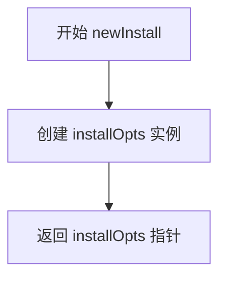
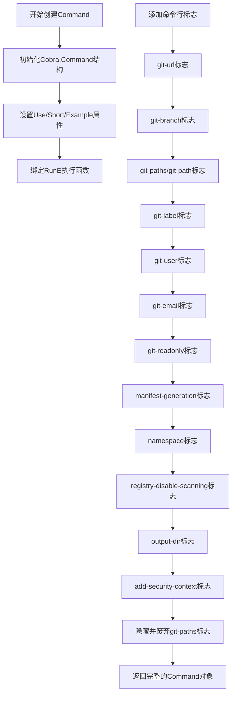
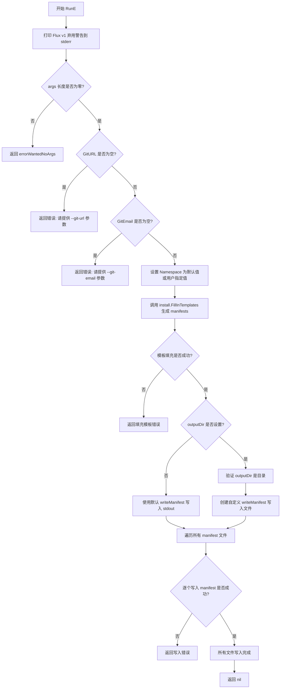

# `flux\cmd\fluxctl\install_cmd.go` 详细设计文档

这是一个Flux CLI工具的安装命令模块，通过Cobra框架实现install子命令，用于生成和输出Kubernetes manifests以在集群中安装Flux组件，支持输出到stdout或指定目录。

## 整体流程

```mermaid
graph TD
A[开始 RunE] --> B[打印弃用警告]
B --> C{参数args长度 != 0?}
C -- 是 --> D[返回errorWantedNoArgs]
C -- 否 --> E{GitURL为空?}
E -- 是 --> F[返回错误: 需要--git-url]
E -- 否 --> G{GitEmail为空?}
G -- 是 --> H[返回错误: 需要--git-email]
G -- 否 --> I[获取Namespace]
I --> J[调用install.FillInTemplates生成Manifests]
J --> K{outputDir非空?]
K -- 否 --> L[使用stdout输出]
K -- 是 --> M[遍历manifests写入文件]
L --> N[结束]
M --> N
```

## 类结构

```
main package
└── installOpts (struct)
    ├── TemplateParameters (嵌入自 github.com/fluxcd/flux/pkg/install)
    └── outputDir (string)
        ├── Command() *cobra.Command
        └── RunE(cmd *cobra.Command, args []string) error
```

## 全局变量及字段


### `newInstall`
    
创建并返回installOpts实例的构造函数

类型：`func() *installOpts`
    


### `installOpts.TemplateParameters`
    
来自install包的嵌入结构，包含Git仓库、命名空间等安装参数

类型：`install.TemplateParameters (嵌入结构)`
    


### `installOpts.outputDir`
    
输出目录路径，用于指定清单文件的输出目录

类型：`string`
    
    

## 全局函数及方法


### `newInstall`

该函数用于创建并返回一个新的 `installOpts` 实例，该实例作为 Flux 安装命令的配置选项容器，包含了用于生成 Kubernetes 清单文件的所有配置参数。

参数：  
无

返回值：`*installOpts`，返回指向新创建的 `installOpts` 实例的指针，用于配置 Flux 的安装参数。

#### 流程图



#### 带注释源码

```go
// newInstall 创建并返回一个新的 installOpts 实例
// installOpts 结构体包含两个部分:
// 1. install.TemplateParameters: 嵌入的模板参数结构,包含 Git 仓库、命名空间等配置
// 2. outputDir: 输出目录路径,用于指定清单文件的写入位置
// 该函数在启动 install 命令时被调用,初始化默认配置选项
func newInstall() *installOpts {
    // 使用默认零值创建 installOpts 实例
    // TemplateParameters 的字段默认为空字符串或 false
    // outputDir 默认为空字符串(表示输出到 stdout)
    return &installOpts{}
}
```

#### 关联类型信息

**installOpts 结构体：**

| 字段名 | 类型 | 描述 |
|--------|------|------|
| `TemplateParameters` | `install.TemplateParameters` | 嵌入的模板参数，包含 Git 仓库、命名空间、镜像仓库等配置 |
| `outputDir` | `string` | 输出目录路径，若为空则输出到标准输出 |

**TemplateParameters 典型字段（来自代码中的命令行参数）：**

| 字段名 | 类型 | 描述 |
|--------|------|------|
| `GitURL` | `string` | Git 仓库 URL |
| `GitBranch` | `string` | Git 分支名 |
| `GitPaths` | `[]string` | Git 仓库中的相对路径 |
| `GitLabel` | `string` | Git 标签 |
| `GitUser` | `string` | Git 提交用户名 |
| `GitEmail` | `string` | Git 提交邮箱 |
| `GitReadOnly` | `bool` | 是否只读访问仓库 |
| `ManifestGeneration` | `bool` | 是否启用清单生成 |
| `Namespace` | `string` | 集群命名空间 |
| `RegistryDisableScanning` | `bool` | 是否禁用镜像仓库扫描 |
| `AddSecurityContext` | `bool` | 是否添加安全上下文 |


### `installOpts.Command`

该方法构建并返回一个配置完整的Cobra命令对象，用于执行Flux的安装功能。该命令允许用户生成并自定义Kubernetes清单，以将Flux安装到集群中。

参数：

- 该方法无显式参数（接收者 `opts *installOpts` 隐式传入）

返回值：`*cobra.Command`，返回配置完成的Cobra命令对象，包含所有标志和执行逻辑

#### 流程图



#### 带注释源码

```go
// Command 构建并返回Cobra命令对象，用于执行Flux安装功能
// 该方法配置命令的元数据、标志绑定以及执行逻辑
func (opts *installOpts) Command() *cobra.Command {
	// 初始化基本的Cobra命令结构，设置命令名称、简短描述和示例
	cmd := &cobra.Command{
		Use:   "install",
		Short: "Print and tweak Kubernetes manifests needed to install Flux in a Cluster",
		Example: `# Install Flux and make it use Git repository git@github.com:<your username>/flux-get-started
fluxctl install --git-url 'git@github.com:<your username>/flux-get-started' --git-email=<your_git_email> | kubectl -f -`,
		// 绑定RunE方法作为命令执行逻辑，RunE返回error以支持优雅的错误处理
		RunE: opts.RunE,
	}

	// ======= Git配置标志 =======
	// git-url: Git仓库URL，Flux将使用该仓库进行配置同步
	cmd.Flags().StringVar(&opts.GitURL, "git-url", "",
		"URL of the Git repository to be used by Flux, e.g. git@github.com:<your username>/flux-get-started")
	// git-branch: Git分支，默认为master
	cmd.Flags().StringVar(&opts.GitBranch, "git-branch", "master",
		"Git branch to be used by Flux")
	// git-paths: Git仓库内的相对路径，用于定位Kubernetes清单（已废弃）
	cmd.Flags().StringSliceVar(&opts.GitPaths, "git-paths", []string{},
		"relative paths within the Git repo for Flux to locate Kubernetes manifests")
	// git-path: Git仓库内的相对路径，用于定位Kubernetes清单（单数形式，当前推荐使用）
	cmd.Flags().StringSliceVar(&opts.GitPaths, "git-path", []string{},
		"relative paths within the Git repo for Flux to locate Kubernetes manifests")
	// git-label: Git标签，用于跟踪Flux的同步进度
	cmd.Flags().StringVar(&opts.GitLabel, "git-label", "flux",
		"Git label to keep track of Flux's sync progress; overrides both --git-sync-tag and --git-notes-ref")
	// git-user: Git提交用户名
	cmd.Flags().StringVar(&opts.GitUser, "git-user", "Flux",
		"username to use as git committer")
	// git-email: Git提交邮箱
	cmd.Flags().StringVar(&opts.GitEmail, "git-email", "",
		"email to use as git committer")
	// git-readonly: 是否以只读模式访问Git仓库
	cmd.Flags().BoolVar(&opts.GitReadOnly, "git-readonly", false,
		"tell flux it has readonly access to the repo")

	// ======= Flux行为配置标志 =======
	// manifest-generation: 是否启用清单生成功能
	cmd.Flags().BoolVar(&opts.ManifestGeneration, "manifest-generation", false,
		"whether to enable manifest generation")
	// namespace: 安装Flux的集群命名空间
	cmd.Flags().StringVar(&opts.Namespace, "namespace", "",
		"cluster namespace where to install flux")
	// registry-disable-scanning: 是否禁用容器镜像注册表扫描
	cmd.Flags().BoolVar(&opts.RegistryDisableScanning, "registry-disable-scanning", false,
		"do not scan container image registries to fill in the registry cache")

	// ======= 输出配置标志 =======
	// output-dir: 输出目录，将清单写入文件而非打印到标准输出
	cmd.Flags().StringVarP(&opts.outputDir, "output-dir", "o", "", "a directory in which to write individual manifests, rather than printing to stdout")
	// add-security-context: 是否添加安全上下文信息到Pod规范
	cmd.Flags().BoolVar(&opts.AddSecurityContext, "add-security-context", true, "Ensure security context information is added to the pod specs. Defaults to 'true'")

	// 隐藏并废弃git-paths标志（因为与fluxd的git-path标志不一致）
	cmd.Flags().MarkHidden("git-paths")
	cmd.Flags().MarkDeprecated("git-paths", "please use --git-path (no ending s) instead")

	// 返回配置完整的Cobra命令对象
	return cmd
}
```


### `installOpts.RunE`

该方法是 Flux CLI 安装命令的核心执行逻辑，负责验证用户输入的 Git 仓库和邮箱参数，生成 Kubernetes 安装清单（manifests），并将结果输出到标准输出或指定目录。

参数：

- `cmd`：`*cobra.Command`，Cobra 命令对象，包含命令配置和标志信息
- `args`：`[]string`，命令行传入的额外参数列表

返回值：`error`，执行过程中的错误信息，如参数验证失败、模板填充失败或文件写入失败等

#### 流程图



#### 带注释源码

```go
func (opts *installOpts) RunE(cmd *cobra.Command, args []string) error {
	// 步骤1: 打印弃用警告信息，提示用户升级到 v2 版本
	fmt.Fprintf(os.Stderr, `**Flux v1 is deprecated, please upgrade to v2 as soon as possible!**

New users of Flux can Get Started here:
https://fluxcd.io/flux/get-started/

Existing users can upgrade using the Migration Guide:
https://fluxcd.io/flux/migration/

`)

	// 步骤2: 验证参数 - 检查是否有额外的命令行参数传入
	if len(args) != 0 {
		return errorWantedNoArgs
	}

	// 步骤3: 验证 GitURL - 必须提供有效的 Git 仓库 URL
	if opts.GitURL == "" {
		return fmt.Errorf("please supply a valid --git-url argument")
	}

	// 步骤4: 验证 GitEmail - 必须提供有效的 Git 提交者邮箱
	if opts.GitEmail == "" {
		return fmt.Errorf("please supply a valid --git-email argument")
	}

	// 步骤5: 设置命名空间 - 从 kubeconfig context 获取或使用默认值
	opts.TemplateParameters.Namespace = getKubeConfigContextNamespaceOrDefault(opts.Namespace, "default", "")

	// 步骤6: 调用安装模板生成函数，填充参数生成 Kubernetes manifests
	manifests, err := install.FillInTemplates(opts.TemplateParameters)
	if err != nil {
		return err
	}

	// 步骤7: 定义默认的 manifest 写入函数 - 输出到标准输出
	writeManifest := func(fileName string, content []byte) error {
		_, err := os.Stdout.Write(content)
		return err
	}

	// 步骤8: 如果指定了输出目录，则使用文件写入函数替代标准输出
	if opts.outputDir != "" {
		// 验证输出目录是否存在
		info, err := os.Stat(opts.outputDir)
		if err != nil {
			return err
		}
		// 确保 outputDir 是一个目录而非文件
		if !info.IsDir() {
			return fmt.Errorf("%s is not a directory", opts.outputDir)
		}

		// 重写写入函数为文件写入模式
		writeManifest = func(fileName string, content []byte) error {
			path := filepath.Join(opts.outputDir, fileName)
			fmt.Fprintf(os.Stderr, "writing %s\n", path) // 打印写入日志到 stderr
			return ioutil.WriteFile(path, content, os.FileMode(0666))
		}
	}

	// 步骤9: 遍历所有生成的 manifest 文件并写入目标位置
	for fileName, content := range manifests {
		if err := writeManifest(fileName, content); err != nil {
			return fmt.Errorf("cannot output manifest file %s: %s", fileName, err)
		}
	}

	// 步骤10: 执行成功，返回 nil
	return nil
}
```

## 关键组件


### installOpts 结构体

安装选项的配置结构体，嵌入`install.TemplateParameters`以继承模板参数，并添加`outputDir`字段用于指定输出目录。

### newInstall 函数

工厂函数，创建并返回`installOpts`实例，用于初始化安装命令的配置对象。

### Command 方法

定义cobra命令的详细配置，包括所有命令行参数如`git-url`、`git-branch`、`git-path`、`namespace`等，并设置命令的使用说明、示例和运行逻辑。

### RunE 方法

核心执行逻辑：验证参数（检查git-url和git-email）、获取Kubernetes命名空间、调用`install.FillInTemplates`生成manifests、根据是否指定outputDir选择输出到文件或stdout。

### writeManifest 闭包函数

动态创建的写入函数，根据outputDir参数决定是将manifest写入指定目录还是输出到标准输出。

### 模板参数配置

通过cobra flags暴露的配置项集合，包括Git仓库配置（URL、分支、路径、标签、用户、邮箱）、Flux行为配置（只读访问、manifest生成、registry扫描）以及安全上下文选项。

### 命令行参数解析与验证

在RunE中执行的参数校验逻辑，确保必需参数（git-url、git-email）已提供，并对多余参数进行错误处理。

### manifest生成与输出流程

调用install包的FillInTemplates方法生成Kubernetes manifests，然后遍历manifests并通过writeManifest函数输出到目标位置。


## 问题及建议


### 已知问题

-   **重复的Flag定义**：`git-paths` 和 `git-path` 两个flag绑定到了同一个变量 `opts.GitPaths`，导致flag名称不一致且功能重复。代码中虽然对 `git-paths` 进行了隐藏和弃用标记，但仍在注册flag时造成了冗余。
-   **不安全的文件权限**：使用 `os.FileMode(0666)` 创建文件，该权限允许所有用户读写（无执行权限），在多用户系统中存在潜在的安全风险，建议使用更严格的 `0644` 权限。
-   **未使用的参数**：`writeManifest` 函数签名中包含 `fileName` 参数，但在函数体内未被使用，造成代码冗余。
-   **潜在的nil指针风险**：`install.FillInTemplates` 返回的 `manifests` 未进行nil检查，如果返回nil，遍历将静默失败而非返回明确错误。
-   **硬编码的弃用警告**：Flux v1弃用警告信息硬编码在 `RunE` 方法中，版本更新时需要手动修改代码，维护性较差。
-   **缺乏输入验证**：未对 `--git-url` 和 `--git-email` 的格式进行验证，仅检查了非空，可能导致后续处理时出现难以追踪的错误。
-   **重复代码逻辑**：根据 `outputDir` 是否为空，重复定义了 `writeManifest` 函数，可以提取为通用逻辑并通过参数区分行为。

### 优化建议

-   移除重复的 `git-paths` flag定义，保留语义更清晰的 `git-path`，并清理相关注释。
-   将文件权限修改为 `0644`，避免过度授权。
-   移除 `writeManifest` 函数中未使用的 `fileName` 参数，或在写入stdout时也输出文件名以便调试。
-   在遍历 `manifests` 前添加nil检查，提升错误可预测性。
-   将弃用警告信息提取为常量或配置文件，便于版本迁移时更新。
-   引入正则表达式或URI解析库验证Git URL格式，使用邮件正则验证Git email格式。
-   重构 `writeManifest` 函数为单一实现，通过参数控制输出目标（stdout或文件），减少代码重复。

## 其它


### 设计目标与约束

本工具旨在为Kubernetes集群生成Flux安装清单文件，简化Flux的部署流程。约束条件包括：必须提供Git仓库URL和邮箱地址；仅支持输出到标准输出或指定目录；兼容Flux v1版本（已废弃）。

### 错误处理与异常设计

错误处理采用Go的错误返回机制。RunE方法返回error类型，支持以下错误场景：参数校验失败（缺少--git-url或--git-email）、目录不存在或非目录、文件写入失败、模板填充失败。所有错误均返回具体描述信息，便于用户定位问题。

### 数据流与状态机

数据流为：解析命令行参数 → 校验参数有效性 → 调用install.FillInTemplates生成清单 → 根据outputDir决定输出方式（stdout或文件）。无复杂状态机，仅有单一执行路径。

### 外部依赖与接口契约

外部依赖包括：cobra命令行框架、flux/pkg/install模板填充模块。接口契约为install.FillInTemplates函数，接收TemplateParameters结构体，返回map[string][]byte的清单文件映射。

### 安全性考虑

代码安全性考虑包括：文件写入使用0666权限（可能过于宽松）；无敏感信息日志输出；命令行参数校验Git URL和Email格式。

### 性能考虑

性能瓶颈在于模板填充过程和文件I/O操作。当前实现对manifests映射的遍历为同步操作，大规模清单文件时可能影响响应时间。

### 测试策略

建议测试场景包括：参数校验测试（缺少必需参数）、输出目录测试（无效路径、文件路径）、模板填充失败场景测试、输出格式验证测试。

### 配置管理

配置通过命令行Flags传递，包括Git相关配置（URL、分支、路径、标签、用户、邮箱）、namespace配置、镜像仓库扫描配置、安全上下文配置等。所有配置均有默认值。

### 兼容性考虑

当前版本生成Flux v1清单，已标记为废弃。新用户应引导至v2。--git-paths参数已废弃，用--git-path替代。

### 部署模式

支持两种部署模式：直接输出到标准输出（默认模式）、输出到指定目录的多个文件。目录模式下会逐个打印文件路径到stderr。

### 监控与日志

日志输出策略：废弃警告输出到stderr、文件写入操作输出到stderr、其他操作无日志。缺乏结构化日志和详细执行信息。

### 版本迁移策略

代码中已包含废弃警告，提示用户迁移到Flux v2。提供v2迁移指南链接。

### 使用示例

```bash
# 安装Flux到标准输出
fluxctl install --git-url 'git@github.com:user/flux-get-started' --git-email=user@example.com

# 安装Flux到指定目录
fluxctl install --git-url 'git@github.com:user/flux-get-started' --git-email=user@example.com --output-dir ./manifests
```

    