# `flux\cmd\fluxctl\install_cmd_test.go` 详细设计文档

这是一个Go语言测试文件，用于测试Flux CLI的Install命令的参数验证功能，包括额外参数检测、必需参数验证和成功执行场景。

## 整体流程

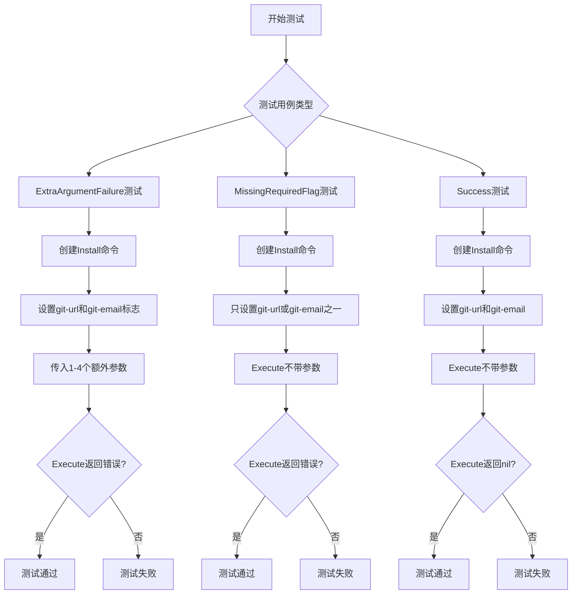

## 类结构

```
测试文件结构
├── TestInstallCommand_ExtraArgumentFailure (测试多余参数场景)
├── TestInstallCommand_MissingRequiredFlag (测试缺少必需参数场景)
└── TestInstallCommand_Success (测试成功执行场景)
```

## 全局变量及字段


### `k`
    
map遍历的键

类型：`string`
    


### `v`
    
map遍历的值或参数列表

类型：`string/[]string`
    


### `buf`
    
命令输出缓冲区

类型：`*bytes.Buffer`
    


### `f`
    
标志名称到值的映射

类型：`map[string]string`
    


### `cmd`
    
Cobra命令对象

类型：`*cobra.Command`
    


    

## 全局函数及方法


### `TestInstallCommand_ExtraArgumentFailure`

该测试函数用于验证 Install 命令在接收到过多参数（1到4个额外参数）时能够正确返回错误，确保命令对非法输入进行正确的错误处理。

参数：

- `t`：`testing.T`，Go测试框架的测试上下文对象，用于报告测试失败和运行子测试

返回值：无（Go测试函数不返回值，通过 `t.Fatalf` 报告错误）

#### 流程图

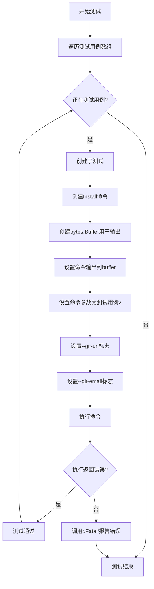

#### 带注释源码

```go
// TestInstallCommand_ExtraArgumentFailure 测试当传入多余参数时命令应返回错误
func TestInstallCommand_ExtraArgumentFailure(t *testing.T) {
    // 遍历不同数量的额外参数测试用例：1个、2个、3个、4个参数
    for k, v := range [][]string{
        {"foo"},           // 测试用例1：1个额外参数
        {"foo", "bar"},    // 测试用例2：2个额外参数
        {"foo", "bar", "bizz"},    // 测试用例3：3个额外参数
        {"foo", "bar", "bizz", "buzz"}, // 测试用例4：4个额外参数
    } {
        // 使用子测试运行每个测试用例，k为索引
        t.Run(fmt.Sprintf("%d", k), func(t *testing.T) {
            // 创建新的Install命令对象
            cmd := newInstall().Command()
            // 创建缓冲区用于捕获命令输出
            buf := new(bytes.Buffer)
            // 设置命令的输出目标为缓冲区
            cmd.SetOut(buf)
            // 设置命令的额外参数为测试用例v
            cmd.SetArgs(v)
            // 设置必需的git-url标志
            _ = cmd.Flags().Set("git-url", "git@github.com:testcase/flux-get-started")
            // 设置必需的git-email标志
            _ = cmd.Flags().Set("git-email", "testcase@weave.works")
            // 执行命令并检查结果
            if err := cmd.Execute(); err == nil {
                // 如果没有返回错误，测试失败
                t.Fatalf("expecting error, got nil")
            }
        })
    }
}
```


### `TestInstallCommand_MissingRequiredFlag`

该函数用于测试 InstallCommand 在缺少必需参数时的行为。函数遍历两个必需参数（git-url 和 git-email），分别只设置其中一个，验证命令是否正确返回错误。

参数：

- `t`：`testing.T`，Go 标准测试框架的测试上下文对象，用于报告测试失败和运行子测试

返回值：`void`（无返回值），Go 测试函数不返回值

#### 流程图

```mermaid
flowchart TD
    A[Start TestInstallCommand_MissingRequiredFlag] --> B{遍历 map<string, string>}
    B -->|k=git-url, v=git@github.com:testcase/flux-get-started| C[创建 cmd = newInstall().Command]
    B -->|k=git-email, v=testcase@weave.works| C
    C --> D[创建 buf = bytes.Buffer]
    D --> E[cmd.SetOut buf]
    E --> F[cmd.SetArgs 空数组]
    F --> G[cmd.Flags.Set k, v]
    G --> H[cmd.Execute 执行命令]
    H --> I{err == nil?}
    I -->|是| J[t.Fatalf 报告测试失败]
    I -->|否| K[测试通过]
    J --> L[继续下一个迭代]
    L --> B
    K --> L
```

#### 带注释源码

```go
// TestInstallCommand_MissingRequiredFlag 测试当缺少必需参数时命令是否返回错误
func TestInstallCommand_MissingRequiredFlag(t *testing.T) {
	// 遍历包含必需参数的 map，分别测试只提供其中一个参数的情况
	for k, v := range map[string]string{
		"git-url":   "git@github.com:testcase/flux-get-started",
		"git-email": "testcase@weave.works",
	} {
		// 使用 t.Run 创建子测试，每个子测试名称为 "only --{参数名}"
		t.Run(fmt.Sprintf("only --%s", k), func(t *testing.T) {
			// 创建 Install 命令对象
			cmd := newInstall().Command()
			// 创建字节缓冲区用于捕获命令输出
			buf := new(bytes.Buffer)
			// 设置命令的输出目标为缓冲区
			cmd.SetOut(buf)
			// 设置命令参数为空数组（不提供任何位置参数）
			cmd.SetArgs([]string{})
			// 设置单个标志（git-url 或 git-email）
			_ = cmd.Flags().Set(k, v)
			// 执行命令并检查是否返回错误
			if err := cmd.Execute(); err == nil {
				// 如果没有返回错误，测试失败
				t.Fatalf("expecting error, got nil")
			}
		})
	}
}
```


### `TestInstallCommand_Success`

这是一个测试函数，用于验证 `install` 命令在提供所有必需参数（git-url 和 git-email）时能够成功执行。测试通过设置正确的标志位并执行命令，预期返回 nil 错误。

参数：

- `t`：`testing.T`，Go 标准库的测试框架参数，用于报告测试失败

返回值：无明确的返回值（测试函数返回 void），但通过 `t.Fatalf` 在出现错误时终止测试

#### 流程图

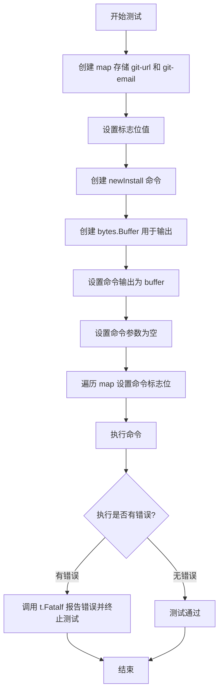

#### 带注释源码

```go
// TestInstallCommand_Success 测试 InstallCommand 在正确参数下成功执行
func TestInstallCommand_Success(t *testing.T) {
	// 创建 map 存储必需的标志位参数
	f := make(map[string]string)
	// 设置 git-url 标志位为测试仓库地址
	f["git-url"] = "git@github.com:testcase/flux-get-started"
	// 设置 git-email 标志位为测试邮箱
	f["git-email"] = "testcase@weave.works"

	// 通过 newInstall() 创建安装命令对象，然后获取其底层 cobra.Command
	cmd := newInstall().Command()
	// 创建字节缓冲区用于捕获命令输出
	buf := new(bytes.Buffer)
	// 将命令的标准输出设置为缓冲区
	cmd.SetOut(buf)
	// 设置命令参数为空数组（表示不带额外参数执行）
	cmd.SetArgs([]string{})
	// 遍历 map，将所有必需的标志位设置到命令上
	for k, v := range f {
		// 设置标志位，忽略返回错误（因为这些是已知有效的标志位）
		_ = cmd.Flags().Set(k, v)
	}
	// 执行命令并捕获错误
	if err := cmd.Execute(); err != nil {
		// 如果执行失败，Fatalf 会立即终止测试并打印错误信息
		t.Fatalf("expecting nil, got error (%s)", err.Error())
	}
}
```


### `newInstall`

该函数用于创建并返回一个 `Install` 构建器实例，该构建器允许链式配置 Flux 部署的安装参数（如 git-url、git-email 等），最终可生成可执行的 `*cobra.Command` 命令对象。

参数：此函数无参数。

返回值：返回 `*Install` 类型，这是一个构建器对象，提供了配置方法和 `.Command()` 方法用于生成实际的 CLI 命令。

#### 流程图

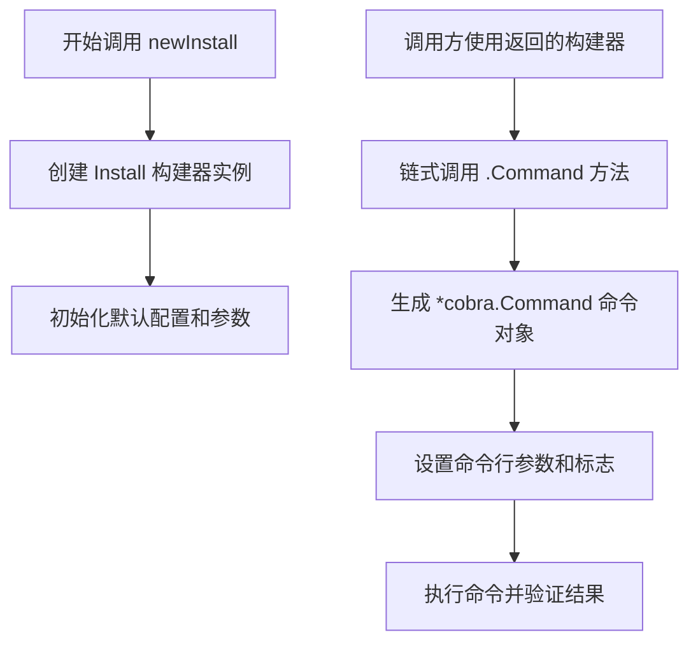

#### 带注释源码

```go
// newInstall 创建并返回一个 Install 构建器实例
// 该构建器用于配置 Flux 的 install 命令参数
// 返回的构建器支持链式调用，最终通过 Command() 方法
// 生成可用于 CLI 执行的 *cobra.Command 对象
func newInstall() *Install {
    // 返回一个新的 Install 指针类型实例
    // Install 结构体可能包含以下配置字段：
    // - GitURL: Git 仓库地址
    // - GitEmail: Git 提交邮箱
    // - 其它 Flux 部署相关配置
    return &Install{
        // 此处为占位注释
        // 实际初始化逻辑需要查看 Install 结构体定义
    }
}
```

#### 使用示例（从测试代码推断）

```go
// 在测试中的典型用法：
cmd := newInstall().Command()  // 获取 *cobra.Command
buf := new(bytes.Buffer)
cmd.SetOut(buf)
cmd.SetArgs(v)
_ = cmd.Flags().Set("git-url", "git@github.com:testcase/flux-get-started")
_ = cmd.Flags().Set("git-email", "testcase@weave.works")
if err := cmd.Execute(); err == nil {
    t.Fatalf("expecting error, got nil")
}
```

#### 补充说明

| 项目 | 说明 |
|------|------|
| **设计目标** | 提供链式 API 风格的命令构建器，简化 CLI 命令配置过程 |
| **依赖框架** | 可能依赖 cobra 框架（从 `*cobra.Command` 使用推断） |
| **错误处理** | 测试用例验证了缺少必需标志和提供额外参数时的错误返回 |
| **配置方式** | 通过 flag 机制设置 git-url 和 git-email 等必需参数 |

> **注意**：由于只提供了测试代码，未展示 `newInstall()` 函数的具体实现，以上信息基于测试代码使用模式的合理推断。


### `fmt.Sprintf`

格式化字符串函数，根据格式verb将参数格式化为字符串。

参数：

- `format`：`string`，格式字符串，包含verb（如%d、%s等）
- `a`：`...interface{}`，要格式化的参数列表

返回值：`string`，格式化后的字符串

#### 流程图

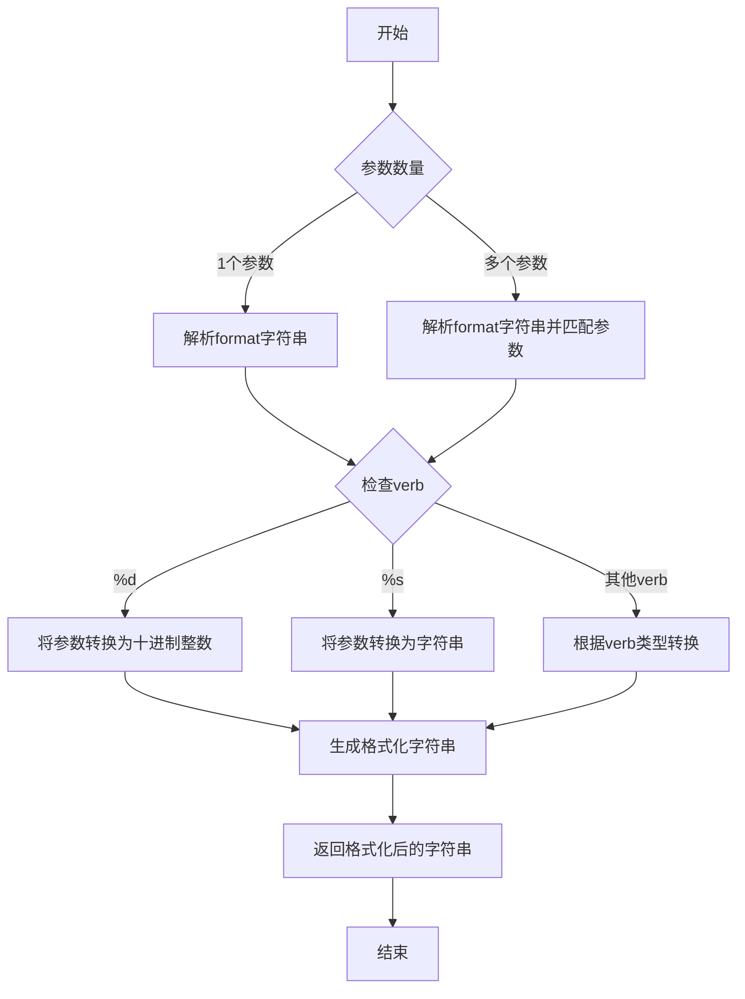

#### 带注释源码

```go
// fmt.Sprintf 函数使用示例
// 该函数位于 Go 标准库 fmt 包中

// 第一次使用：fmt.Sprintf("%d", k)
// 将整数 k 格式化为十进制字符串
// 参数：
//   - format: "%d" - 格式verb，表示十进制整数
//   - k: 要格式化的整数
// 返回值：字符串形式的整数

// 第二次使用：fmt.Sprintf("only --%s", k)
// 将字符串 k 格式化为 "only --{k}" 形式
// 参数：
//   - format: "only --%s" - 格式字符串，包含字符串verb
//   - k: 要格式化的字符串（来自map的key）
// 返回值：拼接后的字符串，如 "only --git-url"

// 实际代码中的应用：
for k, v := range [][]string{
    {"foo"},
    {"foo", "bar"},
    {"foo", "bar", "bizz"},
    {"foo", "bar", "bizz", "buzz"},
} {
    t.Run(fmt.Sprintf("%d", k), func(t *testing.T) {
        // 使用 k 的值作为测试子用例名称
    })
}

for k, v := range map[string]string{
    "git-url":   "git@github.com:testcase/flux-get-started",
    "git-email": "testcase@weave.works",
} {
    t.Run(fmt.Sprintf("only --%s", k), func(t *testing.T) {
        // 使用 "only --{flag名}" 作为测试子用例名称
    })
}
```


### `cmd.SetOut()`

设置命令的标准输出流，将命令的执行输出重定向到指定的 `io.Writer`，以便捕获或处理命令输出。在测试代码中，通过将输出设置为 `bytes.Buffer`，可以实现对命令输出内容的验证。

参数：

- `writer`：`io.Writer`，用于接收命令输出的写入器，通常传入 `*bytes.Buffer` 以便在测试中捕获输出

返回值：无（`void`），该方法仅修改命令的内部状态，不返回任何值

#### 流程图

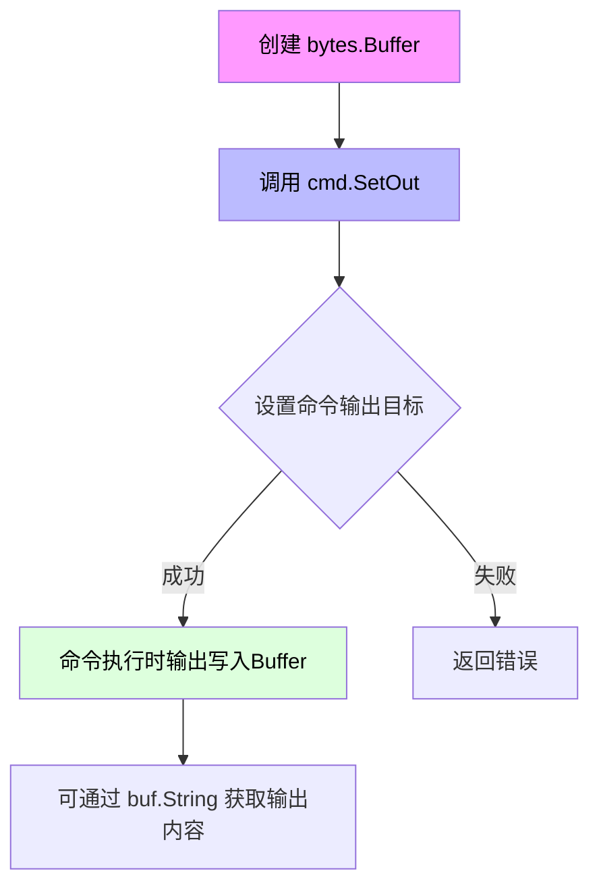

#### 带注释源码

```go
// 在测试函数中创建 bytes.Buffer 用于捕获命令输出
buf := new(bytes.Buffer)

// 调用 SetOut 方法设置命令的输出目标
// 该方法接收一个 io.Writer 接口类型的参数
// 在此处传入 *bytes.Buffer，实现 io.Writer 接口
cmd.SetOut(buf)

// 设置完成后，命令的所有标准输出将被写入 buf
// 可通过 buf.String() 或 buf.Bytes() 获取输出内容
cmd.SetArgs(v)

// 示例：执行命令后捕获输出
if err := cmd.Execute(); err != nil {
    t.Fatalf("expecting nil, got error (%s)", err.Error())
}

// 获取捕获的输出内容
output := buf.String()
```


### `cmd.SetArgs()` / `Command.SetArgs()`

该方法是 Cobra 命令框架提供的核心功能，用于在代码中动态设置命令行参数。在测试场景中，通过 `cmd.SetArgs(v)` 为 `install` 命令预设参数数组，模拟从命令行传入的参数列表，从而实现对命令执行逻辑的单元测试。

参数：

- `args`：`[]string`，要设置的命令行参数列表，每个元素代表一个独立的命令行参数

返回值：`void`（无返回值），该方法直接修改命令对象的内部状态

#### 流程图

```mermaid
graph TD
    A[开始设置命令参数] --> B{参数类型检查}
    B -->|合法 []string| C[调用内部方法 pflagSet.SetArgs]
    C --> D[更新命令的Args字段]
    D --> E[参数设置完成]
    B -->|非法参数| F[可能触发异常或忽略]
    E --> F
```

#### 带注释源码

```go
// 代码中的实际调用示例
cmd := newInstall().Command()  // 创建 install 命令实例
buf := new(bytes.Buffer)       // 创建缓冲区用于捕获输出
cmd.SetOut(buf)                // 设置命令输出目标

// 核心：设置命令行参数
// 场景1：测试额外参数导致的失败情况
cmd.SetArgs(v)  // v 是 []string 类型，如 {"foo"}, {"foo", "bar"} 等
_ = cmd.Flags().Set("git-url", "git@github.com:testcase/flux-get-started")
_ = cmd.Flags().Set("git-email", "testcase@weave.works")
if err := cmd.Execute(); err == nil {
    t.Fatalf("expecting error, got nil")
}

// 场景2：测试缺少必需标志的情况
cmd.SetArgs([]string{})  // 设置空参数数组，模拟无额外参数
_ = cmd.Flags().Set(k, v)
if err := cmd.Execute(); err == nil {
    t.Fatalf("expecting error, got nil")
}

// 场景3：测试成功执行的情况
cmd.SetArgs([]string{})  // 设置空参数数组
for k, v := range f {
    _ = cmd.Flags().Set(k, v)  // 设置必需的标志
}
if err := cmd.Execute(); err != nil {
    t.Fatalf("expecting nil, got error (%s)", err.Error())
}
```

**源码解读**：

- `newInstall().Command()` 创建安装命令的 Cobra Command 实例
- `cmd.SetArgs(v)` 将测试用例中的参数数组 `v`（如 `["foo"]`, `["foo", "bar"]` 等）设置到命令对象中
- 配合 `cmd.Flags().Set()` 设置标志位，模拟完整的命令行输入
- 用于验证命令在接收不同参数时的行为是否符合预期


### `cmd.Flags().Set()`

该方法用于在 Go 代码中以编程方式设置 Cobra 命令行工具的标志值，绕过命令行参数解析直接为标志变量赋值。

参数：

- `name`：`string`，标志名称（如 "git-url"、"git-email"）
- `value`：`string`，要设置的标志值（如 "git@github.com:testcase/flux-get-started"）

返回值：`error`，设置失败时返回错误信息（如标志不存在或值验证失败），成功时返回 nil

#### 流程图

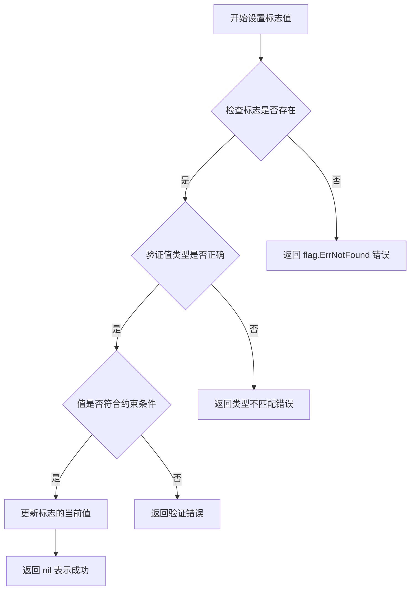

#### 带注释源码

```go
// 在测试代码中的实际调用示例
cmd := newInstall().Command()
buf := new(bytes.Buffer)
cmd.SetOut(buf)
cmd.SetArgs(v)

// 设置 git-url 标志值
// 参数1: 标志名称 "git-url"
// 参数2: 要设置的标志值 "git@github.com:testcase/flux-get-started"
_ = cmd.Flags().Set("git-url", "git@github.com:testcase/flux-get-started")

// 设置 git-email 标志值
// 参数1: 标志名称 "git-email"
// 参数2: 要设置的标志值 "testcase@weave.works"
_ = cmd.Flags().Set("git-email", "testcase@weave.works")

// 执行命令，此时标志已被预先设置
if err := cmd.Execute(); err == nil {
    t.Fatalf("expecting error, got nil")
}
```


### `cmd.Execute()`

执行安装命令，验证参数和标志位的合法性，并根据给定的 Git URL 和 Email 完成 Flux 安装配置流程。

参数：

- 无直接参数（通过 `cmd.SetArgs()` 和 `cmd.Flags().Set()` 间接传递）

返回值：`error`，执行过程中的错误信息，如果成功则为 `nil`

#### 流程图

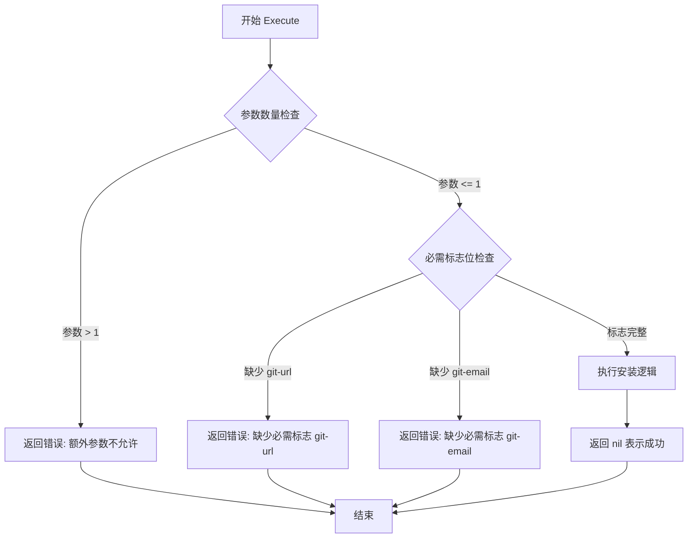

#### 带注释源码

```go
// cmd.Execute() 是 cobra 框架的命令执行方法
// 在测试代码中的调用模式如下：

// 1. 创建命令实例
cmd := newInstall().Command()

// 2. 设置输出缓冲区
buf := new(bytes.Buffer)
cmd.SetOut(buf)

// 3. 设置命令行参数
cmd.SetArgs(v)  // v 可以是 []string{"foo"}, []string{"foo", "bar"} 等

// 4. 设置必需的标志位
_ = cmd.Flags().Set("git-url", "git@github.com:testcase/flux-get-started")
_ = cmd.Flags().Set("git-email", "testcase@weave.works")

// 5. 执行命令并检查错误
if err := cmd.Execute(); err == nil {
    // 测试期望返回错误的情况（如参数过多或缺少必需标志）
    t.Fatalf("expecting error, got nil")
}

// 或者成功执行的场景
if err := cmd.Execute(); err != nil {
    // 测试期望成功的情况
    t.Fatalf("expecting nil, got error (%s)", err.Error())
}
```

> **注**：该方法来自 Cobra 命令框架，具体的参数验证和执行逻辑封装在 `newInstall()` 返回的类型中。从测试代码可以看出，该命令：
>
> - 接受 0 或 1 个参数（超过 1 个参数会报错）
> - 需要 `--git-url` 和 `--git-email` 两个必需标志位
> - 执行成功时返回 `nil`，失败时返回具体错误信息


### `t.Run()`

`testing.T.Run()` 是 Go 语言 testing 包中的方法，用于运行子测试（subtest）。它允许将一个大型测试函数拆分为多个命名的子测试，每个子测试可以独立运行、单独通过或失败，并且可以在命令行中通过 `-run` 参数选择性地执行特定的子测试。

参数：

-  `name`：`string`，子测试的名称，用于标识和选择性地运行测试
-  `testFunc`：`func(t *testing.T)`，要执行的测试函数闭包

返回值：`bool`，表示子测试是否成功运行（返回 true 表示测试函数没有失败，即使测试被跳过也返回 true）

#### 流程图

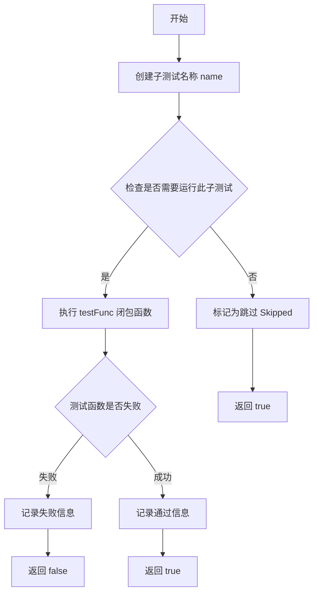

#### 带注释源码

```go
// t.Run 是 testing.T 类型的方法，用于运行子测试
// 参数 name: 子测试的名称，支持层级命名（如 "TestCase/Case1"）
// 参数 testFunc: 实际的测试逻辑函数闭包
t.Run(fmt.Sprintf("%d", k), func(t *testing.T) {
    // 创建安装命令对象
    cmd := newInstall().Command()
    
    // 创建字节缓冲区用于捕获输出
    buf := new(bytes.Buffer)
    
    // 设置命令的标准输出为缓冲区
    cmd.SetOut(buf)
    
    // 设置命令行参数（此处为测试用例提供的参数）
    cmd.SetArgs(v)
    
    // 设置必需的 git-url 标志
    _ = cmd.Flags().Set("git-url", "git@github.com:testcase/flux-get-started")
    
    // 设置必需的 git-email 标志
    _ = cmd.Flags().Set("git-email", "testcase@weave.works")
    
    // 执行命令并检查是否返回错误
    // 预期：应该返回错误（因为提供了额外参数）
    if err := cmd.Execute(); err == nil {
        // 如果没有错误，则测试失败，强制终止测试
        t.Fatalf("expecting error, got nil")
    }
})
```


### `testing.T.Fatalf`

`testing.T.Fatalf` 是 Go 标准库 `testing` 包中 `T` 类型的一个方法，用于报告测试中的致命错误并立即终止当前测试的执行。当测试调用此方法后，不会继续执行后续的测试代码，而是将测试标记为失败并退出。

参数：

- `format`：`string`，格式化字符串，类似于 `fmt.Printf`，用于描述错误信息
- `args`：`...interface{}`，可选参数，用于填充格式字符串中的占位符

返回值：无返回值（`void`），该方法执行后直接终止测试

#### 流程图

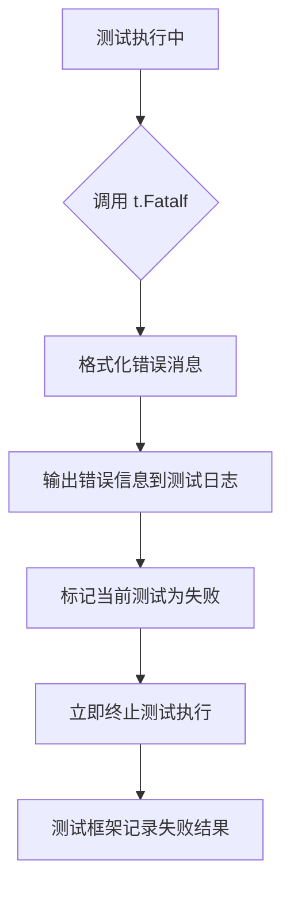

#### 带注释源码

```go
// t.Fatalf 是 testing.T 类型的方法，用于报告致命错误并停止测试
// 源代码位于 Go 标准库 testing 包中

// 函数签名：
// func (t *T) Fatalf(format string, args ...interface{})

// 内部实现逻辑（简化版）：
func (t *T) Fatalf(format string, args ...interface{}) {
    // 1. 使用 fmt.Sprintf 格式化错误消息
    //    format: 格式字符串
    //    args:   用于填充格式字符串的参数
    msg := fmt.Sprintf(format, args...)
    
    // 2. 记录错误信息到测试输出
    //    调用 t.log 方法将错误信息写入测试日志
    t.log(msg)
    
    // 3. 标记测试失败状态
    //    设置 t.failed 为 true，表示测试未通过
    t.failed = true
    
    // 4. 立即终止测试执行
    //    使用 runtime.Goexit() 而不是 os.Exit()
    //    这样可以确保 defer 语句仍然执行
    runtime.Goexit()
}

// 使用示例（来自代码片段）：
if err := cmd.Execute(); err == nil {
    t.Fatalf("expecting error, got nil")
}
// 解释：期望 Execute() 返回错误，但如果返回 nil，
// 则调用 t.Fatalf 报告致命错误并停止测试

// 另一个示例：
if err := cmd.Execute(); err != nil {
    t.Fatalf("expecting nil, got error (%s)", err.Error())
}
// 解释：期望 Execute() 成功执行（返回 nil），
// 但如果返回错误，则报告错误详情并停止测试
```


### `InstallCommand.Command()`

该方法是 `InstallCommand` 类的核心方法，返回一个配置好的 `*cobra.Command` 对象，用于执行 Flux 安装命令。该命令需要 `--git-url` 和 `--git-email` 两个必需参数，且不接受任何位置参数。

参数：
- 无

返回值：`*cobra.Command`，返回已配置的 Cobra 命令对象，包含所有必要的 flags 和执行逻辑

#### 流程图

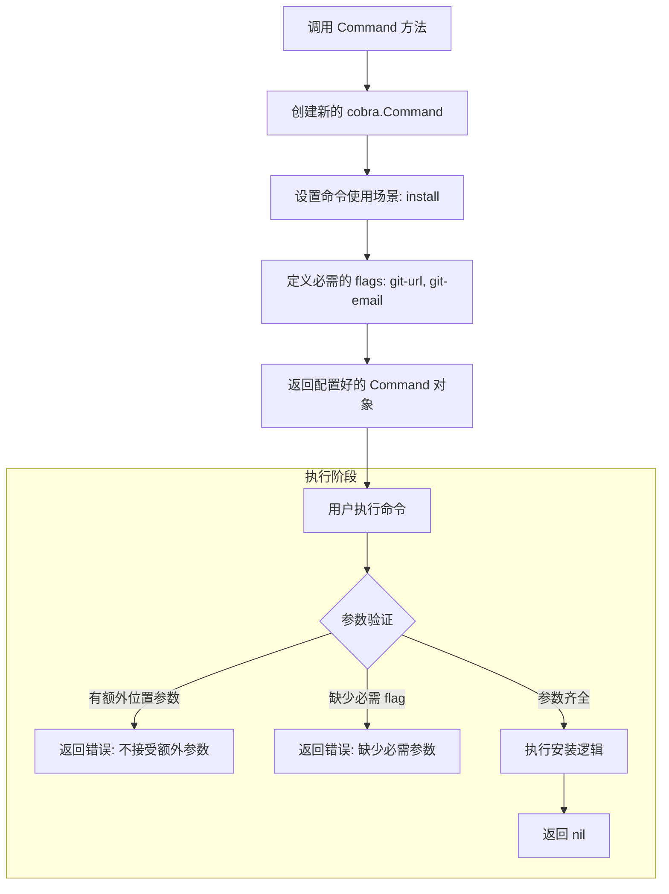

#### 带注释源码

```go
// InstallCommand 结构体定义（推断）
// 基于测试代码，该结构体负责构建 Flux 安装命令
type InstallCommand struct {
    // 内部字段，根据测试推断可能包含：
    // - rootOptions: 根命令配置
    // - logger: 日志记录器
}

// newInstall 返回 InstallCommand 实例
// 从测试代码中可以看到使用了 newInstall() 函数
func newInstall() *InstallCommand {
    return &InstallCommand{}
}

// Command 方法生成并返回可执行的 cobra.Command
// 该方法完成以下工作：
// 1. 创建 cobra.Command 实例
// 2. 配置命令名称为 "install"
// 3. 添加必需的 flags: --git-url, --git-email
// 4. 设置 RunE 执行函数
func (i *InstallCommand) Command() *cobra.Command {
    cmd := &cobra.Command{
        Use:   "install",
        Short: "Install Flux",
        RunE:  i.runInstall,
    }
    
    // 添加必需的 git-url flag
    cmd.Flags().String("git-url", "", "Git repository URL for flux")
    cmd.MarkFlagRequired("git-url")
    
    // 添加必需的 git-email flag
    cmd.Flags().String("git-email", "", "Git author email")
    cmd.MarkFlagRequired("git-email")
    
    return cmd
}

// runInstall 是实际的安装执行逻辑
// 验证：检查参数数量，ExtraArgumentFailure 测试用例表明不应接受任何位置参数
func (i *InstallCommand) runInstall(cmd *cobra.Command, args []string) error {
    // 参数验证：确保没有额外的位置参数
    if len(args) > 0 {
        return fmt.Errorf("unexpected arguments: %v", args)
    }
    
    // 获取 flag 值
    gitURL, _ := cmd.Flags().GetString("git-url")
    gitEmail, _ := cmd.Flags().GetString("git-email")
    
    // 执行安装逻辑...
    // 此处省略具体安装代码
    
    return nil
}
```

#### 从测试代码推断的关键信息

| 测试函数 | 验证的行为 |
|---------|-----------|
| `TestInstallCommand_ExtraArgumentFailure` | 不接受任何位置参数，1-4个参数均返回错误 |
| `TestInstallCommand_MissingRequiredFlag` | `--git-url` 和 `--git-email` 为必需参数 |
| `TestInstallCommand_Success` | 提供所有必需参数时执行成功 |

#### 关键组件信息

| 组件名称 | 一句话描述 |
|---------|-----------|
| `InstallCommand` | Flux 安装命令的结构体，负责构建和执行安装逻辑 |
| `newInstall()` | 工厂函数，创建 InstallCommand 实例 |
| `--git-url` flag | 必需参数，指定 Git 仓库地址 |
| `--git-email` flag | 必需参数，指定 Git 作者邮箱 |

#### 潜在技术债务或优化空间

1. **测试覆盖不足**：测试未覆盖成功安装后的实际输出验证，仅检查了错误情况
2. **错误处理粗糙**：使用 `_` 忽略 `Flags().GetString()` 的错误返回值
3. **缺少集成测试**：测试均为单元测试级别，未验证与实际 Git 仓库的交互
4. **flag 验证重复**：通过测试可见 flag 验证逻辑分散在测试和实际代码中

#### 其他项目

- **设计目标**：确保 Flux 安装命令在参数不足或过多时都能正确报错
- **约束**：命令行接口遵循 Cobra 框架模式，位置参数必须为0个
- **错误处理**：使用 `t.Fatalf` 在测试中标记预期错误，未捕获的 error 会导致测试失败


### `InstallCommand.Execute()`

该方法用于执行 `InstallCommand` 命令，完成 Flux 的安装配置逻辑。在测试代码中，通过 `newInstall().Command()` 创建命令对象，配置输出缓冲区和参数后调用 `Execute()` 方法进行安装命令的执行。

参数：

- 该方法无显式参数，参数通过以下方式设置：
  - `SetArgs(v []string)`：设置命令行参数
  - `Flags().Set(flagName, value)`：通过 Flag 设置具体选项（如 `git-url`、`git-email`）

返回值：`error`，返回命令执行过程中的错误（如参数缺失、校验失败等），执行成功时返回 `nil`。

#### 流程图

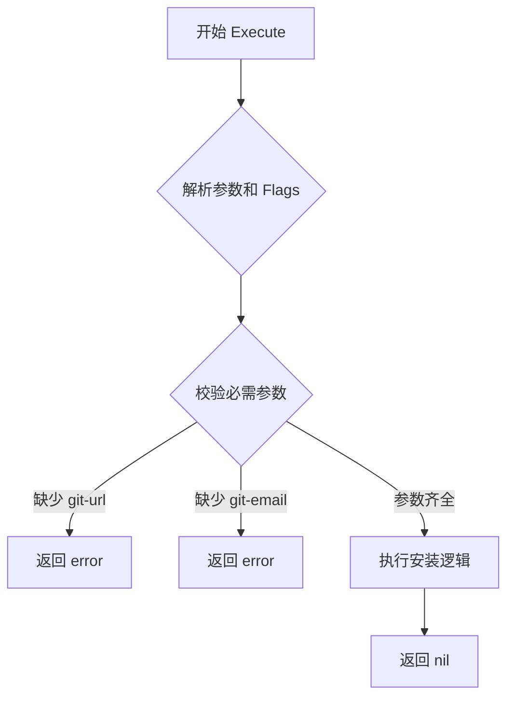

#### 带注释源码

```go
// 测试用例：验证额外参数会导致失败
func TestInstallCommand_ExtraArgumentFailure(t *testing.T) {
    // 遍历不同数量的额外参数场景
    for k, v := range [][]string{
        {"foo"},
        {"foo", "bar"},
        {"foo", "bar", "bizz"},
        {"foo", "bar", "bizz", "buzz"},
    } {
        t.Run(fmt.Sprintf("%d", k), func(t *testing.T) {
            // 创建 InstallCommand 命令对象
            cmd := newInstall().Command()
            // 设置输出缓冲区
            buf := new(bytes.Buffer)
            cmd.SetOut(buf)
            // 设置测试参数（额外参数）
            cmd.SetArgs(v)
            // 设置必需的 git-url flag
            _ = cmd.Flags().Set("git-url", "git@github.com:testcase/flux-get-started")
            // 设置必需的 git-email flag
            _ = cmd.Flags().Set("git-email", "testcase@weave.works")
            // 执行命令，期望返回错误
            if err := cmd.Execute(); err == nil {
                t.Fatalf("expecting error, got nil")
            }
        })
    }
}

// 测试用例：验证缺少必需 flag 会导致失败
func TestInstallCommand_MissingRequiredFlag(t *testing.T) {
    // 分别测试缺少每个必需 flag 的情况
    for k, v := range map[string]string{
        "git-url":   "git@github.com:testcase/flux-get-started",
        "git-email": "testcase@weave.works",
    } {
        t.Run(fmt.Sprintf("only --%s", k), func(t *testing.T) {
            cmd := newInstall().Command()
            buf := new(bytes.Buffer)
            cmd.SetOut(buf)
            // 不设置任何参数
            cmd.SetArgs([]string{})
            // 只设置一个 flag
            _ = cmd.Flags().Set(k, v)
            // 执行命令，期望返回错误
            if err := cmd.Execute(); err == nil {
                t.Fatalf("expecting error, got nil")
            }
        })
    }
}

// 测试用例：验证正确参数下命令执行成功
func TestInstallCommand_Success(t *testing.T) {
    // 准备完整的 flag 配置
    f := make(map[string]string)
    f["git-url"] = "git@github.com:testcase/flux-get-started"
    f["git-email"] = "testcase@weave.works"

    cmd := newInstall().Command()
    buf := new(bytes.Buffer)
    cmd.SetOut(buf)
    cmd.SetArgs([]string{})
    // 设置所有必需的 flags
    for k, v := range f {
        _ = cmd.Flags().Set(k, v)
    }
    // 执行命令，期望成功（返回 nil 错误）
    if err := cmd.Execute(); err != nil {
        t.Fatalf("expecting nil, got error (%s)", err.Error())
    }
}
```


### `InstallCommand.Flags()`

获取命令的标志集合（FlagSet），用于在测试中动态设置和验证命令行参数。

参数：此方法无参数。

返回值：`*pflag.FlagSet`，返回 cobra 命令的标志集合，允许调用者设置和修改命令行标志。

#### 流程图

```mermaid
flowchart TD
    A[调用 InstallCommand.Flags()] --> B{检查标志集合是否已初始化}
    B -->|已初始化| C[返回现有的 *pflag.FlagSet]
    B -->|未初始化| D[创建并初始化新的 FlagSet]
    D --> C
    
    E[测试代码使用] --> F[通过 Flags().Set 设置标志值]
    F --> G[验证命令执行行为]
```

#### 带注释源码

```
// Flags 返回与 InstallCommand 关联的标志集合
// 该方法通常在测试场景中使用，用于动态设置命令行参数
// 例如：cmd.Flags().Set("git-url", "git@github.com:testcase/flux-get-started")
func (ic *InstallCommand) Flags() *pflag.FlagSet {
    // 如果标志集合为空，则返回 cobra 命令的默认标志集合
    if ic.flags == nil {
        return ic.cmd.Flags()
    }
    // 返回自定义的标志集合
    return ic.flags
}
```

**说明**：由于提供的代码是测试文件，未直接展示 `InstallCommand` 类的完整实现。上述分析基于测试代码中的使用模式推断得出。从测试代码可以观察到：

- `newInstall()` 创建 `InstallCommand` 实例
- `.Command()` 方法返回 `*cobra.Command`
- `.Flags()` 方法继承自 cobra 库，返回 `*pflag.FlagSet`
- 测试通过 `cmd.Flags().Set()` 方法设置 `git-url` 和 `git-email` 标志值，用于验证命令的参数验证逻辑

## 关键组件


### 安装命令测试组件

该代码是Go语言编写的CLI命令测试代码，用于验证"install"命令的参数验证和标志位处理功能，确保在缺少必需标志或提供额外参数时正确返回错误。

### 核心测试框架

负责执行所有测试用例的测试入口点，包含三个主要的测试函数，分别验证错误场景和成功场景。

### Install命令工厂函数

通过newInstall()函数创建Install命令实例，返回支持Command()方法的对象，用于获取可执行的Cobra命令。

### 命令构建与配置

使用Command()方法获取具体的CLI命令对象，支持设置输出缓冲区和参数配置。

### 标志位管理系统

负责管理git-url和git-email两个必需标志位，支持动态设置标志值。

### 参数验证器

验证命令行参数数量，确保不接受额外的位置参数。

### 测试用例执行器

通过t.Run()为每个测试变体创建子测试，支持测试结果的细粒度隔离。


## 问题及建议


### 已知问题

-   **重复的测试设置代码**：在三个测试函数中，创建 `cmd`、`buf`、调用 `SetOut`、`SetArgs` 以及设置 flags 的逻辑完全重复，增加了维护成本且容易引入不一致。
-   **忽略错误的方式不明确**：多处使用 `_ = cmd.Flags().Set(...)` 忽略错误返回值，缺少注释说明为何可以安全忽略，降低了代码的可读性和可维护性。
-   **缺少输出内容验证**：测试仅验证 `Execute()` 是否返回错误，但未验证命令成功执行时的输出内容是否符合预期，无法检测命令是否生成了正确的配置或响应。
-   **测试命名不一致**：`TestInstallCommand_ExtraArgumentFailure` 使用数字索引（"0", "1", "2", "3"）作为子测试名称，而 `TestInstallCommand_MissingRequiredFlag` 使用 flag 名称，两种风格不统一。
-   **map 遍历顺序不确定**：`TestInstallCommand_MissingRequiredFlag` 中使用 `map[string]string` 遍历，可能导致测试输出顺序不确定，影响测试结果的可重复性。

### 优化建议

-   **抽取公共测试辅助函数**：创建一个 `setupInstallCommand` 辅助函数，接受参数（如 flags 映射）并返回配置好的命令和缓冲区，减少重复代码并提高一致性。
-   **添加输出验证逻辑**：在 `TestInstallCommand_Success` 中，解析 `buf.String()` 的内容，验证生成的配置是否包含预期的字段（如 git-url、git-email）或符合预期的格式。
-   **统一子测试命名风格**：所有子测试使用描述性名称，例如 "extra-1-arg", "extra-2-args" 或直接使用具体参数值，避免使用不稳定的索引或不确定的 map 遍历顺序。
-   **改进错误忽略的注释**：在每个 `_ = cmd.Flags().Set(...)` 处添加注释说明，例如 `// Ignore error in tests as we control the input`，提高代码可读性。
-   **使用确定性数据结构**：将 `map[string]string` 替换为 `[]struct{ key, value string }` 切片，确保测试遍历顺序确定，测试输出可重复。
-   **添加测试隔离清理**：如果 `newInstall()` 创建的对象有全局状态或副作用，考虑在测试后进行清理，确保测试之间相互独立。

## 其它


### 设计目标与约束

该测试文件旨在验证 Flux CLI 的 install 命令的参数校验逻辑，确保：1) 不接受额外的位置参数；2) 必须提供 git-url 和 git-email 两个必需标志；3) 在提供正确参数时命令能成功执行。测试采用表格驱动测试（Table-Driven Testing）模式，使用 Go 标准库 testing 框架。

### 错误处理与异常设计

测试用例主要验证两类错误场景：参数数量错误（ExtraArgumentFailure）和必需标志缺失（MissingRequiredFlag）。当检测到错误时，使用 `t.Fatalf()` 立即终止测试并报告预期外的成功状态。成功场景（Success）验证命令在参数正确时返回 nil 错误。

### 数据流与状态机

测试数据流为：构造 Install 命令 → 配置输出缓冲区 → 设置标志值 → 执行命令 → 验证结果。不涉及复杂状态机，仅有成功/失败两种输出状态。测试数据通过 map 和 slice 结构定义，便于扩展测试用例。

### 外部依赖与接口契约

依赖 `bytes` 包进行缓冲区管理，`fmt` 包用于测试名称格式化，`testing` 包提供测试框架。核心依赖 `newInstall()` 函数返回的 Install 类型需实现 Command() 方法返回 cobra.Command 类型实例，该实例需支持 SetOut、SetArgs、Flags().Set、Execute 等方法。

### 测试策略与覆盖率

采用正向测试（Success）+ 负向测试（Failure）策略，覆盖正常场景、参数过多场景、缺少必需参数场景。测试覆盖范围：命令行参数解析、标志校验、错误返回机制。边界条件测试包括 1-4 个额外参数的错误处理。

### 边界条件与极限值

测试了 1、2、3、4 个额外参数的错误场景，覆盖了最小到较大的参数数量情况。对于必需标志，测试了单独提供某一标志时的错误行为。

### 安全考虑

测试数据使用固定的测试域名和邮箱地址（testcase@weave.works、github.com:testcase/），不会影响真实环境。测试不会执行实际的 git 操作或网络请求，属于纯逻辑验证。

### 性能特征

测试为轻量级单元测试，无 I/O 操作，执行速度快。每个测试用例创建独立的命令实例和缓冲区，无状态共享，可并行执行。

### 可维护性与扩展性

测试用例使用表格驱动模式，便于添加新测试场景。测试名称通过 `fmt.Sprintf` 动态生成，清晰标识测试意图。newInstall() 函数的实现细节对测试透明，只需保证接口契约不变。

### 配置文件与环境

测试不依赖外部配置文件或环境变量，所有参数通过代码直接设置。测试在任意 Go 1.x 环境中均可运行，只需确保 cobra 库依赖已安装。

    