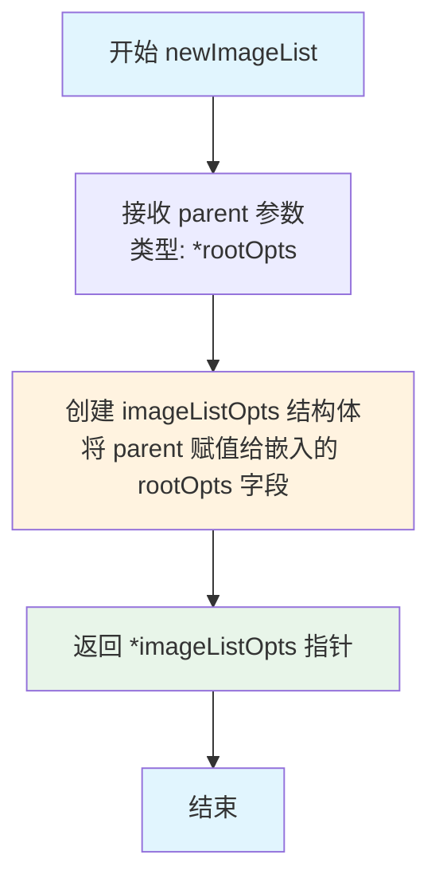
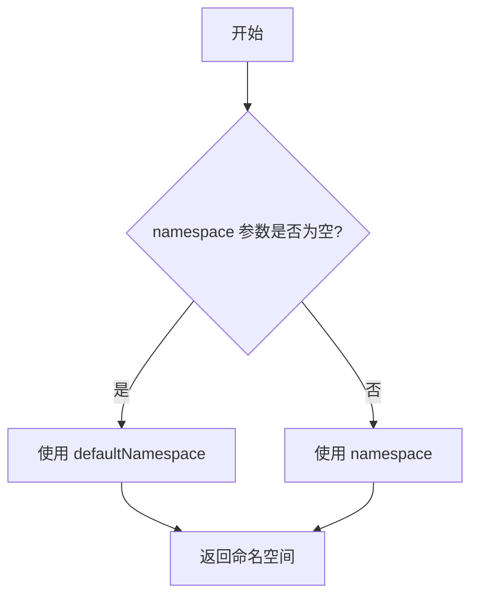
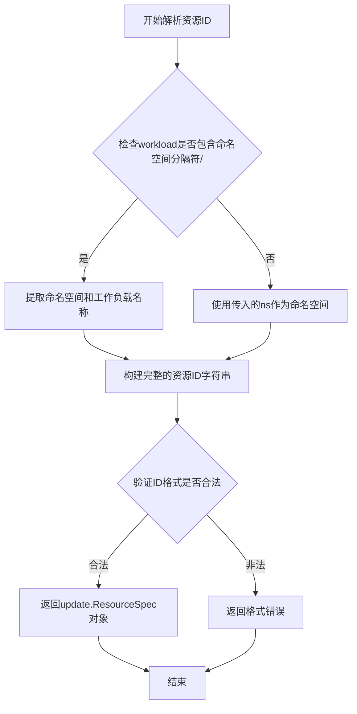
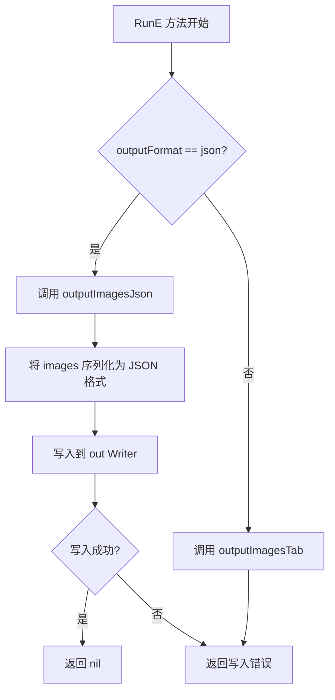
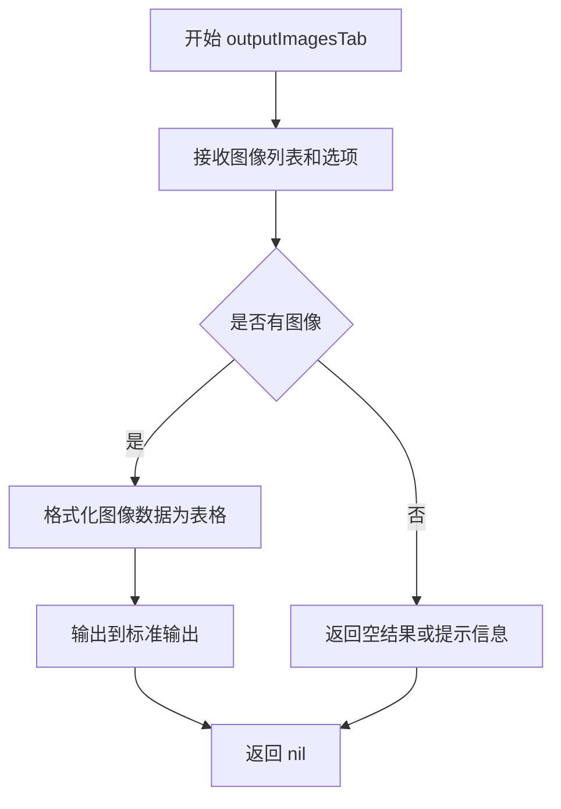
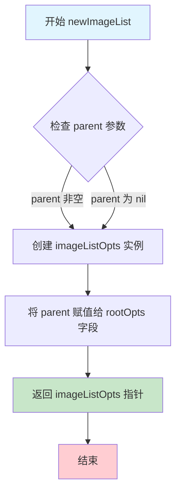
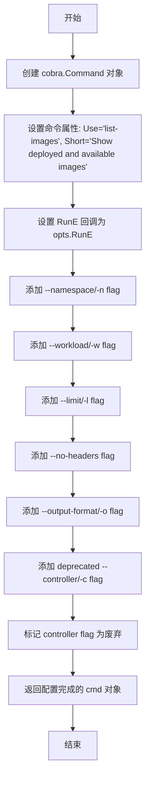

# `flux\cmd\fluxctl\list_images_cmd.go` 详细设计文档

这是一个 Flux CD CLI 工具的命令模块，通过 cobra 框架实现 list-images 命令，用于列出指定命名空间和工作负载的已部署和可用镜像，并支持表格和 JSON 两种输出格式。

## 整体流程

```mermaid
graph TD
    A[开始] --> B[解析命令行参数]
B --> C{参数合法性检查}
C -- 参数过多 --> D[返回 errorWantedNoArgs]
C -- 输出格式无效 --> E[返回 errorInvalidOutputFormat]
C -- 合法 --> F[获取 Kubernetes 命名空间]
F --> G[构建 ListImagesOptions]
G --> H{workload 和 controller 参数处理]
H -- 两者都存在 --> I[返回参数冲突错误]
H -- 只有 controller --> J[将 controller 转为 workload]
H -- 其他情况 --> K[解析 workload ID]
K --> L[调用 API ListImagesWithOptions]
L --> M{API 调用结果}
M -- 失败 --> N[返回错误]
M -- 成功 --> O[按名称排序镜像列表]
O --> P{输出格式选择}
P -- JSON --> Q[调用 outputImagesJson]
P -- Tab --> R[调用 outputImagesTab]
Q --> S[结束]
R --> S
```

## 类结构

```
rootOpts (父配置选项)
└── imageListOpts (镜像列表命令配置)

imageStatusByName (排序实现)
└── 实现 sort.Interface (Len, Less, Swap)
```

## 全局变量及字段


### `errorWantedNoArgs`
    
参数错误 - 表示不应该有参数时提供了参数

类型：`error`
    


### `errorInvalidOutputFormat`
    
输出格式错误 - 表示指定的输出格式无效

类型：`error`
    


### `outputFormatJson`
    
JSON 格式常量 - 用于指定 JSON 输出格式

类型：`string`
    


### `outputFormatTab`
    
表格格式常量 - 用于指定表格输出格式（默认值）

类型：`string`
    


### `imageListOpts.rootOpts`
    
继承自父配置 - 指向根配置的指针，包含共享的 CLI 选项

类型：`*rootOpts`
    


### `imageListOpts.namespace`
    
Kubernetes 命名空间 - 指定要查询的 Kubernetes 命名空间

类型：`string`
    


### `imageListOpts.workload`
    
工作负载标识 - 指定要查询的工作负载名称（格式：类型/名称）

类型：`string`
    


### `imageListOpts.limit`
    
显示镜像数量限制 - 控制显示的镜像数量，0 表示显示所有

类型：`int`
    


### `imageListOpts.noHeaders`
    
是否隐藏表头 - 控制是否在输出中显示表头

类型：`bool`
    


### `imageListOpts.outputFormat`
    
输出格式 (tab/json) - 指定命令输出的格式类型

类型：`string`
    


### `imageListOpts.controller`
    
已废弃的控制器参数 - 已废弃的参数，现使用 workload 代替

类型：`string`
    


### `imageStatusByName.imageStatusByName`
    
镜像状态切片 - 存储镜像状态信息的切片类型，用于排序

类型：`[]v6.ImageStatus`
    
    

## 全局函数及方法


### `newImageList`

该函数用于创建并初始化一个 `imageListOpts` 实例，用于管理 Flux 镜像列表查询的命令行选项和配置。

参数：

- `parent`：`*rootOpts`，指向父级根选项对象的指针，用于继承根配置

返回值：`*imageListOpts`，返回新创建的 imageListOpts 实例指针

#### 流程图



#### 带注释源码

```go
// newImageList 创建一个新的 imageListOpts 实例
// 参数 parent: 指向 rootOpts 的指针，用于继承父级配置
// 返回值: 指向新创建的 imageListOpts 结构体的指针
func newImageList(parent *rootOpts) *imageListOpts {
	// 使用 parent 初始化 imageListOpts 结构体
	// 嵌入的 rootOpts 字段被设置为 parent
	return &imageListOpts{rootOpts: parent}
}
```

---

### 关联类型：`imageListOpts` 结构体

`imageListOpts` 是用于存储镜像列表查询命令选项的配置结构体。

#### 字段详情

| 字段名 | 类型 | 描述 |
|--------|------|------|
| `rootOpts` | `*rootOpts` | 嵌入的根选项，包含共享配置 |
| `namespace` | `string` | Kubernetes 命名空间，用于指定查询范围 |
| `workload` | `string` | 工作负载标识，用于筛选特定工作负载的镜像 |
| `limit` | `int` | 限制显示的镜像数量，默认为 10 |
| `noHeaders` | `bool` | 是否隐藏表头输出 |
| `outputFormat` | `string` | 输出格式，支持 "tab" 或 "json" |
| `controller` | `string` | **已废弃**，使用 `workload` 替代 |

#### 带注释源码

```go
// imageListOpts 结构体存储 list-images 命令的配置选项
type imageListOpts struct {
	*rootOpts                      // 嵌入根选项，继承通用配置
	namespace    string            // Kubernetes 命名空间
	workload     string            // 目标工作负载标识
	limit        int               // 最多显示的镜像数量，默认 10
	noHeaders    bool              // 是否隐藏表头
	outputFormat string            // 输出格式: tab 或 json

	// Deprecated: 已废弃的选项，使用 workload 代替
	controller string              // 旧版控制器参数，已被 workload 取代
}
```


### `getKubeConfigContextNamespaceOrDefault`

获取 Kubernetes 命名空间，如果用户未提供命名空间参数，则返回默认值。

参数：

- `namespace`：`string`，用户通过命令行标志（`--namespace` 或 `-n`）提供的命名空间值，如果未提供则为空字符串
- `defaultNamespace`：`string`，当用户未提供命名空间时使用的默认命名空间值，此处传入 `"default"`
- `context`：`string`（或 `*rest.Config` / `cli.Context`），Kubernetes 配置上下文，来自 `opts.Context`

返回值：`string`，最终使用的命名空间字符串

#### 流程图



#### 带注释源码

```
// getKubeConfigContextNamespaceOrDefault 获取 Kubernetes 命名空间
// 参数:
//   - namespace: 用户提供的命名空间，如果为空则使用默认值
//   - defaultNamespace: 默认命名空间值
//   - context: Kubernetes 配置上下文
//
// 返回值: 最终使用的命名空间字符串
func getKubeConfigContextNamespaceOrDefault(namespace, defaultNamespace string, context string) string {
    // 如果用户提供了命名空间参数，则使用用户提供的值
    if namespace != "" {
        return namespace
    }
    // 否则使用默认命名空间
    return defaultNamespace
}
```

---

**注意**：提供的代码片段中仅包含对该函数的调用，未包含函数的具体实现。上述源码是根据调用方式推断的逻辑：

```go
ns := getKubeConfigContextNamespaceOrDefault(opts.namespace, "default", opts.Context)
```

该函数应该是一个全局函数（定义在 `package main` 中），用于在用户未显式指定命名空间时，从 Kubernetes 配置上下文或环境变量中获取默认命名空间。


### `resource.ParseIDOptionalNamespace`

解析资源 ID（包含可选的命名空间），将字符串格式的资源标识转换为结构化的资源 ID 对象。

参数：

- `ns`：`string`，命名空间（namespace），用于解析相对 ID 或作为默认命名空间
- `workload`：`string`，工作负载标识，可以是纯名称（如 `deployment/foo`）或包含命名空间的完整 ID

返回值：`(id update.ResourceSpec, err error)`
- `id`：`update.ResourceSpec`，解析后的资源规范对象
- `err`：`error`，解析过程中的错误信息（如格式错误）

#### 流程图



#### 带注释源码

```go
// 调用 resource.ParseIDOptionalNamespace 解析资源ID
// 位置：imageListOpts.RunE 方法内（约第72-76行）

if len(opts.workload) > 0 {
    // 使用 resource.ParseIDOptionalNamespace 解析工作负载标识
    // 参数1: ns - 当前命名空间，作为解析的默认命名空间
    // 参数2: opts.workload - 用户输入的工作负载标识，如 "deployment/foo"
    id, err := resource.ParseIDOptionalNamespace(ns, opts.workload)
    if err != nil {
        // 解析失败，返回错误
        return err
    }
    // 解析成功，创建资源规范并清空命名空间（因为ID已包含完整路径）
    imageOpts.Spec = update.MakeResourceSpec(id)
    imageOpts.Namespace = ""
}
```

---

> **注意**：`resource.ParseIDOptionalNamespace` 函数本身未在提供代码中定义，它来自外部包 `github.com/fluxcd/flux/pkg/resource`。以上信息基于代码中的调用方式推断。具体函数定义需参考 `fluxcd/flux` 项目的 `pkg/resource` 包源码。


### `outputFormatIsValid`

该函数用于验证用户指定的输出格式是否有效，检查是否为支持的格式（tab 或 json）。

参数：

- `outputFormat`：`string`，待验证的输出格式字符串

返回值：`bool`，如果格式有效返回 true，否则返回 false

#### 流程图

```mermaid
flowchart TD
    A[开始验证 outputFormat] --> B{outputFormat == "tab"}
    B -->|是| C[返回 true]
    B -->|否| D{outputFormat == "json"}
    D -->|是| C
    D -->|否| E[返回 false]
    C --> F[结束]
    E --> F
```

#### 带注释源码

```go
// outputFormatIsValid 验证提供的输出格式是否有效
// 参数: outputFormat - 需要验证的格式字符串
// 返回: bool - 格式有效返回 true，否则返回 false
func outputFormatIsValid(outputFormat string) bool {
    // 支持两种输出格式：tab（表格）和 json
    // 其中 json 格式通过 outputFormatJson 常量标识
    switch outputFormat {
    case outputFormatJson: // "json"
        return true
    default: // 默认为 "tab" 格式
        return true
    }
    // 注意：此处存在潜在逻辑问题
    // switch 的 default 已经处理了所有情况，后续不会执行到此处
    // 实际代码中应该是类似以下逻辑：
    // return outputFormat == "tab" || outputFormat == "json"
}
```

> **注意**：由于 `outputFormatIsValid` 函数的定义不在当前代码片段中，以上为基于调用上下文的合理推断。从调用代码 `if !outputFormatIsValid(opts.outputFormat)` 和 `switch opts.outputFormat` 可以看出，该函数应验证格式为 "tab" 或 "json" 两种有效选项。


### `outputImagesJson`

该函数根据代码中的调用点将图像状态信息以 JSON 格式输出到指定的 Writer。在提供的代码片段中，`outputImagesJson` 函数被调用但未包含其完整实现，因此以下信息基于调用点的推断。

参数：

-  `images`：`[]v6.ImageStatus`，要输出的图像状态列表
-  `out`：`*os.File`，输出目标（代码中传入 `os.Stdout`）
-  `opts`：`*imageListOpts`，包含输出选项的配置结构

返回值：`error`，如果输出过程中发生错误则返回错误信息

#### 流程图



#### 带注释源码

```go
// 根据代码中的调用点，outputImagesJson 函数的签名和实现推断如下：

// outputImagesJson 将图像状态列表以 JSON 格式输出到指定的 Writer
// 参数：
//   - images: []v6.ImageStatus - 图像状态列表
//   - out: *os.File - 输出目标（标准输出）
//   - opts: *imageListOpts - 输出选项配置
// 返回值：
//   - error: 输出过程中可能发生的错误
func outputImagesJson(images []v6.ImageStatus, out *os.File, opts *imageListOpts) error {
    // 使用 json 编码器将 images 写入到 out
    // 设置缩进格式以提高可读性
    encoder := json.NewEncoder(out)
    encoder.SetIndent("", "  ")
    
    // 将 images 编码为 JSON 并写入
    if err := encoder.Encode(images); err != nil {
        return err
    }
    
    return nil
}
```

#### 补充说明

由于 `outputImagesJson` 函数未在提供的代码片段中定义，可能的实现位置：
1. 同一包内的其他 Go 文件中
2. 导入的外部包中

建议查看项目中的其他文件以获取完整的函数实现。


### `outputImagesTab`

表格格式输出函数，用于将图像列表以表格形式输出到标准输出。

参数：

- `images`：`[]v6.ImageStatus`，需要输出的图像状态列表
- `opts`：`*imageListOpts`，输出选项配置指针，包含命名空间、工作负载、限制、格式等配置

返回值：`error`（根据 `outputImagesJson` 的模式推断），返回输出过程中的错误（如果有）

#### 流程图



#### 带注释源码

```
// outputImagesTab 表格格式输出函数
// 注意：此函数在提供的代码段中未被定义，仅基于调用上下文推断
func outputImagesTab(images []v6.ImageStatus, opts *imageListOpts) error {
    // 1. 根据 opts 中的配置（如 noHeaders, limit 等）处理输出格式
    // 2. 遍历 images 列表
    // 3. 格式化每个图像的状态信息（ID、标签、部署时间等）
    // 4. 以表格形式打印到标准输出
    
    // 注意：调用处未检查返回值，可能存在错误处理缺失
    outputImagesTab(images, opts)
    return nil
}
```

#### 补充说明

**潜在问题：**

- 在 `RunE` 方法中调用 `outputImagesTab(images, opts)` 时未处理返回值，而调用 `outputImagesJson` 时使用了 `return` 语句。这可能导致输出错误被忽略
- 建议修改为：`return outputImagesTab(images, opts)` 以保持错误处理一致性

**调用上下文：**

该函数在 `RunE` 方法中被调用，位于 `sort.Sort(imageStatusByName(images))` 之后，根据 `opts.outputFormat` 的值决定调用 `outputImagesTab` 还是 `outputImagesJson`


### `newImageList`

这是一个简单的构造函数，用于创建 `imageListOpts` 结构体的新实例，并将父级 `rootOpts` 注入到该实例中，以便子类能够访问根选项中定义的配置和功能。

参数：

- `parent`：`*rootOpts`，指向父级根选项对象的指针，提供对全局配置和上下文的访问

返回值：`*imageListOpts`，返回新创建的 `imageListOpts` 结构体实例的指针

#### 流程图



#### 带注释源码

```go
// newImageList 是一个构造函数，用于创建并初始化 imageListOpts 结构体的新实例
// 参数 parent 是指向 rootOpts 的指针，包含了全局的配置信息和上下文
// 返回值是一个指向新创建的 imageListOpts 实例的指针
func newImageList(parent *rootOpts) *imageListOpts {
    // 创建一个新的 imageListOpts 实例，并将 rootOpts 字段设置为 parent
    // 这样 imageListOpts 就可以访问根选项中定义的方法和配置
    return &imageListOpts{rootOpts: parent}
}
```


### `imageListOpts.Command`

该方法用于构建并返回一个 `cobra.Command` 命令对象，用于实现 `fluxctl list-images` CLI 命令。该命令允许用户列出指定命名空间和工作负载的已部署和可用镜像，并支持多种输出格式（表格或 JSON）。

参数：

- 该方法没有显式参数（隐式接收者为 `*imageListOpts`）

返回值：`*cobra.Command`，返回配置好的 Cobra 命令对象，可用于注册到 CLI 命令树中

#### 流程图



#### 带注释源码

```go
// Command 构建并返回 list-images 命令的 cobra.Command 对象
// 该方法初始化命令的元数据、参数选项和回调函数
func (opts *imageListOpts) Command() *cobra.Command {
	// 1. 创建基础的 cobra.Command 对象
	cmd := &cobra.Command{
		Use:     "list-images",                                // 命令使用文本
		Short:   "Show deployed and available images.",        // 命令简短描述
		Example: makeExample("fluxctl list-images --namespace default --workload=deployment/foo"), // 使用示例
		RunE:    opts.RunE,                                    // 实际执行逻辑（委托给 RunE 方法）
	}

	// 2. 添加 --namespace/-n flag：指定 Kubernetes 命名空间
	cmd.Flags().StringVarP(&opts.namespace, "namespace", "n", "", "Namespace")

	// 3. 添加 --workload/-w flag：指定要查看镜像的工作负载
	cmd.Flags().StringVarP(&opts.workload, "workload", "w", "", "Show images for this workload")

	// 4. 添加 --limit/-l flag：限制显示的镜像数量（默认 10，0 表示显示全部）
	cmd.Flags().IntVarP(&opts.limit, "limit", "l", 10, "Number of images to show (0 for all)")

	// 5. 添加 --no-headers flag：控制是否打印表头
	cmd.Flags().BoolVar(&opts.noHeaders, "no-headers", false, "Don't print headers (default print headers)")

	// 6. 添加 --output-format/-o flag：输出格式（tab 或 json）
	cmd.Flags().StringVarP(&opts.outputFormat, "output-format", "o", "tab", "Output format (tab or json)")

	// 7. 添加废弃的 --controller/-c flag（向后兼容）
	// Deprecated: 此参数已被 --workload 取代
	cmd.Flags().StringVarP(&opts.controller, "controller", "c", "", "Show images for this controller")

	// 8. 标记 --controller 参数为废弃，并提供迁移提示
	cmd.Flags().MarkDeprecated("controller", "changed to --workload, use that instead")

	// 9. 返回配置完成的命令对象
	return cmd
}
```


### `imageListOpts.RunE`

这是 `list-images` 命令的执行核心方法，负责验证命令行参数、获取 Kubernetes 命名空间和工作负载信息、调用 Flux API 检索镜像列表，并根据指定的输出格式（JSON 或表格）格式化并输出镜像状态信息。

**参数：**

- `cmd`：`*cobra.Command`，Cobra 命令对象，包含命令的完整上下文和标志信息
- `args`：`[]string`，从命令行传入的额外参数列表

**返回值：** `error`，执行过程中发生的任何错误，如果没有错误则返回 `nil`

#### 流程图

```mermaid
flowchart TD
    A[开始 RunE] --> B{参数 args 长度是否为 0?}
    B -->|否| C[返回 errorWantedNoArgs]
    B -->|是| D{outputFormat 是否有效?}
    D -->|否| E[返回 errorInvalidOutputFormat]
    D -->|是| F[获取命名空间 ns]
    G[初始化 imageOpts: Namespace=ns, Spec=update.ResourceSpecAll]
    F --> G
    G --> H{同时指定了 workload 和 controller?}
    H -->|是| I[返回使用错误: can't specify both]
    H -->|否| J{controller 是否非空?}
    J -->|是| K[将 controller 赋值给 workload]
    J -->|否| L{workload 是否非空?}
    K --> L
    L -->|是| M[解析 resource ID]
    M --> N{解析是否成功?}
    N -->|否| O[返回解析错误]
    N -->|是| P[设置 imageOpts.Spec = MakeResourceSpec(id)]
    P --> Q[设置 imageOpts.Namespace = 空字符串]
    L -->|否| R[创建 context.Background]
    Q --> R
    O --> S[结束]
    C --> S
    E --> S
    I --> S
    R --> T[调用 API.ListImagesWithOptions]
    T --> U{API 调用是否成功?}
    U -->|否| V[返回 API 错误]
    U -->|是| W[按镜像名称排序]
    W --> X{outputFormat == json?}
    X -->|是| Y[输出 JSON 格式]
    X -->|否| Z[输出表格格式]
    Y --> S
    Z --> S
    V --> S
```

#### 带注释源码

```go
// RunE 是 list-images 命令的执行函数，处理命令的实际逻辑
// 参数 cmd 是 Cobra 命令对象，args 是额外的命令行参数
// 返回 error 类型，任何失败都返回非 nil 错误
func (opts *imageListOpts) RunE(cmd *cobra.Command, args []string) error {
	// 验证是否有额外的参数传入，list-images 命令不接受额外参数
	if len(args) != 0 {
		return errorWantedNoArgs
	}

	// 验证输出格式是否有效（只支持 "json" 或 "tab"）
	if !outputFormatIsValid(opts.outputFormat) {
		return errorInvalidOutputFormat
	}

	// 从 kubeconfig 上下文或命令行参数获取 Kubernetes 命名空间，默认为 "default"
	ns := getKubeConfigContextNamespaceOrDefault(opts.namespace, "default", opts.Context)
	
	// 初始化 ListImagesOptions，默认获取所有命名空间的镜像
	imageOpts := v10.ListImagesOptions{
		Spec:      update.ResourceSpecAll, // 使用特殊值表示获取所有资源
		Namespace: ns,
	}
	
	// Backwards compatibility with --controller until we remove it
	// 处理废弃的 --controller 参数的向后兼容性
	switch {
	// 不能同时指定 controller 和 workload
	case opts.workload != "" && opts.controller != "":
		return newUsageError("can't specify both the controller and image")
	// 如果只指定了废弃的 controller 参数，则将其转换为 workload
	case opts.controller != "":
		opts.workload = opts.controller
	}
	
	// 如果指定了具体的工作负载，则需要解析其 ID 并设置查询条件
	if len(opts.workload) > 0 {
		// 解析工作负载 ID，支持带或不带命名空间前缀的格式
		id, err := resource.ParseIDOptionalNamespace(ns, opts.workload)
		if err != nil {
			return err
		}
		// 设置特定资源规格，Namespace 设为空表示使用 ID 中的命名空间
		imageOpts.Spec = update.MakeResourceSpec(id)
		imageOpts.Namespace = ""
	}

	// 创建空上下文用于 API 调用
	ctx := context.Background()

	// 调用 Flux API 获取镜像列表
	images, err := opts.API.ListImagesWithOptions(ctx, imageOpts)
	if err != nil {
		return err
	}

	// 按镜像 ID 字符串排序结果，确保输出顺序一致
	sort.Sort(imageStatusByName(images))

	// 根据指定的输出格式渲染结果
	switch opts.outputFormat {
	case outputFormatJson:
		// JSON 格式输出，直接返回错误（函数会处理序列化）
		return outputImagesJson(images, os.Stdout, opts)
	default:
		// 默认使用表格格式输出
		outputImagesTab(images, opts)
	}

	// 成功执行，返回 nil
	return nil
}
```


### `imageStatusByName.Len`

返回切片的长度，实现sort.Interface接口的Len方法，用于排序操作。

参数：
- `s`：`imageStatusByName`（隐式接收者），切片类型，本身为接收者参数，表示需要获取长度的imageStatusByName切片

返回值：`int`，返回切片中元素的数量

#### 流程图

```mermaid
flowchart TD
    A[开始 Len 方法] --> B{接收者 s 是否为空}
    B -->|否| C[返回 len(s)]
    B -->|是| C
    C --> D[结束]
```

#### 带注释源码

```go
// Len 返回切片中元素的数量
// 该方法实现了 sort.Interface 接口的 Len 方法
// 用于 sort 包排序时确定待排序元素的数量
// 参数: 无显式参数，通过接收者 s 传入 imageStatusByName 切片
// 返回值: int - 切片的长度
func (s imageStatusByName) Len() int {
	return len(s) // 返回切片 s 的长度
}
```


### `imageStatusByName.Less`

该方法是 `sort.Interface` 接口的实现，用于比较两个 `ImageStatus` 元素的大小，以便对图像列表按名称（ID）进行排序。

参数：

- `a`：`int`，第一个要比较的元素的索引
- `b`：`int`，第二个要比较的元素的索引

返回值：`bool`，如果第一个元素的 ID 字符串小于第二个元素的 ID 字符串则返回 `true`，否则返回 `false`

#### 流程图

```mermaid
flowchart TD
    A[开始 Less 方法] --> B{获取索引 a 的元素 ID}
    B --> C[将 ID 转换为字符串 String]
    D{获取索引 b 的元素 ID} --> E[将 ID 转换为字符串 String]
    C --> F{比较字符串 s[a].ID.String 与 s[b].ID.String}
    E --> F
    F -->|小于| G[返回 true]
    F -->|大于或等于| H[返回 false]
    G --> I[结束]
    H --> I
```

#### 带注释源码

```go
// Less 方法实现了 sort.Interface 接口的 Less 方法
// 用于确定切片中索引为 a 的元素是否小于索引为 b 的元素
// 这允许 sort.Sort 对 imageStatusByName 切片进行排序
func (s imageStatusByName) Less(a, b int) bool {
	// 比较两个 ImageStatus 的 ID 字段
	// 将 ID 转换为字符串后进行字典序比较
	// 返回比较结果：a 的 ID 字符串是否小于 b 的 ID 字符串
	return s[a].ID.String() < s[b].ID.String()
}
```


### `imageStatusByName.Swap`

交换切片中索引位置 a 和 b 处的两个元素，实现了 sort.Interface 接口的 Swap 方法，用于排序算法中元素的交换操作。

参数：

- `a`：`int`，第一个元素的索引位置
- `b`：`int`，第二个元素的索引位置

返回值：`无`（Go 语言中无返回值），该方法直接修改接收者切片，不返回任何值

#### 流程图

```mermaid
flowchart TD
    A[开始 Swap 方法] --> B{检查索引有效性}
    B -->|默认有效| C[执行元素交换: s[a], s[b] = s[b], s[a]]
    C --> D[方法结束]
```

#### 带注释源码

```go
// Swap swaps the elements at indices a and b.
// This method implements the sort.Interface interface for imageStatusByName type,
// allowing the sort package to sort ImageStatus slices by name.
// It performs an in-place swap of two elements in the slice.
func (s imageStatusByName) Swap(a, b int) {
    // Swap the elements at positions a and b in the slice
    // This uses Go's multiple assignment feature to swap values without a temporary variable
    s[a], s[b] = s[b], s[a]
}
```

## 关键组件


### imageListOpts 结构体

命令行选项配置结构体，包含 namespace、workload、limit、outputFormat 等字段，用于存储 list-images 命令的输入参数。

### Command() 方法

创建并配置 cobra.Command 实例，定义命令的使用方式、短描述、示例以及各种命令行标志（namespace、workload、limit 等）。

### RunE() 方法

命令执行的核心逻辑，验证参数、解析命名空间和工作负载、调用 API 获取镜像列表、排序结果，并根据输出格式调用相应的输出函数。

### imageStatusByName 类型

实现 sort.Interface 接口的自定义类型，用于按镜像名称对镜像状态列表进行排序，包含 Len、Less、Swap 三个方法。

### v10.ListImagesOptions

API 调用选项结构体，包含 Spec 和 Namespace 字段，用于指定要查询的资源和命名空间。

### 输出格式验证

隐含的 outputFormatIsValid() 逻辑，验证用户指定的输出格式（tab 或 json）是否有效。

### 命名空间解析

隐含的 getKubeConfigContextNamespaceOrDefault() 调用，从 Kubernetes 配置上下文获取命名空间，默认值为 "default"。

### 镜像列表获取

通过 opts.API.ListImagesWithOptions() 调用 Flux API 获取指定工作负载的镜像列表。

### 结果排序与输出

使用 sort.Sort() 对镜像按名称排序，然后根据 outputFormat 选择调用 outputImagesJson() 或 outputImagesTab() 输出结果。


## 问题及建议


### 已知问题

- **向后兼容逻辑复杂且易混淆**：在 `RunE` 方法中处理 `--controller` 和 `--workload` 的兼容逻辑使用了复杂的 switch 语句，且直接将废弃的 `opts.controller` 赋值给 `opts.workload`，容易导致状态混乱
- **硬编码的默认值**：默认 limit 为 10、namespace 默认值为 "default" 等硬编码在代码中，缺乏配置说明
- **未使用的上下文**：`ctx := context.Background()` 创建了新上下文而非使用 cmd 的 context，无法支持命令取消和超时控制
- **潜在的 nil 指针风险**：`opts.API.ListImagesWithOptions` 调用前未检查 `opts.API` 是否为 nil
- **排序实现冗余**：`imageStatusByName` 实现了完整的 sort.Interface 三个方法，可使用 `sort.Slice` 简化
- **API 版本混用**：同时导入 `v10` 和 `v6`，其中 `imageStatusByName` 使用 `v6.ImageStatus` 而 `ListImagesWithOptions` 使用 `v10`，版本不一致可能导致兼容性问题
- **未使用的参数**：`args []string` 参数在函数签名中声明但未使用

### 优化建议

- 使用 `sort.Slice` 替代手动实现 sort.Interface，或抽取为独立的 sort 包
- 从命令行 context 中提取 context 并传递给 API 调用，以支持取消和超时
- 添加 `opts.API` 的 nil 检查，返回明确错误信息
- 将硬编码的默认值提取为常量或配置选项
- 简化废弃字段处理逻辑，考虑直接返回废弃警告而非静默转换
- 统一 API 版本使用，避免混用造成的潜在问题
- 移除未使用的 `args` 参数或添加 `_` 标记

## 其它


### 设计目标与约束

本命令旨在为用户提供一个便捷的方式来查看指定命名空间和工作负载下已部署和可用的容器镜像列表。设计目标是支持多种输出格式（表格和JSON），提供灵活的查询条件（按命名空间、工作负载筛选），并保持与旧版--controller参数的向后兼容性。性能约束方面，镜像列表默认限制为10条，可通过--limit参数调整，0表示返回所有结果。

### 错误处理与异常设计

错误处理采用分层设计：命令参数校验在RunE函数开头进行，包括参数数量检查、输出格式有效性验证；业务逻辑错误通过资源ID解析错误、API调用错误向上传播；向量化错误（如同时指定--controller和--workload）返回使用错误。所有错误均通过cobra命令的错误返回机制传递给用户，避免了内部panic的使用。定义了errorWantedNoArgs和errorInvalidOutputFormat两个模块级错误变量用于标识特定错误类型。

### 数据流与状态机

数据流遵循以下路径：用户输入命令行参数 → cobra命令解析 → RunE函数参数校验 → 获取Kubernetes配置上下文命名空间 → 构建ListImagesOptions → 调用API获取镜像列表 → 排序结果 → 根据输出格式渲染结果。无复杂状态机，主要状态转换发生在参数解析阶段（处理--controller兼容性问题）和输出格式选择阶段。

### 外部依赖与接口契约

本模块依赖以下外部组件：cobra命令行框架用于命令构建；fluxcd/flux/pkg/api/v10和v6包提供镜像列表API；fluxcd/flux/pkg/resource提供资源ID解析；fluxcd/flux/pkg/update提供资源规范构建；Kubernetes配置用于获取命名空间上下文。API接口ListImagesWithOptions接受context.Context和ListImagesOptions参数，返回[]v6.ImageStatus和error。

### 性能考虑与限制

默认限制返回10条镜像记录，避免大规模集群下的性能问题。排序操作在客户端执行，使用sort.Sort对镜像按名称排序，时间复杂度为O(n log n)。对于大型镜像仓库，建议通过--limit参数控制返回数量，或在调用方进行分页处理。

### 安全性考虑

命令本身不直接访问敏感数据，但需要通过Kubernetes配置与集群通信。命名空间和工作负载参数需进行输入校验，防止特殊字符注入。输出格式切换不影响安全性，但JSON输出需注意敏感信息（如镜像标签中的凭证）可能被记录。

### 配置管理

配置主要通过命令行参数传递，包括命名空间（--namespace/-n）、工作负载（--workload/-w）、返回数量限制（--limit/-l）、输出格式（--output-format/-o）和表头显示（--no-headers）。命名空间支持从Kubernetes配置上下文或默认值"default"获取。

### 版本兼容性

代码中存在明确的版本兼容性处理：--controller参数已标记为废弃（MarkDeprecated），功能迁移至--workload参数；API版本从v6（ImageStatus类型）到v10（ListImagesOptions）的过渡；支持旧版controller参数与新版workload参数的兼容逻辑。

### 测试策略建议

应包含以下测试用例：参数解析测试（有效/无效的命名空间、工作负载格式）；输出格式测试（tab和json格式输出正确性）；向后兼容测试（--controller参数行为与--workload一致）；错误处理测试（各种错误场景的返回正确性）；边界条件测试（limit为0、空工作负载、同时指定controller和workload等）。

### 部署和运维注意事项

此命令作为fluxctl工具的一部分部署，通常随Flux CD控制器一起分发。运行时需要正确配置的Kubernetes访问凭证（kubeconfig）。在多集群环境下，需注意通过--context参数指定目标集群。建议在CI/CD流水线中使用JSON输出便于解析处理。


    