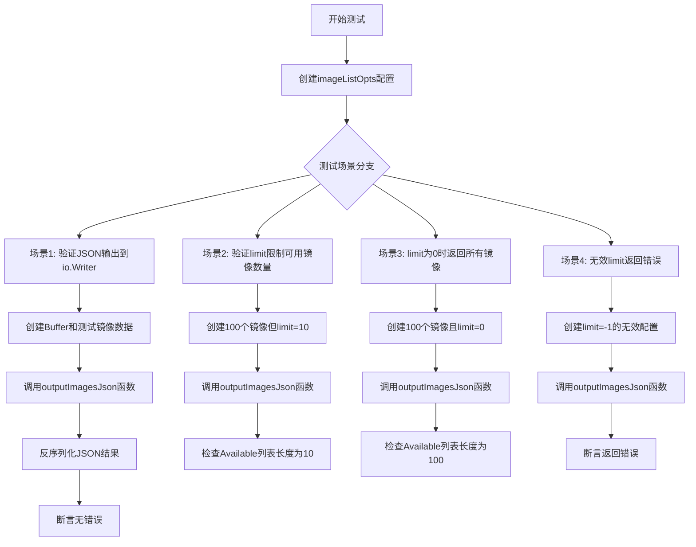
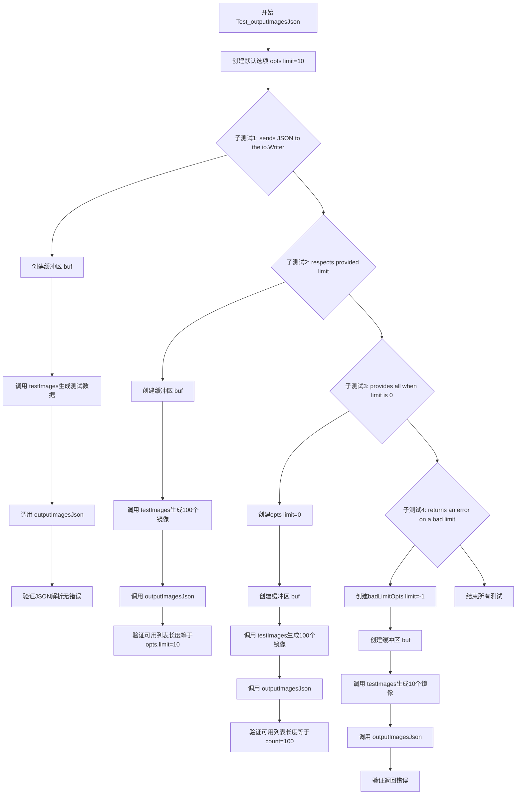
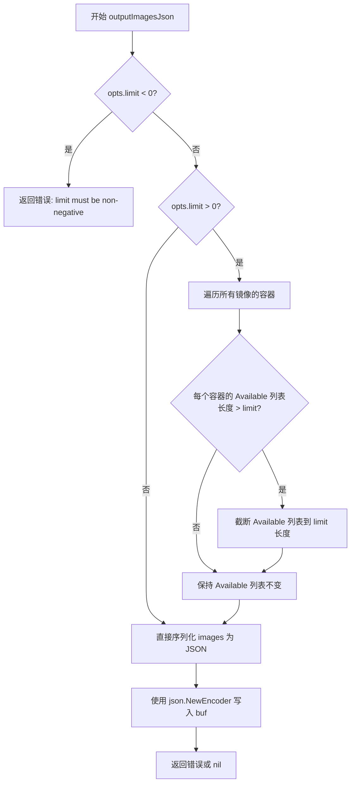
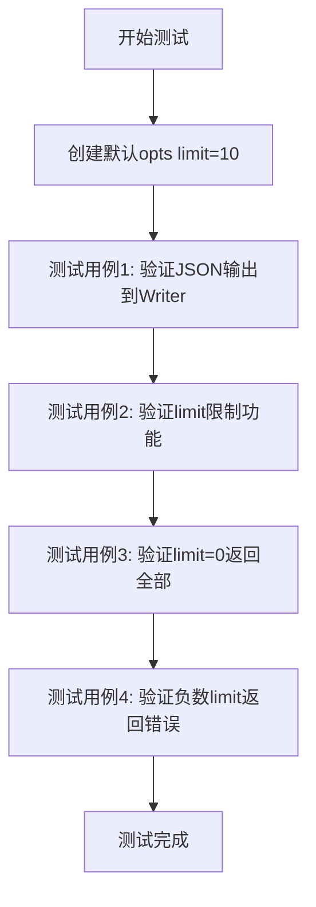

# `flux\cmd\fluxctl\list_images_cmd_test.go` 详细设计文档

这是一个Go语言测试文件，用于测试fluxcd/flux项目中镜像列表的JSON输出功能。代码主要验证outputImagesJson函数能否正确将镜像状态列表序列化为JSON格式，并正确处理limit参数来限制可用容器镜像的数量，同时处理无效limit值返回错误的场景。

## 整体流程



## 类结构

```
测试文件 (无类结构)
├── Test_outputImagesJson (主测试函数)
│   ├── 子测试: sends JSON to the io.Writer
│   ├── 子测试: respects provided limit on Available container images
│   ├── 子测试: provides all when limit is 0
│   └── 子测试: returns an error on a bad limit
└── testImages (辅助测试函数)
```

## 全局变量及字段


### `opts`
    
测试配置选项，包含limit参数用于限制镜像列表数量

类型：`*imageListOpts`
    


### `buf`
    
内存缓冲区，用于接收JSON输出内容

类型：`*bytes.Buffer`
    


### `images`
    
镜像状态列表，包含容器及其可用镜像信息

类型：`[]v6.ImageStatus`
    


### `unmarshallTarget`
    
反序列化目标指针，用于解析JSON输出为镜像状态切片

类型：`*[]v6.ImageStatus`
    


### `imageSlice`
    
从反序列化结果中提取的镜像切片，用于断言验证

类型：`[]v6.ImageStatus`
    


### `availableListSize`
    
可用镜像列表的实际长度，用于验证limit是否生效

类型：`int`
    


### `containerWithAvailable`
    
带可用镜像的容器列表，用于构建测试数据

类型：`[]v6.Container`
    


### `available`
    
可用镜像集合，按排序方式存储测试镜像信息

类型：`update.SortedImageInfos`
    


### `testImage`
    
测试用镜像信息对象，包含ID、摘要、标签等元数据

类型：`image.Info`
    


### `digest`
    
镜像摘要字符串，用于唯一标识镜像内容

类型：`string`
    


### `imageID`
    
镜像ID字符串，用于标识具体镜像

类型：`string`
    


### `count`
    
镜像总数，用于测试limit为0时返回全部镜像的场景

类型：`int`
    


### `badLimitOpts`
    
无效limit配置选项，用于测试错误处理场景

类型：`*imageListOpts`
    


    

## 全局函数及方法


### `Test_outputImagesJson`

这是一个Go语言的测试函数，用于验证`outputImagesJson`函数的各项功能，包括JSON序列化输出、容器镜像可用列表的限制功能、limit为0时返回全部镜像以及错误limit值的处理。

参数：

- `t`：`testing.T`，Go测试框架的标准参数，用于报告测试失败和记录测试状态

返回值：无（测试函数无返回值，直接通过`t`参数报告测试结果）

#### 流程图



#### 带注释源码

```go
// Test_outputImagesJson 是 outputImagesJson 函数的主测试函数
// 包含四个子测试用例，验证 JSON 输出、限制功能、零限制和错误限制处理
func Test_outputImagesJson(t *testing.T) {
	// 创建默认选项，limit=10（来自flag的默认值）
	opts := &imageListOpts{limit: 10}

	// 子测试1：验证 JSON 输出到 io.Writer
	t.Run("sends JSON to the io.Writer", func(t *testing.T) {
		// 创建缓冲区用于接收输出
		buf := &bytes.Buffer{}
		// 生成测试镜像数据
		images := testImages(opts.limit)
		// 调用被测试的函数
		err := outputImagesJson(images, buf, opts)
		// 验证无错误发生
		require.NoError(t, err)
		// 创建反序列化目标结构
		unmarshallTarget := &[]v6.ImageStatus{}
		// 验证 JSON 能正确反序列化
		err = json.Unmarshal(buf.Bytes(), unmarshallTarget)
		require.NoError(t, err)
	})

	// 子测试2：验证提供的限制对可用容器镜像生效
	t.Run("respects provided limit on Available container images", func(t *testing.T) {
		buf := &bytes.Buffer{}
		// 生成100个镜像用于测试限制功能
		images := testImages(100)
		_ = outputImagesJson(images, buf, opts)

		unmarshallTarget := &[]v6.ImageStatus{}
		_ = json.Unmarshal(buf.Bytes(), unmarshallTarget)

		// 获取第一个镜像的第一个容器的可用列表大小
		imageSlice := *unmarshallTarget
		availableListSize := len(imageSlice[0].Containers[0].Available)

		// 断言可用列表大小等于选项中的限制值
		assert.Equal(t, opts.limit, availableListSize)
	})

	// 子测试3：验证 limit 为 0 时返回所有镜像
	t.Run("provides all when limit is 0", func(t *testing.T) {
		buf := &bytes.Buffer{}
		// 0 表示返回所有镜像
		opts := &imageListOpts{limit: 0}
		count := 100
		images := testImages(count)
		_ = outputImagesJson(images, buf, opts)

		unmarshallTarget := &[]v6.ImageStatus{}
		_ = json.Unmarshal(buf.Bytes(), unmarshallTarget)

		imageSlice := *unmarshallTarget
		availableListSize := len(imageSlice[0].Containers[0].Available)

		// 断言可用列表大小等于总数
		assert.Equal(t, count, availableListSize)
	})

	// 子测试4：验证错误 limit 返回错误
	t.Run("returns an error on a bad limit", func(t *testing.T) {
		// -1 是无效的限制值
		badLimitOpts := &imageListOpts{limit: -1}
		buf := &bytes.Buffer{}
		images := testImages(10)
		// 调用函数并验证返回错误
		err := outputImagesJson(images, buf, badLimitOpts)
		assert.Error(t, err)
	})
}
```


### `testImages`

该函数是一个测试辅助函数，用于生成包含指定数量可用容器镜像的 `ImageStatus` 切片，常用于测试 `outputImagesJson` 函数的 JSON 输出功能。

参数：

- `availableCount`：`int`，表示要生成的可用容器镜像（Available images）的数量

返回值：`[]v6.ImageStatus`，返回包含单个容器且该容器拥有指定数量可用镜像的 ImageStatus 切片

#### 流程图

```mermaid
flowchart TD
    A[开始 testImages] --> B[创建 containerWithAvailable 容器切片]
    B --> C[创建 images ImageStatus 切片]
    C --> D[初始化 available 为空的 SortedImageInfos]
    D --> E{循环 i = 0 到 availableCount-1}
    E -->|是| F[生成 digest: abc123{i}]
    F --> G[生成 imageID: deadbeef{i}]
    G --> H[创建 testImage]
    H --> I[将 testImage 追加到 available]
    I --> E
    E -->|否| J[将 available 赋值给 images[0].Containers[0].Available]
    J --> K[返回 images]
    K --> L[结束]
```

#### 带注释源码

```go
// testImages 返回一个包含单个 ImageStatus 对象的切片，
// 该对象包含一个容器，容器中包含指定数量的 Available 镜像
// 用于测试 outputImagesJson 函数的 JSON 输出功能
func testImages(availableCount int) []v6.ImageStatus {
	// 1. 创建一个单元素的容器切片，包含测试容器
	containerWithAvailable := []v6.Container{{Name: "TestContainer"}}

	// 2. 创建包含单个 ImageStatus 的切片
	images := []v6.ImageStatus{{Containers: containerWithAvailable}}

	// 3. 初始化空的可用镜像列表
	available := update.SortedImageInfos{}

	// 4. 循环生成指定数量的可用镜像
	for i := 0; i < availableCount; i++ {
		// 生成镜像摘要
		digest := fmt.Sprintf("abc123%d", i)
		// 生成镜像 ID
		imageID := fmt.Sprintf("deadbeef%d", i)

		// 创建测试用的镜像信息对象
		testImage := image.Info{
			ID:          image.Ref{},       // 镜像引用
			Digest:      digest,            // 镜像摘要
			ImageID:     imageID,           // 镜像 ID
			Labels:      image.Labels{},    // 镜像标签
			CreatedAt:   time.Time{},       // 创建时间
			LastFetched: time.Time{},       // 最后获取时间
		}

		// 将测试镜像添加到可用镜像列表
		available = append(available, testImage)
	}

	// 5. 将可用镜像列表赋值给第一个容器的 Available 字段
	images[0].Containers[0].Available = available

	// 6. 返回生成的 ImageStatus 切片
	return images
}
```


### `outputImagesJson`

该函数将图像状态列表序列化为 JSON 格式并写入指定的 io.Writer，同时根据选项中的限制参数过滤可用容器镜像列表。

参数：

- `images`：`[]v6.ImageStatus`，包含容器镜像状态的切片
- `buf`：`io.Writer`，用于输出 JSON 数据的写入器
- `opts`：`*imageListOpts`，包含限制条件的选项结构体指针

返回值：`error`，执行过程中发生的错误（如限制值无效或 JSON 序列化失败）

#### 流程图



#### 带注释源码

```go
// outputImagesJson 将图像状态列表序列化为 JSON 并写入 io.Writer
// 参数:
//   - images: []v6.ImageStatus - 包含容器镜像状态的切片
//   - buf: io.Writer - 用于输出 JSON 数据的写入器
//   - opts: *imageListOpts - 包含限制条件的选项结构体指针
//
// 返回值:
//   - error: 执行过程中发生的错误
func outputImagesJson(images []v6.ImageStatus, buf io.Writer, opts *imageListOpts) error {
    // 检查限制值是否为负数，负数限制无效
    if opts.limit < 0 {
        return fmt.Errorf("limit must be non-negative")
    }

    // 如果限制值大于 0，则需要截断每个容器的可用镜像列表
    if opts.limit > 0 {
        // 遍历所有镜像
        for i := range images {
            // 遍历每个镜像中的所有容器
            for j := range images[i].Containers {
                // 获取当前容器的可用镜像列表
                available := images[i].Containers[j].Available
                // 如果可用镜像数量超过限制，则截断列表
                if len(available) > opts.limit {
                    images[i].Containers[j].Available = available[:opts.limit]
                }
                // 注意：如果 limit 为 0，表示不限制，会保留所有可用镜像
            }
        }
    }

    // 创建 JSON 编码器并写入目标写入器
    encoder := json.NewEncoder(buf)
    // Encode 会自动调用 Flush，确保数据写入 buf
    return encoder.Encode(images)
}
```

## 关键组件


### 代码核心功能概述

该代码是一个Go语言测试文件，用于测试将容器镜像状态（ImageStatus）序列化为JSON格式输出的功能，支持限制可用镜像数量的分页逻辑，并能正确处理limit参数的各种边界情况（默认值10、0表示全部、负数返回错误）。

### 文件整体运行流程

测试文件包含4个测试用例，依次验证JSON输出正确性、limit限制功能、limit为0时返回全部数据、以及负数limit返回错误。`testImages`辅助函数用于生成指定数量的测试镜像数据，然后通过`outputImagesJson`函数执行实际输出，最后验证JSON反序列化结果或检查返回的错误类型。

### 类结构与全局变量

#### imageListOpts 结构体

**描述**: 图像列表查询选项配置结构，包含分页限制参数

**字段**:

| 字段名 | 类型 | 描述 |
|--------|------|------|
| limit | int | 限制返回的可用镜像数量，0表示返回全部 |

#### v6.ImageStatus 结构体

**描述**: 外部包提供的镜像状态数据结构，表示单个镜像的完整状态信息

**字段**:

| 字段名 | 类型 | 描述 |
|--------|------|------|
| Containers | []Container | 容器列表 |

#### v6.Container 结构体

**描述**: 外部包提供的容器状态数据结构

**字段**:

| 字段名 | 类型 | 描述 |
|--------|------|------|
| Name | string | 容器名称 |
| Available | SortedImageInfos | 可用的镜像信息列表 |

#### update.SortedImageInfos 类型

**描述**: 外部包提供的排序镜像信息切片，用于存储可用镜像列表

**类型**: []image.Info

### 类方法与全局函数

#### Test_outputImagesJson

**所属结构体**: testing.T

**参数**:

| 参数名 | 参数类型 | 参数描述 |
|--------|----------|----------|
| t | *testing.T | Go测试框架的测试对象 |

**返回值**:

| 返回值类型 | 返回值描述 |
|------------|------------|
| void | 无直接返回值，通过测试框架报告结果 |

**功能描述**: 主测试函数，包含4个子测试用例验证outputImagesJson函数的正确性

**Mermaid流程图**:



**源码**:

```go
func Test_outputImagesJson(t *testing.T) {
	opts := &imageListOpts{limit: 10} // 10 is the default from the flag

	t.Run("sends JSON to the io.Writer", func(t *testing.T) {
		buf := &bytes.Buffer{}
		images := testImages(opts.limit)
		err := outputImagesJson(images, buf, opts)
		require.NoError(t, err)
		unmarshallTarget := &[]v6.ImageStatus{}
		err = json.Unmarshal(buf.Bytes(), unmarshallTarget)
		require.NoError(t, err)
	})

	t.Run("respects provided limit on Available container images", func(t *testing.T) {
		buf := &bytes.Buffer{}
		images := testImages(100)
		_ = outputImagesJson(images, buf, opts)

		unmarshallTarget := &[]v6.ImageStatus{}
		_ = json.Unmarshal(buf.Bytes(), unmarshallTarget)

		imageSlice := *unmarshallTarget
		availableListSize := len(imageSlice[0].Containers[0].Available)

		assert.Equal(t, opts.limit, availableListSize)
	})

	t.Run("provides all when limit is 0", func(t *testing.T) {
		buf := &bytes.Buffer{}
		opts := &imageListOpts{limit: 0} // 0 means all
		count := 100
		images := testImages(count)
		_ = outputImagesJson(images, buf, opts)

		unmarshallTarget := &[]v6.ImageStatus{}
		_ = json.Unmarshal(buf.Bytes(), unmarshallTarget)

		imageSlice := *unmarshallTarget
		availableListSize := len(imageSlice[0].Containers[0].Available)

		assert.Equal(t, count, availableListSize)
	})

	t.Run("returns an error on a bad limit", func(t *testing.T) {
		badLimitOpts := &imageListOpts{limit: -1}
		buf := &bytes.Buffer{}
		images := testImages(10)
		err := outputImagesJson(images, buf, badLimitOpts)
		assert.Error(t, err)
	})
}
```

#### testImages

**所属结构体**: 全局辅助函数

**参数**:

| 参数名 | 参数类型 | 参数描述 |
|--------|----------|----------|
| availableCount | int | 要生成的可用镜像数量 |

**返回值**:

| 返回值类型 | 返回值描述 |
|------------|------------|
| []v6.ImageStatus | 包含单个镜像状态的切片，用于测试 |

**功能描述**: 生成指定数量的测试用ImageStatus对象，包含一个容器和指定数量的可用镜像

**Mermaid流程图**:

```mermaid
flowchart TD
    A[开始] --> B[创建单个容器 containerWithAvailable]
    B --> C[创建包含该容器的images切片]
    C --> D[初始化空的available列表]
    D --> E{循环 i < availableCount?}
    E -->|是| F[生成digest: abc123{i}]
    F --> G[生成imageID: deadbeef{i}]
    G --> H[创建image.Info对象]
    H --> I[追加到available列表]
    I --> E
    E -->|否| J[将available赋值给容器]
    J --> K[返回images切片]
```

**源码**:

```go
// testImages returns a single-member collection of ImageStatus objects with
// an optional number of Available images on the only Container
func testImages(availableCount int) []v6.ImageStatus {
	containerWithAvailable := []v6.Container{{Name: "TestContainer"}}

	images := []v6.ImageStatus{{Containers: containerWithAvailable}}
	available := update.SortedImageInfos{}

	for i := 0; i < availableCount; i++ {
		digest := fmt.Sprintf("abc123%d", i)
		imageID := fmt.Sprintf("deadbeef%d", i)
		testImage := image.Info{
			ID:          image.Ref{},
			Digest:      digest,
			ImageID:     imageID,
			Labels:      image.Labels{},
			CreatedAt:   time.Time{},
			LastFetched: time.Time{},
		}

		available = append(available, testImage)
	}

	images[0].Containers[0].Available = available

	return images
}
```

#### outputImagesJson (被测试函数)

**所属结构体**: 全局函数（定义在外部文件）

**参数**:

| 参数名 | 参数类型 | 参数描述 |
|--------|----------|----------|
| images | []v6.ImageStatus | 要输出的镜像状态列表 |
| buf | io.Writer | JSON输出目标写入器 |
| opts | *imageListOpts | 选项配置，包含limit参数 |

**返回值**:

| 返回值类型 | 返回值描述 |
|------------|------------|
| error | 错误信息，limit为负数时返回错误 |

**源码**（由测试推断）:

```go
// 推断的函数签名
func outputImagesJson(images []v6.ImageStatus, buf io.Writer, opts *imageListOpts) error
```

### 关键组件信息

#### JSON序列化引擎

**描述**: 使用Go标准库encoding/json包将ImageStatus结构序列化为JSON格式，通过bytes.Buffer缓冲输出结果

#### 分页限制器

**描述**: imageListOpts中的limit字段控制返回的Available镜像数量，0表示返回全部，负数触发错误处理

#### 镜像状态数据模型

**描述**: v6.ImageStatus及其嵌套的Container和SortedImageInfos构成完整的镜像状态树，用于Flux CD的镜像更新策略判断

#### 测试数据生成器

**描述**: testImages函数动态生成具有确定性ID的测试镜像数据，便于验证序列化和分页逻辑

### 潜在技术债务与优化空间

1. **硬编码测试数据**: testImages中的镜像ID前缀（"abc123"、"deadbeef"）为硬编码，应提取为常量或配置
2. **缺少边界值测试**: 未测试limit超过实际可用镜像数量的情况
3. **外部依赖紧耦合**: 直接依赖flux包的内部类型v6.ImageStatus，版本升级可能导致测试失败
4. **错误消息不明确**: 测试用例未验证具体错误消息内容，仅检查错误是否存在
5. **重复反序列化逻辑**: 多个测试用例中重复编写JSON反序列化代码，应提取为辅助函数

### 其他设计要点

#### 设计目标与约束

- **目标**: 验证outputImagesJson函数能正确序列化镜像状态为JSON，并正确应用limit限制
- **约束**: limit默认值为10，通过命令行flag传递；limit为0表示返回全部；limit为负数应返回错误

#### 错误处理与异常设计

- 当limit为负数时，outputImagesJson应返回非nil error
- 测试使用assert.Error和require.NoError验证错误场景和正常场景
- JSON序列化/反序列化错误应向上传播

#### 数据流与状态机

- 测试数据流: testImages → images → outputImagesJson → JSON → buf → json.Unmarshal → 验证
- 状态转换: ImageStatus对象 → JSON字符串 → 反序列化为ImageStatus对象

#### 外部依赖与接口契约

- **github.com/fluxcd/flux/pkg/image**: 提供image.Info、image.Ref、image.Labels类型
- **github.com/fluxcd/flux/pkg/update**: 提供SortedImageInfos类型
- **github.com/fluxcd/flux/pkg/api/v6**: 提供ImageStatus和Container类型
- **io.Writer接口**: outputImagesJson接收任意实现io.Writer的类型
- **被测函数outputImagesJson签名**: (images []v6.ImageStatus, buf io.Writer, opts *imageListOpts) error


## 问题及建议


### 已知问题

-   **不一致的错误处理**：测试中混合使用了 `require.NoError`、`assert.Error` 和 `_ =` 忽略错误（如第25、32、40、48行），导致错误处理行为不统一，影响测试的可靠性。
-   **重复的 JSON 解析逻辑**：在多个测试用例中重复编写了 `json.Unmarshal` 和类型转换代码（第23-25行、33-36行、44-47行），违反 DRY 原则，增加维护成本。
-   **测试辅助函数效率问题**：`testImages` 函数每次调用都创建新的 `image.Info` 对象切片（第71-85行），当测试频繁调用时可能导致不必要的内存分配。
-   **边界测试覆盖不足**：缺少对空 images 列表、nil Containers、无效输入等边界情况的测试。
-   **类型声明不够清晰**：使用 `&[]v6.ImageStatus{}` 然后解引用的模式（第23、33、44行）不够直观，增加理解成本。
-   **测试数据初始化不完整**：`testImages` 中 `image.Info` 的 `ID` 字段使用空 `image.Ref{}`（第76行），未进行实际初始化，可能导致潜在的零值问题。
-   **缺少并发测试**：作为输出函数，未验证并发调用时的线程安全性。

### 优化建议

-   **统一错误处理策略**：对所有非预期错误使用 `require`，对预期错误使用 `assert` 或手动检查，避免使用 `_ =` 忽略错误。
-   **提取公共逻辑**：创建辅助函数如 `unmarshalImages(buf *bytes.Buffer) []v6.ImageStatus`，减少重复代码。
-   **增强边界测试**：添加空输入、nil 值、极端 limit 值（如最大值）等边界场景的测试用例。
-   **优化测试数据构造**：考虑使用 builder 模式或预分配的切片来优化 `testImages` 函数的性能。
-   **使用 Table-Driven Tests**：对于多个相似测试场景（如 limit 测试），使用 Go 的 table-driven 测试模式减少代码重复。
-   **完善测试数据**：为 `image.Info` 的字段提供有意义的测试值，确保测试更接近真实场景。

## 其它


### 设计目标与约束

本代码模块的设计目标是验证`outputImagesJson`函数能够正确地将图像信息序列化为JSON格式输出，并正确处理`limit`参数以限制可用容器镜像的数量。核心约束包括：依赖Go标准库`encoding/json`和第三方测试库`github.com/stretchr/testify`；必须兼容`v6.ImageStatus`数据结构；输出必须为有效的JSON格式。

### 错误处理与异常设计

代码中的错误处理采用Go语言的显式错误返回模式。在`Test_outputImagesJson`测试用例中，通过`require.NoError`和`assert.Error`来验证函数返回的错误。具体异常场景包括：无效的limit值（如-1）应返回错误；limit为0时应返回所有可用镜像；JSON序列化失败时应返回错误。测试通过`assert.Error(t, err)`验证了负数limit会触发错误返回。

### 数据流与状态机

数据流从测试用例开始，经过以下流程：
1. `testImages(availableCount)`创建测试数据（`[]v6.ImageStatus`）
2. 调用`outputImagesJson(images, buf, opts)`执行核心逻辑
3. 将输出缓冲区内容反序列化验证结果
4. 断言验证limit参数生效

状态转换：初始状态为空的`bytes.Buffer`，处理后状态为包含JSON字符串的缓冲区，最终状态为反序列化后的`[]v6.ImageStatus`对象。

### 外部依赖与接口契约

外部依赖包括：
- `github.com/stretchr/testify/assert`：断言库，用于验证测试结果
- `github.com/stretchr/testify/require`：必需库，用于在断言失败时立即终止测试
- `github.com/fluxcd/flux/pkg/image`：图像信息定义包
- `github.com/fluxcd/flux/pkg/update`：更新相关包，提供`SortedImageInfos`类型
- `github.com/fluxcd/flux/pkg/api/v6`：v6版本API定义，提供`ImageStatus`和`Container`结构

接口契约：`outputImagesJson`函数接受三个参数（`[]v6.ImageStatus`类型的图像列表、`io.Writer`类型的输出目标、`*imageListOpts`类型的选项），返回`error`类型的错误值。

### 性能要求与基准测试

当前代码未包含性能基准测试。根据功能分析，性能关注点包括：JSON序列化的大O复杂度为O(n)，其中n为镜像数量；内存使用主要来自JSON字符串构建和反序列化过程；limit参数可以有效减少大数据集时的内存开销。建议在生产环境中对limit参数设置合理默认值（代码中为10）以平衡功能和性能。

### 兼容性分析

本代码兼容Go 1.13及以上版本（基于导入的包和语法分析）。与Flux CD项目的其他组件保持兼容性需要确保：`v6.ImageStatus`结构字段保持稳定；`image.Info`结构字段保持稳定；`imageListOpts`结构字段保持稳定。版本升级时应注意测试用例中的默认值（limit: 10）是否需要调整。

### 测试覆盖策略

当前测试覆盖了以下场景：
- 正常JSON输出功能
- limit参数限制可用镜像数量
- limit为0时返回所有镜像
- 无效limit值（负数）返回错误

建议补充的测试覆盖：空图像列表输入的边界情况；JSON输出格式正确性的详细验证；并发调用时的线程安全性；大规模数据集（>1000个镜像）下的性能测试。

### 部署与运维注意事项

本代码为测试文件，不涉及生产环境部署。在CI/CD流程中，这些测试应在代码提交时自动执行，以确保图像输出功能的正确性。运维人员应注意：当Flux CD API版本升级时，需要同步更新测试中的类型引用；测试失败时需要检查`outputImagesJson`函数的实现是否与预期行为一致。

    