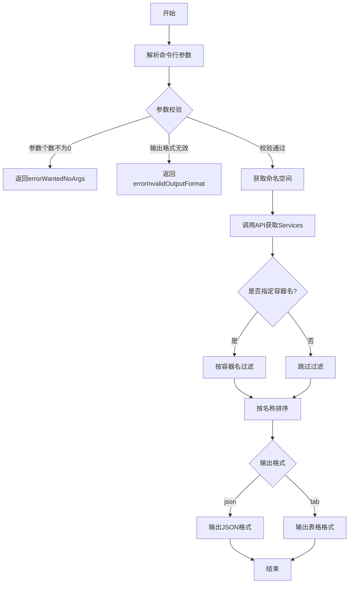
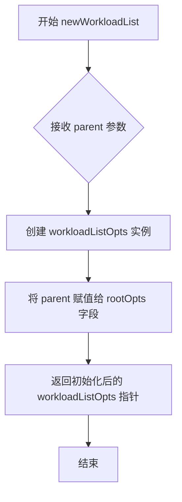
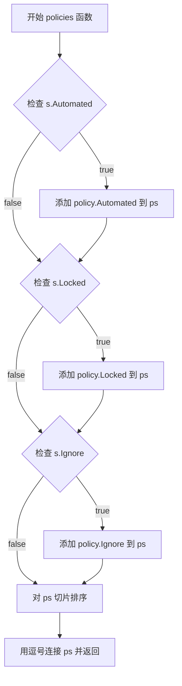
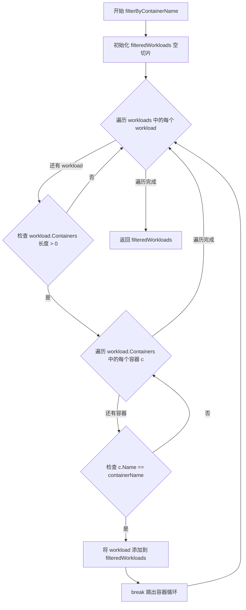
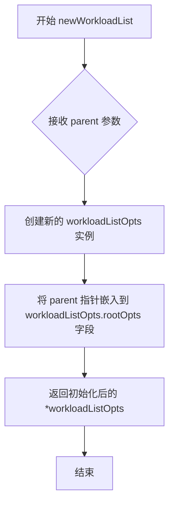
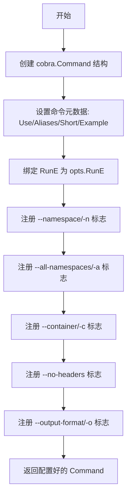
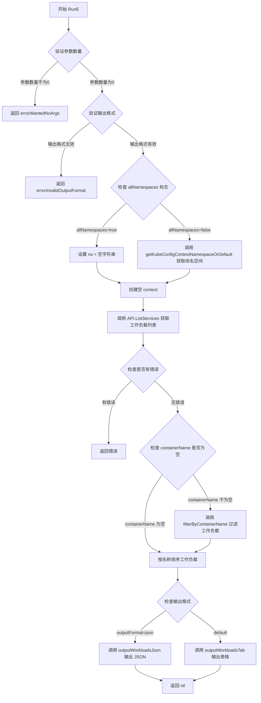

# `flux\cmd\fluxctl\list_workloads_cmd.go` 详细设计文档

这是一个Flux CLI命令行工具，用于列出Kubernetes集群中正在运行的工作负载（workloads），支持按命名空间、容器名过滤，支持表格和JSON格式输出。

## 整体流程



## 类结构

```
workloadListOpts (命令行选项结构体)
└── workloadStatusByName (排序辅助类型，实现sort.Interface)
```

## 全局变量及字段


### `workloadStatusByName`
    
用于按 ControllerStatus 的 ID 排序的切片，实现了 sort.Interface

类型：`type workloadStatusByName []v6.ControllerStatus`
    


### `newWorkloadList`
    
创建并返回一个新的 workloadListOpts 实例

类型：`func(parent *rootOpts) *workloadListOpts`
    


### `filterByContainerName`
    
过滤出包含指定容器名称的 workload

类型：`func(workloads []v6.ControllerStatus, containerName string) []v6.ControllerStatus`
    


### `policies`
    
返回给定 ControllerStatus 的策略标签（自动化、锁定、忽略）组成的字符串

类型：`func(s v6.ControllerStatus) string`
    


### `workloadListOpts.rootOpts`
    
继承自 rootOpts，指向父选项

类型：`*rootOpts`
    


### `workloadListOpts.namespace`
    
查询的 Kubernetes 命名空间

类型：`string`
    


### `workloadListOpts.allNamespaces`
    
是否查询所有命名空间

类型：`bool`
    


### `workloadListOpts.containerName`
    
用于过滤 workload 的容器名称

类型：`string`
    


### `workloadListOpts.noHeaders`
    
是否在输出时省略表头

类型：`bool`
    


### `workloadListOpts.outputFormat`
    
输出格式（tab 或 json）

类型：`string`
    
    

## 全局函数及方法


### `newWorkloadList`

这是一个工厂函数，用于创建并初始化 `workloadListOpts` 结构体实例，接收根选项作为依赖注入，返回配置好的工作负载列表选项指针。

参数：

- `parent`：`*rootOpts`，指向根选项的指针，用于初始化工作负载列表选项的父选项字段

返回值：`*workloadListOpts`，返回工作负载列表选项的结构体指针，包含命令行参数配置

#### 流程图



#### 带注释源码

```go
// newWorkloadList 是一个工厂函数，用于创建并初始化 workloadListOpts 结构体实例
// 参数 parent: 指向根选项的指针，用于依赖注入
// 返回值: 初始化后的 workloadListOpts 指针
func newWorkloadList(parent *rootOpts) *workloadListOpts {
    // 创建 workloadListOpts 实例并将 parent 赋值给 rootOpts 字段
    return &workloadListOpts{rootOpts: parent}
}
```


### `policies`

该函数用于将 `ControllerStatus` 对象中的策略标志（自动化、锁定、忽略）转换为逗号分隔的字符串表示。

参数：

- `s`：`v6.ControllerStatus`，表示控制器/工作负载的状态结构体，包含 Automated、Locked、Ignore 等布尔字段

返回值：`string`，返回由策略常量组成的逗号分隔字符串（如 "automated,locked"），如果没有任何策略则返回空字符串

#### 流程图



#### 带注释源码

```go
// policies 将 ControllerStatus 中的策略标志转换为逗号分隔的字符串
// 参数 s: v6.ControllerStatus 类型，表示控制器状态，包含 Automated、Locked、Ignore 字段
// 返回: 策略名称拼接的字符串，如 "automated,locked"，无策略时返回空字符串
func policies(s v6.ControllerStatus) string {
    // 声明一个字符串切片用于存储策略名称
	var ps []string
    
    // 如果自动化标志为真，则添加自动化策略
	if s.Automated {
		ps = append(ps, string(policy.Automated))
	}
    
    // 如果锁定标志为真，则添加锁定策略
	if s.Locked {
		ps = append(ps, string(policy.Locked))
	}
    
    // 如果忽略标志为真，则添加忽略策略
	if s.Ignore {
		ps = append(ps, string(policy.Ignore))
	}
    
    // 按字母顺序排序策略切片，确保输出顺序一致
	sort.Strings(ps)
    
    // 将策略切片用逗号连接成字符串并返回
	return strings.Join(ps, ",")
}
```


### `filterByContainerName`

该函数用于从 workloads 列表中筛选出包含指定容器名称的所有工作负载。它遍历每个工作负载的容器列表，当找到匹配的容器名称时，将该工作负载添加到结果集中。

参数：

- `workloads`：`[]v6.ControllerStatus`，输入的工作负载列表
- `containerName`：`string`，要筛选的容器名称

返回值：`[]v6.ControllerStatus`，包含指定容器名称的所有工作负载列表

#### 流程图



#### 带注释源码

```go
// Extract workloads having its container name equal to containerName
// 提取包含指定容器名称的工作负载
// 参数:
//   - workloads: []v6.ControllerStatus - 输入的工作负载列表
//   - containerName: string - 要筛选的容器名称
//
// 返回值:
//   - []v6.ControllerStatus - 筛选后的工作负载列表
func filterByContainerName(workloads []v6.ControllerStatus, containerName string) (filteredWorkloads []v6.ControllerStatus) {
	// 遍历每个工作负载
	for _, workload := range workloads {
		// 检查该工作负载是否包含容器
		if len(workload.Containers) > 0 {
			// 遍历该工作负载的所有容器
			for _, c := range workload.Containers {
				// 如果容器名称匹配目标名称
				if c.Name == containerName {
					// 将该工作负载添加到筛选结果中
					filteredWorkloads = append(filteredWorkloads, workload)
					// 找到匹配后跳出内层循环，避免重复添加同一个工作负载
					break
				}
			}
		}
	}
	// 返回筛选后的工作负载列表
	return
}
```


### `workloadListOpts.newWorkloadList`

该方法是一个构造函数，用于创建并初始化 `workloadListOpts` 结构体实例。它接收一个指向 `rootOpts` 的指针作为父配置，将其在 `workloadListOpts` 中嵌入，以便访问全局命令行选项和配置。

参数：

- `parent`：`*rootOpts`，指向父级 rootOpts 的指针，包含全局配置和 API 客户端等共享资源

返回值：`*workloadListOpts`，返回新创建的 workloadListOpts 实例，其中嵌入了传入的 parent

#### 流程图



#### 带注释源码

```go
// newWorkloadList 是一个构造函数，用于创建 workloadListOpts 实例
// 参数 parent: 指向 rootOpts 的指针，包含全局配置和 API 客户端等
// 返回值: 返回新创建的 *workloadListOpts，其中嵌入了 parent
func newWorkloadList(parent *rootOpts) *workloadListOpts {
    // 创建新的 workloadListOpts 实例，并将 parent 指针嵌入到 rootOpts 字段
    // 这样 workloadListOpts 可以访问 rootOpts 中的所有方法和字段
    return &workloadListOpts{rootOpts: parent}
}
```


### `workloadListOpts.Command`

该方法用于创建并配置 `list-workloads`（或 `list-controllers`）命令，返回一个 `*cobra.Command` 对象。该命令用于列出集群中当前运行的工作负载，支持按命名空间、容器名过滤，并支持表格和 JSON 两种输出格式。

参数：此方法无显式参数（隐式接收 `opts *workloadListOpts` receiver）

返回值：`*cobra.Command`，返回配置好的 Cobra 命令对象，用于注册到 CLI 根命令

#### 流程图



#### 带注释源码

```go
// Command 返回一个配置好的 cobra.Command，用于 list-workloads 命令
// 该命令用于列出集群中当前运行的工作负载
func (opts *workloadListOpts) Command() *cobra.Command {
    // 创建基础命令结构
    cmd := &cobra.Command{
        Use:     "list-workloads",                    // 命令名称
        Aliases: []string{"list-controllers"},        // 向后兼容别名（已废弃的 controller 术语）
        Short:   "List workloads currently running in the cluster.", // 简短描述
        Example: makeExample("fluxctl list-workloads"), // 使用示例
        RunE:    opts.RunE,                           // 实际执行逻辑绑定到 RunE 方法
    }
    
    // 注册命名空间过滤标志 -n/--namespace
    cmd.Flags().StringVarP(&opts.namespace, "namespace", "n", "", "Confine query to namespace")
    
    // 注册全命名空间查询标志 -a/--all-namespaces
    cmd.Flags().BoolVarP(&opts.allNamespaces, "all-namespaces", "a", false, "Query across all namespaces")
    
    // 注册容器名过滤标志 -c/--container
    cmd.Flags().StringVarP(&opts.containerName, "container", "c", "", "Filter workloads by container name")
    
    // 注册不打印表头标志 --no-headers
    cmd.Flags().BoolVar(&opts.noHeaders, "no-headers", false, "Don't print headers (default print headers)")
    
    // 注册输出格式标志 -o/--output-format，支持 tab 或 json
    cmd.Flags().StringVarP(&opts.outputFormat, "output-format", "o", "tab", "Output format (tab or json)")
    
    // 返回配置完成的命令对象
    return cmd
}
```


### `workloadListOpts.RunE`

该函数是 `workloadListOpts` 类型的成员方法，实现了 `cobra.Command` 的 `RunE` 回调，用于列出集群中运行的工作负载。它首先验证命令行参数和输出格式，然后根据命名空间配置获取服务列表，可选地按容器名过滤，按名称排序，最后根据指定的输出格式（JSON 或表格）打印工作负载信息。

参数：

- `cmd`：`*cobra.Command`，Cobra 命令对象，包含命令标志和配置信息
- `args`：`[]string`，从命令行传入的额外参数列表

返回值：`error`，执行过程中的错误信息，如果执行成功则返回 `nil`

#### 流程图



#### 带注释源码

```go
// RunE 是 workloadListOpts 类型的成员方法，实现 cobra.Command 的 RunE 回调
// 功能：列出集群中运行的工作负载，支持按命名空间、容器名过滤，支持 JSON/表格输出格式
// 参数：
//   - cmd: *cobra.Command 命令对象，包含命令标志和配置
//   - args: []string 命令行额外参数
// 返回值：error 执行过程中的错误信息
func (opts *workloadListOpts) RunE(cmd *cobra.Command, args []string) error {
	// 验证命令行参数数量，该命令不接受任何额外参数
	if len(args) != 0 {
		return errorWantedNoArgs
	}

	// 验证输出格式是否有效（仅支持 "json" 或 "tab"）
	if !outputFormatIsValid(opts.outputFormat) {
		return errorInvalidOutputFormat
	}

	// 确定查询的命名空间
	var ns string
	if opts.allNamespaces {
		// 如果指定了 all-namespaces 标志，则查询所有命名空间
		ns = ""
	} else {
		// 否则使用指定的命名空间或从 kubeconfig 上下文获取，默认值为 "default"
		ns = getKubeConfigContextNamespaceOrDefault(opts.namespace, "default", opts.Context)
	}

	// 创建空的 context 用于 API 调用
	ctx := context.Background()

	// 调用 Flux API 获取指定命名空间下的服务列表（工作负载）
	workloads, err := opts.API.ListServices(ctx, ns)
	if err != nil {
		// 如果 API 调用失败，直接返回错误
		return err
	}

	// 如果指定了容器名过滤条件，则按容器名过滤工作负载列表
	if opts.containerName != "" {
		workloads = filterByContainerName(workloads, opts.containerName)
	}

	// 按工作负载名称排序，便于查看
	sort.Sort(workloadStatusByName(workloads))

	// 根据输出格式选择不同的输出方式
	switch opts.outputFormat {
	case outputFormatJson:
		// JSON 格式输出
		outputWorkloadsJson(workloads, os.Stdout)
	default:
		// 默认使用表格格式输出
		outputWorkloadsTab(workloads, opts)
	}

	// 执行成功，返回 nil
	return nil
}
```


### `workloadStatusByName.Len`

该方法实现了 Go 语言 `sort.Interface` 接口的 `Len()` 方法，用于返回工作负载状态切片的长度，以便进行排序操作。

参数：无（隐式接收者 `s` 不计入参数）

返回值：`int`，返回 `workloadStatusByName` 切片（即 `[]v6.ControllerStatus`）中的元素数量。

#### 流程图

```mermaid
flowchart TD
    A[开始 Len 方法] --> B{接收 receiver s}
    B --> C[返回 len(s)]
    C --> D[结束]
    
    style A fill:#f9f,stroke:#333
    style D fill:#9f9,stroke:#333
```

#### 带注释源码

```go
// Len 是 sort.Interface 接口的实现方法
// 用于返回切片的长度，以便 sort 包进行排序操作
// 参数：无（隐式接收者为 workloadStatusByName 类型）
// 返回值：int - 返回切片中元素的数量
func (s workloadStatusByName) Len() int {
    // 内置 len 函数返回切片/数组/map的长度
    // 这里返回 s 的长度，s 是 []v6.ControllerStatus 类型
    return len(s)
}
```


### `workloadStatusByName.Less`

该方法是 `sort.Interface` 接口的实现，用于比较两个 `ControllerStatus` 对象的 ID 字符串大小，以便对工作负载列表按名称进行排序。

参数：

- `a`：`int`，第一个元素的索引
- `b`：`int`，第二个元素的索引

返回值：`bool`，如果索引 `a` 处的 workload ID 字符串小于索引 `b` 处的 ID 字符串则返回 `true`，否则返回 `false`

#### 流程图

```mermaid
flowchart TD
    A[开始比较] --> B[获取 s[a].ID.String]
    B --> C[获取 s[b].ID.String]
    C --> D{比较字符串}
    D -->|s[a] < s[b]| E[返回 true]
    D -->|s[a] >= s[b]| F[返回 false]
    E --> G[结束]
    F --> G
```

#### 带注释源码

```go
// Less 方法实现了 sort.Interface 的 Less 方法
// 用于确定切片中索引为 a 的元素是否小于索引为 b 的元素
// 参数 a 和 b 是切片中的索引位置
func (s workloadStatusByName) Less(a, b int) bool {
    // 获取索引 a 处的 ControllerStatus 的 ID 字符串表示
    // 并与索引 b 处的 ID 字符串进行比较
    // 返回字典序比较的结果
    return s[a].ID.String() < s[b].ID.String()
}
```


### `workloadStatusByName.Swap`

该方法是 `workloadStatusByName` 类型的成员方法，实现了 Go 语言 `sort.Interface` 接口中的 `Swap` 方法，用于在排序过程中交换切片中两个指定位置的元素。

参数：

- `a`：`int`，表示要交换的第一个元素的索引位置
- `b`：`int`，表示要交换的第二个元素的索引位置

返回值：`无`（Go 语言中为 `void`，即不返回任何值），该方法直接修改接收者切片，不返回任何值

#### 流程图

```mermaid
flowchart TD
    A[方法入口] --> B{接收索引 a 和 b}
    B --> C[获取 s[a] 的值]
    C --> D[获取 s[b] 的值]
    D --> E[执行交换: s[a] = s[b], s[b] = temp]
    E --> F[方法结束]
    
    style A fill:#f9f,stroke:#333
    style F fill:#9f9,stroke:#333
```

#### 带注释源码

```go
// Swap 方法实现了 sort.Interface 接口的 Swap 方法
// 用于在排序算法中交换切片中两个指定位置的元素
// 参数 a 和 b 表示要交换的元素在切片中的索引位置
func (s workloadStatusByName) Swap(a, b int) {
    // 使用 Go 语言的多重赋值特性交换两个元素的值
    // 不需要额外的临时变量，语法简洁高效
    s[a], s[b] = s[b], s[a]
}
```

## 关键组件


### workloadListOpts 结构体

命令行选项配置结构体，包含命名空间、容器名、输出格式等选项

### newWorkloadList 函数

workloadListOpts 的构造函数，初始化命令行选项

### Command 方法

创建 list-workloads 命令，定义命令行参数和标志

### RunE 方法

执行工作负载列表查询的核心逻辑，包含参数验证、API调用、过滤和输出

### workloadStatusByName 类型

实现 sort 接口的排序类型，按工作负载名称排序

### policies 函数

从 ControllerStatus 中提取策略信息（自动化、锁定、忽略）

### filterByContainerName 函数

按容器名过滤工作负载列表

### outputFormatIsValid 函数

验证输出格式是否有效（json/tab）

### getKubeConfigContextNamespaceOrDefault 函数

从 kubeconfig 获取命名空间或使用默认值

### outputWorkloadsJson 函数

以 JSON 格式输出工作负载

### outputWorkloadsTab 函数

以表格格式输出工作负载


## 问题及建议


### 已知问题

-   **缺失上下文超时控制**：使用 `context.Background()` 而非带超时的上下文，可能导致长时间运行的请求无限制等待，缺乏对API调用超时控制
-   **全局依赖未定义**：代码中引用了多个未在此文件中定义的函数和变量（`errorWantedNoArgs`、`errorInvalidOutputFormat`、`opts.API`、`outputFormatIsValid`、`getKubeConfigContextNamespaceOrDefault`、`outputWorkloadsJson`、`outputWorkloadsTab`），存在隐藏的包级依赖，降低了代码的自包含性和可测试性
-   **输入验证不足**：`allNamespaces` 和 `namespace` 参数存在潜在冲突，当同时指定时直接忽略 namespace 而未向用户发出警告或错误提示
-   **错误处理不够友好**：直接透传 `opts.API.ListServices(ctx, ns)` 返回的错误，未进行错误类型判断或添加上下文信息
-   **policies 函数空值处理**：当 ControllerStatus 没有任何策略标记时，`policies` 函数返回空字符串，调用方可能需要额外处理空值情况

### 优化建议

-   为 API 调用添加带超时的上下文，例如 `ctx, cancel := context.WithTimeout(context.Background(), 30*time.Second); defer cancel()`
-   在 `RunE` 方法中添加对 `allNamespaces` 和 `namespace` 同时使用的校验，给出明确的错误或警告信息
-   将全局依赖通过依赖注入方式传入 `workloadListOpts` 结构体，提高代码可测试性和可维护性
-   优化 `filterByContainerName` 函数，使用 `make` 预分配切片容量以减少内存分配开销：`filteredWorkloads := make([]v6.ControllerStatus, 0, len(workloads))`
-   在错误返回前添加错误上下文包装，提供更有意义的错误信息帮助调试
-   为 `policies` 函数添加空值检查，返回更有意义的默认值（如 `"none"` 或保持空字符串但确保调用方已处理）

## 其它


### 设计目标与约束

**设计目标**：
- 提供一个命令行工具，用于列出Kubernetes集群中运行的工作负载（workloads）
- 支持按命名空间过滤和按容器名称过滤
- 支持多种输出格式（tab表格和json）
- 与Flux CD生态系统无缝集成

**约束条件**：
- 必须使用cobra框架构建CLI命令
- 输出格式必须支持tab和json两种模式
- 必须遵循Flux CD的API接口规范（v6版本）
- 命令行参数必须符合POSIX风格（短参数和长参数）

### 错误处理与异常设计

**参数校验错误**：
- 当传入非空位置参数时，返回`errorWantedNoArgs`错误
- 当输出格式无效时，返回`errorInvalidOutputFormat`错误

**运行时错误**：
- 调用`opts.API.ListServices`失败时，直接向上传递错误
- Kubeconfig上下文获取失败时，使用默认值"default"命名空间

**边界条件处理**：
- 当`allNamespaces`为true时，命名空间参数为空字符串
- 当容器名称过滤无匹配时，返回空切片而非nil

### 数据流与状态机

**主流程状态机**：
```
开始 -> 参数校验 -> 获取命名空间 -> 调用API获取工作负载列表 
-> 可选：按容器名称过滤 -> 排序 -> 选择输出格式 -> 输出结果 -> 结束
```

**关键数据转换**：
1. 用户输入的命名空间参数转换为Kubernetes命名空间字符串
2. `v6.ControllerStatus`切片转换为排序后的切片
3. ControllerStatus中的策略标志转换为逗号分隔的字符串

### 外部依赖与接口契约

**核心依赖**：
- `github.com/spf13/cobra`：CLI命令框架
- `github.com/fluxcd/flux/pkg/api/v6`：Flux CD v6 API接口
- `github.com/fluxcd/flux/pkg/policy`：策略定义常量

**接口契约**：
- `rootOpts.API`：必须实现`v6.API`接口，提供`ListServices(ctx context.Context, ns string) ([]ControllerStatus, error)`方法
- `rootOpts.Context`：Kubernetes配置上下文名称
- `getKubeConfigContextNamespaceOrDefault`：工具函数，获取命名空间

**第三方库依赖**：
- `context`：标准库，用于请求上下文传递
- `sort`：标准库，用于工作负载排序
- `strings`：标准库，用于字符串处理
- `os`：标准库，用于标准输出

### 安全性考虑

- 不在日志中输出敏感信息
- 错误信息返回通用描述，避免暴露内部实现细节
- 依赖Flux CD的安全模型进行认证授权

### 性能考虑

- 使用Go的切片而非列表，避免频繁内存分配
- 排序使用内置的sort.Sort，算法复杂度为O(n log n)
- 容器名称过滤采用线性遍历，时间复杂度为O(n * m)

### 配置管理

- 命令行参数通过cobra的Flags机制管理
- 命名空间默认值通过`getKubeConfigContextNamespaceOrDefault`函数获取
- 输出格式默认值设置为"tab"

### 测试策略

- 单元测试：验证filterByContainerName函数的过滤逻辑
- 单元测试：验证workloadStatusByName的排序逻辑
- 单元测试：验证policies函数的策略字符串生成
- 集成测试：模拟API调用验证完整流程

### 可扩展性设计

- 输出格式通过switch case支持扩展（json和tab）
- 可以轻松添加新的输出格式（如yaml）
- 命令别名机制支持向后兼容（list-workloads和list-controllers）


    