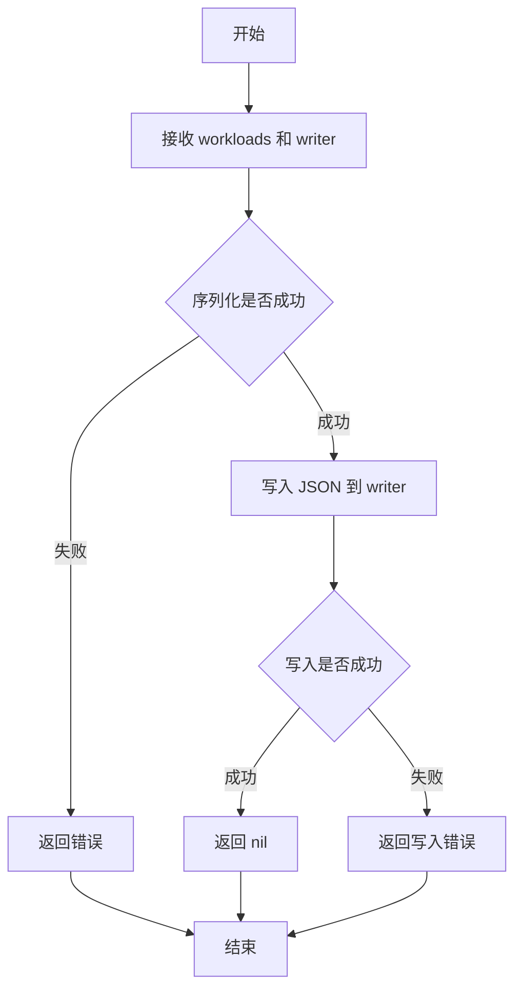

# `flux\cmd\fluxctl\list_workloads_cmd_test.go` 详细设计文档

这是一个 Go 语言测试文件，用于测试将工作负载（workloads）序列化为 JSON 格式的功能。测试用例创建模拟的 ControllerStatus 对象，调用 outputWorkloadsJson 函数，并将输出反序列化以验证 JSON 格式的正确性。

## 整体流程

```mermaid
graph TD
    A[开始测试 Test_outputWorkloadsJson] --> B[创建 bytes.Buffer]
    B --> C[调用 testWorkloads(5) 生成测试数据]
    C --> D[调用 outputWorkloadsJson 函数]
    D --> E{outputWorkloadsJson 执行成功?}
    E -- 否 --> F[测试失败，抛出错误]
    E -- 是 --> G[将 Buffer 内容反序列化为 ControllerStatus 切片]
    G --> H{反序列化成功?}
    H -- 否 --> I[测试失败]
    H -- 是 --> J[测试通过]
```

## 类结构

```
测试文件结构
├── Test_outputWorkloadsJson (测试函数)
│   └── 创建 Buffer 并验证 JSON 输出
└── testWorkloads (辅助函数)
    └── 生成模拟的 ControllerStatus 切片
```

## 全局变量及字段


### `buf`
    
A buffer to capture JSON output for testing

类型：`*bytes.Buffer`
    


### `ControllerStatus.ID`
    
The unique identifier of the controller

类型：`resource.ID`
    


### `ControllerStatus.Containers`
    
Containers running in the controller

类型：`[]Container`
    


### `ControllerStatus.ReadOnly`
    
ReadOnly status of the controller

类型：`string`
    


### `ControllerStatus.Status`
    
Current status of the controller (e.g., ready)

类型：`string`
    


### `ControllerStatus.Rollout`
    
Rollout status information for the controller

类型：`cluster.RolloutStatus`
    


### `ControllerStatus.SyncError`
    
Synchronization error message if any

类型：`string`
    


### `ControllerStatus.Antecedent`
    
The antecedent resource ID

类型：`resource.ID`
    


### `ControllerStatus.Labels`
    
Labels associated with the controller

类型：`map[string]string`
    


### `ControllerStatus.Automated`
    
Whether the controller is automated

类型：`bool`
    


### `ControllerStatus.Locked`
    
Whether the controller is locked

类型：`bool`
    


### `ControllerStatus.Ignore`
    
Whether to ignore the controller

类型：`bool`
    


### `ControllerStatus.Policies`
    
Policies applied to the controller

类型：`[]string`
    
    

## 全局函数及方法


### `Test_outputWorkloadsJson`

该函数是一个Go语言测试函数，用于验证 `outputWorkloadsJson` 函数能否正确将 `[]v6.ControllerStatus` 类型的 workload 切片序列化为JSON格式并写入指定的 `io.Writer`。

参数：

- `t`：`testing.T`，Go测试框架的标准参数，用于报告测试结果和控制测试行为。

返回值：`void`，无显式返回值，测试结果通过 `*testing.T` 参数报告。

#### 流程图

```mermaid
graph TD
    A[开始测试] --> B[创建bytes.Buffer实例]
    B --> C[调用testWorkloads生成5个测试workload]
    C --> D[调用outputWorkloadsJson将workloads写入buffer]
    D --> E{检查错误}
    E -->|有错误| F[通过t.Fatal报告错误并终止测试]
    E -->|无错误| G[从buffer.Bytes()获取JSON数据]
    G --> H[创建反序列化目标*[]v6.ControllerStatus]
    H --> I[调用json.Unmarshal反序列化JSON]
    I --> J{检查反序列化错误}
    J -->|有错误| K[通过t.Fatal报告错误]
    J -->|无错误| L[测试通过]
```

#### 带注释源码

```go
// Test_outputWorkloadsJson 测试函数，验证outputWorkloadsJson的JSON序列化功能
// 该测试创建模拟的workload数据，调用outputWorkloadsJson写入buffer，然后反序列化验证结果
func Test_outputWorkloadsJson(t *testing.T) {
	// 创建一个bytes.Buffer用于接收outputWorkloadsJson的输出
	buf := &bytes.Buffer{}

	// 使用t.Run创建子测试，用于描述测试场景
	t.Run("sends JSON to the io.Writer", func(t *testing.T) {
		// 调用testWorkloads辅助函数生成5个测试用的ControllerStatus对象
		workloads := testWorkloads(5)
		
		// 调用被测试的outputWorkloadsJson函数，将workloads写入buffer
		err := outputWorkloadsJson(workloads, buf)
		// 使用require.NoError验证操作无错误，如有错误则测试失败
		require.NoError(t, err)
		
		// 创建反序列化目标指针，指向v6.ControllerStatus类型的slice
		unmarshallTarget := &[]v6.ControllerStatus{}
		// 从buffer中读取字节数据，使用json.Unmarshal反序列化为ControllerStatus slice
		err = json.Unmarshal(buf.Bytes(), unmarshallTarget)
		// 验证反序列化操作成功
		require.NoError(t, err)
	})
}
```


### `testWorkloads`

该函数用于生成指定数量的模拟 ControllerStatus 切片，主要用于测试目的。它循环创建包含预设值的 ControllerStatus 对象，并返回包含所有工作负载状态的切片。

参数：

- `workloadCount`：`int`，要生成的工作负载（ControllerStatus）数量

返回值：`[]v6.ControllerStatus`，包含指定数量 ControllerStatus 的切片

#### 流程图

```mermaid
graph TD
    A[开始] --> B[初始化空切片 workloads]
    B --> C{循环 i < workloadCount}
    C -->|是| D[生成 name: mah-app-{i}]
    D --> E[创建资源ID: applications/deployment/mah-app-{i}]
    E --> F[构建 ControllerStatus 对象]
    F --> G[将 ControllerStatus 添加到切片]
    G --> C
    C -->|否| H[返回 workloads 切片]
    H --> I[结束]
```

#### 带注释源码

```go
// testWorkloads 生成指定数量的模拟 ControllerStatus 切片，用于测试目的
// 参数: workloadCount int - 要生成的工作负载数量
// 返回: []v6.ControllerStatus - 包含指定数量 ControllerStatus 的切片
func testWorkloads(workloadCount int) []v6.ControllerStatus {
	// 初始化空的 ControllerStatus 切片
	workloads := []v6.ControllerStatus{}
	
	// 循环创建指定数量的工作负载
	for i := 0; i < workloadCount; i++ {
		// 使用格式化生成工作负载名称，格式为 "mah-app-{索引}"
		name := fmt.Sprintf("mah-app-%d", i)
		
		// 使用 resource.MakeID 创建资源 ID，参数依次为：命名空间、资源类型、名称
		id := resource.MakeID("applications", "deployment", name)

		// 构建 ControllerStatus 对象，各字段含义如下：
		cs := v6.ControllerStatus{
			ID:         id,                    // 资源唯一标识
			Containers: nil,                   // 容器列表（测试用设为 nil）
			ReadOnly:   "",                    // 只读标记（空字符串）
			Status:     "ready",               // 状态设为 "ready"
			Rollout:    cluster.RolloutStatus{}, // 部署状态（空结构体）
			SyncError:  "",                    // 同步错误（空字符串）
			Antecedent: resource.ID{},         // 前置资源 ID（空结构体）
			Labels:     nil,                   // 标签（测试用设为 nil）
			Automated:  false,                 // 自动化标记
			Locked:     false,                 // 锁定标记
			Ignore:     false,                 // 忽略标记
			Policies:   nil,                   // 策略列表（测试用设为 nil）
		}

		// 将构建好的 ControllerStatus 添加到切片中
		workloads = append(workloads, cs)
	}
	
	// 返回包含所有工作负载状态的切片
	return workloads
}
```


### `outputWorkloadsJson`

该函数将工作负载（ControllerStatus）列表序列化为JSON格式，并通过提供的io.Writer输出。

参数：

- `workloads`：`[]v6.ControllerStatus`，工作负载列表，包含多个控制器状态信息
- `writer`：`io.Writer`，用于输出JSON数据的写入器（代码中传入的是 `*bytes.Buffer`）

返回值：`error`，如果序列化或写入过程中发生错误则返回错误，否则返回nil

#### 流程图



#### 带注释源码

```go
// outputWorkloadsJson 将工作负载列表序列化为 JSON 并写入到 writer 中
// 参数:
//   - workloads: []v6.ControllerStatus - 需要输出为 JSON 的工作负载切片
//   - writer: io.Writer - 用于写入 JSON 数据的输出流
//
// 返回值:
//   - error: 序列化或写入过程中的错误,成功时为 nil
func outputWorkloadsJson(workloads []v6.ControllerStatus, writer io.Writer) error {
    // 使用 json.Marshal 将 workloads 序列化为 JSON 字节切片
    // 然后写入到 writer 中
    // 如果序列化或写入失败,返回错误;成功则返回 nil
}
```


### `testWorkloads`

这是一个测试辅助函数，用于生成指定数量的模拟 `ControllerStatus` 对象列表，以便在测试场景中作为输出工作负载的测试数据使用。

参数：

- `workloadCount`：`int`，表示要生成的工作负载（ControllerStatus）数量

返回值：`[]v6.ControllerStatus`，返回包含指定数量 ControllerStatus 对象的切片，每个对象代表一个模拟的控制器状态

#### 流程图

```mermaid
flowchart TD
    A[开始] --> B[创建空的 ControllerStatus 切片]
    B --> C{循环 i 从 0 到 workloadCount-1}
    C --> D[生成工作负载名称: mah-app-{i}]
    E[创建资源 ID] --> D
    D --> F[构建 ControllerStatus 对象]
    F --> G[设置各字段值]
    G --> H[将 ControllerStatus 添加到切片]
    H --> C
    C --> I{循环结束?}
    I --> |是| J[返回 workloads 切片]
    I --> |否| C
    J --> K[结束]
```

#### 带注释源码

```go
// testWorkloads 是一个测试辅助函数，用于生成指定数量的模拟 ControllerStatus 对象
// 参数 workloadCount 指定要生成的工作负载数量
// 返回值为包含 ControllerStatus 的切片，用于测试 outputWorkloadsJson 等函数
func testWorkloads(workloadCount int) []v6.ControllerStatus {
	// 初始化空的 ControllerStatus 切片用于存储生成的工作负载
	workloads := []v6.ControllerStatus{}
	
	// 循环创建指定数量的工作负载
	for i := 0; i < workloadCount; i++ {
		// 生成工作负载名称，格式为 mah-app-{序号}
		name := fmt.Sprintf("mah-app-%d", i)
		
		// 使用 resource.MakeID 创建资源 ID，参数分别为：命名空间、资源类型、名称
		id := resource.MakeID("applications", "deployment", name)

		// 构建 ControllerStatus 结构体，包含控制器的各项状态信息
		cs := v6.ControllerStatus{
			ID:         id,                    // 控制器唯一标识
			Containers: nil,                   // 容器列表（测试中设为 nil）
			ReadOnly:   "",                    // 只读标识（空字符串）
			Status:     "ready",               // 状态设为 "ready"
			Rollout:    cluster.RolloutStatus{}, // 部署状态（空结构）
			SyncError:  "",                    // 同步错误（空字符串）
			Antecedent: resource.ID{},         // 前置资源 ID（空结构）
			Labels:     nil,                   // 标签（测试中设为 nil）
			Automated:  false,                  // 自动化标志
			Locked:     false,                  // 锁定标志
			Ignore:     false,                  // 忽略标志
			Policies:   nil,                    // 策略列表（测试中设为 nil）
		}

		// 将构建好的 ControllerStatus 添加到切片中
		workloads = append(workloads, cs)
	}
	
	// 返回生成的工作负载切片
	return workloads
}
```

## 关键组件


### Test_outputWorkloadsJson

测试函数，验证outputWorkloadsJson函数能够正确地将workloads列表以JSON格式写入io.Writer，并能够正确反序列化。

### testWorkloads

辅助测试函数，用于生成指定数量的ControllerStatus测试数据，包括生成应用名称、资源ID和默认的控制器状态。

### outputWorkloadsJson

被测试的目标函数（源码中未显示实现），接收workloads切片和io.Writer，将数据序列化为JSON格式输出。

### v6.ControllerStatus

控制器状态数据结构，包含ID、容器信息、只读状态、状态、滚动更新信息、同步错误、先前资源ID、标签、自动化标记、锁定标记、忽略标记和策略等字段。

### resource.MakeID

资源ID生成函数，用于根据命名空间、种类和名称创建唯一的资源标识符。

### cluster.RolloutStatus

滚动更新状态结构，记录部署的滚动更新相关信息。


## 问题及建议


### 已知问题

-   **测试验证不完整**：`Test_outputWorkloadsJson` 测试函数仅验证了 JSON 序列化/反序列化过程没有报错，但未验证序列化后的 JSON 内容是否与原始数据一致，缺少对 `ID`、`Status` 等字段值的断言
-   **未使用的导入**：代码中导入了 `"testing"` 和 `"github.com/stretchr/testify/require"`，但未在当前测试中显式使用 `require.NoError` 以外的 testing 包功能
-   **变量命名不当**：`fmt.Sprintf("mah-app-%d", i)` 中的 "mah-app" 看起来是占位符或笔误，应使用更有意义的名称如 "test-app"
-   **测试数据构造不够灵活**：`testWorkloads` 函数创建的所有 `ControllerStatus` 对象字段值基本相同（除了 ID），无法满足不同测试场景需求
-   **缺少边界条件测试**：没有对空切片、`workloadCount=0`、大规模数据（如数千条）等边界情况的测试
-   **未验证 JSON 输出格式**：测试未检查生成的 JSON 是否符合预期的格式（如字段顺序、缩进等）
-   **潜在的 nil 指针问题**：`testWorkloads` 中创建的 `ControllerStatus` 包含多个 nil 字段（`Containers`、`Labels`、`Policies` 等），可能导致后续使用时出现空指针异常
-   **缺少错误消息验证**：测试未验证当传入非法数据时函数是否返回正确的错误信息

### 优化建议

-   在测试中添加对反序列化结果的字段级断言，验证每个 `ControllerStatus` 的 `ID`、`Status` 等关键字段值正确
-   使用 testify 的 `assert.JSONEq` 或手动比较方式来验证完整的 JSON 内容
-   重命名测试数据中的 "mah-app" 为 "test-app" 或其他有意义的名称
-   为 `testWorkloads` 函数添加参数选项，允许自定义不同测试场景所需的字段值
-   添加边界条件测试用例：空切片、nil 输入、大量数据等
-   考虑使用表驱动测试（table-driven tests）来扩展测试覆盖场景
-   在 `ControllerStatus` 构造时初始化必要的非 nil 切片/映射字段，避免潜在的 nil 指针问题
-   添加负面测试用例，验证函数在错误输入时的行为和错误返回
-   考虑将 `testWorkloads` 移动到测试辅助函数包中，供其他测试文件复用


## 其它


### 设计目标与约束

描述代码的设计目标、性能约束、兼容性要求等。例如：该函数旨在将工作负载列表序列化为JSON格式输出，需遵循UTF-8编码，支持任意数量的工作负载，输出格式需符合v6 API规范。

### 错误处理与异常设计

描述错误处理机制、异常情况处理策略。例如：使用error返回值处理JSON序列化失败、IO写入失败等异常情况，测试中通过require.NoError验证无错误发生。

### 数据流与数据转换

描述数据输入、处理、输出的完整数据流。例如：输入为[]v6.ControllerStatus切片，经由json.Marshal序列化为JSON字节流，最终写入bytes.Buffer输出缓冲区。

### 外部依赖与接口契约

描述代码依赖的外部包、接口定义和调用约定。例如：依赖github.com/fluxcd/flux/pkg/cluster、github.com/fluxcd/flux/pkg/resource、github.com/fluxcd/flux/pkg/api/v6等包，outputWorkloadsJson函数签名为func outputWorkloadsJson(workloads []v6.ControllerStatus, w io.Writer) error。

### 边界条件与输入验证

描述输入参数的边界检查和验证逻辑。例如：workloads参数可为空切片，w参数需为非nil的io.Writer实现。

### 并发安全与线程安全

描述并发访问安全性考量。例如：该函数为同步函数，不涉及并发写入，需调用方保证writer的线程安全。

### 性能考虑与资源管理

描述性能特点、内存使用、资源释放等。例如：使用bytes.Buffer避免频繁分配，JSON序列化复杂度为O(n)，n为工作负载数量。

### 兼容性声明

描述版本兼容性、API稳定性承诺等。例如：依赖flux pkg/api/v6版本，需保持该API版本的向后兼容。

### 测试策略与覆盖率

描述测试方法、测试用例设计原则、边界条件覆盖等。例如：使用表驱动测试思想，验证不同数量工作负载的JSON输出正确性，通过json.Unmarshal验证序列化结果的有效性。


    