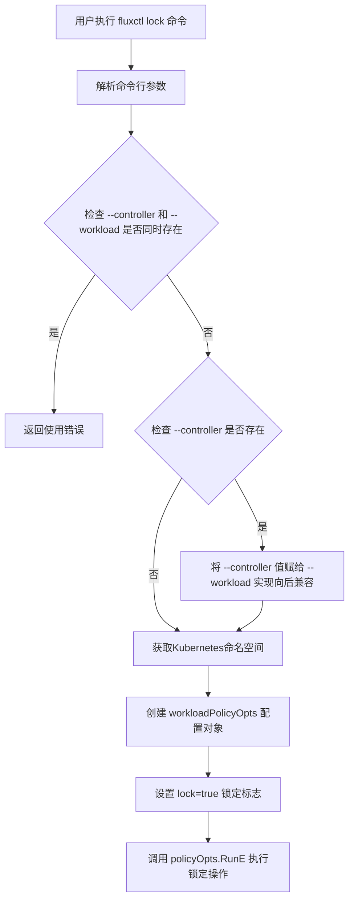
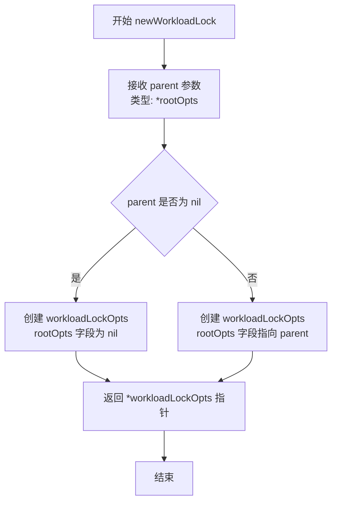
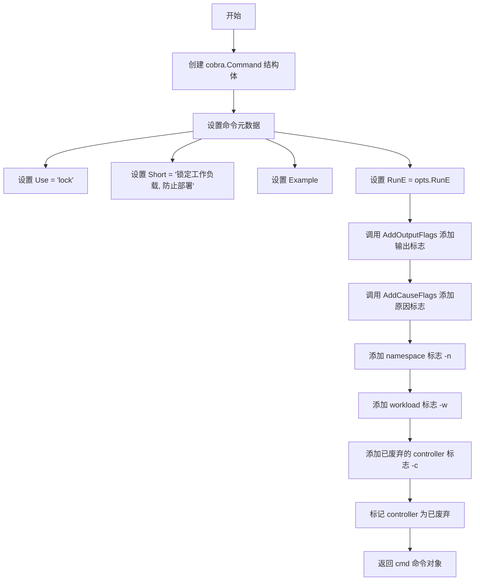
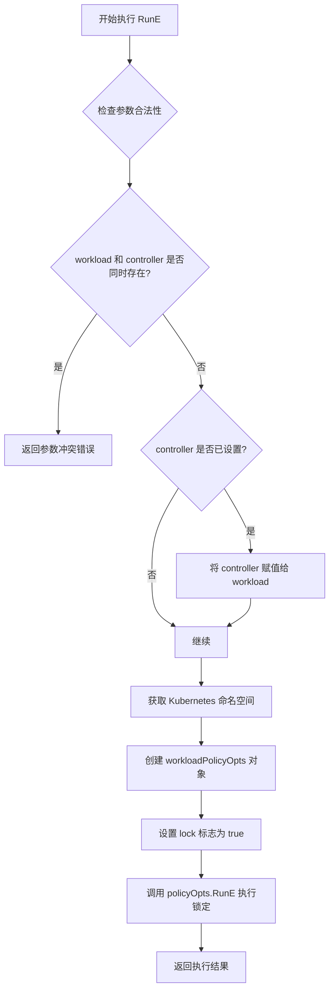

# `flux\cmd\fluxctl\lock_cmd.go` 详细设计文档

这是一个Flux CD CLI工具中的锁定工作负载命令实现，使用cobra框架构建，允许用户通过命令行锁定指定的工作负载以防止其被部署，同时支持向后兼容废弃的--controller参数。

## 整体流程



## 类结构

```
workloadLockOpts (命令行选项结构体)
├── rootOpts (嵌入的根选项)
├── namespace (字符串-命名空间)
├── workload (字符串-工作负载)
├── outputOpts (嵌入的输出选项)
├── cause (update.Cause-锁定原因)
└── controller (字符串-已废弃的控制器参数)
```

## 全局变量及字段


### `workloadLockOpts.rootOpts`
    
嵌入的根选项，提供基础命令配置

类型：`*rootOpts`
    


### `workloadLockOpts.namespace`
    
Kubernetes命名空间，指定要锁定的工作负载所在命名空间

类型：`string`
    


### `workloadLockOpts.workload`
    
工作负载标识，格式为namespace:kind/name，用于指定要锁定的目标工作负载

类型：`string`
    


### `workloadLockOpts.outputOpts`
    
嵌入的输出选项，控制命令输出的格式和目标

类型：`outputOpts`
    


### `workloadLockOpts.cause`
    
锁定原因，记录为何锁定该工作负载的说明信息

类型：`update.Cause`
    


### `workloadLockOpts.controller`
    
已废弃字段，曾用于指定要锁定的控制器，现已被workload字段取代

类型：`string`
    
    

## 全局函数及方法


### `newWorkloadLock`

这是一个构造函数，用于创建并返回一个 `workloadLockOpts` 结构体实例，将父级的 `rootOpts` 配置嵌入到新的锁选项对象中，以便后续的锁定操作可以使用根配置中的设置。

参数：

- `parent`：`*rootOpts`，指向父级根配置的指针，包含全局配置信息（如 Kubernetes 客户端配置等），用于初始化工作负载锁选项。

返回值：`*workloadLockOpts`，返回新创建的工作负载锁选项结构体的指针，该结构体包含了嵌入的根配置和用于锁定工作负载的各种参数字段。

#### 流程图



#### 带注释源码

```go
// newWorkloadLock 是一个构造函数，用于创建并返回一个 workloadLockOpts 结构体实例。
// 它将传入的 parent (rootOpts) 嵌入到新的 workloadLockOpts 中，
// 使得后续的锁定操作能够访问根配置中的全局设置。
//
// 参数:
//   - parent: 指向父级根配置 rootOpts 的指针，包含全局配置信息
//
// 返回值:
//   - 返回新创建的 workloadLockOpts 结构体的指针
func newWorkloadLock(parent *rootOpts) *workloadLockOpts {
	// 创建一个新的 workloadLockOpts 实例，并将 rootOpts 字段设置为传入的 parent 指针
	// 这里利用了 Go 语言的嵌入机制，使得 workloadLockOpts 可以直接访问 rootOpts 的所有字段和方法
	return &workloadLockOpts{rootOpts: parent}
}
```


### `workloadLockOpts.Command()`

该方法用于创建并配置一个 Cobra 命令对象，实现 "lock" 子命令的功能。该命令用于锁定指定的工作负载，防止其被部署。

参数：

- （无显式参数）

返回值：`*cobra.Command`，返回配置完成的 Cobra 命令对象，可用于 CLI 注册

#### 流程图



#### 带注释源码

```
// Command 方法创建一个用于锁定工作负载的 Cobra 命令
// 返回值: *cobra.Command - 配置完成的 CLI 命令对象
func (opts *workloadLockOpts) Command() *cobra.Command {
    // 初始化 cobra.Command 结构体
    cmd := &cobra.Command{
        Use:   "lock",                                    // 命令名称
        Short: "Lock a workload, so it cannot be deployed.", // 简短描述
        // 使用 makeExample 生成示例用法
        Example: makeExample(
            "fluxctl lock --workload=default:deployment/helloworld",
        ),
        RunE: opts.RunE, // 设置命令执行函数
    }
    
    // 添加输出格式相关标志（如 json、yaml 等）
    AddOutputFlags(cmd, &opts.outputOpts)
    
    // 添加锁定原因相关标志
    AddCauseFlags(cmd, &opts.cause)
    
    // 添加 namespace 标志: -n, --namespace
    cmd.Flags().StringVarP(&opts.namespace, "namespace", "n", "", "Controller namespace")
    
    // 添加 workload 标志: -w, --workload
    cmd.Flags().StringVarP(&opts.workload, "workload", "w", "", "Workload to lock")

    // 添加已废弃的 controller 标志（保持向后兼容）
    // Deprecated: 此标志已被 --workload 替代
    cmd.Flags().StringVarP(&opts.workload, "controller", "c", "", "Controller to lock")
    cmd.Flags().MarkDeprecated("controller", "changed to --workload, use that instead")

    // 返回配置完成的命令对象
    return cmd
}
```


### `workloadLockOpts.RunE`

该方法是 `workloadLockOpts` 类型的成员方法，负责执行工作负载锁定逻辑。它首先处理已弃用的 `--controller` 参数以保持向后兼容性，然后验证参数合法性，获取 Kubernetes 命名空间，最后创建锁定策略选项并调用其 RunE 方法完成实际的锁定操作。

参数：

- `cmd`：`*cobra.Command`，Cobra 命令对象，包含命令标志、配置和执行上下文信息
- `args`：`[]string`，命令执行时附加的参数列表（通常为空）

返回值：`error`，如果执行过程中出现错误（如参数冲突）则返回错误；成功执行时返回 nil

#### 流程图



#### 带注释源码

```go
// RunE 是 workloadLockOpts 类型的成员方法，执行工作负载锁定逻辑
// 参数 cmd 是 Cobra 命令对象，args 是附加参数列表
// 返回 error 类型，成功返回 nil，失败返回具体错误信息
func (opts *workloadLockOpts) RunE(cmd *cobra.Command, args []string) error {
	// Backwards compatibility with --controller until we remove it
	// 处理已弃用的 --controller 参数，保持向后兼容性
	switch {
	case opts.workload != "" && opts.controller != "":
		// 如果同时指定了 workload 和 controller，返回使用错误
		return newUsageError("can't specify both a controller and workload")
	case opts.controller != "":
		// 如果只指定了已弃用的 controller，将其值赋给 workload
		opts.workload = opts.controller
	}
	// 获取 Kubernetes 配置上下文中的命名空间，默认值为 "default"
	ns := getKubeConfigContextNamespaceOrDefault(opts.namespace, "default", opts.Context)
	// 创建 workloadPolicyOpts 对象，准备执行锁定策略
	policyOpts := &workloadPolicyOpts{
		rootOpts:   opts.rootOpts,
		outputOpts: opts.outputOpts,
		namespace:  ns,
		workload:   opts.workload,
		cause:      opts.cause,
		lock:       true, // 设置 lock 标志为 true，表示执行锁定操作
	}
	// 调用 policyOpts 的 RunE 方法执行实际的锁定逻辑
	return policyOpts.RunE(cmd, args)
}
```

## 关键组件


### workloadLockOpts 结构体

用于存储锁定工作负载命令的配置选项，包含根选项、命名空间、工作负载、输出选项、原因以及已弃用的控制器字段。

### Command 方法

定义 "lock" 子命令，使用 Cobra 框架创建 CLI 命令，配置输出标志和原因标志，处理命名空间和工作负载参数，并标记控制器参数为已弃用。

### RunE 方法

实现命令执行逻辑，处理 --controller 和 --workload 参数的向后兼容性，验证参数互斥，将命名空间解析为 Kubernetes 配置上下文中的命名空间，最后委托给 workloadPolicyOpts 执行实际的锁定操作。

### 向后兼容性处理

通过 switch 语句处理已弃用的 --controller 参数，确保用户不能同时指定 controller 和 workload，当仅使用 controller 时将其值转换为 workload。

### 标志系统集成

集成 AddOutputFlags 和 AddCauseFlags 函数添加标准输出和原因标志，并使用 Cobra 的 MarkDeprecated 方法标记 controller 参数为已弃用。

### 潜在技术债务

controller 参数的向后兼容性代码应在未来版本中移除，当前使用字符串比较而非常量或枚举可能导致未来的维护问题，命名空间默认值 "default" 硬编码可能缺乏灵活性。


## 问题及建议


### 已知问题

-   **废弃参数处理不够干净**：`--controller`参数虽已标记废弃（MarkDeprecated），但在RunE中仍保留完整的向后兼容逻辑，增加了代码复杂度，且在未来版本完全移除时需要额外重构
-   **Flag重复定义**：在Command方法中，`--workload`和`--controller`两个flag都绑定到了`opts.workload`字段，这种处理方式虽然实现了功能，但语义不清，容易造成混淆
-   **缺少输入验证**：对`namespace`和`workload`参数未进行格式校验或非空检查，可能导致后续逻辑出现异常
-   **硬编码默认值**：在调用`getKubeConfigContextNamespaceOrDefault`时直接使用字符串常量"default"作为默认命名空间，缺乏配置灵活性

### 优化建议

-   **简化废弃参数逻辑**：可考虑在较新版本中直接移除对`--controller`的支持，或将其转换为警告而非静默转换，降低维护成本
-   **统一Flag命名语义**：将废弃参数映射改为显式的警告或错误提示，而非自动转换，使行为更加透明
-   **增加输入验证**：在RunE方法初期添加参数校验逻辑，确保namespace和workload符合预期格式
-   **提取配置常量**：将"default"等硬编码值提取为常量或配置项，提升代码可维护性
-   **分离职责**：将向后兼容逻辑抽取为独立的辅助方法，保持RunE方法的业务逻辑清晰

## 其它


### 设计目标与约束

该工具是Flux CD CLI的一部分，旨在通过命令行接口锁定Kubernetes工作负载，防止其被部署。设计目标包括：提供简洁的CLI交互、保持向后兼容性、遵循Flux项目的整体架构风格。约束条件包括：必须与Kubernetes集群交互、需要有效的kubeconfig配置、受限于Flux控制器的API能力。

### 错误处理与异常设计

代码中的错误处理主要体现在以下几个方面：使用`RunE`返回错误而非`Run`以支持错误传播；通过`newUsageError`处理参数使用错误；使用`switch`语句处理废弃参数与新参数的冲突情况。异常场景包括：同时指定`--controller`和`--workload`参数时返回使用错误；Kubernetes命名空间解析失败时的处理；与Flux API通信失败时的错误传播。设计建议：考虑添加更具体的错误类型定义，统一错误格式化输出。

### 数据流与状态机

数据流如下：用户执行`fluxctl lock`命令 → 解析命令行参数 → 验证参数合法性（检查是否同时指定了废弃和新参数） → 获取Kubernetes命名空间 → 创建`workloadPolicyOpts`对象并设置`lock: true` → 调用`policyOpts.RunE`执行实际的锁定操作。状态转换包括：命令解析状态 → 参数验证状态 → 策略配置状态 → 锁定执行状态。

### 外部依赖与接口契约

主要外部依赖包括：`github.com/spf13/cobra`（CLI框架）、`github.com/fluxcd/flux/pkg/update`（更新策略相关，包含`Cause`类型）、Kubernetes API（通过kubeconfig访问）。接口契约方面：`newWorkloadLock`接受`rootOpts`返回`workloadLockOpts`指针；`Command()`方法返回`*cobra.Command`；`RunE`方法签名符合cobra的`RunEFunc`类型，返回`error`。与上级组件`rootOpts`和`workloadPolicyOpts`存在依赖关系。

### 配置文件和参数说明

主要配置参数：`--namespace/-n`指定Kubernetes命名空间，默认值为空字符串（后续会被处理为"default"）；`--workload/-w`指定要锁定的工作负载，格式为`namespace:kind/name`；`--output`控制输出格式；`--cause`指定锁定原因。废弃参数`--controller/-c`已标记为弃用，仅用于向后兼容。

### 安全性考虑

代码本身不直接处理敏感信息，但涉及Kubernetes集群访问凭证的读取。建议：确保kubeconfig文件权限正确；敏感操作应记录审计日志；考虑添加权限检查验证用户是否有锁定工作负载的权限。

### 版本兼容性

代码处理了向后兼容性：废弃的`--controller`参数仍可用但会给出警告；通过参数转换保持新旧参数的行为一致。需要注意：随着Flux API版本演进，锁定行为的语义可能发生变化；未来可能需要迁移到新的API版本。

### 监控和日志

代码本身没有显式的日志记录和监控埋点。建议：添加命令执行日志记录操作人、操作时间、目标工作负载等信息；考虑集成OpenTelemetry等可观测性框架；添加操作成功/失败的度量指标。

### 可维护性建议

代码结构清晰，但存在一些可优化点：将参数验证逻辑抽取为独立方法提高可读性；为`workloadLockOpts`结构体添加文档注释；考虑将向后兼容性处理逻辑封装到单独的兼容层；增加单元测试覆盖参数解析和错误处理分支。


    