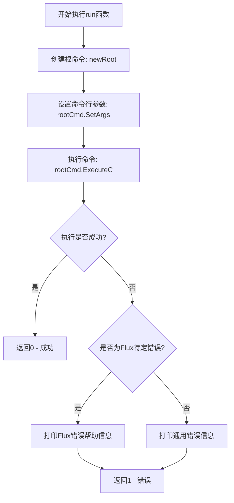

# `flux\cmd\fluxctl\main.go` 详细设计文档

这是Flux CD CLI工具的入口程序，负责解析命令行参数、执行root命令、处理错误并返回相应的退出码。

## 整体流程

```mermaid
graph TD
    A[开始] --> B[main函数入口]
    B --> C[调用run(os.Args[1:])]
    C --> D[newRoot().Command()创建根命令]
    D --> E[rootCmd.SetArgs(args)设置参数]
    E --> F[rootCmd.ExecuteC()执行命令]
    F --> G{执行是否出错?}
    G -- 否 --> H[返回0]
    G -- 是 --> I{错误类型是否为fluxerr.Error?}
    I -- 是 --> J[打印cause.Help帮助信息]
    I -- 否 --> K[打印通用错误信息和usage]
    J --> L[返回1]
    K --> L
    H --> M[os.Exit退出]
    L --> M
```

## 类结构

```
main包（无面向对象结构）
├── run函数（主逻辑处理）
└── main函数（程序入口）

注: newRoot()函数在外部定义（未在当前文件中显示）
```

## 全局变量及字段


### `args`
    
从os.Args[1:]获取的命令行参数切片

类型：`[]string`
    


### `rootCmd`
    
通过newRoot()创建的根命令对象，用于构建命令树

类型：`*cobra.Command`
    


### `cmd`
    
ExecuteC()执行后返回的实际执行的命令对象

类型：`*cobra.Command`
    


### `err`
    
命令执行过程中返回的错误对象

类型：`error`
    


### `cause`
    
通过errors.Cause()解包后的flux特定错误原因

类型：`*fluxerr.Error`
    


    

## 全局函数及方法


### `run`

该函数是CLI程序的入口点，负责解析命令行参数、执行根命令、处理错误并返回相应的退出码。

参数：

- `args`：`[]string`，命令行参数列表

返回值：`int`，返回0表示命令执行成功，返回1表示执行过程中发生错误

#### 流程图



#### 带注释源码

```go
// run 是CLI程序的入口函数，接收命令行参数并执行相应命令
// 参数args: 命令行参数列表（不包含程序名）
// 返回值: int - 0表示成功，1表示失败
func run(args []string) int {
    // 创建根命令并获取cobra命令对象
    rootCmd := newRoot().Command()
    
    // 设置命令行参数（不包含程序名本身）
    rootCmd.SetArgs(args)
    
    // 执行命令并获取执行的命令和可能发生的错误
    if cmd, err := rootCmd.ExecuteC(); err != nil {
        // 检查错误是否是Flux特定的错误类型
        // 使用errors.Cause获取原始错误，因为错误可能被包装多层
        if cause, ok := errors.Cause(err).(*fluxerr.Error); ok {
            // 如果是Flux错误，打印其帮助信息
            cmd.Println("== Error ==\n\n" + cause.Help)
        } else {
            // 否则打印通用错误信息
            cmd.Println("Error: " + err.Error())
            // 打印命令使用提示
            cmd.Printf("Run '%v --help' for usage.\n", cmd.CommandPath())
        }
        // 返回错误退出码
        return 1
    }
    // 命令执行成功，返回0
    return 0
}
```

#### 额外信息

| 项目 | 说明 |
|------|------|
| **所属包** | `main` |
| **依赖包** | `os`, `github.com/pkg/errors`, `github.com/fluxcd/flux/pkg/errors` |
| **调用位置** | 被 `main` 函数调用 `os.Exit(run(os.Args[1:]))` |
| **错误处理策略** | 使用错误链追溯原始错误，区分Flux特定错误与通用错误 |
| **设计模式** | 命令模式（基于Cobra框架） |


### `main`

程序入口函数，作为Go应用程序的启动点，负责接收命令行参数（排除程序本身名称），调用`run`函数执行核心逻辑，并根据`run`函数的返回结果通过`os.Exit`退出程序，返回相应的退出状态码。

参数：

- 无参数

返回值：无返回值（通过`os.Exit`传递退出状态码）

#### 流程图

```mermaid
flowchart TD
    A[程序启动] --> B[获取命令行参数 os.Args[1:]]
    B --> C[调用 run 函数]
    C --> D{run 返回值}
    D -->|返回 0| E[os.Exit 正常退出]
    D -->|返回 非0| F[os.Exit 异常退出]
    E --> G[程序结束]
    F --> G
```

#### 带注释源码

```go
// main 函数是程序的入口点
// 它不接收任何参数，也不返回值
// 而是通过 os.Exit 将程序的控制权交还给操作系统
func main() {
	// os.Args[1:] 获取命令行参数（排除程序本身名称）
	// 将参数传递给 run 函数执行实际逻辑
	// run 函数返回 int 类型的退出码
	// os.Exit 会立即终止程序并返回相应的退出状态码给操作系统
	os.Exit(run(os.Args[1:]))
}
```

## 关键组件


### 主入口函数 (main)

程序启动的入口点，调用 run 函数并通过 os.Exit 退出，返回运行结果的状态码。

### 运行函数 (run)

核心执行函数，负责创建根命令、设置命令行参数、执行命令并处理错误返回。它使用 cobra 风格的命令框架，调用 ExecuteC() 执行命令，并根据错误类型进行不同的格式化输出。

### 根命令创建 (newRoot)

创建命令行应用的根命令，虽然具体实现在当前代码段中未展示，但根据命名约定推断返回 cobra 的 Command 对象，用于组织所有子命令。

### 错误处理与格式化

针对 fluxerr 特定错误类型的处理逻辑，使用 errors.Cause 提取根本原因，如果是 fluxerr.Error 类型则打印其 Help 字段提供的详细帮助信息，否则打印通用错误消息。

### 命令行参数传递

通过 rootCmd.SetArgs(args) 设置命令行参数，args 来自 main 函数传入的 os.Args[1:]（跳过程序名）。


## 问题及建议


### 已知问题

- **外部依赖的 `newRoot()` 函数不可见**：`newRoot()` 函数在代码中未定义，依赖于外部包或同包其他文件，调用方无法了解其具体实现和可能的返回值风险
- **错误处理不够健壮**：仅处理 `fluxerr.Error` 类型，其他错误类型统一使用通用消息，可能导致用户无法获取有意义的错误指导
- **缺少日志系统**：没有任何日志记录，线上问题排查困难，无法追踪程序执行路径和潜在问题
- **硬编码的错误输出格式**：错误消息格式（"== Error ==\n\n"）硬编码在代码中，不利于国际化或后续样式调整
- **未处理 `cmd` 为 `nil` 的情况**：如果 `rootCmd.ExecuteC()` 返回错误但 `cmd` 为 `nil`，后续调用 `cmd.Println` 和 `cmd.CommandPath()` 将导致空指针异常
- **缺少程序执行上下文信息**：错误发生时未记录时间戳、命令行参数等调试信息

### 优化建议

- **增加空指针保护**：在调用 `cmd.Println` 和 `cmd.CommandPath()` 前检查 `cmd` 是否为 `nil`
- **引入结构化日志**：使用 `log/slog` 或 `zap` 等日志库记录错误上下文，便于问题排查
- **统一错误处理接口**：封装错误处理逻辑，支持更多错误类型，提供可配置的格式化器
- **提取魔法字符串**：将错误消息模板提取为常量或配置文件，支持多语言和主题定制
- **增加单元测试**：为 `run` 函数编写测试用例，覆盖正常流程和各类错误场景
- **添加信号处理**：考虑增加对系统信号（如 SIGINT、SIGTERM）的处理，实现优雅退出
- **考虑返回具体错误码**：将错误分类（权限错误、配置错误、网络错误等），返回更具体的退出码


## 其它


### 设计目标与约束

本程序作为Flux CLI工具的入口点，负责解析命令行参数并执行相应的子命令。设计目标包括：1) 提供统一的命令行入口；2) 规范化错误输出格式；3) 返回正确的退出状态码。约束条件：必须运行在Go 1.11+环境，支持Linux/macOS/Windows平台，需要导入fluxcd/flux和pkg/errors依赖包。

### 错误处理与异常设计

程序采用分层错误处理策略：run函数内部通过rootCmd.ExecuteC()捕获命令执行错误，然后使用errors.Cause()提取根本原因。若错误类型为fluxerr.Error，则输出格式化的帮助信息（cause.Help）；否则输出通用错误信息并提示用户查看帮助。返回值约定：正常执行返回0，异常返回1。错误信息输出到标准输出而非标准错误，以便与Cobra框架的输出行为保持一致。

### 外部依赖与接口契约

主要依赖包括：1) github.com/pkg/errors - 提供错误因果链追溯功能；2) github.com/fluxcd/flux/pkg/errors - Flux特定的错误类型定义；3) github.com/spf13/cobra - 命令行框架（从newRoot()和Command()方法推断）。接口契约：run函数接收[]string类型的命令行参数，返回int类型的退出码；main函数将os.Args[1:]传递给run并通过os.Exit()执行退出。

### 配置管理

本程序不包含内置配置管理逻辑，配置通过命令行参数传递给子命令。根命令通过newRoot()创建，其配置（如标志位、子命令等）在rootCmd定义时初始化。命令行参数解析由Cobra框架自动处理。

### 安全性考虑

程序本身为简单的入口包装，安全性主要依赖于：1) 命令行参数验证由Cobra框架和具体子命令负责；2) 错误信息输出时避免泄露敏感系统信息；3) 使用os.Exit()确保程序正确终止。潜在风险：错误信息中可能包含用户输入内容，需确保正确转义。

### 测试策略

由于代码量较小，建议采用单元测试和集成测试结合的方式：1) 单元测试覆盖run函数的错误处理分支，验证不同错误类型下的输出和返回值；2) 集成测试验证完整的命令行调用流程；3) Mock fluxerr.Error 以测试Flux特定错误格式的输出。

### 监控与日志

程序本身不实现日志记录功能，日志由具体子命令负责。错误输出直接使用cmd.Println()和cmd.Printf()，输出行为可通过Cobra框架的输出配置进行定制。建议在生产环境中集成结构化日志框架以支持日志聚合和分析。

### 性能考量

程序作为命令入口点，性能开销极低，主要时间消耗在Cobra框架初始化和子命令路由上。优化方向：1) 按需导入子命令以减少启动时间（使用cobra的AddCommand而非一次性加载所有子命令）；2) 避免在入口点进行不必要的初始化操作。

### 可维护性与扩展性

代码结构清晰，符合Go项目标准布局。扩展性设计：1) 新增子命令只需在newRoot()中注册；2) 错误类型可通过fluxerr.Error扩展；3) 错误输出格式可统一在入口点定制。建议添加注释说明错误处理策略，便于后续维护者理解。

    