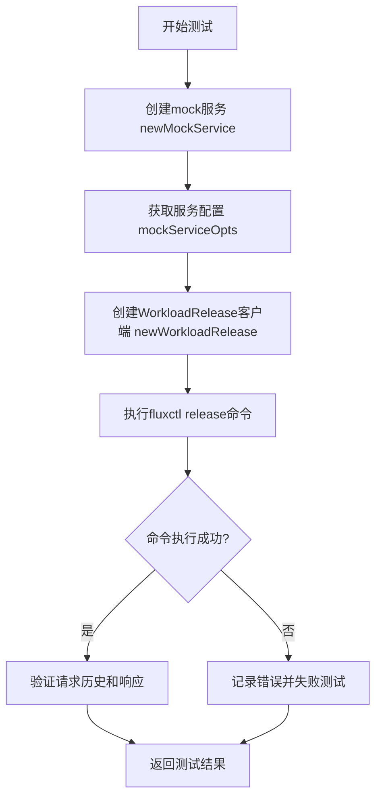
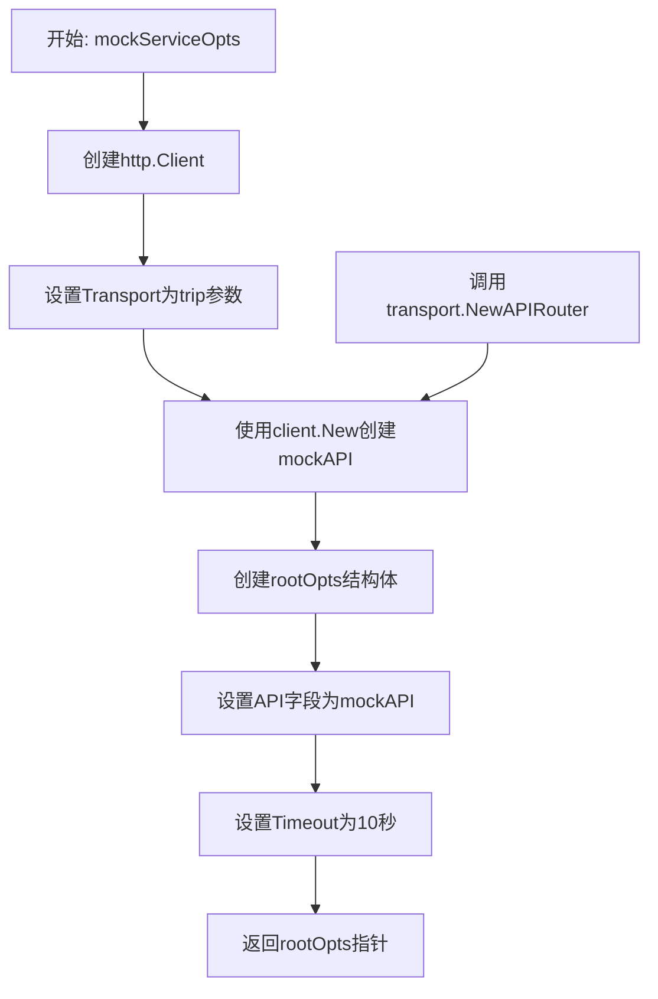
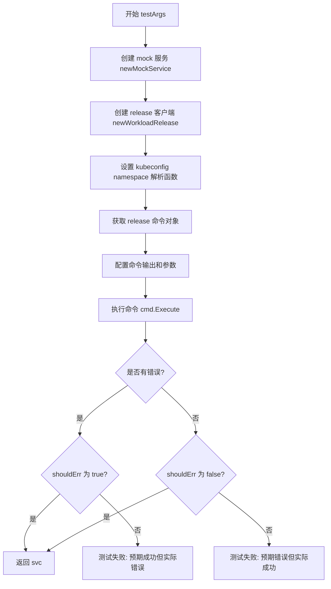
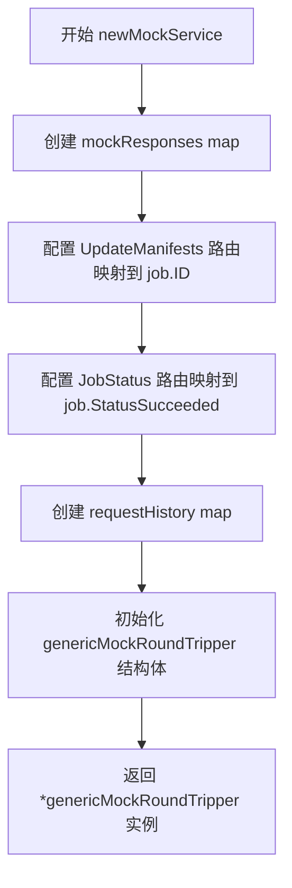
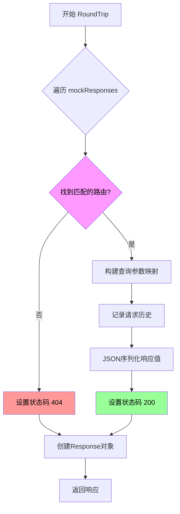
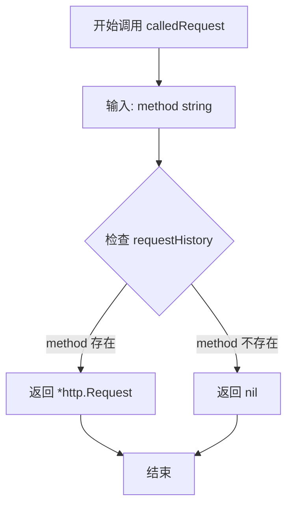
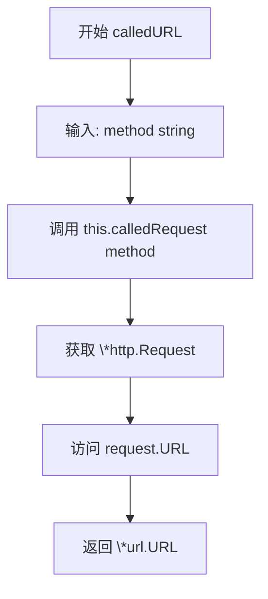

# `flux\cmd\fluxctl\main_test.go` 详细设计文档

这是一个Flux CD的集成测试文件，主要用于测试发布功能。它通过模拟HTTP请求/响应来测试fluxctl release命令的行为，验证与Flux API服务器的交互是否正确。

## 整体流程



## 类结构

```
测试模块
└── genericMockRoundTripper (HTTP模拟层)
    ├── 字段: mockResponses
    ├── 字段: requestHistory
    └── 方法: RoundTrip, calledRequest, calledURL
└── rootOpts (服务配置)
    ├── 字段: API
    └── 字段: Timeout
```

## 全局变量及字段


### `getKubeConfigContextNamespace`
    
Kubernetes配置上下文命名空间解析函数（测试中被mock）

类型：`func(s string, c string) string`
    


### `mockServiceOpts`
    
创建带有模拟HTTP传输层的服务配置选项

类型：`func(trip *genericMockRoundTripper) *rootOpts`
    


### `testArgs`
    
执行fluxctl release命令测试并验证预期结果

类型：`func(t *testing.T, args []string, shouldErr bool, errMsg string) *genericMockRoundTripper`
    


### `newMockService`
    
初始化模拟HTTP服务，包含预定义的API路由响应

类型：`func() *genericMockRoundTripper`
    


### `genericMockRoundTripper.mockResponses`
    
模拟的HTTP响应映射，用于匹配请求并返回预设响应

类型：`map[*mux.Route]interface{}`
    


### `genericMockRoundTripper.requestHistory`
    
请求历史记录，存储已接收的HTTP请求供后续验证

类型：`map[string]*http.Request`
    


### `rootOpts.API`
    
Flux API客户端，用于与Flux集群进行HTTP通信

类型：`client.Client`
    


### `rootOpts.Timeout`
    
请求超时时间，控制API调用的最大等待时长

类型：`time.Duration`
    
    

## 全局函数及方法


### `mockServiceOpts`

该函数用于创建模拟服务配置，初始化一个带有自定义 HTTP 传输层的客户端，并构建包含模拟 API 和超时设置的根选项对象，供测试场景使用。

参数：

- `trip`：`*genericMockRoundTripper`，模拟的 HTTP 传输层，用于拦截和模拟 HTTP 请求响应

返回值：`*rootOpts`，返回配置好的根选项结构体，包含模拟的 API 客户端和超时设置

#### 流程图



#### 带注释源码

```go
// mockServiceOpts 创建一个模拟服务配置，用于测试环境
// 参数 trip: 模拟的HTTP传输层，实现http.RoundTripper接口
// 返回值: 包含模拟API客户端和超时配置的rootOpts指针
func mockServiceOpts(trip *genericMockRoundTripper) *rootOpts {
	// 创建HTTP客户端，使用传入的mock transport作为传输层
	c := http.Client{
		Transport: trip,
	}
	
	// 使用client.New创建模拟API客户端
	// 参数: &c(客户端), transport.NewAPIRouter()(路由), "", ""(空字符串参数)
	mockAPI := client.New(&c, transport.NewAPIRouter(), "", "")
	
	// 构建并返回rootOpts结构体
	return &rootOpts{
		API:     mockAPI,      // 模拟的API客户端，用于模拟Flux API调用
		Timeout: 10 * time.Second, // 默认超时时间设为10秒
	}
}
```


### `testArgs`

该函数是测试辅助函数，用于模拟执行 `fluxctl release` 命令行操作，验证不同参数组合下的预期行为（成功或失败），并返回模拟的 HTTP 传输层以便后续验证请求历史。

参数：

- `t`：`testing.T`，Go 测试框架的测试对象，用于报告测试失败
- `args`：`[]string`，要执行的命令行参数列表
- `shouldErr`：`bool`，预期命令执行是否应该返回错误
- `errMsg`：`string`，当命令执行结果与预期不符时，期望显示的错误消息

返回值：`*genericMockRoundTripper`，返回模拟的 HTTP 往返传输对象，包含请求历史记录，可用于后续测试验证

#### 流程图



#### 带注释源码

```go
// testArgs 测试命令行参数执行，验证预期行为并返回 mock 服务供后续验证
// 参数说明：
//   - t: 测试框架对象
//   - args: 命令行参数
//   - shouldErr: 预期是否应报错
//   - errMsg: 自定义错误消息
func testArgs(t *testing.T, args []string, shouldErr bool, errMsg string) *genericMockRoundTripper {
    // 1. 创建模拟服务，返回包含预设响应的 mock HTTP 传输层
    svc := newMockService()
    
    // 2. 基于模拟服务创建发布客户端，用于构建 CLI 命令
    releaseClient := newWorkloadRelease(mockServiceOpts(svc))
    
    // 3. 覆盖 kubeconfig 上下文命名空间解析函数，返回固定命名空间以便测试
    getKubeConfigContextNamespace = func(s string, c string) string { return s }

    // 4. 获取 release 子命令并配置参数
    cmd := releaseClient.Command()
    cmd.SetOutput(ioutil.Discard)      // 丢弃命令输出
    cmd.SetArgs(args)                  // 设置命令行参数
    
    // 5. 执行命令并验证结果是否符合预期
    if err := cmd.Execute(); (err == nil) == shouldErr {
        if errMsg != "" {
            // 使用自定义错误消息报告失败
            t.Fatalf("%s: %s", args, errMsg)
        } else {
            // 使用实际错误报告失败
            t.Fatalf("%s: %v", args, err)
        }
    }
    
    // 6. 返回模拟服务，可用于后续验证 HTTP 请求历史
    return svc
}
```


### `newMockService`

该函数创建并返回一个配置了预定义模拟响应的 `genericMockRoundTripper` 实例，用于在测试中模拟 HTTP 客户端与 Flux API 的交互。

参数：
- 无参数

返回值：`*genericMockRoundTripper`，返回一个配置了模拟响应的通用模拟 round tripper 实例，可用于拦截和模拟 HTTP 请求。

#### 流程图



#### 带注释源码

```
// The mocked service is actually a mocked http.RoundTripper
func newMockService() *genericMockRoundTripper {
    // 返回一个配置了预定义模拟响应的 genericMockRoundTripper 指针
    // 该结构体包含两个核心字段：
    // 1. mockResponses: 路由到模拟响应值的映射，用于模拟 API 响应
    // 2. requestHistory: 请求历史记录，用于验证测试中的请求
	return &genericMockRoundTripper{
        // 模拟响应映射表，将路由与预期的响应值关联
		mockResponses: map[*mux.Route]interface{}{
            // 当请求匹配到 "UpdateManifests" 路由时，返回一个模拟的 job ID
			transport.NewAPIRouter().Get("UpdateManifests"): job.ID("here-is-a-job-id"),
            // 当请求匹配到 "JobStatus" 路由时，返回成功的 job 状态
			transport.NewAPIRouter().Get("JobStatus"): job.Status{
				StatusString: job.StatusSucceeded,
			},
		},
        // 初始化请求历史记录容器，用于存储测试过程中发出的请求
		requestHistory: make(map[string]*http.Request),
	}
}
```


### `genericMockRoundTripper.RoundTrip`

该方法实现了`http.RoundTripper`接口，核心功能是模拟HTTP请求处理。它通过遍历预定义的`mockResponses`映射，使用`mux.Route`匹配规则来匹配传入的HTTP请求，匹配成功后将模拟响应数据序列化为JSON并返回对应的HTTP响应，匹配失败则返回404状态码。

参数：

- `req`：`*http.Request`，传入的HTTP请求对象，包含请求方法、URL、头部等信息

返回值：

- `*http.Response`，模拟的HTTP响应对象，包含状态码和响应体
- `error`：错误信息，目前该方法始终返回nil（错误处理逻辑缺失）

#### 流程图



#### 带注释源码

```go
// RoundTrip 实现 http.RoundTripper 接口，模拟 HTTP 请求处理
// 参数: req *http.Request - 传入的 HTTP 请求
// 返回: *http.Response - 模拟的响应, error - 错误信息（当前始终返回 nil）
func (t *genericMockRoundTripper) RoundTrip(req *http.Request) (*http.Response, error) {
    // 用于存储 mux 路由匹配结果
    var matched mux.RouteMatch
    // 响应体字节数组
    var b []byte
    // 默认状态码为 404（未找到匹配）
    status := 404
    
    // 遍历所有预定义的模拟响应
    for k, v := range t.mockResponses {
        // 使用 mux 路由规则尝试匹配请求
        if k.Match(req, &matched) {
            // 将查询参数数组转换为逗号分隔的字符串映射
            queryParamsWithArrays := make(map[string]string, len(req.URL.Query()))
            for x, y := range req.URL.Query() {
                queryParamsWithArrays[x] = strings.Join(y, ",")
            }
            
            // 记录匹配到的请求到历史记录中，使用路由名称作为 key
            t.requestHistory[matched.Route.GetName()] = req
            
            // 将模拟响应值序列化为 JSON 格式
            b, _ = json.Marshal(v)
            
            // 匹配成功，设置状态码为 200
            status = 200
            // 跳出循环，找到第一个匹配后不再继续
            break
        }
    }
    
    // 返回模拟的 HTTP 响应
    return &http.Response{
        StatusCode: status,                        // HTTP 状态码
        Body:       ioutil.NopCloser(bytes.NewReader(b)), // 响应体（只读字节流）
    }, nil // 注意：此处始终返回 nil 错误，存在潜在的技术债务
}
```

#### 补充信息

**潜在技术债务与优化空间：**

1. **错误处理缺失**：方法中`json.Marshal(v)`和`req.URL.Query()`的操作都忽略了错误返回，可能导致隐藏的bug
2. **状态码硬编码**：默认404和成功200是硬编码的，应该考虑从mockResponses配置中读取或支持更多状态码
3. **查询参数处理未使用**：`queryParamsWithArrays`变量被计算但从未使用，可能是遗留代码
4. **循环遍历效率**：使用for循环遍历map，匹配到第一个后就break，但如果mockResponses较多可考虑使用更高效的数据结构

**接口契约：**

- 实现了标准库`net/http`包的`http.RoundTripper`接口
- 期望调用方传入有效的`*http.Request`对象
- 返回的`*http.Response`对象中Body字段实现了`io.ReadCloser`接口

**数据流：**

- 输入：HTTP请求（通过mux路由匹配）
- 处理：路由匹配 → 参数处理 → JSON序列化
- 输出：模拟的HTTP响应（状态码+JSON body）


### `genericMockRoundTripper.calledRequest`

该方法是 `genericMockRoundTripper` 类型的成员方法，用于根据指定的 HTTP 方法名称从请求历史记录中检索对应的 HTTP 请求对象，提供了对 mock 传输层记录的请求进行查询的能力。

参数：

- `method`：`string`，要查询的 HTTP 方法名称（如 "GET"、"POST" 等），用于在请求历史映射中查找对应的请求记录

返回值：`*http.Request`，返回与指定方法关联的 HTTP 请求对象，如果不存在则返回 `nil`

#### 流程图



#### 带注释源码

```go
// calledRequest 返回与指定HTTP方法关联的请求对象
// 参数: method - HTTP方法名称字符串
// 返回: 对应的HTTP请求指针,若不存在则返回nil
func (t *genericMockRoundTripper) calledRequest(method string) *http.Request {
	// 从 requestHistory 映射中查找指定 method 的请求记录
	// requestHistory 在 RoundTrip 方法中被填充,key 为 mux.Route 的名称
	return t.requestHistory[method]
}
```


### `genericMockRoundTripper.calledURL`

获取指定方法对应的请求URL，通过调用`calledRequest`方法获取请求记录，然后返回该请求的URL对象。

参数：

- `method`：`string`，要查询的请求方法名称，用于从请求历史记录中查找对应的请求

返回值：`*url.URL`，返回请求的URL对象，如果对应的请求不存在则可能返回nil

#### 流程图



#### 带注释源码

```
// calledURL 获取指定方法对应的请求URL
// 参数: method string - 请求方法名称,用于从请求历史中查找对应请求
// 返回: *url.URL - 请求的URL对象,如果请求不存在则返回nil
func (t *genericMockRoundTripper) calledURL(method string) (u *url.URL) {
    // 通过调用calledRequest方法获取请求记录
    // 然后直接返回该请求的URL字段
    return t.calledRequest(method).URL
}
```

## 关键组件


### genericMockRoundTripper

模拟HTTP传输层，用于在测试中拦截和模拟HTTP请求与响应，支持路由匹配、查询参数处理和请求历史记录。

### mockServiceOpts

创建测试用的服务配置opts，包含模拟的API客户端和超时设置，用于初始化命令执行环境。

### testArgs

测试参数验证函数，负责解析命令行参数、执行fluxctl release命令并验证预期结果（成功或失败），返回模拟服务实例。

### newMockService

初始化模拟服务，创建预定义的HTTP响应映射，包括UpdateManifests和JobStatus两个API端点的模拟返回值。

### RoundTrip

实现http.RoundTripper接口的核心方法，遍历mockResponses映射进行路由匹配，将请求URL查询参数转换为逗号分隔的字符串形式，并记录请求历史。

### calledRequest

根据方法名从请求历史记录中检索对应的HTTP请求对象，用于测试验证。

### calledURL

从请求历史中获取指定方法的URL对象，便于检查请求的URL参数和路径。

### transport.NewAPIRouter

Flux CD的API路由定义器，用于创建和注册API端点路由，组件包括Get("UpdateManifests")和Get("JobStatus")。

### client.New

Flux HTTP客户端构造函数，创建具有认证和路由功能的API客户端实例，用于与Flux集群通信。

### rootOpts

包含API客户端和超时时间的服务配置结构体，用于命令执行的上下文管理。

### job.ID

任务标识符类型，用于跟踪发布操作的异步任务状态。

### job.Status

任务状态对象，包含StatusString字段表示任务执行结果（如StatusSucceeded）。


## 问题及建议


### 已知问题

-   **map键使用指针类型**：`mockResponses`使用`*mux.Route`作为map的key，这是非常危险的。因为每次调用`transport.NewAPIRouter()`都会创建新的路由实例，导致指针地址不同，无法正确匹配mock响应。
-   **重复创建路由器**：在`newMockService`和`mockServiceOpts`中都调用了`transport.NewAPIRouter()`，但由于上述指针问题，mock可能无法正确工作。
-   **全局变量修改**：`getKubeConfigContextNamespace`作为全局函数变量被直接修改，违反测试隔离原则，可能影响其他测试。
-   **错误处理不完善**：`RoundTrip`方法中`json.Marshal(v)`的错误被忽略（使用 `_` 接收错误），`status`变量在循环外定义但逻辑不清晰。
-   **HTTP方法支持有限**：mock只支持GET方法（通过`transport.NewAPIRouter().Get()`），无法测试POST、PUT等方法。
-   **硬编码超时值**：`Timeout: 10 * time.Second`硬编码在`mockServiceOpts`中，缺乏灵活性。
-   **测试覆盖不足**：缺少对边界条件、超时场景、JSON解析失败、网络错误等的测试。

### 优化建议

-   **重构mock机制**：放弃使用`*mux.Route`指针作为map key，改为使用路径字符串或自定义标识符来管理mock响应。
-   **单例路由器**：创建一个共享的路由器实例，或使用依赖注入方式传入路由器。
-   **使用mock框架**：考虑使用`httptest`或`stretchr/testify`等成熟mock框架，提高测试可维护性。
-   **改进错误处理**：正确处理`json.Marshal`的返回值，或至少记录日志。
-   **参数化超时**：将超时时间作为配置参数传入，便于测试不同场景。
-   **测试隔离**：使用`t.Cleanup()`清理全局变量修改，或使用函数式选项模式替代全局变量修改。
-   **增加测试场景**：添加边界条件测试、并发测试、错误路径测试等。

## 其它


### 设计目标与约束

本测试模块旨在验证Flux CD的release功能，确保镜像更新和工作负载发布流程的正确性。核心约束包括：测试必须在隔离环境中运行（使用mock HTTP transport），不依赖真实Kubernetes集群；测试超时设置为10秒；必须支持多种命令行参数组合测试；mock服务必须能够模拟正常的API响应和错误场景。

### 错误处理与异常设计

测试中的错误处理采用Go标准testing框架的t.Fatalf机制。当命令执行结果与预期不符时（shouldErr与实际err不匹配），测试立即失败并输出详细的错误信息，包括执行的参数列表和具体错误内容。mock RoundTripper在匹配不到路由时返回404状态码，确保错误场景可被正确验证。参数校验错误通过shouldErr标志区分预期错误和意外错误。

### 外部依赖与接口契约

本模块依赖以下外部包：github.com/fluxcd/flux/pkg/http/client提供API客户端实现；github.com/gorilla/mux用于HTTP路由匹配；github.com/fluxcd/flux/pkg/job定义job.ID和job.Status类型；github.com/fluxcd/flux/pkg/http/transport提供APIRouter和RoundTripper接口。关键接口契约包括：RoundTripper接口的RoundTrip(req *http.Request)方法必须返回*http.Response和error；client.New需要传入http.Client、APIRouter、baseURL和token参数；Command()方法返回cobra.Command实例用于参数模拟。

### 性能要求与限制

测试执行性能要求：单个测试用例应在10秒内完成（通过Timeout: 10 * time.Second约束）；mock响应生成应在毫秒级完成；requestHistory映射操作应为O(1)复杂度。资源限制：每个测试创建独立的mockResponses和requestHistory映射，测试结束后由GC自动回收；避免在循环中创建大型对象以防止内存峰值。

### 安全性考虑

测试代码本身不涉及真实凭证或敏感数据，但mock实现需注意：mockResponses中的敏感数据（如job.ID）应使用测试专用值；不允许在mock中记录或输出真实请求内容；测试隔离确保不同测试用例之间无状态泄露。getKubeConfigContextNamespace函数被mock为直接返回输入字符串，避免实际文件系统访问。

### 兼容性设计

本测试代码兼容Go 1.11+模块系统；依赖的fluxcd/flux包版本需与主代码库同步更新；gorilla/mux版本需保持API兼容性（v1.8.0+）。测试参数格式与fluxctl命令行接口保持一致，确保在不同版本Flux CD中行为一致。

### 测试策略

采用黑盒测试策略，通过命令行参数模拟用户操作；使用mock替代真实HTTP服务端，避免外部依赖；每个testArgs调用执行独立的测试场景；验证重点包括：参数解析正确性、API调用顺序、响应处理逻辑、错误传播路径。测试覆盖场景：正常发布流程、参数校验失败、超时处理、API返回异常状态码。

### 配置管理

测试配置通过代码硬编码，未使用外部配置文件。关键配置项：mockServiceOpts中的Timeout值、mockResponses中的预设响应、testArgs中的shouldErr和errMsg参数。getKubeConfigContextNamespace函数被 monkey patch 为固定返回逻辑，避免读取用户kubeconfig文件。

    