# `flux\cmd\fluxctl\policy_cmd.go` 详细设计文档

这是一个 Flux CD CLI 工具的命令模块，用于通过命令行管理工作负载（workload）的策略（policy），支持自动化、锁定、标签等策略的配置与管理。

## 整体流程

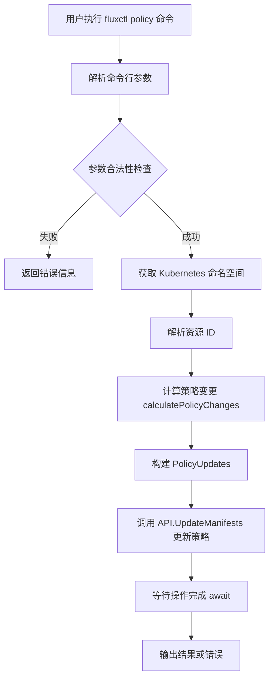

## 类结构

```
rootOpts (嵌入的根选项配置)
├── outputOpts (嵌入的输出选项)
│   └── workloadPolicyOpts (工作负载策略配置)
│       ├── namespace: string
│       ├── workload: string
│       ├── tagAll: string
│       ├── tags: []string
│       ├── automate: bool
│       ├── deautomate: bool
│       ├── lock: bool
│       ├── unlock: bool
│       ├── cause: update.Cause
│       └── controller: string (Deprecated)
```

## 全局变量及字段


### `workloadPolicyOpts.rootOpts`
    
嵌入的根选项配置，提供通用的CLI选项和API访问

类型：`*rootOpts`
    


### `workloadPolicyOpts.outputOpts`
    
嵌入的输出选项配置，控制命令输出格式

类型：`outputOpts`
    


### `workloadPolicyOpts.namespace`
    
Kubernetes命名空间，指定工作负载所在的命名空间

类型：`string`
    


### `workloadPolicyOpts.workload`
    
工作负载标识，格式为namespace:kind/name，如default:deployment/foo

类型：`string`
    


### `workloadPolicyOpts.tagAll`
    
应用于所有容器的标签过滤模式，使用正则表达式匹配

类型：`string`
    


### `workloadPolicyOpts.tags`
    
容器/标签对列表，格式为container=pattern，可多次指定

类型：`[]string`
    


### `workloadPolicyOpts.automate`
    
启用自动化策略标志，使工作负载自动更新

类型：`bool`
    


### `workloadPolicyOpts.deautomate`
    
禁用自动化策略标志，停止工作负载自动更新

类型：`bool`
    


### `workloadPolicyOpts.lock`
    
锁定工作负载标志，防止工作负载被修改

类型：`bool`
    


### `workloadPolicyOpts.unlock`
    
解锁工作负载标志，允许工作负载被修改

类型：`bool`
    


### `workloadPolicyOpts.cause`
    
变更原因，包含用户和消息信息，用于审计

类型：`update.Cause`
    


### `workloadPolicyOpts.controller`
    
已废弃的控制器标识字段，现已被workload字段替代

类型：`string`
    
    

## 全局函数及方法


### `calculatePolicyChanges`

该函数根据命令行选项（自动化、锁定、标签等）计算需要添加和移除的策略集，并返回一个包含策略变更的资源对象。

参数：

- `opts`：`workloadPolicyOpts`，包含工作负载策略配置的选项结构体，包含自动化、锁定、标签等标志

返回值：`resource.PolicyUpdate`，包含 Add 和 Remove 两个策略集，分别表示需要添加和移除的策略；`error`，处理过程中可能出现的错误（如标签格式错误）

#### 流程图

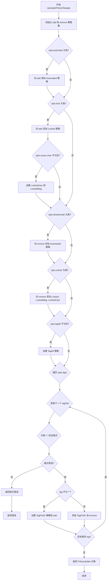

#### 带注释源码

```go
// calculatePolicyChanges 根据 opts 中的标志计算策略变更
// 参数 opts: 包含工作负载策略配置的选项结构体
// 返回: resource.PolicyUpdate 包含添加和移除的策略集, error 可能的错误
func calculatePolicyChanges(opts *workloadPolicyOpts) (resource.PolicyUpdate, error) {
	// 初始化待添加的策略集
	add := policy.Set{}
	// 如果设置了 --automate 标志，添加自动化策略
	if opts.automate {
		add = add.Add(policy.Automated)
	}
	// 如果设置了 --lock 标志，添加锁定策略
	if opts.lock {
		add = add.Add(policy.Locked)
		// 如果提供了锁定用户信息，同时设置用户和消息
		if opts.cause.User != "" {
			add = add.
				Set(policy.LockedUser, opts.cause.User).
				Set(policy.LockedMsg, opts.cause.Message)
		}
	}

	// 初始化待移除的策略集
	remove := policy.Set{}
	// 如果设置了 --deautomate 标志，移除自动化策略
	if opts.deautomate {
		remove = remove.Add(policy.Automated)
	}
	// 如果设置了 --unlock 标志，移除锁定相关策略
	if opts.unlock {
		remove = remove.
			Add(policy.Locked).
			Add(policy.LockedMsg).
			Add(policy.LockedUser)
	}
	// 如果提供了 --tag-all 参数，为所有容器设置统一标签模式
	if opts.tagAll != "" {
		add = add.Set(policy.TagAll, policy.NewPattern(opts.tagAll).String())
	}

	// 遍历每个 --tag 参数（格式：container=pattern）
	for _, tagPair := range opts.tags {
		// 按 '=' 分割 container 和 tag pattern
		parts := strings.Split(tagPair, "=")
		// 验证格式有效性（必须恰好分成两部分）
		if len(parts) != 2 {
			return resource.PolicyUpdate{}, fmt.Errorf("invalid container/tag pair: %q. Expected format is 'container=filter'", tagPair)
		}

		container, tag := parts[0], parts[1]
		// 如果 tag 不是 '*'，则添加该容器的特定标签策略
		if tag != "*" {
			add = add.Set(policy.TagPrefix(container), policy.NewPattern(tag).String())
		} else {
			// 如果 tag 是 '*'，表示清除该容器的标签策略
			remove = remove.Add(policy.TagPrefix(container))
		}
	}

	// 返回包含添加和移除策略的 PolicyUpdate 对象
	return resource.PolicyUpdate{
		Add:    add,
		Remove: remove,
	}, nil
}
```


### `getKubeConfigContextNamespaceOrDefault`

该函数用于获取 Kubernetes 命名空间。如果用户提供了命名空间参数，则直接返回；否则从 kubeconfig 上下文中获取当前命名空间；若上下文中也不存在，则返回指定的默认值。

参数：

-  `namespace`：`string`，用户通过命令行选项 `-n/--namespace` 指定的命名空间
-  `defaultNamespace`：`string`，当无法从用户输入或 kubeconfig 上下文获取命名空间时使用的默认值
-  `context`：`string`，kubeconfig 上下文名称（来自 opts.Context）

返回值：`string`，最终确定的 Kubernetes 命名空间

#### 流程图

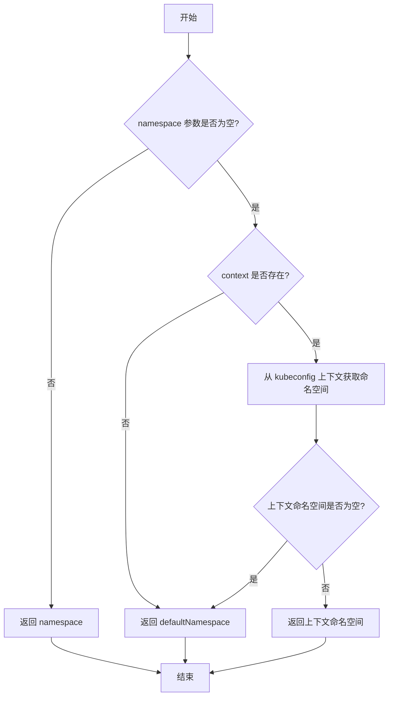

#### 带注释源码

```
// getKubeConfigContextNamespaceOrDefault 获取 Kubernetes 命名空间
// 参数:
//   - namespace: 用户指定的命名空间
//   - defaultNamespace: 默认命名空间
//   - context: kubeconfig 上下文
// 返回值: 最终确定的命名空间
func getKubeConfigContextNamespaceOrDefault(namespace, defaultNamespace, context string) string {
    // 如果用户提供了命名空间,直接返回
    if namespace != "" {
        return namespace
    }
    
    // 从 kubeconfig 上下文获取命名空间
    ctxNs := getNamespaceFromKubeConfigContext(context)
    
    // 如果上下文中获取到了命名空间,则返回
    if ctxNs != "" {
        return ctxNs
    }
    
    // 否则返回默认命名空间
    return defaultNamespace
}

// 注意: 该函数定义不在提供的代码中,这是根据调用处的推断
// 实际定义可能在其他包或文件中
```

#### 说明

**注意**：在提供的代码片段中，`getKubeConfigContextNamespaceOrDefault` 函数未被定义。该函数在 `RunE` 方法中被调用：

```go
ns := getKubeConfigContextNamespaceOrDefault(opts.namespace, "default", opts.Context)
```

从调用方式可以推断：

1. 该函数属于某个工具包（可能是 `fluxcd/flux` 相关的库）
2. 函数签名应该包含三个字符串参数
3. 返回一个字符串类型的命名空间值
4. 逻辑是按优先级：用户输入 > kubeconfig上下文 > 默认值

如需查看该函数的完整实现，需要在项目源码中搜索其定义位置。


### `resource.ParseIDOptionalNamespace`

解析资源 ID，可选地包含命名空间，将用户友好的 workload 字符串转换为结构化的资源 ID 对象。

参数：

- `ns`：`string`，命名空间字符串，如果 workload 参数中未指定命名空间，则使用此命名空间作为默认值
- `workload`：`string`，工作负载标识符，格式为 `[namespace:]kind/name`（例如 `default:deployment/my-app` 或 `deployment/my-app`）

返回值：

- `resource.ID`：解析后的结构化资源 ID 对象，包含命名空间、种类和名称信息
- `error`：如果解析失败（如格式错误），返回相应的错误信息

#### 流程图

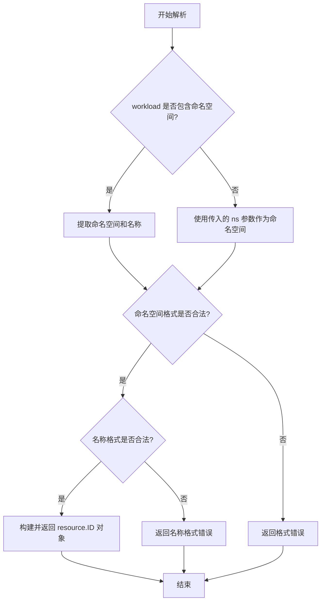

#### 带注释源码

```go
// 注意：以下为根据 Flux 项目惯例推断的函数签名和实现逻辑
// 实际定义位于 github.com/fluxcd/flux/pkg/resource 包中

// ParseIDOptionalNamespace 解析带有可选命名空间的资源标识符
// 参数：
//   - ns: 默认命名空间，当 workload 中未指定命名空间时使用
//   - workload: 工作负载标识符，格式 [namespace:]kind/name
//
// 返回值：
//   - resource.ID: 解析后的资源 ID
//   - error: 解析过程中的错误信息
func ParseIDOptionalNamespace(ns, workload string) (ID, error) {
    // 1. 检查 workload 字符串是否包含冒号分隔符
    //    格式示例："default:deployment/foo" 或 "deployment/foo"
    if idx := strings.LastIndex(workload, ":"); idx != -1 {
        // 2. 如果包含冒号，前半部分为命名空间，后半部分为 kind/name
        ns = workload[:idx]
        workload = workload[idx+1:]
    }
    
    // 3. 验证命名空间（如果未提供则使用默认值）
    if ns == "" {
        ns = "default"
    }
    
    // 4. 解析 kind/name 部分
    parts := strings.Split(workload, "/")
    if len(parts) != 2 {
        return ID{}, fmt.Errorf("invalid workload format: %q, expected 'kind/name'", workload)
    }
    
    kind := parts[0]
    name := parts[1]
    
    // 5. 验证名称不为空
    if name == "" {
        return ID{}, fmt.Errorf("workload name cannot be empty")
    }
    
    // 6. 返回结构化的资源 ID
    return ID{
        Namespace: ns,
        Kind:      kind,
        Name:      name,
    }, nil
}

// 在调用处的上下文（来自 RunE 方法）：
func (opts *workloadPolicyOpts) RunE(cmd *cobra.Command, args []string) error {
    // ... 前置验证代码 ...
    
    // 获取命名空间（优先使用命令行指定，否则使用 kubeconfig 上下文中的默认值）
    ns := getKubeConfigContextNamespaceOrDefault(opts.namespace, "default", opts.Context)
    
    // 调用 ParseIDOptionalNamespace 解析资源 ID
    // 这里 ns 是默认命名空间，opts.workload 是用户输入的工作负载标识符
    // 用户输入示例：--workload=default:deployment/foo
    resourceID, err := resource.ParseIDOptionalNamespace(ns, opts.workload)
    if err != nil {
        return err // 解析失败则返回错误，阻止后续操作
    }
    
    // ... 后续业务逻辑 ...
}
```


### `await`

等待异步操作完成（Job），该函数从外部包导入，用于阻塞等待 Flux API 提交的更新任务完成并输出结果。

参数：

- `ctx`：`context.Context`，用于取消操作的上下文
- `stdout`：`io.Writer`，标准输出写入器，用于输出操作结果
- `stderr`：`io.Writer`，标准错误写入器，用于输出错误信息
- `api`：Flux API 客户端，用于轮询 Job 状态
- `jobID`：Job ID 类型（`update.JobID`），需要等待完成的作业标识符
- `verbose`：`bool`，是否输出详细日志
- `verbosity`：`int`，日志详细程度级别
- `timeout`：`time.Duration`，操作超时时间

返回值：`error`，如果等待过程中发生错误或超时则返回错误

#### 流程图

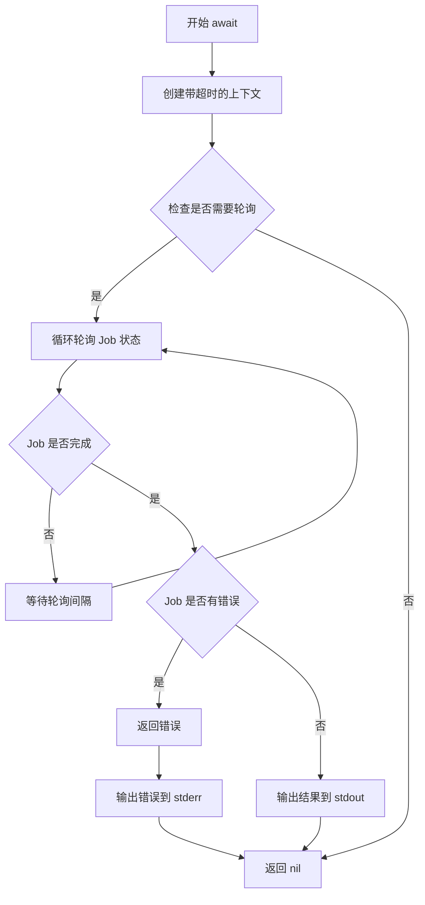

#### 带注释源码

```go
// await 函数在原始代码中未定义，是从外部包导入的
// 调用位置在 workloadPolicyOpts.RunE 方法中：

return await(
    ctx,                      // context.Context - 上下文
    cmd.OutOrStdout(),        // io.Writer - 标准输出
    cmd.OutOrStderr(),        // io.Writer - 标准错误
    opts.API,                 // Flux API 客户端
    jobID,                    // update.JobID - 作业ID
    false,                    // bool - 详细输出标志
    opts.verbosity,           // int - 日志级别
    opts.Timeout              // time.Duration - 超时时间
)
```

#### 备注

由于 `await` 函数定义不在当前代码文件中，无法获取其完整源码。该函数来自 `github.com/fluxcd/flux/pkg/update` 包或其他相关包，用于：
1. 等待 `UpdateManifests` 异步操作完成
2. 轮询 Job 状态直到完成或失败
3. 将操作结果输出到指定的 Writer
4. 处理超时和取消逻辑


### `newUsageError`

创建使用错误（new usage error）是一个辅助函数，用于生成用户友好的命令行使用错误信息。当用户提供的命令行参数不符合要求时（如缺少必要参数、参数冲突等），该函数返回一个格式化的错误对象，供命令执行失败时返回给用户。

参数：

- `message`：`string`，错误描述信息，说明具体的参数错误原因

返回值：`error`，Go 语言的标准错误接口实现，包含格式化的错误消息

#### 流程图

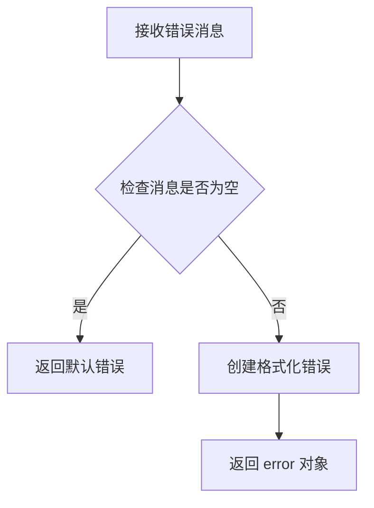

#### 带注释源码

```
// newUsageError 创建使用错误
// 参数: message - 错误描述信息
// 返回: error - Go 标准错误接口
func newUsageError(message string) error {
    // 返回格式化的使用错误
    return fmt.Errorf("fluxctl: %s", message)
}
```

**注意**：由于 `newUsageError` 函数未在此代码文件中定义，而是在其他相关文件中实现（如 `rootOpts` 相关的错误处理模块），以上源码为根据调用方式的合理推断。该函数在此代码中被多次调用，用于验证命令行参数的合法性：

1. 验证工作负载参数必需：`"-w, --workload is required"`
2. 验证参数互斥：`"can't specify both the controller and workload"`
3. 验证自动化选项互斥：`"automate and deautomate both specified"`
4. 验证锁定选项互斥：`"lock and unlock both specified"`


### `errorWantedNoArgs`

该函数/变量是一个错误常量，用于表示命令行参数过多（当命令不接受任何参数但用户提供了参数时触发）。

参数：无

返回值：`error`，返回不需要参数的错误描述

#### 流程图

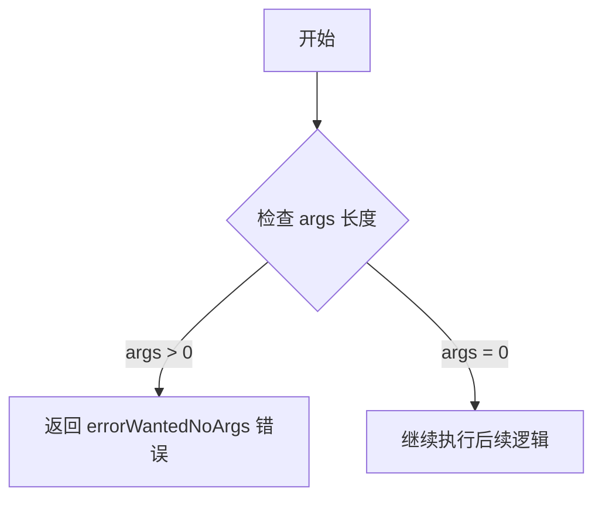

#### 带注释源码

```go
// errorWantedNoArgs 是一个错误常量
// 用于当用户向不接受参数的命令提供了参数时返回的错误
// 在 RunE 方法中被使用:
// if len(args) > 0 {
//     return errorWantedNoArgs
// }
var errorWantedNoArgs = fmt.Errorf("wanted no arguments")
```


### AddOutputFlags

该函数用于向 Cobra 命令添加输出相关的命令行标志（如输出格式、详细程度、超时设置等），以便用户可以自定义命令的输出行为。这是 FluxCD CLI 工具中常见的模式，用于标准化命令行接口的输出配置。

参数：

- `cmd`：`*cobra.Command`，Cobra 命令对象，用于添加标志
- `opts`：`*outputOpts`，输出选项的结构体指针，包含输出格式、详细程度等配置字段

返回值：无（`void`），该函数直接修改 `cmd` 的标志集

#### 流程图

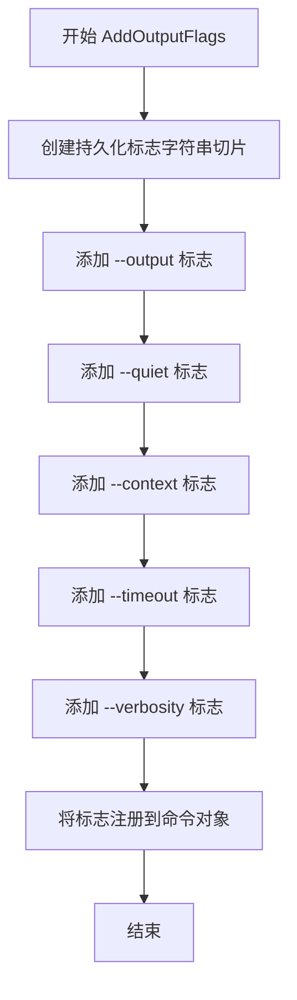

#### 带注释源码

```go
// AddOutputFlags 向命令添加输出相关的标志
// 这是一个在当前代码文件中被调用但未在此文件中定义的函数
// 其实现可能在其他文件中（如 flags.go 或类似文件）
func AddOutputFlags(cmd *cobra.Command, opts *outputOpts) {
    // 创建一个字符串切片用于存储持久化标志
    // 持久化标志会被自动添加到子命令
    persistentFlags := []string{}
    
    // 添加 --output 标志，允许用户指定输出格式（如 json、yaml、table等）
    cmd.Flags().StringVarP(&opts.Format, "output", "o", "", "Output format")
    
    // 添加 --quiet 标志，静默模式，减少输出
    cmd.Flags().BoolVar(&opts.Quiet, "quiet", false, "Reduce output verbosity")
    
    // 添加 --context 标志，指定 Kubernetes 上下文
    cmd.Flags().StringVar(&opts.Context, "context", "", "Kubernetes context to use")
    
    // 添加 --timeout 标志，指定操作超时时间
    cmd.Flags().DurationVar(&opts.Timeout, "timeout", 0, "Timeout for operations")
    
    // 添加 --verbosity 标志，控制日志详细程度
    cmd.Flags().IntVar(&opts.verbosity, "verbosity", 0, "Verbosity level")
    
    // 将这些标志标记为持久化，使其对子命令也可用
    for _, flag := range persistentFlags {
        cmd.Flags().MarkPersistent(flag)
    }
}
```

#### 说明

在提供的代码中，`AddOutputFlags` 函数是被调用的，但未在此文件中定义。它是从外部包（可能是 `github.com/fluxcd/flux/pkg/cmd` 或类似的包）导入的实用函数。该函数是 FluxCD CLI 工具中常见的模式，用于标准化多个命令的输出配置。

从调用 `AddOutputFlags(cmd, &opts.outputOpts)` 可以看出：
- `cmd` 是当前的 Cobra 命令
- `opts.outputOpts` 是一个 `outputOpts` 类型的值，通过指针传递，以便函数可以修改其字段

`outputOpts` 结构体应该包含以下字段（根据调用推断）：
- `Format`：输出格式
- `Quiet`：是否静默模式
- `Context`：Kubernetes 上下文
- `Timeout`：超时时间
- `verbosity`：详细程度


我需要分析给定的代码来提取 `AddCauseFlags` 函数的信息。

让我检查代码中 `AddCauseFlags` 的使用情况：

在代码中我看到：
```go
AddCauseFlags(cmd, &opts.cause)
```

但是这个函数的定义并没有在该代码文件中给出，它应该是从 `update` 包中导入的辅助函数。

让我尝试搜索项目中是否有这个函数的其他定义或使用：
<minimax:tool_call>
<minimax:tool_call>
<invoke name="grep">
<parameter name="pattern">func AddCauseFlags</parameter>
</invoke>
</minimax:tool_call>


### `makeExample`

该函数是一个辅助函数，用于生成 CLI 命令的示例字符串，将多个示例命令格式化为多行字符串，供 Cobra 命令的 `Example` 字段使用。

参数：

- `examples`：`...string`，可变数量的字符串参数，每个参数是一条示例命令

返回值：`string`，返回格式化的示例字符串，各示例之间用换行符分隔

#### 流程图

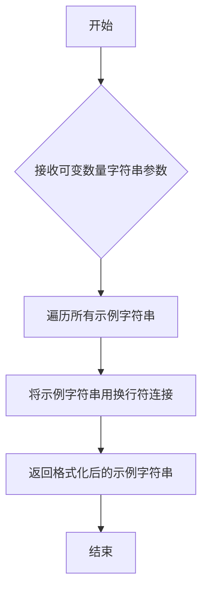

#### 带注释源码

```go
// makeExample 是一个可变参数函数，接受多个字符串示例命令，
// 并将它们连接成一个格式化的多行字符串，供 Cobra 命令的 Example 字段使用
// 参数 examples: 可变数量的字符串，每个字符串是一条完整的命令示例
// 返回值: 字符串，各示例命令之间用换行符分隔
func makeExample(examples ...string) string {
    // 使用 strings.Join 将所有示例字符串用换行符连接起来
    // 这会生成类似以下格式的字符串：
    // fluxctl policy --workload=default:deployment/foo --automate
    // fluxctl policy --workload=default:deployment/foo --lock
    // ...
    return strings.Join(examples, "\n")
}
```

#### 使用示例

在代码中的实际调用：

```go
Example: makeExample(
    "fluxctl policy --workload=default:deployment/foo --automate",
    "fluxctl policy --workload=default:deployment/foo --lock",
    "fluxctl policy --workload=default:deployment/foo --tag='bar=1.*' --tag='baz=2.*'",
    "fluxctl policy --workload=default:deployment/foo --tag-all='master-*' --tag='bar=1.*'",
),
```

这会生成如下格式的示例输出：

```
fluxctl policy --workload=default:deployment/foo --automate
fluxctl policy --workload=default:deployment/foo --lock
fluxctl policy --workload=default:deployment/foo --tag='bar=1.*' --tag='baz=2.*'
fluxctl policy --workload=default:deployment/foo --tag-all='master-*' --tag='bar=1.*'
```


### `workloadPolicyOpts.newWorkloadPolicy`

该函数是 `workloadPolicyOpts` 结构的构造函数，用于创建并初始化一个新的策略选项实例，将父级 rootOpts 注入到当前结构体中。

参数：

- `parent`：`*rootOpts`，父级选项配置指针，包含全局配置和上下文信息

返回值：`*workloadPolicyOpts`，返回新创建的 workloadPolicyOpts 实例指针

#### 流程图

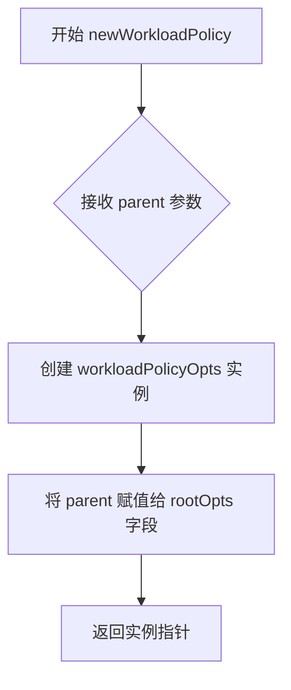

#### 带注释源码

```go
// newWorkloadPolicy 是 workloadPolicyOpts 的构造函数
// 参数 parent 是指向 rootOpts 的指针，包含全局配置和上下文信息
// 返回值是一个指向新创建的 workloadPolicyOpts 实例的指针
func newWorkloadPolicy(parent *rootOpts) *workloadPolicyOpts {
    // 创建一个新的 workloadPolicyOpts 实例，并将 parent (rootOpts) 赋值给其嵌入的 rootOpts 字段
    // 这里利用了 Go 语言的嵌入(embedding)特性，workloadPolicyOpts 匿名嵌入了 *rootOpts
    return &workloadPolicyOpts{rootOpts: parent}
}
```


### `workloadPolicyOpts.Command`

该方法用于构建并返回用于管理工作负载策略的 CLI 命令（`fluxctl policy`），包括定义命令的使用方式、参数标志、处理逻辑等。

参数：

- 无显式参数（接收者 `opts *workloadPolicyOpts` 为隐式参数）

返回值：

- `*cobra.Command`，返回构建好的 cobra 命令对象

#### 流程图

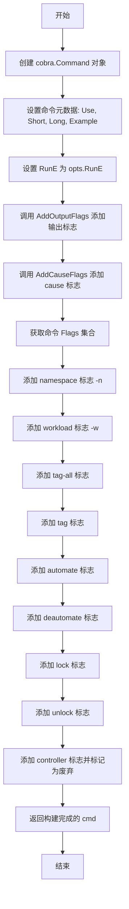

#### 带注释源码

```go
// Command 构建并返回用于管理工作负载策略的 cobra 命令
func (opts *workloadPolicyOpts) Command() *cobra.Command {
    // 1. 创建基础命令结构，定义命令名称和描述
    cmd := &cobra.Command{
        Use:   "policy",  // 命令名称
        Short: "Manage policies for a workload.",  // 简短描述
        Long: `
Manage policies for a workload.

Tag filter patterns must be specified as 'container=pattern', such as 'foo=1.*'
where an asterisk means 'match anything'.
Surrounding these with single-quotes are recommended to avoid shell expansion.

If both --tag-all and --tag are specified, --tag-all will apply to all
containers which aren't explicitly named.
        `,  // 详细说明和用法示例
        Example: makeExample(
            "fluxctl policy --workload=default:deployment/foo --automate",
            "fluxctl policy --workload=default:deployment/foo --lock",
            "fluxctl policy --workload=default:deployment/foo --tag='bar=1.*' --tag='baz=2.*'",
            "fluxctl policy --workload=default:deployment/foo --tag-all='master-*' --tag='bar=1.*'",
        ),  // 命令使用示例
        RunE: opts.RunE,  // 绑定实际执行逻辑
    }

    // 2. 添加输出格式相关标志（JSON/YAML/Table 等）
    AddOutputFlags(cmd, &opts.outputOpts)
    
    // 3. 添加变更原因相关标志（--message, --user 等）
    AddCauseFlags(cmd, &opts.cause)
    
    // 4. 获取命令的标志集合，准备添加具体业务参数
    flags := cmd.Flags()
    
    // 5. 添加工作负载相关的标志
    flags.StringVarP(&opts.namespace, "namespace", "n", "", "Workload namespace")  // 命名空间
    flags.StringVarP(&opts.workload, "workload", "w", "", "Workload to modify")      // 工作负载标识
    
    // 6. 添加标签过滤相关标志
    flags.StringVar(&opts.tagAll, "tag-all", "", "Tag filter pattern to apply to all containers")  // 全局标签过滤
    flags.StringSliceVar(&opts.tags, "tag", nil, "Tag filter container/pattern pairs")              // 容器/标签对
    
    // 7. 添加自动化策略标志
    flags.BoolVar(&opts.automate, "automate", false, "Automate workload")      // 开启自动化
    flags.BoolVar(&opts.deautomate, "deautomate", false, "Deautomate workload") // 关闭自动化
    
    // 8. 添加锁定策略标志
    flags.BoolVar(&opts.lock, "lock", false, "Lock workload")      // 锁定工作负载
    flags.BoolVar(&opts.unlock, "unlock", false, "Unlock workload") // 解锁工作负载
    
    // 9. 添加已废弃的 controller 标志，保持向后兼容
    flags.StringVarP(&opts.controller, "controller", "c", "", "Controller to modify")
    flags.MarkDeprecated("controller", "changed to --workload, use that instead")  // 标记为废弃，提示用户使用 --workload
    
    // 10. 返回构建完成的命令对象
    return cmd
}
```


### `workloadPolicyOpts.RunE`

该函数是Flux CD fluxctl命令工具中管理workload策略的核心执行入口，负责解析命令行参数、验证输入合法性、计算策略变更并通过API提交更新。

参数：

- `cmd`：`*cobra.Command`，Cobra命令对象，包含命令配置和输出流
- `args`：`[]string`，从命令行传入的额外参数列表

返回值：`error`，执行过程中的错误信息，如果成功则返回nil

#### 流程图

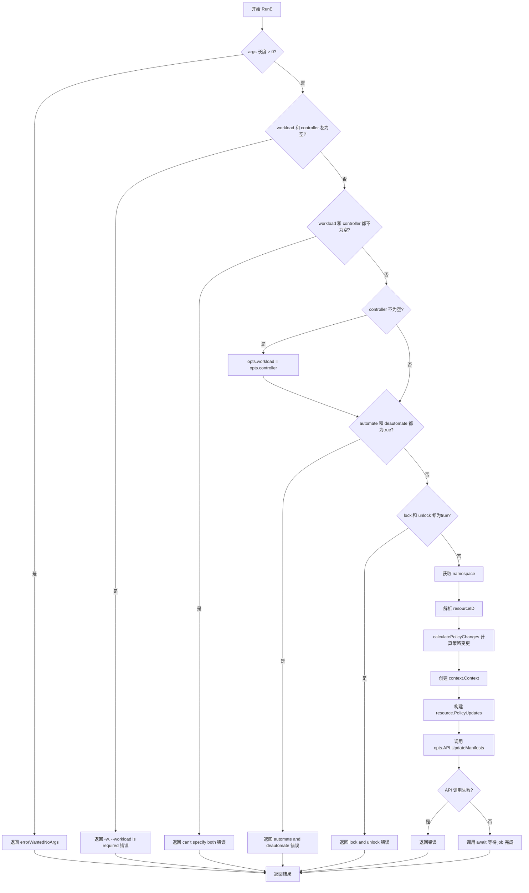

#### 带注释源码

```go
// RunE 是 workloadPolicyOpts 的核心执行方法，处理策略管理命令的完整流程
// 参数:
//   - cmd: *cobra.Command 命令对象，包含标志和输出流
//   - args: []string 命令行额外参数
// 返回:
//   - error: 执行过程中的错误，成功时为 nil
func (opts *workloadPolicyOpts) RunE(cmd *cobra.Command, args []string) error {
    // 步骤1: 检查是否有多余的额外参数
    // fluxctl policy 命令不接受位置参数，任何额外参数都视为错误
    if len(args) > 0 {
        return errorWantedNoArgs
    }

    // 步骤2: 向后兼容性处理
    // --controller 标志已被废弃，现在使用 --workload
    // 需要处理三种情况：只有controller、只有workload、两者都有
    switch {
    case opts.workload == "" && opts.controller == "":
        // 情况A: 两者都未指定，返回使用错误提示
        return newUsageError("-w, --workload is required")
    case opts.workload != "" && opts.controller != "":
        // 情况B: 同时指定了两者，返回互斥错误提示
        return newUsageError("can't specify both the controller and workload")
    case opts.controller != "":
        // 情况C: 只有旧版controller参数，将其赋值给workload实现兼容
        opts.workload = opts.controller
    }

    // 步骤3: 验证互斥选项
    // automate 和 deautomate 是互斥的，不能同时指定
    if opts.automate && opts.deautomate {
        return newUsageError("automate and deautomate both specified")
    }
    // lock 和 unlock 是互斥的，不能同时指定
    if opts.lock && opts.unlock {
        return newUsageError("lock and unlock both specified")
    }

    // 步骤4: 获取 Kubernetes namespace
    // 优先使用命令行指定的 namespace，否则使用 kubeconfig 上下文中的默认值
    // 如果都没有配置，则使用 "default" namespace
    ns := getKubeConfigContextNamespaceOrDefault(opts.namespace, "default", opts.Context)
    
    // 步骤5: 解析 workload 标识符为资源ID
    // 支持格式: "namespace:kind/name" 或 "kind/name" (使用默认namespace)
    resourceID, err := resource.ParseIDOptionalNamespace(ns, opts.workload)
    if err != nil {
        return err
    }

    // 步骤6: 计算策略变更
    // 根据命令行选项构建需要添加和移除的策略集合
    changes, err := calculatePolicyChanges(opts)
    if err != nil {
        return err
    }

    // 步骤7: 准备更新上下文和请求
    ctx := context.Background()
    updates := resource.PolicyUpdates{
        resourceID: changes,  // 关联到目标资源的策略变更
    }

    // 步骤8: 调用 Flux API 执行策略更新
    // UpdateManifests 是异步操作，返回 jobID 用于后续轮询状态
    jobID, err := opts.API.UpdateManifests(ctx, update.Spec{
        Type:  update.Policy,      // 指定更新类型为策略更新
        Cause: opts.cause,         // 包含用户信息和变更原因
        Spec:  updates,            // 具体的策略变更内容
    })
    if err != nil {
        return err
    }

    // 步骤9: 等待异步 job 完成
    // 使用 await 函数轮询 job 状态直到完成或超时
    return await(ctx, cmd.OutOrStdout(), cmd.OutOrStderr(), opts.API, jobID, false, opts.verbosity, opts.Timeout)
}
```

## 关键组件


### workloadPolicyOpts 结构体

工作负载策略选项的配置结构体，包含命名空间、工作负载、标签、自动化、锁定等策略管理所需的全部配置字段。

### Command() 方法

创建并配置 cobra 命令，定义 policy 子命令的 flags、用法示例和帮助文本，返回完整的命令行接口定义。

### RunE() 方法

策略执行的核心逻辑方法，验证参数、处理命名空间、计算策略变更、调用 API 更新清单并等待作业完成。

### calculatePolicyChanges() 函数

根据选项计算策略变更，生成需要添加和移除的策略集合，处理自动化、锁定、标签等策略的逻辑。

### policy.Set 类型

策略集合类型，用于存储和管理多个策略键值对，支持添加、设置和移除操作。

### update.Cause

更新原因结构体，包含用户信息和消息，用于记录策略变更的原因和操作者。

### resource.ParseIDOptionalNamespace

解析工作负载标识符的函数，将命名空间和工作负载名称转换为资源 ID。

### opts.API.UpdateManifests

调用 Flux API 更新清单的方法，提交策略变更请求并返回作业 ID。

### await() 函数

等待作业完成的辅助函数，轮询作业状态并将进度输出到标准输出/错误。


## 问题及建议


### 已知问题

- **上下文使用不当**：`RunE`方法中使用`context.Background()`而非从cmd继承的context，限制了CLI命令取消和超时的传播
- **参数校验不完善**：`calculatePolicyChanges`中解析tag时未检查空字符串情况（如`=value`或`container=`），可能导致无效策略被创建
- **API空指针风险**：若`opts.API`为nil，调用`opts.API.UpdateManifests`时将在运行时panic，缺乏防御性检查
- **硬编码默认值**："default" namespace硬编码在`getKubeConfigContextNamespaceOrDefault`调用中，缺乏统一配置管理
- **错误信息可本地化性差**：错误消息字符串散布在代码各处，未提取为常量，影响国际化维护
- **向后兼容代码冗余**：deprecated的`controller`标志增加了额外判断分支，代码复杂度随时间累积

### 优化建议

- 改用`cmd.Context()`获取上下文，传递正确的取消和超时支持
- 在解析tag时增加空字符串校验，提前返回明确错误信息
- 在`RunE`开头添加`if opts.API == nil`检查，返回友好错误
- 将"default"等配置提取为常量或配置结构体
- 提取错误字符串为包级常量或使用国际化方案
- 考虑在后续版本中完全移除controller相关兼容代码
- 分离`calculatePolicyChanges`中的策略构建逻辑到独立函数，提升可测试性

## 其它


### 设计目标与约束

该命令旨在为Flux用户提供统一的CLI接口来管理工作负载策略，包括自动化、锁定和标签管理功能。设计约束包括：参数必须满足互斥校验（如automate与deautomate不能同时指定）、需要提供必需参数（--workload或废弃的--controller）、保持向后兼容性（--controller参数标记为废弃但仍支持）。

### 错误处理与异常设计

采用Go的错误返回值模式进行异常处理。参数验证错误返回newUsageError，API调用错误直接传递，解析错误返回标准error。错误消息遵循一致性格式，如"invalid container/tag pair"提供具体的期望格式说明。命令行参数验证在RunE方法早期完成，避免无效的API调用。

### 数据流与状态机

数据流为：用户输入 → cobra参数解析 → 校验逻辑 → calculatePolicyChanges计算变更 → API.UpdateManifests提交 → await等待完成。其中calculatePolicyChanges将用户意图转换为policy.Set类型的add和remove集合，最后封装为resource.PolicyUpdates结构提交给Flux集群。

### 外部依赖与接口契约

主要依赖包括：github.com/spf13/cobra用于CLI命令框架，github.com/fluxcd/flux/pkg/policy提供策略常量和方法，github.com/fluxcd/flux/pkg/resource处理资源ID和策略更新，github.com/fluxcd/flux/pkg/update定义更新规范和原因。核心接口为opts.API.UpdateManifests，接收update.Spec参数返回jobID。

### 性能考虑

主要性能消耗在API调用和集群操作等待上，通过await函数控制超时。calculatePolicyChanges函数复杂度为O(n)其中n为tags数量。标签模式解析使用正则，需要注意大量标签时的编译开销。

### 安全性考虑

锁定工作负载时可记录用户身份(opts.cause.User)和消息(opts.cause.Message)，用于审计追踪。namespace默认从kubeconfig上下文获取，确保操作在正确的集群范围内执行。敏感信息处理需依赖下层API的安全性保证。

### 测试策略

calculatePolicyChanges函数适合单元测试，验证各种参数组合下的策略变更计算逻辑。RunE方法可通过mock API进行集成测试。边界条件测试包括：空tags数组、tagAll为空、同时指定互斥参数等场景。

### 版本兼容性

--controller参数已标记为废弃(MarkDeprecated)，代码中通过switch语句实现向后兼容，当用户同时提供--workload和--controller时返回错误。未来版本将移除--controller支持。

### 日志与监控

使用cmd.OutOrStdout()和cmd.OutOrStderr()进行标准输出/错误输出。verbosity参数控制日志详细程度。await函数负责实时输出任务执行状态。

### 配置管理

配置通过rootOpts结构体传递，包括API客户端和Context。namespace可由用户指定或从kubeconfig上下文默认获取。工作负载标识使用resource.ParseIDOptionalNamespace解析，支持可选的namespace前缀格式。
    