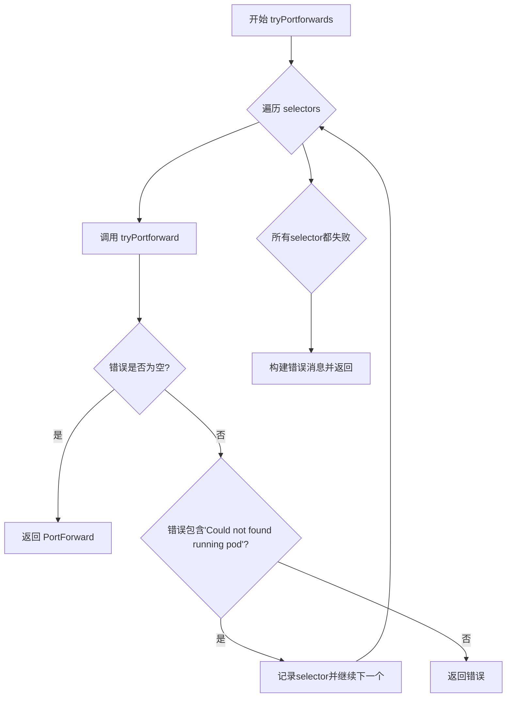
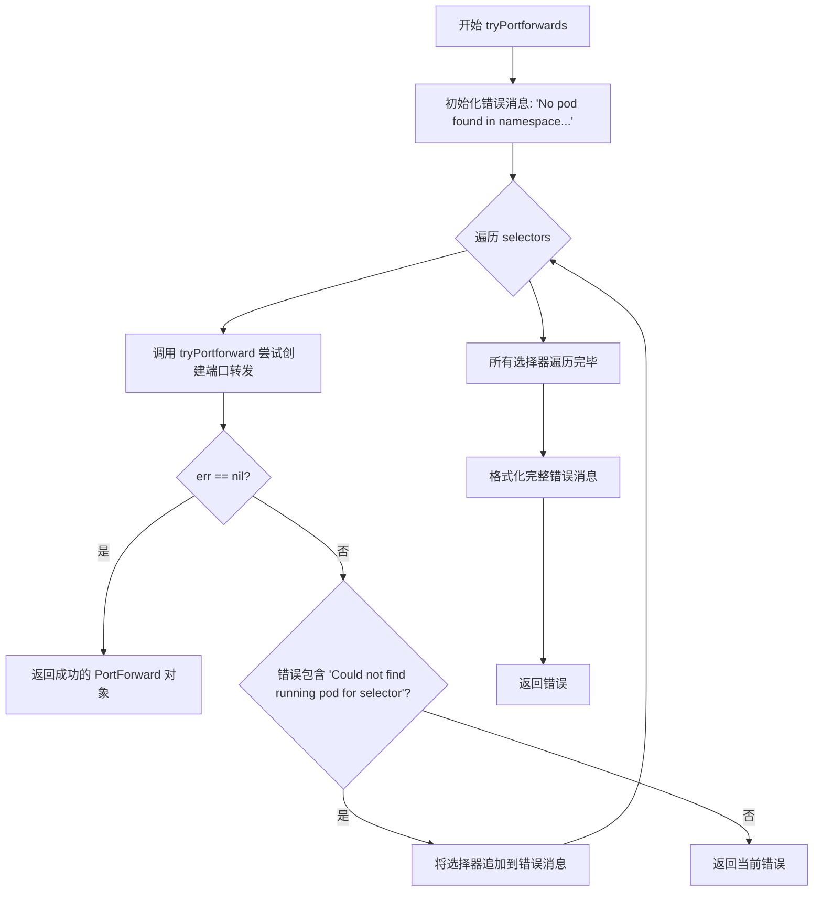
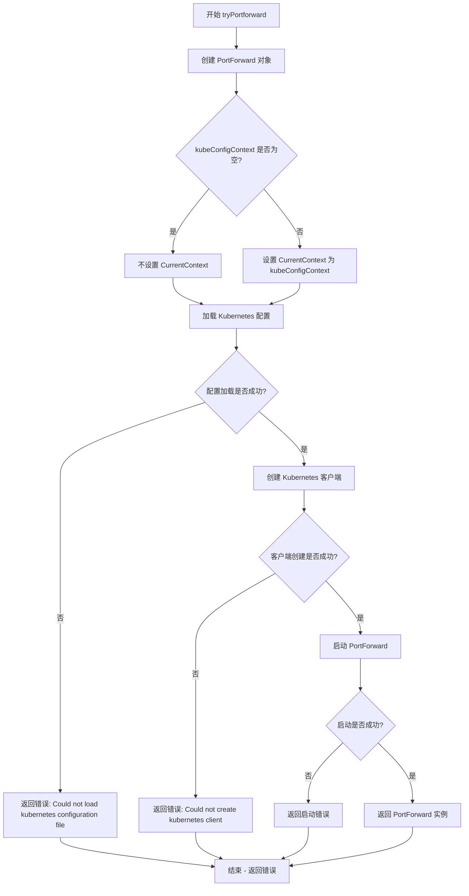
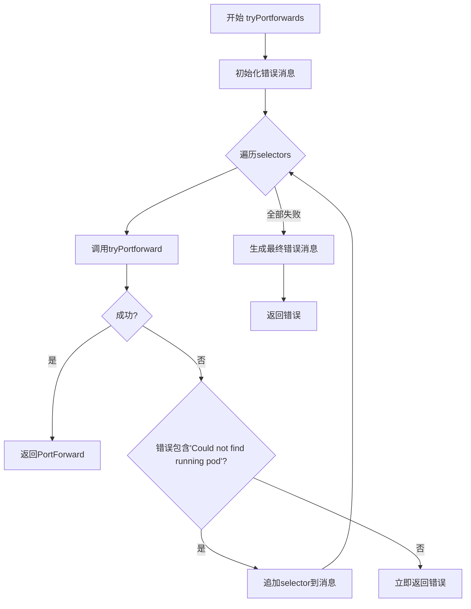
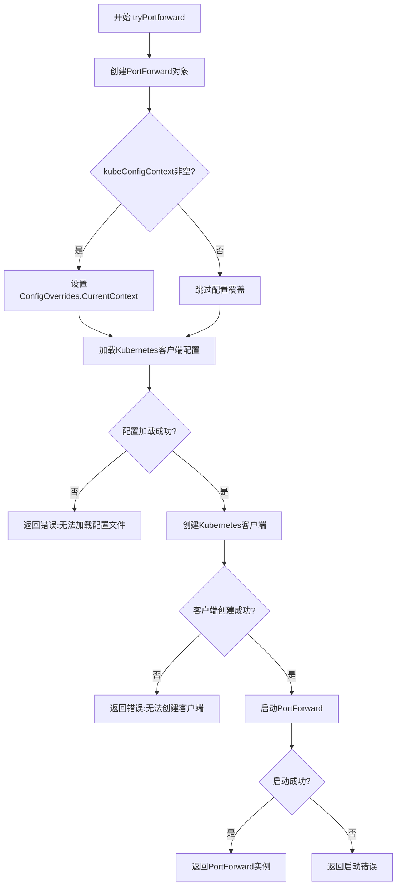

# `flux\cmd\fluxctl\portforward.go` 详细设计文档

该代码实现了一个Kubernetes端口转发工具，用于自动查找并建立与Flux GitOps工具的Pod连接。它通过遍历多个标签选择器来尝试创建到Flux容器的端口转发，支持配置Kubernetes上下文和命名空间，主要用于本地开发时访问Flux API。

## 整体流程



## 类结构

```
无类结构 (过程式编程)
└── 全局函数
    ├── tryPortforwards (主入口函数)
    └── tryPortforward (核心实现函数)
```

## 全局变量及字段


    

## 全局函数及方法


### `tryPortforwards`

该函数尝试使用提供的标签选择器在指定命名空间中创建 PortForward 连接，通过遍历多个选择器直到成功建立连接或遇到不可恢复的错误。如果所有选择器都找不到运行的 Pod，则返回包含所有尝试过的选择器的详细错误消息，帮助用户诊断问题。

参数：

- `kubeConfigContext`：`string`，Kubernetes 配置上下文，用于指定连接到哪个集群
- `ns`：`string`，目标命名空间，用于指定要查找 Pod 的 Kubernetes 命名空间
- `selectors`：`...metav1.LabelSelector`，可变参数标签选择器列表，尝试按顺序匹配每个选择器直到成功

返回值：

- `*portforward.PortForward`，成功创建的端口转发对象
- `error`，如果所有选择器都失败或发生错误，返回包含详细错误信息的错误对象

#### 流程图



#### 带注释源码

```go
// Attempt to create PortForwards to fluxes that match the label selectors until a Flux
// is found or an error is returned.
// 尝试创建 PortForwards 到与标签选择器匹配的 fluxes，直到找到 Flux 或返回错误
func tryPortforwards(kubeConfigContext string, ns string, selectors ...metav1.LabelSelector) (p *portforward.PortForward, err error) {
    // 初始化错误消息的基础部分，包含命名空间信息
    message := fmt.Sprintf("No pod found in namespace %q using the following selectors:", ns)

    // 遍历每个标签选择器，尝试创建端口转发
    for _, selector := range selectors {
        // 调用 tryPortforward 尝试建立端口转发连接
        p, err = tryPortforward(context.TODO(), kubeConfigContext, ns, selector)
        // 如果成功创建，立即返回结果
        if err == nil {
            return
        }

        // 检查错误是否为"未找到运行中的 Pod"
        if !strings.Contains(err.Error(), "Could not find running pod for selector") {
            // 如果是其他类型错误（如配置错误），直接返回
            return
        } else {
            // 如果是找不到 Pod 的错误，将选择器添加到消息中并继续尝试下一个
            message = fmt.Sprintf("%s\n  %s", message, metav1.FormatLabelSelector(&selector))
        }
    }

    // 所有选择器都尝试完毕后，格式化完整的错误消息
    message = fmt.Sprintf("%s\n\nMake sure Flux is running in namespace %q.\n"+
        "If Flux is running in another different namespace, please supply it to --k8s-fwd-ns.", message, ns)
    
    // 将原始错误替换为新的详细错误消息
    if err != nil {
        err = errors.New(message)
    }

    return
}
```


### `tryPortforward`

尝试在指定命名空间中为提供的标签选择器创建端口转发（PortForward）。

参数：

- `ctx`：`context.Context`，用于控制请求的超时和取消
- `kubeConfigContext`：`string`，Kubernetes配置文件上下文，用于指定要使用的kubeconfig上下文
- `ns`：`string`，目标命名空间
- `selector`：`metav1.LabelSelector`，用于选择目标Pod的标签选择器

返回值：`*portforward.PortForward`，成功时返回PortForward实例；`error`，发生错误时返回错误信息

#### 流程图



#### 带注释源码

```go
// Attempt to create a portforward in the namespace for the provided LabelSelector
// 尝试在指定命名空间中为提供的标签选择器创建端口转发
func tryPortforward(ctx context.Context, kubeConfigContext string, ns string, selector metav1.LabelSelector) (*portforward.PortForward, error) {
    // 1. 创建 PortForward 对象，初始化命名空间、标签选择器和目标端口
    portforwarder := &portforward.PortForward{
        Namespace:       ns,                        // 目标命名空间
        Labels:          selector,                  // 用于选择Pod的标签选择器
        DestinationPort: 3030,                      // 目标端口（Flux API 端口）
    }

    // 2. 配置 Kubernetes ConfigOverrides，用于指定特定的 kubeconfig 上下文
    var configOverrides clientcmd.ConfigOverrides
    if kubeConfigContext != "" {
        // 如果指定了上下文，则设置当前上下文
        configOverrides.CurrentContext = kubeConfigContext
    }

    // 3. 加载 Kubernetes 客户端配置
    var err error
    portforwarder.Config, err = clientcmd.NewNonInteractiveDeferredLoadingClientConfig(
        clientcmd.NewDefaultClientConfigLoadingRules(),  // 使用默认的 kubeconfig 加载规则
        &configOverrides,                                // 应用上下文覆盖
    ).ClientConfig()

    // 4. 处理配置加载错误
    if err != nil {
        // 包装错误信息并返回
        return portforwarder, errors.Wrap(err, "Could not load kubernetes configuration file")
    }

    // 5. 使用加载的配置创建 Kubernetes 客户端
    portforwarder.Clientset, err = kubernetes.NewForConfig(portforwarder.Config)
    if err != nil {
        // 客户端创建失败，返回错误
        return portforwarder, errors.Wrap(err, "Could not create kubernetes client")
    }

    // 6. 启动端口转发
    err = portforwarder.Start(ctx)
    if err != nil {
        // 启动失败，返回错误
        return portforwarder, err
    }

    // 7. 成功，返回 PortForward 实例
    return portforwarder, nil
}
```

## 关键组件


### tryPortforwards 函数

主入口函数，尝试使用多个标签选择器依次创建到Flux Pod的端口转发，直到成功找到可用的Flux实例或返回错误。

### tryPortforward 函数

底层实现函数，负责创建单个端口转发连接，包含Kubernetes配置加载、客户端初始化和端口转发启动的完整流程。

### portforwarder 对象

端口转发器配置对象，包含Namespace（命名空间）、Labels（标签选择器）、DestinationPort（目标端口）、Config（Kubernetes配置）和Clientset（Kubernetes客户端）等核心属性。

### Kubernetes 客户端集成

使用client-go库进行Kubernetes API交互，包括从kubeconfig加载配置、创建非交互式客户端Config以及初始化Kubernetes Clientset。

### 错误处理与回退机制

当特定选择器找不到运行中的Pod时，程序会继续尝试下一个选择器，仅在遇到非"未找到Pod"类型的错误时才提前返回，实现了容错和优雅降级。


## 问题及建议


### 已知问题

- **错误处理逻辑缺陷**：`tryPortforwards`函数在循环中如果找到有效的portforward会立即返回，但此时`message`变量仍保留之前的错误累积信息，可能导致错误消息不准确或误导
- **Context使用不当**：`tryPortforwards`函数使用`context.TODO()`而非传入的context，这是Go语言中的反模式，可能导致无法正确取消操作
- **硬编码端口号**：`DestinationPort: 3030`硬编码在代码中，缺乏灵活性和可配置性
- **资源泄漏风险**：在循环中多次调用`tryPortforward`创建PortForward对象，但只返回一个，失败的PortForward对象未被显式清理
- **配置重复加载**：每次循环都重新加载Kubernetes客户端配置，即使kubeConfigContext未变化，造成不必要的性能开销
- **参数校验缺失**：`kubeConfigContext`、`ns`等关键参数缺乏空值或有效性校验
- **字符串拼接效率低**：使用多次`fmt.Sprintf`拼接错误消息，效率较低

### 优化建议

- 使用`strings.Builder`替代多次`fmt.Sprintf`拼接错误消息
- 将硬编码的端口号提取为函数参数或配置项
- 在`tryPortforwards`函数签名中添加`context`参数并传递使用
- 使用`defer`确保PortForward资源在函数退出时被正确清理
- 提取配置加载逻辑到循环外部，避免重复加载
- 添加参数校验逻辑，对空字符串或非法namespace进行处理
- 添加适当的日志记录以便调试和问题追踪

## 其它


### 一段话描述

该代码是一个Kubernetes Port Forward工具，用于在Kubernetes集群中自动发现并建立到Flux组件的端口转发连接。它通过遍历多个标签选择器来查找运行中的Flux Pod，并在成功建立连接后返回PortForward实例。

### 文件的整体运行流程

1. 入口函数`tryPortforwards`接收kubeConfigContext、namespace和多个LabelSelector参数
2. 遍历所有提供的selectors，对每个selector调用`tryPortforward`
3. 如果成功建立portforward则立即返回
4. 如果失败且错误信息包含"Could not find running pod for selector"，则继续尝试下一个selector
5. 如果所有selector都失败，则生成包含所有失败selector的错误信息并返回

### 全局变量和全局函数详细信息

#### tryPortforwards 函数

- **名称**: tryPortforwards
- **参数**:
  - kubeConfigContext (string): Kubernetes配置文件上下文名称
  - ns (string): Kubernetes命名空间
  - selectors (...[ ]metav1.LabelSelector): 可变的标签选择器数组
- **参数描述**: 接收一个或多个标签选择器，尝试为每个选择器建立PortForward连接
- **返回值类型**: (*portforward.PortForward, error)
- **返回值描述**: 成功时返回PortForward实例，失败时返回错误信息
- **mermaid流程图**:



- **带注释源码**:

```go
// Attempt to create PortForwards to fluxes that match the label selectors until a Flux
// is found or an error is returned.
func tryPortforwards(kubeConfigContext string, ns string, selectors ...metav1.LabelSelector) (p *portforward.PortForward, err error) {
    // 初始化错误消息，记录命名空间和选择器
	message := fmt.Sprintf("No pod found in namespace %q using the following selectors:", ns)

    // 遍历所有提供的标签选择器
	for _, selector := range selectors {
        // 尝试为当前选择器创建portforward
		p, err = tryPortforward(context.TODO(), kubeConfigContext, ns, selector)
		if err == nil {
            // 成功建立连接，直接返回
			return
		}

        // 检查错误是否是"未找到运行中的Pod"
		if !strings.Contains(err.Error(), "Could not find running pod for selector") {
            // 其他错误，立即返回
			return
		} else {
            // 将失败的选择器追加到消息中
			message = fmt.Sprintf("%s\n  %s", message, metav1.FormatLabelSelector(&selector))
		}
	}
    // 生成最终错误消息，包含命名空间提示
	message = fmt.Sprintf("%s\n\nMake sure Flux is running in namespace %q.\n"+
		"If Flux is running in another different namespace, please supply it to --k8s-fwd-ns.", message, ns)
	if err != nil {
        // 创建包含完整信息的错误
		err = errors.New(message)
	}

	return
}
```

#### tryPortforward 函数

- **名称**: tryPortforward
- **参数**:
  - ctx (context.Context): Go上下文对象
  - kubeConfigContext (string): Kubernetes配置文件上下文名称
  - ns (string): Kubernetes命名空间
  - selector (metav1.LabelSelector): 标签选择器
- **参数描述**: 尝试为单个标签选择器建立PortForward连接
- **返回值类型**: (*portforward.PortForward, error)
- **返回值描述**: 成功时返回配置好的PortForward实例，失败时返回错误信息
- **mermaid流程图**:



- **带注释源码**:

```go
// Attempt to create a portforward in the namespace for the provided LabelSelector
func tryPortforward(ctx context.Context, kubeConfigContext string, ns string, selector metav1.LabelSelector) (*portforward.PortForward, error) {
    // 初始化PortForward对象，设置命名空间、标签选择器和目标端口3030
	portforwarder := &portforward.PortForward{
		Namespace:       ns,
		Labels:          selector,
		DestinationPort: 3030,
	}

    // 配置覆盖对象，用于指定特定的kubeconfig上下文
	var configOverrides clientcmd.ConfigOverrides
	if kubeConfigContext != "" {
        // 如果指定了上下文，则设置当前上下文
		configOverrides.CurrentContext = kubeConfigContext
	}

    // 创建客户端配置加载器
	var err error
	portforwarder.Config, err = clientcmd.NewNonInteractiveDeferredLoadingClientConfig(
		clientcmd.NewDefaultClientConfigLoadingRules(),
		&configOverrides,
	).ClientConfig()

    // 检查配置加载是否失败
	if err != nil {
        // 包装错误信息并返回
		return portforwarder, errors.Wrap(err, "Could not load kubernetes configuration file")
	}

    // 使用配置创建Kubernetes客户端
	portforwarder.Clientset, err = kubernetes.NewForConfig(portforwarder.Config)
	if err != nil {
        // 包装错误信息并返回
		return portforwarder, errors.Wrap(err, "Could not create kubernetes client")
	}

    // 启动PortForward连接
	err = portforwarder.Start(ctx)
	if err != nil {
		return portforwarder, err
	}

	return portforwarder, nil
}
```

### 关键组件信息

#### portforward.PortForward

- **名称**: PortForward
- **一句话描述**: Kubernetes端口转发器，用于建立本地端口到Kubernetes Pod的转发连接

#### clientcmd.ConfigOverrides

- **名称**: ConfigOverrides
- **一句话描述**: Kubernetes配置覆盖对象，用于修改默认客户端配置

#### kubernetes.Clientset

- **名称**: Clientset
- **一句话描述**: Kubernetes客户端集，用于与Kubernetes API服务器交互

### 潜在的技术债务或优化空间

1. **硬编码端口**: DestinationPort硬编码为3030，应该作为参数或配置项
2. **缺乏重试机制**: 应该在连接失败时实现指数退避重试，而不是直接失败
3. **上下文泄露**: 使用context.TODO()而非真正的上下文，应该从调用者传递
4. **错误处理不够具体**: 错误信息较为通用，难以定位具体问题
5. **缺少日志记录**: 没有适当的日志记录，难以调试生产环境问题
6. **单例客户端**: 没有连接池或客户端复用机制，每次调用都创建新客户端

### 设计目标与约束

- **设计目标**: 自动发现并连接到Kubernetes集群中运行的Flux组件，无需手动指定Pod名称
- **约束**: 
  - 依赖于Flux Pod使用标准标签选择器
  - 需要有效的Kubernetes配置（kubeconfig）
  - 目标Pod必须处于运行状态

### 错误处理与异常设计

- **错误传播**: 错误通过errors.Wrap包装，保留原始错误信息
- **错误分类**: 
  - 配置加载错误
  - Kubernetes客户端创建错误
  - Pod未找到错误
  - PortForward启动错误
- **异常处理策略**: 
  - 特定错误（Pod未找到）允许继续尝试其他选择器
  - 其他错误立即返回，不继续尝试

### 数据流与状态机

- **数据流**: 
  - 输入: kubeConfigContext → namespace → selectors
  - 处理: 遍历selectors → 创建PortForward配置 → 启动连接
  - 输出: PortForward实例或错误
- **状态机**: 
  - Idle → LoadingConfig → CreatingClient → Starting → Connected
  - 任何失败状态 → Error

### 外部依赖与接口契约

- **fluxcd/flux/pkg/portforward**: 提供PortForward类型和Start方法
- **k8s.io/client-go/kubernetes**: 提供Kubernetes客户端集
- **k8s.io/client-go/tools/clientcmd**: 提供Kubernetes配置加载功能
- **k8s.io/apimachinery/pkg/apis/meta/v1**: 提供LabelSelector类型和格式化方法
- **github.com/pkg/errors**: 提供错误包装功能
- **context**: 提供上下文管理
- **fmt/strings**: 提供字符串格式化和处理

### 接口契约

- **tryPortforwards**: 
  - 输入: context字符串、namespace字符串、可变数量LabelSelector
  - 输出: PortForward指针或错误
  - 失败条件: 所有selector都找不到Pod或配置错误

- **tryPortforward**:
  - 输入: Context、context字符串、namespace字符串、LabelSelector
  - 输出: PortForward指针或错误
  - 失败条件: 配置加载失败、客户端创建失败、Pod未找到、连接失败

    