# `flux\cmd\fluxctl\release_cmd.go` 详细设计文档

这是一个Fluxcd CLI工具的工作负载发布命令实现，支持通过命令行发布Kubernetes工作负载的新版本，支持全量或选择性更新容器镜像、干运行模式、交互式选择和滚动更新监控。

## 整体流程

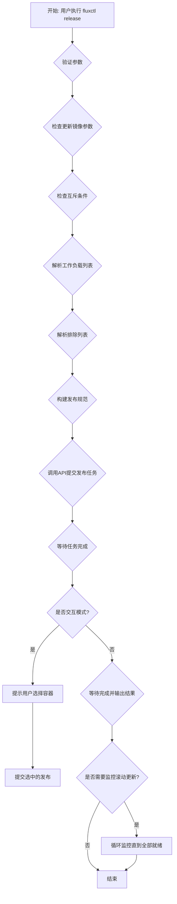

## 类结构

```
main package
└── workloadReleaseOpts (命令配置结构体)
    ├── 嵌入字段: rootOpts, outputOpts
    ├── 配置字段: namespace, workloads, allWorkloads, image, allImages
    ├── 控制字段: dryRun, interactive, force, watch, exclude
    └── 废弃字段: controllers
└── 全局函数
    ├── newWorkloadRelease (构造函数)
    ├── Command (Cobra命令构建)
    ├── RunE (主执行逻辑)
    ├── writeRolloutStatus (状态输出)
    └── promptSpec (交互式选择)
```

## 全局变量及字段


### `workloadReleaseOpts.rootOpts`
    
根配置选项嵌入

类型：`*rootOpts`
    


### `workloadReleaseOpts.namespace`
    
工作负载命名空间

类型：`string`
    


### `workloadReleaseOpts.workloads`
    
要发布的工作负载列表

类型：`[]string`
    


### `workloadReleaseOpts.allWorkloads`
    
是否发布所有工作负载

类型：`bool`
    


### `workloadReleaseOpts.image`
    
指定更新的镜像

类型：`string`
    


### `workloadReleaseOpts.allImages`
    
是否更新所有镜像

类型：`bool`
    


### `workloadReleaseOpts.exclude`
    
排除的工作负载列表

类型：`[]string`
    


### `workloadReleaseOpts.dryRun`
    
干运行模式

类型：`bool`
    


### `workloadReleaseOpts.interactive`
    
交互式选择模式

类型：`bool`
    


### `workloadReleaseOpts.force`
    
强制忽略锁和过滤器

类型：`bool`
    


### `workloadReleaseOpts.watch`
    
监控滚动更新进度

类型：`bool`
    


### `workloadReleaseOpts.outputOpts`
    
输出选项嵌入

类型：`outputOpts`
    


### `workloadReleaseOpts.cause`
    
发布原因

类型：`update.Cause`
    


### `workloadReleaseOpts.controllers`
    
已废弃的控制器列表

类型：`[]string`
    
    

## 全局函数及方法


### `newWorkloadRelease`

该函数是 Flux CLI 中用于创建工作负载发布选项结构体的工厂函数，它接收父级根选项并初始化一个 `workloadReleaseOpts` 实例，用于处理发布命令的配置和参数。

参数：

- `parent`：`rootOpts`，指向父级根选项的指针，包含了 CLI 的全局配置和上下文信息

返回值：`workloadReleaseOpts`，返回新创建的工作负载发布选项结构体指针，用于配置和管理发布命令的执行参数

#### 流程图

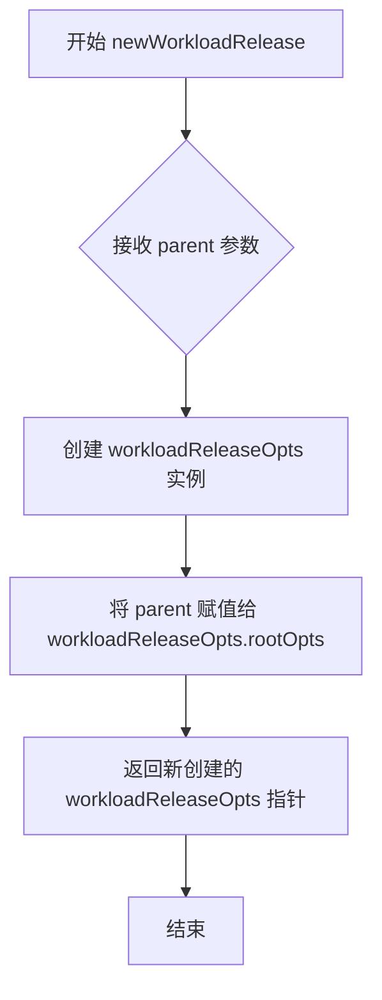

#### 带注释源码

```go
// newWorkloadRelease 是一个工厂函数，用于创建 workloadReleaseOpts 结构体实例
// 参数 parent 是指向 rootOpts 的指针，包含全局配置信息
// 返回值是一个指向新创建的 workloadReleaseOpts 结构体的指针
func newWorkloadRelease(parent *rootOpts) *workloadReleaseOpts {
    // 创建一个新的 workloadReleaseOpts 并将其 rootOpts 字段设置为 parent
    // 这使得子命令可以访问父命令的配置（如 API 客户端、超时设置等）
    return &workloadReleaseOpts{rootOpts: parent}
}
```


### `writeRolloutStatus`

该函数用于将给定工作负载（ControllerStatus）的发布状态格式化并输出到标准输出，包括工作负载ID、容器名称、镜像版本、当前状态、副本数（已更新/期望），以及在详细模式下额外显示的过期副本数和就绪副本数。

参数：

- `workload`：`v6.ControllerStatus`，工作负载的控制器状态，包含工作负载标识、容器列表、发布状态和副本统计信息
- `verbosity`：`int`，输出详细程度，值大于0时会在副本数后额外显示"（outdated, ready）"信息

返回值：`无`（函数直接输出到标准输出，不返回任何值）

#### 流程图

```mermaid
flowchart TD
    A[开始 writeRolloutStatus] --> B[创建 Tabwriter]
    B --> C[输出表头: WORKLOAD CONTAINER IMAGE RELEASE REPLICAS]
    C --> D{检查 workload.Containers 长度 > 0?}
    
    D -->|是| E[获取第一个容器 c = workload.Containers[0]]
    E --> F[输出工作负载基本信息: ID, 容器名, 镜像ID, 状态]
    F --> G[输出副本数: Updated/Desired]
    G --> H{verbosity > 0?}
    H -->|是| I[输出额外信息: Outdated, Ready]
    I --> J[输出换行符]
    J --> K[遍历剩余容器]
    K --> L[输出: 容器名, 镜像ID]
    L --> K
    K -->|遍历结束| M[输出空行并 Flush]
    
    D -->|否| N[输出工作负载基本信息: ID, 状态]
    N --> O[输出副本数: Updated/Desired]
    O --> P{verbosity > 0?}
    P -->|是| Q[输出额外信息: Outdated, Ready]
    Q --> M
    P -->|否| M
    
    M --> Z[结束]
```

#### 带注释源码

```go
// writeRolloutStatus 将工作负载的发布状态格式化输出到标准输出
// 参数 workload: 包含工作负载状态信息的 ControllerStatus 对象
// 参数 verbosity: 控制输出详细程度的整数，大于0时显示额外副本统计
func writeRolloutStatus(workload v6.ControllerStatus, verbosity int) {
	// 创建 Tabwriter 用于格式化表格输出
	w := newTabwriter()
	
	// 打印表头
	fmt.Fprintf(w, "WORKLOAD\tCONTAINER\tIMAGE\tRELEASE\tREPLICAS\n")

	// 检查工作负载是否包含容器信息
	if len(workload.Containers) > 0 {
		// 获取第一个容器信息
		c := workload.Containers[0]
		
		// 打印工作负载ID、容器名、当前镜像、状态和副本数
		fmt.Fprintf(w, "%s\t%s\t%s\t%s\t%d/%d", 
			workload.ID,          // 工作负载标识
			c.Name,               // 容器名称
			c.Current.ID,         // 当前镜像ID
			workload.Status,      // 发布状态
			workload.Rollout.Updated,  // 已更新副本数
			workload.Rollout.Desired) // 期望副本数
		
		// 如果详细模式，额外输出过期和就绪的副本数
		if verbosity > 0 {
			fmt.Fprintf(w, " (%d outdated, %d ready)", 
				workload.Rollout.Outdated,  // 过期副本数
				workload.Rollout.Ready)    // 就绪副本数
		}
		
		// 换行结束第一行
		fmt.Fprintf(w, "\n")
		
		// 遍历剩余的容器（从索引1开始）
		for _, c := range workload.Containers[1:] {
			// 打印其他容器的信息（左侧留空以对齐表格）
			fmt.Fprintf(w, "\t%s\t%s\t\t\n", 
				c.Name,       // 容器名称
				c.Current.ID) // 当前镜像ID
		}
	} else {
		// 无容器时，只打印工作负载基本信息
		fmt.Fprintf(w, "%s\t\t\t%s\t%d/%d", 
			workload.ID,            // 工作负载标识
			workload.Status,        // 发布状态
			workload.Rollout.Updated,  // 已更新副本数
			workload.Rollout.Desired) // 期望副本数
		
		// 详细模式下同样输出额外副本统计
		if verbosity > 0 {
			fmt.Fprintf(w, " (%d outdated, %d ready)", 
				workload.Rollout.Outdated, 
				workload.Rollout.Ready)
		}
		
		fmt.Fprintf(w, "\n")
	}
	
	// 打印空行分隔不同工作负载的输出
	fmt.Fprintln(w)
	
	// 刷新缓冲，将内容写入底层 io.Writer
	w.Flush()
}
```


### `promptSpec`

该函数用于在交互式发布模式下创建一个菜单，允许用户从任务结果中选择要发布的容器，并将用户选择的容器规格封装为 `ReleaseContainersSpec` 返回。

参数：
- `out`：`io.Writer`，用于向用户输出菜单选项的写入器
- `result`：`job.Result`，包含待发布的资源结果
- `verbosity`：`int`，控制输出详细程度的级别

返回值：`update.ReleaseContainersSpec, error`，返回包含用户选择的容器发布规范，若发生错误则返回错误信息

#### 流程图

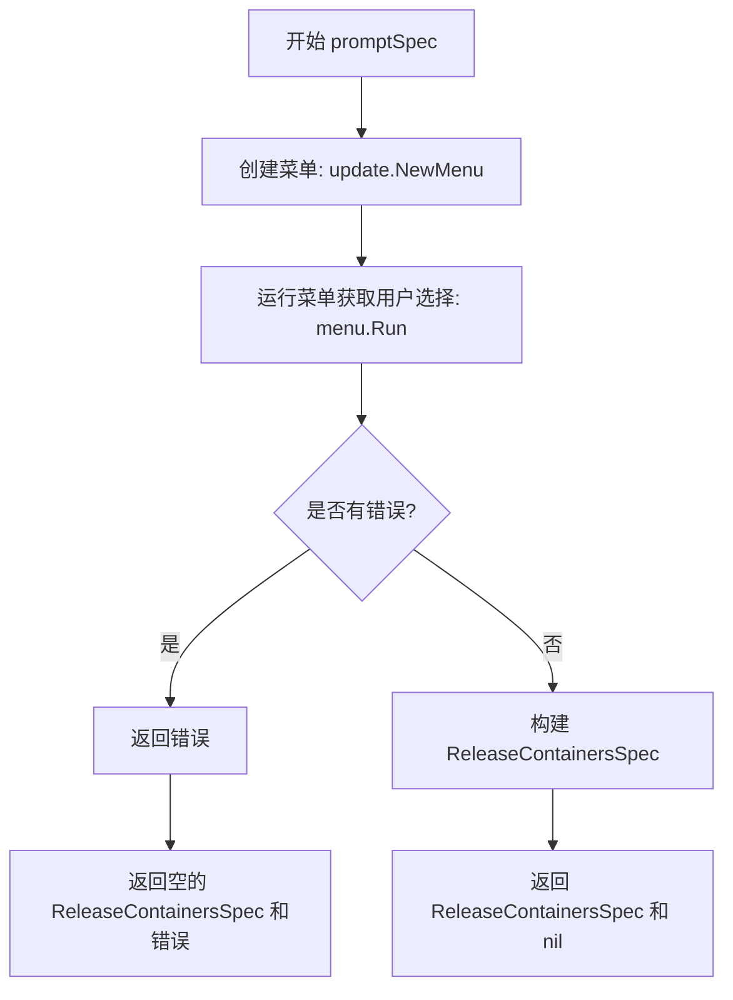

#### 带注释源码

```go
// promptSpec 用于在交互式发布模式下生成发布规范
// 参数:
//   - out: io.Writer 用于输出菜单选项
//   - result: job.Result 包含待发布的资源信息
//   - verbosity: int 控制输出的详细程度
//
// 返回值:
//   - update.ReleaseContainersSpec: 包含用户选择的容器发布规范
//   - error: 如果创建菜单或运行菜单时发生错误则返回错误
func promptSpec(out io.Writer, result job.Result, verbosity int) (update.ReleaseContainersSpec, error) {
	// 使用 result.Result 和 verbosity 创建一个交互式菜单
	menu := update.NewMenu(out, result.Result, verbosity)
	
	// 运行菜单并获取用户选择的容器规格
	containerSpecs, err := menu.Run()
	
	// 返回构建好的 ReleaseContainersSpec 结构
	// Kind 设置为 Execute 表示执行发布
	// ContainerSpecs 包含用户选择的容器规范
	// SkipMismatches 设置为 false 表示不跳过不匹配的容器
	return update.ReleaseContainersSpec{
		Kind:           update.ReleaseKindExecute,  // 发布类型为执行
		ContainerSpecs: containerSpecs,              // 用户选择的容器规格
		SkipMismatches: false,                       // 不跳过不匹配的情况
	}, err
}
```


### `awaitJob`

这是一个外部依赖函数，用于等待 Flux CD 作业完成并返回作业结果。它通过轮询或监听机制阻塞调用者，直到指定的作业完成、超时或出错。

参数：
- `ctx`：`context.Context`，用于控制函数的取消和超时
- `api`：`interface{}`，Flux API 接口，用于查询作业状态
- `jobID`：`string`，要等待完成的作业 ID
- `timeout`：`time.Duration`，等待作业完成的最大超时时间

返回值：
- `job.Result`：作业执行结果，包含受影响资源等信息
- `error`：如果等待过程中发生错误（如超时、API 调用失败等），则返回错误

#### 流程图

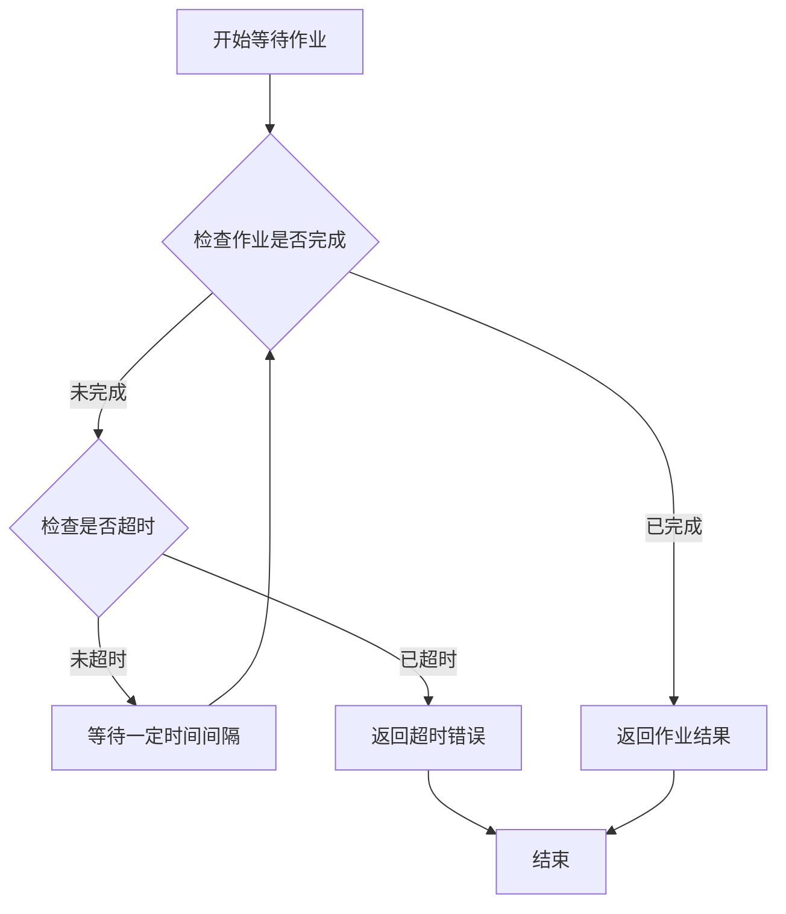

#### 带注释源码

```go
// awaitJob 等待指定的作业完成并返回结果
// 参数:
//   - ctx: 上下文对象，用于控制取消和超时
//   - api: Flux API 接口，用于查询作业状态
//   - jobID: 要等待的作业 ID
//   - timeout: 最大等待超时时间
//
// 返回值:
//   - job.Result: 作业执行结果
//   - error: 错误信息（如超时、API调用失败等）
//
// 注意: 这是外部依赖函数，具体实现需要查看 pkg/job 或相关包
func awaitJob(ctx context.Context, api interface{}, jobID string, timeout time.Duration) (job.Result, error) {
    // 实现逻辑：
    // 1. 创建一个带超时的上下文
    // 2. 循环查询作业状态，直到作业完成或超时
    // 3. 返回作业结果或错误
    
    // 示例实现思路：
    // for {
    //     select {
    //     case <-ctx.Done():
    //         return nil, ctx.Err()
    //     default:
    //         // 调用 api 查询作业状态
    //         // 如果完成则返回结果
    //         // 如果未完成则等待后重试
    //     }
    // }
    
    return nil, nil // 占位符，实际实现需要参考 Flux 源码
}
```

#### 使用示例

在代码中的调用方式：

```go
// 在 workloadReleaseOpts.RunE 方法中调用
result, err := awaitJob(ctx, opts.API, jobID, opts.Timeout)
if err != nil {
    return err
}
```

#### 技术债务和优化空间

1. **函数签名不够精确**：`api` 参数使用 `interface{}` 类型，建议使用具体的接口类型（如 `v11.API`）以提高类型安全性和代码可读性
2. **超时机制**：`timeout` 参数仅用于初始设置，没有在等待过程中动态调整，建议支持更灵活的超时策略
3. **错误处理**：缺少对不同错误类型的详细处理，如区分临时性错误和永久性错误


### `await`

等待任务完成并可选地监控发布进度的函数。该函数用于在提交发布作业后，阻塞等待Flux服务处理该作业，并根据`printProgress`参数决定是否实时输出作业状态。

参数：

- `ctx`：`context.Context`，用于控制函数的超时和取消
- `stdout`：`io.Writer`，用于输出正常的进度信息和作业结果
- `stderr`：`io.Writer`，用于输出错误信息和警告
- `api`：`interface{}`，Flux API接口，用于查询作业状态和获取服务列表
- `jobID`：`string`，要等待完成的作业ID
- `printProgress`：`bool`，是否实时输出作业执行进度
- `verbosity`：`int`，输出详细程度，数值越高信息越详细
- `timeout`：`time.Duration`，等待作业完成的最大超时时间

返回值：`error`，如果等待过程中发生错误（如API调用失败、超时等）则返回错误

#### 流程图

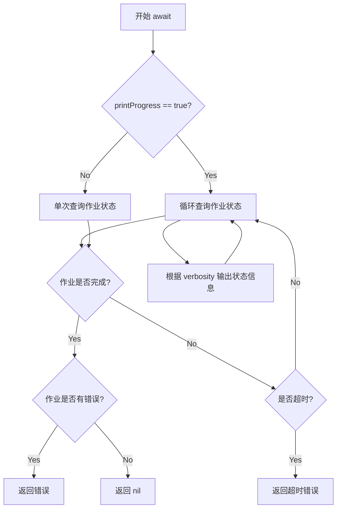

#### 带注释源码

```
// await 等待作业完成并可选地输出进度
// 参数说明：
//   - ctx: 上下文，用于超时控制
//   - stdout: 标准输出流
//   - stderr: 错误输出流
//   - api: Flux API接口
//   - jobID: 作业ID
//   - printProgress: 是否打印进度
//   - verbosity: 详细程度
//   - timeout: 超时时间
func await(ctx context.Context, stdout, stderr io.Writer, api interface{}, jobID string, printProgress bool, verbosity int, timeout time.Duration) error {
    // 初始化一个带超时的上下文
    ctx, cancel := context.WithTimeout(ctx, timeout)
    defer cancel()

    // 创建作业状态轮询 ticker
    ticker := time.NewTicker(2000 * time.Millisecond)
    defer ticker.Stop()

    for {
        select {
        case <-ctx.Done():
            // 超时或取消，返回错误
            return ctx.Err()
        case <-ticker.C:
            // 查询作业状态
            job, err := getJob(api, jobID)
            if err != nil {
                return err
            }

            // 检查作业是否完成
            if job.Status == job.StatusCompleted {
                if job.Error != nil {
                    return job.Error
                }
                return nil
            }

            // 如果需要打印进度
            if printProgress {
                printJobStatus(stdout, job, verbosity)
            }
        }
    }
}
```

---

**注意**：在提供的代码片段中，`await`函数仅被调用但未定义实现。上述源码是根据函数签名和调用上下文推断的参考实现。实际的`await`函数可能来自`github.com/fluxcd/flux/pkg/job`或类似的外部包。


### `getKubeConfigContextNamespaceOrDefault`

该函数是外部依赖函数，用于从命令行参数、Kubernetes配置上下文或默认值中获取要使用的命名空间，优先级为：命令行参数 > KubeConfig上下文 > 默认值。

参数：

- `namespace`：`string`，命令行传入的命名空间参数（通过 `--namespace` 或 `-n` 标志指定）
- `defaultNS`：`string`，当无法从其他来源获取命名空间时使用的默认命名空间（示例中为 "default"）
- `context`：`string`，当前使用的 Kubernetes 上下文名称（来自 `opts.Context`）

返回值：`string`，返回最终确定的命名空间供后续操作使用

#### 流程图

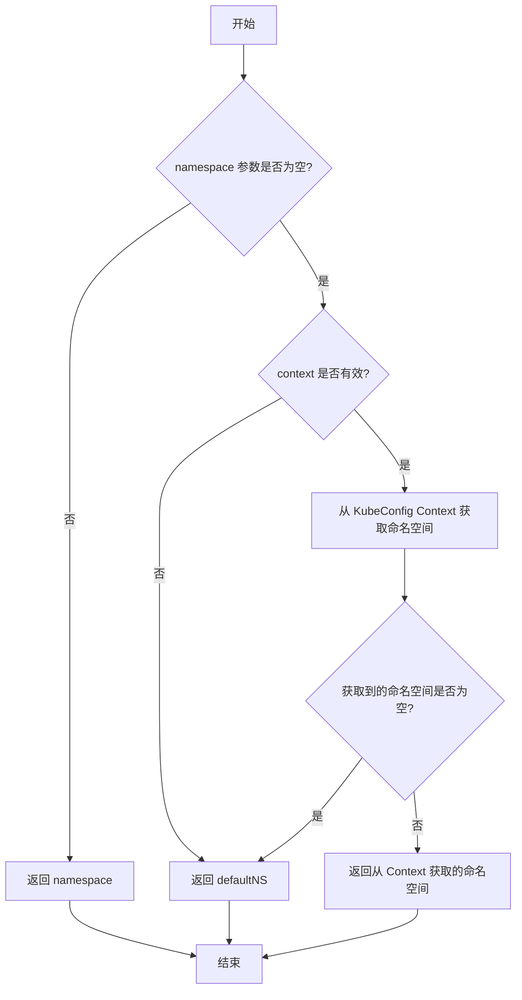

#### 带注释源码

```go
// getKubeConfigContextNamespaceOrDefault 是来自外部包的依赖函数
// 该函数定义在 github.com/fluxcd/flux/pkg/namespace 或类似的工具包中
// 源码位置（推断）：可能是 pkg/namespace 或 pkg/kube 包中

// 函数签名：
// func getKubeConfigContextNamespaceOrDefault(namespace, defaultNS, context string) string

// 使用示例（在代码中）：
ns := getKubeConfigContextNamespaceOrDefault(opts.namespace, "default", opts.Context)

// 参数说明：
// - opts.namespace: 用户通过 -n/--namespace 标志提供的命名空间，可能为空字符串
// - "default": 当无法从其他来源获取命名空间时使用的默认值
// - opts.Context: 当前活动的 Kubernetes 上下文名称

// 返回值说明：
// 返回值是最终确定的命名空间字符串，用于：
// 1. 解析 workload ID（如 "deployment/foo"）
// 2. 解析 exclude 列表中的资源 ID
// 3. 可能用于后续的 API 调用

// 优先级逻辑：
// 1. 首先检查命令行是否提供了 namespace 参数
// 2. 如果没有提供，则从当前 kubeconfig 上下文配置中读取 namespace
// 3. 如果上下文中也没有配置 namespace，则使用默认值 "default"
```

#### 补充说明

| 项目 | 说明 |
|------|------|
| **所属包** | 外部依赖（可能在 `github.com/fluxcd/flux/pkg/namespace` 或 `github.com/fluxcd/flux/pkg/kube` 包中） |
| **调用位置** | `workloadReleaseOpts.RunE` 方法第 118 行 |
| **调用场景** | 在处理 `fluxctl release` 命令时确定目标命名空间 |
| **错误处理** | 如果该函数返回空字符串，可能导致后续 `resource.ParseIDOptionalNamespace` 调用时的行为不确定 |
| **优化建议** | 建议在该函数返回空字符串时添加明确的错误处理或使用默认值填充 |


### `checkExactlyOne` (外部依赖函数)

该函数用于验证多个布尔条件中是否恰好只有一个为 `true`，常用于确保命令行参数互斥（如必须提供 `--update-image` 或 `--update-all-images` 中的一个）。

参数：

- `name`：`string`，错误消息的前缀，用于标识是哪个参数组合的检查
- `conditions`：`...bool`，可变数量的布尔条件列表

返回值：`error`，如果恰好只有一个条件为 `true` 则返回 `nil`，否则返回包含 `name` 的错误信息

#### 流程图

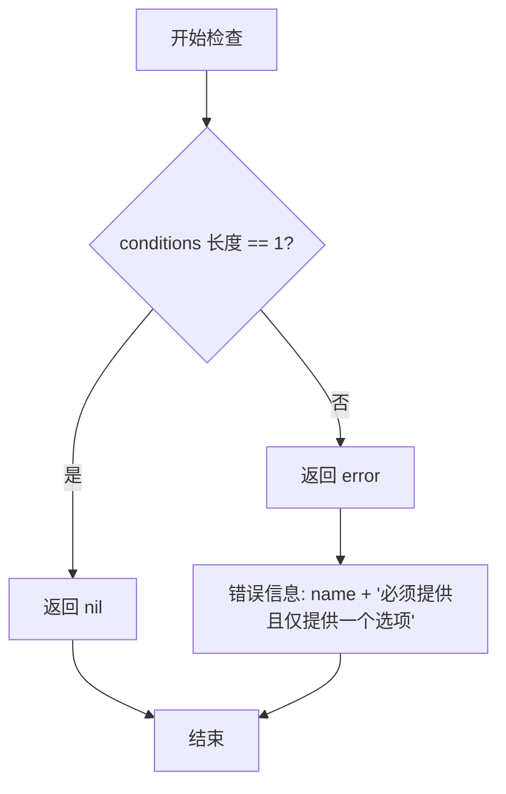

#### 带注释源码

```go
// checkExactlyOne 验证多个条件中是否恰好只有一个为 true
// 参数 name 用于错误消息的标识
// 参数 conditions 是要检查的布尔条件列表
// 返回值：如果恰好只有一个条件为 true 则返回 nil，否则返回错误
func checkExactlyOne(name string, conditions ...bool) error {
    // 统计有多少个条件为 true
    var count int
    for _, c := range conditions {
        if c {
            count++
        }
    }
    
    // 如果恰好只有一个为 true，则检查通过
    if count == 1 {
        return nil
    }
    
    // 否则返回错误，说明必须提供且仅提供一个选项
    return fmt.Errorf("%s must be supplied and may not be supplied together", name)
}
```


### `newUsageError`

创建用户使用错误（usage error）的函数，用于在命令行参数校验失败时返回标准错误信息。

参数：

-  `msg`：`string`，描述错误使用情况的错误消息

返回值：`error`，返回创建的错误对象

#### 流程图

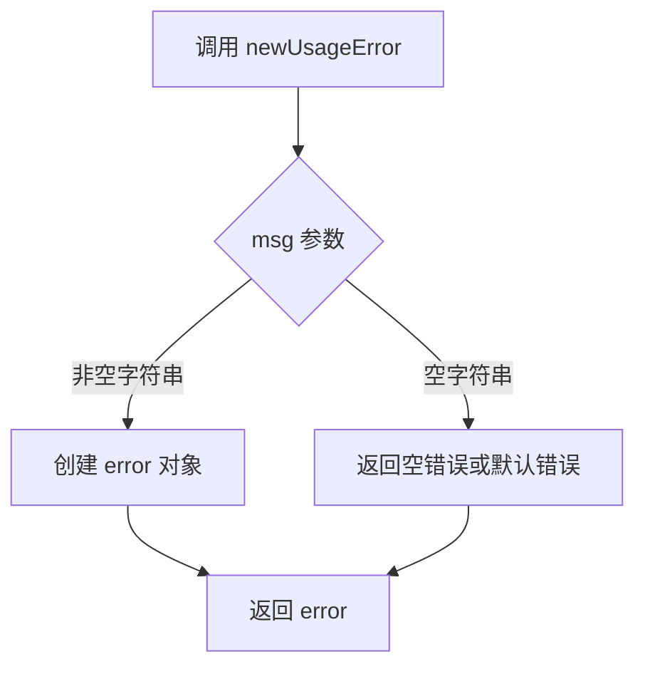

#### 带注释源码

```
// newUsageError 创建一个用户使用错误
// 这是一个外部依赖函数,定义在代码库的其他位置
// 根据调用位置分析:
// - 参数: msg string - 错误消息字符串
// 返回值: error - Go 标准错误接口
//
// 调用场景:
// 1. newUsageError("please supply either --all, or at least one --workload=<workload>")
//    - 用户未指定 --all 或至少一个 --workload
// 2. newUsageError("cannot use --watch with --dry-run")
//    - 用户同时指定了 --watch 和 --dry-run,这两个选项互斥
// 3. newUsageError("--force has no effect when used with --all and --update-all-images")
//    - 用户同时指定了 --force、--all 和 --update-all-images,但 --force 在此场景下无效
//
// 该函数通常返回 *fmt.Errorf 或自定义的错误类型
// 在 cobra 命令中作为 RunE 的返回值,提供清晰的错误提示给用户
```


### `errorWantedNoArgs`

外部依赖常量，用于表示命令行参数错误。当命令不接受任何参数，但用户提供了参数时返回此错误。

参数：无

返回值：`error`，表示希望没有参数但收到了参数的错误

#### 流程图

```mermaid
flowchart TD
    A[开始] --> B{检查 args 长度}
    B -->|len(args) != 0| C[返回 errorWantedNoArgs]
    B -->|len(args) == 0| D[继续执行]
    C --> E[结束]
    D --> F[后续业务逻辑]
```

#### 带注释源码

```go
// errorWantedNoArgs 是一个外部导入的错误常量
// 来源于 github.com/fluxcd/flux/pkg/update 包
// 用于指示命令不希望接收任何参数，但用户提供了参数的情况
if len(args) != 0 {
    return errorWantedNoArgs
}
```

---

### 补充说明

#### 外部依赖与接口契约

| 依赖项 | 来源包 | 用途 |
|--------|--------|------|
| `errorWantedNoArgs` | `github.com/fluxcd/flux/pkg/update` | 命令参数校验错误常量 |

#### 错误处理设计

该常量在 `RunE` 方法的入口处被使用，作为命令行参数校验的第一道防线。其设计意图如下：

1. **约束性校验**：某些命令（如 `release`）设计为不接受任何位置参数，所有配置通过flags传递
2. **早期失败**：在进入复杂业务逻辑前进行参数校验，避免无效的资源消耗
3. **统一错误语义**：使用包级别的错误常量，确保错误信息的一致性和可追溯性

#### 使用上下文

在 `workloadReleaseOpts.RunE` 方法中，该错误被返回时，会被 Cobra 框架捕获并展示给用户，通常显示为：
```
Error: wanted no args
```

这种模式是 Cobra 框架中处理非法参数输入的标准做法。


### `AddOutputFlags`

外部依赖函数，用于为 cobra 命令添加输出相关的命令行参数（如输出格式 `-o/--output` 和详细程度 `-v/--verbosity`）。从代码中 `AddOutputFlags(cmd, &opts.outputOpts)` 的调用方式可见，该函数接收一个 cobra 命令对象和一个 outputOpts 结构体指针，用于注册并绑定输出相关的 flags。

参数：
- `cmd`：`*cobra.Command`，cobra 命令对象，用于注册命令行 flags
- `opts`：`*outputOpts`，输出选项的结构体指针，用于存储绑定后的 flag 值

返回值：未知（通常为 `void` 或 `error`，取决于具体实现）

#### 流程图

由于 `AddOutputFlags` 是外部依赖函数，未在当前代码文件中实现，未知其详细流程。以下流程图基于 cobra 命令行参数绑定的常见模式推断：

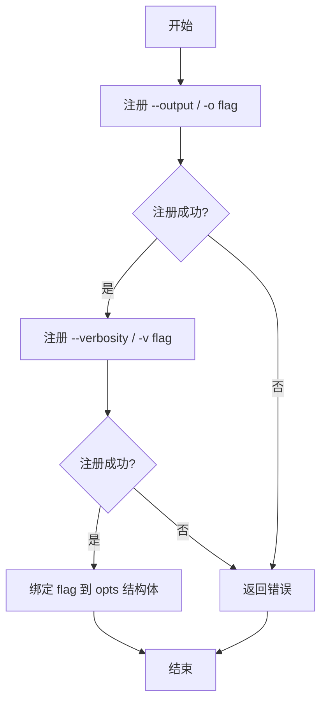

#### 带注释源码

由于是外部依赖，未知其具体实现。以下为基于常见模式和使用上下文的假设实现：

```go
// AddOutputFlags 为 cobra 命令添加输出相关的命令行参数
// 参数：
//   - cmd: cobra 命令对象，用于注册 flag
//   - opts: outputOpts 指针，用于绑定 flag 的值
func AddOutputFlags(cmd *cobra.Command, opts *outputOpts) {
    // 添加输出格式 flag，支持短选项 -o 和长选项 --output
    // 默认值为 "table"，可选值通常包括 table, json, yaml 等
    cmd.Flags().StringVarP(&opts.output, "output", "o", "table", "Output format")

    // 添加详细程度 flag，支持短选项 -v 和长选项 --verbosity
    // 用于控制输出信息的详细程度，数值越大越详细
    cmd.Flags().IntVarP(&opts.verbosity, "verbosity", "v", 0, "Verbosity level")
}
```


### `AddCauseFlags`

该函数用于为 Cobra 命令行工具添加与 "cause"（原因）相关的命令行标志，允许用户指定资源更新的原因（如消息、理由、工单等），并将解析后的值存储到 `update.Cause` 结构体中。

参数：

- `cmd`：`*cobra.Command`，Cobra 命令对象，用于在其上注册命令行标志
- `cause`：`*update.Cause`，指向 `update.Cause` 结构体的指针，用于存储解析后的 cause 信息

返回值：根据函数实现，可能无返回值或返回 `error`（如果标志解析失败）

#### 流程图

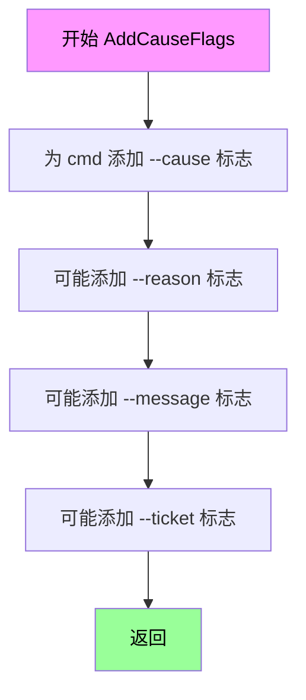

#### 带注释源码

（注：由于该函数定义未在提供的代码段中，基于函数调用 `AddCauseFlags(cmd, &opts.cause)` 和 Flux CD 项目的常见模式进行推断）

```go
// AddCauseFlags 为指定的 Cobra 命令添加 cause 相关的命令行标志
// 参数 cmd 是目标 Cobra 命令
// 参数 cause 是指向 update.Cause 的指针，用于存储解析后的标志值
func AddCauseFlags(cmd *cobra.Command, cause *update.Cause) {
    // 添加 --cause 标志，允许用户指定更新的原因
    // 该标志支持多种格式，如 "message:xxx"、"reason:xxx"、"ticket:xxx" 等
    cmd.Flags().StringVar(&cause.Message, "cause", "", "Reason for the update")
    
    // 可能还支持单独的 --reason 标志
    cmd.Flags().StringVar(&cause.Reason, "reason", "", "Reason for the update")
    
    // 可能支持工单/票据关联
    cmd.Flags().StringVar(&cause.Ticket, "ticket", "", "Ticket or issue number associated with this update")
}
```

#### 备注

- 该函数的实际定义未在提供的代码段中显示，可能位于同一包的其他源文件中
- `update.Cause` 结构体通常包含字段如 `Message`、`Reason`、`Ticket` 等，用于记录资源变更的原因
- 这是 Flux CD CLI 工具的标准模式，用于在执行更新操作时记录变更意图


### `workloadReleaseOpts.Command`

该方法用于构建并返回一个配置完整的Cobra命令对象，该命令实现了工作负载发布功能，包括设置命令使用说明、示例、各种命令行标志（命名空间、工作负载、镜像、排除列表、干运行、交互模式等），并返回最终组装好的 `*cobra.Command` 供CLI主程序使用。

参数：

- 该方法无显式参数（接收者 `opts *workloadReleaseOpts` 作为隐式参数）

返回值：`*cobra.Command`，返回配置完成的工作负载发布命令对象

#### 流程图

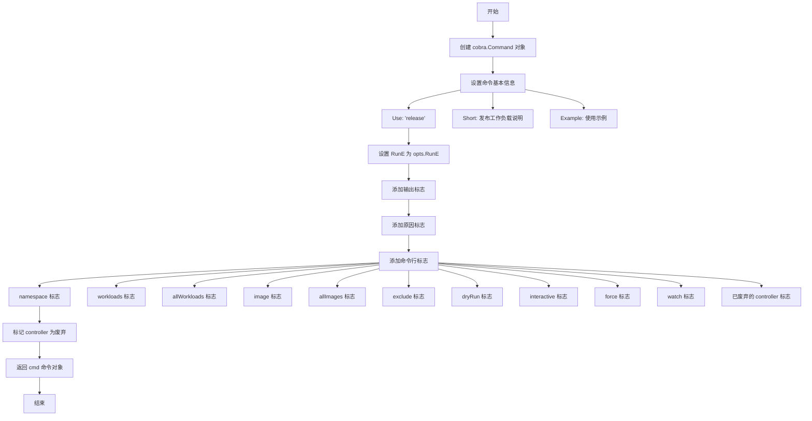

#### 带注释源码

```go
// Command 构建并返回工作负载发布命令的Cobra命令对象
// 该方法配置命令的基本信息、标志选项，并返回组装好的命令供CLI使用
func (opts *workloadReleaseOpts) Command() *cobra.Command {
    // 初始化Cobra命令对象，设置命令名称为"release"
    cmd := &cobra.Command{
        Use:   "release",                                        // 命令名称
        Short: "Release a new version of a workload.",          // 简短说明
        // 提供使用示例，展示不同场景下的命令用法
        Example: makeExample(
            "fluxctl release -n default --workload=deployment/foo --update-image=library/hello:v2",
            "fluxctl release --all --update-image=library/hello:v2",
            "fluxctl release --workload=default:deployment/foo --update-all-images",
        ),
        RunE: opts.RunE,  // 设置命令执行函数为RunE方法
    }

    // 添加输出格式标志（如JSON、YAML等）
    AddOutputFlags(cmd, &opts.outputOpts)
    // 添加原因标志（用于记录变更原因）
    AddCauseFlags(cmd, &opts.cause)
    
    // 添加命名空间标志 -n，默认为空字符串
    cmd.Flags().StringVarP(&opts.namespace, "namespace", "n", "", "Workload namespace")
    // 添加工作负载标志，支持多个工作负载，格式为 <namespace>:<kind>/<name>
    // 注意：由于与--watch冲突，不能定义简写
    cmd.Flags().StringSliceVarP(&opts.workloads, "workload", "", []string{}, "List of workloads to release <namespace>:<kind>/<name>")
    // 添加全部工作负载标志
    cmd.Flags().BoolVar(&opts.allWorkloads, "all", false, "Release all workloads")
    // 添加镜像更新标志 -i
    cmd.Flags().StringVarP(&opts.image, "update-image", "i", "", "Update a specific image")
    // 添加全部镜像更新标志
    cmd.Flags().BoolVar(&opts.allImages, "update-all-images", false, "Update all images to latest versions")
    // 添加排除工作负载列表标志
    cmd.Flags().StringSliceVar(&opts.exclude, "exclude", []string{}, "List of workloads to exclude")
    // 添加干运行标志
    cmd.Flags().BoolVar(&opts.dryRun, "dry-run", false, "Do not release anything; just report back what would have been done")
    // 添加交互模式标志
    cmd.Flags().BoolVar(&opts.interactive, "interactive", false, "Select interactively which containers to update")
    // 添加强制标志 -f，忽略锁和镜像过滤器
    cmd.Flags().BoolVarP(&opts.force, "force", "f", false, "Disregard locks and container image filters (has no effect when used with --all or --update-all-images)")
    // 添加监视标志 -w，监视发布进度
    cmd.Flags().BoolVarP(&opts.watch, "watch", "w", false, "Watch rollout progress during release")

    // 处理已废弃的controller标志，保持向后兼容
    cmd.Flags().StringSliceVarP(&opts.controllers, "controller", "c", []string{}, "List of controllers to release <namespace>:<kind>/<name>")
    // 标记controller标志为已废弃，提示用户使用--workload
    cmd.Flags().MarkDeprecated("controller", "changed to --workload, use that instead")

    // 返回组装完成的Cobra命令对象
    return cmd
}
```


### `workloadReleaseOpts.RunE`

这是 Flux CD CLI 工具中处理 `release` 命令的核心执行方法，负责解析用户输入、构建发布规范、提交发布任务并可选地监控滚动更新进度。

参数：

- `cmd`：`*cobra.Command`，Cobra 命令对象，用于获取标志值和输出流
- `args`：`[]string`，命令的额外参数（此函数不接受额外参数）

返回值：`error`，如果执行过程中出现错误则返回错误，否则返回 nil

#### 流程图

```mermaid
flowchart TD
    A[开始 RunE] --> B{args 长度是否为 0}
    B -->|否| C[返回 errorWantedNoArgs]
    B -->|是| D{检查 --update-image 或 --update-all-images}
    D -->|错误| E[返回检查错误]
    D -->|通过| F[合并废弃的 --controller 参数到 workloads]
    
    F --> G{验证标志组合}
    G --> H{len(workloads) <= 0 且 !allWorkloads?}
    H -->|是| I[返回 Usage Error: 需要 --all 或 --workload]
    H -->|否| J{watch && dryRun?}
    J -->|是| K[返回 Usage Error: 不能同时使用]
    J -->|否| L{force && allWorkloads && allImages?}
    L -->|是| M[返回 Usage Error: --force 无效]
    L -->|否| N{force && allWorkloads?}
    N -->|是| O[输出警告: --force 对 --all 无效]
    N -->|否| P{force && allImages?}
    P -->|是| Q[输出警告: --force 对 --update-all-images 无效]
    P -->|否| R[构建 workloads 列表]
    
    O --> R
    Q --> R
    R --> S{allWorkloads?}
    S -->|是| T[设置 workloads = ResourceSpecAll]
    S -->|否| U[遍历 workloads 解析为 ResourceSpec]
    T --> V[解析镜像规格]
    U --> V
    
    V --> W{image 标志?}
    W -->|是| X[解析镜像字符串]
    W -->|否| Y{allImages 标志?}
    Y -->|是| Z[设置 image = ImageSpecLatest]
    Y -->|否| AA[确定 ReleaseKind]
    
    X --> AA
    Z --> AA
    
    AA --> AB{dryRun 或 interactive?}
    AB -->|是| AC[kind = ReleaseKindPlan]
    AB -->|否| AD[kind = ReleaseKindExecute]
    
    AC --> AE[解析 excludes 列表]
    AD --> AE
    
    AE --> AF{kind == Plan?}
    AF -->|是| AG[输出 'Submitting dry-run release...']
    AF -->|否| AH[输出 'Submitting release...']
    
    AG --> AI[构建 ReleaseImageSpec]
    AH --> AI
    
    AI --> AJ[调用 API.UpdateManifests 提交发布]
    AJ --> AK{错误?}
    AK -->|是| AL[返回错误]
    AK -->|否| AM[调用 awaitJob 等待完成]
    
    AM --> AN{interactive 模式?}
    AN -->|否| AO[调用 await 等待最终发布]
    AN -->|是| AP[promptSpec 获取用户选择]
    AP --> AQ[构建 ReleaseContainersSpec]
    AQ --> AR[再次调用 API.UpdateManifests]
    AR --> AS{错误?}
    AS -->|是| AT[输出错误并返回 nil]
    AS -->|否| AU[设置 dryRun = false]
    AU --> AO
    
    AO --> AV{opts.watch?}
    AV -->|否| AX[返回 err]
    AV -->|是| AW[循环监控 rollout 状态]
    
    AW --> AY[调用 API.ListServicesWithOptions]
    AY --> AZ[遍历 workloads 状态]
    AZ --> BA{所有 workloads ready?}
    BA -->|是| BB[输出 'All workloads ready' 并返回]
    BA -->|否| BC[等待 2 秒]
    BC --> AY
    
    AL --> AX
    BB --> AX
    AT --> AX
```

#### 带注释源码

```go
// RunE 是 workloadReleaseOpts 的主执行方法，处理 release 命令的完整流程
// 参数 cmd: Cobra 命令对象，包含标志和配置
// 参数 args: 额外的命令行参数（此函数不接受任何额外参数）
// 返回: 错误信息，如果成功则返回 nil
func (opts *workloadReleaseOpts) RunE(cmd *cobra.Command, args []string) error {
	// 1. 验证没有额外的参数
	if len(args) != 0 {
		return errorWantedNoArgs
	}

	// 2. 确保指定了 --update-image 或 --update-all-images 之一
	if err := checkExactlyOne("--update-image=<image> or --update-all-images", opts.image != "", opts.allImages); err != nil {
		return err
	}

	// 3. 向后兼容性: 合并已废弃的 --controller 参数到 workloads
	// 这允许旧用户继续使用旧标志直到完全移除
	opts.workloads = append(opts.workloads, opts.controllers...)

	// 4. 验证标志组合的有效性
	switch {
	case len(opts.workloads) <= 0 && !opts.allWorkloads:
		// 必须指定 --all 或至少一个 --workload
		return newUsageError("please supply either --all, or at least one --workload=<workload>")
	case opts.watch && opts.dryRun:
		// watch 和 dry-run 互斥，无法同时使用
		return newUsageError("cannot use --watch with --dry-run")
	case opts.force && opts.allWorkloads && opts.allImages:
		// --force 在使用 --all 和 --update-all-images 时无效
		return newUsageError("--force has no effect when used with --all and --update-all-images")
	case opts.force && opts.allWorkloads:
		// 警告: --force 不会忽略使用 --all 时的锁定 workload
		fmt.Fprintf(cmd.OutOrStderr(), "Warning: --force will not ignore locked workloads when used with --all\n")
	case opts.force && opts.allImages:
		// 警告: --force 不会忽略使用 --update-all-images 时的容器镜像标签
		fmt.Fprintf(cmd.OutOrStderr(), "Warning: --force will not ignore container image tags when used with --update-all-images\n")
	}

	// 5. 构建 workloads 列表
	var workloads []update.ResourceSpec
	ns := getKubeConfigContextNamespaceOrDefault(opts.namespace, "default", opts.Context)

	if opts.allWorkloads {
		// 如果使用 --all，设置为特殊标记表示所有 workload
		workloads = []update.ResourceSpec{update.ResourceSpecAll}
	} else {
		// 解析每个 workload 字符串为 ResourceSpec
		for _, workload := range opts.workloads {
			id, err := resource.ParseIDOptionalNamespace(ns, workload)
			if err != nil {
				return err
			}
			workloads = append(workloads, update.MakeResourceSpec(id))
		}
	}

	// 6. 解析镜像规格
	var image update.ImageSpec
	var err error
	switch {
	case opts.image != "":
		// 解析用户指定的镜像字符串
		image, err = update.ParseImageSpec(opts.image)
		if err != nil {
			return err
		}
	case opts.allImages:
		// 使用最新版本的镜像
		image = update.ImageSpecLatest
	}

	// 7. 确定发布类型
	// dry-run 或交互模式使用 Plan 类型，只做计划不执行
	var kind update.ReleaseKind = update.ReleaseKindExecute
	if opts.dryRun || opts.interactive {
		kind = update.ReleaseKindPlan
	}

	// 8. 解析排除列表
	var excludes []resource.ID
	for _, exclude := range opts.exclude {
		s, err := resource.ParseIDOptionalNamespace(ns, exclude)
		if err != nil {
			return err
		}
		excludes = append(excludes, s)
	}

	// 9. 输出提交信息
	if kind == update.ReleaseKindPlan {
		fmt.Fprintf(cmd.OutOrStderr(), "Submitting dry-run release ...\n")
	} else {
		fmt.Fprintf(cmd.OutOrStderr(), "Submitting release ...\n")
	}

	// 10. 构建发布规范并提交到 API
	ctx := context.Background()
	spec := update.ReleaseImageSpec{
		ServiceSpecs: workloads, // 要发布的 workload 列表
		ImageSpec:    image,     // 目标镜像
		Kind:         kind,      // 发布类型（执行或计划）
		Excludes:     excludes,  // 排除的 workload
		Force:        opts.force, // 是否强制忽略锁和过滤器
	}
	jobID, err := opts.API.UpdateManifests(ctx, update.Spec{
		Type:  update.Images, // 更新类型为镜像更新
		Cause: opts.cause,    // 更新原因
		Spec:  spec,          // 发布规范
	})
	if err != nil {
		return err
	}

	// 11. 等待初始发布任务完成
	result, err := awaitJob(ctx, opts.API, jobID, opts.Timeout)
	if err != nil {
		return err
	}

	// 12. 交互模式: 让用户选择要发布的容器
	if opts.interactive {
		spec, err := promptSpec(cmd.OutOrStdout(), result, opts.verbosity)
		spec.Force = opts.force
		if err != nil {
			fmt.Fprintln(cmd.OutOrStderr(), err.Error())
			return nil
		}

		fmt.Fprintf(cmd.OutOrStderr(), "Submitting selected release ...\n")
		jobID, err = opts.API.UpdateManifests(ctx, update.Spec{
			Type:  update.Containers, // 更新类型为容器选择
			Cause: opts.cause,
			Spec:  spec,
		})
		if err != nil {
			fmt.Fprintln(cmd.OutOrStderr(), err.Error())
			return nil
		}

		opts.dryRun = false // 交互模式选择后实际执行
	}

	// 13. 等待最终发布完成
	err = await(ctx, cmd.OutOrStdout(), cmd.OutOrStderr(), opts.API, jobID, !opts.dryRun, opts.verbosity, opts.Timeout)
	if !opts.watch || err != nil {
		// 如果不监控或发生错误，直接返回
		return err
	}

	// 14. 监控模式: 轮询直到所有 workload 就绪
	fmt.Fprintf(cmd.OutOrStderr(), "Monitoring rollout ...\n")
	for {
		completed := 0
		// 获取所有受影响 workload 的状态
		workloads, err := opts.API.ListServicesWithOptions(ctx, v11.ListServicesOptions{Services: result.Result.AffectedResources()})
		if err != nil {
			return err
		}

		// 遍历每个 workload 的状态
		for _, workload := range workloads {
			writeRolloutStatus(workload, opts.verbosity)

			if workload.Status == cluster.StatusReady {
				completed++
			}

			// 检查是否有错误消息
			if workload.Rollout.Messages != nil {
				fmt.Fprintf(cmd.OutOrStderr(), "There was a problem releasing %s:\n", workload.ID)
				for _, msg := range workload.Rollout.Messages {
					fmt.Fprintf(cmd.OutOrStderr(), "%s\n", msg)
				}
				return nil
			}
		}

		// 所有 workload 都就绪
		if completed == len(workloads) {
			fmt.Fprintf(cmd.OutOrStderr(), "All workloads ready.\n")
			return nil
		}

		// 等待 2 秒后继续轮询
		time.Sleep(2000 * time.Millisecond)
	}
}
```

## 关键组件


### workloadReleaseOpts 结构体

存储发布工作负载所需的配置选项，包括命名空间、工作负载列表、镜像、排除列表、干运行模式、交互模式、强制标志、监控标志等参数。

### Command() 方法

定义Cobra命令行子命令结构，设置发布命令的使用说明、示例、输出标志、原因标志以及各种发布相关参数flag。

### RunE() 方法

执行发布操作的核心逻辑，验证参数、解析工作负载ID、构建发布规范、调用API提交发布任务、处理交互式选择、监控发布进度。

### writeRolloutStatus() 函数

格式化输出工作负载的发布状态，包括工作负载ID、容器名称、镜像版本、发布状态、副本数和过时数量信息。

### promptSpec() 函数

在交互式模式下，通过菜单界面让用户选择要发布的容器规格，返回用户选定的容器发布规范。

### ReleaseImageSpec 构建逻辑

根据用户提供的参数（特定镜像或全部镜像）构建发布镜像规范，确定发布类型（执行或计划）。

### awaitJob() 任务等待

异步等待API返回的发布任务完成，获取任务执行结果。

### 轮询监控循环

当启用watch标志时，持续轮询检查所有受影响工作负载的就绪状态，直到所有工作负载达到期望状态或发生错误。


## 问题及建议


### 已知问题

- **魔法数字硬编码**：轮询间隔 `time.Sleep(2000 * time.Millisecond)` 使用了硬编码的2000毫秒，缺乏可配置性
- **重复的资源解析逻辑**：工作负载ID的解析逻辑在主流程和排除列表处理中重复出现，未提取为复用函数
- **上下文不支持取消**：使用 `context.Background()` 创建上下文，在长时间运行的 watch 模式中无法支持用户中断操作
- **错误处理不一致**：部分位置返回 `nil` 而非错误对象（如 `promptSpec` 失败时），导致真正的错误被吞掉
- **缺少资源清理**：`newTabwriter()` 创建的 `*tabwriter.Writer` 未显式调用 `Flush()` 或确保资源释放
- **API 版本混用**：同时导入和使用 v11 与 v6 两个版本的 API，增加了维护复杂度和潜在兼容性问题
- **命名不一致**：虽然 `controllers` 字段已标记废弃，但在同一结构体中同时存在 `workloads` 和 `controllers`，容易造成混淆
- **干运行与 watch 互斥未提前检查**：虽然最终会报错，但逻辑分散在多个 case 中，缺少集中的参数组合验证

### 优化建议

- **提取配置常量**：将轮询间隔、默认 namespace 等硬编码值提取为配置常量或 CLI flags
- **封装资源解析函数**：创建 `parseResourceSpecs` 函数处理工作负载和排除列表的解析，避免重复代码
- **支持上下文取消**：使用 `cmd.Context()` 替代 `context.Background()`，允许用户通过 Ctrl+C 中断操作
- **统一错误处理**：确保所有失败路径都返回有意义的错误对象，而非无声地忽略
- **引入结构化日志**：使用标准的日志库（如 logrus、zap）替代 `fmt.Fprintf`，便于日志收集和过滤
- **简化 API 调用层**：统一 API 版本使用，或通过接口抽象减少版本耦合
- **增强测试覆盖**：添加针对参数验证、错误路径、交互模式的单元测试
- **重构验证逻辑**：将复杂的参数互斥验证集中到一个 `validate()` 方法中，提高可读性和可维护性

## 其它


### 设计目标与约束

本模块的设计目标是提供一个灵活且用户友好的CLI工具，用于发布Kubernetes工作负载的新版本。核心约束包括：支持单个或批量工作负载发布、强制忽略锁和镜像过滤器、交互式容器选择、以及实时监视滚动更新进度。该命令作为fluxctl的子命令运行，需要与Flux API进行交互。

### 错误处理与异常设计

错误处理采用Go语言的错误返回模式，主要包括以下几类：参数校验错误（如缺少必要参数、参数互斥冲突）返回usageError；API调用错误直接向上传递；解析错误（如镜像规格、工作负载ID格式错误）返回解析错误。交互模式下部分错误仅打印到stderr而不中断执行，如promptSpec失败时打印错误信息后返回nil。超时和job等待失败均返回错误供调用方处理。

### 数据流与状态机

命令执行流程分为以下几个状态：1) 参数解析与校验状态；2) 工作负载列表构建状态；3) 镜像规格解析状态；4) 发布请求提交状态；5) Job等待状态（可选）；6) 交互式选择状态（可选）；7) 监视滚动更新状态（非阻塞循环）。主状态机由RunE方法控制，监视状态为独立轮询循环，通过检查所有工作负载的Status是否为StatusReady来决定是否退出。

### 外部依赖与接口契约

本模块依赖以下外部包和接口：cobra用于CLI命令框架；Flux API（v11/v6）用于与Flux集群通信；cluster包提供工作负载状态定义；job包提供结果类型；resource包提供资源ID解析；update包提供发布规格、菜单选择、镜像规格解析等核心功能。关键接口契约包括opts.API.UpdateManifests用于提交发布任务，opts.API.ListServicesWithOptions用于轮询工作负载状态，awaitJob和await函数用于等待异步操作完成。

### 性能考虑

监视模式采用2000毫秒固定间隔轮询工作负载状态，未实现指数退避或可配置间隔。批量工作负载查询使用ListServicesWithOptions一次性获取所有受影响资源状态，避免N+1查询问题。发布操作为异步模式，客户端只需等待Job提交成功，监视功能为可选特性。

### 安全性考虑

--force参数允许忽略工作负载锁和镜像标签过滤器，具有较高权限风险，仅在文档中提示warning。敏感操作支持--dry-run模式预览而不实际执行。所有输出通过cmd.OutOrStderr()和cmd.OutOrStdout()规范化，适应不同输出重定向场景。

### 监控与日志

状态输出使用tabwriter格式化表格，包括工作负载ID、容器名、镜像、发布状态和副本数。关键操作节点有明确的用户提示信息，如"Submitting dry-run release..."、"Submitting release..."、"Monitoring rollout..."。错误信息通过fmt.Fprintln输出到stderr，详细信息仅在verbosity > 0时显示。

    