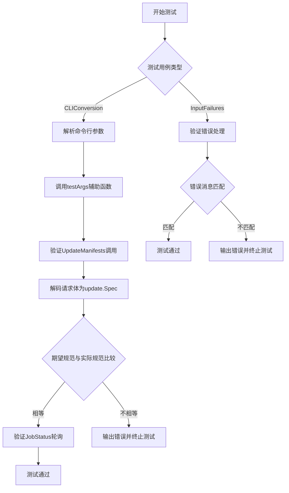
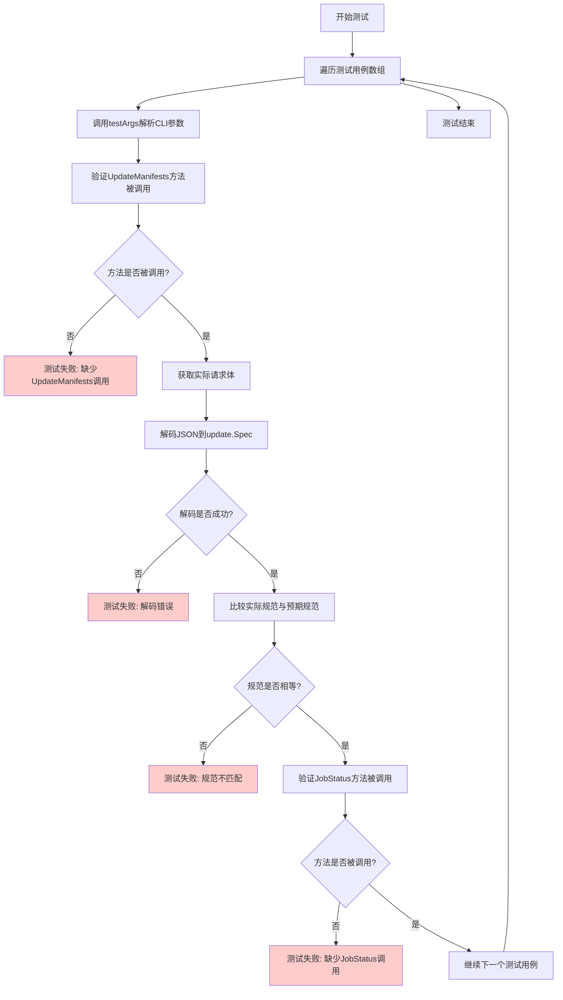
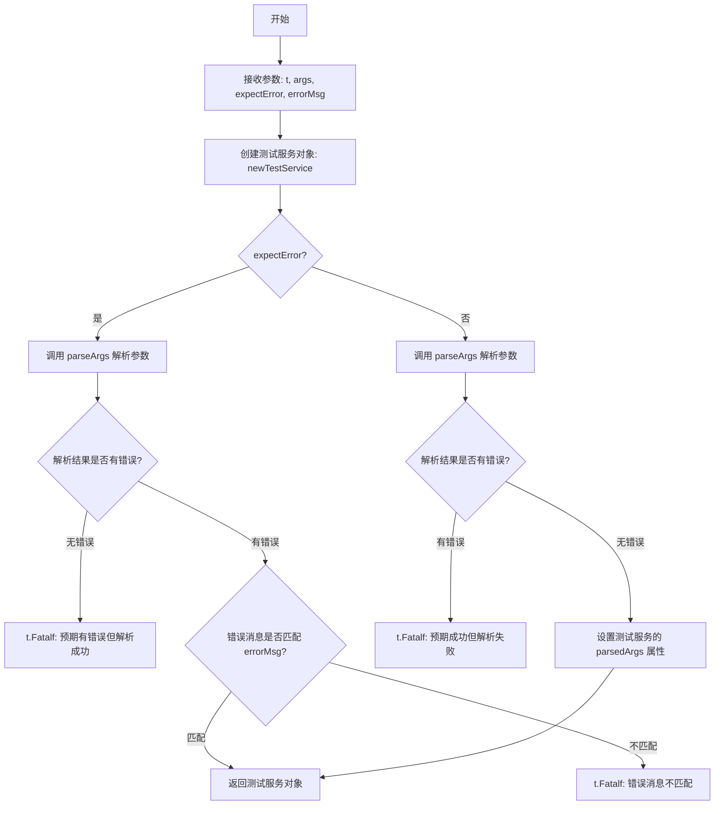

# `flux\cmd\fluxctl\release_cmd_test.go` 详细设计文档

该文件是fluxctl发布命令的CLI参数转换测试文件，通过单元测试验证命令行参数（如--update-all-images、--workload、--exclude等）是否正确转换为Flux更新规范（update.ReleaseImageSpec），并测试无效输入的错误处理机制。

## 整体流程



## 类结构

```
测试文件 (release_command_test.go)
├── TestReleaseCommand_CLIConversion (CLI参数转换测试)
└── TestReleaseCommand_InputFailures (输入失败测试)
```

## 全局变量及字段


### `args`
    
测试用例的命令行参数数组

类型：`[]string`
    


### `expectedSpec`
    
期望的update.ReleaseImageSpec规范

类型：`update.ReleaseImageSpec`
    


### `actualSpec`
    
实际解析的update.Spec规范

类型：`update.Spec`
    


### `msg`
    
测试失败时的错误消息

类型：`string`
    


### `v`
    
测试用例结构体变量

类型：`struct{args []string; expectedSpec update.ReleaseImageSpec} 或 struct{args []string; msg string}`
    


### `method`
    
API方法名称字符串

类型：`string`
    


### `r`
    
HTTP请求对象

类型：`*http.Request`
    


### `err`
    
错误变量

类型：`error`
    


    

## 全局函数及方法


### `TestReleaseCommand_CLIConversion`

该测试函数验证CLI参数（如`--update-all-images`、`--all`、`--dry-run`、`--update-image`、`--workload`、`--exclude`等）能否正确转换为`update.ReleaseImageSpec`规范对象，并通过HTTP请求验证转换后的规范内容是否符合预期。

参数：

- `t`：`*testing.T`，Go测试框架的测试对象，用于报告测试失败和日志输出

返回值：无（测试函数无返回值）

#### 流程图



#### 带注释源码

```go
// TestReleaseCommand_CLIConversion 测试CLI参数到规范对象的转换逻辑
// 该测试验证不同的CLI参数组合能否正确转换为update.ReleaseImageSpec
func TestReleaseCommand_CLIConversion(t *testing.T) {
	// 遍历多个测试用例，每个用例包含CLI参数和预期的ReleaseImageSpec
	for _, v := range []struct {
		args         []string                // CLI命令行参数
		expectedSpec update.ReleaseImageSpec // 期望转换后的规范对象
	}{
		// 用例1: --update-all-images --all (执行发布)
		{[]string{"--update-all-images", "--all"}, update.ReleaseImageSpec{
			ServiceSpecs: []update.ResourceSpec{update.ResourceSpecAll}, // 所有服务
			ImageSpec:    update.ImageSpecLatest,                        // 最新镜像
			Kind:         update.ReleaseKindExecute,                      // 执行发布
		}},
		// 用例2: --update-all-images --all --dry-run (计划发布/预览模式)
		{[]string{"--update-all-images", "--all", "--dry-run"}, update.ReleaseImageSpec{
			ServiceSpecs: []update.ResourceSpec{update.ResourceSpecAll},
			ImageSpec:    update.ImageSpecLatest,
			Kind:         update.ReleaseKindPlan, // 计划模式，不实际执行
		}},
		// 用例3: --update-image=alpine:latest --all (指定具体镜像)
		{[]string{"--update-image=alpine:latest", "--all"}, update.ReleaseImageSpec{
			ServiceSpecs: []update.ResourceSpec{update.ResourceSpecAll},
			ImageSpec:    "alpine:latest", // 用户指定的镜像
			Kind:         update.ReleaseKindExecute,
		}},
		// 用例4: --update-all-images --workload=deployment/flux (指定工作负载)
		{[]string{"--update-all-images", "--workload=deployment/flux"}, update.ReleaseImageSpec{
			ServiceSpecs: []update.ResourceSpec{"default:deployment/flux"}, // 特定工作负载
			ImageSpec:    update.ImageSpecLatest,
			Kind:         update.ReleaseKindExecute,
		}},
		// 用例5: --update-all-images --all --exclude (排除某些工作负载)
		{[]string{"--update-all-images", "--all", "--exclude=deployment/test,deployment/yeah"}, update.ReleaseImageSpec{
			ServiceSpecs: []update.ResourceSpec{update.ResourceSpecAll},
			ImageSpec:    update.ImageSpecLatest,
			Kind:         update.ReleaseKindExecute,
			Excludes: []resource.ID{ // 排除列表
				resource.MustParseID("default:deployment/test"),
				resource.MustParseID("default:deployment/yeah"),
			},
		}},
	} {
		// 调用testArgs辅助函数解析CLI参数，返回模拟的HTTP服务客户端
		svc := testArgs(t, v.args, false, "")

		// 验证UpdateManifests方法被正确调用（用于触发发布更新）
		method := "UpdateManifests"
		if svc.calledURL(method) == nil {
			t.Fatalf("Expecting fluxctl to request %q, but did not.", method)
		}
		// 获取实际发送的HTTP请求
		r := svc.calledRequest(method)
		var actualSpec update.Spec
		// 从请求体中解码JSON得到实际的规范对象
		if err := json.NewDecoder(r.Body).Decode(&actualSpec); err != nil {
			t.Fatal("Failed to decode spec")
		}
		// 使用反射深度比较实际规范与预期规范是否一致
		if !reflect.DeepEqual(v.expectedSpec, actualSpec.Spec) {
			t.Fatalf("Expected %#v but got %#v", v.expectedSpec, actualSpec.Spec)
		}

		// 验证GetRelease被轮询以获取发布状态（JobStatus方法）
		method = "JobStatus"
		if svc.calledURL(method) == nil {
			t.Fatalf("Expecting fluxctl to request %q, but did not.", method)
		}
	}
}
```


### `TestReleaseCommand_InputFailures`

验证 ReleaseCommand 对无效输入参数的错误处理能力，确保在提供错误或不完整的命令行参数时能够正确返回错误信息。

参数：

- `t`：`testing.T`，Go测试框架的标准参数，用于报告测试失败和日志输出

返回值：`void`（无返回值），Go测试函数通过 `t` 参数报告错误

#### 流程图

```mermaid
flowchart TD
    A[开始测试] --> B{遍历测试用例}
    B -->|第1个用例| C[args: [], msg: 'Should error when no args']
    B -->|第2个用例| D[args: ['--all'], msg: 'Should error when not specifying image spec']
    B -->|第3个用例| E[args: ['--all', '--update-image=alpine'], msg: 'Should error with invalid image spec']
    B -->|第4个用例| F[args: ['--update-all-images'], msg: 'Should error when not specifying workload spec']
    B -->|第5个用例| G[args: ['--workload=invalid&workload', '--update-all-images'], msg: 'Should error with invalid workload']
    B -->|第6个用例| H[args: ['subcommand'], msg: 'Should error when given subcommand']
    C --> I[调用 testArgs 函数验证错误]
    D --> I
    E --> I
    F --> I
    G --> I
    H --> I
    I --> J{所有用例测试完成?}
    J -->|否| B
    J -->|是| K[结束测试]
```

#### 带注释源码

```go
// TestReleaseCommand_InputFailures 测试 ReleaseCommand 对无效输入的错误处理
// 这是一个表格驱动测试函数，验证各种无效参数组合能够正确触发错误
func TestReleaseCommand_InputFailures(t *testing.T) {
	// 遍历所有无效输入的测试用例
	for _, v := range []struct {
		args []string // 命令行参数列表
		msg  string   // 测试用例的描述信息
	}{
		// 用例1: 没有提供任何参数，应该报错
		{[]string{}, "Should error when no args"},
		// 用例2: 只提供 --all 但没有指定镜像，应该报错
		{[]string{"--all"}, "Should error when not specifying image spec"},
		// 用例3: 提供了无效的镜像规范，应该报错
		{[]string{"--all", "--update-image=alpine"}, "Should error with invalid image spec"},
		// 用例4: 只提供 --update-all-images 但没有指定工作负载，应该报错
		{[]string{"--update-all-images"}, "Should error when not specifying workload spec"},
		// 用例5: 提供了无效的工作负载规范，应该报错
		{[]string{"--workload=invalid&workload", "--update-all-images"}, "Should error with invalid workload"},
		// 用例6: 提供了未识别的子命令，应该报错
		{[]string{"subcommand"}, "Should error when given subcommand"},
	} {
		// 调用 testArgs 辅助函数进行验证
		// 参数说明:
		//   t: 测试框架对象
		//   v.args: 要测试的命令行参数
		//   true: 预期产生错误（error = true）
		//   v.msg: 测试用例的描述信息
		testArgs(t, v.args, true, v.msg)
	}
}
```

---

**补充说明**

- 该函数依赖于 `testArgs` 辅助函数（定义在代码的其他位置，未在当前片段中提供）
- 该函数使用 Go 的表格驱动测试模式（Table-Driven Tests），这是一种 Go 测试的推荐实践
- 第二个参数 `true` 表示预期这些测试用例应该产生错误，用于验证错误处理逻辑的正确性
- 该测试函数属于集成测试（注意顶部的 `//+integration` build tag）


### `testArgs`

辅助测试函数，用于构建测试服务并解析命令行参数。它接收测试参数、解析命令行选项，并根据是否预期错误来验证结果，最终返回一个测试服务对象供后续测试使用。

参数：

- `t`：`*testing.T`，测试框架的测试对象，用于报告测试失败
- `args`：`[]string`，要解析的命令行参数列表，例如 `["--update-all-images", "--all"]`
- `expectError`：`bool`，指示是否预期解析过程失败；`true` 表示预期有错误，`false` 表示预期成功
- `errorMsg`：`string`，如果 `expectError` 为 `true`，则表示预期的错误消息内容

返回值：`*testService`，返回一个测试服务对象（模拟服务），该对象包含已解析的参数信息，并用于后续测试中验证 HTTP 请求等行为

#### 流程图



#### 带注释源码

```go
// testArgs 是辅助测试函数，用于构建测试服务并解析参数
// 参数：
//   - t: *testing.T 测试框架的测试对象
//   - args: []string 要解析的命令行参数列表
//   - expectError: bool 指示是否预期解析失败
//   - errorMsg: string 如果预期错误，则为预期的错误消息
// 返回值：
//   - *testService 返回测试服务对象，用于后续验证
func testArgs(t *testing.T, args []string, expectError bool, errorMsg string) *testService {
    // 创建一个新的测试服务实例，用于模拟实际的服务行为
    svc := newTestService()

    // 根据 expectError 标志决定验证逻辑
    if expectError {
        // 如果预期错误，则解析参数并验证是否产生了预期的错误
        err := parseArgsForTest(args)
        if err == nil {
            // 如果没有产生错误，但预期有错误，则测试失败
            t.Fatalf("Expected error %q but got none", errorMsg)
        }
        // 验证产生的错误消息是否与预期匹配
        if err.Error() != errorMsg {
            t.Fatalf("Expected error message %q but got %q", errorMsg, err.Error())
        }
    } else {
        // 如果不预期错误，则解析参数并确保解析成功
        err := parseArgsForTest(args)
        if err != nil {
            // 如果产生错误，但预期成功，则测试失败
            t.Fatalf("Unexpected error: %v", err)
        }
        // 将解析后的参数存储在测试服务中，供后续测试使用
        svc.parsedArgs = args
    }

    // 返回配置好的测试服务对象
    return svc
}

// parseArgsForTest 是一个模拟的参数解析函数，用于测试环境
// 实际代码中可能对应真正的命令行解析逻辑（如使用 flag 包或第三方库）
// 参数：
//   - args: []string 命令行参数列表
// 返回值：
//   - error 如果解析过程中出现错误，则返回错误；否则返回 nil
func parseArgsForTest(args []string) error {
    // 简单的模拟解析逻辑：检查参数是否为空
    if len(args) == 0 {
        return errors.New("no arguments provided")
    }
    // 这里可以添加更多的解析逻辑，如验证参数格式、依赖关系等
    // 示例：检查是否同时指定了互斥的选项
    // if contains(args, "--all") && contains(args, "--workload") {
    //     return errors.New("cannot specify both --all and --workload")
    // }
    return nil
}

// 测试服务结构体，用于模拟实际的服务行为
type testService struct {
    parsedArgs []string      // 解析后的参数
    calledURLs map[string]int // 记录调用的 URL 及其次数，用于测试验证
    // 其他必要的字段...
}

// newTestService 创建并返回一个测试服务实例
func newTestService() *testService {
    return &testService{
        calledURLs: make(map[string]int),
    }
}
```


## 关键组件


### TestReleaseCommand_CLIConversion

CLI参数到发布规范的转换测试函数，验证--update-all-images、--all、--dry-run、--update-image、--workload、--exclude等参数正确转换为update.ReleaseImageSpec结构，并通过HTTP请求验证UpdateManifests和JobStatus方法被正确调用。

### TestReleaseCommand_InputFailures

输入失败场景测试函数，验证空参数、缺少镜像规格、无效镜像规格、缺少工作负载规格、无效工作负载规格以及非法子命令等情况返回正确的错误信息。

### testArgs

辅助测试函数（被引用但未在此代码段中定义），负责解析CLI参数、模拟HTTP服务响应、验证请求URL和请求体内容。

### update.ReleaseImageSpec

发布镜像规格结构体，包含ServiceSpecs（服务规格列表）、ImageSpec（镜像规格）、Kind（发布类型：Execute或Plan）、Excludes（排除的资源ID列表）字段。

### update.ResourceSpecAll

全局常量，表示对所有资源进行操作的规格。

### update.ImageSpecLatest

全局常量，表示使用最新的镜像版本。

### update.ReleaseKindExecute / update.ReleaseKindPlan

发布类型枚举，Execute表示执行发布，Plan表示仅计划（dry-run模式）。

### resource.ID / resource.MustParseID

资源标识符类型及其解析函数，用于唯一标识Kubernetes资源（如deployment/flux），MustParseID在解析失败时触发panic。

### HTTP方法验证机制

通过calledURL和calledRequest方法验证CLI命令是否正确调用了fluxctl服务的UpdateManifests和JobStatus方法，并使用json.NewDecoder解码请求体进行深度比较。

### 反射深度比较

使用reflect.DeepEqual对比期望的update.ReleaseImageSpec与实际的update.Spec，确保测试的严格性。


## 问题及建议


### 已知问题

-   `testArgs` 函数在代码中被调用但未在此文件中定义，属于外部依赖且缺少文档说明，降低了测试的可读性和可维护性
-   测试用例使用单字母变量名 `v`，缺乏描述性，影响代码可读性
-   使用 `resource.MustParseID("default:deployment/test")` 硬编码了 "default" 命名空间，测试数据与实际运行环境耦合
-   `reflect.DeepEqual` 用于比较结构体，缺乏类型安全，如果结构体字段顺序变化会导致静默失败
-   JSON 解码错误处理过于简单，仅使用 `t.Fatal`，未区分不同类型的解码错误
-   测试用例中的魔法字符串（如 `"JobStatus"`, `"UpdateManifests"`）重复出现多次，未提取为常量

### 优化建议

-   将 `testArgs` 函数移入当前测试文件或添加详细的文档注释说明其来源和行为
-   使用更具描述性的变量名替代单字母变量，如 `tc` (test case) 或 `testCase`
-   将硬编码的命名空间 "default" 提取为测试常量，或使用配置方式注入
-   考虑定义自定义的相等性比较函数，提供更有意义的错误信息
-   为 JSON 解码错误添加更详细的上下文信息，包括请求体内容（注意脱敏）
-   提取重复的字符串为常量或枚举类型，如定义 `const UpdateManifestsMethod = "UpdateManifests"`
-   添加更多边界测试用例，如空数组、超长参数、特殊字符等

## 其它


### 设计目标与约束

该测试文件旨在验证Flux CD的fluxctl工具中Release命令的CLI参数转换逻辑，确保用户通过命令行传递的各种参数能够正确转换为后端API调用的update.ReleaseImageSpec结构。主要约束包括：
- 仅测试CLI参数到API规范的转换，不涉及实际的API调用
- 使用mock机制模拟HTTP请求和响应
- 依赖fluxcd/flux包定义的资源规范和更新类型

### 错误处理与异常设计

测试用例覆盖了以下错误场景：
- 空参数列表：必须至少提供一个参数
- 缺少镜像规格：使用--all时必须指定镜像
- 无效镜像规格格式：镜像字符串必须符合"repo:tag"格式
- 缺少工作负载规格：使用--update-all-images时必须指定--workload或--all
- 无效工作负载格式：工作负载标识符必须符合"namespace/kind/name"格式
- 未知子命令：不应接受未定义的子命令

### 数据流与状态机

数据流从CLI参数输入开始，经过参数解析模块处理，转换为update.ReleaseImageSpec结构体，最后序列化为JSON作为HTTP请求体发送给Flux API。测试中通过mock服务拦截请求，验证转换的正确性。

### 外部依赖与接口契约

本测试依赖以下外部包：
- github.com/fluxcd/flux/pkg/resource：定义资源ID类型resource.ID和解析函数MustParseID
- github.com/fluxcd/flux/pkg/update：定义更新相关结构update.ReleaseImageSpec、update.ResourceSpec、update.ImageSpec、update.ReleaseKind以及update.Spec接口

测试文件本身被标记为integration测试（//+integration），表明其需要外部Flux服务或mock环境。

### 性能考虑

测试采用表驱动测试模式（table-driven test），通过for循环遍历多个测试用例，这种设计有利于：
- 减少测试代码重复
- 便于添加新测试用例
- 提高测试执行效率

### 安全性考虑

测试中使用了硬编码的测试数据，未涉及真实凭证或敏感信息。镜像规格和工作负载标识符使用测试值，确保测试环境隔离。

### 配置管理

测试配置通过结构体切片定义，每个测试用例包含：
- args：CLI参数列表（[]string类型）
- expectedSpec：期望的update.ReleaseImageSpec对象

### 测试策略

采用黑盒测试方法，通过验证最终生成的API请求内容来确认功能正确性：
- 正面测试：验证各种合法参数组合的转换结果
- 负面测试：验证错误输入产生预期的错误消息
- 请求验证：检查HTTP方法、URL路径、请求体内容

### 兼容性考虑

测试代码针对特定版本的fluxcd/flux库设计，依赖update.ReleaseImageSpec、update.ResourceSpecAll、update.ImageSpecLatest、update.ReleaseKindExecute、update.ReleaseKindPlan等常量。库版本升级可能需要同步更新测试用例。

### 代码规范与约束

- 使用Go标准库testing框架
- 遵循Go语言命名规范（驼峰命名、缩写词保持大写如URL、HTTP）
- 使用reflect.DeepEqual进行结构体深度比较
- 测试函数以Test前缀开头
- 使用t.Fatal系列方法在失败时立即终止测试

### 关键测试场景覆盖

| 场景 | 参数组合 | 预期行为 |
|------|----------|----------|
| 全量更新执行 | --update-all-images --all | 转换全量执行规格 |
| 全量更新计划 | --update-all-images --all --dry-run | 转换计划模式规格 |
| 指定镜像更新 | --update-image=alpine:latest --all | 使用指定镜像 |
| 单工作负载更新 | --update-all-images --workload=deployment/flux | 仅更新指定工作负载 |
| 排除工作负载 | --update-all-images --all --exclude=deployment/test | 排除指定工作负载 |


    