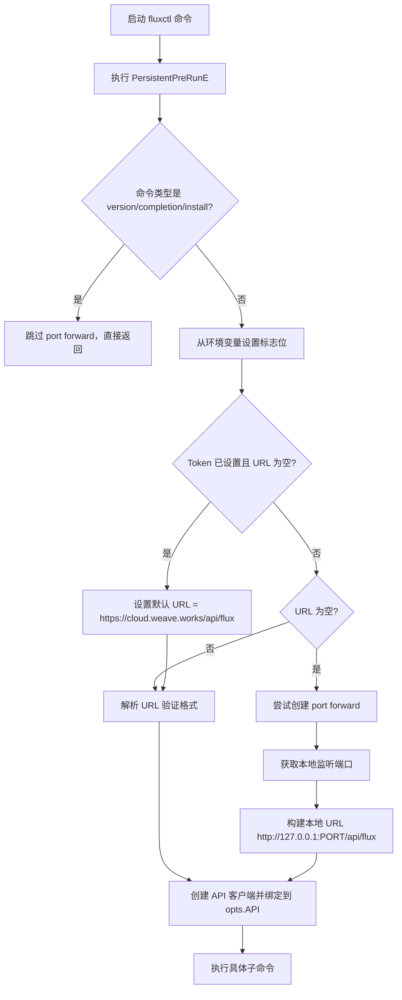
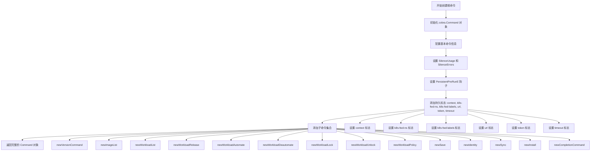
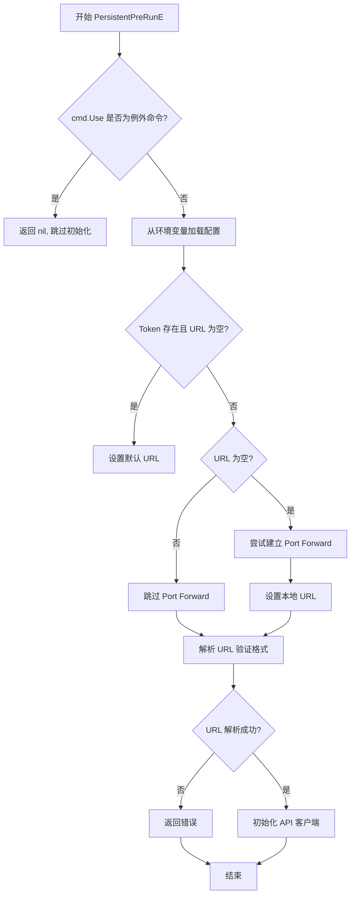

# `flux\cmd\fluxctl\root_cmd.go` 详细设计文档

fluxctl 是 Flux GitOps 工具的命令行客户端，通过 HTTP API 与 Fluxd 守护进程交互，支持列出工作负载、镜像管理、版本发布、自动化策略配置等功能，可通过 port forward、URL+Token 或 Weave Cloud 三种方式连接 Flux API。

## 整体流程



## 类结构

```
rootOpts (根命令选项结构体)
├── fields: Context, URL, Token, Namespace, Labels, API, Timeout
├── method: Command() *cobra.Command
└── method: PersistentPreRunE(cmd *cobra.Command, args []string) error

全局函数
├── newRoot() *rootOpts
└── setFromEnvIfNotSet(flags *pflag.FlagSet, flagName string, envNames ...string)

全局变量
├── rootLongHelp (帮助文本)
└── 常量: defaultURLGivenToken, envVariableURL, envVariableNamespace, envVariableLabels, envVariableToken, envVariableCloudToken, envVariableTimeout
```

## 全局变量及字段


### `rootLongHelp`
    
fluxctl 工具的长帮助文本，描述连接方式和工作流程

类型：`string`
    


### `defaultURLGivenToken`
    
提供 Token 时的默认 Flux API URL（Weave Cloud 服务地址）

类型：`string`
    


### `envVariableURL`
    
Flux API URL 环境变量名称（FLUX_URL）

类型：`string`
    


### `envVariableNamespace`
    
Kubernetes 命名空间环境变量名称（FLUX_FORWARD_NAMESPACE）

类型：`string`
    


### `envVariableLabels`
    
Fluxd Pod 标签选择器环境变量名称（FLUX_FORWARD_LABELS）

类型：`string`
    


### `envVariableToken`
    
Flux 服务令牌环境变量名称（FLUX_SERVICE_TOKEN）

类型：`string`
    


### `envVariableCloudToken`
    
Weave Cloud 令牌环境变量名称（WEAVE_CLOUD_TOKEN）

类型：`string`
    


### `envVariableTimeout`
    
命令超时时间环境变量名称（FLUX_TIMEOUT）

类型：`string`
    


### `rootOpts.Context`
    
kubeconfig 上下文名称

类型：`string`
    


### `rootOpts.URL`
    
Flux API 基础 URL

类型：`string`
    


### `rootOpts.Token`
    
认证令牌

类型：`string`
    


### `rootOpts.Namespace`
    
Fluxd 所在的 Kubernetes 命名空间

类型：`string`
    


### `rootOpts.Labels`
    
用于选择 fluxd pod 的标签选择器

类型：`map[string]string`
    


### `rootOpts.API`
    
Flux API 服务器客户端实例

类型：`api.Server`
    


### `rootOpts.Timeout`
    
全局命令超时时间

类型：`time.Duration`
    
    

## 全局函数及方法


### `newRoot`

创建并返回一个初始化后的 `rootOpts` 结构体实例，用于配置 Flux CLI 的全局选项和命令参数。

参数： 无

返回值： `*rootOpts`，返回指向新创建的 `rootOpts` 结构体实例的指针，该实例包含连接配置、命名空间、标签、超时等选项。

#### 流程图

```mermaid
flowchart TD
    A[开始 newRoot 函数] --> B[创建 rootOpts{} 空结构体]
    B --> C[返回 rootOpts 指针]
    C --> D[结束]
    
    subgraph rootOpts 内部结构
    E[Context: string]
    F[URL: string]
    G[Token: string]
    H[Namespace: string]
    I[Labels: map[string]string]
    J[API: api.Server]
    K[Timeout: time.Duration]
    end
    
    C -.->|初始化| E
    C -.->|初始化| F
    C -.->|初始化| G
    C -.->|初始化| H
    C -.->|初始化| I
    C -.->|初始化| J
    C -.->|初始化| K
```

#### 带注释源码

```go
// newRoot 创建并返回一个新的 rootOpts 实例
// rootOpts 结构体用于存储 Flux CLI 的全局配置选项
// 包括连接信息、命名空间、标签、超时设置等
// 返回指针以避免结构体拷贝，提高内存效率
func newRoot() *rootOpts {
    // 创建一个空的 rootOpts 结构体并返回其指针
    // 初始状态下所有字段均为零值
    // - string 字段为空字符串 ""
    // - map[string]string 字段为 nil
    // - time.Duration 字段为 0
    // - api.Server 字段为 nil
    return &rootOpts{}
}
```


### `setFromEnvIfNotSet`

该函数用于实现命令行参数与环境变量之间的配置优先级机制。当命令行标志未被用户显式设置时，尝试从指定的环境变量中读取值并回填到标志中，确保环境变量可以作为命令行参数的备用配置来源。

参数：

- `flags`：`*pflag.FlagSet`，指向pflag库的FlagSet实例，用于管理和操作命令行标志
- `flagName`：`string`，要设置值的命令行标志名称
- `envNames`：`...string`，可变参数列表，表示环境变量名称列表，函数会按顺序依次检查这些环境变量

返回值：无（`void`），该函数直接修改`flags`中的标志值，不返回任何值

#### 流程图

```mermaid
flowchart TD
    A[开始 setFromEnvIfNotSet] --> B{flags.Changed(flagName)?}
    B -->|是| C[直接返回，不修改标志]
    B -->|否| D[遍历 envNames 列表]
    D --> E{当前环境变量有值?}
    E -->|否| F{还有更多环境变量?}
    E -->|是| G[flags.Set(flagName, env值)]
    G --> H[返回]
    F -->|是| D
    F -->|否| H
    H[结束]
```

#### 带注释源码

```go
// setFromEnvIfNotSet 是一个配置优先级处理函数
// 优先级：命令行显式设置 > 环境变量 > 默认值（不处理）
// 当命令行标志未被用户显式指定时，尝试从环境变量读取配置
func setFromEnvIfNotSet(flags *pflag.FlagSet, flagName string, envNames ...string) {
	// 第一步：检查标志是否已被用户显式设置
	// pflag.Changed() 方法检测用户是否在命令行中直接提供了该标志的值
	// 如果用户已显式设置，则环境变量不会覆盖其值（命令行优先）
	if flags.Changed(flagName) {
		return
	}
	
	// 第二步：遍历所有提供的环境变量名称
	// 支持多个环境变量名称作为回退选项（例如：FLUX_SERVICE_TOKEN 或 WEAVE_CLOUD_TOKEN）
	for _, envName := range envNames {
		// 使用 os.Getenv 读取环境变量
		// 如果环境变量不存在或值为空字符串，则继续检查下一个
		if env := os.Getenv(envName); env != "" {
			// 第三步：找到有效的环境变量值后，设置到命令行标志
			// pflag.Set() 会自动处理值的类型转换
			flags.Set(flagName, env)
			// 设置成功后立即返回，不再检查后续环境变量
			// 这样设计符合"第一个有效环境变量优先"的原则
		}
	}
}
```


### `rootOpts.Command`

构建并返回根命令对象，配置所有子命令和持久标志

参数：无

返回值：`*cobra.Command`，返回配置完整的 Cobra 根命令对象，包含所有子命令和持久标志

#### 流程图



#### 带注释源码

```go
// Command 方法构建并返回根命令对象，配置所有子命令和持久标志
// 该方法是 rootOpts 类型的成员方法，用于创建完整的 CLI 命令结构
func (opts *rootOpts) Command() *cobra.Command {
	// 1. 初始化 cobra.Command 对象，设置基本属性
	cmd := &cobra.Command{
		Use:               "fluxctl",                    // 命令名称
		Long:              rootLongHelp,                  // 长帮助文本
		SilenceUsage:      true,                          // 错误时不显示用法
		SilenceErrors:     true,                          // 错误时不显示错误信息
		PersistentPreRunE: opts.PersistentPreRunE,        // 持久预运行钩子
	}

	// 2. 添加持久标志（所有子命令都可使用这些标志）
	
	// context: kubeconfig 上下文
	cmd.PersistentFlags().StringVar(&opts.Context, "context", "",
		fmt.Sprint("The kubeconfig context to use, will use your current selected if not specified"))
	
	// k8s-fwd-ns: fluxd 运行的 namespace，用于端口转发
	cmd.PersistentFlags().StringVar(&opts.Namespace, "k8s-fwd-ns", "default",
		fmt.Sprintf("Namespace in which fluxd is running, for creating a port forward to access the API. No port forward will be created if a URL or token is given. You can also set the environment variable %s", envVariableNamespace))
	
	// k8s-fwd-labels: 用于选择 fluxd pod 的标签
	cmd.PersistentFlags().StringToStringVar(&opts.Labels, "k8s-fwd-labels", map[string]string{"app": "flux"},
		fmt.Sprintf("Labels used to select the fluxd pod a port forward should be created for. You can also set the environment variable %s", envVariableLabels))
	
	// url: Flux API 的基础 URL
	cmd.PersistentFlags().StringVarP(&opts.URL, "url", "u", "",
		fmt.Sprintf("Base URL of the Flux API (defaults to %q if a token is provided); you can also set the environment variable %s", defaultURLGivenToken, envVariableURL))
	
	// token: Weave Cloud 认证令牌
	cmd.PersistentFlags().StringVarP(&opts.Token, "token", "t", "",
		fmt.Sprintf("Weave Cloud authentication token; you can also set the environment variable %s or %s", envVariableCloudToken, envVariableToken))
	
	// timeout: 全局命令超时时间
	cmd.PersistentFlags().DurationVar(&opts.Timeout, "timeout", 60*time.Second,
		fmt.Sprintf("Global command timeout; you can also set the environment variable %s", envVariableTimeout))

	// 3. 添加所有子命令到根命令
	cmd.AddCommand(
		newVersionCommand(),              // 版本命令
		newImageList(opts).Command(),     // 镜像列表命令
		newWorkloadList(opts).Command(),  // 工作负载列表命令
		newWorkloadRelease(opts).Command(),    // 工作负载发布命令
		newWorkloadAutomate(opts).Command(),   // 工作负载自动化命令
		newWorkloadDeautomate(opts).Command(), // 工作负载取消自动化命令
		newWorkloadLock(opts).Command(),      // 工作负载锁定命令
		newWorkloadUnlock(opts).Command(),    // 工作负载解锁命令
		newWorkloadPolicy(opts).Command(),     // 工作负载策略命令
		newSave(opts).Command(),              // 保存命令
		newIdentity(opts).Command(),           // 身份命令
		newSync(opts).Command(),               // 同步命令
		newInstall().Command(),                // 安装命令
		newCompletionCommand(),                // Shell 补全命令
	)

	// 4. 返回配置完整的命令对象
	return cmd
}
```


### `rootOpts.PersistentPreRunE`

该方法是 Cobra 命令的 PersistentPreRunE 钩子函数，在任何子命令执行前运行。它负责初始化 Flux CLI 的运行时环境，包括从环境变量加载配置、处理 URL 解析、在需要时建立 Kubernetes port forward 连接到 Fluxd 服务，以及初始化 API 客户端供后续命令使用。

参数：

- `cmd`：`*cobra.Command`，当前正在执行的命令对象，用于获取标志集和命令名称
- `args`：参数列表（当前未使用，用下划线 `_` 表示忽略）

返回值：`error`，如果在初始化过程中发生错误（如 port forward 失败、URL 解析错误等），则返回错误；否则返回 nil

#### 流程图



#### 带注释源码

```go
// PersistentPreRunE 是 rootOpts 类型的成员方法，作为 Cobra 命令的 PersistentPreRunE 钩子
// 参数 cmd: *cobra.Command - 当前执行的命令对象，可获取标志位和命令元数据
// 参数 args: []string - 命令行参数，当前未使用
// 返回值: error - 初始化过程中的错误信息
func (opts *rootOpts) PersistentPreRunE(cmd *cobra.Command, _ []string) error {
	// 跳过特定命令的 port forward 处理
	// 这些命令不需要连接到 Fluxd 服务
	switch cmd.Use {
	case "version", "completion SHELL":
		fallthrough
	case "install":
		return nil
	}

	// 从环境变量加载配置（如果命令行标志未设置）
	// 支持多个环境变量名称作为备选
	setFromEnvIfNotSet(cmd.Flags(), "k8s-fwd-ns", envVariableNamespace)
	setFromEnvIfNotSet(cmd.Flags(), "k8s-fwd-labels", envVariableLabels)
	setFromEnvIfNotSet(cmd.Flags(), "token", envVariableToken, envVariableCloudToken)
	setFromEnvIfNotSet(cmd.Flags(), "url", envVariableURL)
	setFromEnvIfNotSet(cmd.Flags(), "timeout", envVariableTimeout)

	// 如果提供了 Token 但未提供 URL，使用默认的 Weave Cloud URL
	if opts.Token != "" && opts.URL == "" {
		opts.URL = defaultURLGivenToken
	}

	// 如果没有指定 URL，建立 Kubernetes port forward 连接到 Fluxd
	if opts.URL == "" {
		// 尝试建立 port forward，使用标签选择器定位 fluxd pod
		portforwarder, err := tryPortforwards(opts.Context, opts.Namespace, metav1.LabelSelector{
			MatchLabels: opts.Labels,
		}, metav1.LabelSelector{
			MatchExpressions: []metav1.LabelSelectorRequirement{
				metav1.LabelSelectorRequirement{
					Key:      "name",
					Operator: metav1.LabelSelectorOpIn,
					Values:   []string{"flux", "fluxd", "weave-flux-agent"},
				},
			},
		})
		if err != nil {
			return err
		}

		// 构建本地 API URL，指向 port forward 端口
		opts.URL = fmt.Sprintf("http://127.0.0.1:%d/api/flux", portforwarder.ListenPort)
	}

	// 验证 URL 格式是否有效
	if _, err := url.Parse(opts.URL); err != nil {
		return errors.Wrapf(err, "parsing URL")
	}

	// 初始化 API 客户端，供后续命令使用
	// 使用 http.DefaultClient 和指定的 URL、Token
	opts.API = client.New(http.DefaultClient, transport.NewAPIRouter(), opts.URL, client.Token(opts.Token))
	return nil
}

// setFromEnvIfNotSet 是一个辅助函数
// 如果命令行标志未显式设置，则从环境变量中读取值
// 参数 flags: *pflag.FlagSet - 命令行标志集
// 参数 flagName: string - 标志名称
// 参数 envNames: ...string - 要检查的环境变量名称列表
func setFromEnvIfNotSet(flags *pflag.FlagSet, flagName string, envNames ...string) {
	// 如果标志已被用户显式设置，则跳过环境变量检查
	if flags.Changed(flagName) {
		return
	}
	// 遍历环境变量名称，找到第一个非空值
	for _, envName := range envNames {
		if env := os.Getenv(envName); env != "" {
			flags.Set(flagName, env)
		}
	}
}
```

## 关键组件


### rootOpts 结构体

主配置选项结构体，封装了连接到Flux API所需的所有配置参数，包括上下文、URL、令牌、命名空间、标签、API服务器和超时设置。

### 环境变量常量组

定义了一系列环境变量常量，用于从系统环境变量读取配置，包括FLUX_URL、FLUX_FORWARD_NAMESPACE、FLUX_FORWARD_LABELS、FLUX_SERVICE_TOKEN、WEAVE_CLOUD_TOKEN和FLUX_TIMEOUT。

### Command 方法

创建并配置Cobra根命令，设置持久标志（flags）如上下文、命名空间、标签、URL、令牌和超时时间，并注册所有子命令（list-workloads、release、automate等）。

### PersistentPreRunE 方法

命令执行前的预处理逻辑，负责：从环境变量加载配置、处理令牌与URL的关联、尝试建立Kubernetes端口转发以访问Flux API、解析并验证URL、初始化API客户端。

### setFromEnvIfNotSet 函数

辅助函数，用于在标志位未被显式设置时，从指定的环境变量名称列表中读取值并设置标志位，实现配置的回退机制。

### tryPortforward 函数（引用）

端口转发建立逻辑，根据提供的标签选择器和表达式，尝试连接到运行在Kubernetes集群中的Flux守护进程。

### client.New 与 transport.NewAPIRouter（引用）

API客户端初始化组件，负责构建HTTP客户端和路由，用于与Flux API服务器通信。


## 问题及建议


### 已知问题

- **魔法字符串和数字**：默认值如 `60*time.Second`（超时）、`"default"`（命名空间）、`"flux"`, `"fluxd"`, `"weave-flux-agent"`（Pod标签选择器值）均为硬编码，缺乏常量统一管理。
- **HTTP客户端配置缺失**：直接使用 `http.DefaultClient`，未设置超时、连接池等参数，可能导致连接泄漏或请求卡顿。
- **端口转发错误处理不完善**：`tryPortforwards` 失败时直接返回错误，缺少重试逻辑或用户友好的错误提示。
- **环境变量覆盖逻辑冗余**：`setFromEnvIfNotSet` 函数对每个标志逐一处理，代码重复度高，可考虑使用配置结构体统一管理。
- **API Token安全风险**：`opts.Token` 以明文存储在内存中，且通过命令行参数传递，存在被日志或进程列表泄露的风险。
- **缺少输入验证**：URL、命名空间、标签等用户输入未做格式校验，可能导致后续逻辑panic或产生非预期行为。
- **结构体字段直接暴露**：`rootOpts` 作为配置容器，缺乏对字段合法性的校验（如超时不能为负数、URL必须为有效格式等）。

### 优化建议

- **提取配置常量**：将所有硬编码值（默认URL、超时、标签选择器、命名空间等）提取为包级常量或配置文件。
- **封装HTTP客户端**：创建自定义 `http.Client`，设置合理的 `Timeout`、`Transport`（连接池大小）等参数，并在生命周期结束时正确关闭。
- **增强错误处理**：为端口转发失败添加重试机制和更详细的错误信息（如提示用户检查kubectl配置）。
- **敏感信息脱敏**：避免通过命令行参数直接传递Token，优先支持环境变量或交互式输入；日志输出时对敏感字段进行脱敏。
- **添加输入验证**：在 `PersistentPreRunE` 中增加对URL格式、命名空间命名规范、超时范围等的校验。
- **配置校验方法**：为 `rootOpts` 实现 `Validate()` 方法，在命令执行前统一校验配置合法性。
- **优化环境变量读取**：可定义配置结构体，使用反射或标签机制批量处理环境变量到标志的映射。

## 其它


### 设计目标与约束

**设计目标**：为Flux CD提供命令行客户端工具（fluxctl），允许用户通过CLI与运行在Kubernetes集群中的Fluxd服务或Weave Cloud进行交互，实现工作负载的查看、发布、自动化策略管理等功能。

**设计约束**：
- 需运行在有kubectl访问权限的环境中
- 支持通过port forward连接集群内Fluxd或直接连接Weave Cloud API
- 支持通过命令行flag或环境变量配置连接参数
- 使用Cobra框架构建命令结构，遵循Go CLI最佳实践

### 错误处理与异常设计

**错误处理策略**：
- 使用`github.com/pkg/errors`包的`errors.Wrapf()`对错误进行上下文包装，便于调试
- `PersistentPreRunE`返回error供Cobra框架统一处理
- `tryPortforwards`错误直接向上传递

**异常情况**：
- URL为空且无法建立port forward时返回错误
- URL格式非法时返回解析错误
- 环境变量未设置或flag已明确指定时按优先级处理

### 数据流与状态机

**数据流**：
1. 用户执行fluxctl命令（如list-workloads）
2. Cobra框架解析命令行flag
3. `PersistentPreRunE`触发：
   - 检查是否需要跳过port forward（version/completion/install命令）
   - 从环境变量补充未设置的flag
   - 若有Token但无URL，设置默认URL
   - 若URL为空，尝试建立port forward
   - 验证URL格式
   - 初始化API客户端并赋值给opts.API
4. 子命令执行业务逻辑，调用opts.API

**状态转移**：
- 初始状态 → 检查命令类型 → 跳过/继续
- 继续状态 → 环境变量覆盖 → 配置合并
- 配置合并 → Token+无URL → 默认URL
- 无URL → 尝试port forward → 成功/失败
- 最终 → API客户端就绪 → 命令执行

### 外部依赖与接口契约

**外部依赖**：
- `github.com/spf13/cobra`：CLI命令框架
- `github.com/spf13/pflag`：flag处理，替代标准库flag
- `github.com/fluxcd/flux/pkg/api`：Flux API接口定义
- `github.com/fluxcd/flux/pkg/http/client`：HTTP客户端实现
- `github.com/fluxcd/flux/pkg/http/transport`：HTTP传输层
- `k8s.io/apimachinery/pkg/apis/meta/v1`：Kubernetes元数据类型
- `github.com/pkg/errors`：错误包装
- 标准库：`net/http`、`net/url`、`os`、`strings`、`time`、`fmt`

**接口契约**：
- `api.Server`接口：由Flux API定义，提供工作负载管理能力
- `client.New(httpClient, router, url, token)`：返回实现了api.Server接口的客户端实例
- `transport.NewAPIRouter()`：创建HTTP路由器
- `tryPortforwards()`：返回port forwarder实例，需有ListenPort属性

### 配置管理

**配置来源优先级**（从高到低）：
1. 命令行flag显式指定
2. 环境变量（支持多个同名环境变量）
3. 代码默认值（如defaultURLGivenToken、默认namespace为"default"）

**环境变量映射**：
- FLUX_URL → --url
- FLUX_FORWARD_NAMESPACE → --k8s-fwd-ns
- FLUX_FORWARD_LABELS → --k8s-fwd-labels
- FLUX_SERVICE_TOKEN / WEAVE_CLOUD_TOKEN → --token
- FLUX_TIMEOUT → --timeout

### 命令结构设计

**命令层次**：
- 根命令：fluxctl
- 子命令：list-workloads, list-images, release, automate, deautomate, lock, unlock, policy, save, identity, sync, install, version, completion

**PersistentPreRunE作用**：
- 所有子命令在执行前都会先运行此钩子
- 负责初始化API连接，确保子命令可使用opts.API

### 安全性考虑

- Token通过命令行或环境变量传递，应注意日志泄露风险
- 与Weave Cloud通信使用HTTPS（defaultURLGivenToken为https://cloud.weave.works）
- 本地port forward仅监听127.0.0.1

### 性能与资源

- 默认超时60秒
- 使用http.DefaultClient，应考虑在生产环境中配置合理的Transport参数
- Port forward建立需要Kubernetes API交互，存在网络延迟


    