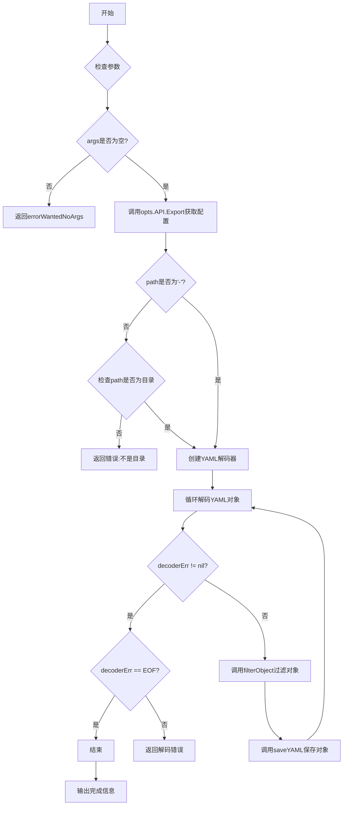
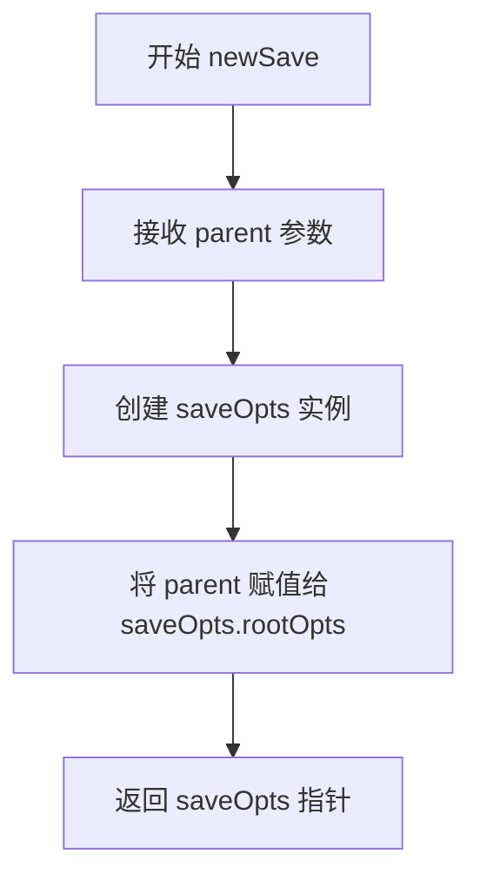
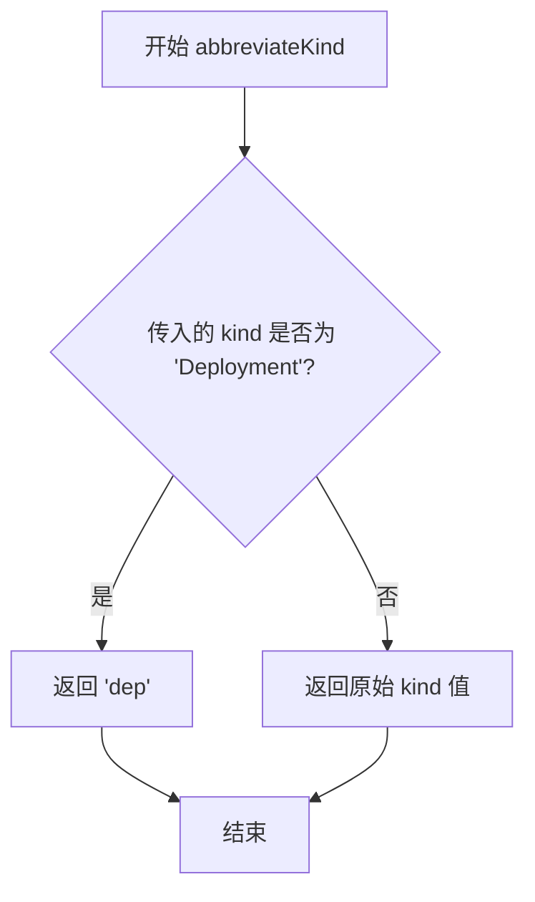
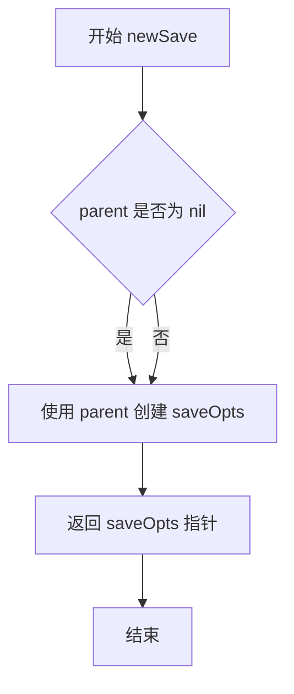
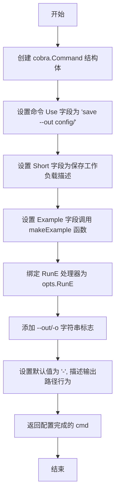

# `flux\cmd\fluxctl\save_cmd.go` 详细设计文档

这是一个 fluxctl CLI 工具的 save 子命令，用于将 Kubernetes 集群中的工作负载定义导出并保存到本地文件系统，采用集群原生的 YAML 格式，支持输出到标准输出或指定目录。

## 整体流程



## 类结构

```
rootOpts (父类)
└── saveOpts (子命令选项)
```

## 全局变量及字段


### `saveOpts`
    
保存命令的选项结构体，包含父选项指针和输出路径

类型：`struct`
    


### `saveObject`
    
用于序列化的资源对象结构体，包含APIVersion、Kind、Metadata和Spec字段

类型：`struct`
    


### `saveOpts.rootOpts`
    
指向父选项的指针，用于访问共享的配置和API

类型：`*rootOpts`
    


### `saveOpts.path`
    
输出路径，'-'表示标准输出，目录路径表示保存到指定目录

类型：`string`
    


### `saveObject.APIVersion`
    
Kubernetes资源的API版本标识

类型：`string`
    


### `saveObject.Kind`
    
Kubernetes资源的类型，如Deployment、Namespace等

类型：`string`
    


### `saveObject.Metadata`
    
资源的元数据，包含Annotations、Labels、Name和Namespace字段

类型：`struct`
    


### `saveObject.Spec`
    
资源的规格配置，以键值对形式存储任意结构

类型：`map[interface{}]interface{}`
    
    

## 全局函数及方法


### `newSave`

该函数用于创建并返回一个 `saveOpts` 结构体实例，初始化时将父级 `rootOpts` 注入到新实例中，作为配置保存功能的入口点。

参数：

- `parent`：`*rootOpts`，指向根配置的指针，用于初始化保存选项的父配置上下文

返回值：`*saveOpts`，返回新创建的保存选项结构体指针

#### 流程图



#### 带注释源码

```go
// newSave 创建一个新的 saveOpts 实例
// parent: 指向 rootOpts 的指针，包含根配置选项
// 返回值: 指向新创建的 saveOpts 结构体的指针
func newSave(parent *rootOpts) *saveOpts {
    // 使用复合字面量创建 saveOpts 结构体
    // 并将 parent 赋值给 saveOpts 的 rootOpts 字段
    return &saveOpts{rootOpts: parent}
}
```


### `filterObject`

移除不应该被版本控制的Kubernetes资源数据，包括特定的annotations（如deployment.kubernetes.io/revision、kubectl.kubernetes.io/last-applied-configuration等）以及嵌套的metadata字段（如creationTimestamp），同时清理空的map值。

参数：

- `object`：`saveObject`，需要过滤的Kubernetes资源对象

返回值：无（`void`），该函数直接修改传入的对象，不返回任何值

#### 流程图

```mermaid
flowchart TD
    A[开始 filterObject] --> B[删除 Metadata.Annotations['deployment.kubernetes.io/revision']]
    B --> C[删除 Metadata.Annotations['kubectl.kubernetes.io/last-applied-configuration']]
    C --> D[删除 Metadata.Annotations['kubernetes.io/change-cause']]
    D --> E{调用 deleteNested}
    E -->|传入 object.Spec<br/>keys: template, metadata, creationTimestamp| F[递归删除嵌套key]
    F --> G{调用 deleteEmptyMapValues}
    G -->|传入 object.Spec| H[递归删除空map值]
    H --> I[结束]
    
    style A fill:#f9f,stroke:#333
    style I fill:#9f9,stroke:#333
```

#### 带注释源码

```go
// Remove any data that should not be version controlled
// 移除不应该被版本控制的数据
// 该函数会修改传入的saveObject对象，删除以下内容：
// 1. 特定的annotations（版本控制不需要的元数据）
// 2. 嵌套的metadata字段（如creationTimestamp）
// 3. 空的map值（减少冗余数据）
func filterObject(object saveObject) {
	// 删除deployment.kubernetes.io/revision注解
	// 这是Kubernetes自动管理的部署版本号，不需要纳入版本控制
	delete(object.Metadata.Annotations, "deployment.kubernetes.io/revision")

	// 删除kubectl.kubernetes.io/last-applied-configuration注解
	// 这是kubectl apply命令自动记录的最近应用配置，会造成冲突
	delete(object.Metadata.Annotations, "kubectl.kubernetes.io/last-applied-configuration")

	// 删除kubernetes.io/change-cause注解
	// 这是记录变更原因的注解，通常由系统自动管理
	delete(object.Metadata.Annotations, "kubernetes.io/change-cause")

	// 删除Spec.template.metadata.creationTimestamp
	// 这是资源创建时自动生成的时间戳，版本控制时应该忽略
	deleteNested(object.Spec, "template", "metadata", "creationTimestamp")

	// 删除所有空的map值
	// 清理空的map和slice，减少输出冗余
	deleteEmptyMapValues(object.Spec)
}
```


### `deleteNested`

该函数用于递归遍历嵌套的 `map[interface{}]interface{}` 结构，根据传入的可变参数 `keys`（键路径）在深层次中删除指定的键。例如，要删除 `spec.template.metadata.creationTimestamp` 时，会依次深入每一层map直到找到目标键并删除。

参数：

- `m`：`map[interface{}] interface{}`，要进行键值删除操作的嵌套 map 结构
- `keys ...string`：可变字符串参数，表示要删除的键的路径列表（如 `["template", "metadata", "creationTimestamp"]`）

返回值：无（`void`）

#### 流程图

```mermaid
flowchart TD
    A[开始 deleteNested] --> B{keys 长度是否为 0?}
    B -- 是 --> C[直接返回]
    B -- 否 --> D{keys 长度是否为 1?}
    D -- 是 --> E[从 map m 中删除 keys[0]]
    E --> C
    D -- 否 --> F{m[keys[0]] 是否为 map?}
    F -- 否 --> C
    F -- 是 --> G[获取子 map v = m[keys[0]]
    H[递归调用 deleteNested v, keys[1:]]
    H --> C
```

#### 带注释源码

```go
// deleteNested 递归遍历嵌套 maps 根据传入的 keys 路径删除指定的键
// 参数 m: 顶层 map[interface{}]interface{} 结构
// 参数 keys: 可变参数，表示要删除的键的路径，例如 ["template", "metadata", "creationTimestamp"]
func deleteNested(m map[interface{}] interface{}, keys ...string) {
	// 判断是否还有需要处理的键
	switch len(keys) {
	case 0:
		// 没有任何键需要处理，直接返回
		return
	case 1:
		// 只有一个键，直接从当前 map 中删除该键
		delete(m, keys[0])
	default:
		// 有多个键，需要递归深入到下一层 map
		// 先获取第一个键对应的值，并判断是否为 map 类型
		if v, ok := m[keys[0]].(map[interface{}] interface{}); ok {
			// 值为 map 类型，递归调用 deleteNested 处理剩余的键
			// 传入子 map 和剩余的键列表（去掉第一个键）
			deleteNested(v, keys[1:]...)
		}
		// 如果值不是 map 类型，则不做任何处理
	}
}
```


### `deleteEmptyMapValues`

递归删除map和slice中的空值（空map、空slice、nil），用于清理不需要保存的配置文件数据。

参数：

-  `i`：`interface{}`，任意类型的输入值，可以是map、slice、nil或其他类型

返回值：`bool`，如果输入值为空（空map、空slice或nil）则返回true，否则返回false

#### 流程图

```mermaid
flowchart TD
    A[开始 deleteEmptyMapValues] --> B{参数类型判断 i.(type)}
    B -->|map[interface{}]interface{}| C{map长度为0?}
    B -->|[]interface{}| D{slice长度为0?}
    B -->|nil| E[返回 true]
    B -->|其他类型| F[返回 false]
    
    C -->|是| G[返回 true]
    C -->|否| H[遍历map的键值对 for k, v := range i]
    H --> I{递归调用 deleteEmptyMapValues(v)}
    I -->|返回true| J[delete(i, k) 删除空键值对]
    I -->|返回false| K[继续下一个键值对]
    J --> K
    K --> L[处理完成，返回 false]
    
    D -->|是| M[返回 true]
    D -->|否| N[遍历slice元素 for _, e := range i]
    N --> O[递归调用 deleteEmptyMapValues(e)]
    O --> P[返回 false]
```

#### 带注释源码

```go
// Recursively delete map keys with empty values
// 递归删除map中值为空的键值对
// 参数: i interface{} - 任意类型的输入值
// 返回值: bool - 表示该值是否为空（应被删除）
func deleteEmptyMapValues(i interface{}) bool {
	// 使用类型switch判断输入参数的实际类型
	switch i := i.(type) {
	// 如果是map类型
	case map[interface{}]interface{}:
		// 如果map为空，返回true表示应该删除这个空map
		if len(i) == 0 {
			return true
		} else {
			// 遍历map中的所有键值对
			for k, v := range i {
				// 递归检查值是否为空
				if deleteEmptyMapValues(v) {
					// 如果值为空，则从map中删除该键
					delete(i, k)
				}
			}
		}
	// 如果是slice/数组类型
	case []interface{}:
		// 如果slice为空，返回true
		if len(i) == 0 {
			return true
		} else {
			// 遍历slice中的每个元素
			for _, e := range i {
				// 递归检查元素是否为空（但不直接使用返回值，因为slice长度不能改变）
				deleteEmptyMapValues(e)
			}
		}
	// 如果是nil空值，返回true
	case nil:
		return true
	}
	// 对于非空map、slice或其他有实际内容的类型，返回false表示不应删除
	return false
}
```


### `outputFile`

该函数根据保存对象的类型（Namespace 或其他资源）生成对应的文件名和路径，若为非 Namespace 资源则创建对应的命名空间目录，并返回最终的文件路径供调用者写入 YAML 内容。

参数：

- `stdout`：`io.Writer`，用于输出保存信息的标准输出写入器
- `object`：`saveObject`，包含资源的元数据（Kind、Metadata.Name、Metadata.Namespace）用于生成文件名
- `out`：`string`，输出目录路径

返回值：

- `string`，生成的文件路径（相对于输出目录）
- `error`，创建目录失败时返回错误

#### 流程图

```mermaid
flowchart TD
    A[开始 outputFile] --> B{object.Kind == Namespace?}
    B -->|Yes| C[生成文件名: {name}-ns.yaml]
    B -->|No| D[获取 namespace 作为目录名]
    D --> E[创建目录: out/namespace]
    E --> F{目录创建成功?}
    F -->|No| G[返回错误]
    F -->|Yes| H[缩写 Kind 类型]
    I[生成文件名: {name}-{shortKind}.yaml]
    C --> J
    I --> J
    J --> K[拼接完整路径: out/filename]
    K --> L[输出保存信息到 stdout]
    M[返回路径和 nil]
    G --> M
    L --> M
```

#### 带注释源码

```go
// outputFile 根据 saveObject 的类型生成对应的文件路径
// stdout 用于输出保存信息（如 "Saving Deployment 'my-app' to my-app-dep.yaml"）
// object 包含资源的元数据信息
// out 是输出目录路径
func outputFile(stdout io.Writer, object saveObject, out string) (string, error) {
	var path string
	
	// 判断是否为 Namespace 资源
	if object.Kind == "Namespace" {
		// Namespace 类型特殊处理，生成 {name}-ns.yaml 格式的文件名
		path = fmt.Sprintf("%s-ns.yaml", object.Metadata.Name)
	} else {
		// 非 Namespace 资源，使用命名空间作为子目录
		dir := object.Metadata.Namespace
		
		// 创建命名空间目录（如果不存在）
		// os.ModePerm 设置为 0777 权限
		if err := os.MkdirAll(filepath.Join(out, dir), os.ModePerm); err != nil {
			// 目录创建失败时返回包装后的错误
			return "", errors.Wrap(err, "making directory for namespace")
		}

		// 对资源类型进行缩写（如 Deployment -> dep）
		shortKind := abbreviateKind(object.Kind)
		
		// 生成文件名格式: {name}-{shortKind}.yaml
		// 例如: myapp-deployment.yaml -> myapp-dep.yaml
		path = filepath.Join(dir, fmt.Sprintf("%s-%s.yaml", object.Metadata.Name, shortKind))
	}

	// 拼接完整的输出路径
	path = filepath.Join(out, path)
	
	// 输出保存信息到 stdout，供用户了解文件保存位置
	fmt.Fprintf(stdout, "Saving %s '%s' to %s\n", object.Kind, object.Metadata.Name, path)
	
	// 返回生成的文件路径，错误为 nil
	return path, nil
}
```


### `saveYAML`

将保存的对象（saveObject）序列化为 YAML 格式，并根据输出路径参数（out）将结果输出到标准输出或写入到指定的目录文件中。

参数：

- `stdout`：`io.Writer`，用于输出日志信息的写入器
- `object`：`saveObject`，包含待序列化的 Kubernetes 资源对象数据
- `out`：`string`，输出路径；"-" 表示标准输出，其他字符串表示目录路径

返回值：`error`，如果序列化或写入过程中发生错误则返回错误信息，否则返回 nil

#### 流程图

```mermaid
flowchart TD
    A[开始 saveYAML] --> B[使用 yaml.Marshal 序列化 object]
    B --> C{序列化是否成功?}
    C -->|是| D[创建 buf]
    C -->|否| E[返回错误: marshalling yaml]
    D --> F{out == "-"?}
    F -->|是| G[输出到标准输出]
    G --> H[打印 --- 分隔符]
    H --> I[写入 YAML 内容]
    I --> J[返回 nil]
    F -->|否| K[调用 outputFile 获取文件路径]
    K --> L{获取路径是否成功?}
    L -->|否| M[返回错误]
    L -->|是| N[创建文件]
    N --> O{文件创建是否成功?}
    O -->|否| P[返回错误: creating yaml file]
    O -->|是| Q[写入 --- 分隔符]
    Q --> R[写入 YAML 内容到文件]
    R --> S{写入是否成功?}
    S -->|否| T[返回错误: writing yaml file]
    S -->|是| U[关闭文件]
    U --> J
```

#### 带注释源码

```go
// Save YAML to directory structure
// saveYAML 将 saveObject 序列化为 YAML 并输出到指定位置
// 参数 stdout 用于输出操作日志（如保存文件的路径信息）
// 参数 object 是待序列化的资源对象
// 参数 out 为 "-" 时输出到 stdout，否则输出到指定目录
func saveYAML(stdout io.Writer, object saveObject, out string) error {
	// 将对象序列化为 YAML 格式
	buf, err := yaml.Marshal(object)
	if err != nil {
		// 序列化失败时包装错误并返回
		return errors.Wrap(err, "marshalling yaml")
	}

	// 判断输出目标：标准输出或文件
	// to stdout
	if out == "-" {
		// 输出 YAML 文档分隔符
		fmt.Fprintln(stdout, "---")
		// 输出 YAML 内容到标准输出
		fmt.Fprint(stdout, string(buf))
		return nil
	}

	// to a directory
	// 根据对象元数据生成文件名和路径
	path, err := outputFile(stdout, object, out)
	if err != nil {
		// 生成路径失败时返回错误
		return err
	}

	// 创建目标文件
	file, err := os.Create(path)
	if err != nil {
		// 文件创建失败时包装错误并返回
		return errors.Wrap(err, "creating yaml file")
	}
	// 确保函数返回前关闭文件
	defer file.Close()

	// We prepend a document separator, because it helps when files
	// are cat'd together, and is otherwise harmless.
	// 写入 YAML 文档分隔符，便于多个文件合并
	fmt.Fprintln(file, "---")
	// 将序列化后的 YAML 内容写入文件
	if _, err := file.Write(buf); err != nil {
		// 写入失败时包装错误并返回
		return errors.Wrap(err, "writing yaml file")
	}

	return nil
}
```


### `abbreviateKind`

该函数用于将 Kubernetes 资源类型名称转换为其缩写形式，目前仅支持将 "Deployment" 缩写成 "dep"，其他类型则原样返回。

参数：

- `kind`：`string`，Kubernetes 资源的类型名称（如 Deployment、Service、ConfigMap 等）

返回值：`string`，资源的缩写形式（如 "dep"），若不存在对应缩写则返回原始名称

#### 流程图



#### 带注释源码

```go
// abbreviateKind 将 Kubernetes 资源类型名称转换为缩写形式
// 参数 kind: 资源类型名称，如 "Deployment"
// 返回值: 缩写形式，如 "dep"，未知类型则返回原值
func abbreviateKind(kind string) string {
	switch kind {
	case "Deployment":
		// 已知类型：Deployment 缩写成 dep
		return "dep"
	default:
		// 其他未知类型直接返回原名称
		return kind
	}
}
```

---

### 上下文信息

#### 在文件中的角色

该函数位于 `save.go` 文件中，被 `outputFile` 函数调用，用于生成文件名时使用缩写的资源类型。例如，名为 "myapp" 的 Deployment 会生成文件名 `myapp-dep.yaml`。

#### 潜在的技术债务或优化空间

1. **扩展性不足**：当前仅支持 "Deployment" 一种类型的缩写，随着项目发展可能需要支持更多类型（如 Service->svc、ConfigMap->cm、Namespace->ns 等），建议使用映射表或配置方式扩展。
2. **硬编码逻辑**：缩写规则直接写在 switch 语句中，新增类型需修改源码，可考虑抽离为配置或枚举。

#### 其它项目

- **设计目标**：简化文件名长度，提高可读性，符合 Kubernetes 社区常见的资源缩写约定。
- **错误处理**：本函数不涉及错误返回，传入任何字符串均能返回有效结果。
- **外部依赖**：无外部依赖，仅使用 Go 内置的 string 类型。


### `newSave`

这是一个构造函数，用于创建并初始化 `saveOpts` 实例，将父级 `rootOpts` 注入到新实例中。

参数：

- `parent`：`*rootOpts`，父选项对象，包含根配置信息

返回值：`*saveOpts`，返回新创建的 `saveOpts` 实例指针

#### 流程图



#### 带注释源码

```go
// newSave 是一个构造函数，用于创建并初始化 saveOpts 实例
// 参数 parent: 指向 rootOpts 的指针，包含全局配置信息
// 返回值: 指向新创建的 saveOpts 结构体的指针
func newSave(parent *rootOpts) *saveOpts {
    // 分配一个新的 saveOpts 结构体内存，并将 parent 作为其 rootOpts 字段
    // 这里利用了 Go 语言的组合特性，saveOpts 嵌入了 *rootOpts
    return &saveOpts{rootOpts: parent}
}
```


### saveOpts.Command

该方法创建并配置一个用于将集群工作负载定义保存到本地文件的 Cobra 命令，定义了命令的使用方式、简短描述、示例以及运行逻辑，并绑定了输出路径标志。

参数：

- 该方法无显式参数（方法接受者为 `opts *saveOpts` 指针）

返回值：`*cobra.Command`，返回一个配置完整的 Cobra 命令对象，用于执行保存工作负载定义的操作

#### 流程图



#### 带注释源码

```go
// Command 创建一个用于保存工作负载定义的 Cobra 命令
// 该命令将集群中的资源导出为 YAML 格式并保存到文件或 stdout
func (opts *saveOpts) Command() *cobra.Command {
    // 初始化 cobra.Command 结构，定义命令的基本属性
    cmd := &cobra.Command{
        // Use 定义命令的使用语法，包含 --out 参数示例
        Use:   "save --out config/",
        // Short 提供命令的简短描述
        Short: "Save workload definitions to local files in cluster-native format",
        // Example 展示命令的使用示例
        Example: makeExample(
            "fluxctl save",
        ),
        // RunE 指定命令执行时的处理函数，委托给 opts.RunE 方法
        RunE: opts.RunE,
    }
    
    // 绑定命令行标志 --out/-o，用于指定输出路径
    // 默认值 "-" 表示输出到 stdout
    // 如果指定目录，则每个资源对象保存为该目录下的独立文件
    cmd.Flags().StringVarP(&opts.path, "out", "o", "-", "Output path for exported config; the default. '-' indicates stdout; if a directory is given, each item will be saved in a file under the directory")
    
    // 返回配置完成的命令对象
    return cmd
}
```


### `saveOpts.RunE`

该方法是 `saveOpts` 类的核心执行函数，负责将 Kubernetes 工作负载定义从集群导出并保存到本地 YAML 文件或标准输出，同时过滤掉不需要保存的字段（如状态信息和特定注解）。

参数：

- `cmd`：`cobra.Command`，Cobra 命令对象，提供命令上下文和输出流
- `args`：`[]string`，命令行剩余参数列表

返回值：`error`，执行过程中出现的错误，若成功则返回 nil

#### 流程图

```mermaid
flowchart TD
    A[Start RunE] --> B{args长度 > 0?}
    B -->|Yes| C[返回errorWantedNoArgs]
    B -->|No| D[创建context.Background]
    E[调用opts.API.Export导出配置] --> F{err != nil?}
    F -->|Yes| G[返回wrapped error: exporting config]
    F -->|No| H{opts.path != "-"}
    H -->|No| I[解码YAML并处理对象]
    H -->|Yes| J{检查path是否为目录}
    J -->|os.Stat错误| K[返回错误]
    J -->|不是目录| L[返回path不是目录的错误]
    J -->|是目录| I
    I --> M[创建YAML Decoder]
    M --> N{decoder.Decode}
    N -->|成功| O[调用filterObject过滤对象]
    O --> P[调用saveYAML保存对象]
    P -->|成功| Q[继续循环]
    N -->|decoderErr != nil| R{decoderErr == io.EOF?}
    R -->|Yes| S[End: 返回nil]
    R -->|No| T[返回unmarshalling错误]
    Q --> M
```

#### 带注释源码

```go
// RunE 是 saveOpts 的核心执行方法，负责导出集群配置并保存为 YAML 文件
// 参数 cmd 提供命令上下文，args 为额外命令行参数
// 返回 error 类型，失败时返回具体错误信息
func (opts *saveOpts) RunE(cmd *cobra.Command, args []string) error {
    // 检查是否提供了多余的参数，本命令不接受任何位置参数
    if len(args) > 0 {
        return errorWantedNoArgs
    }

    // 创建默认的上下文，用于 API 调用
    ctx := context.Background()

    // 调用 API 的 Export 方法获取集群配置，返回 YAML 格式的字节切片
    config, err := opts.API.Export(ctx)
    if err != nil {
        // 包装错误信息，标识在导出配置阶段失败
        return errors.Wrap(err, "exporting config")
    }

    // 如果输出路径不是标准输出（"-"），则验证路径是否为有效目录
    if opts.path != "-" {
        // 检查提供的路径状态
        if info, err := os.Stat(opts.path); err != nil {
            return err // 返回文件系统错误
        } else if !info.IsDir() {
            // 路径存在但不是目录时返回明确错误
            return fmt.Errorf("path %s is not a directory", opts.path)
        }
    }

    // 使用字节读取器和配置数据创建 YAML 解码器
    decoder := yaml.NewDecoder(bytes.NewReader(config))

    var decoderErr error
    // 循环解码每个 Kubernetes 对象
    for {
        var object saveObject
        // 解码过程中会过滤掉大多数不需要的字段
        if decoderErr = decoder.Decode(&object); decoderErr != nil {
            break // 解码错误或结束，退出循环
        }

        // 过滤剩余的不需要保存的键（如注解和嵌套字段）
        filterObject(object)

        // 将过滤后的对象保存为 YAML
        if err := saveYAML(cmd.OutOrStdout(), object, opts.path); err != nil {
            return errors.Wrap(err, "saving yaml object")
        }
    }

    // 检查是否为正常的文件结束（io.EOF），否则返回解析错误
    if decoderErr != io.EOF {
        return errors.Wrap(err, "unmarshalling exported yaml")
    }

    return nil // 成功完成，返回 nil
}
```

### 关键组件信息

| 组件名称 | 一句话描述 |
|---------|-----------|
| `saveOpts` | 命令选项结构体，包含根选项和输出路径配置 |
| `saveObject` | 用于接收导出数据的结构体，仅包含需要持久化的字段 |
| `filterObject` | 过滤函数，删除不需要版本控制的注解和嵌套字段 |
| `deleteNested` | 递归删除嵌套 map 中指定键的工具函数 |
| `deleteEmptyMapValues` | 递归清理空 map 和空数组的工具函数 |
| `outputFile` | 根据对象类型和元数据确定输出文件路径和名称 |
| `saveYAML` | 将对象序列化并写入文件或标准输出的核心函数 |
| `abbreviateKind` | 将资源类型缩写为简短形式（如 Deployment → dep） |

### 潜在技术债务与优化空间

1. **错误处理不一致**：`outputFile` 中的 `os.MkdirAll` 错误被包装，但其他一些错误（如 `os.Stat`）直接返回未包装
2. **硬编码过滤字段**：过滤的注解键名硬编码在 `filterObject` 中，可考虑配置化
3. **文件权限风险**：`os.ModePerm` 使用过于宽松，应使用更安全的默认权限（如 0755）
4. **重复文件写入**：`saveYAML` 中每次都创建新文件，可考虑批量写入优化
5. **类型断言风险**：`deleteNested` 和 `deleteEmptyMapValues` 使用 `interface{}` 类型，存在运行时 panic 风险

### 其它设计说明

- **设计目标**：将集群内的工作负载定义以 Kubernetes 原生格式（YAML）导出到本地，支持目录结构化存储或标准输出
- **约束**：不保存 status、metadata.uid 等运行时生成字段，不保存特定系统注解
- **错误处理**：使用 `github.com/pkg/errors` 进行错误包装，提供上下文信息；区分正常 EOF 和解码错误
- **数据流**：API Export → YAML Decoder → Object Filter → YAML Marshal → File/Stdout

## 关键组件


### saveOpts 结构体

保存命令的选项配置，包含父级rootOpts和输出路径path字段，用于管理save命令的执行参数。

### saveObject 结构体

Kubernetes对象的精简结构体，仅包含APIVersion、Kind、Metadata和Spec字段，用于在保存时过滤掉不必要的内容（如status、metadata.uid等）。

### RunE 方法

save命令的核心执行逻辑，负责从API导出配置、遍历解码YAML、过滤对象并保存到指定位置，支持输出到stdout或目录。

### filterObject 函数

过滤函数，移除不应版本控制的字段，包括特定注解（revision、last-applied-configuration、change-cause）和嵌套的creationTimestamp时间戳字段。

### deleteNested 函数

递归删除嵌套Map中指定键的工具函数，支持通过可变参数keys逐层深入Map结构并删除目标键。

### deleteEmptyMapValues 函数

递归清理函数，遍历Map和Slice结构，删除空值（空Map、空Slice、nil值），保持保存的YAML文件整洁。

### outputFile 函数

输出路径计算函数，根据对象类型（Namespace或其他）确定文件名格式，Namespace生成ns.yaml，其他资源按namespace/名称-缩写kind.yaml格式保存。

### saveYAML 函数

YAML序列化与写入函数，负责将对象Marshal为YAML格式，支持直接输出到stdout或按目录结构创建文件并写入。

### abbreviateKind 函数

资源类型缩写函数，将完整的资源类型名称简化为短格式，如Deployment转换为dep，便于生成更简洁的文件名。


## 问题及建议


### 已知问题

-   **filterObject函数使用值传递而非指针**：`filterObject(object)`传递的是结构体值，删除操作不会生效，实际过滤逻辑无效
-   **路径拼接错误**：在`outputFile`函数中，path已经包含out路径，后面又执行`path = filepath.Join(out, path)`导致路径重复
- **deleteNested函数类型限制**：只支持`map[interface{}]interface{}`类型，无法处理常见的`map[string]interface{}`类型
- **权限安全问题**：使用`os.ModePerm`(0777)创建目录存在安全风险，应使用更严格的权限
- **错误处理不一致**：部分错误使用`errors.Wrap`，部分直接返回原始error
- **Kind缩写覆盖不全**：仅支持"Deployment"的缩写，其他常见资源类型如Service、ConfigMap、StatefulSet等未处理
- **decoderErr变量作用域问题**：变量声明在外层但赋值在循环内，逻辑不够清晰
- **未处理空对象情况**：解码过程中如果object为空或无效，仍会尝试保存

### 优化建议

-   将`filterObject`参数改为指针类型`filterObject(object *saveObject)`以确保修改生效
-   修复`outputFile`中的路径拼接逻辑，避免重复
-   添加对`map[string]interface{}`类型的处理支持
-   使用更安全的目录权限如0755
-   统一错误包装风格，使用`errors.Wrap`处理所有错误
-   扩展`abbreviateKind`函数支持更多资源类型
-   在循环中添加对空对象的校验和过滤
-   考虑使用`yaml.v3`版本以获得更好的类型支持和性能

## 其它


### 设计目标与约束

本代码的设计目标是提供一个命令行工具（`fluxctl save`），将Kubernetes集群中的工作负载定义导出并保存为本地YAML文件，同时过滤掉不应纳入版本控制的字段（如status、metadata.uid、时间戳等）。主要约束包括：输出格式为cluster-native的YAML；支持输出到stdout（默认）或指定目录；每个资源对象保存为单独文件，文件名格式为`<namespace>/<name>-<kind缩写>.yaml`；Namespace资源保存为`<name>-ns.yaml`；必须过滤特定annotations和空值map。

### 错误处理与异常设计

错误处理采用Go的错误传播模式，使用`github.com/pkg/errors`包进行错误封装和堆栈信息保留。RunE方法返回error类型错误，供cobra框架处理。主要错误场景包括：参数校验错误（多余的args返回errorWantedNoArgs）；路径校验错误（输出路径非目录）；文件操作错误（创建目录、创建文件失败）；YAML解析错误（解码、编码失败）。decoderErr在循环结束后检查，非EOF错误表示解析失败。

### 数据流与状态机

数据流如下：
1. 解析命令行参数，获取输出路径（path）
2. 调用opts.API.Export(ctx)从集群导出配置，获取原始YAML数据
3. 校验输出路径（若非"-"，则验证是否为目录）
4. 创建YAML解码器，逐个解码资源对象
5. 对每个对象执行filterObject()过滤不应保存的字段
6. 调用saveYAML()保存对象到文件或stdout
7. 循环直到decoderErr为io.EOF

无复杂状态机，仅有从输入到输出的线性数据流。

### 外部依赖与接口契约

外部依赖包括：
- `github.com/spf13/cobra`：CLI框架，提供命令定义和参数解析
- `gopkg.in/yaml.v2`：YAML编解码
- `github.com/pkg/errors`：错误包装
- `github.com/kubernetes-sigs/yaml`：可能用于处理Kubernetes YAML（代码中未直接使用，但项目可能有）
- `rootOpts`和`API`：隐式依赖，需实现Export(ctx context.Context) ([]byte, error)方法

接口契约：
- rootOpts需提供API字段，该字段需有Export(ctx context.Context) ([]byte, error)方法
- 输出路径为"-"时输出到stdout，否则输出到目录
- YAML格式符合Kubernetes资源规范

### 性能考虑

- 使用流式解码（yaml.NewDecoder），避免一次性加载整个配置到内存
- 逐个对象处理和保存，内存占用可控
- 使用defer确保文件句柄关闭
- 可能的优化点：大集群场景下可能需要并发处理多个对象

### 安全性考虑

- 过滤了kubectl.kubernetes.io/last-applied-configuration等敏感注解
- 删除空值map减少输出文件大小
- 文件权限使用os.ModePerm（0777），实际可能需要更严格的权限

### 测试考量

建议测试场景：
- 输出到stdout（默认）
- 输出到不存在的目录
- 输出到已存在且有权限的目录
- 输出到文件而非目录
- 空配置导出
- 包含各种Kubernetes资源类型（Deployment、Service、ConfigMap等）
- 包含应被过滤的annotations和字段的资源

### 配置与扩展性

代码结构支持扩展：
- 可在filterObject()中添加更多过滤规则
- 可在abbreviateKind()中添加更多资源类型缩写
- saveObject结构体可扩展以支持更多字段
- 输出文件名格式可通过修改outputFile()调整
</content>
    