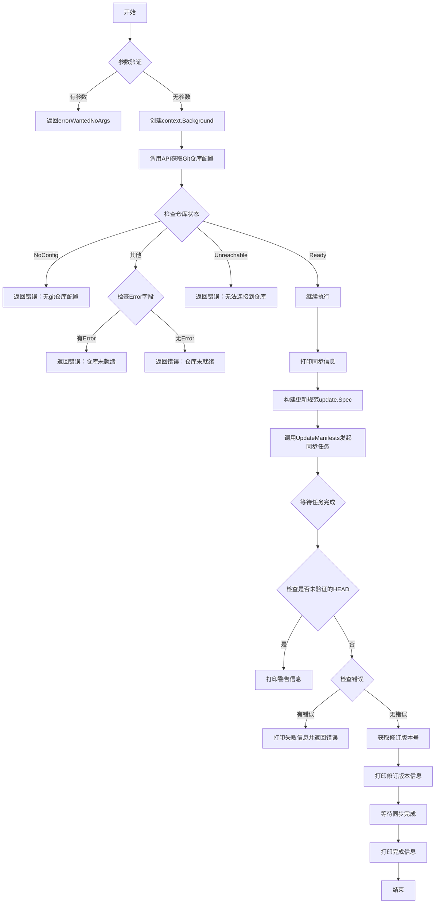
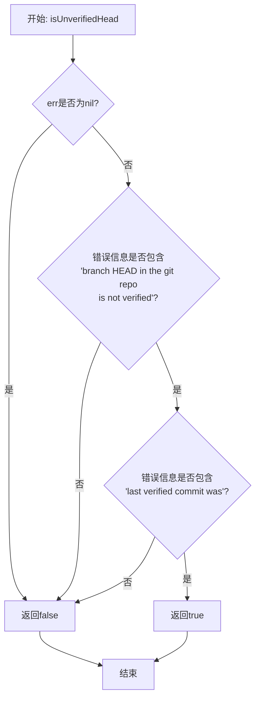
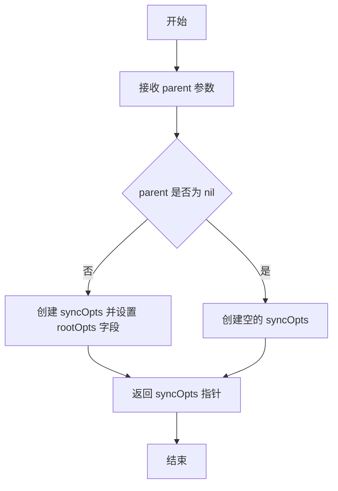
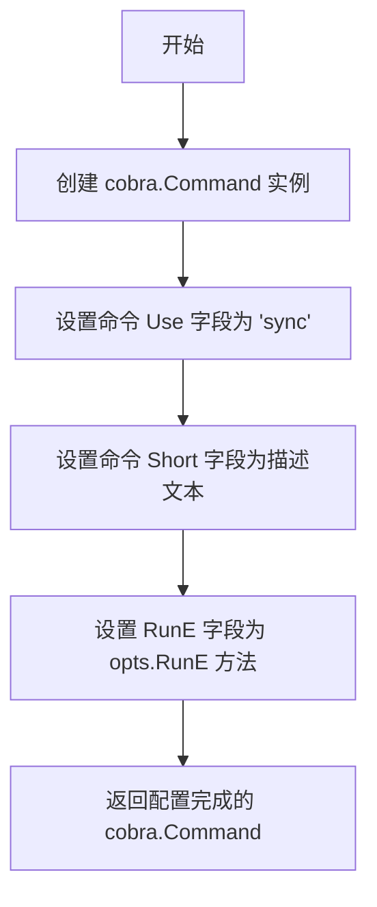

# `flux\cmd\fluxctl\sync_cmd.go` 详细设计文档

这是FluxCD项目中的一个CLI命令模块，提供了sync子命令，用于将Kubernetes集群与Git仓库进行同步。该命令通过调用Flux API获取Git仓库配置，检查仓库状态，然后发起同步任务并等待完成。

## 整体流程



## 类结构

```
rootOpts (根选项结构体)
└── syncOpts (同步命令选项结构体)
```

## 全局变量及字段


### `isUnverifiedHead`
    
检查错误是否表示git仓库的HEAD未验证

类型：`func(error) bool`
    


### `syncOpts.rootOpts`
    
指向根选项的指针

类型：`*rootOpts`
    
    

## 全局函数及方法


### `isUnverifiedHead`

该函数用于判断传入的错误对象是否为Git仓库中HEAD提交未验证的错误，通过检查错误信息中是否同时包含"branch HEAD in the git repo is not verified"和"last verified commit was"这两个特定字符串来识别此类错误场景，通常用于在同步操作中向用户发出警告而非直接失败。

参数：

- `err`：`error`，需要进行检查的错误对象

返回值：`bool`，如果错误信息中包含未验证HEAD的相关描述则返回true，否则返回false

#### 流程图



#### 带注释源码

```go
// isUnverifiedHead 检查给定的错误是否为Git仓库HEAD未验证的错误
// 参数 err: 需要进行检查的错误对象
// 返回值: bool - 如果错误表示HEAD提交未验证则返回true
func isUnverifiedHead(err error) bool {
	// 首先检查err是否为nil，如果是nil则直接返回false
	// 因为nil错误不可能是未验证HEAD的错误
	return err != nil &&
		// 检查错误信息中是否包含第一个关键字符串
		// 这个字符串表明HEAD未通过验证
		(strings.Contains(err.Error(), "branch HEAD in the git repo is not verified") &&
			// 同时检查错误信息中是否包含第二个关键字符串
			// 这个字符串表明存在已验证的提交记录
			strings.Contains(err.Error(), "last verified commit was"))
}
```


### `syncOpts.newSync`

这是一个构造函数，用于创建并初始化 `syncOpts` 结构体实例，将父级 `rootOpts` 注入到新创建的结构体中，作为同步操作的配置选项。

参数：

- `parent`：`*rootOpts`，指向父级 rootOpts 的指针，提供命令行根选项配置（如 API 客户端连接、超时设置等）

返回值：`*syncOpts`，返回指向新创建的 syncOpts 结构体的指针，该结构体包含了父级配置选项，可用于后续的同步命令构建和执行

#### 流程图



#### 带注释源码

```go
// newSync 是一个构造函数，用于创建并初始化 syncOpts 结构体实例
// 参数 parent: 指向 rootOpts 的指针，包含命令行根选项配置（如 API 客户端、超时设置等）
// 返回值: 返回指向新创建的 syncOpts 结构体的指针
func newSync(parent *rootOpts) *syncOpts {
    // 创建一个新的 syncOpts 结构体，并将 parent 的地址赋值给其 rootOpts 字段
    // 这样 syncOpts 就可以访问根选项中定义的配置和方法
    return &syncOpts{rootOpts: parent}
}
```


### `syncOpts.Command`

该方法用于创建并返回一个 Cobra 命令对象，该命令用于将 Kubernetes 集群与 Git 仓库进行同步。它设置了命令的基本信息（如使用方式、简短描述）并将实际的执行逻辑委托给 `RunE` 方法。

参数：

- 该方法无显式参数（接收者 `opts *syncOpts` 为隐式参数）

返回值：`*cobra.Command`，返回配置好的 Cobra 命令对象，用于执行集群与 Git 仓库的同步操作

#### 流程图



#### 带注释源码

```go
// Command 创建一个用于同步集群与 Git 仓库的 cobra 命令
// 返回一个配置好的 *cobra.Command 实例
func (opts *syncOpts) Command() *cobra.Command {
    // 初始化 cobra.Command 结构体
    cmd := &cobra.Command{
        Use:   "sync", // 命令名称
        Short: "Synchronize the cluster with the git repository, now", // 命令简短描述
        RunE:  opts.RunE, // 绑定实际执行逻辑到 RunE 方法
    }
    return cmd // 返回配置完成的命令
}
```


### `syncOpts.RunE`

该方法是 Flux CLI 中同步命令的执行函数，用于将 Kubernetes 集群与 Git 仓库进行同步。执行流程包括：验证 Git 仓库配置状态、创建同步任务、等待任务完成并获取修订版本号、最后等待该修订版本应用到集群。

参数：

- `cmd`：`*cobra.Command`，Cobra 命令对象，用于获取输出流和配置信息
- `args`：`[]string`，从命令行传入的参数列表

返回值：`error`，如果执行过程中出现任何错误则返回具体错误信息，否则返回 `nil`

#### 流程图

```mermaid
flowchart TD
    A[开始 RunE] --> B{args长度 > 0?}
    B -->|是| C[return errorWantedNoArgs]
    B -->|否| D[创建context.Background]
    D --> E[调用 opts.API.GitRepoConfig]
    E --> F{gitConfig.Status}
    F -->|RepoNoConfig| G[return 错误: 未配置Git仓库]
    F -->|RepoReady| H[继续执行]
    F -->|RepoUnreachable| I[return 错误: 无法连接仓库]
    F -->|default| J{gitConfig.Error非空?}
    J -->|是| K[return 错误: 仓库未就绪]
    J -->|否| L[return 错误: 仓库未就绪]
    
    H --> M[打印同步信息到stderr]
    N[创建 update.Spec: Type=Sync] --> O[调用 opts.API.UpdateManifests]
    O --> P{err != nil?}
    P -->|是| Q[return err]
    P -->|否| R[调用 awaitJob 等待任务]
    R --> S{isUnverifiedHead(err)?}
    S -->|是| T[打印警告到stderr]
    S -->|否| U{err != nil?}
    U -->|是| V[打印失败信息, return err]
    U -->|否| W[获取 result.Revision 前7位]
    W --> X[打印修订版本信息]
    X --> Y[调用 awaitSync 等待同步]
    Y --> Z{err != nil?}
    Z -->|是| AA[return err]
    Z -->|否| BB[打印Done.到stderr]
    BB --> CC[return nil]
```

#### 带注释源码

```go
// RunE 是同步命令的执行函数，实现将集群与Git仓库同步
// 参数:
//   - cmd: *cobra.Command, Cobra命令对象，用于获取输出流
//   - args: []string, 命令行参数
// 返回值: error, 执行过程中的错误信息
func (opts *syncOpts) RunE(cmd *cobra.Command, args []string) error {
	// 检查是否有额外的参数传入（该命令不接受任何参数）
	if len(args) > 0 {
		return errorWantedNoArgs
	}

	// 创建默认的上下文对象
	ctx := context.Background()

	// 获取Git仓库配置信息（包含状态、远程地址等）
	gitConfig, err := opts.API.GitRepoConfig(ctx, false)
	if err != nil {
		return err
	}

	// 根据Git仓库的不同状态进行相应的错误处理
	switch gitConfig.Status {
	case git.RepoNoConfig:
		// 仓库未配置Git仓库
		return fmt.Errorf("no git repository is configured")
	case git.RepoReady:
		// 仓库已就绪，继续执行
		break
	case git.RepoUnreachable:
		// 仓库不可达，返回详细错误信息
		return fmt.Errorf("can not connect to git repository with URL %s\n\nFull error message: %v", gitConfig.Remote.URL, gitConfig.Error)
	default:
		// 其他未知状态，检查Error字段是否有额外信息
		if gitConfig.Error != "" {
			return fmt.Errorf("git repository %s is not ready to sync\n\nFull error message: %v", gitConfig.Remote.URL, gitConfig.Error)
		}
		return fmt.Errorf("git repository %s is not ready to sync", gitConfig.Remote.URL)
	}

	// 打印同步开始的提示信息到标准错误流
	fmt.Fprintf(cmd.OutOrStderr(), "Synchronizing with %s\n", gitConfig.Remote.URL)

	// 构建同步更新规范（类型为手动同步）
	updateSpec := update.Spec{
		Type: update.Sync,
		Spec: update.ManualSync{},
	}
	
	// 调用API创建同步任务，获取任务ID
	jobID, err := opts.API.UpdateManifests(ctx, updateSpec)
	if err != nil {
		return err
	}
	
	// 等待同步任务完成，获取执行结果
	result, err := awaitJob(ctx, opts.API, jobID, opts.Timeout)
	
	// 检查是否为未验证的HEAD提交错误
	if isUnverifiedHead(err) {
		// 打印警告信息但继续执行
		fmt.Fprintf(cmd.OutOrStderr(), "Warning: %s\n", err)
	} else if err != nil {
		// 其他错误，打印失败信息并返回错误
		fmt.Fprintf(cmd.OutOrStderr(), "Failed to complete sync job (ID %q)\n", jobID)
		return err
	}

	// 获取修订版本号并截取前7位（短哈希）
	rev := result.Revision[:7]
	
	// 打印将要应用的修订版本信息
	fmt.Fprintf(cmd.OutOrStderr(), "Revision of %s to apply is %s\n", gitConfig.Remote.Branch, rev)
	fmt.Fprintf(cmd.OutOrStderr(), "Waiting for %s to be applied ...\n", rev)
	
	// 等待修订版本完全应用到集群
	err = awaitSync(ctx, opts.API, rev, opts.Timeout)
	if err != nil {
		return err
	}
	
	// 同步完成，打印完成信息
	fmt.Fprintln(cmd.OutOrStderr(), "Done.")
	return nil
}

// isUnverifiedHead 检查错误是否为未验证的HEAD提交错误
// 通过检查错误消息中是否同时包含两个特定的字符串来判断
func isUnverifiedHead(err error) bool {
	return err != nil &&
		(strings.Contains(err.Error(), "branch HEAD in the git repo is not verified") &&
			strings.Contains(err.Error(), "last verified commit was"))
}
```

## 关键组件


### syncOpts 结构体

用于存储同步命令的选项，包含对根选项的引用。

### newSync 函数

工厂函数，用于创建 syncOpts 实例，接收根选项并返回新的同步选项结构体指针。

### Command 方法

定义 sync 命令的元数据，包括使用说明、简短描述和执行函数。

### RunE 方法

核心同步逻辑实现，包含 Git 仓库配置验证、状态检查、创建同步任务、等待任务完成等完整流程。

### isUnverifiedHead 函数

错误判断辅助函数，用于识别 Git HEAD 未验证相关的错误信息。

### Git 仓库状态检查组件

根据 gitConfig.Status 进行分支判断处理，包括无配置、就绪、不可达等状态的错误处理。

### 更新规范构建组件

构建 update.Spec 结构体，指定更新类型为 Sync，操作规范为 ManualSync。

### 任务等待组件

awaitJob 函数调用，用于等待同步任务完成并获取结果。

### 同步等待组件

awaitSync 函数调用，用于等待 Git 修订版本在集群中应用完成。

### 命令行输出组件

使用 fmt.Fprintf 向 cmd.OutOrStderr() 输出同步进度、警告和完成信息。


## 问题及建议


### 已知问题

-   **isUnverifiedHead函数逻辑错误**：使用`&&`连接两个`strings.Contains`条件，逻辑不合理，应使用`||`，因为错误信息只需要包含两个子串之一即可判定为未验证头
-   **上下文context未充分利用**：虽然创建了`ctx := context.Background()`，但未设置超时或取消机制，无法支持命令的中断和超时控制
-   **错误信息可能泄露敏感信息**：直接输出git仓库URL和完整错误消息，在某些安全场景下可能造成信息泄露
-   **缺乏重试机制**：网络调用（GitRepoConfig、UpdateManifests、awaitJob、awaitSync）均无重试逻辑，临时性故障会导致命令直接失败
-   **重复的输出语句**：多次使用`fmt.Fprintf(cmd.OutOrStderr(), ...)`，可抽象为工具方法减少代码重复
-   **缺少日志记录**：仅有用户可见的输出，没有结构化日志，难以进行问题排查和审计
-   **硬编码字符串无国际化支持**：所有用户提示信息均为硬编码英文字符串，不利于多语言支持
-   **参数校验不完整**：仅检查args数量，未验证Timeout等选项的有效性（如负数或零值）

### 优化建议

-   修复`isUnverifiedHead`函数逻辑，将`&&`改为`||`
-   为context添加超时控制，使用`context.WithTimeout`或允许用户通过命令行参数指定超时时间
-   考虑将敏感错误信息抽象为错误码，区分内部错误和用户友好错误
-   引入重试库（如`github.com/cenkalti/backoff`）或自行实现指数退避重试机制
-   封装输出方法，如`writeMsg(format string, args ...interface{})`减少重复代码
-   引入日志框架（如`log`、`zap`或`logrus`）记录关键操作和错误
-   使用国际化（i18n）方案管理用户可见字符串
-   添加对Timeout等参数的校验逻辑，确保参数值在合理范围内
-   考虑添加详细模式（-v/--verbose）以输出更多调试信息
-   将awaitJob和awaitSync的错误处理统一封装，提升代码可维护性

## 其它


### 设计目标与约束

本命令的设计目标是实现一个同步触发机制，让用户能够手动触发Flux CD将Git仓库中的最新配置应用到Kubernetes集群。约束包括：必须在已配置Git仓库的情况下执行；需要有效的API连接；操作可能耗时较长，需要支持超时控制；同步操作是幂等的，可安全重试。

### 错误处理与异常设计

代码采用了分层错误处理策略。首先验证命令行参数合法性；其次通过Git仓库状态检查捕获配置类错误（未配置、不可达、未就绪）；然后通过API调用返回的错误进行业务逻辑处理；最后对特定错误类型（未验证的HEAD提交）进行区分处理，输出警告而非失败。错误信息通过fmt.Fprintf输出到cmd.OutOrStderr，确保与正常输出分离。使用errorWantedNoArgs、isUnverifiedHead等辅助函数实现错误类型的模式匹配。

### 数据流与状态机

数据流经过以下阶段：参数验证 → Git配置获取 → 仓库状态校验 → 同步任务提交 → 任务执行等待 → 同步结果等待 → 完成输出。状态转换包括：初始状态 → 获取Git配置 → 根据Status字段（RepoNoConfig/RepoReady/RepoUnreachable/其他）分支处理 → 提交更新任务 → 等待Job完成 → 等待同步完成 → 成功退出或错误返回。

### 外部依赖与接口契约

本代码依赖以下外部包：github.com/spf13/cobra用于CLI命令框架；github.com/fluxcd/flux/pkg/git提供Git仓库配置和状态常量；github.com/fluxcd/flux/pkg/update提供更新规范和手动同步类型。核心API接口包括opts.API.GitRepoConfig(ctx, readonly)返回Git仓库配置；opts.API.UpdateManifests(ctx, updateSpec)提交更新任务并返回Job ID；以及awaitJob和awaitSync两个未在此文件中定义的辅助函数。

### 配置信息

syncOpts结构体引用rootOpts获取配置，包括opts.API（Flux API客户端）、opts.Timeout（操作超时时间）。命令行参数通过cobra框架定义，Use为"sync"，Short描述为"Synchronize the cluster with the git repository, now"。

### 安全考虑

代码通过检查Git仓库状态防止对未配置仓库执行操作；错误信息中包含URL等敏感信息但仅在用户明确请求（git repository不可达或未就绪）时输出；所有操作使用context.Background()初始化上下文，支持通过超时控制长时运行的操作。

### 性能考量

同步操作可能涉及大量资源更新，性能主要取决于目标集群的规模和API响应速度。通过Timeout参数允许用户根据实际情况调整等待时间；使用Job机制实现异步执行，避免阻塞CLI。

### 测试策略

建议测试场景包括：无参数调用正常流程、传入额外参数应报错、Git仓库未配置时的错误处理、Git仓库不可达时的错误处理、Git仓库配置错误时的错误处理、同步成功完成的完整流程、超时场景处理、以及isUnverifiedHead函数对各种错误消息的识别能力。

### 版本兼容性

代码依赖Flux项目的git和update包，需要与对应版本的Flux API兼容。git.RepoNoConfig、git.RepoReady、git.RepoUnreachable等状态常量定义在flux/pkg/git包中；update.Sync和update.ManualSync类型定义在flux/pkg/update包中。

### 日志与监控

通过fmt.Fprintf向cmd.OutOrStderr输出进度信息，包括同步开始通知、revision信息、等待提示、以及最终的完成消息。Warning和Error信息区分输出，便于用户和自动化脚本区分成功、警告、失败三种状态。


    