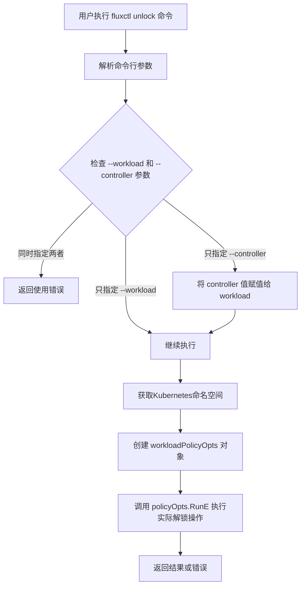
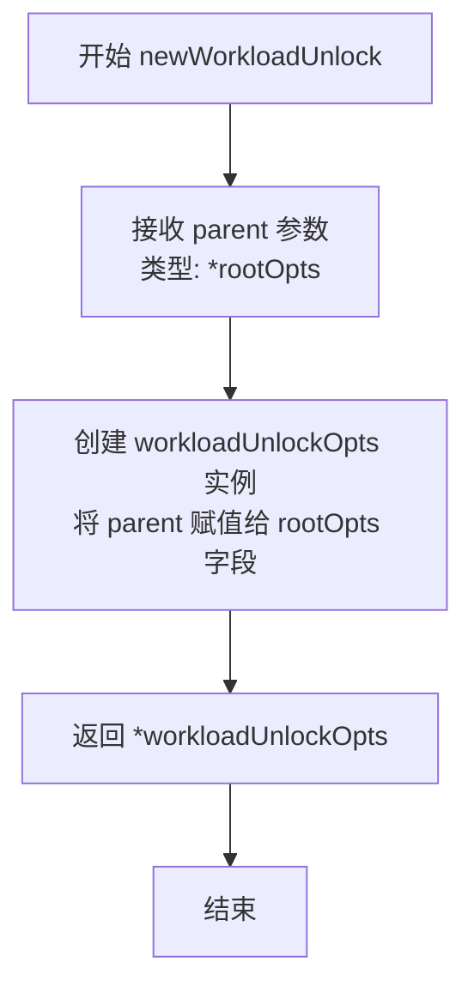
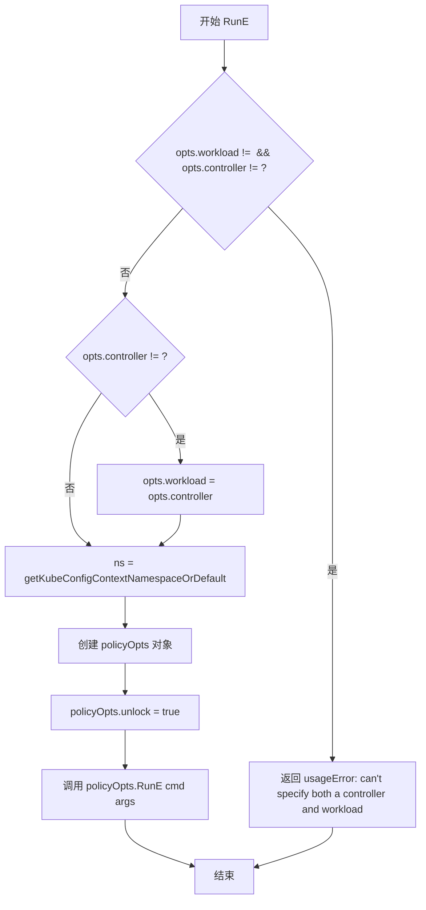

# `flux\cmd\fluxctl\unlock_cmd.go` 详细设计文档

这是一个Flux CD CLI工具中的子命令，用于解锁指定的工作负载（deployment），使其可以重新进行部署。该命令通过Cobra框架实现，支持通过命名空间和工作负载名称来解锁，并提供向后兼容的废弃控制器参数处理。

## 整体流程



## 类结构

```
rootOpts (根选项配置)
└── workloadUnlockOpts (工作负载解锁选项)
    ├── outputOpts (输出选项)
    ├── namespace (命名空间)
    ├── workload (工作负载)
    ├── cause (解锁原因)
    └── controller (已废弃的控制器参数)
```

## 全局变量及字段


### `workloadUnlockOpts.workloadUnlockOpts`
    
用于解锁工作负载的命令选项结构体，包含Kubernetes命名空间、工作负载标识、输出选项和解锁原因等配置

类型：`struct`
    


### `workloadUnlockOpts.*rootOpts`
    
嵌入的根选项配置，提供基础命令行选项和上下文

类型：`*rootOpts`
    


### `workloadUnlockOpts.namespace`
    
Kubernetes命名空间，指定工作负载所在的命名空间

类型：`string`
    


### `workloadUnlockOpts.workload`
    
要解锁的工作负载标识，格式如default:deployment/helloworld

类型：`string`
    


### `workloadUnlockOpts.outputOpts`
    
输出格式选项，控制命令输出的格式和样式

类型：`outputOpts`
    


### `workloadUnlockOpts.cause`
    
解锁原因/原因说明，记录为什么要解锁该工作负载

类型：`update.Cause`
    


### `workloadUnlockOpts.controller`
    
已废弃的控制器参数，已被workload参数替代

类型：`string`
    


### `workloadUnlockOpts.Command`
    
返回Cobra命令对象，构建并配置unlock子命令

类型：`func(*workloadUnlockOpts) *cobra.Command`
    


### `workloadUnlockOpts.RunE`
    
执行解锁逻辑，处理参数兼容性并调用workloadPolicyOpts执行解锁操作

类型：`func(*workloadUnlockOpts) func(*cobra.Command, []string) error`
    
    

## 全局函数及方法


### `newWorkloadUnlock`

这是一个构造函数，用于创建并返回一个 `workloadUnlockOpts` 结构体实例，将父级 `rootOpts` 注入到新实例中，以便在后续命令执行中使用根配置选项。

参数：

- `parent`：`*rootOpts`，指向父级 rootOpts 的指针，包含根命令的配置选项（如 Kubernetes 配置上下文等）

返回值：`*workloadUnlockOpts`，返回新创建的 workloadUnlockOpts 结构体实例，该实例包含对父级配置的引用

#### 流程图



#### 带注释源码

```go
// newWorkloadUnlock 是一个构造函数，用于创建 workloadUnlockOpts 结构体实例
// 参数 parent 是指向 rootOpts 的指针，包含根命令的配置选项
// 返回值是一个指向新创建的 workloadUnlockOpts 实例的指针
func newWorkloadUnlock(parent *rootOpts) *workloadUnlockOpts {
    // 创建新的 workloadUnlockOpts 实例，并将 parent 的指针赋值给其嵌入的 rootOpts 字段
    // 这样新实例就可以访问根级别的配置选项（如 Kubernetes 上下文、命名空间等）
    return &workloadUnlockOpts{rootOpts: parent}
}
```


### `workloadUnlockOpts.Command`

该方法负责构建并返回用于“解锁（unlock）”工作负载的 Cobra 命令对象。它初始化命令的元数据（如使用说明、简短描述），并绑定相应的命令行标志（flags），包括对已弃用 `--controller` 标志的特殊处理。

参数：
- `{receiver}`：`workloadUnlockOpts`，方法接收者，包含命令所需的配置选项和嵌入的根选项。

返回值：
- `*cobra.Command`，返回配置好的 Cobra 命令实例，供主程序注册和使用。

#### 流程图

```mermaid
graph TD
    A[Start Command Construction] --> B[Create &cobra.Command struct]
    B --> C[Set Command Metadata]
    C --> C1[Use: 'unlock']
    C --> C2[Short: 'Unlock a workload...']
    C --> C3[Example: 'fluxctl unlock...']
    C --> D[Assign RunE: opts.RunE]
    D --> E[Add Standard Flags]
    E --> E1[AddOutputFlags]
    E --> E2[AddCauseFlags]
    E --> F[Add Specific Flags]
    F --> F1[Flag: --namespace/-n]
    F --> F2[Flag: --workload/-w]
    F --> F3[Flag: --controller/-c (Deprecated)]
    F3 --> G[Mark Flag Deprecated]
    G --> H[Return cmd]
```

#### 带注释源码

```go
func (opts *workloadUnlockOpts) Command() *cobra.Command {
    // 1. 初始化 Cobra 命令结构体
	cmd := &cobra.Command{
		Use:   "unlock", // 命令名称
		Short: "Unlock a workload, so it can be deployed.", // 简短描述
        // 使用帮助示例生成器
		Example: makeExample(
			"fluxctl unlock --workload=default:deployment/helloworld",
		),
		RunE: opts.RunE, // 绑定实际的执行逻辑
	}
    
    // 2. 添加通用的输出格式标志（如 --format json/yaml）
	AddOutputFlags(cmd, &opts.outputOpts)
    
    // 3. 添加原因（Cause）标志，用于记录为何触发此操作
	AddCauseFlags(cmd, &opts.cause)
    
    // 4. 添加本命令特有的标志
    // 命名空间标志
	cmd.Flags().StringVarP(&opts.namespace, "namespace", "n", "", "Controller namespace")
    // 工作负载标志（新版本）
	cmd.Flags().StringVarP(&opts.workload, "workload", "w", "", "Controller to unlock")

	// 5. 处理已弃用的标志
    // 控制器的旧标志，保持向后兼容性
	cmd.Flags().StringVarP(&opts.controller, "controller", "c", "", "Controller to unlock")
    // 标记该标志已弃用，提示用户改用 --workload
	cmd.Flags().MarkDeprecated("controller", "changed to --workload, use that instead")

	return cmd // 6. 返回构建好的命令对象
}
```


### `workloadUnlockOpts.RunE`

该方法是 `workloadUnlockOpts` 类型的成员方法，负责执行解锁工作负载的逻辑。它首先处理命令行参数的向后兼容性（--controller 已弃用），然后获取命名空间，最后创建 `workloadPolicyOpts` 并调用其 `RunE` 方法执行实际的解锁操作。

参数：

- `cmd`：`*cobra.Command`，Cobra 命令对象，包含命令标志和配置信息
- `args`：`[]string`，命令行传入的额外参数列表

返回值：`error`，如果执行过程中发生错误（如同时指定了 --controller 和 --workload），则返回相应的错误信息；否则返回底层 `policyOpts.RunE` 的执行结果。

#### 流程图



#### 带注释源码

```go
func (opts *workloadUnlockOpts) RunE(cmd *cobra.Command, args []string) error {
	// 向后兼容性检查：处理已弃用的 --controller 参数
	// 如果同时指定了 --workload 和 --controller，则返回错误
	switch {
	case opts.workload != "" && opts.controller != "":
		// 两者同时指定时，抛出使用错误
		return newUsageError("can't specify both a controller and workload")
	case opts.controller != "":
		// 仅指定了已弃用的 --controller，将其值复制到 --workload
		opts.workload = opts.controller
	}
	// 获取 Kubernetes 配置上下文中的命名空间，如果未指定则默认为 "default"
	ns := getKubeConfigContextNamespaceOrDefault(opts.namespace, "default", opts.Context)
	// 构建 workloadPolicyOpts 结构体，配置解锁所需的参数
	policyOpts := &workloadPolicyOpts{
		rootOpts:   opts.rootOpts,
		outputOpts: opts.outputOpts,
		namespace:  ns,
		workload:   opts.workload,
		cause:      opts.cause,
		unlock:     true, // 设置解锁标志为 true
	}
	// 委托给 workloadPolicyOpts 的 RunE 方法执行实际的解锁操作
	return policyOpts.RunE(cmd, args)
}
```

## 关键组件


### workloadUnlockOpts 结构体

解/workloadUnlockOpts 结构体定义了解锁工作负载所需的配置选项，包含根选项、命名空间、工作负载标识、输出选项、解锁原因以及已废弃的控制器字段。该结构体充当配置容器，将所有与解锁操作相关的参数封装在一起。

### newWorkloadUnlock 构造函数

newWorkloadUnlock 函数负责实例化 workloadUnlockOpts 结构体，将父级 rootOpts 注入到新创建的对象中。该函数实现了依赖注入模式，确保命令层级关系的正确建立。

### Command 方法

Command 方法构建并配置 cobra 命令对象，定义了 unlock 子命令的元数据，包括使用说明、简短描述、示例以及相关的标志绑定。该方法注册了命名空间、工作负载、输出格式和原因等命令行标志，并对已废弃的 controller 标志设置了弃用警告。

### RunE 方法

RunE 方法是命令的实际执行逻辑，实现了参数校验、向后兼容性处理和业务逻辑的委托。首先验证不能同时指定 controller 和 workload 参数，然后进行参数转换，最后创建 workloadPolicyOpts 并委托给其 RunE 方法执行实际解锁操作。

### getKubeConfigContextNamespaceOrDefault 函数

getKubeConfigContextNamespaceOrDefault 函数从 Kubernetes 配置中获取当前上下文关联的命名空间，如果未设置则返回默认值 "default"。该函数处理了命名空间的解析逻辑，确保命令能够在正确的命名空间范围内执行。

### workloadPolicyOpts 结构体

workloadPolicyOpts 结构体是实际执行工作负载策略配置的载体，包含了根选项、输出选项、命名空间、工作负载标识、原因以及 unlock 标志。该结构体被用于传递解锁所需的完整上下文信息到后续处理流程。


## 问题及建议


### 已知问题

-   **废弃字段处理逻辑重复**：在 `RunE` 方法中使用 switch 语句处理 `--controller` 废弃标志的向后兼容性，这种模式可能在其他类似命令中重复出现，导致代码冗余
-   **缺乏输入验证**：对 `opts.namespace` 和 `opts.workload` 没有进行合法性验证，空值或格式错误的输入可能导致后续逻辑失败
-   **硬编码字符串**：命名空间默认值 "default" 直接硬编码在代码中（`getKubeConfigContextNamespaceOrDefault` 调用时），应提取为常量以提高可维护性
-   **命令行参数格式不明确**：`--workload` 参数接受 "default:deployment/helloworld" 格式，但代码中没有文档或验证逻辑说明其格式要求
-   **职责分配不清晰**：`workloadUnlockOpts.Command()` 方法中混合了命令配置和标志定义，降低了代码的内聚性

### 优化建议

-   **提取向后兼容逻辑**：将 `--controller` 的兼容处理封装为独立函数或方法，在需要处理废弃参数的命令中复用
-   **增加输入验证**：在 `RunE` 方法开始时添加 namespace 和 workload 的格式验证，提供明确的错误信息
-   **定义常量**：将 "default" 等魔法字符串提取为包级常量，例如 `const DefaultNamespace = "default"`
-   **增强文档注释**：为 `--workload` 参数添加更详细的格式说明和使用示例
-   **重构 Command() 方法**：将标志定义逻辑分离到独立函数中，提高 `Command()` 方法的可读性


## 其它


### 设计目标与约束

设计目标是提供一个命令行工具，用于解锁（unlock）Flux CD中的工作负载，使其可以重新被部署。该命令通过`fluxctl`CLI暴露给用户，允许用户指定目标命名空间和工作负载名称。

约束条件：
- 必须兼容Kubernetes的命名空间和工作负载概念
- 需要保持与Flux CD生态系统的集成
- 命令行参数遵循cobra框架规范
- 需要向后兼容已弃用的`--controller`参数

### 错误处理与异常设计

主要错误场景及处理方式：
1. **参数冲突错误**：当同时指定`--workload`和已弃用的`--controller`参数时，返回使用错误（`newUsageError`），提示不能同时指定两者
2. **空参数处理**：当必需参数为空时，cobra框架会自动验证并提示用户
3. **Kubernetes上下文错误**：通过`getKubeConfigContextNamespaceOrDefault`函数处理，默认使用"default"命名空间
4. **已弃用参数警告**：使用`cmd.Flags().MarkDeprecated`标记`--controller`参数为已弃用，提示用户使用`--workload`替代

### 数据流与状态机

**数据流**：
1. 用户执行`fluxctl unlock`命令
2. cobra解析命令行参数到`workloadUnlockOpts`结构体
3. `RunE`方法接收解析后的选项和参数
4. 进行向后兼容性处理：将`--controller`参数值迁移到`--workload`
5. 获取Kubernetes命名空间（从上下文或默认值）
6. 构建`workloadPolicyOpts`结构体，设置`unlock: true`
7. 调用`policyOpts.RunE`执行实际解锁操作

**状态转换**：
- 初始状态 → 参数解析状态 → 兼容性处理状态 → 解锁执行状态 → 完成/错误状态

### 外部依赖与接口契约

**外部依赖**：
1. `github.com/spf13/cobra` - CLI框架，提供命令定义和参数解析
2. `github.com/fluxcd/flux/pkg/update` - Flux CD更新包，提供`update.Cause`类型

**接口契约**：
- `newWorkloadUnlock(parent *rootOpts) *workloadUnlockOpts` - 创建选项实例
- `Command() *cobra.Command` - 返回可执行的cobra命令
- `RunE(cmd *cobra.Command, args []string) error` - 执行解锁逻辑
- `getKubeConfigContextNamespaceOrDefault(ns, defaultNs, context string) string` - 获取命名空间（外部函数依赖）
- `newUsageError(msg string) error` - 创建使用错误（外部函数依赖）
- `workloadPolicyOpts.RunE(cmd *cobra.Command, args []string) error` - 实际执行解锁的内部方法

### 配置文件与环境变量

该命令不直接使用配置文件，但依赖：
- Kubernetes配置文件（~/.kube/config）用于获取上下文和命名空间
- 环境变量通过cobra框架的标准方式处理（如果配置）
- 输出格式由`outputOpts`控制，支持多种格式（JSON、YAML等）

### 安全性考虑

1. **参数验证**：确保工作负载标识符格式正确
2. **权限要求**：需要Kubernetes RBAC权限来修改工作负载策略
3. **敏感信息**：不直接处理敏感凭据，依赖Kubernetes客户端的认证机制
4. **已弃用参数**：保留已弃用参数的同时通过警告引导用户迁移

### 测试建议

1. **单元测试**：
   - 测试参数解析正确性
   - 测试向后兼容性逻辑（同时指定两个参数）
   - 测试命名空间默认值处理

2. **集成测试**：
   - 测试与Flux CD API的交互
   - 测试Kubernetes客户端集成

3. **边界条件**：
   - 空工作负载名称
   - 无效的命名空间
   - 网络错误场景

    