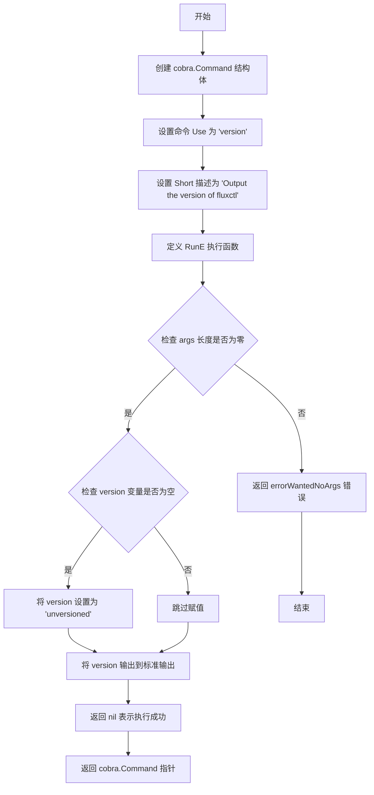
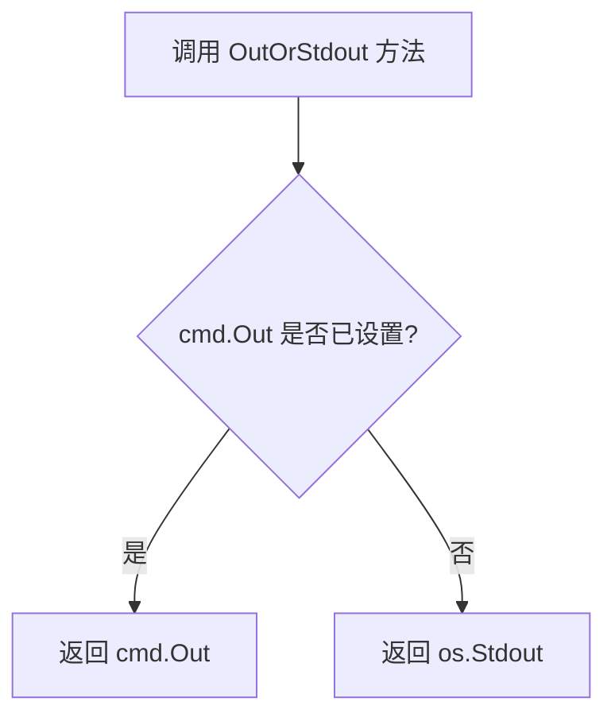

# `flux\cmd\fluxctl\version_cmd.go` 详细设计文档

这是一个基于cobra框架的Go语言命令行工具，用于输出fluxctl工具的版本号。

## 整体流程

```mermaid
graph TD
A[程序启动] --> B[调用newVersionCommand]
B --> C[用户执行version命令]
C --> D{参数个数是否为0?}
D -- 否 --> E[返回错误: 不需要参数]
D -- 是 --> F{version变量是否为空?]
F -- 是 --> G[设置version为'unversioned']
F -- 否 --> H[保持原有version值]
G --> I[输出version到标准输出]
H --> I
```

## 类结构

```
main包
└── cobra.Command (结构体类型，通过newVersionCommand创建实例)
```

## 全局变量及字段


### `version`
    
存储版本号字符串

类型：`string`
    


### `cobra.Command.Use`
    
命令使用语法

类型：`string`
    


### `cobra.Command.Short`
    
命令简短描述

类型：`string`
    


### `cobra.Command.RunE`
    
命令执行函数

类型：`func(*Command, []string) error`
    
    

## 全局函数及方法


### `newVersionCommand`

创建并返回一个 Cobra 命令对象，用于在 CLI 中输出 fluxctl 的版本信息。

参数： 无

返回值： `*cobra.Command`，返回指向 Cobra 命令结构体的指针，用于注册到 CLI 命令集合中

#### 流程图



#### 带注释源码

```go
// newVersionCommand 创建并返回一个用于输出版本号的 cobra 命令
// 该函数不接收任何参数
// 返回一个指向 cobra.Command 结构体的指针，可用于 CLI 命令注册
func newVersionCommand() *cobra.Command {
	// 使用字面量初始化 cobra.Command 结构体
	// 包含命令的使用说明、简短描述和执行逻辑
	return &cobra.Command{
		Use:   "version",                              // 命令名称，用户在终端输入 "fluxctl version"
		Short: "Output the version of fluxctl",       // 命令的简短描述，用于帮助信息
		RunE: func(cmd *cobra.Command, args []string) error { // RunE 是带错误返回的执行函数
			if len(args) != 0 { // 检查是否有额外的参数传入
				return errorWantedNoArgs // 如果有参数，返回错误表示不需要参数
			}
			if version == "" { // 检查全局 version 变量是否为空
				version = "unversioned" // 如果为空，设置默认值为 "unversioned"
			}
			fmt.Fprintln(cmd.OutOrStdout(), version) // 将版本号输出到标准输出
			return nil // 返回 nil 表示命令执行成功，无错误
		},
	}
}
```


### `cobra.Command.OutOrStdout()`

该方法是 Cobra 框架中 `cobra.Command` 结构体的成员方法，用于获取命令的输出流。它优先返回 `cmd.Out`（如果已设置），否则返回标准输出 `os.Stdout`。这使得命令行工具可以在测试时重定向输出，或在需要时指定自定义输出目的地。

参数：此方法没有显式参数

返回值：`io.Writer`，返回用于输出命令结果的写入器

#### 流程图



#### 带注释源码

```go
// OutOrStdout 返回命令的输出目标
// 如果命令设置了 Out 字段（即自定义输出流），则返回该自定义输出流
// 否则返回标准输出 os.Stdout 作为默认输出目标
// 这种设计允许:
// 1. 在测试中捕获输出以便断言
// 2. 在需要时将输出重定向到文件或其他 io.Writer
// 3. 保持向后兼容，默认行为是输出到标准输出
func (cmd *Command) OutOrStdout() io.Writer {
    if cmd.Out != nil {
        return cmd.Out
    }
    return os.Stdout
}
```

---

## 完整设计文档

### 一段话描述

该代码实现了一个简单的 `version` 命令，当用户运行 `fluxctl version` 时，会输出程序的版本号。如果版本号未设置，则默认输出 "unversioned"。

### 文件的整体运行流程

```mermaid
flowchart TD
    A[程序启动] --> B[调用 newVersionCommand 创建 Command 对象]
    B --> C[用户执行 fluxctl version]
    C --> D[RunE 函数被调用]
    D --> E{检查参数数量}
    E -->|有参数| F[返回错误: 不需要参数]
    E -->|无参数| G{version 变量是否为空?}
    G -->|是| H[设置 version = "unversioned"]
    G -->|否| I[跳过赋值]
    H --> I
    I --> J[调用 cmd.OutOrStdout 获取输出流]
    J --> K[使用 fmt.Fprintln 输出版本号]
    K --> L[返回 nil 表示成功]
```

### 类的详细信息

#### `cobra.Command` 结构体

字段：

- `Use`：string，命令的使用方式字符串
- `Short`：string，命令的简短描述
- `RunE`：func(cmd *Command, args []string) error，执行命令的函数
- `Out`：io.Writer，可选的自定义输出流

#### 全局变量

- `version`：string，存储程序版本号

#### 全局函数

- `newVersionCommand`：返回 `*cobra.Command`，创建并配置 version 命令

### 关键组件信息

| 名称 | 描述 |
|------|------|
| `cobra.Command` | Cobra 框架中的命令结构体 |
| `OutOrStdout()` | 获取命令输出流的方法，优先使用自定义输出流 |
| `RunE` | 命令执行函数，返回 error 以支持错误处理 |

### 潜在的技术债务或优化空间

1. **硬编码的默认版本字符串**："unversioned" 应该在配置或常量中定义，而不是硬编码
2. **缺乏版本语义化**：没有使用语义化版本号（Semantic Versioning）
3. **错误处理不完善**：只检查了参数数量，没有检查其他潜在错误
4. **缺少版本信息元数据**：如构建时间、Git 提交哈希等信息

### 其它项目

#### 设计目标与约束

- **目标**：提供简单的版本查询功能
- **约束**：不接受任何命令行参数

#### 错误处理与异常设计

- 使用 `RunE` 而非 `Run` 以支持返回错误
- 参数错误返回自定义错误 `errorWantedNoArgs`
- 成功执行返回 `nil` 错误

#### 外部依赖与接口契约

- 依赖 `github.com/spf13/cobra` 库
- `OutOrStdout()` 方法契约：返回 `io.Writer` 接口类型

## 关键组件


### version 变量

存储 fluxctl 的版本号，用于在执行 version 命令时输出。如果未设置，则默认为 "unversioned"。

### newVersionCommand 函数

创建并返回一个 cobra.Command 对象，用于实现 version 子命令。该函数设置了命令的使用方式、简短描述和执行逻辑，包括参数验证、版本号默认值处理以及版本信息输出。

### errorWantedNoArgs 错误常量

（代码中引用但未在此文件中定义）用于在传入多余参数时返回错误，确保命令不接受任何参数。

### cobra.Command 结构

由 cobra 库定义的结构体，用于表示命令行命令。此处用于配置 version 命令的属性和行为。


## 问题及建议


### 已知问题

- 全局变量 `version` 使用包级变量存储，违反了依赖注入原则，降低了代码的可测试性
- 使用了未在当前文件中定义的全局变量 `errorWantedNoArgs`，存在潜在的编译错误或隐式依赖
- 错误信息 "unversioned" 采用硬编码字符串，未使用常量定义，导致后续修改成本高且易出错
- 代码缺乏注释和文档说明，可读性和可维护性较差
- 版本默认值逻辑与业务逻辑混在 RunE 函数中，违背了单一职责原则
- 未对 `version` 变量进行线程安全设计，在并发场景下可能存在竞态条件

### 优化建议

- 将 `version` 变量通过函数参数或结构体字段注入，避免使用包级全局变量
- 明确定义 `errorWantedNoArgs` 错误变量或使用标准的错误定义方式
- 使用常量定义默认版本字符串，如 `const defaultVersion = "unversioned"`
- 为 `newVersionCommand` 函数和关键逻辑添加清晰的注释和文档
- 将版本默认值逻辑提取为独立的配置方法或初始化函数
- 考虑添加版本格式化选项（如 `version --short`）以增强功能灵活性
- 分离命令创建逻辑和业务执行逻辑，提高代码模块化程度

## 其它


### 设计目标与约束

本代码的设计目标是实现一个简洁的version命令，用于输出fluxctl工具的版本号。约束条件包括：使用cobra框架构建命令行接口、版本号通过全局变量注入、不接受任何命令行参数。

### 错误处理与异常设计

主要错误场景：
1. 用户传入参数时返回errorWantedNoArgs错误
2. version变量为空时设置为"unversioned"

错误处理方式：使用cobra的RunE模式返回error，框架自动处理错误输出。

### 外部依赖与接口契约

外部依赖：
- github.com/spf13/cobra：命令行框架，提供命令构建和参数解析能力
- fmt包：用于输出版本信息

接口契约：
- newVersionCommand()返回*cobra.Command类型
- 命令实现Command接口的Use、Short、RunE字段
- 输出到cmd.OutOrStdout()，支持stdout和pipe场景

### 性能考虑

本代码性能开销极低，仅涉及字符串条件判断和单次输出操作，无性能瓶颈。

### 安全性考虑

版本号作为简单字符串输出，无敏感信息处理，安全性风险较低。参数校验防止了意外的参数传入。

### 可测试性

代码结构简单，RunE函数可通过cobra命令对象直接测试。errorWantedNoArgs变量应设计为可导出具名以便单元测试。

### 配置管理

版本号通过编译时注入的全局变量version获取，属于静态配置，无运行时配置需求。

### 版本兼容性

依赖cobra库的低版本兼容性，当前实现符合cobra v0.0.1以来的接口规范。


    