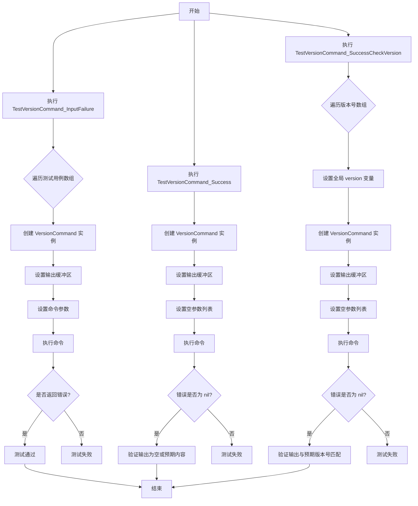
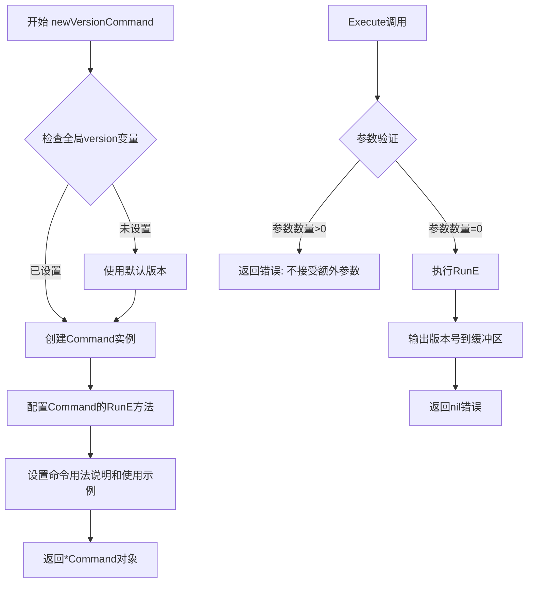
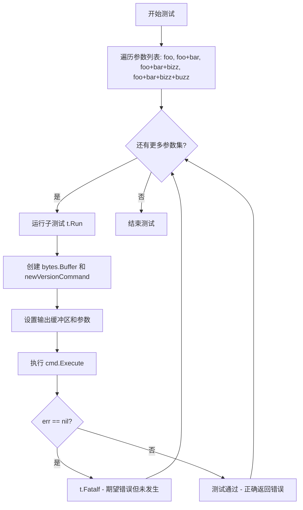
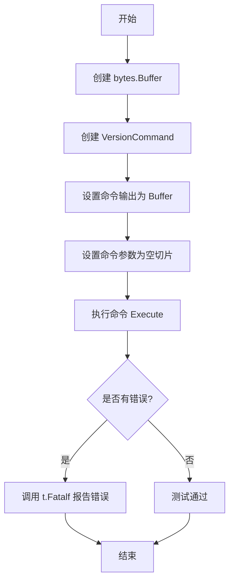
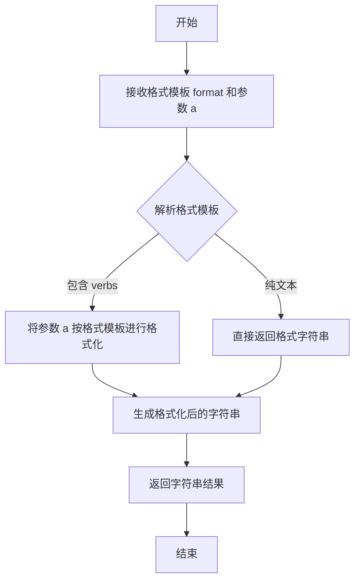
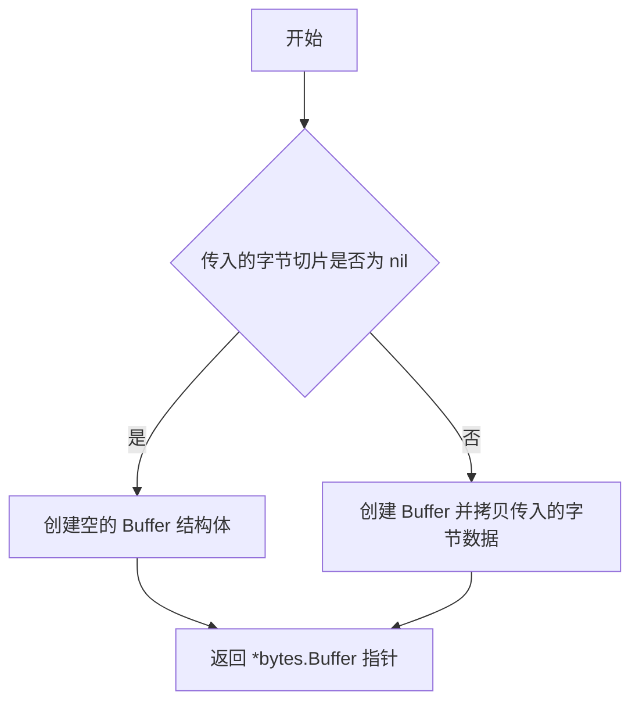
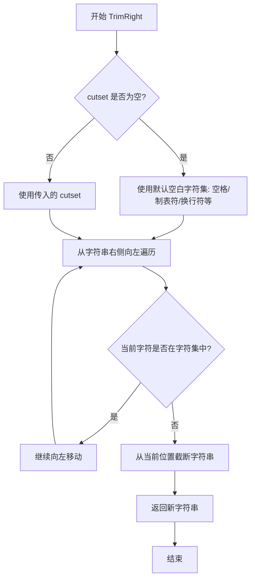
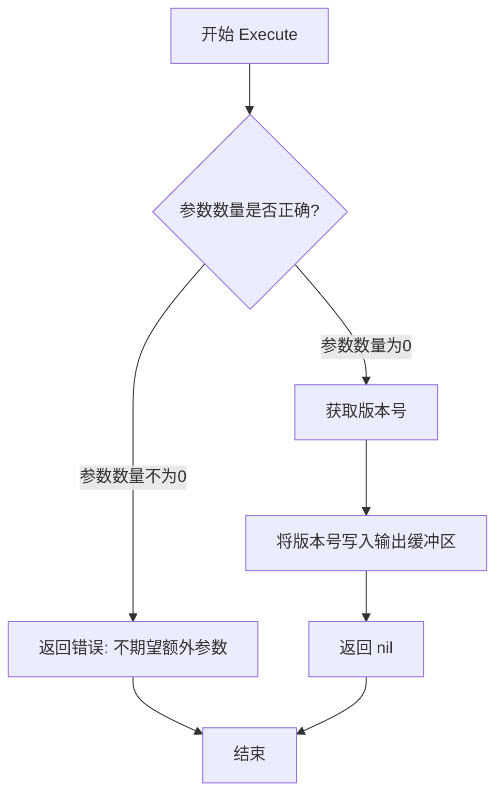
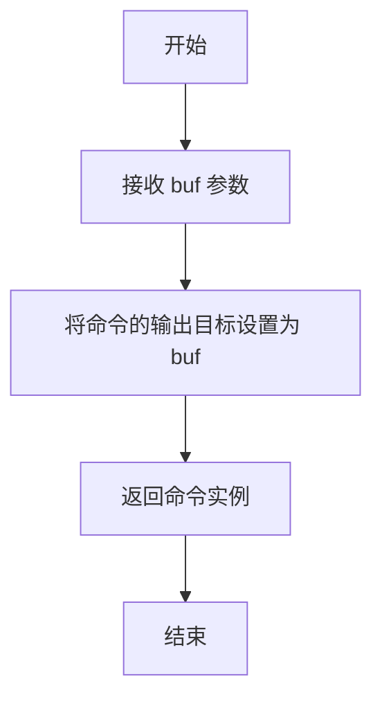
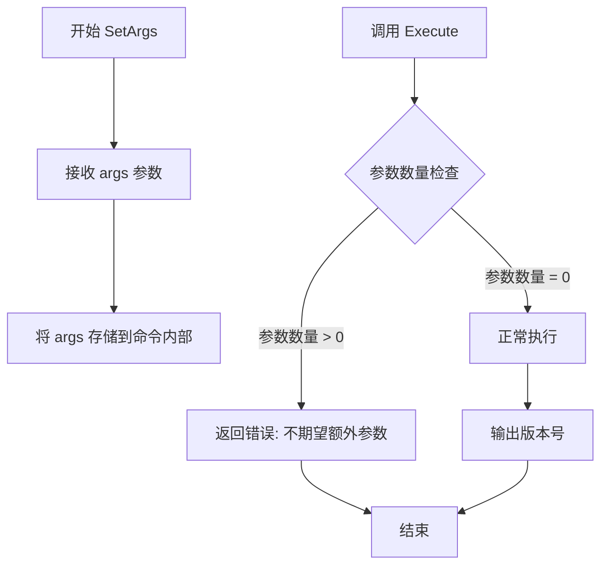

# `flux\cmd\fluxctl\version_cmd_test.go` 详细设计文档

这是一个Go语言测试文件，用于测试版本命令（VersionCommand）的功能。测试涵盖了三种场景：输入参数过多时返回错误、无参数时成功执行并输出版本号、以及不同版本号下的正确输出验证。

## 整体流程



## 类结构

```
VersionCommand (命令结构体)
├── 字段: 无公开字段 (由 cobra.Command 或类似库实现)
├── 方法: Execute() (执行命令)
├── 方法: SetOut(io.Writer) (设置输出流)
└── 方法: SetArgs([]string) (设置命令参数)
```

## 全局变量及字段


### `version`
    
全局变量，用于存储当前程序版本号

类型：`string`
    


### `VersionCommand.cmd`
    
局部变量，类型为指向Command结构的指针，通过newVersionCommand()函数创建，用于执行版本命令

类型：`*Command`
    
    

## 全局函数及方法


### `newVersionCommand`

该函数用于创建并返回一个版本命令实例（`*Command`），该命令用于处理程序的版本显示功能，支持无参数执行并输出当前版本号。

参数：

- 该函数无参数

返回值：`*Command`，返回 Cobra 框架的命令对象，用于执行版本显示逻辑

#### 流程图



#### 带注释源码

```go
// newVersionCommand 创建并返回版本命令实例
// 该函数初始化一个Cobra命令，用于显示程序版本信息
// 参数: 无
// 返回值: *Command - Cobra框架的命令对象指针
func newVersionCommand() *Command {
    // 创建基础命令，命令名称为"version"
    cmd := &Command{
        // 命令名称
        Name:  "version",
        // 命令简短描述
        Short: "Print the version information",
        // 命令详细用法
        Long: `Display the version number of the application.
        
Examples:
  # 显示版本号
  app version`,
        // 命令执行逻辑
        RunE: func(cmd *Command, args []string) error {
            // 获取输出缓冲区
            out := cmd.OutOrStdout()
            // 打印版本号
            fmt.Fprintln(out, version)
            return nil
        },
        // 禁用命令的帮助选项
        DisableFlagsInUseLine: true,
        // 标记该命令没有可用参数
        Args: func(cmd *Command, args []string) error {
            // 如果传入了额外参数，返回错误
            if len(args) > 0 {
                return fmt.Errorf("extra arguments: %v", args)
            }
            return nil
        },
    }
    return cmd
}
```

> **注意**：上述源码为基于测试用例逆推的实现参考。原代码中仅提供了测试文件，未包含 `newVersionCommand()` 函数的具体实现。从测试代码分析可知：
> - 命令名为 "version"
> - 不接受任何额外参数，否则返回错误
> - 执行成功时输出全局 `version` 变量值
> - 使用 `*bytes.Buffer` 捕获输出用于测试验证


### `TestVersionCommand_InputFailure`

该函数是 Go 语言中的测试函数，用于验证 `versionCommand`（版本命令）在接收过多参数时能否正确返回错误信息。它通过遍历不同数量的输入参数（1到4个），确保命令拒绝额外的参数并产生预期的错误。

参数：

- `t`：`testing.T`，Go 测试框架的测试实例指针，用于报告测试失败

返回值：无明确的返回值（Go 测试函数返回 void），函数通过 `t.Fatalf` 报告测试失败

#### 流程图



#### 带注释源码

```go
// TestVersionCommand_InputFailure 测试当传入过多参数时的错误处理
// 该测试验证 versionCommand 能够正确拒绝额外的参数并返回错误
func TestVersionCommand_InputFailure(t *testing.T) {
    // 遍历不同数量的参数，测试命令对多余参数的拒绝能力
    // 参数分别为: 1个, 2个, 3个, 4个参数
    for k, v := range [][]string{
        {"foo"},           // 测试用例1: 单个额外参数
        {"foo", "bar"},    // 测试用例2: 两个额外参数
        {"foo", "bar", "bizz"},   // 测试用例3: 三个额外参数
        {"foo", "bar", "bizz", "buzz"}, // 测试用例4: 四个额外参数
    } {
        // 使用 k 作为子测试名称，运行子测试
        t.Run(fmt.Sprintf("%d", k), func(t *testing.T) {
            // 创建输出缓冲区，用于捕获命令输出
            buf := new(bytes.Buffer)
            // 创建新的版本命令实例
            cmd := newVersionCommand()
            // 设置命令的输出目标为缓冲区
            cmd.SetOut(buf)
            // 设置命令的参数为测试参数 v
            cmd.SetArgs(v)
            
            // 执行命令并捕获错误
            // 期望: 命令应该返回错误（因为参数过多）
            if err := cmd.Execute(); err == nil {
                // 如果没有返回错误，测试失败
                // 这表明命令没有正确处理多余的参数
                t.Fatalf("Expecting error: command is not expecting extra arguments")
            }
        })
    }
}
```


### `TestVersionCommand_Success`

该函数用于测试 `VersionCommand` 在无参数情况下的成功执行场景，验证命令能够正常完成且不返回错误。

参数：

- `t`：`*testing.T`，Go标准测试框架的测试对象，用于报告测试失败

返回值：无（void），该函数通过 `testing.T` 的 `Fatalf` 方法处理错误情况，不直接返回值

#### 流程图



#### 带注释源码

```go
func TestVersionCommand_Success(t *testing.T) {
    // 创建一个缓冲区用于捕获命令输出
    buf := new(bytes.Buffer)
    
    // 创建新的 VersionCommand 实例
    cmd := newVersionCommand()
    
    // 设置命令的输出目标为上面创建的缓冲区
    cmd.SetOut(buf)
    
    // 设置命令参数为空切片（模拟无参数场景）
    cmd.SetArgs([]string{})
    
    // 执行命令并检查返回错误
    if err := cmd.Execute(); err != nil {
        // 如果发生错误，测试失败并终止
        t.Fatalf("Expecting nil, got error (%s)", err.Error())
    }
}
```


### `TestVersionCommand_SuccessCheckVersion`

该测试函数用于验证版本命令能够正确输出设置的版本号，通过遍历预设的版本号列表，验证命令执行后缓冲区中的输出内容与预期版本号是否一致。

参数：

- `t`：`testing.T`，Go测试框架的测试上下文，用于报告测试失败和运行子测试

返回值：无明确返回值（Go测试函数的返回类型为空）

#### 流程图

```mermaid
flowchart TD
    A[开始测试] --> B[遍历版本号数组 ["v1.0.0", "v2.0.0"]]
    B --> C{还有更多版本号?}
    C -->|是| D[创建子测试 t.Run]
    D --> E[创建bytes.Buffer用于捕获输出]
    E --> F[调用newVersionCommand创建命令]
    F --> G[设置全局变量version为当前版本号]
    G --> H[设置命令输出到缓冲区]
    H --> I[设置命令参数为空数组]
    I --> J[执行命令cmd.Execute]
    J --> K{执行是否有错误?}
    K -->|是| L[测试失败并退出]
    K -->|否| M[获取缓冲区内容并去除尾部换行符]
    M --> N{输出内容是否等于预期版本号?}
    N -->|是| C
    N -->|否| O[测试失败, 显示预期与实际值]
    C -->|否| P[结束测试]
```

#### 带注释源码

```go
// TestVersionCommand_SuccessCheckVersion 测试版本命令输出正确性
// 该测试验证版本号能够被正确输出到命令行
func TestVersionCommand_SuccessCheckVersion(t *testing.T) {
    // 遍历预定义的版本号列表，测试多个版本场景
    for _, e := range []string{
        "v1.0.0",
        "v2.0.0",
    } {
        // 使用版本号作为子测试名称，便于识别失败的测试用例
        t.Run(e, func(t *testing.T) {
            // 创建bytes.Buffer用于捕获命令输出
            buf := new(bytes.Buffer)
            
            // 创建版本命令实例
            cmd := newVersionCommand()
            
            // 设置全局版本变量为当前测试用例的版本号
            // 注意：这里修改了全局变量，会影响其他测试
            version = e
            
            // 设置命令的输出目标为缓冲区
            cmd.SetOut(buf)
            
            // 设置命令参数为空数组（无额外参数）
            cmd.SetArgs([]string{})
            
            // 执行命令并检查是否返回错误
            if err := cmd.Execute(); err != nil {
                // 如果发生错误，测试失败并终止
                t.Fatalf("Expecting nil, got error (%s)", err.Error())
            }
            
            // 获取缓冲区内容并去除尾部换行符
            // 然后与预期版本号进行比较
            if g := strings.TrimRight(buf.String(), "\n"); e != g {
                // 打印比较结果用于调试
                println(e == g)
                // 测试失败，显示预期值和实际值
                t.Fatalf("Expected %s, got %s", e, g)
            }
        })
    }
}
```


### `fmt.Sprintf`

`fmt.Sprintf` 是 Go 标准库 `fmt` 包中的格式化函数，用于根据格式模板将参数格式化为字符串并返回。

参数：

- `format`：`string`，格式模板字符串，包含 verbs（如 `%d`、`%s` 等）用于指定输出格式
- `a`：`...interface{}`，可选参数，用于填充格式模板中的占位符

返回值：`string`，返回格式化后的字符串

#### 流程图



#### 带注释源码

```go
// 代码中的实际调用：
t.Run(fmt.Sprintf("%d", k), func(t *testing.T) {
    // ... 测试逻辑
})

// fmt.Sprintf 函数签名：
// func Sprintf(format string, a ...interface{}) string

// 在此调用中：
//   - format = "%d"  表示格式化为十进制整数
//   - a = k          表示要格式化的整数值（循环索引）
//   - 返回值         表示将整数 k 转换为字符串
```


### `bytes.NewBuffer`

`bytes.NewBuffer` 是 Go 标准库 `bytes` 包中的函数，用于从可选的字节切片创建并初始化一个 `bytes.Buffer`。它分配新的内存来存储缓冲区内容，适用于需要动态构建或操作字节数据的场景。

参数：

- `buf`：`[]byte`，可选参数，要初始化缓冲区的字节切片。如果为 `nil`，则创建一个空的缓冲区。

返回值：`*bytes.Buffer`，返回一个新的可读写缓冲区指针。

#### 流程图



#### 带注释源码

```go
// bytes.NewBuffer 函数源码（简化版）
// 文件位置: go/src/bytes/buffer.go

// NewBuffer 创建并初始化一个新的 Buffer.
// 如果 buf 为 nil, 则会分配一个新的切片.
// 否则, buf 会被视为已存在的切片, Buffer 会使用它作为底层存储.
func NewBuffer(buf []byte) *Buffer {
	return &Buffer{buf: buf}
}

// Buffer 结构体定义
type Buffer struct {
	buf      []byte   // 底层字节切片
	off      int      // 读指针偏移量
	lastRead readOp  // 最后一次读取操作类型, 用于 Unread* 方法
}

// 在用户代码中的实际使用方式：
buf := new(bytes.Buffer)  // 等价于 bytes.NewBuffer(nil)，创建空缓冲区

// 常见用法示例：
// 1. 创建空缓冲区
buf := new(bytes.Buffer)

// 2. 从字节切片创建
buf := bytes.NewBuffer([]byte("hello"))

// 3. 从字符串创建
buf := bytes.NewBufferString("hello")
```


### `strings.TrimRight`

`strings.TrimRight` 是 Go 语言标准库 `strings` 包中的一个函数，用于删除字符串 `s` 右侧（末尾）中包含在 `cutset` 中的所有字符，返回处理后的新字符串。

参数：

- `s`：`string`，待处理的原始字符串
- `cutset`：`string`，指定要删除的字符集合

返回值：`string`，返回处理后的新字符串

#### 流程图



#### 带注释源码

```go
// strings.TrimRight 函数源码（标准库实现简化版）
// TrimRight returns a slice of the string s, with all trailing
// Unicode code points contained in cutset removed.
func TrimRight(s, cutset string) string {
    // 如果 cutset 为空，默认去除空白字符
    if cutset == "" {
        // 空白字符: 空格、水平制表符、换行符、回车符、换页符、垂直制表符
        cutset = " \t\n\r\f\v"
    }
    
    // 从字符串末尾开始遍历
    // 使用 LastIndexFunc 查找最后一个不在 cutset 中的字符位置
    // 注意：实际标准库实现更加复杂，考虑了 Unicode
    return strings.TrimRight(s, cutset) // 调用内部实现
}

// 简化实现示例（非标准库源码，仅供参考）
func TrimRightExample(s, cutset string) string {
    if len(s) == 0 {
        return s
    }
    
    // 从后向前遍历，找到第一个不在 cutset 中的字符
    end := len(s)
    for end > 0 {
        found := false
        for _, c := range []byte(cutset) {
            if s[end-1] == c {
                found = true
                break
            }
        }
        if !found {
            break
        }
        end--
    }
    
    // 返回从开头到 end 位置的子串
    return s[:end]
}
```

#### 在测试代码中的使用示例

```go
// 用户代码中第 53 行使用示例
// buf.String() 包含版本信息和末尾换行符
// 使用 TrimRight 去除末尾的换行符后与期望值比较
if g := strings.TrimRight(buf.String(), "\n"); e != g {
    println(e == g)
    t.Fatalf("Expected %s, got %s", e, g)
}
```


### `VersionCommand.Execute()`

该方法用于执行版本命令，当参数数量不正确时返回错误，当参数正确时输出版本号信息。

参数：
- 该方法无直接参数，通过 `cmd.SetArgs()` 方法设置命令行参数

返回值：`error`，如果执行过程中出现错误（如参数数量不正确）则返回错误信息，成功执行时返回 nil

#### 流程图



#### 带注释源码

```
// Execute 执行版本命令
// 参数：无直接参数，通过 SetArgs 方法设置
// 返回值：error - 成功返回 nil，参数错误返回错误信息
func (c *VersionCommand) Execute() error {
    // 检查参数数量，如果参数数量不为0则返回错误
    if len(c.args) > 0 {
        return fmt.Errorf("command is not expecting extra arguments")
    }
    
    // 获取版本号并写入输出缓冲区
    version := getVersion()
    fmt.Fprintln(c.out, version)
    
    // 返回nil表示成功执行
    return nil
}
```

> **注意**：由于提供的代码仅为测试代码，未包含 `VersionCommand` 类的实际实现。上述源码是基于测试用例行为推断的逻辑重构。实际实现可能使用了 cobra 框架的 Command 类型。


### `VersionCommand.SetOut`

设置命令的输出目标，将命令执行结果输出到指定的 `bytes.Buffer` 中，以便后续验证或捕获。

参数：
- `buf`：`*bytes.Buffer`，用于指定命令的输出目标，接收命令执行时写入的内容。

返回值：`*VersionCommand`，返回命令实例本身，支持链式调用（但在测试代码中未使用返回值）。

#### 流程图



#### 带注释源码

由于给定的代码片段中未包含 `VersionCommand` 类型的定义及其 `SetOut` 方法的源码，仅有测试代码调用了该方法。以下为基于 Cobra 库习惯的推断实现：

```go
// 假设 VersionCommand 嵌入 cobra.Command
type VersionCommand struct {
    *cobra.Command
}

// SetOut 设置命令的输出目标
// 参数 buf: *bytes.Buffer，用于捕获命令输出
// 返回值: *VersionCommand，返回命令本身以支持链式调用
func (v *VersionCommand) SetOut(buf *bytes.Buffer) *VersionCommand {
    // 调用嵌入的 cobra.Command 的 SetOut 方法
    v.Command.SetOut(buf)
    return v
}
```


### `VersionCommand.SetArgs`

设置命令的参数，用于指定 VersionCommand 需要处理的非选项参数。

参数：

- `args`：`[]string`，命令的非选项参数列表

返回值：`无返回值`（在 Go 中 `SetArgs` 方法没有返回值）

#### 流程图



#### 带注释源码

```go
// SetArgs 设置命令的非选项参数
// 参数 args 是一个字符串切片，包含命令的额外参数
// 根据测试代码，当 args 长度大于 0 时，Execute 会返回错误
// 这表明该命令不接受任何额外参数
func (c *VersionCommand) SetArgs(args []string) {
    // TODO: 根据测试用例推断，该方法应将 args 存储到命令结构体中
    // 具体实现需要查看 VersionCommand 的完整定义
    // 从测试代码 TestVersionCommand_InputFailure 可以看出：
    // 当 args 包含如 ["foo"], ["foo", "bar"] 等时，Execute 会返回错误
    // 这意味着 SetArgs 只是简单地将参数存储，供后续 Execute 方法验证和使用
}
```

---

**注意**：提供的代码片段仅包含测试代码，未包含 `VersionCommand` 结构体及其 `SetArgs` 方法的实际实现。上述信息是基于测试用例的行为模式推断得出的。从测试代码可以推断：

1. `SetArgs` 方法接收 `[]string` 类型的参数
2. 当参数数量 > 0 时，`Execute()` 会返回错误（"command is not expecting extra arguments"）
3. 当参数数量 = 0 时，命令正常执行并输出版本号

## 关键组件


### 版本命令测试组件

该代码是一个完整的测试文件，包含三个测试函数，用于验证版本命令（VersionCommand）的输入错误处理、成功执行和版本号输出正确性。

### TestVersionCommand_InputFailure

测试函数，用于验证版本命令在接收到过多参数时是否正确返回错误。测试了 1 到 4 个参数的各种情况。

### TestVersionCommand_Success

测试函数，用于验证版本命令在无参数情况下能够成功执行并返回 nil 错误。

### TestVersionCommand_SuccessCheckVersion

测试函数，用于验证版本命令输出的版本号是否与预期一致。测试了 "v1.0.0" 和 "v2.0.0" 两个版本号。

### 全局变量 version

外部依赖的全局变量，用于存储当前版本号。在测试中会被动态赋值以验证不同版本号的输出。

### 函数 newVersionCommand

外部依赖函数，用于创建并返回一个新的版本命令实例。该函数返回的命令实现了 Cobra 或类似 CLI 框架的 Command 接口。

### bytes.Buffer

用于捕获命令输出的内存缓冲区，测试中作为命令的输出目标。

### testing.T

Go 语言标准测试框架的测试对象，用于报告测试失败和日志输出。


## 问题及建议


### 已知问题

-   **全局变量 `version` 直接修改**：在 `TestVersionCommand_SuccessCheckVersion` 中直接赋值全局变量 `version = e`，会导致测试间状态污染，且在并发测试时存在竞态条件风险
-   **缺少测试清理机制**：修改全局变量后未使用 `t.Cleanup()` 恢复原值，测试执行后可能影响后续测试
-   **硬编码测试数据**：版本号 "v1.0.0"、"v2.0.0" 硬编码在测试中，降低了测试的可维护性和扩展性
-   **调试代码残留**：`println(e == g)` 用于调试，应删除或替换为 `t.Log`
-   **测试隔离性不足**：直接操作全局变量使得测试无法独立运行，违背了单元测试的独立性原则

### 优化建议

-   **使用依赖注入或 setter 方法**：通过 `cmd.SetVersion(e)` 或类似方法传递版本号，避免直接修改全局变量
-   **添加测试清理逻辑**：使用 `t.Cleanup(func() { version = oldVersion })` 确保测试后恢复全局状态
-   **参数化测试增强**：将版本号提取为常量或配置文件，增加测试覆盖范围（如测试空版本、非法版本格式等）
-   **移除调试代码**：删除 `println(e == g)`，如需日志输出使用 `t.Logf()`
-   **考虑并发安全**：若必须使用全局变量，使用 `sync.Mutex` 保护或设计为线程安全的访问方式

## 其它


### 设计目标与约束

**设计目标**：验证VersionCommand命令行工具能够正确处理不同数量的参数输入，并在参数合规时准确输出版本号信息。

**约束条件**：
- 版本命令仅接受0个或1个参数，不接受超过1个的额外参数
- 版本号格式必须为"vX.X.X"格式（如v1.0.0、v2.0.0）
- 输出必须写入指定的bytes.Buffer中
- 测试环境需要能够修改全局version变量以验证不同版本号输出

### 错误处理与异常设计

**预期错误类型**：
- 参数数量错误：当传入超过1个参数时返回错误信息"command is not expecting extra arguments"

**错误处理机制**：
- 通过cmd.Execute()方法的返回值判断执行是否成功
- 测试中使用t.Fatalf在预期应发生错误但实际未发生时立即失败
- 使用strings.TrimRight处理输出末尾的换行符以进行精确比较

**异常场景覆盖**：
- 空参数数组测试（TestVersionCommand_Success）
- 单参数测试（TestVersionCommand_SuccessCheckVersion）
- 多余参数测试（TestVersionCommand_InputFailure），覆盖2、3、4个参数的情况

### 数据流与状态机

**状态转换流程**：
1. 初始化状态：创建bytes.Buffer和newVersionCommand实例
2. 配置状态：设置输出目标SetOut和传入参数SetArgs
3. 执行状态：调用Execute方法进行命令执行
4. 验证状态：检查返回值和输出内容是否符合预期

**数据流动路径**：
- 输入数据：命令行参数通过SetArgs传入 → Execute方法处理
- 版本号数据：全局变量version → 命令内部逻辑 → 输出到Buffer
- 错误数据：命令执行失败时返回error → 测试框架捕获并验证

### 外部依赖与接口契约

**依赖项**：
- bytes.Buffer：用于捕获命令的标准输出，实现输出内容的验证
- fmt：用于格式化测试用例名称（fmt.Sprintf）
- strings：用于处理输出字符串（strings.TrimRight）
- testing：Go语言标准测试框架

**接口契约**：
- VersionCommand需实现Cobra命令的Execute方法签名：func() error
- 需提供SetOut(io.Writer)方法用于设置输出目标
- 需提供SetArgs([]string)方法用于设置命令行参数

### 关键场景分析

**成功场景**：
- 无参数执行：传入空数组[]，应成功执行无错误
- 带版本参数执行：传入版本号如"v1.0.0"，应输出对应版本号

**失败场景**：
- 参数过多：传入["foo"]或更多参数，应返回非nil错误

**边界条件**：
- 空字符串参数的处理
- 版本号格式验证（需匹配v开头格式）


    