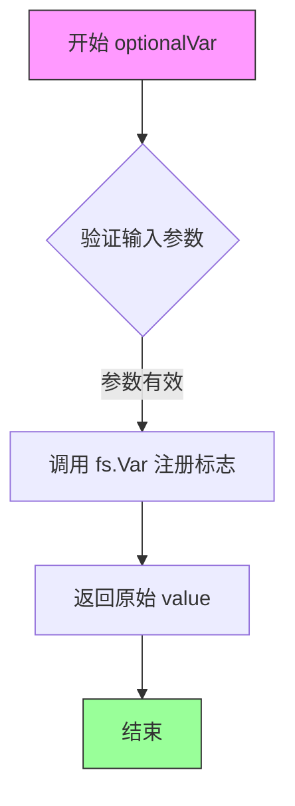
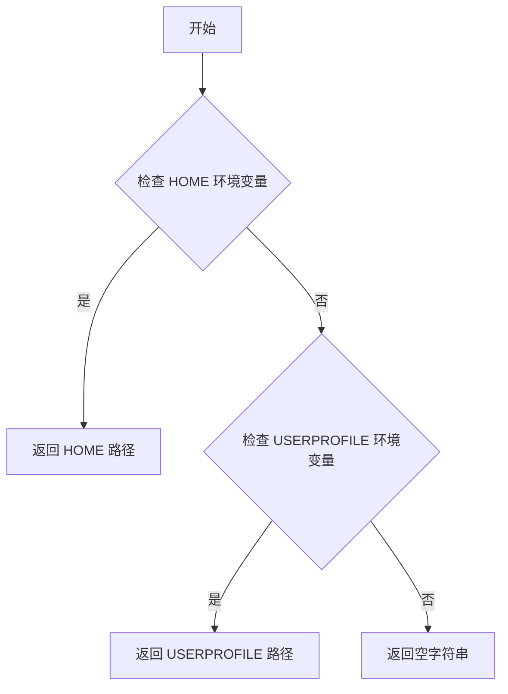
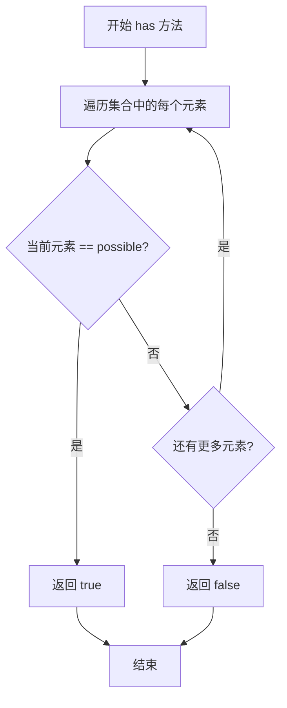
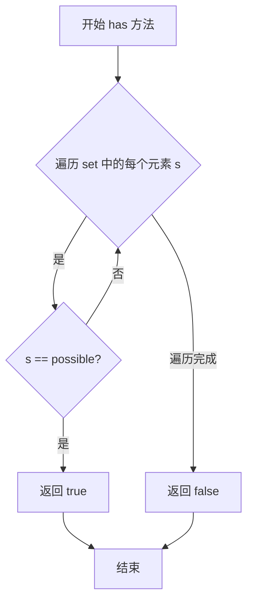
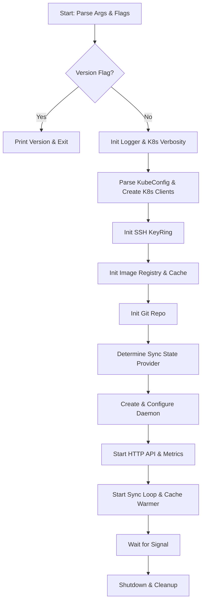

# `flux\cmd\fluxd\main.go` 详细设计文档

Flux Daemon (fluxd) 是 Flux CD 项目的核心组件,作为 Kubernetes 的一个控制平面组件运行。它负责从 Git 仓库拉取声明式的基础设施和应用配置(Manifests),将其部署到 Kubernetes 集群,并同时监听容器镜像仓库的变化,自动更新 Git 仓库中的镜像版本以实现自动化部署。

## 整体流程

```mermaid
graph TD
    Start[程序入口 main] --> ParseFlags[解析命令行参数与配置]
    ParseFlags --> InitLogger[初始化日志系统 (JSON/Fmt)]
    InitLogger --> InitK8sClient[初始化 Kubernetes 客户端 (Clientset, Dynamic, CRD)]
    InitK8sClient --> InitSSHKeyRing[初始化 SSH KeyRing (从 K8s Secret 或 Nop)]
    InitK8sClient --> InitCluster[初始化 Cluster 和 Manifests 操作器]
    InitCluster --> InitRegistry[初始化镜像仓库客户端 (Cache, Memcached, AWS ECR)]
    InitRegistry --> InitGit[初始化 Git 仓库连接和轮询]
    InitGit --> InitSyncProvider[初始化状态同步提供者 (GitTag 或 Native)]
    InitSyncProvider --> InitDaemon[初始化核心 Daemon 实例]
    InitDaemon --> StartHTTPServer[启动 HTTP 服务器 (API + Metrics)]
    InitDaemon --> StartSyncLoop[启动同步循环与镜像预热器]
    StartHTTPServer --> WaitSignal[等待系统信号 (SIGINT/SIGTERM)]
    StartSyncLoop --> WaitSignal
    WaitSignal --> Shutdown[关闭通道与等待组清理]
```

## 类结构

```
Main Package (fluxd)
├── 配置与标志 (flags)
│   └── pflag.FlagSet (命令行参数)
├── 核心组件实例化
│   ├── kubernetes.Cluster (集群管理)
│   ├── manifests.Manifests (Manifest 生成/解析)
│   ├── registry.Registry (镜像仓库)
│   ├── git.Repo (Git 仓库抽象)
│   ├── daemon.Daemon (核心同步循环)
│   └── cache.Warmer (镜像缓存预热)
└── 辅助类型定义
    └── stringset (自定义字符串切片类型)
```

## 全局变量及字段


### `version`
    
程序版本号

类型：`string`
    


### `product`
    
产品名称常量 (weave-flux)

类型：`const string`
    


### `RequireValues`
    
强制的仓库认证要求列表

类型：`[]string`
    


### `RequireECR`
    
需要 ECR 认证的标识

类型：`const string`
    


### `k8sInClusterSecretsBaseDir`
    
K8s InCluster 密钥基础目录

类型：`const string`
    


### `defaultRemoteConnections`
    
默认远程连接数/速率限制 Burst 值

类型：`const int`
    


### `defaultGitSyncTag`
    
默认 Git 同步标签

类型：`const string`
    


### `defaultGitNotesRef`
    
默认 Git Notes 引用

类型：`const string`
    


### `defaultGitSkipMessage`
    
默认 CI 跳过消息

类型：`const string`
    


### `main (Package Scope).version`
    
程序版本号

类型：`string`
    


### `main (Package Scope).product`
    
产品名称常量 (weave-flux)

类型：`const string`
    


### `main (Package Scope).RequireValues`
    
强制的仓库认证要求列表

类型：`[]string`
    


### `main (Package Scope).k8sInClusterSecretsBaseDir`
    
K8s InCluster 密钥基础目录

类型：`const string`
    


### `main (Package Scope).defaultRemoteConnections`
    
默认远程连接数/速率限制 Burst 值

类型：`const int`
    


### `main (Package Scope).defaultGitSyncTag`
    
默认 Git 同步标签

类型：`const string`
    


### `main (Package Scope).defaultGitNotesRef`
    
默认 Git Notes 引用

类型：`const string`
    


### `main (Package Scope).defaultGitSkipMessage`
    
默认 CI 跳过消息

类型：`const string`
    
    

## 全局函数及方法


### `optionalVar`

这是一个辅助函数，用于向 pflag.FlagSet 注册一个可选值标志（使用 ssh.OptionalValue 接口），并返回该值以便后续直接使用。

参数：

- `fs`：`*pflag.FlagSet`，pflag 的 FlagSet 指针，用于管理命令行标志
- `value`：`ssh.OptionalValue`，可选值的指针，实现了 pflag 的 Value 接口，用于存储和解析命令行参数值
- `name`：`string`，命令行标志的名称
- `usage`：`string`，命令行标志的使用说明文本

返回值：`ssh.OptionalValue`，返回传入的可选值，以便调用者可以直接使用该值

#### 流程图



#### 带注释源码

```go
// optionalVar 是一个辅助函数，用于向 pflag.FlagSet 注册一个可选值标志
// 参数：
//   - fs: pflag 的 FlagSet 指针，用于管理命令行标志
//   - value: 可选值的指针，实现了 pflag 的 Value 接口
//   - name: 命令行标志的名称
//   - usage: 命令行标志的使用说明文本
//
// 返回值：
//   - 返回传入的 value，以便调用者可以直接使用该值进行后续操作
func optionalVar(fs *pflag.FlagSet, value ssh.OptionalValue, name, usage string) ssh.OptionalValue {
	// 将值注册到 FlagSet 中，name 作为标志名，usage 作为帮助文本
	fs.Var(value, name, usage)
	// 返回原始的可选值，供调用者直接引用
	return value
}
```


### `homeDir`

获取当前用户的主目录路径，支持跨平台（Linux/Unix 和 Windows）的主目录检测。

参数： 无

返回值：`string`，返回检测到的用户主目录路径；如果未检测到则返回空字符串。

#### 流程图



#### 带注释源码

```go
// homeDir 检测并返回当前用户的主目录路径
// 优先级：
// 1. 先检查 Linux/Unix 系统的 HOME 环境变量
// 2. 再检查 Windows 系统的 USERPROFILE 环境变量
// 3. 如果都未设置，返回空字符串
func homeDir() string {
	// nix
	// 检查 Linux/Unix 系统的 HOME 环境变量
	if h := os.Getenv("HOME"); h != "" {
		return h
	}
	// windows
	// 检查 Windows 系统的 USERPROFILE 环境变量
	if h := os.Getenv("USERPROFILE"); h != "" {
		return h
	}
	// 如果都未找到，返回空字符串
	return ""
}
```


### `stringset.has`

检查字符串集合中是否包含指定的字符串值。

参数：

- `possible`：`string`，要检查是否存在于集合中的字符串

返回值：`bool`，如果集合中包含该字符串返回 `true`，否则返回 `false`

#### 流程图



#### 带注释源码

```go
// stringset 是 string 类型的切片别名，用于表示字符串集合
type stringset []string

// has 方法检查字符串集合中是否包含指定的字符串
// 参数 possible: 要检查是否存在的字符串
// 返回值: 如果找到返回 true，否则返回 false
func (set stringset) has(possible string) bool {
    // 遍历集合中的每个字符串
    for _, s := range set {
        // 如果当前字符串与目标字符串相等
        if s == possible {
            // 找到匹配，返回 true
            return true
        }
    }
    // 遍历完毕未找到匹配，返回 false
    return false
}
```


### `stringset.has`

检查字符串集合中是否包含指定的字符串。

参数：

- `possible`：`string`，待检查的字符串

返回值：`bool`，如果集合中包含该字符串返回 true

#### 流程图



#### 带注释源码

```go
// stringset 是 []string 的类型别名，用于表示字符串集合
type stringset []string

// has 方法检查字符串集合中是否包含指定的字符串
// 参数 possible: 待检查的字符串
// 返回值: 如果集合中包含该字符串返回 true，否则返回 false
func (set stringset) has(possible string) bool {
	// 遍历集合中的每个元素
	for _, s := range set {
		// 如果找到匹配的元素，立即返回 true
		if s == possible {
			return true
		}
	}
	// 遍历完所有元素都没有找到匹配，返回 false
	return false
}
```


### 1. 代码核心功能概述
该代码是 Flux（GitOps Kubernetes 连续交付工具）的核心守护进程 `fluxd` 的主程序入口。它负责初始化并连接 Kubernetes 集群、Git 仓库以及容器镜像仓库，通过监听 Git 变化和镜像更新，自动或手动将变更同步至集群，并提供 HTTP API 供上游服务调用。

### 2. 文件整体运行流程
1.  **初始化与配置解析**：解析命令行参数（使用 `pflag`），设置日志格式、Kubernetes 认证信息、Git 仓库配置及镜像仓库策略。
2.  **核心组件初始化**：
    *   **Kubernetes 客户端**：构建 REST 客户端、Dynamic 客户端、Helm Operator 客户端及 CRD 客户端。
    *   **密钥环**：根据是否在集群内运行，初始化 SSH 密钥环或 Nop 密钥环。
    *   **镜像仓库**：配置 Memcached 缓存、AWS ECR 认证及镜像扫描策略。
    *   **Git 仓库**：初始化 Git 仓库连接和轮询机制。
3.  **守护进程启动**：创建 `daemon.Daemon` 实例，启动同步循环（Sync Loop）和镜像预热循环（Warmer Loop）。
4.  **服务监听**：启动 HTTP 服务器，提供 `/api/flux` 和 `/metrics` 端点。
5.  **生命周期管理**：监听系统信号（SIGINT/SIGTERM），等待关闭信号，清空资源并优雅退出。

### 3. 类的详细信息

#### 3.1 全局变量与常量

| 名称 | 类型 | 描述 |
| :--- | :--- | :--- |
| `version` | `string` | 当前的版本号，默认为 "unversioned" |
| `product` | `string` | 产品名称常量 "weave-flux" |
| `defaultRemoteConnections` | `int` | 速率限制的 Burst 值，同时限制并发获取数 |
| `defaultGitSyncTag` | `string` | 默认的 Git 同步标签 "flux-sync" |
| `defaultGitNotesRef` | `string` | 默认的 Git Notes 引用 "flux" |
| `RequireECR` | `string` | 强制要求 ECR 认证的标识符 "ecr" |
| `k8sInClusterSecretsBaseDir` | `string` | Kubernetes InCluster 模式下的密钥目录 |
| `RequireValues` | `[]string` | 支持的 registry 强制认证选项列表 |

#### 3.2 全局函数

| 函数名 | 参数 | 返回值 | 描述 |
| :--- | :--- | :--- | :--- |
| `optionalVar` | `fs *pflag.FlagSet`, `value ssh.OptionalValue`, `name string`, `usage string` | `ssh.OptionalValue` | 辅助函数，用于向 FlagSet 注册可选值并返回该值。 |
| `stringset.has` | `possible string` | `bool` | 辅助方法，用于检查字符串切片中是否包含特定字符串。 |
| `homeDir` | 无 | `string` | 跨平台获取用户主目录的辅助函数。 |

---

### 4. 关键组件信息

| 组件名称 | 描述 |
| :--- | :--- |
| **Kubernetes Client** | 负责与 K8s API Server 交互，包括动态客户端（处理自定义资源）和 Helm Operator 客户端。 |
| **Git Repo** | 封装了 Git 仓库的克隆、拉取、推送及 Commit 操作，是 GitOps 状态存储的核心。 |
| **Daemon** | 核心业务逻辑组件，包含同步循环（Sync Loop）和自动化镜像更新逻辑。 |
| **Registry/Cache** | 包含镜像缓存客户端（Memcached）和远程仓库工厂，用于扫描和缓存容器镜像元数据。 |
| **HTTP Server** | 提供 RESTful API 供外部（如 Weave Cloud）调用，并暴露 Prometheus 监控指标。 |

---

### 5. 潜在的技术债务与优化空间

1.  **函数体积过大**：`main` 函数极其庞大，包含了所有组件的初始化逻辑。这违反了 Go 的惯用做法（通常将初始化逻辑剥离到 `NewXXX` 函数或结构体中），导致代码难以测试和维护。
2.  **错误处理分散**：虽然有日志记录，但大量的 `os.Exit(1)` 导致程序直接退出，缺乏统一的退出码管理和可能的重试机制。
3.  **Flag 定义与业务逻辑耦合**：大量的 `pflag` 定义穿插在初始化逻辑中，且存在大量标记为 `Deprecated` 的兼容性处理逻辑，随着版本迭代会越来越臃肿。
4.  **硬编码与 Magic Numbers**：例如 `image.Name` channel 的 buffer 大小 (`100`) 或 `QPS`/`Burst` 的值虽已提取为变量，但缺乏配置说明。

---

### 6. `main` 函数详细设计

#### 6.1 基本信息
- **名称**: `main`
- **参数**: 无
- **返回值**: `void`
- **描述**: 主入口函数，包含了所有初始化逻辑、组件组装以及服务启动逻辑。

#### 6.2 流程图



#### 6.3 带注释源码

```go
func main() {
	// --- 1. Flag 定义与解析 ---
	fs := pflag.NewFlagSet("default", pflag.ContinueOnError)
	// ... 定义大量 flags (git-url, k8s-args, registry-args 等) ...
	
	// 解析命令行参数
	err := fs.Parse(os.Args[1:])
	// 处理错误、Version 标志等
	
	// --- 2. 日志系统初始化 ---
	var logger log.Logger
	// 根据 --log-format (json/fmt) 初始化日志
	logger = log.With(logger, "ts", log.DefaultTimestampUTC, "caller", log.DefaultCaller)
	logger.Log("version", version)

	// --- 3. Kubernetes 客户端初始化 ---
	// 构建 REST Config (支持 KubeConfig 文件或 InCluster 模式)
	restClientConfig, err := clientcmd.BuildConfigFromFlags(...)
	restClientConfig.QPS = 50.0
	restClientConfig.Burst = 100

	// 创建多种 K8s Client (Clientset, Dynamic, Helm, CRD)
	clientset, _ := k8sclient.NewForConfig(restClientConfig)
	dynamicClientset, _ := k8sclientdynamic.NewForConfig(...)
	hrClientset, _ := helmopclient.NewForConfig(...)
	crdClient, _ := crd.NewForConfig(...)

	// --- 4. SSH KeyRing 初始化 ---
	// 检测是否在集群内，如果是则尝试挂载 Secret 中的 SSH Key
	var sshKeyRing ssh.KeyRing
	isInCluster := checkInCluster(...)
	if isInCluster && !httpGitURL {
		sshKeyRing, err = kubernetes.NewSSHKeyRing(...)
	} else {
		sshKeyRing = ssh.NewNopSSHKeyRing()
	}

	// --- 5. 镜像仓库与缓存初始化 ---
	// 配置 Memcached 客户端用于缓存
	memcacheClient := registryMemcache.NewMemcacheClient(...)
	
	// 构建 ImageRegistry (带缓存层)
	imageRegistry := &cache.Cache{Reader: memcacheClient, ...}
	
	// AWS ECR 认证处理
	awsConf := registry.AWSRegistryConfig{...}
	imageCreds = registry.ImageCredsWithAWSAuth(imageCreds, ...)

	// --- 6. Git 仓库初始化 ---
	gitRemote := git.Remote{URL: *gitURL}
	gitConfig := git.Config{...}
	repo := git.NewRepo(gitRemote, ...)

	// 后台启动 Git 同步
	shutdownWg.Add(1)
	go func() {
		err := repo.Start(shutdown, shutdownWg)
		// ...
	}()

	// --- 7. Sync Provider 选择 ---
	// 根据 --sync-state 选择使用 GitTag 还是 Native (K8s ConfigMap) 存储状态
	var syncProvider fluxsync.State
	switch *syncState {
	case fluxsync.NativeStateMode:
		// 读取 namespace 并创建 native sync provider
	case fluxsync.GitTagStateMode:
		// 使用 Git Tag 存储状态
	}

	// --- 8. Daemon 实例化 ---
	daemon := &daemon.Daemon{
		Cluster:                   k8s,
		Manifests:                 k8sManifests,
		Registry:                  imageRegistry,
		Repo:                      repo,
		// ... 配置大量业务参数
	}

	// --- 9. HTTP 服务启动 ---
	// 启动主 API 监听
	go func() {
		mux := http.DefaultServeMux
		mux.Handle("/metrics", promhttp.Handler())
		handler := daemonhttp.NewHandler(daemon, ...)
		mux.Handle("/api/flux/", handler)
		errc <- http.ListenAndServe(*listenAddr, mux)
	}()

	// --- 10. 循环与服务启动 ---
	// 启动同步循环 (核心业务逻辑)
	shutdownWg.Add(1)
	go daemon.Loop(shutdown, shutdownWg, ...)

	// 启动缓存预热器 (如果未禁用)
	if !*registryDisableScanning {
		shutdownWg.Add(1)
		go cacheWarmer.Loop(...)
	}

	// --- 11. 等待退出信号 ---
	logger.Log("exiting", <-errc)
	close(shutdown)
	shutdownWg.Wait()
}
```

## 关键组件


### Git远程仓库管理 (git.Remote)

负责管理与Git仓库的连接，包括URL解析和HTTP/HTTPS/SSH协议识别

### Git配置管理 (git.Config)

存储Git操作所需的配置信息，包括分支路径、提交者信息、GPG签名密钥等

### Kubernetes集群客户端 (kubernetes.NewCluster)

创建Kubernetes集群实例，负责与APIserver交互，执行资源同步和垃圾回收

### 镜像注册表系统 (registry.Registry)

提供容器镜像的查询和缓存功能，支持多种镜像仓库（包括ECR）

### 镜像缓存预热器 (cache.Warmer)

后台定期刷新镜像缓存，维持镜像元数据的时效性

### Memcached缓存客户端 (registryMemcache.MemcacheClient)

为镜像缓存提供分布式内存缓存支持，提高镜像查询性能

### 同步状态提供者 (fluxsync.State)

抽象同步状态存储接口，支持Git标签模式和原生状态模式两种同步方式

### 主守护进程 (daemon.Daemon)

Flux核心组件，协调Git仓库轮询、镜像更新检测、集群同步等核心业务逻辑

### 任务队列 (job.Queue)

管理异步任务执行，支持并发控制和任务状态跟踪

### HTTP API服务 (daemonhttp.Handler)

提供RESTful API接口，供外部系统调用和查询Flux状态

### 上游服务连接器 (daemonhttp.NewUpstream)

建立与Weave Cloud等上游服务的WebSocket连接，实现远程控制和事件上报

### SSH密钥环管理 (ssh.KeyRing)

处理SSH密钥生成、加载和存储，用于Git操作的认证

### GPG密钥管理 (gpg)

导入和管理GPG密钥，用于Git提交签名和验证

### 命令行标志解析系统 (pflag)

解析所有运行时配置选项，包括Git、Registry、Kubernetes等模块的配置参数

### Kubernetes清单生成器 (manifests.Manifests)

生成和管理Kubernetes资源清单，支持原生YAML和SOPS加密格式

### 速率限制器 (registryMiddleware.RateLimiters)

控制对镜像仓库的请求频率，防止触发仓库限流策略


## 问题及建议


### 已知问题

-   **main函数过于庞大**：整个`main()`函数超过800行，违反了单一职责原则，将配置解析、Kubernetes初始化、组件创建、服务启动等所有逻辑都堆砌在一起，导致代码难以维护、测试和理解。
-   **缺乏模块化设计**：所有功能都在单个文件中，没有将配置解析、组件初始化、服务启动等逻辑分离到独立的包或模块中。
-   **错误处理不一致**：多处使用`os.Exit(1)`直接终止程序，而非返回错误或使用优雅关闭机制，导致无法在测试中捕获这些退出点，也无法实现平滑关闭。
-   **硬编码的魔法数字**：如`restClientConfig.QPS = 50.0`、`restClientConfig.Burst = 100`、`ImageRefresh`通道容量`100`、`JobStatusCache`大小`100`等，缺乏配置化或常量定义。
-   **并发控制缺乏灵活性**：`registryBurst`既用于速率限制又用于memcached连接数，这种耦合设计不够灵活，且无法根据实际运行环境调整。
-   **缺少配置验证**：在解析参数后缺乏全面的配置校验，例如`gitURL`为空时的处理逻辑分散在不同地方。
-   **存在已弃用的标志处理负担**：代码中保留了多个已弃用标志的处理逻辑（如`registry-cache-expiry`、`k8s-namespace-whitelist`、`git-verify-signatures`等），增加了代码复杂度和维护成本。
-   **日志系统混用**：同时使用了klog和go-kit logger，两者职责有重叠，且在某些地方日志级别控制不够精细。
-   **Kubernetes客户端初始化冗余**：对`rest.Config`进行了多次复制和修改（如`noWarningsRestClientConfig`），且discovery client的缓存逻辑与主客户端创建紧耦合。
-   **资源清理不完善**：`defer memcacheClient.Stop()`位于初始化逻辑中间，而非与创建位置相近，且缺少对其他资源（如git repo、daemon等）的显式清理调用。

### 优化建议

-   **重构main函数**：将配置解析、组件初始化、服务启动等逻辑提取到独立的函数或包中，例如创建`parseFlags()`、`setupKubernetes()`、`createDaemon()`、`startServer()`等函数。
-   **引入配置对象**：创建结构体来管理配置，将相关的命令行参数分组，减少全局变量的使用。
-   **统一错误处理策略**：定义统一的错误处理方式，考虑使用自定义的error类型或错误包装，避免直接调用`os.Exit()`，改用返回错误让调用者决定如何处理。
-   **配置化并发参数**：将`QPS`、`Burst`、缓存大小等参数通过命令行标志或配置文件暴露，便于根据环境调优。
-   **添加配置验证**：在解析完所有参数后，添加一个集中的配置验证函数，检查必填参数、相互冲突的标志组合等。
-   **简化弃用标志处理**：对于已弃用的标志，可以考虑在较新版本中完全移除，或将其指向新标志的别名逻辑简化。
-   **统一日志框架**：评估是否需要同时使用klog和go-kit logger，或选择一个更合适的日志库，或明确两者的使用边界。
-   **添加接口和依赖注入**：将Kubernetes客户端、Git仓库、镜像仓库等依赖抽象为接口，便于单元测试和替换实现。
-   **完善资源生命周期管理**：使用`context.Context`来管理服务生命周期，确保所有资源能够正确启动和关闭。
-   **添加健康检查和就绪检查**：HTTP服务缺乏健康检查端点，建议添加`/healthz`和`/readyz`端点。
-   **添加单元测试**：当前代码难以进行单元测试，建议重构后添加针对配置解析、组件初始化等核心逻辑的测试。


## 其它


### 设计目标与约束

本代码是fluxd（Flux daemon），核心设计目标是实现GitOps工作流程自动化：持续监听Git仓库中的Kubernetes manifests变化并同步到集群，同时定期扫描容器镜像仓库以实现自动化镜像更新。约束条件包括：必须能够访问Kubernetes API、Git仓库（支持SSH/HTTP/HTTPS协议）、目标容器镜像仓库；支持在Kubernetes集群内（使用ServiceAccount）和集群外（使用kubeconfig）两种部署模式；需要配置SSH密钥或GPG密钥用于Git操作签名。

### 错误处理与异常设计

程序采用分层错误处理策略：(1) 致命错误使用logger.Log("err", ...)记录后调用os.Exit(1)立即终止；(2) Kubernetes客户端错误通过k8sruntime.ErrorHandlers统一处理，其中非Forbidden/NotFound错误会被记录，避免日志泛滥；(3) 可恢复错误（如网络超时）通过重试机制处理，体现在各组件的循环逻辑中；(4) 信号处理捕获SIGINT/SIGTERM触发优雅关闭，errc通道传递退出信号。错误信息格式统一为"msg"+"err"键值对，便于日志检索。

### 数据流与状态机

主程序数据流如下：启动阶段(解析flags→初始化logger→验证参数→创建Kubernetes客户端)→组件初始化阶段(创建cluster/manifets/registry/git/repo等组件)→启动后台goroutines(repo.Start/daemon.Loop/cacheWarmer.Loop)→HTTP服务监听→等待shutdown信号→清理资源。状态转换：Initializing→Running→ShuttingDown→Exited。关键数据流向：Git仓库→repo.Ready→daemon.Loop→Cluster.Apply→Kubernetes API；镜像仓库→cacheWarmer→daemon.AskForAutomatedWorkloadImageUpdates→Job Queue→镜像自动化更新。

### 外部依赖与接口契约

核心依赖包括：(1) Kubernetes相关：k8s.io/client-go（集群交互）、k8s.io/apiextensions-apiserver（CRD支持）、helm-operator客户端（Helm操作）；(2) Git操作：github.com/fluxcd/flux/pkg/git（仓库克隆/提交/推送）；(3) 镜像仓库：github.com/fluxcd/flux/pkg/registry（支持Docker Hub/ECR/GCR等）；(4) 监控：github.com/prometheus/client_golang/prometheus（指标导出）；(5) 日志：github.com/go-kit/kit/log（结构化日志）；(6) 配置：spf13/pflag（命令行参数解析）。所有客户端使用rest.Config进行配置，QPS设置为50，Burst为100。

### 安全性设计

安全机制涵盖多层面：(1) 通信安全：支持registryInsecure配置允许HTTP回退（明确警告中间人攻击风险）；(2) 身份认证：支持Kubernetes ServiceAccount（集群内）、kubeconfig（集群外）、Dockerconfig（镜像仓库认证）、AWS ECR认证；(3) Git操作安全：SSH密钥（存储在k8s Secret或文件系统）、GPG密钥导入与签名验证（支持VerifySignaturesModeNone/All/FirstParent）；(4) 资源访问控制：k8sAllowNamespace/k8sExcludeResource限制操作范围；(5) 只读模式：gitReadonly防止意外修改Git仓库。

### 并发与同步机制

程序使用Go并发模型：(1) goroutines：repo.Start、daemon.Loop、cacheWarmer.Loop、HTTP服务、各一个signal监听goroutine；(2) WaitGroup：shutdownWg用于等待所有后台goroutine优雅退出；(3) 通道：shutdown（struct{}）发送关闭信号、errc（error）传递错误、ImageRefresh（image.Name）传递镜像更新；(4) 互斥锁：job.Queue内部使用互斥锁保护任务队列；(5) 同步点：daemon.Loop内部协调git同步、镜像扫描、集群同步三个子循环。cacheWarmer.Notify指向daemon.AskForAutomatedWorkloadImageUpdates实现生产者-消费者模式。

### 性能优化措施

代码包含多项性能考量：(1) 速率限制：registryRPS（默认50）和registryBurst（默认10）限制镜像仓库请求；(2) 缓存：使用memcached缓存镜像元数据，cacheWarmer预热缓存；(3) 资源限制：QPS/Burst限制Kubernetes API调用；(4) 并发控制：syncGC/syncTimeout防止长时间同步操作；(5) 延迟初始化：registryDisableScanning=true时跳过镜像扫描组件；(6) 连接池：memcached MaxIdleConns等于burst值；(7) 禁用警告：dynamic client配置NoWarnings避免deprecation日志。

### 配置管理设计

配置通过pflag实现：(1) 命名风格：使用kebab-case（如git-poll-interval），自动生成短选项（如-l对应listen）；(2) 默认值维护：保持向后兼容，某些默认值不可更改（如defaultGitSyncTag）；(3) 废弃标志：fs.MarkDeprecated标记废弃选项并提供迁移路径；(4) 互相依赖：git-label覆盖git-sync-tag和git-notes-ref；registry-poll-interval被automation-interval取代；(5) 验证逻辑：git-path不能以/开头、registry-require值必须在AllowValues中。配置优先级：命令行flags > 环境变量 > 配置文件 > 默认值。

### 监控与可观测性

可观测性支持包括：(1) Prometheus指标：/metrics端点导出HTTP请求指标，listenMetricsAddr可分离指标监听地址；(2) 结构化日志：go-kit日志格式包含ts（时间戳UTC）、caller（调用位置）；(3) Kubernetes日志：klog处理k8s客户端内部日志，捕获调用位置（隐藏/ast/k8s.io/路径前缀）；(4) pprof支持：import _ "net/http/pprof"启用性能分析；(5) 自定义组件标签：logger.With添加component标签区分cluster/daemon/registry/memcached等模块日志。version变量记录构建版本，checkpoint模块支持版本更新检查。

### 资源清理与生命周期

资源管理策略：(1) 启动：errc通道接收信号或HTTP错误，触发主程序退出；(2) 关闭流程：close(shutdown)广播关闭信号→各goroutine检测shutdown通道→shutdownWg.Wait()等待完成→程序退出；(3) 资源释放：defer memcacheClient.Stop()确保memcached连接池关闭；(4) 状态持久化：syncProvider（GitTagStateMode/NativeStateMode）保存同步状态到Git tags或Kubernetes ConfigMap/Secret。daemon.JobStatusCache内存缓存最近100个任务状态。

### 扩展性与插件化

设计支持多维度扩展：(1) Manifests生成：manifestGeneration启用时扫描.flux.yaml文件；(2) SOPS支持：sopsEnabled启用时解密SOPS加密文件；(3) 镜像仓库：RemoteClientFactory支持自定义InsecureHosts，可扩展其他仓库类型；(4) 同步状态：支持GitTagStateMode和NativeStateMode两种方式；(5) Git签名：支持GPG密钥导入和多种签名验证模式；(6) 自定义kubectl：kubernetesKubectl允许指定外部kubectl路径。daemon.Daemon结构体可嵌入扩展更多功能。


    