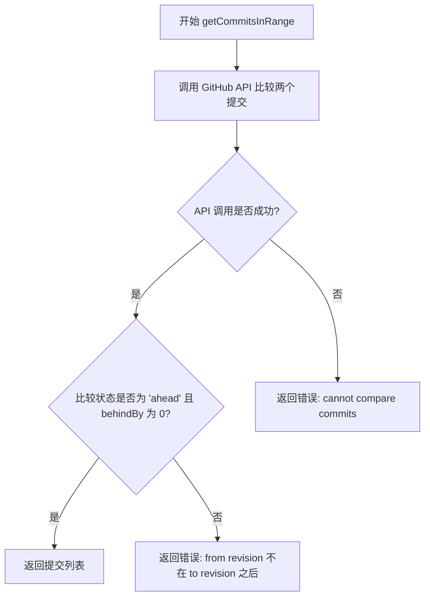
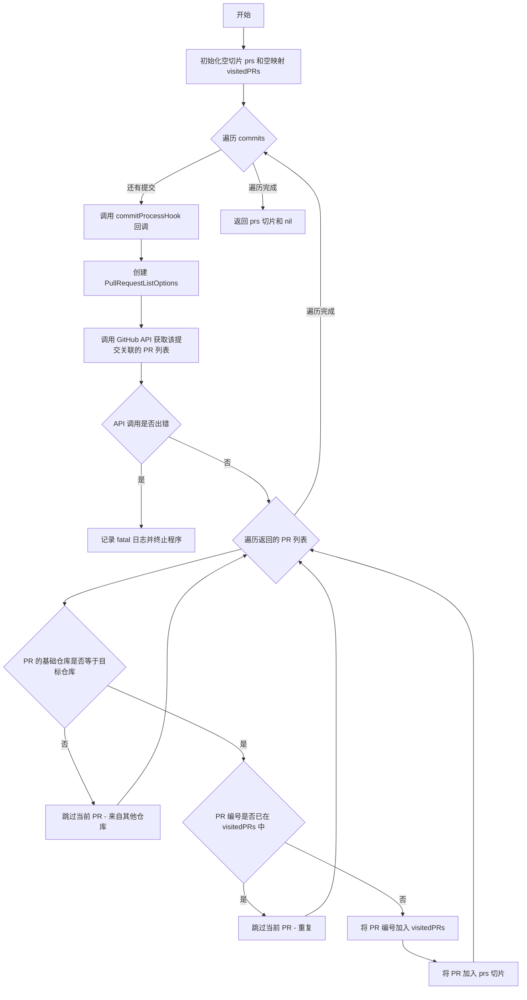
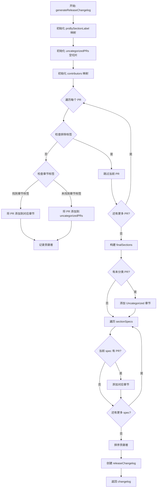
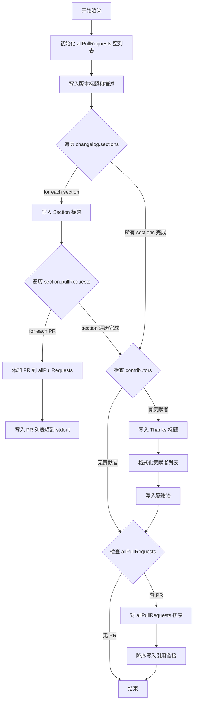
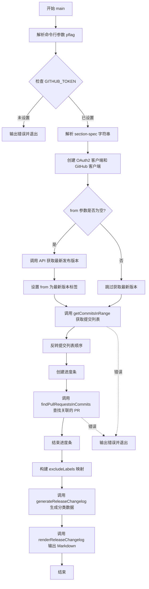

# `flux\internal\cmd\changelog\main.go` 详细设计文档

这是一个命令行工具，用于生成 GitHub 仓库的发布变更日志（Release Changelog）。它通过 GitHub API 获取指定 Git 修订范围（如版本标签）之间的提交，查找这些提交关联的 Pull Request，根据标签对 PR 进行分类，并输出格式化的 Markdown 变更日志。

## 整体流程

```mermaid
graph TD
    A[开始] --> B[解析命令行参数]
B --> C{是否提供 --from 参数?}
C -- 否 --> D[调用 GitHub API 获取最新发布版本标签]
C -- 是 --> E[直接使用提供的 --from 值]
D --> E
E --> F[调用 getCommitsInRange 获取提交列表]
F --> G{比较状态是否为 'ahead' 且 behindBy 为 0?}
G -- 否 --> H[抛出错误：from 修订版不在 to 之前]
G -- 是 --> I[反转提交列表（从新到旧）]
I --> J[创建进度条]
J --> K[调用 findPullRequestsInCommits 查找关联的 PR]
K --> L[遍历每个提交]
L --> M{提交关联的 PR 是否属于目标仓库?}
M -- 否 --> N[跳过该 PR]
M -- 是 --> O{该 PR 是否已处理过?]
O -- 是 --> P[跳过（避免重复）]
O -- 否 --> Q[添加到 PR 列表并标记为已访问]
Q --> L
L --> R[调用 generateReleaseChangelog 生成分类后的变更日志]
R --> S[遍历 PR 按标签分类]
S --> T{PR 是否有排除标签?}
T -- 是 --> U[跳过该 PR]
T -- 否 --> V{PR 标签是否匹配预定义分类?}
V -- 是 --> W[添加到对应分类的 PR 列表]
V -- 否 --> X[添加到未分类列表]
W --> Y[收集贡献者用户名]
X --> Y
Y --> Z[调用 renderReleaseChangelog 输出 Markdown 格式的变更日志]
Z --> AA[输出版本号和描述]
AA --> AB[遍历各分类输出 PR 列表]
AB --> AC[输出贡献者感谢信息]
AC --> AD[输出 PR 引用链接]
AD --> AE[结束]
```

## 类结构

```
releaseChangelog (结构体)
├── sections: []changelogSection
└── contributorUserNames: []string
changelogSection (结构体)
├── title: string
└── pullRequests: []*github.PullRequest
sectionSpec (结构体)
├── label: string
└── title: string
sorteablePRs (自定义排序类型，实现 sort.Interface)
└── 基于 PR 编号排序
```

## 全局变量及字段


### `uncategorizedSectionTitle`
    
未分类部分的默认标题常量，值为 'Uncategorized'

类型：`const string`
    


### `from`
    
命令行标志，git revision 起始点

类型：`*string`
    


### `to`
    
命令行标志，git revision 结束点，默认为 'master'

类型：`*string`
    


### `gitHubOrg`
    
命令行标志，GitHub 组织名，默认为 'fluxcd'

类型：`*string`
    


### `gitHubRepo`
    
命令行标志，GitHub 仓库名，默认为 'flux'

类型：`*string`
    


### `excludeLabelStrings`
    
命令行标志，需要排除的标签列表，默认为 ['helm-chart']

类型：`*[]string`
    


### `sectionSpecStrings`
    
命令行标志，分类规范字符串列表

类型：`*[]string`
    


### `token`
    
从环境变量 GITHUB_TOKEN 获取的认证令牌

类型：`string`
    


### `sectionSpecs`
    
解析后的分类规范列表

类型：`[]sectionSpec`
    


### `excludeLabels`
    
排除标签的映射集合

类型：`map[string]struct{}`
    


### `latestRelease`
    
最新发布版本信息（当未提供 --from 时）

类型：`*github.RepositoryRelease`
    


### `commits`
    
获取的提交列表

类型：`[]github.RepositoryCommit`
    


### `prs`
    
关联的 PR 列表

类型：`*[]github.PullRequest`
    


### `changelog`
    
生成的变更日志对象

类型：`releaseChangelog`
    


### `progressBar`
    
进度条实例

类型：`*pb.ProgressBar`
    


### `ctx`
    
上下文对象

类型：`context.Context`
    


### `ts`
    
OAuth2 静态令牌源

类型：`oauth2.TokenSource`
    


### `tc`
    
OAuth2 客户端配置

类型：`*oauth2.Config`
    


### `client`
    
GitHub API 客户端

类型：`*github.Client`
    


### `releaseChangelog.sections`
    
存储分类后的变更日志部分

类型：`[]changelogSection`
    


### `releaseChangelog.contributorUserNames`
    
按字母顺序排序的贡献者用户名列表

类型：`[]string`
    


### `changelogSection.title`
    
部分的标题（如 'Bug Fixes', 'Enhancements'）

类型：`string`
    


### `changelogSection.pullRequests`
    
该部分包含的 PR 列表

类型：`*[]github.PullRequest`
    


### `sectionSpec.label`
    
GitHub 标签名称

类型：`string`
    


### `sectionSpec.title`
    
变更日志中显示的标题

类型：`string`
    
    

## 全局函数及方法


### `getCommitsInRange`

该函数用于获取两个 Git 修订版本之间的提交列表，通过调用 GitHub API 比较两个提交来确定差异，并返回从起始修订到目标修订之间的所有提交。

参数：

- `ctx`：`context.Context`，用于控制请求的上下文和取消操作
- `ghClient`：`*github.Client`，GitHub API 客户端，用于执行 GitHub 相关操作
- `gitHubOrg`：`string`，GitHub 组织名称
- `gitHubRepo`：`string`，GitHub 仓库名称
- `fromRevision`：`string`，起始修订版本（如标签或提交 SHA）
- `toRevision`：`string`，目标修订版本（如 "master" 或提交 SHA）

返回值：`([]github.RepositoryCommit, error)`，返回两个修订之间的提交列表；若起始修订不在目标修订之前或比较操作失败，则返回错误

#### 流程图



#### 带注释源码

```go
// getCommitsInRange 获取两个 Git 修订之间的提交列表
// 参数:
//   - ctx: context.Context 控制请求超时和取消
//   - ghClient: *github.Client GitHub API 客户端
//   - gitHubOrg: string GitHub 组织名
//   - gitHubRepo: string GitHub 仓库名
//   - fromRevision: string 起始修订版本
//   - toRevision: string 目标修订版本
//
// 返回值:
//   - []github.RepositoryCommit: 提交列表
//   - error: 操作过程中的错误信息
func getCommitsInRange(ctx context.Context, ghClient *github.Client, gitHubOrg string, gitHubRepo string,
	fromRevision string, toRevision string) ([]github.RepositoryCommit, error) {

	// 调用 GitHub API 比较两个提交，获取差异信息
	// 这会返回 fromRevision 到 toRevision 之间的所有提交
	comparison, _, err := ghClient.Repositories.CompareCommits(ctx, gitHubOrg, gitHubRepo, fromRevision, toRevision)
	if err != nil {
		// 如果 API 调用失败，返回格式化的错误信息
		return nil, fmt.Errorf("cannot compare commits from %q and to %q: %s", fromRevision, toRevision, err)
	}
	
	// 验证 fromRevision 确实在 toRevision 之后
	// Status 应该是 "ahead" 表示 toRevision 领先于 fromRevision
	// BehindBy 应该是 0 表示 fromRevision 不落后于 toRevision
	if comparison.GetStatus() != "ahead" || comparison.GetBehindBy() != 0 {
		return nil, fmt.Errorf("'from' revision (%s) is not behind 'to' revision (%s)", fromRevision, toRevision)
	}
	
	// 返回比较结果中的提交列表
	return comparison.Commits, nil
}
```

---

### 关键组件信息

| 组件名称 | 描述 |
|---------|------|
| `github.Client` | Go GitHub API 客户端库，用于与 GitHub REST API 交互 |
| `github.Repositories.CompareCommits` | GitHub API 方法，用于比较两个提交/分支/标签之间的差异 |
| `github.RepositoryCommit` | 表示 GitHub 上单个提交的数据结构 |

---

### 潜在的技术债务或优化空间

1. **缺少缓存机制**：每次调用都会请求 GitHub API，在大量调用时可能导致速率限制（rate limiting）
2. **错误处理不够细致**：使用 `fmt.Errorf` 返回错误，但调用方使用 `log.Fatalf` 直接终止程序，缺乏重试逻辑
3. **版本兼容性**：`github.com/google/go-github/v28` 使用较旧的 API 版本，新版本可能有更好的方法
4. **验证逻辑过于简单**：仅检查状态为 "ahead" 和 behindBy 为 0，未处理 "diverged" 等其他状态

---

### 其它项目

#### 设计目标与约束
- 验证起始修订必须在目标修订之前（线性历史）
- 依赖 GitHub API v3 的 Compare Commits 端点

#### 错误处理与异常设计
- API 调用失败时返回包含详细信息的错误
- 参数验证失败时返回格式化的错误信息

#### 数据流与状态机
- 输入：fromRevision 和 toRevision → 调用 GitHub API → 解析比较结果 → 返回提交列表

#### 外部依赖与接口契约
- 依赖 `github.com/google/go-github/v28/github` 包
- 依赖 `context.Context` 进行超时控制


### `findPullRequestsInCommits`

该函数用于在给定的提交列表中查找关联的 Pull Request。它遍历每个提交，调用 GitHub API 获取该提交关联的 PR 列表，并过滤掉来自其他仓库的 PR 和重复的 PR，最终返回按访问顺序排列的去重后的 Pull Request 列表。

参数：

- `ctx`：`context.Context`，用于控制请求的上下文和取消操作
- `ghClient`：`*github.Client`，GitHub API 客户端，用于调用 GitHub 接口
- `gitHubOrg`：`string`，GitHub 组织名称，用于指定仓库所属的组织
- `gitHubRepo`：`string`，GitHub 仓库名称，用于指定目标仓库
- `commits`：`[]github.RepositoryCommit`，提交列表，要在这些提交中查找关联的 PR
- `commitProcessHook`：`func()`，回调函数，每处理一个提交时被调用，通常用于更新进度条

返回值：

- `[]*github.PullRequest`：返回找到的 Pull Request 列表，按访问顺序排列且不包含重复项
- `error`：返回执行过程中的错误信息（注意：函数内部使用 `log.Fatalf` 处理错误，不会返回 error，但函数签名包含 error 返回值以保持一致性）

#### 流程图



#### 带注释源码

```go
func findPullRequestsInCommits(ctx context.Context, ghClient *github.Client, gitHubOrg string, gitHubRepo string,
	commits []github.RepositoryCommit, commitProcessHook func()) ([]*github.PullRequest, error) {
	// 存储按访问顺序获取的 Pull Request，用于防止重复添加
	prs := []*github.PullRequest{}
	// 使用映射记录已访问的 PR 编号，用于快速去重
	visitedPRs := map[int]struct{}{}
	// 遍历每个提交，查找关联的 Pull Request
	for _, commit := range commits {
		// 调用回调函数，通常用于更新进度条
		commitProcessHook()
		// 创建空的 PR 列表选项（此处未设置过滤条件）
		pullRequestListOptions := &github.PullRequestListOptions{}
		// 注意：此 API 会返回所有头部分支包含该提交的 PR
		//（即不仅仅是合并到目标仓库的 PR）。
		// 我们通过去重机制来处理这个问题。
		prsForCommit, _, err := ghClient.PullRequests.ListPullRequestsWithCommit(ctx,
			gitHubOrg, gitHubRepo, commit.GetSHA(), pullRequestListOptions)
		// 如果 API 调用失败，记录 fatal 日志并终止程序
		if err != nil {
			log.Fatalf("cannot list pull requests for commit %q: %s", commit.GetSHA(), err)
		}
		// 遍历该提交关联的所有 PR
		for _, pr := range prsForCommit {
			// 构建目标仓库的完整名称（格式：org/repo）
			repoFullName := gitHubOrg + "/" + gitHubRepo
			// 检查 PR 的基础仓库是否为目标仓库
			if pr.GetBase().GetRepo().GetFullName() != repoFullName {
				// 该提交来自指向其他仓库的 PR，我们不感兴趣，跳过
				continue
			}
			// 检查该 PR 是否已处理过（去重）
			if _, ok := visitedPRs[pr.GetNumber()]; ok {
				// 不添加重复的 PR
				continue
			}
			// 记录已处理的 PR 编号
			visitedPRs[pr.GetNumber()] = struct{}{}
			// 将 PR 添加到结果列表
			prs = append(prs, pr)
		}
	}
	// 返回找到的 PR 列表（无错误，返回 nil）
	return prs, nil
}
```


### `generateReleaseChangelog`

根据 PR 列表、排除标签和分类规范生成发布变更日志结构，将 PR 按标签分类到不同章节，并收集贡献者信息。

参数：

- `pullRequests`：`[]*github.PullRequest`，需要处理的所有 Pull Request 列表
- `exclusionLabels`：`map[string]struct{}`，需要排除的标签映射，用于过滤掉不应包含在变更日志中的 PR
- `sectionSpecs`：`[]sectionSpec`，章节规格列表，定义标签到章节标题的映射关系

返回值：`releaseChangelog`，包含分类后的章节列表和按字母排序的贡献者用户名列表

#### 流程图



#### 带注释源码

```go
// generateReleaseChangelog 根据 PR 列表、排除标签和分类规范生成变更日志结构
// 参数：
//   - pullRequests: 需要处理的 Pull Request 列表
//   - exclusionLabels: 需要排除的标签映射
//   - sectionSpecs: 章节规格列表
// 返回值：releaseChangelog 结构，包含章节列表和贡献者列表
func generateReleaseChangelog(pullRequests []*github.PullRequest,
	exclusionLabels map[string]struct{}, sectionSpecs []sectionSpec) releaseChangelog {

	// 创建一个映射，用于按标签存储 PRs，键为标签名称，值为该标签对应的 PR 切片
	prsBySectionLabel := map[string][]*github.PullRequest{}
	// 初始化每个 sectionSpec 的标签对应的空切片
	for _, spec := range sectionSpecs {
		prsBySectionLabel[spec.label] = nil
	}
	
	// 未分类的 PR 列表
	uncategorizedPRs := []*github.PullRequest{}
	// 贡献者映射，用于去重
	contributors := map[string]struct{}{}

	// 使用标签跳转实现嵌套循环的跳过
prLoop:
	// 遍历所有 PR 进行分类
	for _, pr := range pullRequests {
		sectionLabel := ""
		
		// 遍历 PR 的所有标签
		for _, label := range pr.Labels {
			// 检查当前标签是否在排除列表中
			if _, ok := exclusionLabels[label.GetName()]; ok {
				// 如果 PR 带有应排除的标签，则跳过此 PR
				continue prLoop
			}
			// 检查标签是否匹配预定义的章节
			if prs, ok := prsBySectionLabel[label.GetName()]; ok {
				// 找到预定义章节的 PR
				sectionLabel = label.GetName()
				// 将 PR 添加到对应章节
				prsBySectionLabel[sectionLabel] = append(prs, pr)
				break
			}
		}
		
		// 如果没有找到对应的章节标签，则添加到未分类列表
		if sectionLabel == "" {
			uncategorizedPRs = append(uncategorizedPRs, pr)
		}
		
		// 记录贡献者（使用 map 自动去重）
		contributors[pr.GetUser().GetLogin()] = struct{}{}
	}

	// 根据提供的规范排序章节（但从 uncategorized 开始）
	finalSections := []changelogSection{}
	
	// 如果有未分类的 PR，添加 Uncategorized 章节
	if len(uncategorizedPRs) > 0 {
		uncategorizedSection := changelogSection{uncategorizedSectionTitle, uncategorizedPRs}
		finalSections = append(finalSections, uncategorizedSection)
	}
	
	// 按 sectionSpecs 的顺序添加章节
	for _, ss := range sectionSpecs {
		// 只有当该章节有 PR 时才添加
		if len(prsBySectionLabel[ss.label]) > 0 {
			section := changelogSection{ss.title, prsBySectionLabel[ss.label]}
			finalSections = append(finalSections, section)
		}
	}

	// 按字母顺序排序贡献者
	var sortedContributors []string
	for c := range contributors {
		sortedContributors = append(sortedContributors, c)
	}
	sort.Strings(sortedContributors)

	// 构建最终的变更日志结构
	changelog := releaseChangelog{
		sections:             finalSections,
		contributorUserNames: sortedContributors,
	}

	return changelog
}
```


### `renderReleaseChangelog`

将 releaseChangelog 结构体中的变更日志内容渲染为 Markdown 格式，并输出到指定的 io.Writer。该函数会遍历所有变更日志 sections，生成带链接的 PR 列表，并按编号降序输出引用链接。

参数：

- `out`：`io.Writer`，输出目标，用于写入生成的 Markdown 内容
- `changelog`：`releaseChangelog`，包含变更日志的数据结构，包含 sections（变更分类）和 contributorUserNames（贡献者列表）

返回值：无（直接写入到 out Writer）

#### 流程图



#### 带注释源码

```go
// renderReleaseChangelog 将 releaseChangelog 渲染为 Markdown 格式并输出到指定 Writer
// 参数 out: io.Writer，用于输出 Markdown 内容
// 参数 changelog: releaseChangelog，包含要渲染的变更日志数据
func renderReleaseChangelog(out io.Writer, changelog releaseChangelog) {
	// 初始化可排序的 PR 列表，用于后续排序和生成引用链接
	var allPullRequests sorteablePRs

	// 写入版本标题，使用当前日期作为版本发布日期
	// 注意：此处使用固定版本号占位符 <MajorVersion>.<MinorVersion>.<PatchVersion>
	fmt.Fprintf(out, "## <MajorVersion>.<MinorVersion>.<PatchVersion> (%s)\n\n", time.Now().Format("2006-01-02"))
	
	// 写入版本描述的占位符
	fmt.Fprintln(out, "<Add release description here>")
	
	// 遍历所有变更日志 sections（如 Bug Fixes, Enhancements 等）
	for _, section := range changelog.sections {
		// 写入空行分隔 sections
		fmt.Fprintln(out)
		
		// 写入 section 标题（如 ### Bug Fixes）
		fmt.Fprintf(out, "### %s\n\n", section.title)
		
		// 遍历该 section 下的所有 Pull Requests
		for _, pr := range section.pullRequests {
			// 将 PR 添加到列表中用于后续生成引用链接
			allPullRequests = append(allPullRequests, pr)
			
			// 注意：此处使用 fmt.Printf 写入 stdout，而非 out Writer
			// 这可能导致 Markdown 格式不一致
			fmt.Printf("- %s [%s#%d][]\n",
				pr.GetTitle(), pr.GetBase().GetRepo().GetFullName(), pr.GetNumber())
		}
	}

	// 检查是否有贡献者需要感谢
	if len(changelog.contributorUserNames) > 0 {
		contributors := changelog.contributorUserNames
		
		// 写入感谢 section 的标题
		fmt.Fprintln(out)
		fmt.Fprintln(out, "### Thanks")
		
		// 格式化贡献者列表，使用逗号分隔，最后用 "and" 连接
		var renderedContributors string
		for i := 0; i < len(contributors); i++ {
			if i > 0 {
				if i == len(contributors)-1 {
					renderedContributors += " and "
				} else {
					renderedContributors += ", "
				}
			}
			renderedContributors += "@" + contributors[i]
		}
		
		// 写入感谢语
		fmt.Fprintln(out)
		fmt.Fprintf(out, "Thanks to %s for their contributions to this release.\n", renderedContributors)
	}

	// 对所有 PR 按编号排序（升序），然后逆序输出（降序）
	// 这样做是为了让引用链接按 PR 编号降序排列
	sort.Sort(allPullRequests)
	
	// 如果有 PR，则写入引用链接部分
	if len(allPullRequests) > 0 {
		fmt.Fprintln(out)
		
		// 逆序遍历，生成 Markdown 引用链接格式
		// 格式：[owner#num]: https://github.com/owner/repo/pull/num
		for i := len(allPullRequests) - 1; i >= 0; i-- {
			repoName := allPullRequests[i].GetBase().GetRepo().GetFullName()
			prNum := allPullRequests[i].GetNumber()
			fmt.Fprintf(out, "[%s#%d]: https://github.com/%s/pull/%d\n", repoName, prNum, repoName, prNum)
		}
	}
}
```


### `main`

程序入口，负责命令行参数解析、API 调用协调和流程控制。该函数是整个 changelog 生成工具的启动点，通过解析命令行参数获取 GitHub 认证信息、仓库配置和过滤条件，然后依次调用获取提交、查找 Pull Request、生成变更日志并输出的完整流程。

参数：

- `无`（函数不接受任何参数，通过 pflag 包从命令行解析）

返回值：`无`（函数返回 void，执行完成后程序退出）

#### 流程图



#### 带注释源码

```go
func main() {
	// ==================== 1. 命令行参数解析 ====================
	// 定义并解析命令行参数，使用 pflag 库
	// --from: 发布的起始 Git 修订版（如 1.15.0），若未提供则使用最新发布标签
	from := pflag.String("from", "", "git revision to use as the release starting point (e.g. 1.15.0). If none is provided the tag of the latest release is used")
	// --to: 发布的结束 Git 修订版，默认为 master
	to := pflag.String("to", "master", "git revision to use as the release ending point")
	// --gh-org: GitHub 组织名，默认为 fluxcd
	gitHubOrg := pflag.String("gh-org", "fluxcd", "GitHub organization of the repository for which to generate the changelog entry")
	// --gh-repo: GitHub 仓库名，默认为 flux
	gitHubRepo := pflag.String("gh-repo", "flux", "GitHub repository for which to generate the changelog entry")
	// --exclude-labels: 需要排除的标签列表，默认为 helm-chart
	excludeLabelStrings := pflag.StringSlice("exclude-labels", []string{"helm-chart"}, "Exclude pull requests tagged with any of these labels")
	// --section-spec: 分段规格，格式为 label:Title，用于将 PR 按标签分类到不同章节
	sectionSpecStrings := pflag.StringSlice("section-spec", []string{"bug:Fixes", "enhacement:Enhancements", "docs:Documentation"}, "`label:Title` section specifications. `label:Title` indicates to create a section with `Title` in which to include all the pull requests tagged with label `label`")
	// 执行实际解析
	pflag.Parse()

	// ==================== 2. 环境变量验证 ====================
	// 从环境变量获取 GitHub OAuth Token
	token := os.Getenv("GITHUB_TOKEN")
	if token == "" {
		log.Fatal("No GitHub token provided, please set the GITHUB_TOKEN env variable")
	}

	// ==================== 3. 解析 section-spec 参数 ====================
	// 将字符串格式的 section-spec 转换为 sectionSpec 结构体
	var sectionSpecs []sectionSpec
	for _, specString := range *sectionSpecStrings {
		s := strings.Split(specString, ":")
		if len(s) != 2 {
			log.Fatalf("incorrect section spect string %q", specString)
		}
		sectionSpecs = append(sectionSpecs, sectionSpec{label: s[0], title: s[1]})
	}

	// ==================== 4. 初始化 GitHub 客户端 ====================
	// 创建 OAuth2 认证上下文
	ctx := context.Background()
	// 创建静态 token 源
	ts := oauth2.StaticTokenSource(&oauth2.Token{AccessToken: token})
	// 创建 OAuth2 HTTP 客户端
	tc := oauth2.NewClient(ctx, ts)
	// 创建 GitHub 客户端（已认证）
	client := github.NewClient(tc)

	// ==================== 5. 确定起始版本 ====================
	// 如果未提供 from 参数，获取最新发布版本
	if *from == "" {
		// get the tag of the latest release
		latestRelease, _, err := client.Repositories.GetLatestRelease(ctx, *gitHubOrg, *gitHubRepo)
		if err != nil {
			log.Fatalf("cannot obtain latest release: %s", err)
		}
		*from = latestRelease.GetTagName()
	}

	// ==================== 6. 获取提交范围 ====================
	// 调用 getCommitsInRange 获取两个版本之间的所有提交
	commits, err := getCommitsInRange(ctx, client, *gitHubOrg, *gitHubRepo, *from, *to)
	if err != nil {
		log.Fatal(err)
	}

	// ==================== 7. 处理提交顺序 ====================
	// 反转提交列表，使其按从新到旧的顺序处理
	// 这是因为 GitHub API 返回的是从旧到新的顺序
	for i, j := 0, len(commits)-1; i < j; i, j = i+1, j-1 {
		commits[i], commits[j] = commits[j], commits[i]
	}

	// ==================== 8. 创建进度条 ====================
	// 使用 progressbar 库显示处理进度
	progressBar := pb.New(len(commits))
	progressBar.SetTemplateString(`Processing commit {{counters . }} {{bar . }} {{percent . }} {{etime . "%s"}}`)
	progressBar.Start()
	// 定义每处理一个提交时的回调函数
	onCommit := func() { progressBar.Increment() }

	// ==================== 9. 查找关联的 Pull Requests ====================
	// 遍历所有提交，查找关联的 PR
	prs, err := findPullRequestsInCommits(ctx, client, *gitHubOrg, *gitHubRepo, commits, onCommit)
	if err != nil {
		log.Fatal(err)
	}
	progressBar.Finish()

	// ==================== 10. 处理排除标签 ====================
	// 将字符串切片转换为 map 用于快速查找
	excludeLabels := map[string]struct{}{}
	for _, label := range *excludeLabelStrings {
		excludeLabels[label] = struct{}{}
	}

	// ==================== 11. 生成变更日志 ====================
	// 调用 generateReleaseChangelog 生成分类后的变更日志数据
	changelog := generateReleaseChangelog(prs, excludeLabels, sectionSpecs)

	// ==================== 12. 输出变更日志 ====================
	// 将变更日志渲染为 Markdown 格式并输出到标准输出
	renderReleaseChangelog(os.Stdout, changelog)
}
```


### `sorteablePRs.Len`

该方法为 `sorteablePRs` 类型实现 `sort.Interface` 接口，返回 PR 列表的长度，用于排序操作。

参数：此方法无显式参数（接收者 `s` 为隐式参数）

返回值：`int`，返回 PR 列表长度

#### 流程图

```mermaid
flowchart TD
    A[Start Len] --> B{接收 sorteablePRs 类型实例 s}
    B --> C[执行 len(s) 获取切片长度]
    C --> D[返回长度值 int 类型]
    D --> E[End]
```

#### 带注释源码

```go
// Len 方法实现 sort.Interface 接口
// 用于返回切片中元素的数量，以便 sort 包进行排序操作
// 参数：无显式参数（接收者 s 为隐式）
// 返回值：int - PR 列表的长度
func (s sorteablePRs) Len() int { return len(s) }
```


### `sorteablePRs.Less`

比较两个 PR 编号大小，用于实现 sort.Interface 接口以支持对 PR 列表进行排序。

参数：

- `i`：`int`，第一个 PR 的索引位置
- `j`：`int`，第二个 PR 的索引位置

返回值：`bool`，如果第 i 个 PR 的编号小于第 j 个 PR 的编号则返回 true，否则返回 false

#### 流程图

```mermaid
flowchart TD
    A[开始 Less 方法] --> B[获取 s[i] 的 PR 编号]
    B --> C[获取 s[j] 的 PR 编号]
    C --> D{比较 s[i].GetNumber() < s[j].GetNumber()?}
    D -->|是| E[返回 true]
    D -->|否| F[返回 false]
    E --> G[结束]
    F --> G
```

#### 带注释源码

```go
// Less 方法实现了 sort.Interface 接口的 Less 方法
// 用于比较两个 PR 的编号大小，实现按 PR 编号升序排序
// 参数 i: 第一个 PR 在切片中的索引
// 参数 j: 第二个 PR 在切片中的索引
// 返回值: 如果第一个 PR 的编号小于第二个 PR 的编号，返回 true；否则返回 false
func (s sorteablePRs) Less(i, j int) bool {
	// 获取索引 i 处的 PR 编号
	// GetNumber() 返回 PR 的数字 ID（如 #123）
	// 使用 < 运算符比较两个编号的大小，实现升序排列
	return s[i].GetNumber() < s[j].GetNumber()
}
```


### `sorteablePRs.Swap`

该方法是 `sorteablePRs` 类型实现的 `sort.Interface` 接口方法，用于在排序过程中交换两个 PR（Pull Request）的位置，确保 PR 列表可以按照指定的排序规则（如 PR 编号）进行重新排列。

参数：

- `i`：`int`，要交换的第一个 PR 的索引位置
- `j`：`int`，要交换的第二个 PR 的索引位置

返回值：无（`无`），该方法直接修改接收者切片，不返回任何值

#### 流程图

```mermaid
flowchart TD
    A[开始 Swap 方法] --> B{验证索引有效性}
    B -->|索引有效| C[保存 s[i] 到临时变量]
    C --> D[将 s[j] 赋值给 s[i]]
    D --> E[将临时变量值赋值给 s[j]]
    E --> F[完成交换]
    B -->|索引无效| G[可能引发 panic]
    F --> H[结束]
```

#### 带注释源码

```go
// Swap 方法实现了 sort.Interface 接口，用于交换切片中两个指定位置的元素
// 参数 i: 第一个元素的索引
// 参数 j: 第二个元素的索引
func (s sorteablePRs) Swap(i, j int) {
    // 直接使用 Go 语言的多重赋值特性交换两个元素
    // 这一行代码等价于：
    // temp := s[i]
    // s[i] = s[j]
    // s[j] = temp
    s[i], s[j] = s[j], s[i]
}
```

## 关键组件


### GitHub API 客户端与认证

使用 oauth2 库进行 GitHub API 认证，通过环境变量 GITHUB_TOKEN 获取访问令牌

### 提交范围比较引擎

通过 GitHub API 比较两个 git 修订版之间的提交差异，验证起始版本在目标版本之后

### PR 查找与去重机制

遍历提交列表查找关联的 Pull Request，过滤掉非目标仓库的 PR 并去除重复项

### 分区标签分类系统

根据预设的标签规范将 Pull Request 分配到不同章节，支持排除特定标签

### 贡献者追踪模块

收集所有参与者的用户名并按字母顺序排序

### 进度条可视化

使用 chegga/pb 库显示处理进度的命令行进度条

### Changelog 渲染引擎

将结构化的 changelog 数据格式化为 Markdown 输出，包含章节、PR 链接和贡献者感谢

## 问题及建议


### 已知问题

- **错误处理不一致**：`findPullRequestsInCommits` 函数内部使用 `log.Fatalf` 直接终止程序，而不是返回错误供调用者处理，这与 `getCommitsInRange` 的错误处理模式不一致，破坏了函数的纯粹性。
- **硬编码的版本信息**：`renderReleaseChangelog` 函数中硬编码了 `"## <MajorVersion>.<MinorVersion>.<PatchVersion>"` 和 `"<Add release description here>"`，这些应该通过参数传入以提高灵活性。
- **默认值拼写错误**：`sectionSpecStrings` 的默认值中 `"enhacement"` 应为 `"enhancement"`，这是一个潜在的bug。
- **未对GitHub API响应进行空值检查**：代码中多处调用 `pr.GetUser().GetLogin()`、`pr.GetBase().GetRepo().GetFullName()` 等方法，但未检查返回值是否为 nil，可能导致运行时panic。
- **缺乏API分页处理**：`PullRequests.ListPullRequestsWithCommit` 调用可能返回大量结果，但代码未处理GitHub API的分页机制，可能遗漏数据。
- **进度条资源泄漏风险**：当 `findPullRequestsInCommits` 发生错误时，程序调用 `log.Fatal(err)` 终止，导致 `progressBar.Finish()` 可能不会执行。
- **不安全的默认值初始化**：`sectionSpecStrings` 使用 `pflag.StringSlice` 初始化默认值，但直接在变量声明中引用自身可能导致问题。

### 优化建议

- **统一错误处理模式**：将 `findPullRequestsInCommits` 中的 `log.Fatalf` 改为返回 error，让调用者在 main 函数中统一处理错误。
- **添加命令行参数**：为版本号和发布描述添加 `--version` 和 `--description` 参数，移除硬编码值。
- **修复默认值拼写**：将 `"enhacement:Enhancements"` 改为 `"enhancement:Enhancements"`。
- **增加空值保护**：在访问 PR 相关字段前检查是否为 nil，例如在使用 `pr.GetUser()` 前添加判断。
- **实现API分页处理**：使用 GitHub API 的分页功能遍历所有结果，确保不遗漏任何 PR。
- **使用 defer 保证资源释放**：在创建 progressBar 后立即使用 defer 确保 Finish 被调用。
- **添加 Context 超时**：为 ctx 设置超时时间，避免长时间运行的请求，例如使用 `context.WithTimeout`。
- **简化排序逻辑**：可以使用 `sort.Slice` 替代自定义的 `sorteablePRs` 类型，减少代码量。
- **优化字符串拼接**：在 `renderReleaseChangelog` 中可以使用 `strings.Join` 替代手动的循环拼接来构建贡献者字符串。
- **添加配置验证**：在解析完 sectionSpecStrings 后，验证标签是否在 GitHub 仓库中存在，提供更有用的错误信息。

## 其它


### 设计目标与约束

本工具旨在自动化生成GitHub项目的发布变更日志，通过分析指定版本范围内的Git提交和Pull Request，按照预设的标签分类规则整理贡献者信息。核心约束包括：需要有效的GitHub Token进行API调用，仅支持GitHub平台，支持通过命令行参数灵活配置排除标签和分类规则。

### 错误处理与异常设计

错误处理采用分层设计模式：API调用错误使用`fmt.Errorf`包装并返回错误，由调用方通过`log.Fatal`终止程序；严重不可恢复错误（如缺少Token、API调用失败）直接调用`log.Fatalf`或`log.Fatal`退出；内部逻辑错误（如sectionSpec格式错误）同样使用Fatal级别处理。程序无复杂的异常恢复机制，以快速失败为原则。

### 数据流与状态机

数据流遵循以下顺序：1)解析命令行参数和環境变量→2)创建GitHub客户端→3)获取版本范围内的提交列表→4)逆序排列提交→5)遍历提交查找关联PR→6)按标签分类PR→7)排序贡献者→8)渲染输出。状态机主要体现在主流程的线性执行，无复杂状态转换。

### 外部依赖与接口契约

核心依赖包括：`github.com/google/go-github/v28/github`用于GitHub API交互，`github.com/spf13/pflag`用于命令行参数解析，`github.com/cheggaaa/pb/v3`用于进度条展示，`golang.org/x/oauth2`用于OAuth2认证。外部接口契约：需要设置`GITHUB_TOKEN`环境变量，调用GitHub REST API v3。

### 配置与参数说明

主要命令行参数包括：`--from`指定起始版本（默认空则使用最新发布标签），`--to`指定结束版本（默认master），`--gh-org`指定GitHub组织（默认fluxcd），`--gh-repo`指定仓库名（默认flux），`--exclude-labels`指定排除的标签列表（默认helm-chart），`--section-spec`指定标签到章节的映射规则（默认bug:Fixes,enhacement:Enhancements,docs:Documentation）。

### 核心算法说明

PR分类算法采用标签匹配优先策略：遍历每个PR的所有标签，首先检查是否在排除列表中，然后在预定义的sectionSpecs中查找匹配标签，一旦匹配即将该PR加入对应分类并停止搜索该PR的标签遍历。若PR无匹配标签则归入未分类章节。贡献者去重使用map实现，排序使用Go标准库的sort接口。

### 潜在技术债务与优化空间

1. API调用效率：findPullRequestsInCommits中对每个提交都单独调用API，建议批量处理或增加缓存；2. 日期版本号硬编码：renderReleaseChangelog中版本号使用占位符`<MajorVersion>.<MinorVersion>.<PatchVersion>`，应支持通过参数传入；3. 错误处理粒度：部分错误使用log.Fatal立即退出，缺乏重试机制；4. PR查找逻辑不精确：注释指出当前实现会返回包含该提交的所有PR头分支，而非仅是合并到主仓库的PR；5. 进度条依赖：使用了第三方进度条库，增加了依赖复杂度。

### 安全性考虑

程序依赖GitHub Personal Access Token进行认证，Token通过环境变量传递而非命令行参数，避免敏感信息出现在进程列表中。API调用使用OAuth2客户端进行安全传输。代码中无敏感数据持久化或日志记录。

    