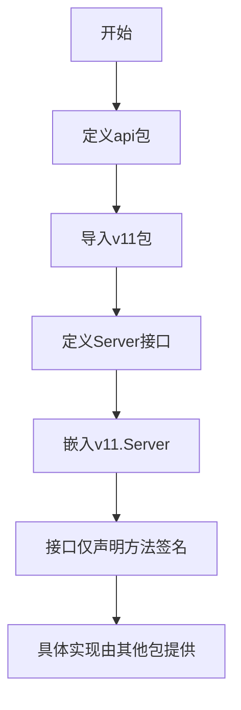
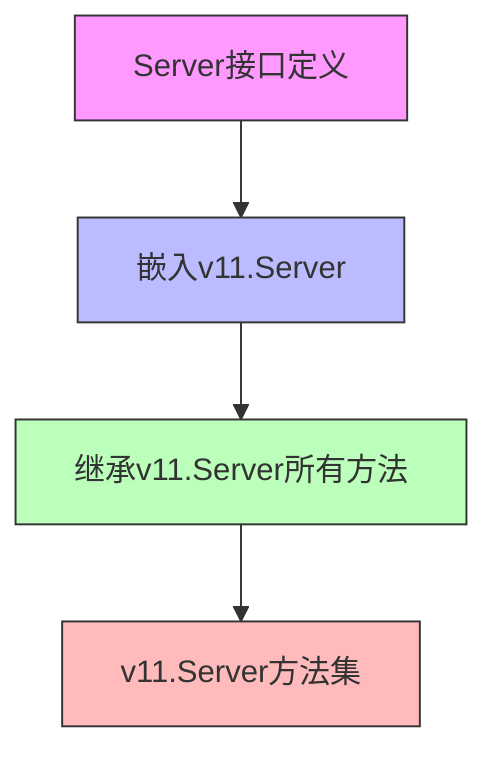

# `flux\pkg\api\api.go` 详细设计文档

该代码定义了一个最小化的Flux API Server接口，它继承自v11版本的Server接口，用于为fluxctl提供基本的连接服务，但不支持与Weave Cloud的集成。这是一个典型的接口抽象和版本兼容设计。

## 整体流程



## 类结构

```
Server (接口)
└── v11.Server (被嵌入的接口)
```

## 全局变量及字段


    

## 全局函数及方法


### Server

描述：定义了一个API Server接口，继承自v11.Server，用于Flux系统中fluxctl与Flux服务端的通信。

参数：

- 该接口无直接参数，继承自v11.Server的所有方法

返回值：`无`，该接口本身无返回值，方法实现需参考v11.Server

#### 流程图



#### 带注释源码

```go
package api

// 导入v11版本的Server接口
import "github.com/fluxcd/flux/pkg/api/v11"

// Server定义了Flux满足与fluxctl Adequate连接所需的最小接口。
// 此接口特别不包含连接到Weave Cloud的功能。
type Server interface {
    // 嵌入v11.Server接口，继承其所有方法
    // 这意味着Server接口具有v11.Server定义的所有方法
    v11.Server
}
```

---

### 继承关系说明

由于`Server`接口直接嵌入了`v11.Server`接口，它继承了`v11.Server`中定义的所有方法。要获取完整的方法列表、参数和返回值信息，需要查看`github.com/fluxcd/flux/pkg/api/v11`包中`Server`接口的具体定义。

**关键组件信息：**

- **Server接口**：顶层API接口，定义Flux服务端点
- **v11.Server**：v11版本的Server接口定义

**潜在技术债务或优化空间：**

1. 该接口目前为空，仅作代理转发用，可能缺乏实际业务方法的扩展性
2. 版本升级时（v11->v12等）需要同步更新接口继承关系
3. 缺少对Weave Cloud连接的明确支持说明

**其他项目：**

- **设计目标**：提供Flux与fluxctl之间的通信契约
- **约束**：不包含Weave Cloud连接功能
- **依赖**：依赖v11版本的API实现
- **错误处理**：由具体实现类决定


## 关键组件


### Server 接口

这是代码中的核心组件，定义了一个名为 Server 的接口，它继承自 v11.Server 接口。该接口规定了Flux必须满足的最小接口规范，以便充分服务连接的fluxctl工具，但该接口特别不适合用于连接到Weave Cloud服务。

### v11.Server 依赖接口

这是外部依赖接口，来自 github.com/fluxcd/flux/pkg/api/v11 包。Server 接口通过嵌入该接口来实现继承关系，这意味着当前接口会自动拥有 v11.Server 中定义的所有方法签名。

### 包级结构

代码位于 api 包中，主要用于定义API层面的接口规范，属于Flux项目的API层抽象。


## 问题及建议


### 已知问题

-   **过度抽象**：Server 接口仅继承 v11.Server，未定义任何自有方法，导致额外的抽象层没有实际价值，增加了代码理解和维护成本
-   **版本硬编码**：直接依赖 v11 版本，若需升级到更高版本（如 v12），多处代码可能需要同步修改，缺乏版本抽象机制
-   **文档不完整**：接口缺少详细的行为说明、约束条件以及与 Weave Cloud 相关的排除说明
-   **无实现类**：仅定义了接口但没有对应的实现类，接口的实际用途不明确

### 优化建议

-   **移除冗余抽象**：如无特殊业务需求，可直接使用 v11.Server 替代此接口，避免不必要的间接层
-   **定义自有方法**：若需要为 Flux 添加特定功能，应在 Server 接口中定义对应的方法签名，而非简单继承
-   **引入版本抽象**：使用泛型或更高级的接口抽象来解耦具体版本依赖，便于未来升级
-   **完善文档**：补充接口的使用场景、约束条件、版本兼容性说明以及与 fluxctl 的交互方式
-   **提供默认实现**：考虑为 Server 接口提供基础实现类，降低下游实现者的开发成本


## 其它


### 设计目标与约束

**设计目标**：定义Flux系统对外提供的最小API接口集合，使fluxctl能够与Flux服务进行通信，实现配置驱动的持续部署能力。该接口作为版本化API的抽象层，解耦客户端与具体实现版本的关系。

**设计约束**：
- 接口必须继承自v11.Server，保持向后兼容性
- 不包含Weave Cloud相关功能，符合最小接口原则
- 作为版本化API的入口点，后续版本应在兼容前提下扩展

### 外部依赖与接口契约

**外部依赖**：
- `github.com/fluxcd/flux/pkg/api/v11`：上游版本API包，提供基础接口定义

**接口契约**：
- 本接口作为v11.Server的别名或扩展点
- 实现类必须提供v11.Server定义的所有方法
- 客户端（fluxctl）通过该接口与服务端通信，不依赖具体实现细节

### 版本兼容性策略

该接口采用向后兼容的版本化设计：
- 通过继承v11.Server确保与已有客户端的兼容性
- 未来版本应通过新增接口或扩展方法实现功能演进
- 不应删除或修改已继承的方法签名，避免破坏性变更

### 测试策略建议

**单元测试**：验证接口定义正确性，确认实现类满足接口约束
**集成测试**：验证fluxctl通过该接口与服务端的通信正常
**兼容性测试**：验证不同版本的客户端与服务端互操作性

### 安全性考虑

该接口本身不包含敏感逻辑，但实现类需注意：
- 认证授权机制应在实现层处理
- 敏感操作需有适当的访问控制
- 接口调用链路应支持审计日志

### 性能优化方向

当前接口定义无性能瓶颈，实现类需关注：
- 避免不必要的接口转换开销
- 对于频繁调用的方法考虑批处理或缓存策略
- 监控接口调用延迟，及时发现性能问题


    