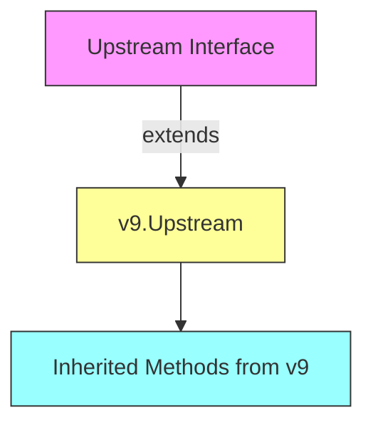

# `flux\pkg\api\v10\api.go` 详细设计文档

该文件是 Flux API 版本 10 的类型定义包，主要定义了 ListImagesOptions 结构体用于指定图像查询参数，以及 Server 和 Upstream 两个接口用于暴露图像列表查询和上游交互功能。

## 整体流程

```mermaid
graph TD
    A[外部调用] --> B[创建 ListImagesOptions]
    B --> C[调用 Server.ListImagesWithOptions]
    C --> D{实现类处理请求}
    D --> E[查询图像状态]
    E --> F[返回 []v6.ImageStatus]
```

## 类结构

```
v10 (包)
├── ListImagesOptions (结构体)
│   ├── Spec update.ResourceSpec
│   ├── OverrideContainerFields []string
│   └── Namespace string
├── Server (接口)
│   └── ListImagesWithOptions(ctx context.Context, opts ListImagesOptions) ([]v6.ImageStatus, error)
└── Upstream (接口)
    └── (继承自 v9.Upstream)
```

## 全局变量及字段


### `ListImagesOptions`
    
定义列出镜像查询选项的结构体，包含资源规范、容器字段覆盖和命名空间

类型：`struct`
    


### `Server`
    
定义Flux API v10的服务器接口，继承v6并提供带选项的列出镜像方法

类型：`interface`
    


### `Upstream`
    
定义上游接口，继承v9的Upstream接口

类型：`interface`
    


### `ListImagesOptions.Spec`
    
指定要查询的资源规范

类型：`update.ResourceSpec`
    


### `ListImagesOptions.OverrideContainerFields`
    
覆盖的容器字段列表

类型：`[]string`
    


### `ListImagesOptions.Namespace`
    
命名空间

类型：`string`
    
    

## 全局函数及方法


### `Server.ListImagesWithOptions`

带选项地列出镜像状态，允许客户端通过指定查询选项（如资源规范、命名空间和容器字段覆盖）来过滤和获取集群中镜像的当前状态信息。

参数：

- `ctx`：`context.Context`，GRPC 请求上下文，用于传递超时、取消信号和元数据
- `opts`：`ListImagesOptions`，查询选项结构体，包含以下字段：
  - `Spec`：`update.ResourceSpec`，要查询的资源规范，用于过滤特定资源
  - `OverrideContainerFields`：`[]string`，可选的容器字段覆盖列表
  - `Namespace`：`string`，要查询的命名空间

返回值：`([]v6.ImageStatus, error)`，返回镜像状态切片和可能发生的错误

#### 流程图

```mermaid
flowchart TD
    A[客户端调用 ListImagesWithOptions] --> B[传入 context 和 ListImagesOptions]
    B --> C{验证 options 参数}
    C -->|验证通过| D[根据 Spec 筛选资源]
    D --> E[根据 Namespace 确定查询范围]
    E --> F[获取镜像状态列表]
    F --> G{是否应用 OverrideContainerFields}
    G -->|是| H[覆盖容器字段]
    G -->|否| I[返回默认字段]
    H --> J[返回 []v6.ImageStatus]
    I --> J
    C -->|验证失败| K[返回错误]
    J --> L[完成]
    K --> L
```

#### 带注释源码

```go
// Server 接口定义了 Flux API v10 版本的服务端行为
type Server interface {
	// v6.NotDeprecated 嵌入接口，表示该版本不是弃用的
	v6.NotDeprecated

	// ListImagesWithOptions 带选项地列出镜像状态
	// 参数:
	//   - ctx: context.Context 用于传递请求上下文(超时/取消/元数据)
	//   - opts: ListImagesOptions 查询选项,包含 Spec/OverrideContainerFields/Namespace
	//
	// 返回值:
	//   - []v6.ImageStatus: 镜像状态列表
	//   - error: 执行过程中的错误信息
	ListImagesWithOptions(ctx context.Context, opts ListImagesOptions) ([]v6.ImageStatus, error)
}

// ListImagesOptions 定义了列出镜像时的查询选项
type ListImagesOptions struct {
	// Spec 指定要查询的资源规范,用于过滤特定资源
	Spec update.ResourceSpec
	// OverrideContainerFields 可选,指定要覆盖的容器字段列表
	OverrideContainerFields []string
	// Namespace 指定要查询的命名空间
	Namespace string
}
```


### Upstream

该接口继承自 v9.Upstream，用于定义 Flux API v10 版本的上游操作规范。作为一个标记接口，它确保 v10 版本的 API 兼容 v9 版本的所有上游功能。

#### 流程图



#### 带注释源码

```go
// This package defines the types for Flux API version 10.
package v10

import (
	"context"

	"github.com/fluxcd/flux/pkg/api/v6"
	"github.com/fluxcd/flux/pkg/api/v9"
	"github.com/fluxcd/flux/pkg/update"
)

// ListImagesOptions 定义了列出镜像时的查询选项
type ListImagesOptions struct {
	Spec                    update.ResourceSpec  // 资源规格，用于过滤
	OverrideContainerFields []string             // 要覆盖的容器字段列表
	Namespace               string                // 命名空间
}

// Server 接口定义了 v10 版本的服务器端 API
type Server interface {
	v6.NotDeprecated  // 继承 v6 的非弃用标记

	// ListImagesWithOptions 获取带有指定选项的镜像列表
	ListImagesWithOptions(ctx context.Context, opts ListImagesOptions) ([]v6.ImageStatus, error)
}

// Upstream 接口继承自 v9.Upstream
// 它是一个标记接口，用于确保 v10 版本兼容 v9 版本的所有上游操作
type Upstream interface {
	v9.Upstream
}
```


## 关键组件


### ListImagesOptions 结构体

用于配置 ListImages 查询选项的结构体，封装了资源规格、容器字段覆盖和命名空间信息。

### Server 接口

定义了 Flux v10 API 的服务器端接口，嵌入了 v6.NotDeprecated 并声明了 ListImagesWithOptions 方法用于查询镜像状态。

### Upstream 接口

定义了 Flux v10 API 的上游接口，嵌入了 v9.Upstream 接口以继承上游相关功能。

### ListImagesOptions 字段

- Spec: update.ResourceSpec - 指定要查询的资源规格
- OverrideContainerFields: []string - 允许覆盖的容器字段列表
- Namespace: string - 查询所属的命名空间


## 问题及建议


### 已知问题

- **接口过度嵌入**：Server接口嵌入了v6.NotDeprecated，Upstream接口直接嵌入v9.Upstream，这种嵌套式接口设计导致代码耦合度高，理解和维护困难
- **接口职责不清晰**：Upstream接口仅作为v9.Upstream的别名存在，没有增加任何新功能，属于不必要的间接层
- **文档缺失**：ListImagesOptions结构体和各方法缺少任何注释和文档说明，降低了代码可读性和可维护性
- **类型安全不足**：OverrideContainerFields使用[]string类型而非更类型安全的设计（如自定义类型或枚举），可能导致运行时错误
- **无错误类型定义**：方法签名中虽然可能返回error，但代码中未定义任何具体的错误类型，缺乏统一的错误处理规范
- **版本强耦合**：直接依赖v6、v9特定版本，限制了未来API演进和升级的灵活性
- **验证逻辑缺失**：ListImagesOptions结构体缺少字段验证逻辑，Namespace和Spec的合法性未在定义层校验

### 优化建议

- 将Upstream直接使用v9.Upstream类型别名替代，消除冗余接口层
- 为所有公共类型和接口添加Go文档注释
- 为OverrideContainerFields定义具体类型或使用容器字段枚举常量
- 定义包级别的错误变量或错误类型，提供统一的错误处理
- 考虑使用泛型或更抽象的类型设计减少版本耦合
- 为ListImagesOptions添加验证方法或使用构造者模式确保数据有效性


## 其它


### 设计目标与约束

本包（v10）是Flux API的第10个版本，主要目标是提供镜像列表查询功能，支持通过自定义选项获取容器镜像状态。该版本需要保持与之前版本的兼容性，同时扩展ListImages的能力，支持更灵活的查询参数。设计约束包括：必须实现v6.NotDeprecated接口以保证API稳定性，Upstream接口必须继承v9.Upstream以保持上游调用链的完整性。

### 错误处理与异常设计

本包定义的是接口和类型声明，具体的错误处理逻辑在各实现类中完成。ListImagesWithOptions方法返回的错误应遵循Go的错误处理惯例，建议使用独立的错误变量或错误包装。对于无效的ListImagesOptions参数（如空的Namespace或不合法 的ResourceSpec），实现类应返回明确的错误信息。ctx参数用于控制请求超时和取消，调用方应妥善处理context超时导致的错误。

### 数据流与状态机

数据流主要分为输入和输出两部分。输入：客户端构造ListImagesOptions对象，包含ResourceSpec（指定要查询的资源）、OverrideContainerFields（可选的容器字段覆盖）和Namespace（命名空间）。处理：Server实现类接收请求后，根据options查询后端存储或外部镜像仓库获取镜像状态。输出：返回[]v6.ImageStatus切片，每个ImageStatus包含镜像的标签、digest、创建时间等信息。状态机方面，该接口为无状态请求-响应模式，每次调用独立，不维护持久状态。

### 外部依赖与接口契约

本包依赖三个外部包：github.com/fluxcd/flux/pkg/api/v6（提供NotDeprecated接口和ImageStatus类型）、github.com/fluxcd/flux/pkg/api/v9（提供Upstream接口）和github.com/fluxcd/flux/pkg/update（提供ResourceSpec类型）。Server接口的实现类必须提供ListImagesWithOptions方法，方法签名必须与接口定义一致。Upstream接口的实现需要提供v9.Upstream定义的所有方法。

### 版本兼容性

v10包通过继承v6.NotDeprecated接口确保与v6版本的兼容性，ListImagesWithOptions方法是对原有ListImages功能的扩展而非替代。Upstream接口继承v9.Upstream意味着保持与v9版本的兼容性。未来的API演进应遵循开闭原则，通过新增接口或方法扩展功能，而非修改现有签名。

### 性能考虑

ListImagesWithOptions方法可能涉及后端查询和镜像仓库API调用，性能瓶颈通常在网络IO和数据库查询。实现类应考虑：使用context进行超时控制、批量查询减少网络往返、实现结果缓存（如果数据变更频率低）、对大结果集进行分页处理。

### 测试策略

单元测试应覆盖：ListImagesOptions结构体的字段验证、Server接口实现的Mock测试、Upstream接口实现的Mock测试、参数边界条件测试（如空Spec、空Namespace）。集成测试应验证：与v6、v9版本的接口兼容性、与实际后端服务的交互。

### 安全考虑

ctx参数用于传递认证信息和截止时间，实现类应验证调用方的权限。Namespace参数可能涉及多租户隔离，需要检查用户是否有权访问指定命名空间。OverrideContainerFields参数可能暴露敏感信息，应谨慎处理返回的字段。

### 配置说明

本包不直接涉及配置，但使用该包的代码需要配置：镜像仓库的访问凭证、API服务的监听地址、查询超时时间、默认的Namespace值。这些配置通常通过环境变量或配置文件提供。

### 使用示例

```go
// 创建查询选项
opts := v10.ListImagesOptions{
    Spec: update.ResourceSpec{
        Kind:      "Deployment",
        Namespace: "default",
        Name:      "my-app",
    },
    OverrideContainerFields: []string{"image", "tag"},
    Namespace:               "default",
}

// 调用API（假设client是实现了v10.Server接口的对象）
images, err := client.ListImagesWithOptions(ctx, opts)
if err != nil {
    // 处理错误
    return err
}

// 处理返回的镜像状态
for _, img := range images {
    fmt.Printf("Image: %s, Tag: %s\n", img.Name, img.Tag)
}
```

    