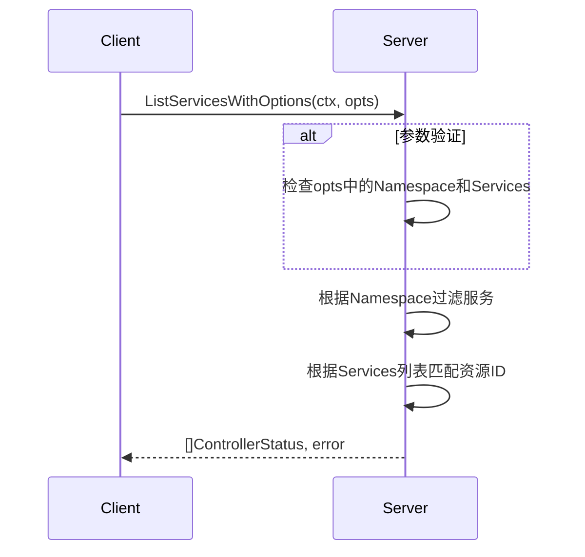
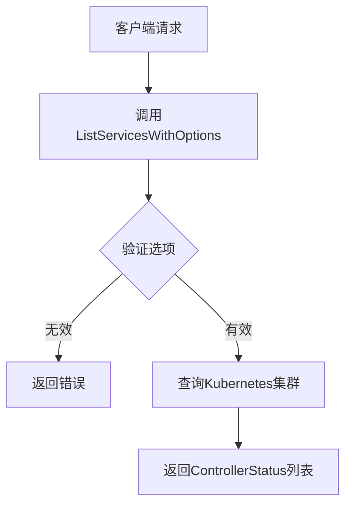

# `flux\pkg\api\v11\api.go` 详细设计文档

该文件是Flux项目API版本11的包定义文件，主要定义了ListServicesOptions结构体用于服务列表查询参数，以及Server接口用于扩展版本10的服务器功能，新增了ListServicesWithOptions方法来支持带有选项的服务列表查询，返回控制器状态列表。

## 整体流程

```mermaid
graph TD
    A[客户端请求] --> B[调用ListServicesWithOptions]
    B --> C{参数验证}
    C -- 失败 --> D[返回错误]
    C -- 成功 --> E[调用v10.Server基础方法]
    E --> F[调用v10.Upstream上游方法]
    F --> G[返回[]v6.ControllerStatus]
```

## 类结构

```
ListServicesOptions (结构体)
└── Server (接口)
    ├── 继承 v10.Server
    └── 继承 v10.Upstream
```

## 全局变量及字段


### `ListServicesOptions.Namespace`
    
命名空间，用于过滤特定命名空间的服务

类型：`string`
    


### `ListServicesOptions.Services`
    
资源ID列表，用于指定要查询的服务

类型：`[]resource.ID`
    
    

## 全局函数及方法


### `Server.ListServicesWithOptions`

该方法定义在 `Server` 接口中，用于根据提供的查询选项（包括命名空间和服务ID列表）获取对应的控制器状态列表，返回包含所有匹配控制器的状态信息数组或可能发生的错误。

参数：

- `ctx`：`context.Context`，上下文对象，用于传递请求范围内的取消信号和元数据
- `opts`：`ListServicesOptions`，服务列表查询选项，包含命名空间和服务ID列表

返回值：`([]v6.ControllerStatus, error)`，返回控制器状态列表和可能的错误

#### 流程图



#### 带注释源码

```go
// ListServicesOptions 定义了查询服务列表时的可选参数
type ListServicesOptions struct {
	Namespace string        // 命名空间，用于过滤特定命名空间下的服务
	Services  []resource.ID // 服务ID列表，用于精确匹配需要查询的服务
}

// Server 接口定义了 Flux API v11 版本的服务端行为
// 该接口继承自 v10.Server 并扩展了 ListServicesWithOptions 方法
type Server interface {
	v10.Server // 继承 v10 版本的 Server 接口

	// ListServicesWithOptions 根据提供的选项查询并返回控制器状态列表
	// 参数:
	//   - ctx: 上下文对象，用于传递请求范围内的取消信号和元数据
	//   - opts: 查询选项，包含命名空间和服务ID列表
	//
	// 返回值:
	//   - []v6.ControllerStatus: 控制器状态列表，如果发生错误则可能为空切片
	//   - error: 执行过程中可能出现的错误，如参数无效、资源不存在等
	ListServicesWithOptions(ctx context.Context, opts ListServicesOptions) ([]v6.ControllerStatus, error)

	// NB Upstream methods move into the public API, since
	// weaveworks/flux-adapter now relies on the public API
	v10.Upstream // 继承上游方法到公共API
}
```

## 关键组件


### 概述

该代码片段是Flux API版本11的类型定义包，定义了服务列表选项结构体和服务器接口，服务器接口继承自v10版本并扩展了支持通过选项查询服务的方法。

### 文件运行流程

该文件定义了两个核心类型：结构体`ListServicesOptions`用于封装命名空间和服务ID列表的查询参数，接口`Server`则规定了实现者必须提供列出服务的方法。在实际运行时，API服务器实现此接口以处理客户端请求，通过`ListServicesWithOptions`方法返回符合条件的控制器状态列表。

### 类详细信息

#### ListServicesOptions 结构体

- **字段**:
  - `Namespace`: string - 指定要查询的Kubernetes命名空间
  - `Services`: []resource.ID - 指定要查询的服务资源ID列表

- **方法**: 无

#### Server 接口

- **字段**: 无

- **方法**:
  - **ListServicesWithOptions**
    - 参数:
      - `ctx`: context.Context - 上下文对象，用于传递请求范围的值和取消信号
      - `opts`: ListServicesOptions - 查询选项，包含命名空间和服务列表
    - 返回值:
      - `[]v6.ControllerStatus`: 控制器状态列表
      - `error`: 错误对象
    - **mermaid流程图**:

    - **源码**:
```go
ListServicesWithOptions(ctx context.Context, opts ListServicesOptions) ([]v6.ControllerStatus, error)
```

### 关键组件信息

- **ListServicesOptions**: 用于传递命名空间和服务ID列表的查询参数结构体
- **Server接口**: 定义API v11版本的服务端接口规范，继承v10.Server和v10.Upstream
- **ListServicesWithOptions方法**: 支持通过选项过滤的服务列表查询方法

### 潜在技术债务或优化空间

1. 缺少对Namespace字段的验证逻辑，应确保命名空间名称符合Kubernetes命名规范
2. Services字段可能为空数组但非nil，应明确处理空查询场景
3. 接口定义中未包含超时控制机制，建议在方法签名中添加context超时管理

### 其它项目

- **设计目标**: 提供版本化的API接口，支持通过选项参数灵活查询服务状态
- **约束**: 必须实现v10.Server和v10.Upstream接口以保持向后兼容
- **错误处理**: 通过返回error接口实现错误传播，具体错误类型由实现方定义
- **数据流**: 客户端构造ListServicesOptions -> 传递给Server实现 -> 返回ControllerStatus切片
- **外部依赖**: 依赖v10和v6版本的API包以及resource包中的ID类型


## 问题及建议


### 已知问题

- **接口继承复杂度**：Server接口同时继承v10.Server和v10.Upstream，多层接口继承可能导致调用链难以追踪，文档和维护成本增加
- **类型定义不完整**：ListServicesOptions结构体仅包含两个字段但缺乏验证逻辑，如Namespace空值检查、Services切片长度限制等
- **文档注释缺失**：包级别缺少详细的包文档说明，ListServicesOptions和Server缺乏业务场景描述
- **版本耦合**：直接依赖v10和v6的具体实现，可能存在版本兼容性问题，升级时需要同步修改
- **错误处理缺失**：接口方法签名未定义错误返回值类型，调用方无法获得明确的错误信息
- **功能演进风险**：注释提到"NB Upstream methods move into the public API"表明API设计曾发生变更，可能存在历史遗留的架构妥协

### 优化建议

- 考虑使用接口组合或明确拆分Server的职责，减少对v10的强依赖
- 为ListServicesOptions添加验证方法或使用构造函数模式确保数据有效性
- 补充包级别和类型的详细文档注释，说明业务背景和使用场景
- 统一错误处理规范，建议在接口方法中添加error返回值或在文档中明确错误约定
- 评估是否可引入更稳定的抽象层，降低对具体版本实现的直接依赖


## 其它


### 设计目标与约束

该包是Flux API版本11的类型定义包，主要目标是扩展服务列表查询功能，允许通过Namespace和Services参数过滤服务。约束条件包括：必须保持与v10.Server接口的向后兼容，新方法ListServicesWithOptions是对现有API的功能扩展而非替代。

### 错误处理与异常设计

由于该包仅定义类型接口，具体错误处理由实现方负责。常见错误场景包括：无效的Namespace格式、服务ID不匹配、上下文取消等。实现类应返回标准Go错误，并通过错误包装提供有意义的错误信息。

### 数据流与状态机

数据流为：客户端构造ListServicesOptions → 传入ListServicesWithOptions方法 → 服务端根据Namespace过滤并获取指定Services的控制器状态 → 返回[]v6.ControllerStatus切片。无复杂状态机，仅涉及请求-响应模式。

### 外部依赖与接口契约

主要依赖：v10包（Server接口和Upstream接口）、v6包（ControllerStatus类型）、resource包（ID类型）。接口契约：ListServicesWithOptions方法接受context.Context和ListServicesOptions，返回ControllerStatus切片或错误。

### 版本兼容性

该版本在v10基础上新增方法，保持向后兼容。调用方可通过类型断言检查是否实现了v11.Server接口以使用新功能。v10.Client仍可正常使用，不受影响。

### 安全考虑

接口设计本身不涉及认证授权，这些功能由上层框架处理。方法接受context.Context，可通过上下文传递认证信息和超时控制。

### 性能考量

性能相关设计不在该包定义范围内，由实现方决定是否使用缓存、连接池等优化手段。调用方应合理设置上下文超时。

### 测试策略

该包为接口定义包，测试主要为接口一致性验证：确保v11.Server实现满足v10.Server的所有方法要求，以及正确实现ListServicesWithOptions方法签名。

### 配置说明

无配置项，该包仅定义类型和接口。具体配置由实现方提供。

### 使用示例

```go
// 客户端使用示例
var client v11.Server = /* 获取v11实现实例 */
opts := v11.ListServicesOptions{
    Namespace: "default",
    Services:  []resource.ID{resource.MustParseID("deployment/my-service")},
}
statuses, err := client.ListServicesWithOptions(context.Background(), opts)
```

    