# `flux\pkg\api\v6\api.go` 详细设计文档

这是Fluxcd v6版本的API定义包，定义了GitOps工作流中的核心数据结构和服务接口，包括镜像状态、控制器状态、Git配置以及服务同步、更新和查询的相关接口。

## 整体流程

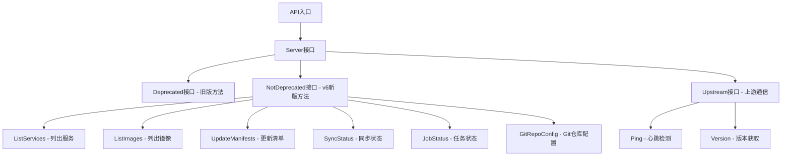

## 类结构

```
Server (主服务接口)
├── Deprecated (废弃接口)
│   └── SyncNotify
├── NotDeprecated (新版本接口)
│   ├── Export
│   ├── ListServices
│   ├── ListImages
│   ├── UpdateManifests
│   ├── SyncStatus
│   ├── JobStatus
│   └── GitRepoConfig
└── Upstream (上游接口)
Ping
└── Version
```

## 全局变量及字段


### `ReadOnlyOK`
    
正常状态

类型：`ReadOnlyReason`
    


### `ReadOnlyMissing`
    
不在仓库中

类型：`ReadOnlyReason`
    


### `ReadOnlySystem`
    
系统级别

类型：`ReadOnlyReason`
    


### `ReadOnlyNoRepo`
    
无仓库

类型：`ReadOnlyReason`
    


### `ReadOnlyNotReady`
    
未就绪

类型：`ReadOnlyReason`
    


### `ReadOnlyROMode`
    
只读模式

类型：`ReadOnlyReason`
    


### `ImageStatus.ID`
    
镜像资源标识

类型：`resource.ID`
    


### `ImageStatus.Containers`
    
容器列表

类型：`[]Container`
    


### `ControllerStatus.ID`
    
控制器资源标识

类型：`resource.ID`
    


### `ControllerStatus.Containers`
    
容器列表

类型：`[]Container`
    


### `ControllerStatus.ReadOnly`
    
只读原因

类型：`ReadOnlyReason`
    


### `ControllerStatus.Status`
    
状态描述

类型：`string`
    


### `ControllerStatus.Rollout`
    
部署状态

类型：`cluster.RolloutStatus`
    


### `ControllerStatus.SyncError`
    
同步错误信息

类型：`string`
    


### `ControllerStatus.Antecedent`
    
前置资源ID

类型：`resource.ID`
    


### `ControllerStatus.Labels`
    
标签映射

类型：`map[string]string`
    


### `ControllerStatus.Automated`
    
是否自动化

类型：`bool`
    


### `ControllerStatus.Locked`
    
是否锁定

类型：`bool`
    


### `ControllerStatus.Ignore`
    
是否忽略

类型：`bool`
    


### `ControllerStatus.Policies`
    
策略映射

类型：`map[string]string`
    


### `GitRemoteConfig.Remote`
    
Git远程仓库配置

类型：`git.Remote`
    


### `GitRemoteConfig.Branch`
    
分支名称

类型：`string`
    


### `GitRemoteConfig.Path`
    
仓库路径

类型：`string`
    


### `GitConfig.Remote`
    
远程配置

类型：`GitRemoteConfig`
    


### `GitConfig.PublicSSHKey`
    
SSH公钥

类型：`ssh.PublicKey`
    


### `GitConfig.Status`
    
Git仓库状态

类型：`git.GitRepoStatus`
    


### `GitConfig.Error`
    
错误信息

类型：`string`
    
    

## 全局函数及方法


### `Deprecated.SyncNotify`

该方法定义在Deprecated接口中，用于同步通知Fluxcd进行配置同步操作，是Fluxcd v6版本中的旧版同步接口，用于向后兼容。

参数：

- `ctx`：`context.Context`，请求上下文，用于传递超时、取消等控制信息

返回值：`error`，如果同步通知过程中发生错误则返回错误信息，否则返回nil

#### 流程图

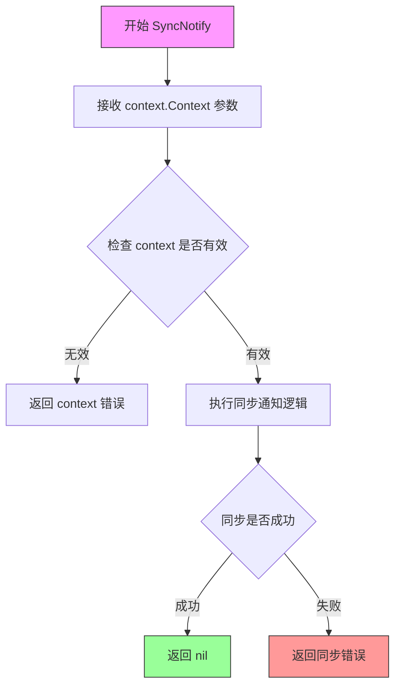

#### 带注释源码

```go
// Deprecated 接口定义了已弃用的方法，用于向后兼容
type Deprecated interface {
    // SyncNotify 是同步通知方法，用于通知Fluxcd进行配置同步
    // 参数 ctx 是上下文对象，用于控制请求的生命周期
    // 返回值 error 表示同步通知操作的结果
    // 注意：这是一个接口方法，具体实现由实现该接口的类型提供
    SyncNotify(context.Context) error
}
```

**注意**：由于`Deprecated`是一个接口定义，`SyncNotify`方法没有具体实现代码。该接口用于定义Fluxcd v6版本中的旧版同步通知功能，具体实现由实现了该接口的类型提供。从代码上下文中可以看到，`Server`接口组合了`Deprecated`接口，表明该方法将在具体的服务器实现类中被实现。调用方需要通过实现该接口的具体类型来调用实际的同步通知逻辑。


### `NotDeprecated.Export`

导出配置的方法，用于将集群配置导出为字节格式。

参数：

- `ctx`：`context.Context`，Go标准库的上下文对象，用于传递截止日期、取消信号和请求范围内的值

返回值：

- `[]byte`，导出的配置数据字节数组
- `error`，如果导出过程中发生错误，则返回错误信息

#### 流程图

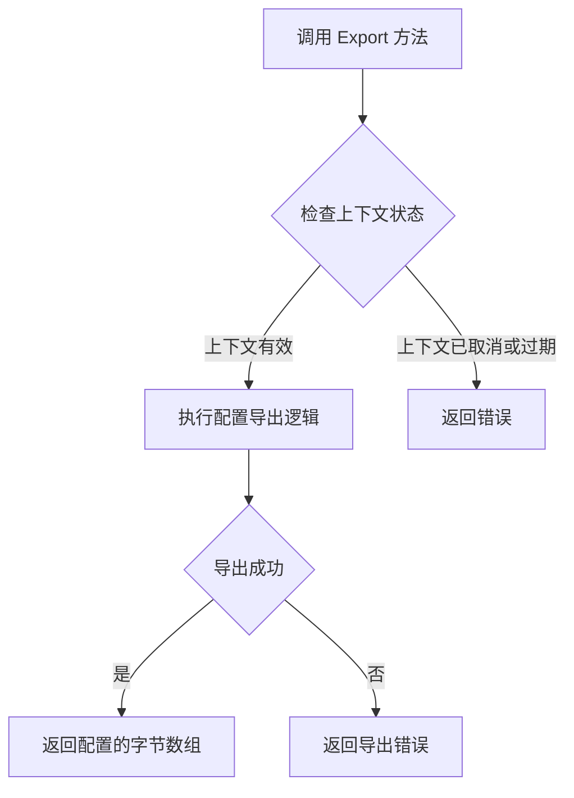

#### 带注释源码

```go
// NotDeprecated 接口定义了 v6 版本中不受Deprecated限制的集群操作方法
type NotDeprecated interface {
    // Export 将集群配置导出为字节格式
    // 参数:
    //   - ctx: 上下文对象，用于控制请求的生命周期和取消
    //
    // 返回值:
    //   - []byte: 导出的配置数据
    //   - error: 导出过程中发生的错误（如有）
    Export(context.Context) ([]byte, error)

    // v6 版本新增的方法
    ListServices(ctx context.Context, namespace string) ([]ControllerStatus, error)
    ListImages(ctx context.Context, spec update.ResourceSpec) ([]ImageStatus, error)
    UpdateManifests(context.Context, update.Spec) (job.ID, error)
    SyncStatus(ctx context.Context, ref string) ([]string, error)
    JobStatus(context.Context, job.ID) (job.Status, error)
    GitRepoConfig(ctx context.Context, regenerate bool) (GitConfig, error)
}
```


### `NotDeprecated.ListServices`

该方法用于列出指定命名空间下的所有服务及其当前状态信息，包括控制器状态、容器信息、读写状态、同步错误等。

参数：

- `ctx`：`context.Context`，请求的上下文，用于传递取消信号、超时控制等
- `namespace`：`string`，目标命名空间，用于过滤要查询的服务

返回值：`[]ControllerStatus, error`，返回指定命名空间下所有控制器的状态切片，如果发生错误则返回 error

#### 流程图

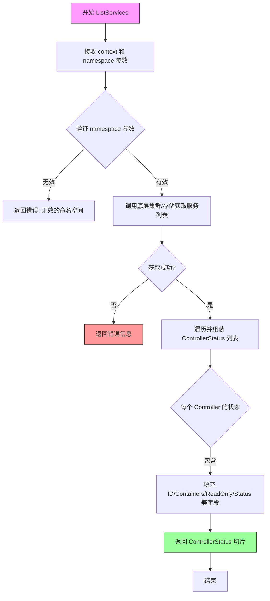

#### 带注释源码

```go
// ListServices 方法定义在 NotDeprecated 接口中
// 功能：列出指定命名空间下的所有服务及其状态
// 参数：
//   - ctx: context.Context 类型，用于传递上下文信息（如超时、取消信号）
//   - namespace: string 类型，指定要查询的命名空间
//
// 返回值：
//   - []ControllerStatus: 控制器状态切片，包含每个服务的详细信息
//   - error: 如果发生错误（如命名空间无效、集群不可达等），返回错误信息
ListServices(ctx context.Context, namespace string) ([]ControllerStatus, error)
```

#### 补充说明

**设计目标与约束**：
- 该接口方法遵循 Go 语言接口设计原则，定义行为而非实现
- 命名空间参数确保了多租户/多环境隔离能力

**错误处理**：
- 错误可能来源于：无效的命名空间格式、底层集群通信失败、权限不足等
- 调用方需检查 error 返回值以处理异常情况

**外部依赖**：
- 依赖 `context.Context` 进行生命周期管理
- 返回的 `ControllerStatus` 依赖同文件定义的 `ControllerStatus` 结构体


### `NotDeprecated.ListImages`

列出镜像列表，根据指定的资源规范返回所有镜像及其容器信息。

参数：

- `ctx`：`context.Context`，请求上下文，用于传递取消信号和超时控制
- `spec`：`update.ResourceSpec`，资源规范，指定要列出镜像的资源过滤条件

返回值：`([]ImageStatus, error)`，返回镜像状态列表和可能的错误。ImageStatus 包含镜像 ID 和对应的容器列表；error 在查询失败时返回错误信息

#### 流程图

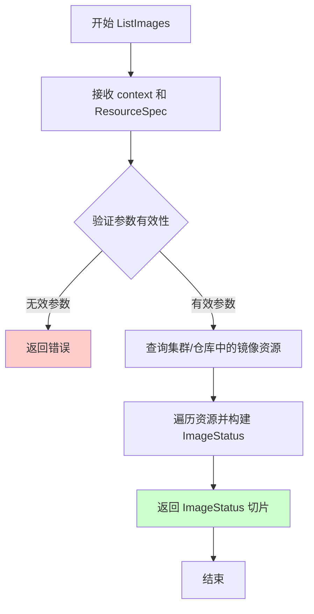

#### 带注释源码

```go
// ListImages 定义在 NotDeprecated 接口中，用于列出镜像
// 参数 ctx 用于控制请求生命周期，spec 用于过滤资源
// 返回镜像状态列表和错误信息
ListImages(ctx context.Context, spec update.ResourceSpec) ([]ImageStatus, error)

// ImageStatus 结构体定义在文件顶部
type ImageStatus struct {
    ID         resource.ID  // 镜像资源标识符
    Containers []Container  // 使用该镜像的容器列表
}
```


### `NotDeprecated.UpdateManifests`

该方法定义在 `NotDeprecated` 接口中，用于根据提供的更新规范（update.Spec）更新集群的清单文件（manifests），返回一个作业ID用于后续跟踪更新操作。

参数：

- `ctx`：`context.Context`，上下文对象，用于控制请求的生命周期和传递请求级别的信息
- `spec`：`update.Spec`，更新规范，描述需要执行的更新操作的具体参数

返回值：

- `job.ID`：作业标识符，用于后续查询作业状态
- `error`：执行过程中可能发生的错误

#### 流程图

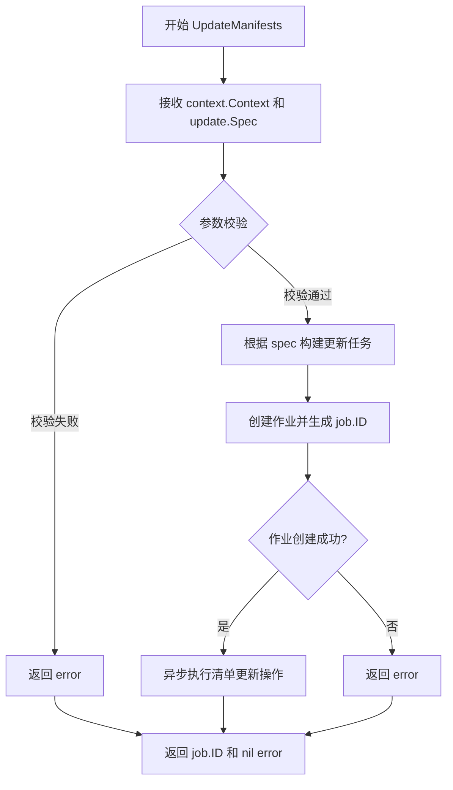

#### 带注释源码

```go
// UpdateManifests 是 NotDeprecated 接口的方法签名
// 用于更新集群的清单文件（manifests）
// 参数 ctx 是 Go 语言标准的上下文对象，用于超时控制、取消等
// 参数 spec 是 update.Spec 类型，定义了需要执行的更新操作规范
// 返回值 job.ID 是新创建任务的唯一标识，可用于后续查询任务状态
// 返回值 error 表示操作过程中发生的错误，如果为 nil 表示成功
UpdateManifests(context.Context, update.Spec) (job.ID, error)
```

> **注意**：提供的代码片段仅包含接口定义（interface declaration），并未包含该方法的具体实现源码。接口定义位于 `package v6` 中，属于 Flux CD 项目的一部分。该方法是 Flux v6 版本中用于处理集群清单更新的核心接口方法，实际实现逻辑需要在实现了 `NotDeprecated` 接口的具体类型中查找。


### `NotDeprecated.SyncStatus`

该方法定义在 `NotDeprecated` 接口中，用于获取指定 Git 引用（ref）的同步状态，返回同步状态的字符串切片或错误信息。

参数：

- `ctx`：`context.Context`，上下文对象，用于传递请求上下文、取消信号和截止时间等
- `ref`：`string`，Git 引用，可以是分支名、标签名或提交哈希，用于指定要查询同步状态的版本

返回值：

- `[]string`：字符串切片，表示同步状态的列表，可能包含多个状态描述（如 "synced"、"out-of-sync" 等）
- `error`：执行过程中出现的错误，如连接失败、Git 引用无效等

#### 流程图

```mermaid
flowchart TD
    A[开始调用 SyncStatus] --> B[接收上下文 ctx 和 Git 引用 ref]
    B --> C{验证参数有效性}
    C -->|无效| D[返回错误]
    C -->|有效| E[调用底层实现获取同步状态]
    E --> F{是否发生错误}
    F -->|是| G[返回 error]
    F -->|否| H[返回同步状态列表 []string]
    D --> I[结束]
    G --> I
    H --> I
```

#### 带注释源码

```go
// SyncStatus 方法定义在 NotDeprecated 接口中
// 参数 ctx 用于控制请求的生命周期和传递取消信号
// 参数 ref 指定 Git 引用，用于确定要查询同步状态的版本
// 返回值 []string 表示同步状态的列表，可能包含多个状态描述
// 返回值 error 表示执行过程中可能发生的错误
SyncStatus(ctx context.Context, ref string) ([]string, error)
```


### `NotDeprecated.JobStatus`

获取指定任务（Job）的当前执行状态。

参数：

- `ctx`：`context.Context`，请求的上下文，用于控制超时和取消
- `id`：`job.ID`，要查询状态的任务唯一标识符

返回值：`job.Status, error`，返回指定任务的状态信息，如果发生错误则返回 error

#### 流程图

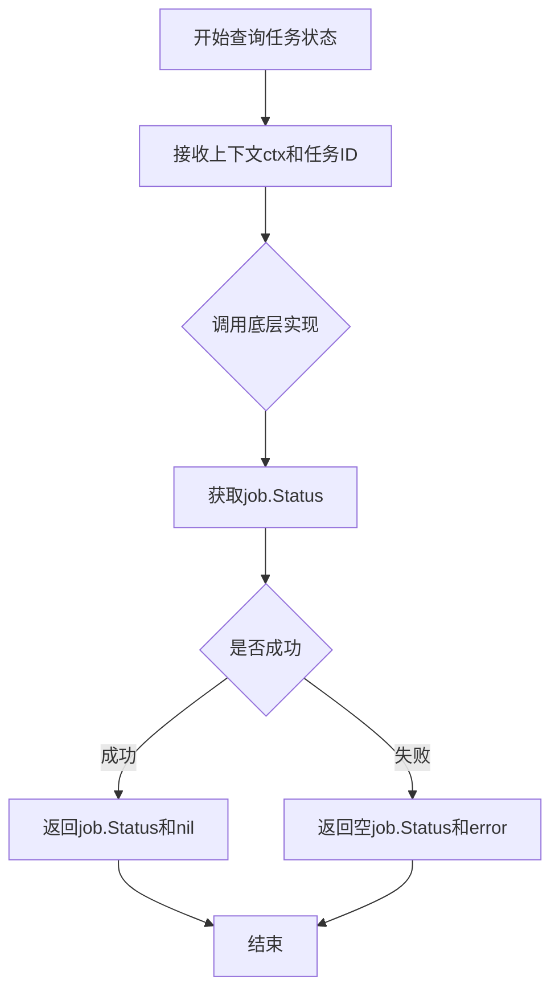

#### 带注释源码

```go
// JobStatus 获取指定任务的状态
// 参数 ctx: 用于控制请求超时的上下文
// 参数 id: 要查询状态的任务ID
// 返回值: 任务状态对象和可能的错误
JobStatus(context.Context, job.ID) (job.Status, error)
```


### NotDeprecated.GitRepoConfig

获取Git仓库配置的方法，支持通过regenerate参数控制是否重新生成配置。

参数：

- `ctx`：`context.Context`，Context上下文，用于传递请求范围的截止日期、取消信号和其他请求级别的值
- `regenerate`：`bool`，布尔标志，指示是否需要重新生成Git仓库配置

返回值：`GitConfig, error`，返回GitConfig结构体包含远程仓库配置、公钥和状态信息，或者在发生错误时返回error

#### 流程图

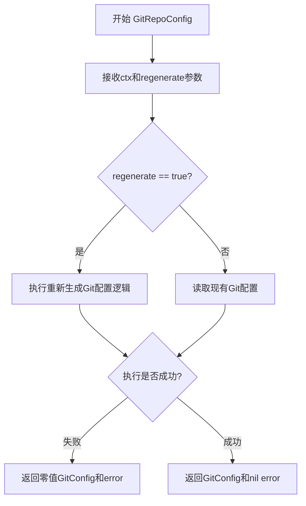

#### 带注释源码

```go
// GitRepoConfig 方法定义在 NotDeprecated 接口中
// 参数：
//   - ctx: context.Context，用于控制请求的生命周期
//   - regenerate: bool，true表示强制重新生成配置，false表示使用缓存配置
//
// 返回值：
//   - GitConfig: 包含仓库远程配置、SSH公钥和状态信息的结构体
//   - error: 执行过程中的错误信息
GitRepoConfig(ctx context.Context, regenerate bool) (GitConfig, error)
```

> **说明**：该方法为接口方法定义，具体的实现在实现 `NotDeprecated` 接口的具体类型中。`GitConfig` 结构体包含以下字段：
>
> - `Remote`: GitRemoteConfig（包含git.Remote、Branch、Path）
> - `PublicSSHKey`: ssh.PublicKey（SSH公钥）
> - `Status`: git.GitRepoStatus（仓库状态）
> - `Error`: string（错误信息字符串）


### `Upstream.Ping`

心跳检测方法，用于检查上游服务的可用性。该方法接收一个上下文对象，通过调用上游服务的心跳接口来验证连接是否正常，如果服务不可达则返回相应的错误信息。

参数：

- `ctx`：`context.Context`，上下文对象，用于传递请求范围内的取消信号和截止时间，通常用于控制超时和取消长时运行的请求

返回值：`error`，如果心跳检测成功则返回 `nil`，如果服务不可达或发生错误则返回具体的错误信息

#### 流程图

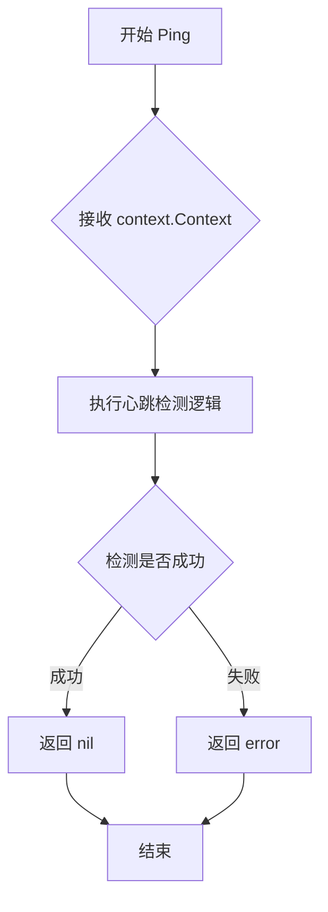

#### 带注释源码

```go
// Ping 方法定义在 Upstream 接口中，用于心跳检测
// 参数 ctx 是上下文对象，用于控制请求的生命周期
// 返回 error 类型，nil 表示成功，非 nil 表示失败
Ping(context.Context) error
```

#### 完整上下文说明

该方法定义在 `Upstream` 接口中，是该接口的两个方法之一（另一个是 `Version`）。`Upstream` 接口用于抽象与上游服务或远程服务的通信交互。

**接口定义完整源码：**

```go
// Upstream 接口定义了与上游服务交互的基本方法
// 来自 v4 版本的接口定义
type Upstream interface {
	// Ping 用于心跳检测，验证与上游服务的连接是否正常
	// 参数 ctx 允许调用者控制请求的超时和取消
	// 返回 error 表示检测结果，nil 表示连接正常
	Ping(context.Context) error
	
	// Version 获取上游服务的版本信息
	Version(context.Context) (string, error)
}
```

**使用场景：**
- 定期检查与上游服务的连接状态
- 在建立长期连接前验证可达性
- 监控服务的健康状态
- 故障恢复时的连接验证


### `Upstream.Version`

获取当前系统的版本信息。该方法是 `Upstream` 接口的核心方法之一，用于返回 Flux 服务的版本字符串，供客户端或集成系统查询使用。

参数：

- `ctx`：`context.Context`，上下文对象，用于传递请求范围内的取消信号、超时时间以及请求级别的值

返回值：

- `string`，返回当前 Flux 服务的版本号字符串（如 "v1.0.0"）
- `error`，如果获取版本过程中发生错误，则返回相应的错误信息

#### 流程图

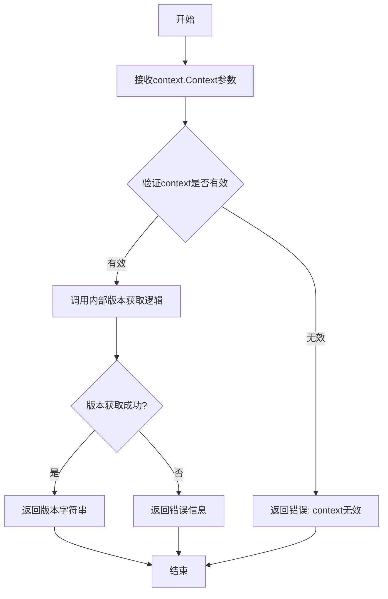

#### 带注释源码

```go
// Upstream 接口定义了与上游 Flux 服务通信的能力
// 用于获取服务的状态信息和版本信息
type Upstream interface {
	// Ping 用于检测服务连通性
	// 参数 ctx: 上下文对象，用于控制请求超时和取消
	// 返回值 error: 如果服务不可达则返回错误
	Ping(context.Context) error

	// Version 获取当前 Flux 服务的版本信息
	// 参数 ctx: 上下文对象，用于传递取消信号和超时控制
	// 返回值 string: 版本字符串，如 "v1.0.0" 或 "latest"
	// 返回值 error: 获取版本失败时返回错误
	Version(context.Context) (string, error)
}
```


# Server接口方法详细设计文档

## 概述

本代码定义了Flux CD项目的API接口体系，其中Server接口是核心接口，继承了Deprecated（已弃用）和NotDeprecated（未弃用）两个接口，提供了从v4到v6版本的服务端功能，包括镜像管理、服务列表、配置更新、Git仓库同步等功能。

## 方法列表

---

### 1. SyncNotify

 Deprecated接口中的方法，用于通知Git仓库同步。

参数：

- `ctx`：`context.Context`，请求的上下文，用于控制超时和取消

返回值：`error`，如果通知失败返回错误信息

#### 流程图

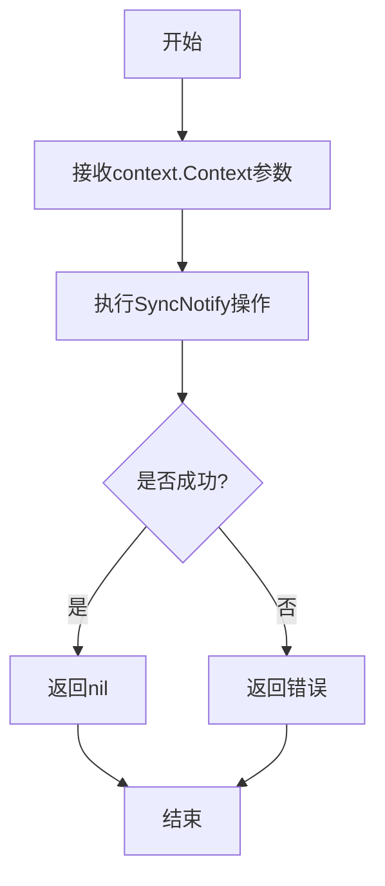

#### 带注释源码

```go
// SyncNotify notifies the server to sync the repository
// Deprecated: This method is deprecated and may be removed in future versions
SyncNotify(context.Context) error
```

---

### 2. Export

 从v5接口继承的方法，用于导出当前配置。

参数：

- `ctx`：`context.Context`，请求的上下文，用于控制超时和取消

返回值：
- `[]byte`：导出的配置数据
- `error`：如果导出失败返回错误信息

#### 流程图

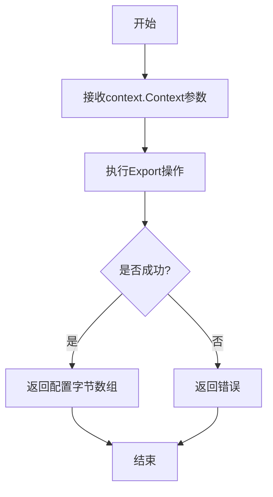

#### 带注释源码

```go
// Export exports the current configuration as bytes
// Parameters:
//   - ctx: context for request cancellation and timeout control
// Returns:
//   - []byte: exported configuration data
//   - error: error if export fails
Export(context.Context) ([]byte, error)
```

---

### 3. ListServices

 v6接口方法，列出指定命名空间下的所有服务控制器状态。

参数：

- `ctx`：`context.Context`，请求的上下文
- `namespace`：`string`，要查询的命名空间名称

返回值：
- `[]ControllerStatus`：控制器状态列表
- `error`：如果查询失败返回错误信息

#### 流程图

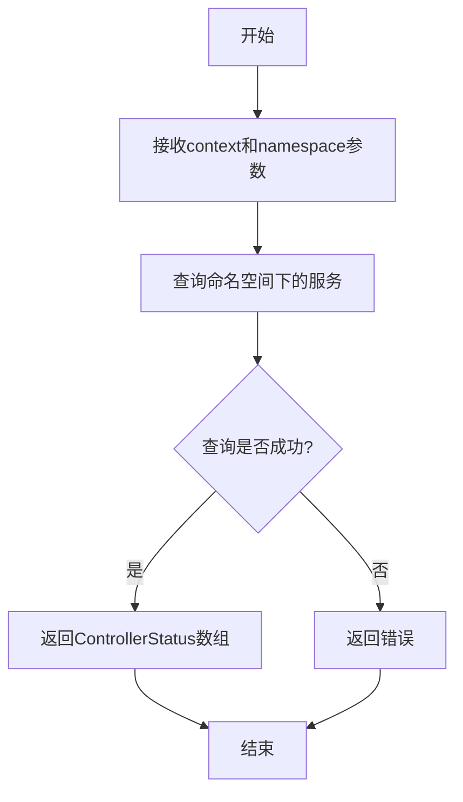

#### 带注释源码

```go
// ListServices lists all services/controllers in a given namespace
// Parameters:
//   - ctx: context for request cancellation and timeout control
//   - namespace: the namespace to list services from
// Returns:
//   - []ControllerStatus: list of controller statuses
//   - error: error if listing fails
ListServices(ctx context.Context, namespace string) ([]ControllerStatus, error)
```

---

### 4. ListImages

 v6接口方法，根据资源规格列出相关镜像的状态信息。

参数：

- `ctx`：`context.Context`，请求的上下文
- `spec`：`update.ResourceSpec`，资源规格定义

返回值：
- `[]ImageStatus`：镜像状态列表
- `error`：如果查询失败返回错误信息

#### 流程图

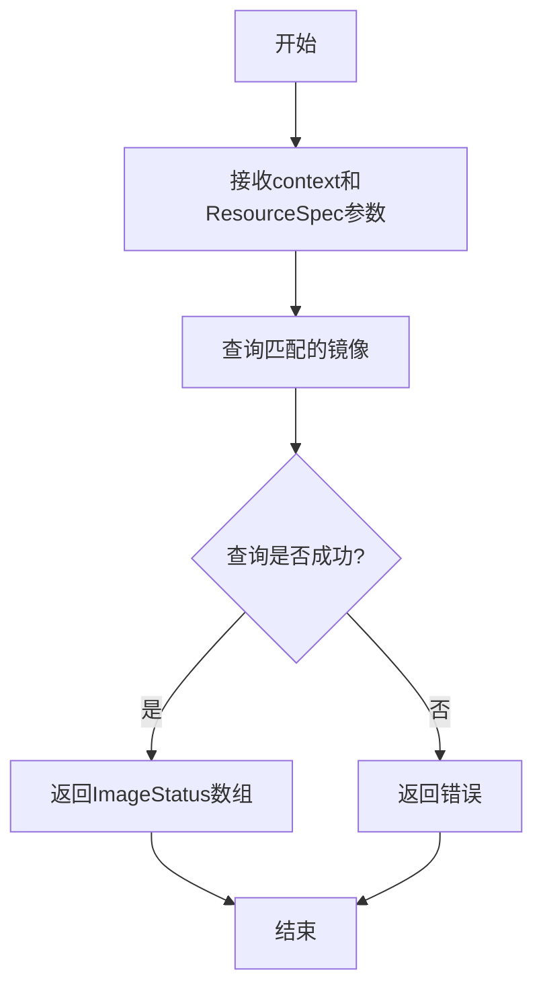

#### 带注释源码

```go
// ListImages lists images for a given resource spec
// Parameters:
//   - ctx: context for request cancellation and timeout control
//   - spec: the resource specification to match images against
// Returns:
//   - []ImageStatus: list of image statuses
//   - error: error if listing fails
ListImages(ctx context.Context, spec update.ResourceSpec) ([]ImageStatus, error)
```

---

### 5. UpdateManifests

 v6接口方法，更新Git仓库中的清单文件（manifests）。

参数：

- `ctx`：`context.Context`，请求的上下文
- `spec`：`update.Spec`，更新规格定义

返回值：
- `job.ID`：提交的更新任务ID
- `error`：如果更新失败返回错误信息

#### 流程图

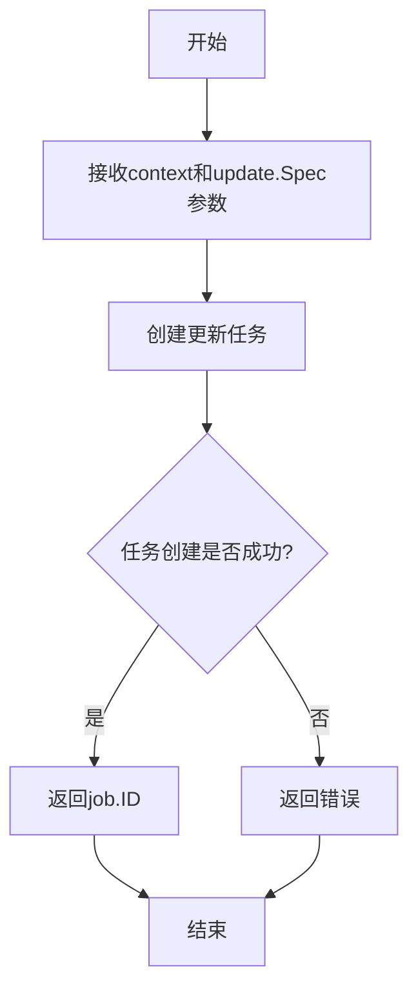

#### 带注释源码

```go
// UpdateManifests updates the manifests in the git repository
// Parameters:
//   - ctx: context for request cancellation and timeout control
//   - spec: the update specification containing desired changes
// Returns:
//   - job.ID: the ID of the submitted job
//   - error: error if update fails
UpdateManifests(context.Context, update.Spec) (job.ID, error)
```

---

### 6. SyncStatus

 v6接口方法，获取指定Git引用的同步状态。

参数：

- `ctx`：`context.Context`，请求的上下文
- `ref`：`string`，Git引用（如分支名、标签或提交哈希）

返回值：
- `[]string`：同步状态的字符串数组
- `error`：如果查询失败返回错误信息

#### 流程图

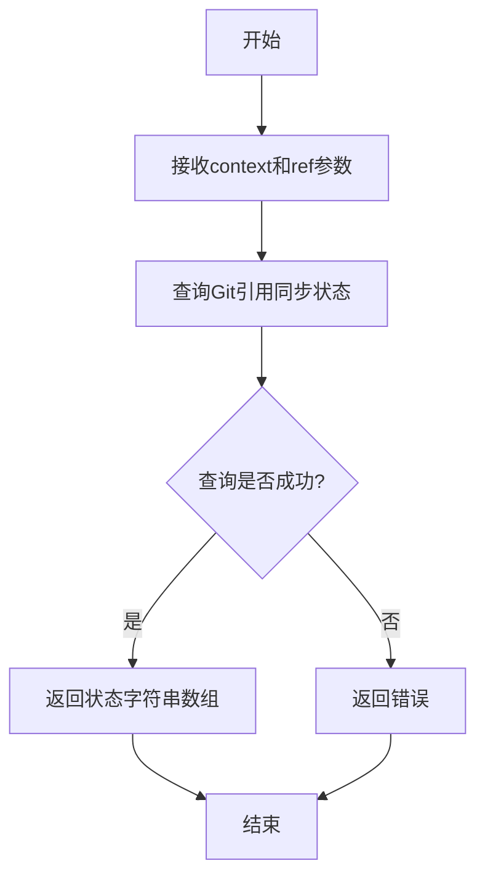

#### 带注释源码

```go
// SyncStatus gets the sync status for a given git reference
// Parameters:
//   - ctx: context for request cancellation and timeout control
//   - ref: the git reference to check status for
// Returns:
//   - []string: array of status strings
//   - error: error if query fails
SyncStatus(ctx context.Context, ref string) ([]string, error)
```

---

### 7. JobStatus

 v6接口方法，获取指定任务的执行状态。

参数：

- `ctx`：`context.Context`，请求的上下文
- `id`：`job.ID`，任务标识符

返回值：
- `job.Status`：任务状态信息
- `error`：如果查询失败返回错误信息

#### 流程图

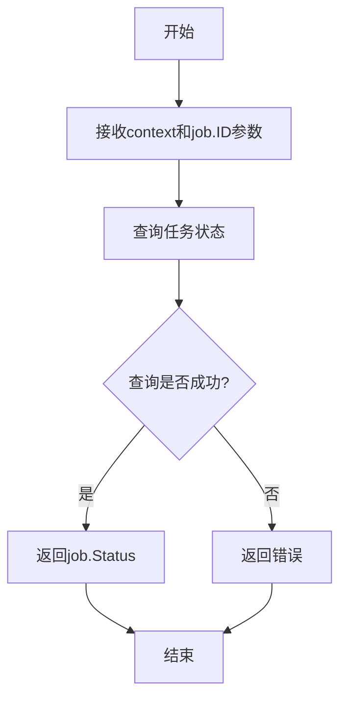

#### 带注释源码

```go
// JobStatus gets the status of a specific job
// Parameters:
//   - ctx: context for request cancellation and timeout control
//   - id: the job ID to query status for
// Returns:
//   - job.Status: the current status of the job
//   - error: error if query fails
JobStatus(context.Context, job.ID) (job.Status, error)
```

---

### 8. GitRepoConfig

 v6接口方法，获取或重新生成Git仓库配置。

参数：

- `ctx`：`context.Context`，请求的上下文
- `regenerate`：`bool`，是否强制重新生成配置

返回值：
- `GitConfig`：Git仓库配置信息
- `error`：如果获取失败返回错误信息

#### 流程图

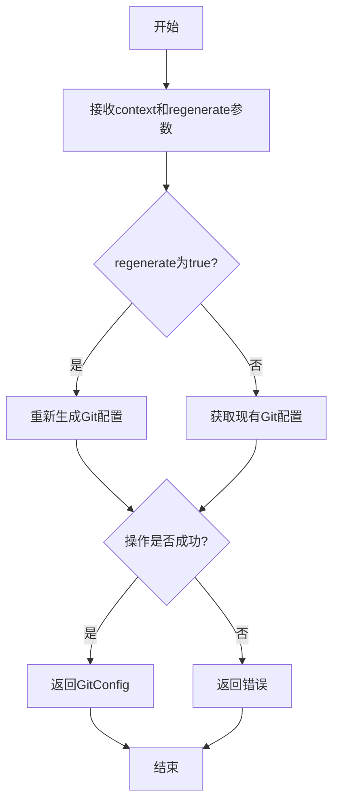

#### 带注释源码

```go
// GitRepoConfig gets or regenerates the git repository configuration
// Parameters:
//   - ctx: context for request cancellation and timeout control
//   - regenerate: if true, forces regeneration of the config
// Returns:
//   - GitConfig: the git repository configuration
//   - error: error if operation fails
GitRepoConfig(ctx context.Context, regenerate bool) (GitConfig, error)
```

---

## 技术债务与优化空间

1. **Deprecated接口设计**：SyncNotify方法已标记为弃用，但仍在Server接口中保留，建议评估是否可以在未来版本中完全移除。

2. **接口聚合方式**：Server接口通过嵌入多个小接口来实现功能，这种方式虽然灵活但可能导致接口契约不够清晰，建议考虑使用更明确的接口分离策略。

3. **错误处理一致性**：各方法均返回error，但缺乏统一的错误类型定义，建议引入自定义错误类型以提供更丰富的错误上下文信息。

4. **命名空间处理**：ListServices方法中的namespace参数为string类型，缺乏命名空间验证，建议增加输入验证逻辑。

5. **版本演进**：代码从v4演进到v6，接口历史包袱较重，建议在未来版本中考虑接口版本化策略。

## 关键组件


### ImageStatus

图像状态结构体，用于表示容器镜像的基本信息，包含镜像ID和容器列表

### ControllerStatus

控制器状态结构体，核心数据结构，记录了控制器的运行状态、容器信息、只读原因、同步状态、部署状态、标签、自动化策略等完整信息

### ReadOnlyReason

只读原因枚举类型，定义了控制器为何处于只读状态的多种原因，包括：正常、缺失、系统、无仓库、未就绪、只读模式

### GitRemoteConfig

Git远程配置结构体，封装了Git仓库的远程地址、分支和路径信息

### GitConfig

Git配置结构体，包含Git仓库的完整配置信息，包括远程配置、SSH公钥、仓库状态和错误信息

### Deprecated

弃用接口，定义了已弃用的同步通知方法，用于向后兼容

### NotDeprecated

非弃用接口，定义了v6版本的核心业务方法，包括服务列表获取、镜像列表获取、清单更新、Git仓库配置等关键功能

### Upstream

上游接口，定义了与上游系统通信的基础方法，包括连接检测和版本获取

### Server

服务器接口，组合了Deprecated和NotDeprecated接口，定义了完整的服务器API契约


## 问题及建议


### 已知问题

- `Server`接口同时继承`Deprecated`和`NotDeprecated`接口，设计上存在矛盾，因为"Deprecated"接口表示已废弃，但`Server`接口仍将其包含在内，可能导致维护混淆
- `ReadOnlyReason`类型使用了自定义类型定义常量，但未使用`iota`，与Go社区惯例不一致，增加后续扩展维护成本
- `GitRemoteConfig`嵌套`git.Remote`结构体但使用`json`标签直接序列化内部字段，可能导致JSON序列化行为与预期不符（取决于`git.Remote`的定义）
- 缺乏对各接口方法的详细文档注释，特别是`NotDeprecated`接口中各方法的具体行为和错误返回场景未说明
- `ControllerStatus`结构体包含大量字段（13个），可能违反单一职责原则，考虑拆分

### 优化建议

- 重构`Server`接口设计，移除`Deprecated`方法或创建明确的版本兼容层
- 为`ReadOnlyReason`常量使用`iota`并添加`String()`方法实现
- 在`GitRemoteConfig`中显式定义需要的字段而非直接嵌套`git.Remote`，提高封装性
- 为每个接口方法添加完整的Go文档注释，包括参数说明、返回值和可能的错误场景
- 考虑将`ControllerStatus`拆分为多个结构体，如基础信息、部署信息和策略信息
- 添加上下文超时和取消的标准模式到异步方法签名中
- 定义具体的错误类型而非使用字符串传递错误信息

## 其它


### 设计目标与约束

本代码作为Flux CD v6版本的API定义模块，定义了控制器状态管理、镜像状态查询、Git配置获取等核心功能接口。设计目标包括：统一v4/v5/v6版本的接口兼容性，支持只读控制器的状态追踪，提供异步任务（job）状态查询机制，实现Git仓库配置的动态生成。约束条件包括：所有方法必须接受context.Context参数以支持超时和取消，接口方法返回error类型以保证错误传播机制，遵循Go语言的接口组合特性（Server接口组合了Deprecated和NotDeprecated接口）。

### 错误处理与异常设计

错误处理采用Go语言的显式error返回机制。所有接口方法均返回error类型，调用方需检查error是否为nil以确定操作是否成功。ReadOnlyReason枚举类型定义了控制器只读的六种原因（ReadOnlyOK、ReadOnlyMissing、ReadOnlySystem、ReadOnlyNoRepo、ReadOnlyNotReady、ReadOnlyROMode），用于区分不同的只读状态场景。GitConfig结构体包含Error字段用于存储Git相关错误信息。SyncError字段用于记录控制器同步错误。

### 数据流与状态机

ControllerStatus结构体定义了控制器的完整状态模型，包含：资源标识ID、容器列表Containers、只读状态ReadOnly、状态字符串Status、部署状态Rollout、同步错误SyncError、前置资源Antecedent、标签Labels、自动化标记Automated、锁定标记Locked、忽略标记Ignore、策略Policies。ImageStatus结构体用于存储镜像状态信息，包含镜像ID和容器列表。ControllerStatus的状态转换由RolloutStatus（cluster.RolloutStatus类型）和SyncError字段共同决定。

### 外部依赖与接口契约

本代码依赖以下外部包：github.com/fluxcd/flux/pkg/cluster（提供RolloutStatus类型）、github.com/fluxcd/flux/pkg/git（提供Remote和GitRepoStatus类型）、github.com/fluxcd/flux/pkg/job（提供ID和Status类型）、github.com/fluxcd/flux/pkg/resource（提供ID类型）、github.com/fluxcd/flux/pkg/ssh（提供PublicKey类型）、github.com/fluxcd/flux/pkg/update（提供ResourceSpec和Spec类型）。接口契约方面：Server接口要求实现Deprecated和NotDeprecated两个接口的所有方法；NotDeprecated接口定义了ListServices、ListImages、UpdateManifests、SyncStatus、JobStatus、GitRepoConfig等核心业务方法；Upstream接口定义了Ping和Version两个基础方法；所有方法第一个参数必须是context.Context。

### 版本兼容性策略

本代码体现了多版本兼容设计：通过ReadOnlyReason的零值（空字符串）兼容旧版本daemon的默认行为；Server接口组合了Deprecated接口（遗留方法SyncNotify）和NotDeprecated接口（新版本方法），实现向后兼容；注释中明确标注了方法来源版本（如"from v5"、"from v4"、"v6"）；Upstream接口保留v4版本的Ping和Version方法，确保与旧版本上游系统的兼容性。

### 安全考虑

GitConfig结构体中的PublicSSHKey字段包含SSH公钥信息，需注意在日志和错误信息中避免泄露私钥相关数据。ssh.PublicKey类型应仅包含公钥部分。GitRemoteConfig包含Branch和Path配置，需验证路径遍历攻击风险。ControllerStatus中的Labels和Policies字段可能包含敏感标签信息（如镜像拉取凭证），需考虑访问控制。

### 性能优化考量

ListServices方法接受namespace参数，支持按命名空间过滤以减少返回数据量。ListImages方法接受update.ResourceSpec参数，支持按资源规格过滤。JobStatus和SyncStatus方法支持查询特定任务或引用，避免全量扫描。GitRepoConfig方法提供regenerate参数，允许缓存Git配置避免重复生成。

### 配置管理

GitRemoteConfig结构体通过json标签（Branch和Path字段）支持JSON序列化，用于配置持久化。GitConfig结构体包含完整的Git仓库配置（Remote、PublicSSHKey、Status、Error），支持配置状态的序列化和反序列化。ControllerStatus的Policies字段为map[string]string类型，支持动态策略配置。

### 并发模型

所有接口方法第一个参数为context.Context，支持通过context.WithTimeout或context.WithCancel控制并发操作的截止时间和取消。方法内部应避免阻塞操作，及时响应context取消信号。返回的job.ID可用于后续轮询任务状态，实现非阻塞的异步操作。

### 测试策略建议

单元测试应覆盖：ReadOnlyReason枚举值的正确性；各结构体字段的JSON序列化/反序列化；接口方法的行为模拟（使用Go的mock框架）；context取消时的正确响应。集成测试应验证：Server接口实现与实际集群的交互；Git配置生成与Git仓库的实际同步；Job状态查询与任务队列的配合。


    