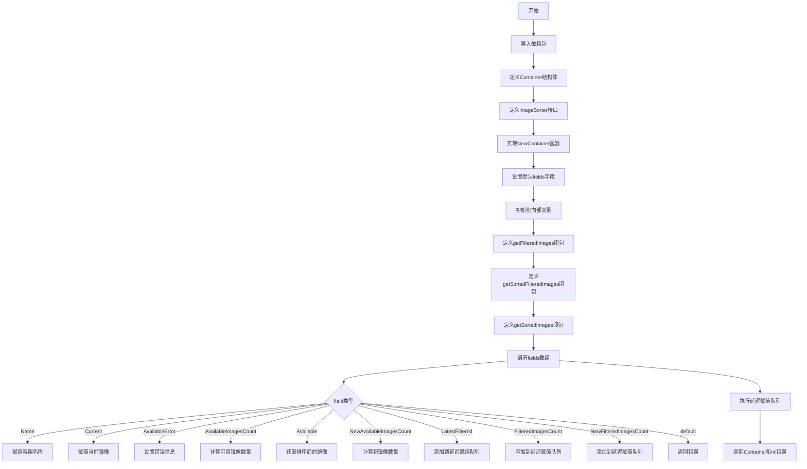

# `flux\pkg\api\v6\container.go` 详细设计文档

该文件定义了用于描述单个容器（包括当前镜像信息和可用镜像列表）的数据结构Container，并提供了NewContainer函数来构建容器实例。该实现通过memoization（记忆化）技术优化了镜像的过滤和排序性能，减少不必要的计算。

## 整体流程



## 类结构

```
Container (结构体)
└── imageSorter (接口)
    ├── SortedImages(policy.Pattern) update.SortedImageInfos
    └── Images() []image.Info
```

## 全局变量及字段


### `sortedImages`
    
记忆化的排序镜像列表

类型：`update.SortedImageInfos`
    


### `filteredImages`
    
记忆化的过滤镜像列表

类型：`[]image.Info`
    


### `sortedFilteredImages`
    
记忆化的排序且过滤的镜像列表

类型：`update.SortedImageInfos`
    


### `assignFields`
    
延迟执行的字段赋值函数队列

类型：`[]func()`
    


### `fields`
    
需要计算的字段列表

类型：`[]string`
    


### `Container.Name`
    
容器名称

类型：`string`
    


### `Container.Current`
    
当前使用的镜像信息

类型：`image.Info`
    


### `Container.LatestFiltered`
    
最新过滤后的镜像

类型：`image.Info`
    


### `Container.Available`
    
所有可用镜像列表（忽略标签过滤）

类型：`update.SortedImageInfos`
    


### `Container.AvailableError`
    
获取可用镜像时的错误信息

类型：`string`
    


### `Container.AvailableImagesCount`
    
可用镜像总数

类型：`int`
    


### `Container.NewAvailableImagesCount`
    
新增可用镜像数量

类型：`int`
    


### `Container.FilteredImagesCount`
    
过滤后的镜像数量

类型：`int`
    


### `Container.NewFilteredImagesCount`
    
新增过滤镜像数量

类型：`int`
    
    

## 全局函数及方法


### `NewContainer`

创建 Container 实例的主工厂函数，通过 memoization 技术优化图像过滤和排序操作，支持按需计算并填充指定的容器字段。

参数：

- `name`：`string`，容器名称
- `images`：`imageSorter`，图像排序器接口，提供图像列表和排序功能
- `currentImage`：`image.Info`，当前运行的镜像信息
- `tagPattern`：`policy.Pattern`，标签过滤模式，用于筛选符合规则的镜像
- `fields`：`[]string`，需要填充的字段名称列表，默认为全部字段

返回值：`Container, error`，成功时返回填充好的容器对象，失败时返回错误信息（如字段无效）

#### 流程图

```mermaid
flowchart TD
    A[开始 NewContainer] --> B{fields 是否为空?}
    B -->|是| C[设置默认字段列表]
    B -->|否| D[使用传入的 fields]
    C --> E[初始化空 Container]
    D --> E
    E --> F[定义延迟计算函数]
    
    F --> G[遍历 fields 列表]
    G --> H{当前 field 是?}
    
    H -->|Name| I[c.Name = name]
    H -->|Current| J[c.Current = currentImage]
    H -->|AvailableError| K{images == nil?}
    K -->|是| L[c.AvailableError = registry.ErrNoImageData.Error]
    K -->|否| M[跳过]
    H -->|AvailableImagesCount| N[c.AvailableImagesCount = len(images.Images)]
    H -->|Available| O[c.Available = getSortedImages]
    H -->|NewAvailableImagesCount| P[计算新镜像数量]
    H -->|LatestFiltered| Q[添加到 assignFields 延迟执行]
    H -->|FilteredImagesCount| R[添加到 assignFields 延迟执行]
    H -->|NewFilteredImagesCount| S[添加到 assignFields 延迟执行]
    H -->|无效字段| T[返回错误]
    
    I --> U
    J --> U
    L --> U
    M --> U
    N --> U
    O --> U
    P --> U
    Q --> U
    R --> U
    S --> U
    
    U{fields 遍历完成?}
    U -->|否| G
    
    U -->|是| V[执行 assignFields 延迟函数]
    V --> W[返回 Container 和 nil]
    
    T --> X[返回空 Container 和错误]
    
    style T fill:#ffcccc
    style X fill:#ffcccc
    style W fill:#ccffcc
```

#### 带注释源码

```go
// NewContainer 创建 Container 实例的主工厂函数
// 参数：
//   - name: 容器名称
//   - images: 图像排序器接口，提供图像数据和排序方法
//   - currentImage: 当前运行的镜像信息
//   - tagPattern: 标签过滤模式
//   - fields: 需要填充的字段列表
// 返回值：成功返回 Container 实例，失败返回错误
func NewContainer(name string, images imageSorter, currentImage image.Info, tagPattern policy.Pattern, fields []string) (Container, error) {
	// 如果未指定字段，则使用默认字段列表
	if len(fields) == 0 {
		fields = []string{
			"Name",
			"Current",
			"LatestFiltered",
			"Available",
			"AvailableError",
			"AvailableImagesCount",
			"NewAvailableImagesCount",
			"FilteredImagesCount",
			"NewFilteredImagesCount",
		}
	}

	// 初始化空容器
	var c Container

	// 定义用于 memoization 的缓存变量
	// 这些变量用于存储中间计算结果，避免重复计算
	var (
		sortedImages         update.SortedImageInfos // 已排序的镜像列表
		filteredImages       []image.Info            // 已过滤的镜像列表
		sortedFilteredImages update.SortedImageInfos // 已排序且已过滤的镜像列表
	)

	// 获取过滤后的镜像列表（带缓存）
	getFilteredImages := func() []image.Info {
		if filteredImages == nil {
			// 首次调用时执行过滤操作，结果被缓存
			filteredImages = update.FilterImages(images.Images(), tagPattern)
		}
		return filteredImages
	}

	// 获取已排序的过滤镜像（带缓存）
	getSortedFilteredImages := func() update.SortedImageInfos {
		if sortedFilteredImages == nil {
			// 先获取过滤后的镜像，再进行排序
			sortedFilteredImages = update.SortImages(getFilteredImages(), tagPattern)
		}
		return sortedFilteredImages
	}

	// 获取已排序的镜像列表（带缓存，并优化过滤流程）
	getSortedImages := func() update.SortedImageInfos {
		if sortedImages == nil {
			// 获取已排序的镜像
			sortedImages = images.SortedImages(tagPattern)

			// 优化策略：既然已经获取了已排序的镜像，
			// 最快的获取已排序且已过滤镜像的方式是对已排序镜像进行过滤
			// 替换 getSortedFilteredImages 的实现
			getSortedFilteredImages = func() update.SortedImageInfos {
				if sortedFilteredImages == nil {
					// 对已排序镜像进行过滤
					sortedFilteredImages = update.FilterImages(sortedImages, tagPattern)
				}
				return sortedFilteredImages
			}

			// 同时优化 getFilteredImages 的实现
			getFilteredImages = func() []image.Info {
				// 直接从已排序的过滤镜像转换
				return []image.Info(getSortedFilteredImages())
			}
		}
		return sortedImages
	}

	// 延迟执行函数列表：这些字段依赖于其他字段的计算结果
	// 需要在主要字段计算完成后执行
	assignFields := []func(){}

	// 遍历所有需要填充的字段
	for _, field := range fields {
		switch field {
		// --- 依赖输入参数的字段 ---
		case "Name":
			c.Name = name
		case "Current":
			c.Current = currentImage
		case "AvailableError":
			// 如果没有图像数据，设置错误信息
			if images == nil {
				c.AvailableError = registry.ErrNoImageData.Error()
			}
		case "AvailableImagesCount":
			// 统计所有可用镜像数量
			c.AvailableImagesCount = len(images.Images())

		// --- 需要排序镜像的字段 ---
		case "Available":
			// 获取所有已排序的镜像
			c.Available = getSortedImages()
		case "NewAvailableImagesCount":
			// 统计比当前镜像更新的镜像数量
			newImagesCount := 0
			for _, img := range getSortedImages() {
				// 如果当前镜像不比目标镜像新，则停止计数
				if !tagPattern.Newer(&img, &currentImage) {
					break
				}
				newImagesCount++
			}
			c.NewAvailableImagesCount = newImagesCount

		// --- 需要延迟计算的字段（依赖其他字段的结果）---
		case "LatestFiltered": // 需要已排序且已过滤的镜像
			assignFields = append(assignFields, func() {
				latest, _ := getSortedFilteredImages().Latest()
				c.LatestFiltered = latest
			})
		case "FilteredImagesCount": // 需要已过滤的镜像标签
			assignFields = append(assignFields, func() {
				c.FilteredImagesCount = len(getFilteredImages())
			})
		case "NewFilteredImagesCount": // 需要已过滤的镜像
			assignFields = append(assignFields, func() {
				newFilteredImagesCount := 0
				for _, img := range getSortedFilteredImages() {
					if !tagPattern.Newer(&img, &currentImage) {
						break
					}
					newFilteredImagesCount++
				}
				c.NewFilteredImagesCount = newFilteredImagesCount
			})
		default:
			// 无效字段，返回错误
			return c, errors.Errorf("%s is an invalid field", field)
		}
	}

	// 执行所有延迟计算的字段赋值
	for _, fn := range assignFields {
		fn()
	}

	// 返回填充好的容器对象
	return c, nil
}
```


### `imageSorter.SortedImages`

这是 `imageSorter` 接口中定义的方法，用于获取根据指定策略模式排序的镜像列表。在 `NewContainer` 函数中通过懒加载方式调用此方法，以优化性能。

参数：

- `pattern`：`policy.Pattern`，用于排序镜像的策略模式（如版本号排序规则）

返回值：`update.SortedImageInfos`，返回按指定模式排序后的镜像信息列表

#### 流程图

```mermaid
flowchart TD
    A[调用 SortedImages] --> B{缓存 sortedImages 是否为空?}
    B -->|是| C[调用 images.SortedImages(tagPattern) 获取排序后的镜像]
    C --> D[更新 getSortedFilteredImages 闭包为直接过滤 sortedImages]
    D --> E[更新 getFilteredImages 闭包为从 sortedFilteredImages 转换]
    B -->|否| F[直接返回缓存的 sortedImages]
    E --> G[返回排序后的镜像列表]
    F --> G
```

#### 带注释源码

```go
type imageSorter interface {
	// SortedImages returns the known images, sorted according to the
	// pattern given
	SortedImages(policy.Pattern) update.SortedImageInfos
	// Images returns the images in no defined order
	Images() []image.Info
}

// 在 NewContainer 函数中的调用方式：
getSortedImages := func() update.SortedImageInfos {
    // 检查是否已有缓存的排序镜像列表
    if sortedImages == nil {
        // 调用 imageSorter 接口的 SortedImages 方法
        // 传入 tagPattern (policy.Pattern 类型) 进行排序
        sortedImages = images.SortedImages(tagPattern)
        
        // 优化策略：既然已经获得了排序后的镜像列表
        // 获取排序且过滤镜像的最快方式就是直接过滤已排序的列表
        getSortedFilteredImages = func() update.SortedImageInfos {
            if sortedFilteredImages == nil {
                // 直接从已排序的镜像列表中过滤
                sortedFilteredImages = update.FilterImages(sortedImages, tagPattern)
            }
            return sortedFilteredImages
        }
        
        // 同样优化过滤镜像的获取方式
        getFilteredImages = func() []image.Info {
            return []image.Info(getSortedFilteredImages())
        }
    }
    // 返回排序后的镜像列表 (update.SortedImageInfos 类型)
    return sortedImages
}
```


### `imageSorter.Images`

返回无序的镜像列表。该方法是 `imageSorter` 接口的定义，用于获取所有可用的镜像信息，不进行任何排序或过滤操作。

参数：无

返回值：`[]image.Info`，返回包含所有可用镜像信息的切片，不保证顺序。

#### 流程图

```mermaid
flowchart TD
    A[开始] --> B{调用 Images 方法}
    B --> C[返回 []image.Info]
    C --> D[结束]
    
    style B fill:#f9f,stroke:#333,stroke-width:2px
    style C fill:#9f9,stroke:#333,stroke-width:2px
```

#### 带注释源码

```go
type imageSorter interface {
	// SortedImages returns the known images, sorted according to the
	// pattern given
	SortedImages(policy.Pattern) update.SortedImageInfos
	// Images returns the images in no defined order
	Images() []image.Info
}
```

**源码说明：**

- `imageSorter` 是一个接口类型，定义了容器镜像的查询方法
- `Images()` 方法是该接口的第二个方法声明
- 返回类型 `[]image.Info` 是 Go 切片类型，包含多个镜像信息
- 该方法的设计目的是为了提供一种获取所有镜像的简单方式，调用方不需要关心镜像的排序或过滤
- 具体实现类需要实现此方法，从镜像仓库获取完整的镜像列表

## 关键组件


### Container 结构体

用于描述单个容器的结构体，包含容器名称、当前镜像信息、可用镜像列表以及各种计数字段。支持跟踪镜像的可用性和过滤状态。

### imageSorter 接口

定义图像排序和获取的接口，包含SortedImages方法和Images方法，用于获取排序或无序的镜像列表。

### NewContainer 函数

用于创建Container实例的工厂函数，接收容器名称、图像排序器、当前镜像、标签模式和字段列表作为参数。采用惰性加载和记忆化技术优化图像过滤和排序操作，避免重复计算。

### 惰性加载与记忆化机制

通过闭包函数（getFilteredImages、getSortedFilteredImages、getSortedImages）实现按需计算，并将计算结果缓存到变量中，避免重复的O(n)过滤和O(n log n)排序操作。

### 字段延迟赋值机制

使用assignFields切片存储依赖其他字段计算的函数，在主循环之后统一执行，确保依赖字段已被计算。

### 镜像过滤与排序

调用update包的FilterImages和SortImages函数，根据policy.Pattern对镜像进行过滤和排序，支持标签模式匹配。


## 问题及建议


### 已知问题

- **空指针风险**：在`NewContainer`函数中，当`images`为nil时，访问`images.Images()`会导致panic，尽管前面检查了`images == nil`用于设置`AvailableError`，但其他case分支（如"AvailableImagesCount"）未做空值检查
- **接口错误处理缺失**：`imageSorter`接口的`SortedImages`和`Images()`方法没有返回错误，但底层registry操作可能失败，导致错误信息只能通过`AvailableError`字符串字段传递，丢失了具体的错误类型
- **闭包变量副作用**：`getSortedImages`函数内部直接修改了外部定义的`getSortedFilteredImages`和`getFilteredImages`函数变量，这种技巧性写法虽然实现了优化但严重降低了代码可读性和可维护性
- **排序假设未验证**：`NewAvailableImagesCount`和`NewFilteredImagesCount`的计算假设镜像已按时间排序，但如果`SortedImages`返回的排序顺序与预期不符，结果将不准确
- **字段校验不完整**：对未知字段只是返回错误而非忽略，可能导致调用方必须精确知道所有有效字段名，缺乏容错性

### 优化建议

- 在所有访问`images`字段的case分支前增加空值检查，或在函数开始时统一验证参数有效性
- 考虑重构`imageSorter`接口，为`SortedImages`和`Images()`方法添加error返回值，或创建新的带错误返回的接口
- 将memoization逻辑提取为独立的辅助类型（如`MemoizedImageSorter`），避免在函数内部重绑定函数变量，提高代码清晰度
- 在计算"新镜像数量"前，增加对排序策略的验证或文档说明排序假设
- 对未知字段采用静默忽略或警告日志的方式处理，提高API的容错性
- 添加单元测试覆盖，特别是边界条件（nil images、空images列表、无效字段名等）

## 其它


### 设计目标与约束

本代码的设计目标是提供一个高效的Container对象创建机制，通过memoization（记忆化）技术最小化镜像过滤和排序的次数，从而优化性能。约束条件包括：fields参数必须包含有效的字段名，否则返回错误；tagPattern不能为nil，否则可能导致空指针异常；images接口的实现者必须提供正确的SortedImages和Images方法。

### 错误处理与异常设计

错误处理主要通过errors.Errorf返回格式化的错误信息。错误场景包括：1) 无效的字段名传入时返回"xxx is an invalid field"错误；2) 当images为nil时，AvailableError字段会被设置为registry.ErrNoImageData的错误信息。代码没有使用panic，而是通过返回值传递错误，符合Go语言的错误处理惯用法。

### 数据流与状态机

数据流主要分为三个阶段：初始化阶段（设置默认fields）、计算阶段（通过switch匹配字段并注册计算函数）、执行阶段（按顺序执行assignFields中的函数）。状态机体现在getFilteredImages、getSortedFilteredImages和getSortedImages三个闭包函数的状态转换，它们通过nil检查实现延迟计算和结果缓存。

### 外部依赖与接口契约

本代码依赖以下外部包：github.com/fluxcd/flux/pkg/image（镜像信息定义）、github.com/fluxcd/flux/pkg/policy（标签模式匹配）、github.com/fluxcd/flux/pkg/registry（注册表错误定义）、github.com/fluxcd/flux/pkg/update（镜像更新相关工具函数）。imageSorter接口规定了SortedImages(policy.Pattern) update.SortedImageInfos和Images() []image.Info两个方法的契约。

### 性能考虑与优化策略

核心优化策略是memoization：通过延迟计算和结果缓存避免重复的过滤和排序操作。时间复杂度从O(n * f)降低到O(n log n)，其中n为镜像数量，f为请求的字段数量。空间复杂度略有增加，但通过共享sortedImages和sortedFilteredImages避免了额外的内存开销。

### 并发安全性

代码本身不包含并发控制机制，其并发安全性取决于调用者。如果多个goroutine共享同一个Container实例，需要外部加锁。getFilteredImages等闭包函数访问的filteredImages等变量不是线程安全的。

### 测试策略建议

建议添加以下测试用例：1) 空fields参数使用默认字段；2) 无效字段名返回错误；3) images为nil时的错误处理；4) 大量镜像数据下的性能基准测试；5) 各种字段组合的边界情况测试；6) tagPattern为nil时的行为验证。

### 配置管理

代码中的默认字段在NewContainer函数内部硬编码，如果需要可配置化，建议提取到配置结构体中。tagPattern和fields通过参数传入，体现了良好的可配置性。

### 版本兼容性

当前版本为v6包，需要注意与旧版本的API兼容性。imageSorter接口的定义在包内部，如果接口变更可能影响使用该接口的客户端代码。

### 可观测性与调试支持

建议添加日志记录关键的计算节点执行情况，特别是在assignFields阶段执行各个闭包函数时。可以通过添加简单的日志语句帮助调试memoization是否正常工作。


    