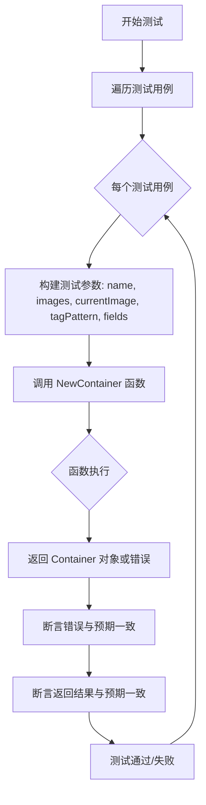
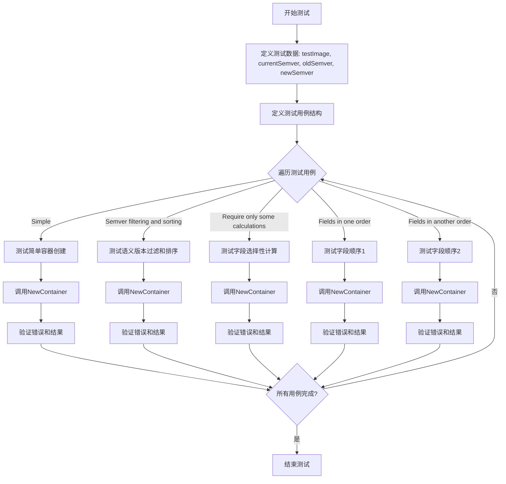

# `flux\pkg\api\v6\container_test.go` 详细设计文档

该文件是一个 Go 测试文件，用于测试 NewContainer 函数的容器镜像管理功能，支持 semver 版本过滤、按需字段计算和镜像排序等核心功能。

## 整体流程



## 类结构

```
justSlice (实现 Images 和 SortedImages 接口)
├── Images() []image.Info
└── SortedImages(p policy.Pattern) update.SortedImageInfos
```

## 全局变量及字段


### `testImage`
    
测试用的镜像信息，包含ImageID为'test'

类型：`image.Info`
    


### `currentSemver`
    
当前版本的镜像信息，Tag为1.0.0

类型：`image.Info`
    


### `oldSemver`
    
旧版本的镜像信息，Tag为0.9.0

类型：`image.Info`
    


### `newSemver`
    
新版本的镜像信息，Tag为1.2.3

类型：`image.Info`
    


### `tests`
    
测试用例切片，包含多个匿名测试用例结构体用于测试NewContainer函数

类型：`[]struct{...}`
    


### `args.name`
    
容器名称

类型：`string`
    


### `args.images`
    
可用镜像列表

类型：`[]image.Info`
    


### `args.currentImage`
    
当前镜像信息

类型：`image.Info`
    


### `args.tagPattern`
    
镜像标签过滤模式

类型：`policy.Pattern`
    


### `args.fields`
    
需要计算的字段列表

类型：`[]string`
    


### `匿名测试用例结构体.name`
    
测试用例名称

类型：`string`
    


### `匿名测试用例结构体.args`
    
测试参数结构体

类型：`args`
    


### `匿名测试用例结构体.want`
    
期望的Container返回值

类型：`Container`
    


### `匿名测试用例结构体.wantErr`
    
是否期望返回错误

类型：`bool`
    
    

## 全局函数及方法


### TestNewContainer

这是一个Go语言的测试函数，用于验证`NewContainer`函数在创建容器对象时的各种行为，包括基本容器创建、语义版本过滤和排序、字段选择性计算以及不同字段顺序的处理。

参数：

- `t`：`testing.T`，Go测试框架的标准参数，用于报告测试失败和日志输出

返回值：无（Go测试函数返回void），通过`testing.T`的方法和`assert`包进行结果验证

#### 流程图



#### 带注释源码

```go
func TestNewContainer(t *testing.T) {
    // 定义测试用的镜像信息
    testImage := image.Info{ImageID: "test"}
    
    // 定义语义版本相关的镜像
    currentSemver := image.Info{ID: image.Ref{Tag: "1.0.0"}}
    oldSemver := image.Info{ID: image.Ref{Tag: "0.9.0"}}
    newSemver := image.Info{ID: image.Ref{Tag: "1.2.3"}}
    
    // 定义测试参数结构体
    type args struct {
        name         string              // 容器名称
        images       []image.Info        // 可用镜像列表
        currentImage image.Info          // 当前镜像
        tagPattern   policy.Pattern      // 标签过滤模式
        fields       []string            // 需要计算的字段列表
    }
    
    // 定义测试用例切片
    tests := []struct {
        name    string                  // 测试用例名称
        args    args                   // 测试参数
        want    Container               // 期望的容器结果
        wantErr bool                   // 是否期望返回错误
    }{
        // 测试用例1: 简单容器创建
        {
            name: "Simple",
            args: args{
                name:         "container1",
                images:       []image.Info{testImage},
                currentImage: testImage,
                tagPattern:   policy.PatternAll, // 接受所有标签
            },
            want: Container{
                Name:                    "container1",
                Current:                 testImage,
                LatestFiltered:          testImage,
                Available:               []image.Info{testImage},
                AvailableImagesCount:    1,
                NewAvailableImagesCount: 0,
                FilteredImagesCount:     1,
                NewFilteredImagesCount:  0,
            },
            wantErr: false,
        },
        
        // 测试用例2: 语义版本过滤和排序
        {
            name: "Semver filtering and sorting",
            args: args{
                name:         "container-semver",
                images:       []image.Info{currentSemver, newSemver, oldSemver, testImage},
                currentImage: currentSemver,
                tagPattern:   policy.NewPattern("semver:*"), // 只接受semver标签
            },
            want: Container{
                Name:                    "container-semver",
                Current:                 currentSemver,
                LatestFiltered:          newSemver, // 1.2.3 > 1.0.0
                Available:               []image.Info{newSemver, currentSemver, oldSemver, testImage},
                AvailableImagesCount:    4,
                NewAvailableImagesCount: 1, // newSemver是新的
                FilteredImagesCount:     3, // 过滤后只有semver标签的
                NewFilteredImagesCount:  1,
            },
            wantErr: false,
        },
        
        // 测试用例3: 仅计算部分字段
        {
            name: "Require only some calculations",
            args: args{
                name:         "container-some",
                images:       []image.Info{currentSemver, newSemver, oldSemver, testImage},
                currentImage: currentSemver,
                tagPattern:   policy.NewPattern("semver:*"),
                fields:       []string{"Name", "NewFilteredImagesCount"}, // 只计算这两个字段
            },
            want: Container{
                Name:                   "container-some",
                NewFilteredImagesCount: 1,
            },
        },
        
        // 测试用例4: 字段顺序1
        {
            name: "Fields in one order",
            args: args{
                name:         "container-ordered1",
                images:       []image.Info{currentSemver, newSemver, oldSemver, testImage},
                currentImage: currentSemver,
                tagPattern:   policy.NewPattern("semver:*"),
                fields: []string{
                    "Name",
                    "AvailableImagesCount", "Available",       // 这两个依赖相同中间结果
                    "LatestFiltered", "FilteredImagesCount", // 这两个依赖另一个中间结果
                },
            },
            want: Container{
                Name:                 "container-ordered1",
                Available:            []image.Info{newSemver, currentSemver, oldSemver, testImage},
                AvailableImagesCount: 4,
                LatestFiltered:       newSemver,
                FilteredImagesCount:  3,
            },
        },
        
        // 测试用例5: 字段顺序2
        {
            name: "Fields in another order",
            args: args{
                name:         "container-ordered2",
                images:       []image.Info{currentSemver, newSemver, oldSemver, testImage},
                currentImage: currentSemver,
                tagPattern:   policy.NewPattern("semver:*"),
                fields: []string{
                    "Name",
                    "Available", "AvailableImagesCount",       // 顺序与上面相反
                    "FilteredImagesCount", "LatestFiltered", // 顺序与上面相反
                },
            },
            want: Container{
                Name:                 "container-ordered2",
                Available:            []image.Info{newSemver, currentSemver, oldSemver, testImage},
                AvailableImagesCount: 4,
                LatestFiltered:       newSemver,
                FilteredImagesCount:  3,
            },
        },
    }
    
    // 遍历所有测试用例执行测试
    for _, tt := range tests {
        t.Run(tt.name, func(t *testing.T) {
            // 调用被测试的NewContainer函数
            got, err := NewContainer(
                tt.args.name, 
                justSlice(tt.args.images),    // 使用justSlice适配器
                tt.args.currentImage, 
                tt.args.tagPattern, 
                tt.args.fields,
            )
            
            // 验证是否产生错误（如果有）
            assert.Equal(t, tt.wantErr, err != nil)
            
            // 验证返回的容器是否符合预期
            assert.Equal(t, tt.want, got)
        })
    }
}
```


### `justSlice.Images`

该方法实现了将自定义类型 `justSlice`（底层为 `[]image.Info`）转换并返回为标准 `[]image.Info` 切片的功能。它通常用于满足某个接口（如 `image.Container`）以获取容器镜像列表。

参数：

- （无显式参数，依赖于隐式接收器 `j justSlice`）

返回值：

- `[]image.Info`，返回 `justSlice` 中包含的镜像信息列表。

#### 流程图

```mermaid
graph TD
    A[开始: 调用 j.Images] --> B{类型转换}
    B --> C[将 justSlice 转换为 []image.Info]
    C --> D[返回镜像列表]
```

#### 带注释源码

```go
// Images 返回 justSlice 中包含的镜像信息列表。
// 它执行从自定义类型 justSlice 到标准 Go 切片类型 []image.Info 的类型转换。
func (j justSlice) Images() []image.Info {
	// 将接收者 j (类型 justSlice) 转换为 []image.Info 并返回
	return []image.Info(j)
}
```


### `justSlice.SortedImages`

该方法接收一个 `policy.Pattern` 类型的过滤策略参数，调用 `Images()` 方法获取底层图像列表，然后使用 `update.SortImages` 函数根据指定的策略对图像进行排序和筛选，最终返回排序后的图像信息列表。

参数：

- `p`：`policy.Pattern`，用于过滤和排序图像的策略模式（如 "semver:*"、"all" 等）

返回值：`update.SortedImageInfos`，经过排序和过滤后的图像信息列表

#### 流程图

```mermaid
flowchart TD
    A[开始 SortedImages] --> B[调用 j.Images 获取图像列表]
    B --> C[调用 update.SortImages 排序过滤]
    C --> D[返回 SortedImageInfos]
    
    B --> B1[返回 []image.Info]
    B1 --> C
```

#### 带注释源码

```go
// SortedImages 根据传入的 policy.Pattern 对图像进行排序和过滤
// 参数 p: policy.Pattern 类型，用于指定排序/过滤规则（如 semver:* 表示按语义版本排序）
// 返回: update.SortedImageInfos 类型的排序后的图像信息切片
func (j justSlice) SortedImages(p policy.Pattern) update.SortedImageInfos {
    // 调用 Images 方法获取底层图像列表，然后传递给 SortImages 进行排序
    return update.SortImages(j.Images(), p)
}
```

## 关键组件


### justSlice 类型

一个简单的图像信息切片包装类型，实现了Images和SortedImages接口方法，用于提供容器镜像的列表和排序功能。

### Images() 方法

返回底层存储的所有镜像信息切片，实现了接口的数据提供功能。

### SortedImages(policy.Pattern) 方法

根据传入的策略模式对镜像进行过滤和排序，返回符合策略规则的已排序镜像列表。

### NewContainer 函数

核心函数，根据名称、镜像列表、当前镜像、标签策略和指定字段列表构建容器对象，支持惰性加载和按需计算。

### 策略模式匹配 (semver:*)

通过policy.NewPattern("semver:*")实现语义版本过滤，仅保留符合语义版本规则的镜像。

### 字段依赖计算

测试用例展示了不同字段之间的计算依赖关系，如Available和AvailableImagesCount依赖相同的中介结果，FilteredImagesCount和LatestFiltered依赖另一个中介结果。

### 测试场景设计

包含简单容器创建、semver过滤排序、按需字段计算、不同字段顺序依赖等测试场景，用于验证NewContainer函数的正确性和灵活性。


## 问题及建议


### 已知问题

- **类型安全问题**：通过字符串数组`fields`指定字段名的方式缺乏编译时类型检查，容易因拼写错误导致运行时问题，且IDE无法提供自动补全。
- **justSlice类型设计**：类型名称`justSlice`语义不明确，且仅作为适配器使用，缺乏清晰的领域语义，文档注释缺失。
- **测试覆盖不完整**：所有测试用例的`wantErr`均为`false`，缺少对错误场景（如空名称、无效图片、nil参数等）的测试覆盖。
- **测试数据重复**：多个测试用例中重复构建相似的`image.Info`和`policy.Pattern`对象，未提取为共享的测试fixture，降低了代码可维护性。
- **接口实现不透明**：`justSlice`实现了`Images()`和`SortedImages()`方法，但未说明其实现的接口契约，代码可读性较差。

### 优化建议

- **类型安全改进**：将字段名数组改为`struct`类型或使用常量定义支持的字段，利用编译期检查避免字符串拼写错误。
- **提取测试 Fixture**：在测试文件开头或`setup`函数中定义共享的测试数据对象（如`testImage`、`currentSemver`等），减少重复代码。
- **增加错误场景测试**：补充边界条件测试用例，包括空images列表、nil currentImage、无效tagPattern等情况，验证错误处理逻辑。
- **完善文档注释**：为`justSlice`类型及其方法添加文档说明，明确其用途和实现的接口。
- **使用Table-Driven改进模式**：将重复的测试数据准备逻辑提取到独立的helper函数中，提升测试代码清晰度。

## 其它


### 设计目标与约束

本文档描述的代码是一个用于测试 Flux CD 项目中容器镜像管理的单元测试文件。其核心目标是验证 `NewContainer` 函数的正确性，该函数负责根据给定的镜像列表、当前镜像、标签策略和所需字段，创建一个包含镜像信息的容器结构体。代码的设计约束包括：遵循 Flux CD 项目的包结构规范、使用 stretcher/testify 断言库进行测试、使用 semver 模式进行镜像过滤和排序、支持按需计算特定字段以优化性能。

### 错误处理与异常设计

测试用例覆盖了两种错误场景：正常情况（wantErr: false）和异常情况（wantErr: true）。代码通过 `assert.Equal(t, tt.wantErr, err != nil)` 验证错误是否按预期产生。在实际实现中，`NewContainer` 函数应返回错误当输入参数无效（如空名称、无效的标签策略等）时。测试中的 "Simple" 和 "Semver filtering and sorting" 用例验证了正常流程，而 "Require only some calculations" 用例则验证了部分字段计算的场景。

### 数据流与状态机

数据流主要分为三个阶段：输入阶段接收容器名称、镜像切片、当前镜像、标签策略和可选字段列表；处理阶段根据标签策略过滤镜像、排序镜像列表、计算各项统计指标（如可用镜像数量、过滤后镜像数量等）；输出阶段返回填充好的 Container 结构体。状态机方面，容器存在两种主要状态：初始状态（空容器）和完成状态（所有字段已计算）。字段计算存在依赖关系：AvailableImagesCount 依赖 Available，FilteredImagesCount 依赖 LatestFiltered，测试用例验证了不同字段计算顺序不会影响最终结果。

### 外部依赖与接口契约

代码依赖三个外部包：testing（标准库）、github.com/stretchr/testify/assert（断言库）、github.com/fluxcd/flux/pkg/image（镜像信息）、github.com/fluxcd/flux/pkg/policy（策略模式）、github.com/fluxcd/flux/pkg/update（更新相关）。justSlice 类型实现了隐式接口（可能为 Containerable 或类似接口），需要提供 Images() 返回 []image.Info 和 SortedImages(policy.Pattern) 返回 update.SortedImageInfos 两个方法。NewContainer 函数的接口契约为：输入 name（字符串）、images（实现上述接口的类型）、currentImage（image.Info）、tagPattern（policy.Pattern）、fields（可选字符串切片），输出 Container 结构体和错误。

### 配置参数与常量

本测试文件中未定义显式的配置常量。所有配置通过测试用例的参数传递，包括：容器名称（name）、镜像列表（images）、当前镜像（currentImage）、标签策略（tagPattern，如 policy.PatternAll 或 semver:* 模式）、需要计算的字段列表（fields）。policy.PatternAll 可能是一个预定义的常量，表示匹配所有标签的策略。

### 并发与线程安全

本测试文件为顺序执行的单元测试，未涉及并发场景。在实际实现中，如果 NewContainer 函数被并发调用，应确保其线程安全性。由于测试代码本身不涉及并发测试，无需在此处添加并发保护机制。

### 性能考量

测试用例 "Fields in one order" 和 "Fields in another order" 专门验证了字段计算的优化逻辑。该优化通过缓存中间计算结果（如 Available 和 LatestFiltered），避免重复计算依赖相同中间结果的字段。测试验证了即使字段顺序不同，最终结果一致，这表明内部实现了计算结果复用机制。这种优化对于大量镜像的场景尤为重要。

### 安全考虑

本测试文件不涉及安全敏感操作。镜像信息来源于测试数据，不涉及真实的凭证或敏感信息。在生产环境中，应确保镜像仓库的访问安全，但测试代码本身无此考量。

### 兼容性设计

代码位于 v6 包中，表明这是 API 的第六个版本。NewContainer 函数接受可选的 fields 参数实现向后兼容：新版本可以添加新字段而不影响旧代码。标签策略使用 semver:* 模式，支持语义化版本控制，这种设计允许灵活扩展新的匹配策略而不破坏现有功能。

### 测试覆盖范围

测试覆盖了四种主要场景：基本功能验证（Simple）、semver 过滤和排序验证（Semver filtering and sorting）、部分字段计算验证（Require only some calculations）、字段顺序无关性验证（Fields in one order 和 Fields in another order）。边界情况测试包括：单镜像场景、多版本镜像场景、混合标签类型场景。测试使用具体的镜像标签（如 "1.0.0"、"0.9.0"、"1.2.3"）验证版本比较逻辑。


    