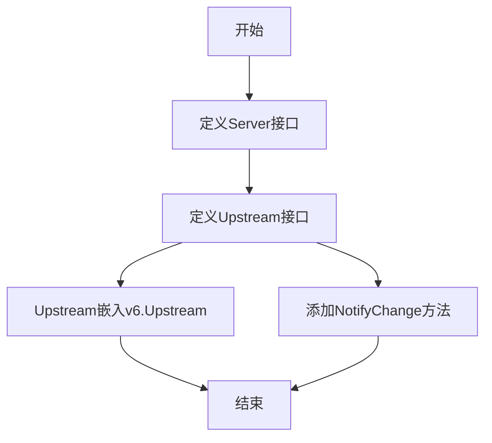
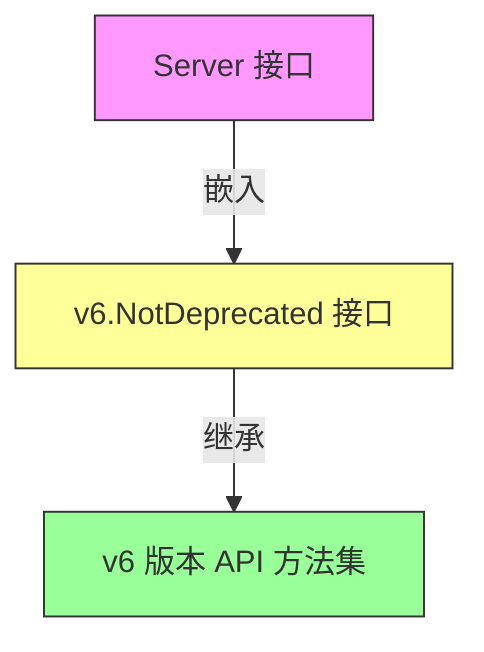
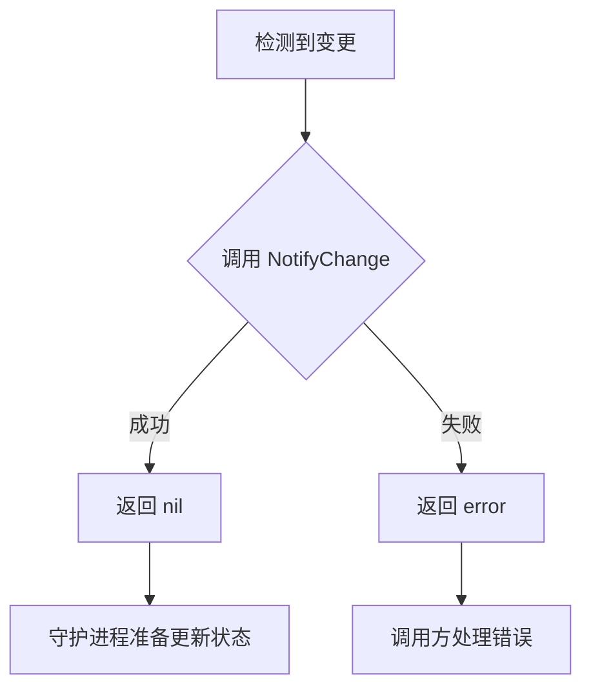

# `flux\pkg\api\v9\api.go` 详细设计文档

该文件定义了Flux API版本9的类型接口，包括Server接口（继承v6.NotDeprecated）和Upstream接口（继承v6.Upstream并扩展了NotifyChange方法用于通知 daemon 检测到的变更）

## 整体流程



## 类结构

```
v9 包
├── Server 接口 (嵌入 v6.NotDeprecated)
└── Upstream 接口 (嵌入 v6.Upstream + NotifyChange 方法)
```

## 全局变量及字段


    

## 全局函数及方法


### Server 嵌入接口 v6.NotDeprecated

该接口通过嵌入 v6.NotDeprecated 接口的方式，使 Server 接口继承了 v6 版本的非弃用功能，作为版本兼容性层的一部分。

参数：无需参数（接口定义）

返回值：`无直接返回值`（嵌入接口本身不产生调用结果）

#### 流程图



#### 带注释源码

```go
// Server 接口定义在 v9 包中
// 通过嵌入 v6.NotDeprecated 接口，继承 v6 版本的非弃用方法
// 这是一种接口组合（Interface Embedding）模式，用于实现版本向后兼容
type Server interface {
    // v6.NotDeprecated 是 v6 包的接口，嵌入后 Server 接口自动获得
    // v6.NotDeprecated 中定义的所有方法声明
    // 具体方法需参考 v6 包的 NotDeprecated 接口定义
    v6.NotDeprecated
}
```

#### 补充说明

由于代码中仅展示了嵌入声明，未展示 v6.NotDeprecated 接口的完整定义（该定义位于 `github.com/fluxcd/flux/pkg/api/v6` 包中），因此：

1. **嵌入接口本质**：不是方法调用，而是接口组合（Interface Embedding）
2. **继承关系**：Server 接口自动拥有 v6.NotDeprecated 接口中声明的所有方法
3. **设计目的**：实现 API 版本平滑过渡，确保旧版本客户端可使用新版本服务


### `Upstream.NotifyChange`

`NotifyChange` 是 `Upstream` 接口中定义的一个方法，用于通知守护进程（daemon）已检测到仓库或镜像注册表等发生了变化，建议此时更新其状态。

参数：

- `context`：`context.Context`，请求的上下文，用于传递截止时间、取消信号等
- `change`：`Change`，检测到的变更内容，包含需要同步的资源和配置信息

返回值：`error`，如果通知成功则返回 `nil`，否则返回相应的错误信息

#### 流程图



#### 带注释源码

```go
// Upstream 接口定义了与上游系统交互的方法
type Upstream interface {
	v6.Upstream

	// ChangeNotify 通知守护进程已注意到仓库或镜像注册表等发生了变化，
	// 现在是更新其状态的好时机。
	//
	// 参数:
	//   - context: 上下文信息，用于控制请求的生命周期
	//   - Change: 变更通知的内容，包含需要同步的变更信息
	//
	// 返回值:
	//   - error: 如果通知成功返回 nil，否则返回错误
	NotifyChange(context.Context, Change) error
}
```

#### 补充说明

- **接口性质**：这是一个 Go 语言接口定义，具体的实现逻辑需要在实现此接口的类型中完成
- **设计目的**：该方法作为事件通知机制，允许外部系统（如 Git 仓库监视器、镜像注册表监视器）主动触发 Flux 守护进程的状态同步
- **变更类型**：`Change` 类型的具体定义未在本代码片段中展示，需要参考同包中的 `Change` 类型定义
- **错误处理**：返回值采用 Go 标准的错误处理模式，调用方需要检查返回值是否为 `nil`


## 关键组件


### 概述

该代码是Flux项目API版本9的接口定义包，定义了Server和Upstream两个核心接口，用于支持Flux系统的分布式部署和变更通知机制。Server接口标记为非废弃状态，Upstream接口扩展了v6版本的Upstream并添加了变更通知功能，使守护进程能够感知Git仓库或镜像仓库的变化并更新状态。

### 文件整体运行流程

该包作为API层定义，不包含实际执行逻辑。其运行流程如下：
1. 其他包导入v9包以获取接口定义
2. 实现类需实现Server和Upstream接口
3. 运行时通过接口调用传递context和Change参数
4. NotifyChange方法触发状态更新流程

### 类详细信息

#### Server接口

- **类型**: interface
- **描述**: 服务器接口，继承v6.NotDeprecated，标记当前API版本为活跃状态

**方法**:

| 方法名 | 参数 | 参数类型 | 参数描述 | 返回值类型 | 返回值描述 |
|--------|------|----------|----------|------------|------------|
| (继承自v6.NotDeprecated) | - | - | - | - | - |

#### Upstream接口

- **类型**: interface
- **描述**: 上游接口，继承v6.Upstream并扩展变更通知功能

**方法**:

| 方法名 | 参数 | 参数类型 | 参数描述 | 返回值类型 | 返回值描述 |
|--------|------|----------|----------|------------|------------|
| NotifyChange | ctx | context.Context | 上下文对象，用于传递请求级别的取消信号和截止时间 | error | 通知失败时返回错误信息 |

### 全局变量和函数

无全局变量和全局函数定义。

### 关键组件信息

### Change

虽然代码中引用了Change类型，但未在此文件中定义，预计定义在同包或相关包中。用于表示Git仓库或镜像仓库的变更事件。

### Server接口

继承v6.NotDeprecated的标记接口，用于标识API v9为当前推荐版本。

### Upstream接口

扩展的Upstream接口，核心组件，提供变更通知能力，使Flux系统能够响应外部变化。

### 潜在技术债务与优化空间

1. **接口依赖耦合**: 代码依赖v6包的接口定义，v6包的变化会影响v9包的稳定性。建议提取基础接口定义到独立的核心包。

2. **文档缺失**: 代码中Change类型未定义也未注释，使用者需要查阅其他文件理解其结构。

3. **接口粒度**: Server接口仅继承无方法的标记接口，未定义实际业务方法，可能导致实现类需要实现过多不必要的方法。

4. **版本兼容性**: 作为API版本包，缺乏版本迁移策略和废弃说明文档。

### 其他项目

#### 设计目标与约束

- **设计目标**: 提供Flux API v9的接口定义，支持分布式部署架构
- **约束**: 必须实现v6包定义的相关接口以保证兼容性

#### 错误处理与异常设计

- NotifyChange方法返回error类型，调用方需处理通知失败的情况
- 建议实现类使用具体的错误类型（如context.DeadlineExceeded）以便调用方区分错误类型

#### 数据流与状态机

- 数据流: 外部系统（Git/镜像仓库）→ NotifyChange → 守护进程 → 状态更新
- 变更通知触发状态同步流程，具体状态转换逻辑由实现类决定

#### 外部依赖与接口契约

- **依赖包**: github.com/fluxcd/flux/pkg/api/v6
- **接口契约**: 实现类必须实现v6.NotDeprecated和v6.Upstream的所有方法，以及NotifyChange方法


## 问题及建议


### 已知问题

-   **Server接口无实际方法定义**：Server接口仅继承v6.NotDeprecated，没有定义自己的方法，是一个空标记接口，接口设计目的不明确，文档不足
-   **Change类型未定义**：NotifyChange方法使用了Change类型，但该类型未在本包中定义或导入，外部依赖不明确，导致API契约不完整
-   **缺少文档注释**：包、接口和方法均无Go风格文档注释，不符合Go最佳实践，影响代码可读性和可维护性
-   **错误处理设计缺失**：NotifyChange方法仅返回error，未定义具体错误类型，调用者难以进行精确的错误处理和区分
-   **接口隔离不完整**：Upstream接口继承v6.Upstream全部内容，可能引入不必要的依赖，导致包之间的耦合度过高

### 优化建议

-   为Server接口添加明确的用途说明，或移除空接口定义
-   显式定义或导入Change类型，并在包级别提供清晰的类型定义
-   为所有公共标识符添加Go标准文档注释
-   定义具体的错误类型常量或自定义错误类型，提高错误可辨识性
-   考虑使用更小的接口依赖，或提供具体的接口方法而非继承整个v6.Upstream
-   添加上下文传递的超时和取消机制说明


## 其它


### 设计目标与约束

本包旨在为Flux API提供版本9的类型定义，遵循Flux的版本化API策略，确保与版本6的向后兼容性。核心约束包括：必须实现v6.NotDeprecated接口以保持API稳定性，Upstream接口扩展必须保持与上游v6.Upstream的语义一致性，NotifyChange方法需支持上下文取消操作以满足现代Go编程最佳实践。

### 错误处理与异常设计

由于本包仅定义接口类型，错误处理由实现类负责。设计约束：NotifyChange方法接收context.Context参数，允许调用者通过context取消或超时控制；错误返回遵循Go idiomatic error handling模式，返回error类型；变更通知失败应由调用方决定重试策略而非本包处理。

### 数据流与状态机

本包作为类型定义层，不涉及具体数据流处理。Server接口用于标记非弃用的API服务器端点；Upstream接口定义上游同步能力，NotifyChange方法触发状态同步流程：外部变更（如Git仓库或镜像仓库）→ 调用NotifyChange → 通知Flux守护进程更新状态 → 触发协调循环。

### 外部依赖与接口契约

核心依赖为github.com/fluxcd/flux/pkg/api/v6包，提供NotDeprecated和Upstream基础接口。接口契约：Server接口必须实现v6.NotDeprecated定义的所有方法；Upstream接口必须组合v6.Upstream并额外实现NotifyChange方法；NotifyChange接受context.Context和Change参数，返回error。

### 版本兼容性

本包版本号为v9，明确依赖v6 API。兼容性策略：v9接口的Server实现必须满足v6.NotDeprecated要求；v9的Upstream扩展v6.Upstream时保持二进制兼容；未来v10应遵循相同模式扩展v9。

### 并发考虑

接口设计支持并发安全：NotifyChange方法通过context.Context参数支持并发取消；具体实现类需自行保证线程安全，建议使用同步机制保护共享状态。

### 安全性考虑

安全边界由实现类定义，本包设计符合最小权限原则：仅暴露必要接口；context参数允许传递带超时的上下文防止资源耗尽；无敏感数据存储。

### 其它项目

- 变更日志：记录v9相对于v6的变更内容
- 使用示例：提供客户端代码调用NotifyChange的示例
- 迁移指南：从v8迁移到v9的注意事项（如适用）

    