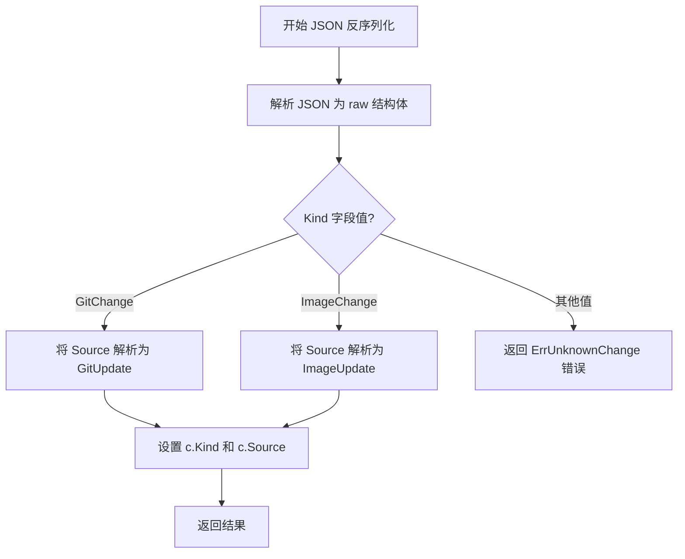
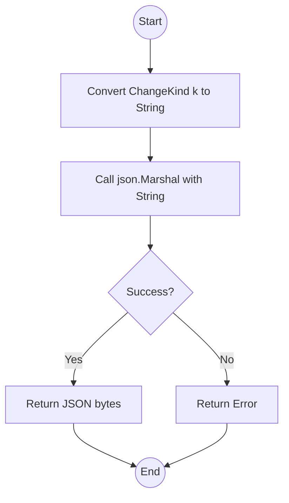
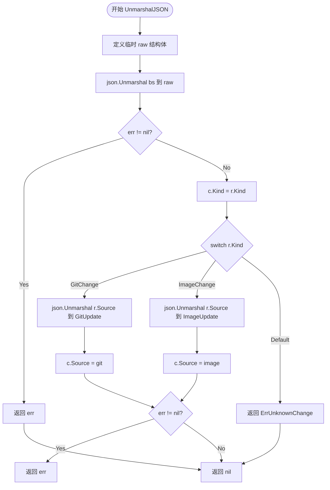

# `flux\pkg\api\v9\change.go` 详细设计文档

该代码定义了一个版本化的变更（Change）数据结构，用于表示Git仓库变更和容器镜像变更两种类型。通过ChangeKind类型区分变更种类，并使用自定义的JSON反序列化逻辑根据Kind动态解析不同的Source类型（GitUpdate或ImageUpdate），实现了多态的变更表示。

## 整体流程



## 类结构

```
ChangeKind (类型别名)
├── 常量: GitChange = "git"
├── 常量: ImageChange = "image"
├── 方法: MarshalJSON()
├── Change (结构体)
│   ├── 方法: UnmarshalJSON()
├── ImageUpdate (结构体)
└── GitUpdate (结构体)
```

## 全局变量及字段


### `ErrUnknownChange`
    
错误变量，表示未知的变更类型

类型：`error`
    


### `GitChange`
    
常量，表示Git类型的变更，值为"git"

类型：`ChangeKind`
    


### `ImageChange`
    
常量，表示镜像类型的变更，值为"image"

类型：`ChangeKind`
    


### `Change.Kind`
    
变更的类型标签，用于区分不同的变更种类

类型：`ChangeKind`
    


### `Change.Source`
    
变更的具体内容，存放实际的变化数据

类型：`interface{}`
    


### `ImageUpdate.Name`
    
镜像的名称信息

类型：`image.Name`
    


### `GitUpdate.URL`
    
Git仓库的URL地址

类型：`string`
    


### `GitUpdate.Branch`
    
Git仓库的分支名称

类型：`string`
    
    

## 全局函数及方法


### `ChangeKind.MarshalJSON`

该方法实现了 `json.Marshaler` 接口，用于自定义枚举类型 `ChangeKind` 的 JSON 序列化逻辑。它将底层的字符串值转换为标准的 JSON 字符串格式，而不是复杂的对象结构。

参数：
- （无显式参数，仅包含接收者 `k ChangeKind`）

返回值：
- `[]byte`，JSON 格式的字节切片。
- `error`，序列化过程中可能发生的错误。

#### 流程图



#### 带注释源码

```go
// MarshalJSON 是实现 json.Marshaler 接口的方法。
// 它将 ChangeKind 类型序列化为 JSON 字符串值。
func (k ChangeKind) MarshalJSON() ([]byte, error) {
    // 1. 将 ChangeKind (string alias) 转换为原生 string 类型
    // 2. 使用标准库 json.Marshal 对字符串进行 JSON 编码（添加引号）
    return json.Marshal(string(k))
}
```


### `Change.UnmarshalJSON`

#### 描述
该方法是 `Change` 结构体的自定义 JSON 反序列化实现（实现 `json.Unmarshaler` 接口）。它首先将 JSON 数据解析为一个只包含 `Kind` 和原始消息 `Source` 的临时结构体，然后根据 `Kind` 的值（`GitChange` 或 `ImageChange`），动态地将 `Source` 字段反序列化为对应的具体更新结构体（`GitUpdate` 或 `ImageUpdate`），从而实现了多态对象的反序列化。

#### 参数
- `bs`：`[]byte`，JSON 格式的字节切片，表示需要反序列化的数据。

#### 返回值
- `error`：如果 JSON 格式错误、`Source` 字段反序列化失败或 `Kind` 为未知类型，则返回相应的错误；否则返回 `nil`。

#### 流程图



#### 带注释源码

```go
func (c *Change) UnmarshalJSON(bs []byte) error {
    // 1. 定义临时结构体 raw，用于初步解析 JSON，保留 Source 为原始消息格式
    type raw struct {
        Kind   ChangeKind
        Source json.RawMessage
    }
    var r raw
    var err error
    
    // 2. 将输入的 JSON 字节解析到 raw 结构中
    //    这里只解析出 Kind 和未处理的 Source (json.RawMessage)
    if err = json.Unmarshal(bs, &r); err != nil {
        return err // 如果 JSON 格式本身有问题，直接返回错误
    }
    
    // 3. 先将 Kind 赋值给 Change 对象
    c.Kind = r.Kind

    // 4. 根据 Kind 的值决定如何反序列化 Source 字段
    switch r.Kind {
    case GitChange:
        var git GitUpdate
        // 将 Source 反序列化为 GitUpdate 结构体
        err = json.Unmarshal(r.Source, &git)
        c.Source = git // 将解析后的对象赋值给 Source
    case ImageChange:
        var image ImageUpdate
        // 将 Source 反序列化为 ImageUpdate 结构体
        err = json.Unmarshal(r.Source, &image)
        c.Source = image // 将解析后的对象赋值给 Source
    default:
        // 如果遇到未知的 Kind 类型，返回特定错误
        return ErrUnknownChange
    }
    
    // 5. 返回反序列化 Source 过程中产生的错误（如果无错则返回 nil）
    return err
}
```

## 关键组件


### ChangeKind 类型与常量

定义变更类型枚举，包含GitChange和ImageChange两种类型，用于区分不同的变更种类，并提供JSON序列化能力。

### Change 结构体

表示一个变更对象，包含Kind（类型标签）和Source（变更内容）字段，用于封装不同类型变更的统一结构。

### ImageUpdate 结构体

镜像更新组件，包含image.Name类型的Name字段，用于表示具体的镜像更新信息。

### GitUpdate 结构体

Git更新组件，包含URL和Branch字段，用于表示Git仓库的更新信息。

### UnmarshalJSON 方法

实现JSON反序列化逻辑，根据Kind字段动态解析Source为GitUpdate或ImageUpdate，并返回ErrUnknownChange错误处理未知类型。

### ErrUnknownChange 错误

未知变更类型错误，当遇到非GitChange或ImageChange的Kind时返回该错误。


## 问题及建议


### 已知问题

- **Error 处理不完善**：在 `UnmarshalJSON` 方法中，当 `json.Unmarshal` 调用失败后直接返回错误，但后续的 switch-case 分支中即使 `err` 不为 nil 仍会继续执行并赋值给 `c.Source`，可能导致部分解析的数据被设置到结构体中
- **类型不安全**：使用 `interface{}` 作为 `Source` 字段类型，调用者必须进行类型断言才能使用具体数据，增加了运行时出错风险，缺乏编译期类型检查
- **缺乏输入验证**：`ImageUpdate` 和 `GitUpdate` 结构体缺少字段验证逻辑，如 `GitUpdate` 的 `URL` 和 `Branch` 字段没有检查空值或无效格式
- **JSON 序列化不一致**：自定义实现了 `ChangeKind` 和 `Change` 的 `MarshalJSON`/`UnmarshalJSON`，但 `ImageUpdate` 和 `GitUpdate` 没有实现对应的序列化方法，可能导致序列化结果不符合预期
- **缺少文档注释**：所有导出的类型（`ChangeKind`、`Change`、`ImageUpdate`、`GitUpdate`）和方法都缺乏注释，影响代码可读性和维护性
- **命名不一致**：`GitUpdate` 使用 `URL, Branch` 命名，而 `ImageUpdate` 使用 `Name` 命名，缺乏统一的字段命名规范

### 优化建议

- **改进错误处理**：在 switch-case 每个分支中，检查 `err` 是否为 nil，若不为 nil 则直接返回错误，避免设置不完整的对象状态
- **引入接口定义**：定义 `SourceUpdater` 接口替代 `interface{}`，提供类型安全的抽象层，让 `ImageUpdate` 和 `GitUpdate` 实现该接口
- **添加验证方法**：为 `GitUpdate` 和 `ImageUpdate` 实现 `Validate()` 方法或在反序列化时进行字段校验，确保必填字段存在
- **统一序列化实现**：为 `ImageUpdate` 和 `GitUpdate` 实现完整的 `MarshalJSON` 和 `UnmarshalJSON` 方法，确保序列化行为一致
- **补充文档注释**：为所有导出的类型和方法添加标准的 Go 文档注释，说明用途和使用场景
- **统一字段命名**：考虑为不同更新类型使用一致的字段命名模式，或在结构体标签中明确指定 JSON 映射名称

## 其它


### 设计目标与约束

本代码的核心设计目标是定义一个版本化的变更（Change）数据结构，用于区分和处理两种不同类型的更新：Git仓库更新和镜像更新。通过JSON序列化/反序列化机制，实现不同类型变更的统一表示和传输。约束条件包括：Source字段类型为interface{}，需要通过Kind字段来区分具体类型，且仅支持GitChange和ImageChange两种类型。

### 错误处理与异常设计

错误处理采用Go语言的错误返回机制。主要错误类型为ErrUnknownChange，当反序列化时遇到未知的ChangeKind时返回。JSON unmarshaling过程中，错误会逐层传递，任何JSON解析失败都会立即返回错误。设计原则是快速失败（fail-fast），一旦发生错误立即返回，不进行部分状态修改。

### 数据流与状态机

数据流主要体现在JSON序列化与反序列化过程。序列化时，ChangeKind通过MarshalJSON方法转换为字符串；反序列化时，通过UnmarshalJSON方法根据Kind字段值动态创建对应的Source对象。状态机转换：初始状态为空Change对象 → 解析Kind字段 → 根据Kind类型选择对应的数据结构（GitUpdate或ImageUpdate）→ 解析Source字段 → 完成对象构建。任何非法输入都会导致状态机转换失败并返回错误。

### 外部依赖与接口契约

外部依赖包括：1) encoding/json标准库，用于JSON序列化/反序列化；2) github.com/fluxcd/flux/pkg/image包，提供image.Name类型。接口契约方面，Change结构体实现了json.Marshaler和json.Unmarshaler接口，ImageUpdate和GitUpdate作为内部类型实现了与JSON的映射关系。Kind字段必须为"git"或"image"字符串，Source字段必须为对应的JSON对象结构。

### 安全性考虑

当前代码未对输入数据进行严格验证。潜在安全风险包括：1) Source字段为interface{}类型，反序列化时可能触发任意类型解析；2) 未对GitUpdate的URL字段进行URL格式验证；3) 未对Source JSON内容进行大小限制。建议在生产环境中增加输入验证逻辑。

### 性能考虑

当前实现采用标准的JSON解析方式，性能瓶颈可能出现在：1) 每次反序列化都需要进行Kind判断和类型switch；2) interface{}类型导致运行时类型检查开销。优化方向：可考虑使用泛型（Go 1.18+）或预分配对象池来减少内存分配开销。

### 测试策略

建议包含以下测试用例：1) 正常的GitChange序列化和反序列化；2) 正常的ImageChange序列化和反序列化；3) 未知Kind类型的错误处理；4) JSON格式错误时的错误处理；5) 空Source字段的处理；6) 边界情况（如Kind与Source不匹配）。

### 版本兼容性

当前包名为v9，表明这是第9个版本的API。变更类型设计采用了开闭原则（Open-Closed Principle），通过添加新的ChangeKind常量可以扩展支持新的变更类型，但需注意向后兼容性。MarshalJSON方法将Kind直接序列化为字符串值，版本演进时需确保字符串值稳定。

### 命名约定和代码规范

遵循Go语言惯例：类型采用PascalCase命名，变量采用camelCase命名。包名为v9表示版本号。错误变量以Err开头。公开类型（ChangeKind、Change、ImageUpdate、GitUpdate）首字母大写，公开方法（MarshalJSON、UnmarshalJSON）首字母大写。代码结构清晰，将相关的类型定义和错误定义集中放置。


    