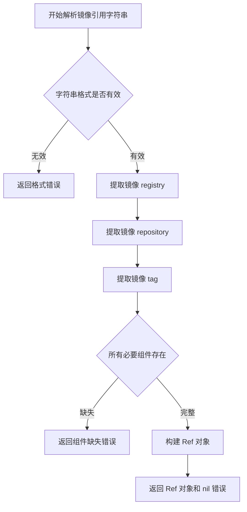
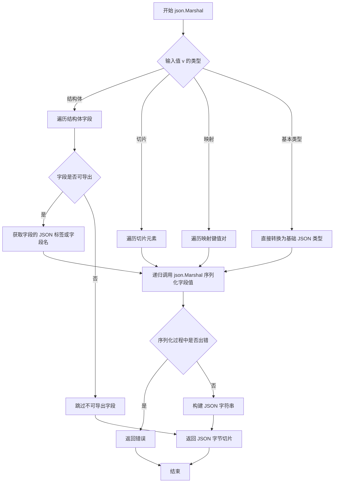
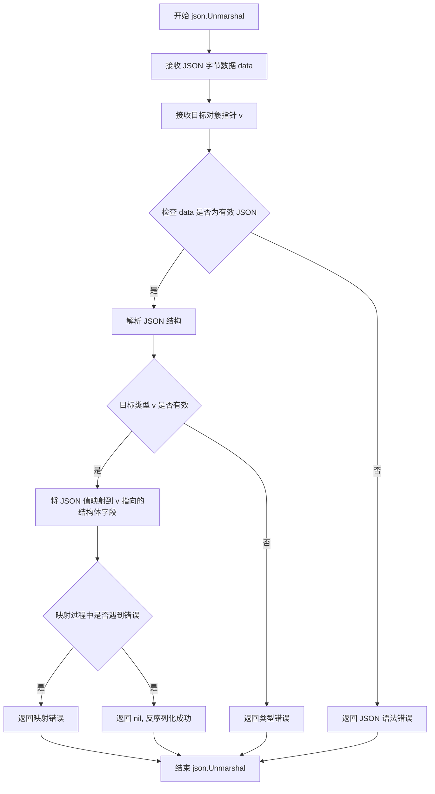
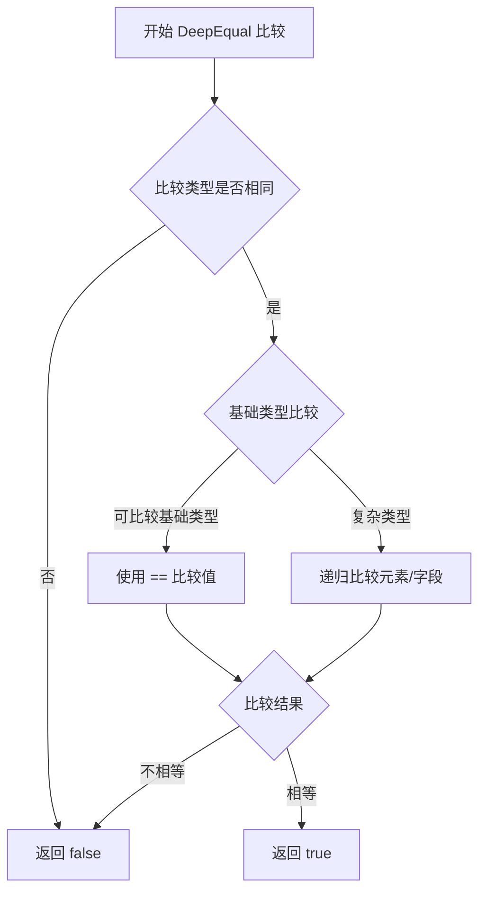
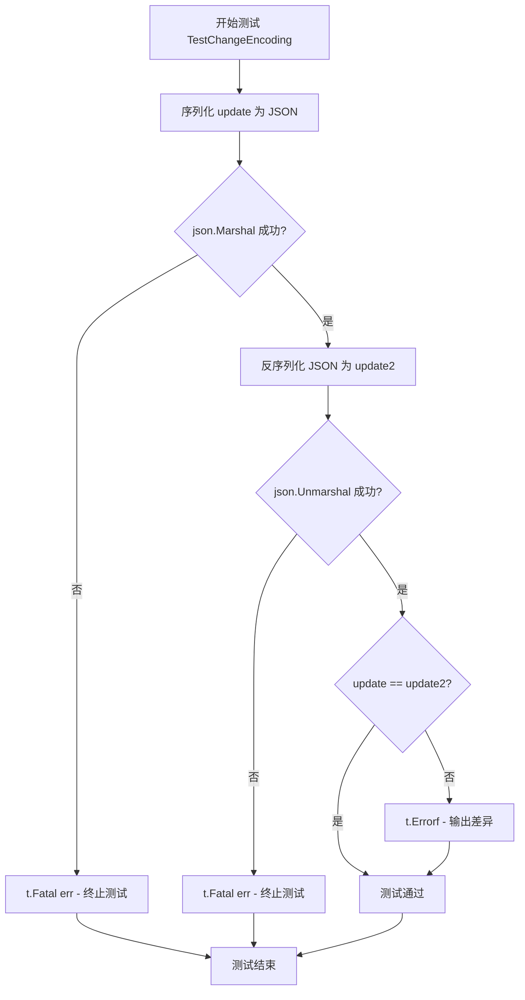
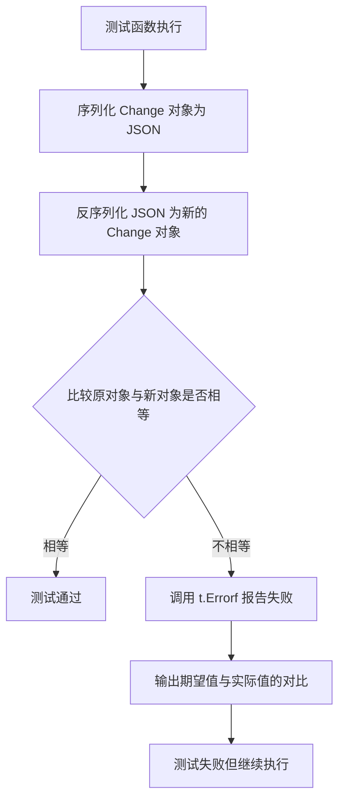

# `flux\pkg\api\v9\change_test.go` 详细设计文档

这是一个 Go 测试文件，用于验证 Change 类型的 JSON 序列化和反序列化功能是否正确工作。测试通过比较原始对象与 JSON 编解码后的对象是否相等，来确保 Change 类型（包括 GitChange 和 ImageChange 两种变体）的序列化/反序列化过程不会丢失数据。

## 整体流程

```mermaid
graph TD
A[开始测试 TestChangeEncoding] --> B[解析镜像引用 docker.io/fluxcd/flux]
B --> C[获取镜像名称]
C --> D{遍历两种 Change 类型}
D -->|第一种: GitChange| E[创建 Change{Kind: GitChange, Source: GitUpdate{URL: git@github.com:fluxcd/flux}}]
D -->|第二种: ImageChange| F[创建 Change{Kind: ImageChange, Source: ImageUpdate{Name: name}}]
E --> G[调用 json.Marshal 进行 JSON 序列化]
F --> G
G --> H[调用 json.Unmarshal 进行 JSON 反序列化]
H --> I[调用 reflect.DeepEqual 比较原对象和反序列化后的对象]
I --> J{两者相等?}
J -- 是 --> K[测试通过]
J -- 否 --> L[调用 t.Errorf 报告测试失败]
```

## 类结构

```
Change 类型 (联合类型/变体)
├── Kind: GitChange (常量)
├── Kind: ImageChange (常量)
├── Source: GitUpdate (结构体)
└── Source: ImageUpdate (结构体)
```

## 全局变量及字段


### `ref`
    
Parsed image reference from the string "docker.io/fluxcd/flux"

类型：`image.Ref`
    


### `name`
    
Name extracted from the parsed image reference

类型：`string`
    


### `bytes`
    
JSON encoded bytes of the Change struct

类型：`[]byte`
    


### `err`
    
Error returned from json.Marshal or json.Unmarshal operations

类型：`error`
    


### `update`
    
Current Change struct being processed in the loop iteration

类型：`Change`
    


### `update2`
    
Change struct unmarshaled from JSON bytes for comparison

类型：`Change`
    


### `Change.Kind`
    
Type of change indicating whether it's a GitChange or ImageChange

类型：`string`
    


### `Change.Source`
    
Source of the change containing either GitUpdate or ImageUpdate data

类型：`interface{}`
    


### `GitUpdate.URL`
    
Git repository URL for the update

类型：`string`
    


### `ImageUpdate.Name`
    
Image name for the update

类型：`string`
    
    

## 全局函数及方法


### `TestChangeEncoding`

该测试函数用于验证 `Change` 结构体在 JSON 序列化（Marshal）和反序列化（Unmarshal）过程中能够正确保持数据的完整性，通过对比序列化前后的对象是否相等来确保编码转换的正确性。

参数：

- `t`：`testing.T`，Go 测试框架的标准参数，用于报告测试失败或记录测试信息

返回值：`无`（Go 测试函数通常不返回值）

#### 流程图

```mermaid
flowchart TD
    A[开始测试] --> B[解析镜像引用获取名称]
    B --> C[创建测试用例数组: GitChange 和 ImageChange]
    C --> D{遍历测试用例}
    D -->|第1个用例| E[执行 GitChange 序列化]
    D -->|第2个用例| F[执行 ImageChange 序列化]
    E --> G[json.Marshal update]
    F --> G
    G --> H{检查序列化错误}
    H -->|有错误| I[t.Fatal 终止测试]
    H -->|无错误| J[json.Unmarshal 到 update2]
    J --> K{检查反序列化错误}
    K -->|有错误| I
    K -->|无错误| L{reflect.DeepEqual 比较]
    L -->|相等| M{是否还有更多用例}
    L -->|不相等| N[t.Errorf 报告差异]
    N --> M
    M -->|是| D
    M -->|否| O[测试结束]
```

#### 带注释源码

```go
package v9

import (
	"encoding/json"
	"reflect"
	"testing"

	"github.com/fluxcd/flux/pkg/image"
)

// TestChangeEncoding 测试 Change 结构的 JSON 序列化和反序列化是否正确
func TestChangeEncoding(t *testing.T) {
	// 解析镜像引用，获取镜像名称
	ref, _ := image.ParseRef("docker.io/fluxcd/flux")
	name := ref.Name

	// 遍历两个测试用例：GitChange 和 ImageChange
	for _, update := range []Change{
		// 测试用例1：GitChange 类型
		{Kind: GitChange, Source: GitUpdate{URL: "git@github.com:fluxcd/flux"}},
		// 测试用例2：ImageChange 类型
		{Kind: ImageChange, Source: ImageUpdate{Name: name}},
	} {
		// 步骤1: 将 Change 结构体序列化为 JSON 字节数组
		bytes, err := json.Marshal(update)
		if err != nil {
			// 如果序列化失败，终止测试并报告错误
			t.Fatal(err)
		}

		// 步骤2: 将 JSON 字节数组反序列化为 Change 结构体
		var update2 Change
		if err = json.Unmarshal(bytes, &update2); err != nil {
			// 如果反序列化失败，终止测试并报告错误
			t.Fatal(err)
		}

		// 步骤3: 深度比较原始对象和反序列化后的对象是否完全相等
		if !reflect.DeepEqual(update, update2) {
			// 如果不相等，报告详细的差异信息
			t.Errorf("unmarshaled != original.\nExpected: %#v\nGot: %#v", update, update2)
		}
	}
}
```


### `image.ParseRef`

解析镜像引用字符串为结构化的镜像引用对象，返回解析后的 Ref 对象和可能的错误信息。

参数：

- `refString`：`string`，镜像引用字符串（如 "docker.io/fluxcd/flux"、"library/nginx:latest"）

返回值：`(*image.Ref, error)`，解析成功时返回镜像引用对象指针，解析失败时返回错误信息

#### 流程图



#### 带注释源码

```
// 注意：ParseRef 函数定义在 github.com/fluxcd/flux/pkg/image 包中
// 以下为调用示例源码

// 导入 image 包
import "github.com/fluxcd/flux/pkg/image"

// 调用 ParseRef 函数解析镜像字符串
ref, err := image.ParseRef("docker.io/fluxcd/flux")

// 参数说明：
//   - "docker.io/fluxcd/flux" 是镜像引用字符串
//     - docker.io: Registry 地址（Docker Hub）
//     - fluxcd: Repository 名称
//     - flux: 镜像名称（默认 latest tag）

// 返回值：
//   - ref: *image.Ref 类型，包含解析后的镜像信息
//     - ref.Name: 完整镜像名称
//     - ref.Registry: Registry 主机名
//     - ref.Repository: 仓库路径
//     - ref.Tag: 镜像标签
//   - err: 解析过程中的错误信息，如果成功则为 nil
```


### `json.Marshal`

将 Go 对象序列化为 JSON 格式的字节切片，是 Go 标准库 `encoding/json` 包提供的核心编解码函数之一。

参数：

- `v`：任意类型（`interface{}`），要序列化的 Go 对象，可以是结构体、切片、映射、基本类型等
- `ptr`：指针类型（`*interface{}`），指向要存储解码结果的指针

返回值：

- `[]byte`：字节切片，JSON 编码后的结果
- `error`：错误，如果序列化过程中出现错误（如循环引用、不支持的类型等），返回具体错误信息

#### 流程图



#### 带注释源码

```go
// json.Marshal 是 Go 标准库 encoding/json 包中的函数
// 源码位于 Go 标准库 src/encoding/json/encode.go

// 函数签名：
// func Marshal(v interface{}) ([]byte, error)

// 简化版核心逻辑：
func Marshal(v interface{}) ([]byte, error) {
    // 1. 创建一个编码器
    e := newEncodeState()
    
    // 2. 使用反射获取值的反射对象
    err := encodeValue(e, reflect.ValueOf(v), nil)
    
    // 3. 如果有错误，释放资源并返回错误
    if err != nil {
        encodeStatePool.Put(e)
        return nil, err
    }
    
    // 4. 尝试获取 JSON 字节切片
    b := e.Bytes()
    
    // 5. 释放编码器资源回对象池
    encodeStatePool.Put(e)
    
    // 6. 返回结果
    return b, nil
}

// 在测试代码中的使用方式：
bytes, err := json.Marshal(update)  // update 是 Change 类型
if err != nil {
    t.Fatal(err)  // 如果序列化失败，测试失败
}
// bytes 现在包含 Change 结构的 JSON 表示
```

#### 在测试代码中的上下文

```go
// 测试 Change 结构的 JSON 编解码一致性
func TestChangeEncoding(t *testing.T) {
    // 解析镜像引用获取名称
    ref, _ := image.ParseRef("docker.io/fluxcd/flux")
    name := ref.Name

    // 测试两种 Change 类型：GitChange 和 ImageChange
    for _, update := range []Change{
        {Kind: GitChange, Source: GitUpdate{URL: "git@github.com:fluxcd/flux"}},
        {Kind: ImageChange, Source: ImageUpdate{Name: name}},
    } {
        // ----- 这里调用 json.Marshal -----
        bytes, err := json.Marshal(update)  // 将 Change 对象序列化为 JSON
        if err != nil {
            t.Fatal(err)  // 序列化失败则测试失败
        }
        
        // 反序列化验证
        var update2 Change
        if err = json.Unmarshal(bytes, &update2); err != nil {
            t.Fatal(err)
        }
        
        // 验证序列化-反序列化后数据一致性
        if !reflect.DeepEqual(update, update2) {
            t.Errorf("unmarshaled != original.\nExpected: %#v\nGot: %#v", update, update2)
        }
    }
}
```


### `json.Unmarshal`

将 JSON 格式的字节数据反序列化为 Go 对象。`json.Unmarshal` 是 Go 标准库 `encoding/json` 包中的全局函数，用于将 JSON 数据转换为指定的 Go 类型。

参数：

-  `data`：`[]byte`，JSON 格式的字节切片（代码中为 `bytes` 变量）
-  `v`：`interface{}`，目标对象指针，用于存放反序列化后的结果（代码中为 `&update2`）

返回值：`error`，如果反序列化过程中出现错误，返回错误信息；否则返回 nil

#### 流程图



#### 带注释源码

```go
// 在测试函数 TestChangeEncoding 中使用 json.Unmarshal
func TestChangeEncoding(t *testing.T) {
    // 解析镜像引用，获取镜像名称
    ref, _ := image.ParseRef("docker.io/fluxcd/flux")
    name := ref.Name

    // 遍历两种 Change 类型进行测试
    for _, update := range []Change{
        {Kind: GitChange, Source: GitUpdate{URL: "git@github.com:fluxcd/flux"}},
        {Kind: ImageChange, Source: ImageUpdate{Name: name}},
    } {
        // 第一步：将 Go 对象序列化为 JSON 字节
        bytes, err := json.Marshal(update)
        if err != nil {
            t.Fatal(err)
        }
        
        // 第二步：声明一个空的 Change 对象用于接收反序列化结果
        var update2 Change
        
        // 第三步：调用 json.Unmarshal 将 JSON 字节反序列化为 Change 对象
        // 参数说明：
        //   - bytes: JSON 格式的字节切片（输入数据）
        //   - &update2: Change 对象的指针（输出目标）
        // 返回值：
        //   - err: 如果反序列化失败，返回错误；成功时为 nil
        if err = json.Unmarshal(bytes, &update2); err != nil {
            t.Fatal(err)
        }
        
        // 第四步：验证反序列化结果与原始对象是否一致
        if !reflect.DeepEqual(update, update2) {
            t.Errorf("unmarshaled != original.\nExpected: %#v\nGot: %#v", update, update2)
        }
    }
}
```

#### 补充说明

在上述代码中，`json.Unmarshal` 完成了 JSON 数据到 Go 结构体的逆向转换：

1. **输入**：JSON 字节切片（由 `json.Marshal` 生成的 `bytes`）
2. **输出**：填充好的 `Change` 结构体（通过指针 `&update2` 传递）
3. **类型映射**：JSON 对象中的字段根据结构体标签（tag）和字段名自动映射到 `Change` 结构体的对应字段
4. **错误处理**：如果 JSON 格式与目标结构体不匹配，会返回相应的解析错误


### `reflect.DeepEqual`

`reflect.DeepEqual` 是 Go 标准库 `reflect` 包中的一个函数，用于深度比较两个值是否相等。它会递归地比较两个值的所有字段和元素，包括嵌套的结构体、切片、数组、映射等，适用于需要精确判断两个复杂数据类型是否完全相等的场景。

参数：

- `a`：`any`，第一个要比较的值，此处为原始的 `Change` 类型变量 `update`
- `b`：`any`，第二个要比较的值，此处为经过 JSON 序列化再反序列化后的 `Change` 类型变量 `update2`

返回值：`bool`，如果两个值在深度上完全相等则返回 `true`，否则返回 `false`

#### 流程图



#### 带注释源码

```go
// reflect.DeepEqual 函数的实现原理（标准库伪代码）
func DeepEqual(a, b any) bool {
    // 1. 首先比较指针地址，如果相同则直接返回 true
    if a == b {
        return true
    }
    
    // 2. 判断其中一个是否为 nil
    if a == nil || b == nil {
        return false
    }
    
    // 3. 获取两个值的 reflect.Type
    vA := reflect.ValueOf(a)
    vB := reflect.ValueOf(b)
    
    // 4. 比较类型，如果类型不同则返回 false
    if vA.Type() != vB.Type() {
        return false
    }
    
    // 5. 根据值的种类进行深度比较
    switch vA.Kind() {
    case reflect.Ptr:
        // 递归比较指针指向的值
        return DeepEqual(vA.Elem().Interface(), vB.Elem().Interface())
    case reflect.Struct:
        // 递归比较结构体的每个字段
        for i := 0; i < vA.NumField(); i++ {
            if !DeepEqual(vA.Field(i).Interface(), vB.Field(i).Interface()) {
                return false
            }
        }
        return true
    case reflect.Slice, reflect.Array:
        // 比较切片/数组长度，然后递归比较每个元素
        if vA.Len() != vB.Len() {
            return false
        }
        for i := 0; i < vA.Len(); i++ {
            if !DeepEqual(vA.Index(i).Interface(), vB.Index(i).Interface()) {
                return false
            }
        }
        return true
    case reflect.Map:
        // 比较映射长度，递归比较每个键值对
        if vA.Len() != vB.Len() {
            return false
        }
        for _, key := range vA.MapKeys() {
            if !DeepEqual(vA.MapIndex(key).Interface(), vB.MapIndex(key).Interface()) {
                return false
            }
        }
        return true
    case reflect.String:
        // 字符串直接比较内容
        return vA.String() == vB.String()
    default:
        // 对于其他可比较类型，使用 == 运算符
        return vA.Interface() == vB.Interface()
    }
}
```

#### 在测试代码中的使用

```go
// 在 TestChangeEncoding 函数中的实际调用
if !reflect.DeepEqual(update, update2) {
    // 如果 update 和 update2 不相等，说明 JSON 序列化/反序列化过程有问题
    t.Errorf("unmarshaled != original.\nExpected: %#v\nGot: %#v", update, update2)
}
```

#### 关键信息总结

| 项目 | 说明 |
|------|------|
| 函数名 | `reflect.DeepEqual` |
| 所属包 | `reflect` (标准库) |
| 调用场景 | 验证 JSON 序列化/反序列化后数据完整性 |
| 比较对象 | `Change` 结构体类型 |
| 测试目标 | 确保 `Change` 类型能够正确地进行 JSON 编码和解码 |


### `t.Fatal`

`t.Fatal` 是 Go 标准库 `testing` 包中 `testing.T` 类型的用于测试失败时终止测试执行的方法。在该代码中用于在 JSON 序列化或反序列化发生错误时立即终止测试，并输出错误信息。

#### 参数

- `err`：`interface{}`，需要输出的错误信息，通常为 `error` 类型

#### 返回值

无返回值（void），该方法会终止当前测试的执行

#### 流程图



#### 带注释源码

```go
package v9

import (
	"encoding/json"
	"reflect"
	"testing"

	"github.com/fluxcd/flux/pkg/image"
)

func TestChangeEncoding(t *testing.T) {
	// 解析镜像引用并获取名称
	ref, _ := image.ParseRef("docker.io/fluxcd/flux")
	name := ref.Name

	// 遍历两种类型的 Change 进行测试
	for _, update := range []Change{
		{Kind: GitChange, Source: GitUpdate{URL: "git@github.com:fluxcd/flux"}},
		{Kind: ImageChange, Source: ImageUpdate{Name: name}},
	} {
		// 将 update 结构体序列化为 JSON 字节数组
		bytes, err := json.Marshal(update)
		// 如果序列化失败，调用 t.Fatal 终止测试并输出错误
		if err != nil {
			t.Fatal(err) // <-- t.Fatal 调用点1: 序列化错误时终止测试
		}
		
		// 将 JSON 字节数组反序列化为 Change 结构体
		var update2 Change
		if err = json.Unmarshal(bytes, &update2); err != nil {
			// 如果反序列化失败，调用 t.Fatal 终止测试并输出错误
			t.Fatal(err) // <-- t.Fatal 调用点2: 反序列化错误时终止测试
		}
		
		// 使用 DeepEqual 比较原始对象和反序列化后的对象
		if !reflect.DeepEqual(update, update2) {
			t.Errorf("unmarshaled != original.\nExpected: %#v\nGot: %#v", update, update2)
		}
	}
}
```

---

### 补充说明

#### 关键组件信息

| 组件名称 | 一句话描述 |
|---------|-----------|
| `testing.T` | Go 语言标准库中的测试框架类型，提供测试方法如 Fatal、Errorf 等 |
| `json.Marshal` | 将 Go 结构体序列化为 JSON 格式 |
| `json.Unmarshal` | 将 JSON 数据反序列化为 Go 结构体 |
| `reflect.DeepEqual` | 深度比较两个对象是否相等 |

#### 潜在技术债务或优化空间

1. **忽略 ParseRef 错误**：代码中 `ref, _ := image.ParseRef(...)` 忽略了可能的错误返回，建议增加错误处理
2. **缺少测试覆盖**：仅有两种 Change 类型的测试，可能需要覆盖更多边界情况

#### 其他项目说明

- **错误处理设计**：使用 `t.Fatal` 立即终止测试表明这些错误被视为致命错误，不允许测试继续执行
- **数据流**：输入数据（GitChange/ImageChange）→ JSON序列化 → 传输/存储 → JSON反序列化 → 输出验证
- **外部依赖**：依赖 `fluxcd/flux` 包的 `image` 模块进行镜像引用解析


### `t.Errorf`

在 Go 的 `testing` 包中，`t.Errorf` 是 `*testing.T` 类型的一个方法，用于报告测试失败但不让测试立即停止。该方法使用格式化字符串输出错误信息。在本代码中，它用于比较 JSON 序列化/反序列化前后的 `Change` 对象是否一致。

参数：

- `format`：`string`，格式化字符串，描述错误信息的模板
- `args`：`...interface{}`，可变参数，用于填充格式化字符串中的占位符

返回值：无（`void`），该方法仅输出错误信息，不返回任何值

#### 流程图



#### 带注释源码

```go
// t.Errorf 是 testing.T 类型的错误报告方法
// 在本代码中用于报告 JSON 序列化/反序列化后对象不一致的错误

// 调用示例（第 25 行）：
if !reflect.DeepEqual(update, update2) {
    // format: 格式化字符串，描述错误模板
    // args:   可变参数，包含 update 和 update2 的值
    t.Errorf("unmarshaled != original.\nExpected: %#v\nGot: %#v", update, update2)
}

// t.Errorf 方法签名（来自 testing 包）：
// func (t *T) Errorf(format string, args ...interface{})
//   - 不返回值，仅输出错误信息
//   - 不会调用 t.Fail()，但会将测试标记为失败
//   - 允许后续测试代码继续执行
```

## 关键组件


### Change 结构体

表示配置变更的核心数据结构，包含变更类型和变更源

### Kind 字段（常量）

用于区分不同类型的变更（GitChange、ImageChange）

### GitUpdate 结构体

Git变更的源数据，包含仓库URL信息

### ImageUpdate 结构体

镜像变更的源数据，包含镜像名称信息

### TestChangeEncoding 测试函数

验证 Change 结构体的JSON序列化和反序列化功能是否正确


## 问题及建议


### 已知问题

-   **忽略错误返回值**：`image.ParseRef` 返回的错误被直接丢弃（使用 `_`），若解析失败测试仍会继续执行，可能导致后续测试逻辑不明确
-   **测试断言不够精确**：使用 `reflect.DeepEqual` 进行全量比较，但未验证 JSON 序列化后的具体内容是否符合预期格式（如字段名、键值对结构）
-   **测试数据硬编码**：镜像引用和 Git URL 硬编码在测试中，缺乏对不同输入格式的覆盖
-   **未验证 Kind 字段一致性**：JSON 序列化后 `Kind` 字段可能因 JSON tag 而改变（如首字母大写变小写），未明确验证反序列化后的 `Kind` 值是否正确还原

### 优化建议

-   **添加错误检查**：对 `image.ParseRef` 的返回值进行检查，若解析失败则使用 `t.Fatal` 终止测试
-   **增强断言逻辑**：在 `reflect.DeepEqual` 之前，先验证 `update.Kind` 与 `update2.Kind` 是否一致，确保 `Kind` 字段在序列化/反序列化过程中未丢失
-   **扩展测试用例**：增加对不同 `Kind` 类型（如 `Kind` 的其他可能值）、边界值（空字符串、特殊字符）的测试覆盖
-   **使用 table-driven 测试**：将测试数据参数化，便于添加更多测试场景且保持代码整洁

## 其它


### 设计目标与约束

本测试文件的核心目标是验证v9包中Change类型的JSON序列化与反序列化功能是否正确工作。设计约束包括：确保GitChange和ImageChange两种类型的对象经过JSON编码后再解码，能够完整保留原始数据；使用reflect.DeepEqual进行严格的相等性比较；依赖Go标准库的encoding/json和reflect包，不引入额外的外部依赖。

### 错误处理与异常设计

测试函数采用t.Fatal处理致命错误，当JSONMarshal或Unmarshal操作失败时立即终止测试。测试场景覆盖了正常的序列化/反序列化流程，没有模拟异常输入或边界情况。目前的错误处理是基础的事故式（fail-fast）模式，缺乏对特定错误类型的细粒度处理和恢复机制。

### 数据流与状态机

测试数据流为：创建原始Change对象 → JSON.Marshal序列化为字节数组 → JSON.Unmarshal从字节数组反序列化 → 使用reflect.DeepEqual比较原始对象与反序列化对象。状态转换简单明确：对象→字节数组→对象，无中间状态或状态机概念。

### 外部依赖与接口契约

主要外部依赖包括：github.com/fluxcd/flux/pkg/image包（提供image.ParseRef函数解析镜像引用），Go标准库的encoding/json（JSON序列化）、reflect（反射比较）。image.ParseRef输入为镜像引用字符串，输出为image.Ref对象；JSONMarshal输入任意对象输出字节数组和错误；Unmarshal输入字节数组和目标对象指针输出错误。

### 性能考虑

当前测试未包含性能基准测试。对于Change类型的序列化性能，当对象数量增加时可能存在性能瓶颈，建议在生产环境中添加基准测试评估JSON序列化开销。reflect.DeepEqual在每次比较时都会进行深度遍历，对于大型复杂对象可能较慢。

### 安全考虑

测试代码本身不涉及敏感数据处理，但需要注意的是JSON序列化可能暴露内部字段（如果使用非导出字段需谨慎）。目前测试数据使用硬编码的字符串，不存在注入风险。

### 测试策略

采用黑盒测试方法，通过输入已知数据验证输出是否符合预期。测试覆盖两种Change类型（GitChange和ImageChange），覆盖度有限，建议增加更多边界情况测试，如空值字段、特殊字符、嵌套复杂结构等。

### 版本兼容性

依赖Go 1.13+的模块系统。image.ParseRef函数的行为依赖于fluxcd/flux包的版本，可能存在API变更风险。建议在go.mod中明确指定依赖版本以确保兼容性。

### 部署相关

本测试文件为单元测试，不直接参与部署流程。测试应在CI/CD流水线中作为质量门禁运行，确保代码变更不会破坏JSON序列化功能。


    