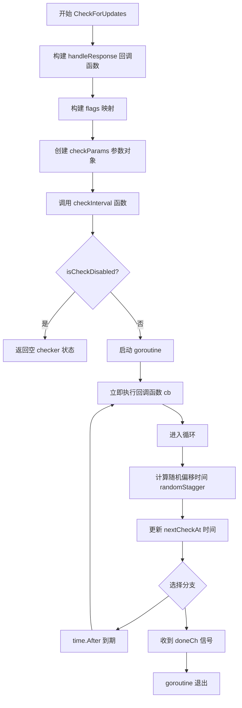
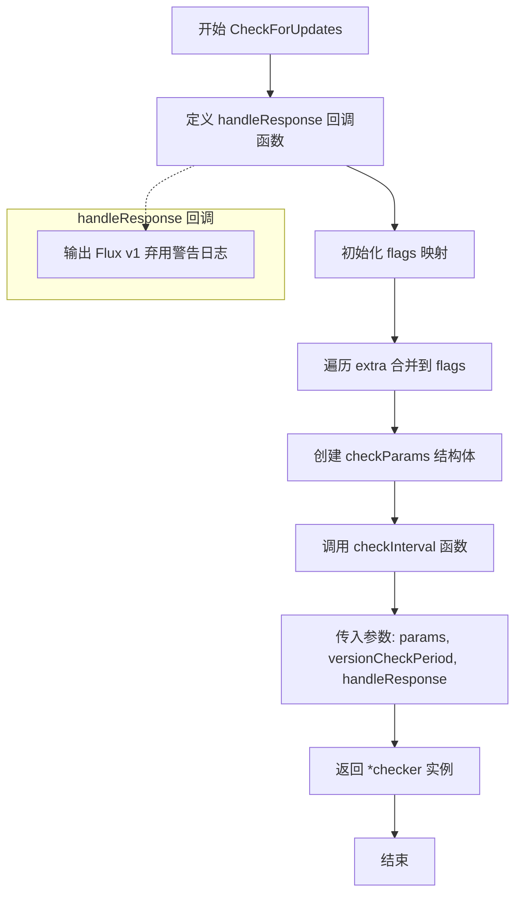
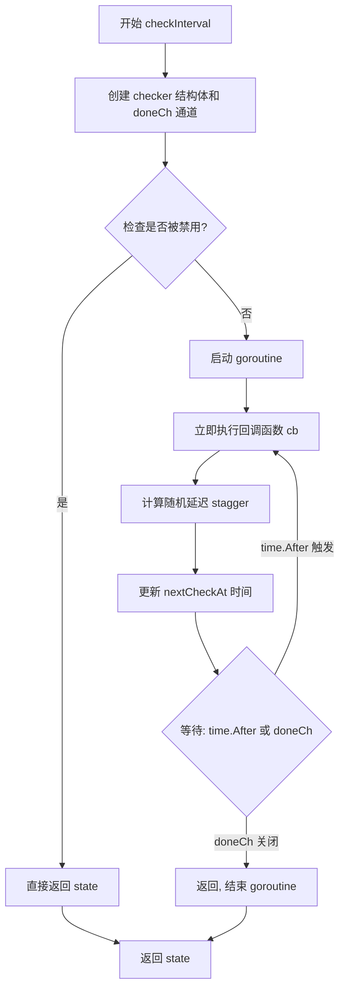
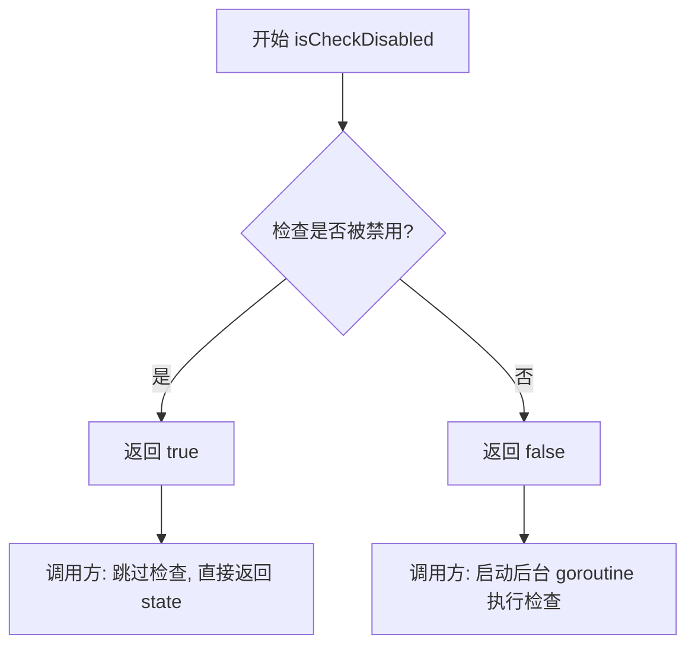
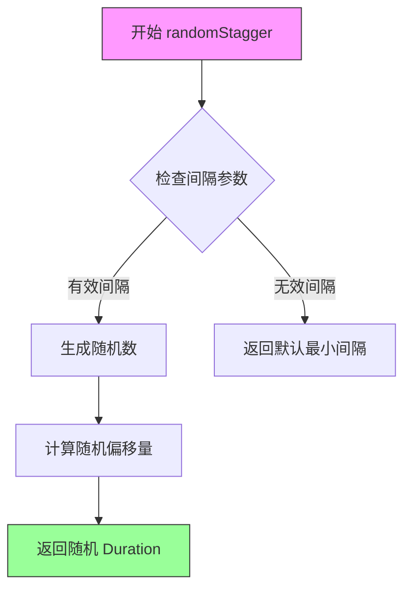

# `flux\pkg\checkpoint\checkpoint.go` 详细设计文档

这是一个用于检查更新的Go语言包，通过定期调用回调函数来检测产品是否有新版本，并在控制台输出废弃警告信息。它使用随机时间偏移来实现分布式系统中的错峰检查，避免所有客户端同时请求版本服务器。

## 整体流程



## 类结构

```
Type 定义
├── checkParams (结构体)
│   ├── Product: string
│   ├── Version: string
│   ├── SignatureFile: string
│   └── Flags: map[string]string
└── checker (结构体)
    ├── doneCh: chan struct{}
    ├── nextCheckAt: time.Time
    └── nextCheckAtLock: sync.Mutex
```

## 全局变量及字段


### `versionCheckPeriod`
    
版本检查周期，默认为6小时

类型：`time.Duration`
    


### `checkParams.Product`
    
产品名称

类型：`string`
    


### `checkParams.Version`
    
当前版本号

类型：`string`
    


### `checkParams.SignatureFile`
    
签名文件路径

类型：`string`
    


### `checkParams.Flags`
    
额外的检查标志

类型：`map[string]string`
    


### `checker.doneCh`
    
用于停止检查的通道

类型：`chan struct{}`
    


### `checker.nextCheckAt`
    
下次检查时间

类型：`time.Time`
    


### `checker.nextCheckAtLock`
    
保护 nextCheckAt 的互斥锁

类型：`sync.Mutex`
    
    

## 全局函数及方法


### `CheckForUpdates`

这是版本检查模块的主入口函数，用于启动定期版本检查流程，检测产品是否有可用更新。

参数：

- `product`：`string`，产品名称，标识要检查更新的产品
- `version`：`string`，当前产品版本号
- `extra`：`map[string]string`，额外的标志信息映射，用于添加自定义检查参数
- `logger`：`log.Logger`，日志记录器实例，用于输出检查过程中的日志信息

返回值：`*checker`，返回 checker 结构体指针，表示版本检查的状态管理对象

#### 流程图



#### 带注释源码

```go
// CheckForUpdates 是版本检查模块的主入口函数，用于启动定期版本检查
// 参数：
//   - product: 产品名称，标识要检查更新的产品
//   - version: 当前产品版本号
//   - extra: 额外的标志信息映射，用于添加自定义检查参数
//   - logger: 日志记录器实例
//
// 返回值：
//   - *checker: 版本检查的状态管理对象，包含检查状态和控制通道
func CheckForUpdates(product, version string, extra map[string]string, logger log.Logger) *checker {
	// 定义响应处理回调函数，当检查完成时调用
	// 当前实现：输出 Flux v1 弃用警告，建议升级到 v2
	handleResponse := func() {
		logger.Log("msg", "Flux v1 is deprecated, please upgrade to v2", "latest", "v2", "URL", "https://fluxcd.io/flux/migration/")
	}

	// 初始化 flags 映射，先设置默认的内核版本标志
	// 注意：这里使用硬编码的 "XXXXX" 作为占位符，可能需要优化
	flags := map[string]string{
		"kernel-version": "XXXXX",
	}
	// 将额外的标志信息合并到 flags 中
	// extra 参数允许调用者自定义添加检查所需的标志
	for k, v := range extra {
		flags[k] = v
	}

	// 构建检查参数结构体，包含产品信息、版本和标志
	params := checkParams{
		Product:       product,
		Version:       version,
		SignatureFile: "", // 签名为空，可能表示不需要签名验证
		Flags:         flags,
	}

	// 调用内部函数 checkInterval 启动定期检查
	// versionCheckPeriod = 6 小时，定期检查周期
	// handleResponse 作为每次检查时的回调函数
	return checkInterval(&params, versionCheckPeriod, handleResponse)
}
```


### `checkInterval`

`checkInterval` 是一个内部函数，负责执行定期检查逻辑。它创建一个后台 goroutine，初始执行一次回调函数，然后按照指定的时间间隔循环执行检查，同时支持通过关闭通道来优雅地停止检查循环。

参数：

- `p`：`*checkParams`，检查参数，包含产品信息、版本和标志位
- `interval`：`time.Duration`，定期检查的时间间隔
- `cb`：`func()`，每次检查时执行的回调函数

返回值：`*checker`，返回检查器状态结构，包含完成通道和下次检查时间信息

#### 流程图



#### 带注释源码

```
func checkInterval(p *checkParams, interval time.Duration,
	cb func()) *checker {

	// 创建检查器状态结构，包含用于通知停止的通道
	state := &checker{
		doneCh: make(chan struct{}),
	}

	// 如果检查功能被全局禁用，直接返回空的检查器状态
	if isCheckDisabled() {
		return state
	}

	// 启动后台 goroutine 执行定期检查逻辑
	go func() {
		// 立即执行一次回调（初始检查）
		cb()

		// 进入无限循环，定期执行检查
		for {
			// 计算带有随机偏移的时间间隔（避免所有客户端同时请求）
			after := randomStagger(interval)
			
			// 线程安全地更新下次检查时间
			state.nextCheckAtLock.Lock()
			state.nextCheckAt = time.Now().Add(after)
			state.nextCheckAtLock.Unlock()

			// 等待：直到延迟时间到期或收到停止信号
			select {
			case <-time.After(after):
				// 延迟到期，执行回调函数
				cb()
			case <-state.doneCh:
				// 收到停止信号，退出 goroutine
				return
			}
		}
	}()

	// 返回检查器状态，供调用者控制（如停止检查）
	return state
}
```

---

### 补充信息

#### 关键组件信息

| 名称 | 描述 |
|------|------|
| `checker` 结构体 | 存储检查器状态，包括完成通道和下次检查时间 |
| `doneCh` | 通道，用于发送停止信号以终止后台 goroutine |
| `randomStagger` | 函数，计算带有随机偏移的时间间隔，防止惊群效应 |
| `isCheckDisabled` | 函数，检查是否禁用了检查功能 |

#### 潜在的技术债务或优化空间

1. **回调函数参数设计**：`handleResponse` 是硬编码在 `CheckForUpdates` 中的闭包，如果需要动态传递不同的响应处理逻辑，扩展性受限
2. **错误处理缺失**：`cb()` 回调执行时没有错误处理机制，如果回调失败会导致静默失败
3. **资源清理**：虽然有 `doneCh` 机制，但缺少显式的 `Close()` 或 `Stop()` 方法来暴露停止功能给外部调用者
4. **状态竞争**：`nextCheckAt` 的读写虽然有锁保护，但 `cb()` 执行期间没有锁定，可能导致读取到不一致的状态

#### 其它项目

- **设计目标**：实现后台定期检查机制，同时支持优雅停止和随机时间偏移以避免流量突增
- **约束**：`checkInterval` 是内部函数，仅被 `CheckForUpdates` 导出函数调用
- **外部依赖**：依赖 `github.com/go-kit/kit/log` 进行日志记录，依赖 `time` 包处理时间操作


### `isCheckDisabled`

该函数是外部依赖函数，用于判断检查功能是否被禁用。如果返回 true，则跳过版本检查流程；否则继续执行定期检查逻辑。

参数： 无

返回值：`bool`，返回 true 表示检查已禁用（跳过检查）；返回 false 表示检查未禁用（继续执行检查）。

#### 流程图



#### 带注释源码

```go
// isCheckDisabled 是一个外部依赖函数，用于判断检查功能是否被禁用
// 该函数的实现未在此代码包中定义，可能是通过其他方式（如环境变量、配置文件）
// 从外部注入或导入的依赖
func isCheckDisabled() bool {
	// TODO: 获取外部禁用状态检查的配置
	// 可能通过环境变量、配置文件或命令行标志来控制
	// 例如: return os.Getenv("CHECK_DISABLED") == "true"
	
	// 注意: 实际实现未在当前代码片段中提供
	// 这是一个外部依赖函数
}
```

> **注意**：该函数的实际实现未在提供的代码片段中显示。从调用上下文来看，该函数应返回一个布尔值来决定是否跳过版本检查功能。此函数可能通过依赖注入、环境变量检查或配置文件读取等方式实现，具体实现细节需要查看项目中的其他文件或依赖包。


### `randomStagger`

外部依赖函数，用于计算基于给定时间间隔的随机偏移量，以实现检查操作的随机化分散执行，避免多个实例在同一时刻进行版本检查。

参数：

- `interval`：`time.Duration`，基础时间间隔，用于计算随机偏移量的基准时间

返回值：`time.Duration`，随机偏移后的时间长度，用于 `time.After()` 定时器

#### 流程图



#### 带注释源码

```
// randomStagger 是一个外部依赖函数，用于计算随机时间偏移
// 参数 interval: 基础时间间隔（time.Duration 类型）
// 返回值: 随机化后的时间间隔（time.Duration 类型）
//
// 实现逻辑推测：
// 1. 接收基础时间间隔作为参数
// 2. 生成一个随机因子（通常在 0.5 到 1.5 之间或类似范围）
// 3. 将随机因子与基础间隔相乘，得到随机偏移后的时间
// 4. 返回计算结果，供调用方使用
//
// 调用示例（来自代码中的使用）：
// after := randomStagger(interval)
// select {
// case <-time.After(after):
//     cb()
// case <-state.doneCh:
//     return
// }
//
// 设计目的：避免多个检查器实例在同一时刻执行检查操作，
// 通过随机化检查时间点来分散服务器负载
func randomStagger(interval time.Duration) time.Duration {
    // 具体的随机化逻辑实现
    // 可能包含：
    // - 随机数生成
    // - 最小/最大边界检查
    // - 线程安全的随机数生成器初始化
}
```

> **注意**：该函数的具体实现未在当前代码文件中提供，属于外部依赖函数。根据代码上下文分析，其签名和行为如上所述。实际实现可能需要参考项目中的其他文件或第三方库。

## 关键组件


### CheckForUpdates 函数

主入口函数，用于创建一个产品版本更新检查器，初始化检查参数并启动定期检查流程，同时处理弃用警告响应。

### checkInterval 函数

核心检查循环逻辑，负责创建检查器状态、管理定期检查的执行、计算下一次检查时间、处理时间延迟和完成信号，支持随机stagger机制以分散检查负载。

### checker 结构体

状态管理结构体，包含完成通道和下一次检查时间，用于控制检查器的生命周期和时间调度。

### handleResponse 回调函数

内置回调函数，用于输出Flux v1弃用警告信息，引导用户升级到v2版本。

### randomStagger 函数

随机延迟生成函数（在外部定义），用于将检查请求分散在指定时间间隔内，避免同时触发大量检查。

### isCheckDisabled 函数

检查禁用标志函数（在外部定义），用于判断更新检查功能是否被禁用。


## 问题及建议


### 已知问题

-   **硬编码的弃用信息**：日志消息中硬编码了"Flux v1 is deprecated, please upgrade to v2"，缺乏通用性，无法适配不同产品
-   **未实现的占位符**：`"kernel-version"` 使用了硬编码值 `"XXXXX"`，flags 参数也是硬编码
-   **缺少函数定义**：代码调用了 `randomStagger()`、`isCheckDisabled()`、以及 `checker` 结构体，但未在提供的代码片段中定义
-   **资源泄漏风险**：`time.After(after)` 在无限循环中每次迭代都会创建新的定时器，应该使用 `time.Ticker` 替代
-   **缺乏参数校验**：未对 `logger`、`product`、`version` 等参数进行 nil 或空值检查
-   **回调重复执行**：`cb()` 在 goroutine 启动时立即执行一次，随后又在定时循环中执行，导致逻辑重复
-   **缺少上下文支持**：不支持通过 `context.Context` 取消检查操作
-   **早期返回的 checker 状态不完整**：当 `isCheckDisabled()` 返回 true 时，返回的 `checker` 结构体 `doneCh` 已创建但 goroutine 未启动，可能导致资源泄露或状态不一致
-   **命名与实现不符**：`handleResponse` 函数名暗示处理响应，但实际上只打印弃用警告

### 优化建议

-   将弃用信息、版本号、产品名称等提取为配置参数或环境变量，提高代码复用性
-   添加输入参数校验，对 nil logger、空 product/version 等情况返回错误或使用默认值
-   使用 `time.Ticker` 替代循环中的 `time.After`，避免定时器资源泄漏
-   将回调逻辑分离为独立的 `checkForUpdates` 函数，避免启动时立即执行导致的重复
-   为 `CheckForUpdates` 和 `checkInterval` 添加 `context.Context` 参数，支持外部取消操作
-   统一命名规范，如将 `handleResponse` 重命名为 `logDeprecationWarning` 或 `emitWarning`
-   在 `isCheckDisabled()` 返回 true 时，考虑返回 nil 或错误，而不是返回一个不完整的状态对象
-   考虑添加重试机制和超时控制，提高更新检查的可靠性
-   分离concerns：将日志输出、版本检查逻辑、调度逻辑拆分为独立模块，提高可测试性


## 其它


### 设计目标与约束

该模块的设计目标是为产品提供版本检查和更新提示功能，核心约束包括：使用go-kit的log.Logger进行日志记录，不阻塞主程序运行，通过随机时间偏移避免所有客户端同时发起检查请求。

### 错误处理与异常设计

代码中的错误处理主要通过isCheckDisabled()函数判断是否禁用检查，若禁用则直接返回空状态的checker。回调函数handleResponse中的错误通过logger.Log输出。checkInterval函数中通过channel的select语句处理正常检查和退出信号，任何异常都会导致goroutine退出，不会影响主程序。

### 数据流与状态机

数据流从CheckForUpdates入口开始，依次经过参数构建、随机时间计算、状态更新。checker结构体维护nextCheckAt和doneCh两个状态，状态机包含"初始"->"运行中"->"已停止"三个状态转换，通过doneCh channel信号触发停止转换。

### 外部依赖与接口契约

主要外部依赖包括：github.com/go-kit/kit/log（日志接口）和time标准包（时间处理）。接口契约方面，CheckForUpdates接受product（产品名）、version（版本号）、extra（额外标志映射）、logger（日志记录器）四个参数，返回*checker实例供调用方管理生命周期。

### 并发模型与线程安全

采用goroutine和channel的并发模型。线程安全方面，checker结构体使用sync.Mutex（nextCheckAtLock）保护nextCheckAt字段的读写，doneCh用于安全传递退出信号。randomStagger函数生成随机时间偏移避免惊群效应。

### 配置与参数说明

versionCheckPeriod配置为6小时检查间隔。flags默认包含kernel-version字段，可通过extra参数扩展。isCheckDisabled()函数提供外部配置禁用检查的机制。

### 使用示例

```go
logger := log.NewNopLogger()
extra := map[string]string{"env": "production"}
checker := CheckForUpdates("flux", "v1", extra, logger)
// 程序结束时调用
// close(checker.doneCh)
```

### 性能考虑

使用time.After在select中避免定时器资源堆积，randomStagger使用time.Duration类型避免整数溢出，nextCheckAtLock锁粒度小且持有时间短。

### 安全性考虑

flags中的kernel-version字段硬编码为"XXXXX"，存在信息泄露风险。URL直接暴露在日志中，建议通过配置或环境变量控制是否显示。

### 测试策略

建议测试场景包括：isCheckDisabled()返回值、randomStagger生成值的范围、checker状态转换、goroutine退出时资源释放、并发访问nextCheckAt的线程安全性。


    