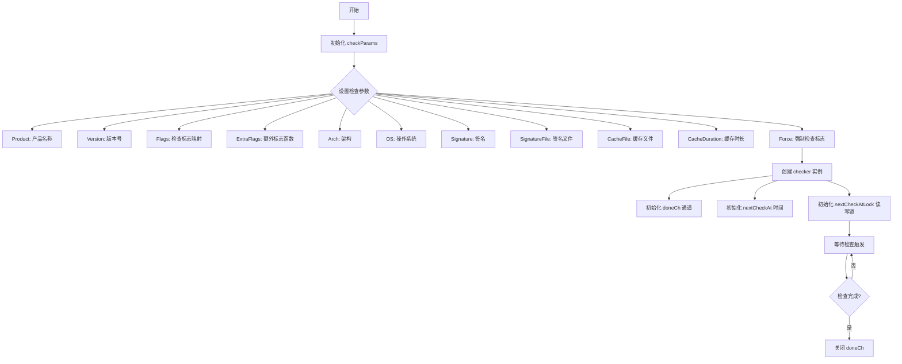

# `flux\pkg\checkpoint\types.go` 详细设计文档

这是一个 Go 语言的 checkpoint 检查点管理包，提供了用于配置检查参数的 checkParams 结构体、管理检查状态的 checker 结构体，以及用于存储键值对的 flag 结构体。该包主要用于实现软件许可检查、产品版本验证等功能，支持缓存机制和强制检查模式。

## 整体流程



## 类结构

```
checkpoint (包)
├── flag (结构体)
│   ├── Key: string
│   └── Value: string
├── checkParams (结构体)
Product: string
Version: string
Flags: map[string
```

## 全局变量及字段


### `flag.Key`
    
标志的键名

类型：`string`
    


### `flag.Value`
    
标志的值

类型：`string`
    


### `checkParams.Product`
    
产品名称

类型：`string`
    


### `checkParams.Version`
    
产品版本

类型：`string`
    


### `checkParams.Flags`
    
检查标志的键值对映射

类型：`map[string]string`
    


### `checkParams.ExtraFlags`
    
获取额外标志的函数

类型：`func() []flag`
    


### `checkParams.Arch`
    
系统架构

类型：`string`
    


### `checkParams.OS`
    
操作系统

类型：`string`
    


### `checkParams.Signature`
    
签名数据

类型：`string`
    


### `checkParams.SignatureFile`
    
签名文件路径

类型：`string`
    


### `checkParams.CacheFile`
    
缓存文件路径

类型：`string`
    


### `checkParams.CacheDuration`
    
缓存有效期

类型：`time.Duration`
    


### `checkParams.Force`
    
是否强制检查

类型：`bool`
    


### `checker.doneCh`
    
用于通知检查完成的通道

类型：`chan struct{}`
    


### `checker.nextCheckAt`
    
下次检查的时间

类型：`time.Time`
    


### `checker.nextCheckAtLock`
    
保护下次检查时间的读写锁

类型：`sync.RWMutex`
    
    

## 全局函数及方法


## 关键组件


### flag 结构体

用于表示配置标志的简单结构体，包含键值对，用于传递配置选项。

### checkParams 结构体

检查参数结构体，封装了进行版本检查所需的所有配置信息，包括产品信息、版本号、特性标志、架构、操作系统、签名信息、缓存配置以及强制检查选项。

### checker 结构体

检查器结构体，管理检查任务的状态和调度，包含一个完成通道用于通知检查完成，以及线程安全的下一次检查时间字段。


## 问题及建议


### 已知问题

- **结构体类型不一致**：`flag` 结构体与 `checkParams.Flags` 字段类型重复（`flag` 包含 Key/Value，`Flags` 是 `map[string]string`），而 `ExtraFlags` 返回 `[]flag`，这种类型不统一会增加使用复杂度。
- **nil 通道风险**：`checker.doneCh` 声明为 `chan struct{}` 但未初始化，直接使用会导致永久阻塞（nil 通道的发送和接收会永远卡住）。
- **过度同步**：对 `time.Time` 类型使用 `sync.RWMutex` 进行保护，`time.Time` 本身是值类型且内部线程安全，轻量级场景可考虑 `sync/atomic` 或省去锁。
- **字段暴露无封装**：`checkParams` 所有字段公开暴露，缺乏构造函数或参数校验，调用者可能传入无效值（如负数 CacheDuration、空字符串 Product 等）。
- **功能重复**：`Signature` 和 `SignatureFile` 字段语义重叠，职责不清晰，容易导致使用困惑。
- **缺乏生命周期管理**：`checker` 结构体没有提供 Stop/Close 方法来优雅关闭 `doneCh`，存在资源泄漏风险。

### 优化建议

- 统一 `flag` 和 `Flags` 的类型定义，或移除冗余的 `flag` 结构体，直接使用 `map[string]string` 替代 `ExtraFlags` 返回值类型。
- 在 `checker` 初始化时使用 `make(chan struct{})` 创建 `doneCh`，或提供 `NewChecker()` 工厂函数统一初始化逻辑。
- 若并发竞争不频繁，可移除 `nextCheckAtLock`，或改用 `sync/atomic` 存储时间戳。
- 为 `checkParams` 提供 `NewCheckParams()` 构造函数，添加参数校验逻辑（如验证必填字段、非负 Duration 等）。
- 明确 `Signature` 和 `SignatureFile` 的使用场景，或合并为一个字段（如 `SignatureSource` 枚举类型）。
- 为 `checker` 实现 `Close()` 方法，在方法中关闭 `doneCh` 通知协程退出，避免资源泄漏。
- 考虑添加 `context.Context` 参数支持超时控制和取消操作，提升接口灵活性。

## 其它


### 设计目标与约束

本代码模块用于实现检查点（checkpoint）功能，支持对产品版本、平台架构、签名信息等进行验证检查，并提供缓存机制以减少频繁检查的性能开销。设计约束包括：必须支持并发访问（通过sync.RWMutex保护nextCheckAt）、缓存有效期可配置、签名验证支持文件和网络两种方式。

### 错误处理与异常设计

错误处理采用Go语言惯用的error返回模式。主要错误场景包括：签名文件读取失败、缓存文件损坏、网络请求超时、参数校验失败等。当checkParams中的必填字段（Product、Version）为空时应返回明确错误；CacheFile不存在时应静默忽略而非报错；SignatureFile存在但读取失败时应返回具体错误信息。

### 数据流与状态机

checker结构体维护检查器的运行状态，状态转换如下：初始状态（nextCheckAt为零值）→ 就绪状态（首次检查完成后）→ 等待状态（下一次检查时间未到达）→ 执行状态（进行实际检查）。状态转换由doneCh通道和nextCheckAt时间戳共同控制。

### 外部依赖与接口契约

本包依赖Go标准库：sync（并发控制）、time（时间处理）。外部接口包括：ExtraFlags函数回调（用于动态获取额外标志）、CacheFile持久化路径（需要文件系统读写权限）、SignatureFile签名文件路径（需要读取权限）。调用方必须提供有效的Product和Version参数。

### 并发模型

采用读写锁（sync.RWMutex）保护nextCheckAt字段，支持多个读操作并发进行，但写操作（更新下次检查时间）需要独占访问。doneCh用于通知检查器停止工作，关闭doneCh时应确保所有进行中的检查操作能够安全退出。

### 生命周期管理

checker实例需要显式管理生命周期：创建时初始化doneCh通道和零值nextCheckAt；停止时关闭doneCh通道并等待所有goroutine退出；缓存数据通过CacheFile和CacheDuration控制持久化和过期策略。

### 性能考虑

通过CacheDuration实现检查结果缓存，避免频繁执行昂贵操作；使用RWMutex减少读操作竞争；ExtraFlags设计为函数类型延迟计算，仅在需要时调用。建议CacheDuration默认值为24小时。

### 安全考虑

Signature和SignatureFile用于验证检查结果完整性，应防止篡改；CacheFile存储敏感检查结果时需考虑加密；ExtraFlags回调函数可能执行任意代码，需确保调用方可信。

### 测试策略

建议测试场景包括：并发读写nextCheckAt的线程安全性、CacheDuration过期后的重新检查逻辑、ExtraFlags返回空切片和nil的处理、doneCh关闭后的优雅退出、参数校验边界条件（如空字符串、负数Duration）。


    