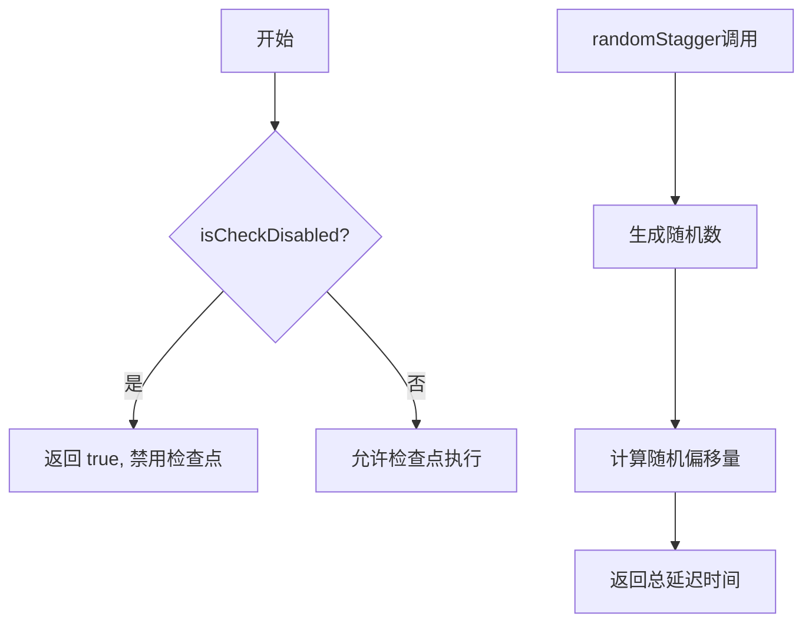
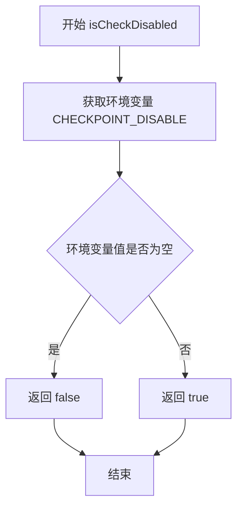

# `flux\pkg\checkpoint\util.go` 详细设计文档

这是一个检查点控制模块，提供环境变量驱动的检查点禁用功能，以及基于随机算法的错峰延迟计算，用于在分布式系统中协调多个节点的检查点执行时间。

## 整体流程



## 类结构

```
checkpoint 包 (无类定义)
├── 全局函数
│   ├── isCheckDisabled
│   └── randomStagger
```

## 全局变量及字段


    

## 全局函数及方法


### `isCheckDisabled`

这是一个检查点禁用检查函数，用于通过环境变量 `CHECKPOINT_DISABLE` 判断是否禁用了检查点功能。如果该环境变量已设置（无论其值是什么），则返回 `true` 表示已禁用；否则返回 `false` 表示未禁用。

参数：

- （无参数）

返回值：`bool`，如果环境变量 `CHECKPOINT_DISABLE` 已设置则返回 `true`（已禁用），否则返回 `false`（未禁用）

#### 流程图



#### 带注释源码

```go
// isCheckDisabled 检查是否通过环境变量禁用了检查点功能
// 该函数读取环境变量 CHECKPOINT_DISABLE，如果该环境变量存在（无论其值是什么），
// 则认为检查点功能被禁用
// 返回值类型：bool
// 返回值描述：true 表示检查点已禁用，false 表示检查点未禁用
func isCheckDisabled() bool {
	// 使用 os.Getenv 获取环境变量 CHECKPOINT_DISABLE 的值
	// 如果环境变量已设置，返回值不为空字符串，返回 true
	// 如果环境变量未设置，返回空字符串，返回 false
	return os.Getenv("CHECKPOINT_DISABLE") != ""
}
```

#### 相关上下文信息

虽然本次重点分析的是 `isCheckDisabled` 函数，但同一代码文件中还包含 `randomStagger` 函数，二者共同服务于检查点机制：

- **isCheckDisabled**：作为门禁函数，在执行检查点操作前检查是否应该跳过
- **randomStagger**：用于生成随机化的间隔时间，避免多个客户端同时执行检查点造成峰值负载

这种设计模式体现了**配置化控制**和**负载分散**的思想，是检查点系统中的关键优化点。


### `randomStagger`

该函数用于生成一个随机错开的时间间隔，常用于分布式系统中避免多个节点在同一时刻执行检查点操作。它通过计算输入间隔的随机偏移量，使返回时间值分布在原始间隔的75%到125%之间。

参数：

- `interval`：`time.Duration`，原始时间间隔，用于计算随机错开的基础

返回值：`time.Duration`，返回随机错开后的时间间隔，范围在原始间隔的75%到125%之间

#### 流程图

```mermaid
flowchart TD
    A[开始 randomStagger] --> B[输入: interval time.Duration]
    B --> C[计算 stagger = Int63随机数 % (interval / 2)]
    C --> D[计算结果: stagger 范围 [0, interval/2)]
    D --> E[计算返回值: 3*(interval/4) + stagger]
    E --> F[返回值范围: [0.75*interval, 1.25*interval)]
    F --> G[结束]
```

#### 带注释源码

```go
// randomStagger 生成一个随机错开的时间间隔
// 用于在分布式系统中错开检查点执行时间，避免惊群效应
// 参数 interval: 基础时间间隔
// 返回: 随机错开后的时间间隔，范围为原始间隔的75%到125%
func randomStagger(interval time.Duration) time.Duration {
	// 生成0到interval/2之间的随机数作为偏移量
	// 使用Int63()获取64位随机整数，确保跨平台一致性
	stagger := time.Duration(mrand.Int63()) % (interval / 2)
	
	// 计算最终返回值：基础值3*(interval/4) = 0.75*interval
	// 加上随机偏移量stagger，范围[0, interval/2)
	// 最终范围: [0.75*interval, 1.25*interval)
	return 3*(interval/4) + stagger
}
```

## 关键组件


### 环境变量检查组件

通过读取环境变量 CHECKPOINT_DISABLE 来判断是否禁用了检查点功能，用于实现功能的动态开关控制

### 随机延迟生成组件

根据传入的间隔时间生成一个随机偏移量，使检查点操作错开执行，用于避免多个节点同时执行检查点导致的性能瓶颈


## 问题及建议


### 已知问题

-   **随机数种子未初始化**：`mrand.Int63()` 使用全局随机数生成器且未设置种子，在 Go 1.20 之前默认种子为固定值，可能产生可预测的随机序列，影响安全性（如用于限流场景）
-   **除零风险**：`randomStagger` 函数中 `interval / 2` 和 `interval / 4` 在 interval 较小时可能产生意外结果，且当 interval 为 0 时会导致除零 panic
-   **环境变量重复读取**：`isCheckDisabled()` 每次调用都执行 `os.Getenv()`，在高频调用场景下会有不必要的系统调用开销
-   **缺乏边界校验**：函数参数无输入验证，无法防止非法值传入导致异常行为

### 优化建议

-   **初始化随机数种子**：使用 `rand.New(rand.NewSource(time.Now().UnixNano()))` 或接受外部注入的随机源，提高可测试性和安全性
-   **添加参数校验**：在 `randomStagger` 入口处增加 `if interval <= 0` 的校验并返回合理默认值或 error
-   **缓存配置值**：将环境变量读取结果缓存至包级变量或使用 sync.Once，避免重复系统调用
-   **简化计算逻辑**：将 `3*(interval/4) + stagger` 改为更易理解的等效表达式，如 `interval - interval/4 + stagger`
-   **增加单元测试**：覆盖边界条件（interval=0、interval=1、极大值等）和并发场景


## 其它


### 设计目标与约束

本代码模块的设计目标是提供checkpoint功能的动态控制机制，以及在分布式场景下通过随机交错（stagger）避免多个节点同时执行checkpoint造成的性能冲击。设计约束包括：仅依赖Go标准库（math/rand、os、time），不引入外部依赖；通过环境变量CHECKPOINT_DISABLE实现运行时开关，无需修改代码；随机交错时长基于固定公式计算，不支持自定义分布。

### 错误处理与异常设计

当前代码错误处理机制较为薄弱。isCheckDisabled()仅读取环境变量，异常情况（如环境变量读取失败）会被忽略，返回false。randomStagger()的异常场景包括：interval为0或负数时，除法操作可能引发panic；interval过小（如小于4）时，除法结果为0可能导致意外行为。建议增加参数校验，对非法输入返回0或负值，并记录警告日志。

### 数据流与状态机

本模块为无状态工具包，不涉及复杂的状态机。数据流为：环境变量 → isCheckDisabled() → 返回布尔值 → 上游调用者决定是否跳过checkpoint。randomStagger()的数据流为：输入interval → 计算基础时长(3*interval/4) → 加上随机偏移量 → 返回结果。上游模块的典型调用模式为：首先调用isCheckDisabled()判断是否需要执行checkpoint，然后调用randomStagger()计算延迟时间。

### 外部依赖与接口契约

外部依赖包括：os标准库用于读取环境变量GETENV；math/rand标准库用于生成随机数；time标准库用于时间类型和Duration计算。接口契约方面：isCheckDisabled()无需参数，返回bool类型；randomStagger()接收time.Duration类型的interval参数，返回time.Duration类型的延迟值。上游调用者需保证传入的interval为正数且足够大。

### 性能考虑与资源使用

isCheckDisabled()每次调用都会读取环境变量，存在轻微的IO开销，但环境变量读取通常在内核缓存中完成，性能影响可忽略。randomStagger()使用mrand.Int63()生成随机数，计算复杂度为O(1)。潜在优化点：可缓存环境变量读取结果，避免重复调用；mrand随机数生成器未显式设置种子，可能导致低精度的随机序列（尽管Go 1.20前自动设置种子）。

### 安全性考虑

本代码不涉及敏感数据处理，安全性风险较低。环境变量CHECKPOINT_DISABLE可能被恶意设置导致checkpoint永不执行，但这是运维层面的配置问题，非代码安全漏洞。randomStagger()的数学运算不存在整数溢出风险（Duration为int64类型）。建议在生产环境中限制环境变量的写入权限。

### 并发安全性

两个函数均为纯函数，无全局状态共享，不涉及并发竞争问题。mrand为包级全局变量，但math/rand包本身是并发安全的（Go 1.20版本后改进）。若未来引入自定义rand.Rand实例，需注意并发访问的加锁保护。

### 测试策略建议

当前代码缺少单元测试。建议覆盖的测试用例包括：isCheckDisabled()在环境变量设置/未设置时的行为；randomStagger()在不同interval值下的输出范围验证（应位于[3*interval/4, 7*interval/8)区间）；边界条件测试（interval为0、1、负数时的行为）；并发调用场景下的稳定性。

### 部署与配置说明

部署时需确保运行环境中可正确设置CHECKPOINT_DISABLE环境变量（值为任意非空字符串即生效）。randomStagger()的interval参数由上游调用者根据业务场景指定，典型值为分钟级（如5*time.Minute）。建议在部署文档中明确说明环境变量的作用及配置示例。

### 版本兼容性

代码使用Go标准库，无外部依赖，兼容性良好。建议标注最低Go版本要求（Go 1.17+），因time.Duration类型在早期版本中可能存在细微差异。math/rand的随机数生成器在Go 1.20版本有重大改进，若需高质量随机性，建议明确Go版本要求。


    