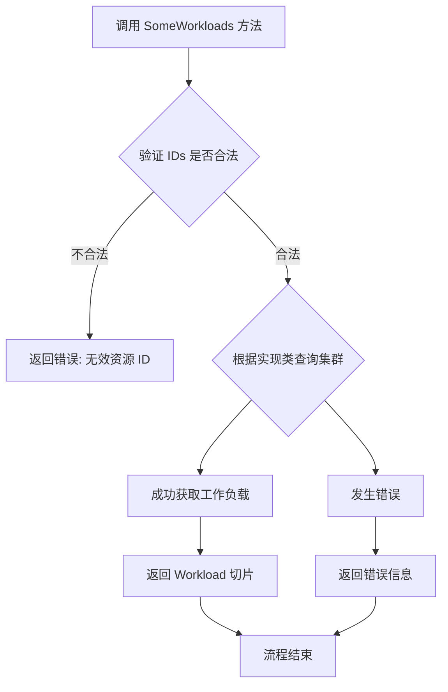
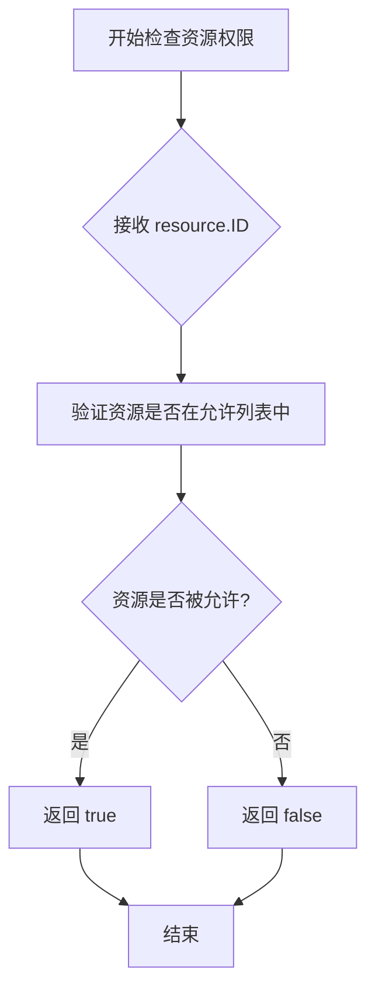
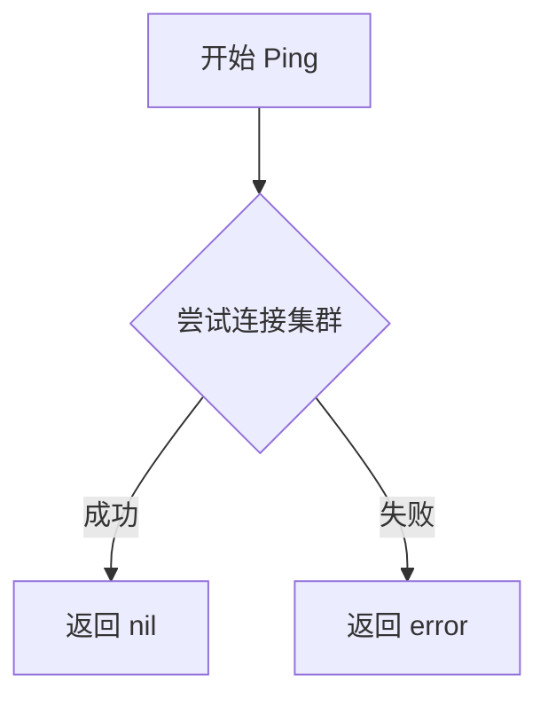
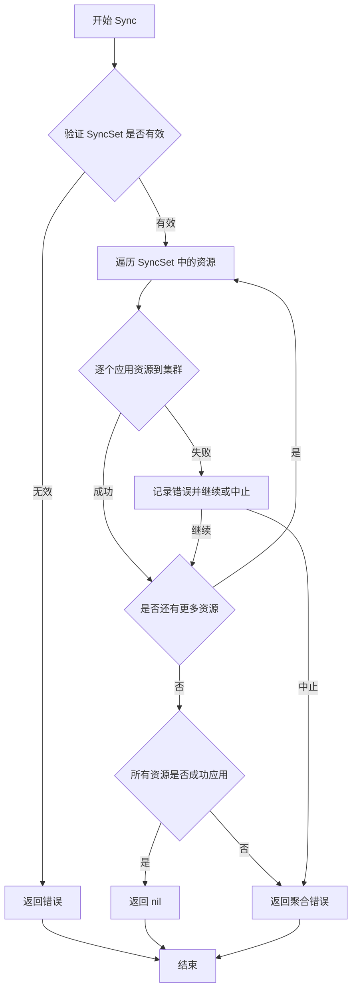
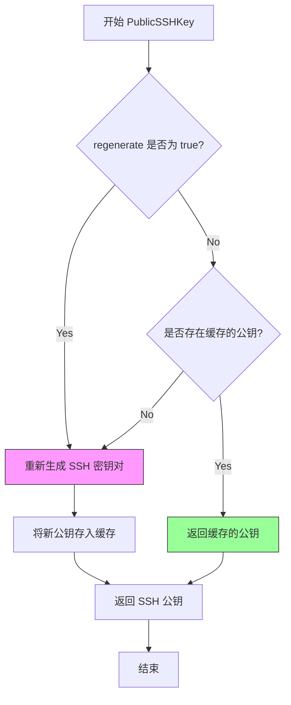
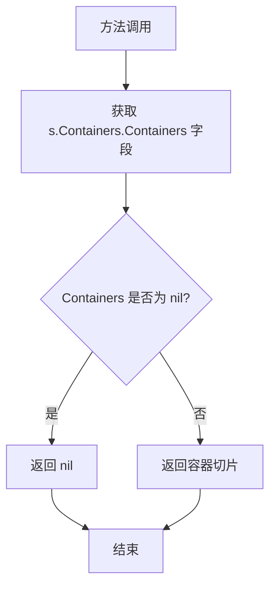

# `flux\pkg\cluster\cluster.go` 详细设计文档

这是一个Go语言包，定义了集群管理相关的接口和数据结构，用于描述Kubernetes集群中的工作负载（Workload）、部署状态（RolloutStatus）以及集群操作接口（Cluster），是FluxCD持续交付工具的核心组件之一。

## 整体流程

```mermaid
graph TD
    A[开始] --> B[Cluster Interface]
    B --> C[AllWorkloads: 获取所有工作负载]
    B --> D[SomeWorkloads: 获取指定工作负载]
    B --> E[IsAllowedResource: 检查资源权限]
    B --> F[Ping: 检查集群连接]
    B --> G[Export: 导出集群配置]
    B --> H[Sync: 同步配置到集群]
    B --> I[PublicSSHKey: 获取SSH公钥]
    C --> J[返回 []Workload]
    D --> J
    J --> K[Workload Struct]
    K --> L[RolloutStatus: 部署状态]
    K --> M[ContainersOrExcuse: 容器信息]
    L --> N{状态检查}
    N --> O[StatusUnknown]
    N --> P[StatusError]
    N --> Q[StatusReady]
    N --> R[StatusUpdating]
    N --> S[StatusStarted]
```

## 类结构

```
Cluster (Interface)
├── AllWorkloads()
├── SomeWorkloads()
├── IsAllowedResource()
├── Ping()
├── Export()
├── Sync()
└── PublicSSHKey()

RolloutStatus (Struct)
├── Desired int32
├── Updated int32
├── Ready int32
├── Available int32
├── Outdated int32
└── Messages []string

Workload (Struct)
├── ID resource.ID
├── Status string
├── IsSystem bool
├── Antecedent resource.ID
├── Labels map[string]string
├── Policies policy.Set
├── Rollout RolloutStatus
├── SyncError error
├── Containers ContainersOrExcuse
├── ContainersOrNil()
└── ContainersOrError()

ContainersOrExcuse (Struct)
├── Excuse string
└── Containers []resource.Container
```

## 全局变量及字段


### `StatusUnknown`
    
工作负载就绪状态常量，表示状态未知

类型：`string`
    


### `StatusError`
    
工作负载就绪状态常量，表示状态错误

类型：`string`
    


### `StatusReady`
    
工作负载就绪状态常量，表示状态就绪

类型：`string`
    


### `StatusUpdating`
    
工作负载就绪状态常量，表示正在更新

类型：`string`
    


### `StatusStarted`
    
工作负载就绪状态常量，表示已启动

类型：`string`
    


### `RolloutStatus.Desired`
    
期望的Pod数量

类型：`int32`
    


### `RolloutStatus.Updated`
    
已更新的Pod数量

类型：`int32`
    


### `RolloutStatus.Ready`
    
就绪的Pod数量

类型：`int32`
    


### `RolloutStatus.Available`
    
可用的Pod数量

类型：`int32`
    


### `RolloutStatus.Outdated`
    
过时的Pod数量

类型：`int32`
    


### `RolloutStatus.Messages`
    
部署进度异常消息

类型：`[]string`
    


### `Workload.ID`
    
工作负载唯一标识

类型：`resource.ID`
    


### `Workload.Status`
    
用于显示的状态摘要

类型：`string`
    


### `Workload.IsSystem`
    
是否为系统控制器

类型：`bool`
    


### `Workload.Antecedent`
    
关联的前置资源ID

类型：`resource.ID`
    


### `Workload.Labels`
    
工作负载标签

类型：`map[string]string`
    


### `Workload.Policies`
    
策略集合

类型：`policy.Set`
    


### `Workload.Rollout`
    
部署状态

类型：`RolloutStatus`
    


### `Workload.SyncError`
    
同步错误

类型：`error`
    


### `Workload.Containers`
    
容器信息或错误原因

类型：`ContainersOrExcuse`
    


### `ContainersOrExcuse.Excuse`
    
无法获取容器时的错误说明

类型：`string`
    


### `ContainersOrExcuse.Containers`
    
容器列表

类型：`[]resource.Container`
    
    

## 全局函数及方法


### `Cluster.AllWorkloads`

获取集群中所有工作负载（可选择性地从特定命名空间获取），返回工作负载列表或错误信息。

参数：

- `ctx`：`context.Context`，用于传递请求上下文、取消信号和截止时间
- `maybeNamespace`：`string`，可选的命名空间参数，如果为空则获取所有命名空间的工作负载

返回值：`([]Workload, error)`，返回工作负载切片和可能的错误信息

#### 流程图

```mermaid
flowchart TD
    A[开始 AllWorkloads] --> B[接收上下文 ctx]
    B --> C[接收命名空间 maybeNamespace]
    C --> D{调用集群API获取工作负载}
    D -->|成功| E[返回 []Workload]
    D -->|失败| F[返回 error]
    E --> G[结束]
    F --> G
```

#### 带注释源码

```go
// Cluster 接口定义了从运行中的集群获取资源的能力
type Cluster interface {
	// AllWorkloads 获取所有工作负载，可选择性地从特定命名空间获取
	// 参数:
	//   - ctx: 上下文对象，用于控制请求生命周期和取消
	//   - maybeNamespace: 可选的命名空间，为空时表示获取所有命名空间的工作负载
	//
	// 返回值:
	//   - []Workload: 工作负载列表
	//   - error: 获取过程中发生的错误
	AllWorkloads(ctx context.Context, maybeNamespace string) ([]Workload, error)
	// SomeWorkloads 获取指定ID列表的工作负载
	SomeWorkloads(ctx context.Context, ids []resource.ID) ([]Workload, error)
	// IsAllowedResource 检查资源是否被允许
	IsAllowedResource(resource.ID) bool
	// Ping 检查集群连接
	Ping() error
	// Export 导出集群配置
	Export(ctx context.Context) ([]byte, error)
	// Sync 同步配置到集群
	Sync(SyncSet) error
	// PublicSSHKey 获取公钥
	PublicSSHKey(regenerate bool) (ssh.PublicKey, error)
}
```


### `Cluster.SomeWorkloads`

获取指定资源 ID 列表对应的工作负载信息。该方法根据提供的资源 ID 列表，从集群中检索对应的 `Workload` 对象，并返回包含这些工作负载的切片。如果在检索过程中发生错误（如网络问题、权限不足或资源不存在），则返回 `error`。

参数：

- `ctx`：`context.Context`，上下文对象，用于控制请求的生命周期和传递请求范围内的数据（如超时、取消信号）
- `ids`：`[]resource.ID`，要获取的资源 ID 列表，每个 ID 对应一个集群中的工作负载

返回值：`[]Workload, error`，返回匹配的工作负载切片和可能的错误信息。如果成功，返回包含 `Workload` 对象的切片且错误为 `nil`；如果失败，返回 `nil` 和具体的错误对象。

#### 流程图



#### 带注释源码

```go
// SomeWorkloads 获取指定资源 ID 列表的工作负载
// 参数 ctx: 上下文，用于控制请求超时和取消
// 参数 ids: 资源 ID 列表，指定需要查询的工作负载
// 返回: Workload 切片和错误信息
SomeWorkloads(ctx context.Context, ids []resource.ID) ([]Workload, error)
```


### `Cluster.IsAllowedResource`

检查给定的资源 ID 是否在集群中被允许访问。该方法是 Cluster 接口的定义，用于验证某个资源是否属于当前集群管理范围或是否被授权进行操作。

参数：

- （匿名参数）：`resource.ID`，要检查的资源标识符

返回值：`bool`，如果资源被允许则返回 true，否则返回 false

#### 流程图



#### 带注释源码

```go
// Cluster 接口定义了一个集群操作的核心抽象
type Cluster interface {
    // 获取所有工作负载（可指定命名空间）
    AllWorkloads(ctx context.Context, maybeNamespace string) ([]Workload, error)
    // 根据资源 ID 列表获取特定工作负载
    SomeWorkloads(ctx context.Context, ids []resource.ID) ([]Workload, error)
    
    // IsAllowedResource 检查指定的资源 ID 是否在集群中允许访问
    // 参数 resource.ID: 要验证的资源标识符，通常包含命名空间和资源名称
    // 返回值 bool: true 表示资源允许访问，false 表示资源不允许或不存在
    IsAllowedResource(resource.ID) bool
    
    // Ping 检查集群连接是否正常
    Ping() error
    // Export 导出集群当前状态
    Export(ctx context.Context) ([]byte, error)
    // Sync 将同步集应用到集群
    Sync(SyncSet) error
    // PublicSSHKey 获取公钥
    PublicSSHKey(regenerate bool) (ssh.PublicKey, error)
}
```

---

### 补充说明

**设计目标**：该方法作为 Cluster 接口的一部分，提供了一个轻量级的资源权限检查机制，无需加载完整的资源信息即可判断某个资源是否可以被操作。

**实现提示**：在实际实现中，该方法通常会维护一个资源白名单或黑名单，或者通过查询集群的 API Server 来验证资源是否存在且在命名空间允许范围内。

**潜在优化**：
- 如果调用频繁，考虑添加缓存机制以减少重复的 API Server 查询
- 可以考虑返回更详细的错误信息，而不仅仅是布尔值


### `Cluster.Ping`

检查集群是否可访问，用于健康检查。

参数： 无

返回值： `error`，如果集群不可访问则返回错误

#### 流程图



#### 带注释源码

```go
// Ping checks if the cluster is reachable.
// It is used for health checks to verify cluster connectivity.
// Returns nil if the cluster is accessible, otherwise returns an error.
Ping() error
```


### `Cluster.Export`

该方法用于从运行的集群中导出所有资源或配置信息，返回以字节切片形式表示的集群状态数据，通常用于备份、同步或迁移场景。

参数：

- `ctx`：`context.Context`，用于控制请求的取消、超时和截止时间

返回值：`([]byte, error)`，第一个返回值为导出的集群配置数据（字节切片），第二个返回值为操作过程中可能发生的错误

#### 流程图

```mermaid
flowchart TD
    A[开始 Export] --> B{检查 ctx 是否取消}
    B -->|是| C[返回 ctx 错误]
    B -->|否| D[调用集群底层 API 获取资源]
    D --> E{获取是否成功}
    E -->|失败| F[返回错误]
    E -->|成功| G[将资源序列化为字节数据]
    G --> H[返回 []byte 数据]
```

#### 带注释源码

```go
// Export 从运行的集群中导出所有资源的配置信息
// 参数 ctx 用于控制请求的取消和超时
// 返回导出资源的字节数据和一个错误（如果发生）
Export(ctx context.Context) ([]byte, error)
```


### `Cluster.Sync`

将给定的同步集合（SyncSet）应用到集群中，以实现资源配置的同步操作。

参数：

-  `syncSet`：`SyncSet`，需要同步到集群的资源集合

返回值：`error`，如果同步过程中发生错误则返回错误信息，否则返回 nil

#### 流程图



#### 带注释源码

```go
// Cluster 接口定义了与集群交互的所有方法
type Cluster interface {
    // ... 其他方法 ...
    
    // Sync 将 SyncSet 中的资源配置同步到集群
    // 参数 syncSet: 包含需要同步的资源定义集合
    // 返回值: 同步过程中如果发生错误则返回错误，否则返回 nil
    Sync(SyncSet) error
    
    // ... 其他方法 ...
}
```


### `Cluster.PublicSSHKey`

获取集群的SSH公钥，用于配置Git仓库的部署密钥。根据`regenerate`参数决定是返回缓存的公钥还是重新生成新的公钥。

#### 参数

- `regenerate`：`bool`，是否重新生成SSH公钥。设置为`true`时会重新生成密钥对，设置为`false`时返回已缓存的公钥（如果存在）

#### 返回值

- `ssh.PublicKey`：SSH公钥，用于配置Git仓库的部署密钥
- `error`：操作过程中发生的错误

#### 流程图



#### 带注释源码

```go
// PublicSSHKey returns the SSH public key used for authenticating with the Git repository.
// If regenerate is true, a new key pair is generated; otherwise, the cached public key is returned.
PublicSSHKey(regenerate bool) (ssh.PublicKey, error)
```


### `Workload.ContainersOrNil`

该方法用于从 Workload 结构体中获取容器列表。如果容器列表为空（nil），则直接返回 nil，否则返回容器切片。

参数：
- 无（仅包含接收器 `s Workload`）

返回值：`[]resource.Container`，返回容器列表，如果容器字段为空则返回 nil

#### 流程图



#### 带注释源码

```go
// ContainersOrNil 返回该 Workload 所包含的容器列表。
// 如果容器列表为空（即未设置或为 nil），则直接返回 nil。
// 这允许调用者通过检查返回值是否为 nil 来判断是否存在容器信息。
func (s Workload) ContainersOrNil() []resource.Container {
	// 直接返回 Containers 字段中的容器切片
	// Go 语言中 nil slice 返回时即为 nil，符合此方法的语义
	return s.Containers.Containers
}
```


### `Workload.ContainersOrError`

获取工作负载的容器列表，如果存在错误说明（Excuse）则返回相应的错误信息，否则返回空错误。

参数：此方法无显式参数（接收者 `s` 不计入参数列表）。

返回值：`([]resource.Container, error)`，返回工作负载的容器列表；若存在错误说明，则返回包含错误信息的 error 对象。

#### 流程图

```mermaid
flowchart TD
    A[开始: 调用 ContainersOrError] --> B{检查 s.Containers.Excuse}
    B -->|不为空| C[创建错误: err = errors.New(s.Containers.Excuse)]
    B -->|为空| D[设置错误为nil: err = nil]
    C --> E[返回结果]
    D --> E
    E --> F[返回 s.Containers.Containers]
    E --> G[返回 err]
    
    style C fill:#ffcccc
    style D fill:#ccffcc
```

#### 带注释源码

```go
// ContainersOrError 返回工作负载的容器列表，如果存在错误说明则返回错误
// 返回值：
//   - []resource.Container: 容器列表
//   - error: 如果有错误说明则返回错误，否则返回nil
func (s Workload) ContainersOrError() ([]resource.Container, error) {
	var err error
	// 检查是否存在错误说明（Excuse）
	// 如果有说明信息，说明获取容器过程中出现了问题
	if s.Containers.Excuse != "" {
		// 将错误说明转换为error对象
		err = errors.New(s.Containers.Excuse)
	}
	// 返回容器列表和错误（错误可能为nil）
	return s.Containers.Containers, err
}
```

## 关键组件


### Cluster 接口

定义与运行中的集群交互的核心抽象，封装了获取工作负载、同步资源、导出集群状态等操作，是整个包与Kubernetes集群通信的门户。

### Workload 结构体

描述声明版本化镜像的集群资源，包含ID、状态、系统标记、关联资源、标签、策略、部署状态、同步错误和容器信息，是表示集群中单个工作负载的核心数据结构。

### RolloutStatus 结构体

描述部署过程中不同状态的Pod数量（Desired、Updated、Ready、Available、Outdated）以及意外部署进度的消息，用于追踪部署的完整状态。

### ContainersOrExcuse 结构体

封装容器列表或无法获取容器的原因，支持两种场景：成功获取容器列表或返回无法获取的具体说明，实现了容错设计。

### 状态常量

定义工作负载的就绪状态常量（StatusUnknown、StatusError、StatusReady、StatusUpdating、StatusStarted），提供标准化的状态表示。

### Workload 容器访问方法

提供容器的便捷访问方式：ContainersOrNil()返回容器列表（忽略错误），ContainersOrError()返回容器和可能的错误，支持不同场景下的容错处理。

### IsAllowedResource 资源验证

通过Cluster接口的IsAllowedResource方法验证资源ID是否允许操作，实现资源访问控制。

### PublicSSHKey 密钥管理

通过Cluster接口的PublicSSHKey方法管理公钥，支持密钥重新生成，用于GitOps工作流的SSH认证。


## 问题及建议


### 已知问题

- **错误处理模式不规范**：`ContainersOrExcuse` 结构体同时包含 `Excuse` (string) 和 `Containers`，使用字符串存储错误信息的方式不符合 Go 语言的惯用错误处理模式，应使用 error 类型替代。
- **资源验证缺失**：`RolloutStatus` 结构体的数值字段（Desired, Updated, Ready, Available, Outdated）没有验证逻辑，负值会导致逻辑错误。
- **接口职责不单一**：`Cluster` 接口包含 7 个方法，职责过多，建议拆分（如分离查询接口和操作接口）。
- **类型使用不一致**：状态字段使用 string 类型，而非更类型安全的自定义类型，容易产生拼写错误。
- **可序列化问题**：`Workload.SyncError` 字段直接存储 error 接口类型，在需要序列化（如导出到 Git）时会出现问题。
- **注释不完整**：多处导出字段缺少文档注释，如 `RolloutStatus` 的各字段没有说明其含义。
- **缺少验证逻辑**：`Workload.Antecedent` 字段没有验证是否为有效 ID，可能导致级联错误。
- **硬编码字符串**：`RolloutStatus.Messages` 字段没有定义消息类型常量，散落在代码中可能导致不一致。

### 优化建议

- **重构错误处理**：将 `ContainersOrExcuse.Excuse` 替换为 error 类型，或使用标准 Go 错误模式。
- **添加数据验证**：为 `RolloutStatus` 添加验证方法，确保数值字段非负。
- **定义类型**：将状态常量升级为自定义类型（如 type Status string），提供类型安全。
- **拆分接口**：将 `Cluster` 拆分为只读接口（查询）和写操作接口，符合接口隔离原则。
- **添加文档注释**：为所有导出字段添加完整的文档注释。
- **序列化友好设计**：将 `SyncError` 转换为可序列化的结构（如存储错误消息字符串）。
- **提取常量**：将错误消息、状态值等提取为常量。
- **添加单元测试**：为核心数据结构添加测试用例。

## 其它


### 设计目标与约束

本代码的设计目标是定义Fluxcd集群管理的核心接口和数据结构，抽象化对不同集群平台（如Kubernetes）的操作，提供统一的工作负载和部署状态表示。约束方面：Workload的Status字段仅为显示用途的字符串摘要，不用于精确状态判断；RolloutStatus遵循Kubernetes Deployment状态规范；Cluster接口方法需支持context.Context以实现超时和取消控制；所有方法设计为幂等或明确声明副作用。

### 错误处理与异常设计

错误处理采用Go语言惯例，通过返回值error类型传递错误。Workload.Containers字段使用ContainersOrExcuse模式：当无法获取容器信息时返回Excuse字符串而非error，允许调用者根据具体场景选择处理方式。RolloutStatus.Messages字段用于记录部署过程中的非致命问题，标识需要人工干预但不阻塞流程的情况。Cluster接口的Ping方法用于检测集群连接性，AllWorkloads和SomeWorkloads方法返回error表示获取失败，Sync方法返回error表示同步失败。

### 数据流与状态机

数据流方向：外部调用者通过Cluster接口获取Workload列表，Workload包含当前部署状态（RolloutStatus）、容器信息（ContainersOrExcuse）、标签和策略等。Sync方法反向将配置从Git仓库同步到集群。状态转换方面：RolloutStatus描述Deployment的三种状态——进行中（Updated/Ready/Available与Desired不等）、卡住（Messages非空）、完成（所有计数匹配且Outdated为0）。Workload.Status是动态计算的状态摘要，用于UI展示。

### 外部依赖与接口契约

核心依赖包括：github.com/fluxcd/flux/pkg/resource（资源ID和容器定义）、github.com/fluxcd/flux/pkg/policy（策略集）、github.com/fluxcd/flux/pkg/ssh（SSH公钥）。接口契约方面：Cluster接口实现者需保证AllWorkloads返回所有非系统工作负载（IsSystem=false）；SomeWorkloads按IDs参数顺序返回结果，缺失的ID应返回空切片而非error；IsAllowedResource用于过滤不允许管理的资源；PublicSSHKey的regenerate参数为true时应生成新密钥对；Export应返回集群配置的序列化形式（如YAML/JSON）供Git仓库使用。

### 并发考虑

所有Cluster接口方法接受context.Context参数，允许调用者控制超时和取消。方法设计为无状态，不包含并发访问的共享可变状态。实现者需自行处理底层Kubernetes客户端的并发安全。Workload和RolloutStatus为值类型或不可变结构（字段均为基本类型和字符串），在并发场景下可直接复制使用。

### 安全性考虑

IsAllowedResource方法作为安全边界，用于过滤不允许Flux管理的资源（如kube-system命名空间的资源）。PublicSSHKey方法涉及SSH密钥生成，实现者需确保密钥安全存储和传输。Sync方法执行集群写操作，实现者需验证SyncSet内容的合法性以防止恶意配置注入。

### 兼容性考虑

Status常量（StatusUnknown/StatusError/StatusReady/StatusUpdating/StatusStarted）定义为包级常量，供外部包使用以避免Kubernetes依赖。RolloutStatus字段使用int32类型与Kubernetes API保持一致。接口设计遵循里氏替换原则，新增方法需保持向后兼容。版本演进时可通过追加字段而非修改现有字段实现扩展。

### 测试策略

建议为RolloutStatus编写单元测试，验证不同状态组合（进行中/卡住/完成）的判断逻辑。为Workload的ContainersOrNil和ContainersOrError方法编写边界测试（空Excuse、容器为空、两者均非空）。Cluster接口建议定义mock实现用于上层业务逻辑测试。集成测试需连接真实Kubernetes集群验证接口实现的行为正确性。


    