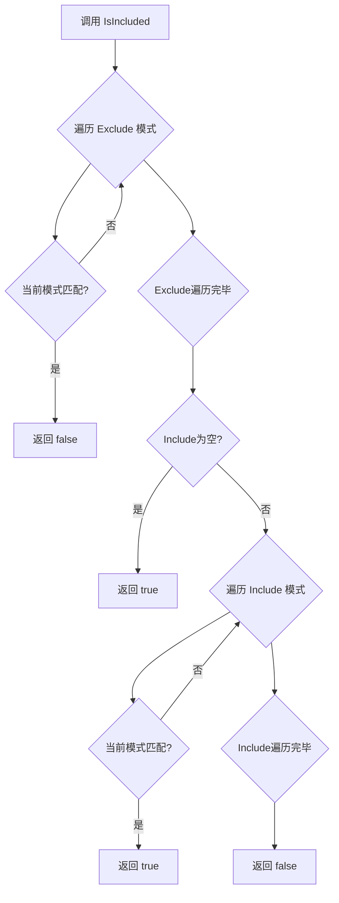
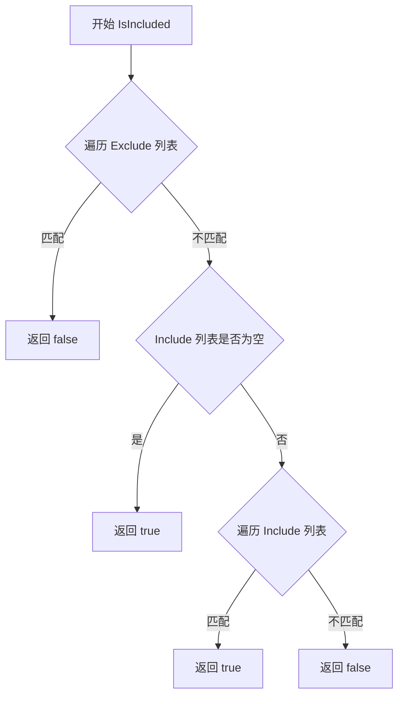

# `flux\pkg\cluster\includelist.go` 详细设计文档

该代码实现了一个灵活的「包含-排除」谓词框架，用于根据glob模式匹配决定镜像是否应该被扫描。通过Includer接口统一了匹配行为，ExcludeIncludeGlob结构体提供了先排除后包含的逻辑判断。

## 整体流程



## 类结构

```
Includer (接口)
└── IncluderFunc (函数类型实现接口)
ExcludeIncludeGlob (结构体实现 Includer 接口)
```

## 全局变量及字段


### `AlwaysInclude`
    
始终返回true的Includer实例

类型：`IncluderFunc`
    


### `ExcludeIncludeGlob.Include`
    
需要包含的glob模式列表

类型：`[]string`
    


### `ExcludeIncludeGlob.Exclude`
    
需要排除的glob模式列表

类型：`[]string`
    
    

## 全局函数及方法


### `ExcludeIncludeGlob.IsIncluded`

该方法实现了 `Includer` 接口，用于根据 glob 模式匹配决定是否包含某个字符串。其逻辑为：首先检查是否匹配任何排除模式，若匹配则排除；然后如果没有包含模式则默认包含；最后检查是否匹配包含模式。

参数：

-  `s`：`string`，待检查的字符串

返回值：`bool`，如果字符串应被包含则返回 true，否则返回 false

#### 流程图



#### 带注释源码

```go
// IsIncluded implements Includer using the logic:
//  - if the string matches any exclude pattern, don't include it
//  - otherwise, if there are no include patterns, include it
//  - otherwise, if it matches an include pattern, include it
//  = otherwise don't include it.
func (ei ExcludeIncludeGlob) IsIncluded(s string) bool {
	// 第一步：检查排除模式
	// 遍历所有排除模式，如果匹配任意一个则立即返回 false（不包含）
	for _, ex := range ei.Exclude {
		if glob.Glob(ex, s) {
			return false
		}
	}
	
	// 第二步：如果没有包含规则，则默认包含
	// 当 Include 列表为空时，表示不限制，全部包含
	if len(ei.Include) == 0 {
		return true
	}
	
	// 第三步：检查包含模式
	// 遍历所有包含模式，如果匹配任意一个则返回 true（包含）
	for _, in := range ei.Include {
		if glob.Glob(in, s) {
			return true
		}
	}
	
	// 第四步：未匹配任何包含模式
	// 既不匹配排除规则，也不匹配包含规则时，排除
	return false
}
```


### `IncluderFunc.IsIncluded`

这是一个适配器方法，将 `IncluderFunc` 函数类型适配为 `Includer` 接口。它接收一个字符串参数，调用底层存储的函数并返回其布尔结果。

参数：

- `s`：`string`，要检查的字符串

返回值：`bool`，表示给定字符串是否被包含（取决于底层函数逻辑）

#### 流程图

```mermaid
flowchart TD
    A[开始] --> B[接收字符串参数 s]
    B --> C[调用底层函数 f(s)]
    C --> D{返回布尔结果}
    D -->|true| E[包含]
    D -->|false| F[不包含]
    E --> G[返回 true]
    F --> G
```

#### 带注释源码

```go
// IsIncluded 是 IncluderFunc 类型的方法，实现 Includer 接口
// 参数 s: 要检查的字符串
// 返回值: 布尔值，表示字符串是否被包含
func (f IncluderFunc) IsIncluded(s string) bool {
	// 调用底层存储的函数 f，传入参数 s 并返回其结果
	return f(s)
}
```


### `ExcludeIncludeGlob.IsIncluded`

该方法实现了 `Includer` 接口，通过 glob 模式匹配来决策给定的字符串是否应该被包含。其判断逻辑为：首先检查是否匹配任何排除模式，若匹配则排除；然后若没有定义包含模式则默认包含；最后检查是否匹配包含模式，若匹配则包含，否则排除。

参数：

- `s`：`string`，待检查的字符串，用于判断是否应被包含

返回值：`bool`，返回 true 表示字符串应被包含，返回 false 表示不应被包含

#### 流程图

```mermaid
flowchart TD
    A[开始 IsIncluded] --> B{遍历 Exclude 列表}
    B -->|当前排除模式 ex| C{glob.Glob ex, s}
    C -->|匹配成功| D[返回 false]
    C -->|匹配失败| B
    B -->|遍历完成| E{len(Include) == 0}
    E -->|是| F[返回 true]
    E -->|否| G{遍历 Include 列表}
    G -->|当前包含模式 in| H{glob.Glob in, s}
    H -->|匹配成功| I[返回 true]
    H -->|匹配失败| G
    G -->|遍历完成| J[返回 false]
    
    style D fill:#ffcccc
    style F fill:#ccffcc
    style I fill:#ccffcc
    style J fill:#ffcccc
```

#### 带注释源码

```go
// IsIncluded implements Includer using the logic:
//  - if the string matches any exclude pattern, don't include it
//  - otherwise, if there are no include patterns, include it
//  - otherwise, if it matches an include pattern, include it
//  - otherwise don't include it.
func (ei ExcludeIncludeGlob) IsIncluded(s string) bool {
    // 第一步：检查排除规则
    // 遍历所有排除模式，如果字符串匹配任意一个排除模式，则立即返回 false（不包含）
    for _, ex := range ei.Exclude {
        if glob.Glob(ex, s) {
            return false
        }
    }
    
    // 第二步：检查包含规则
    // 如果没有定义任何包含模式，则默认返回 true（包含所有未排除的字符串）
    if len(ei.Include) == 0 {
        return true
    }
    
    // 第三步：检查是否匹配包含模式
    // 遍历所有包含模式，如果字符串匹配任意一个包含模式，则返回 true（包含）
    for _, in := range ei.Include {
        if glob.Glob(in, s) {
            return true
        }
    }
    
    // 第四步：默认不包含
    // 字符串既不匹配任何排除模式，也不匹配任何包含模式（如果有的话），返回 false
    return false
}
```

## 关键组件


### Includer 接口

用于判断字符串是否应被包含的接口，定义了图片扫描时的"include-exclude"谓词逻辑。

### IncluderFunc 函数类型

将函数转换为 Includer 接口的适配器类型，使得普通函数可以满足 Includer 接口的要求。

### AlwaysInclude 全局变量

一个预定义的 Includer 实例，总是返回 true，表示包含所有内容。

### ExcludeIncludeGlob 结构体

使用 glob 模式进行包含/排除判断的核心结构体，支持通过 Include 和 Exclude 列表来过滤字符串。

### glob 依赖

使用 github.com/ryanuber/go-glob 库进行 glob 模式匹配，支持通配符如 *、? 等。


## 问题及建议


### 已知问题

- **性能问题**：每次调用 `IsIncluded` 时都会调用 `glob.Glob` 解析pattern，没有对已解析的pattern进行缓存或预编译，当exclude/include列表很大或频繁调用时性能较差
- **缺少pattern验证**：没有对 `Exclude` 和 `Include` 字段中的glob pattern进行合法性验证，传入非法pattern可能导致未定义行为
- **不支持negation pattern**：不支持像 `!pattern` 这样的否定模式，而这是业界常见用法
- **大小写敏感**：glob匹配默认是大小写敏感的，不支持大小写不敏感的匹配场景
- **缺乏并发安全**：如果多个goroutine共享同一个 `ExcludeIncludeGlob` 实例且对其进行修改，存在竞态条件风险
- **空指针风险**：`AlwaysInclude` 是包级变量，如果被错误修改（如赋值为nil），可能导致空指针panic
- **代码可读性**：`IsIncluded` 方法的逻辑用单行注释且注释中有typo（`=`应该是`-`）

### 优化建议

- **性能优化**：在 `ExcludeIncludeGlob` 初始化时预编译glob pattern为正则表达式或使用缓存，避免重复解析
- **增加输入验证**：在 `IsIncluded` 方法中添加对空字符串pattern的处理，并提供构造器函数来验证pattern合法性
- **扩展功能**：支持negation pattern（以 `!` 开头）和大小写不敏感选项
- **并发安全**：如果需要并发使用，提供只读的 `Includer` 接口或使用 `sync.RWMutex`
- **错误处理**：为 `AlwaysInclude` 提供只读访问器方法，避免直接暴露变量被修改
- **文档完善**：修复注释typo，为公共API添加更详细的文档注释
- **单元测试**：补充针对各种边界情况（空列表、空字符串、特殊字符等）的测试用例

## 其它


### 设计目标与约束

本代码模块的核心设计目标是提供一个灵活的文件名/路径过滤机制，用于在镜像扫描等场景中根据预定义的 glob 模式决定是否包含或排除特定文件。主要设计约束包括：1) 使用 glob 模式匹配而非正则表达式，以保持简单性和性能；2) 排除规则优先于包含规则；3) 必须实现 Includer 接口以保持一致性。

### 错误处理与异常设计

本模块采用最小错误处理原则，因为 glob 模式匹配本身不会产生运行时错误。可能的异常情况包括：1) nil 指针调用 - ExcludeIncludeGlob 实例本身为 nil 时不会触发方法调用；2) 空字符串匹配 - 空字符串作为模式或待匹配字符串时，glob.Glob 会返回 false；3) 恶意模式 - 恶意用户可能输入消耗大量资源的模式，但当前实现无防护机制。

### 外部依赖与接口契约

唯一的外部依赖是 github.com/ryanuber/go-glob 包，用于实现 glob 模式匹配。接口契约方面：Includer 接口要求实现方提供 IsIncluded(string) bool 方法，返回 true 表示应该包含该字符串；ExcludeIncludeGlob 结构体的 Include 和 Exclude 字段均为字符串切片，支持多个模式，匹配顺序为遍历顺序。

### 性能考虑与优化空间

当前实现的主要性能考量：1) 每次调用 IsIncluded 都会遍历 Exclude 和 Include 切片，时间复杂度为 O(m+n)，其中 m 和 n 分别为排除和包含模式的数量；2) glob.Glob 调用可能存在一定的性能开销。优化方向：1) 对于频繁调用的场景，可考虑缓存匹配结果；2) 可以将常用模式预编译为正则表达式以提升重复匹配性能；3) 对于超长字符串可考虑提前截断以避免不必要的模式匹配。

### 并发安全性

本模块本身不包含任何并发控制机制，声明也是无状态的。Includer 接口的实现以及 ExcludeIncludeGlob 结构体在多 goroutine 并发访问时是安全的，因为所有方法都是只读的，不存在数据竞争。但需要注意：如果调用者对 ExcludeIncludeGlob 的 Include/Exclude 字段进行并发修改，则需要自行加锁。

### 配置说明

ExcludeIncludeGlob 结构体支持以下配置方式：1) 通过直接构造结构体实例并赋值 Include 和 Exclude 字段；2) 使用 JSON/YAML 等序列化方式配置；3) 通过环境变量或配置文件加载模式列表。Include 和 Exclude 字段均为可选，设置为空切片表示不限制。

### 兼容性说明

本代码兼容 Go 1.18 及以上版本（使用了泛型函数类型 IncluderFunc）。依赖的 go-glob 包应使用稳定版本。当前 API 表面稳定，无废弃计划。

### 使用示例

```go
// 示例1：仅排除特定模式
ei := ExcludeIncludeGlob{
    Exclude: []string{"*.test.go", "vendor/**"},
}

// 示例2：仅包含特定模式
ei := ExcludeIncludeGlob{
    Include: []string{"*.go", "*.yaml"},
}

// 示例3：同时使用包含和排除
ei := ExcludeIncludeGlob{
    Include: []string{"*.go"},
    Exclude: []string{"*_test.go"},
}

// 使用接口
var includer Includer = ei
if includer.IsIncluded("main.go") {
    // 处理文件
}
```

### 已知限制与边界情况

1. Glob 模式匹配不支持变量或通配符之外的复杂模式；2. 模式匹配区分大小写（取决于 glob 包实现）；3. 超长字符串可能导致性能问题；4. 特殊字符（如路径分隔符）在不同操作系统上可能有不同行为；5. 空的 Exclude 切片与 nil 切片行为一致，均表示无排除规则。


    