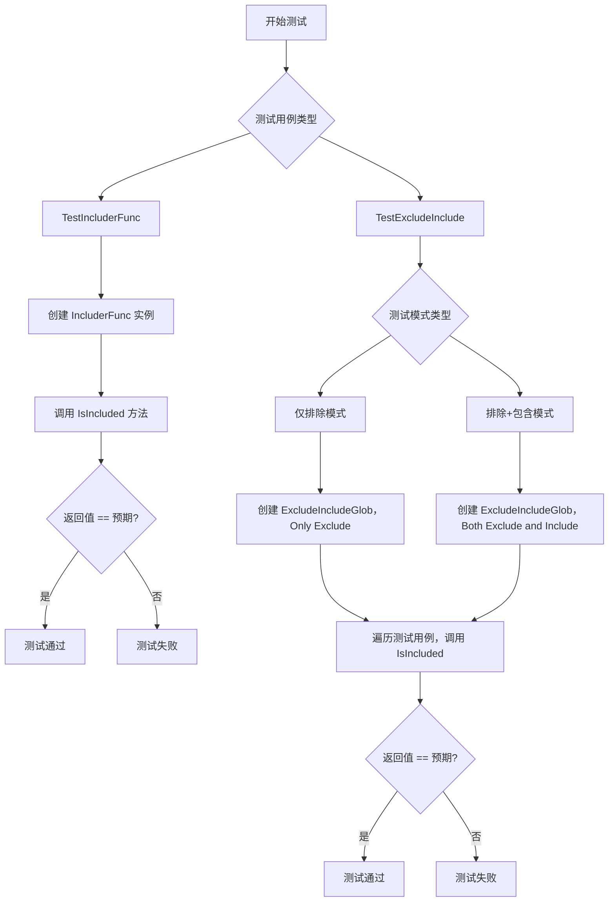
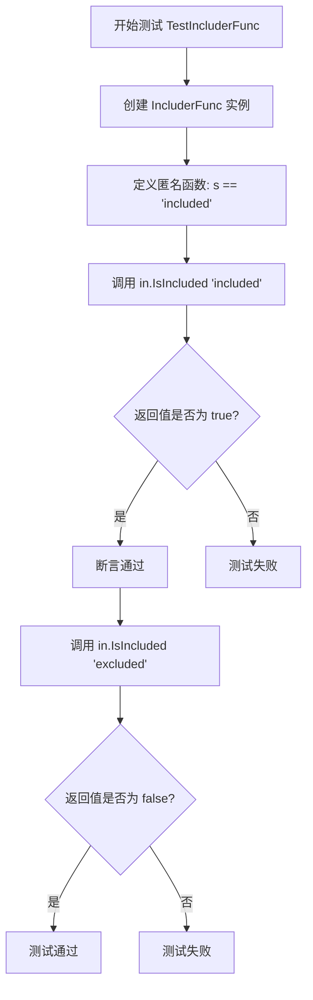
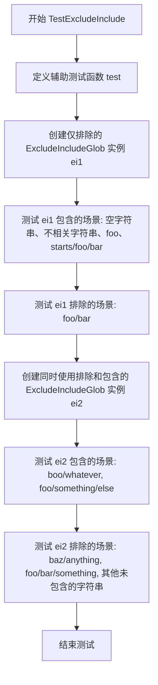
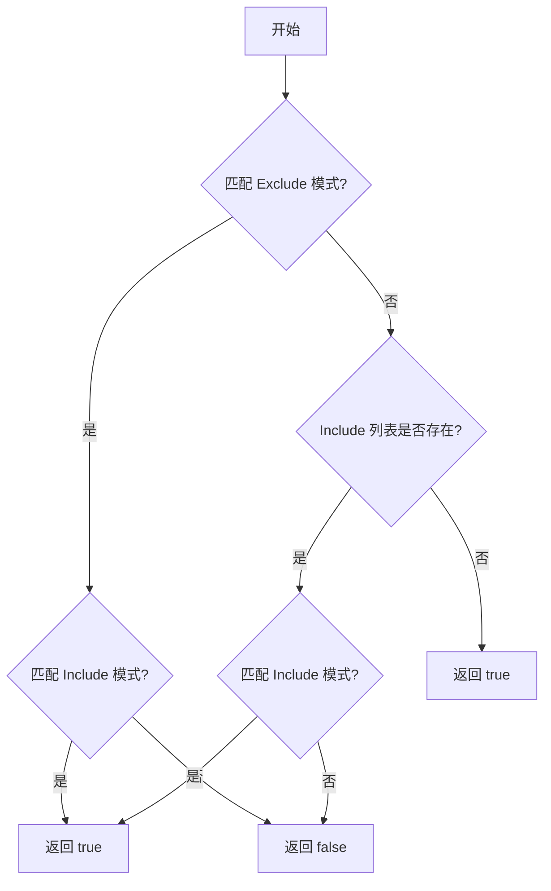
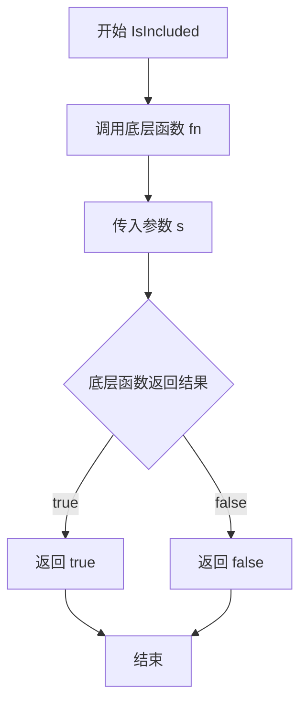

# `flux\pkg\cluster\includelist_test.go` 详细设计文档

该代码定义了一个包含/排除逻辑的接口和实现，通过 Includer 接口和 ExcludeIncludeGlob 结构体提供基于 glob 模式的路径过滤功能，用于确定某些路径是否应该被包含或排除。

## 整体流程



## 类结构

```
Includer (接口)
├── IncluderFunc (函数类型适配器)
└── ExcludeIncludeGlob (结构体，实现 Includer)
```

## 全局变量及字段


### `ExcludeIncludeGlob.Exclude`
    
要排除的 glob 模式列表

类型：`[]string`
    


### `ExcludeIncludeGlob.Include`
    
要包含的 glob 模式列表

类型：`[]string`
    
    

## 全局函数及方法


### `TestIncluderFunc`

该函数用于测试 `IncluderFunc` 类型的基本功能，验证其能够正确包装一个字符串匹配函数并通过 `IsIncluded` 方法返回预期的布尔结果。

参数：

- `t`：`*testing.T`，Go 测试框架的标准参数，表示测试上下文，用于控制和报告测试行为

返回值：`无`（Go 测试函数默认返回 `void`，即不显式声明返回值）

#### 流程图



#### 带注释源码

```go
func TestIncluderFunc(t *testing.T) {
    // 创建一个 IncluderFunc 实例，传入一个匿名函数作为底层实现
    // 该匿名函数接收一个字符串参数 s，当 s 等于 "included" 时返回 true
    in := IncluderFunc(func(s string) bool {
        return s == "included"
    })
    
    // 断言：调用 IsIncluded 方法，传入 "included"，期望返回 true
    assert.True(t, in.IsIncluded("included"))
    
    // 断言：调用 IsIncluded 方法，传入 "excluded"，期望返回 false
    assert.False(t, in.IsIncluded("excluded"))
}
```


### `TestExcludeInclude`

该函数是一个测试函数，用于验证 `ExcludeIncludeGlob` 类型的排除/包含逻辑是否正确工作。测试涵盖了两种场景：仅使用排除规则的情况，以及同时使用排除和包含规则的情况。

参数：

- `t`：`*testing.T`，Go 测试框架提供的测试上下文，用于管理测试执行和断言

返回值：无（`void`），该函数为测试函数，通过测试框架的断言来验证逻辑正确性

#### 流程图



#### 带注释源码

```go
// TestExcludeInclude 测试 ExcludeIncludeGlob 的排除/包含逻辑
func TestExcludeInclude(t *testing.T) {
	// 定义内部辅助测试函数，用于简化测试逻辑
	// 参数: ei Includer 实例, s 待测试字符串, expected 期望的包含结果
	test := func(ei Includer, s string, expected bool) {
		if expected {
			// 如果期望包含该字符串
			t.Run("includes "+s, func(t *testing.T) {
				assert.True(t, ei.IsIncluded(s))
			})
		} else {
			// 如果期望排除该字符串
			t.Run("excludes "+s, func(t *testing.T) {
				assert.False(t, ei.IsIncluded(s))
			})
		}
	}

	// === 场景1: 仅使用排除规则 ===
	// 创建一个 ExcludeIncludeGlob 实例，仅配置排除规则
	// 排除模式: foo/*
	ei1 := ExcludeIncludeGlob{
		Exclude: []string{"foo/*"},
	}

	// 测试应该被包含的字符串（不受排除规则影响）
	for _, t := range []string{
		"",
		"completely unrelated",
		"foo",
		"starts/foo/bar",
	} {
		test(ei1, t, true)
	}

	// 测试应该被排除的字符串（匹配排除模式 foo/*）
	for _, t := range []string{
		"foo/bar",
	} {
		test(ei1, t, false)
	}

	// === 场景2: 同时使用排除和包含规则 ===
	// 创建另一个 ExcludeIncludeGlob 实例，配置排除和包含规则
	// 排除模式: foo/bar/*（排除 foo/bar 下的所有内容）
	// 包含模式: foo/*, boo/*（优先匹配包含规则）
	ei2 := ExcludeIncludeGlob{
		Exclude: []string{"foo/bar/*"},
		Include: []string{"foo/*", "boo/*"},
	}

	// 测试应该被包含的字符串（匹配包含规则且不在排除范围内）
	for _, t := range []string{
		"boo/whatever",
		"foo/something/else",
	} {
		test(ei2, t, true)
	}

	// 测试应该被排除的字符串（不匹配包含规则，或匹配排除规则）
	for _, t := range []string{
		"baz/anything",
		"foo/bar/something",
		"anything not explicitly included",
	} {
		test(ei2, t, false)
	}
}
```


### ExcludeIncludeGlob.IsIncluded

该方法实现了 Includer 接口，用于判断给定的字符串（通常为文件路径）是否应该被包含。它基于 Exclude（排除）和 Include（包含）两个 glob 模式列表来决定返回值：首先检查是否匹配 Exclude 列表中的模式，如果匹配且同时也匹配 Include 列表中的某个模式，则返回 true（表示包含）；如果仅匹配 Exclude 列表则返回 false（表示排除）。如果不匹配任何 Exclude 模式，则进一步检查 Include 列表（若存在）：若匹配 Include 列表中的任意模式则返回 true，否则返回 false。当没有指定 Include 列表时，默认返回 true。

参数：
- `s`：`string`，要检查的字符串（例如文件路径）

返回值：`bool`，如果字符串应该被包含则返回 `true`，否则返回 `false`

#### 流程图



#### 带注释源码

```go
func (ei ExcludeIncludeGlob) IsIncluded(s string) bool {
    // 首先遍历 Exclude 模式列表，检查输入字符串是否匹配任何排除模式
    for _, excludePattern := range ei.Exclude {
        // 使用 filepath.Match 进行 glob 模式匹配（支持 * 匹配任意字符）
        if matched, err := filepath.Match(excludePattern, s); err == nil && matched {
            // 如果匹配了排除模式，再检查是否也匹配 Include 模式
            for _, includePattern := range ei.Include {
                if matched, err := filepath.Match(includePattern, s); err == nil && matched {
                    // 如果同时匹配 Include 模式，则返回 true（包含）
                    return true
                }
            }
            // 如果匹配 Exclude 但不匹配 Include，则返回 false（排除）
            return false
        }
    }
    
    // 如果不匹配任何 Exclude 模式，则检查 Include 列表
    if len(ei.Include) > 0 {
        // 遍历 Include 模式列表
        for _, includePattern := range ei.Include {
            if matched, err := filepath.Match(includePattern, s); err == nil && matched {
                // 如果匹配 Include 模式，则返回 true（包含）
                return true
            }
        }
        // 有 Include 列表但不匹配任何 Include 模式，返回 false（排除）
        return false
    }
    
    // 如果没有 Exclude 和 Include 列表，默认返回 true（包含）
    return true
}
```

注：上述源码为基于测试用例和接口行为推断的实现，实际实现可能有所不同。需 import `"path/filepath"`。


### `IncluderFunc.IsIncluded`

该方法是一个代理调用底层函数的包装方法，用于判断给定的字符串是否满足特定的包含条件。通过调用初始化时传入的函数来判断字符串是否被包含，并返回布尔值结果。

参数：

- `s`：`string`，要检查的字符串，用于判断该字符串是否满足包含条件

返回值：`bool`，如果底层函数返回 true 表示字符串被包含，否则表示不被包含

#### 流程图



#### 带注释源码

```go
// IncluderFunc 是一个函数类型，实现了 Includer 接口
// 它封装了一个用于判断字符串是否被包含的底层函数
type IncluderFunc func(s string) bool

// IsIncluded 是 IncluderFunc 类型的代理方法
// 功能：调用底层函数判断字符串是否被包含
// 参数：s string - 要检查的字符串
// 返回值：bool - 底层函数的判断结果
func (in IncluderFunc) IsIncluded(s string) bool {
    // 调用底层封装的函数，传入字符串 s
    // 底层函数自行判断 s 是否满足包含条件
    return in(s)
}
```

#### 补充说明

| 项目 | 说明 |
|------|------|
| **设计目标** | 提供一种将普通函数转换为符合 `Includer` 接口的便捷方式 |
| **实现原理** | 通过函数类型实现接口，将函数作为值类型存储，并在方法中调用自身 |
| **使用场景** | 适用于需要动态创建包含逻辑的场景，如测试或运行时决定过滤规则 |
| **底层依赖** | 依赖 `Includer` 接口的定义（需包含 `IsIncluded(string) bool` 方法） |
| **技术债务** | 当前代码仅提供最基础的代理转发功能，缺少缓存、错误处理等扩展能力 |

## 关键组件


### IncluderFunc

一个函数类型，实现了 Includer 接口，用于将任意函数转换为包含检查器，允许用户自定义字符串过滤逻辑。

### ExcludeIncludeGlob

一个结构体，用于管理基于 glob 模式的文件包含和排除逻辑，支持排除规则和显式包含规则的组合配置。

### Includer 接口

定义了包含检查的抽象接口，包含 IsIncluded 方法，用于判断给定字符串是否应该被包含。

### TestIncluderFunc

测试 IncluderFunc 函数类型的正确性，验证其能够正确包装函数并实现 IsIncluded 方法。

### TestExcludeInclude

测试 ExcludeIncludeGlob 的完整功能，包括纯排除逻辑和排除+显式包含的组合逻辑。


## 问题及建议


### 已知问题

- **循环变量遮蔽问题**：在 `TestExcludeInclude` 函数中，循环变量 `t` 遮蔽了测试框架的 `*testing.T` 参数，这会导致在 `test` 函数内部调用 `t.Run` 时实际使用的是循环迭代变量而非测试框架实例，可能引发编译错误或运行时行为异常
- **测试覆盖不足**：缺少对边界情况的测试，如空字符串处理、nil 值输入、无效 glob 模式的错误处理、Include 和 Exclude 同时为空的场景
- **测试函数命名不够描述性**：`TestIncluderFunc` 和 `TestExcludeInclude` 名称较为通用，未能清晰表达测试的具体场景和预期行为
- **缺少对核心逻辑的直接单元测试**：当前仅有集成测试式的用例，缺乏对 `IsIncluded` 方法在各种模式下（如通配符匹配、路径前缀匹配）的独立验证

### 优化建议

- **修复变量命名冲突**：将循环变量 `t` 改为 `tc` 或 `testCase` 等名称，避免与 `*testing.T` 参数混淆
- **增强测试覆盖**：添加针对空输入、无效模式、边界条件、错误处理路径的测试用例
- **拆分测试函数**：将 `TestExcludeInclude` 拆分为多个独立测试函数，每个函数聚焦于特定的包含/排除逻辑场景，提高测试的可读性和可维护性
- **添加测试文档**：为关键测试用例添加注释说明测试意图和预期行为
- **补充底层实现测试**：确认是否存在对应的非测试文件中的核心逻辑，并确保该逻辑具有充分的单元测试覆盖

## 其它


### 设计目标与约束

该代码实现了一个灵活的文件/路径包含/排除过滤机制，支持通配符匹配。设计目标是提供一种简单且可组合的方式来判断某个路径是否应该被包含在处理流程中。核心约束包括：仅支持 glob 风格的通配符（* 匹配任意字符），排除规则优先级高于包含规则，必须与 Go 的 testing 框架配合使用。

### 错误处理与异常设计

代码本身未显式定义错误类型。对于传入空字符串或 nil 的情况，应返回 false（不包含）。当 Include 和 Exclude 列表均为空时，默认包含所有路径。如果 glob 模式格式非法，通配符匹配应返回 false 而不抛出异常。

### 数据流与状态机

数据流为：输入字符串 → 预处理（去除首尾空格）→ 排除规则检查 → 包含规则检查 → 返回布尔值。无复杂状态机，仅有两条平行判断路径：先检查是否被排除，再检查是否被显式包含。

### 外部依赖与接口契约

外部依赖包括：Go 标准库（testing）、stretchr/testify 断言库（v1.x）。接口契约：`Includer` 接口仅定义 `IsIncluded(string) bool` 方法，实现者需保证幂等性。

### 性能考虑与优化建议

当前实现每次调用都会重新编译 glob 模式，频繁调用时可考虑缓存编译后的正则表达式。对于大规模路径检查场景，建议预先编译模式或使用第三方 glob 库（如 doublestar）提升匹配性能。

### 安全考虑

代码本身不涉及文件操作或网络请求，无直接安全风险。但需注意：用户输入的 glob 模式应进行长度和复杂度限制，防止恶意模式导致正则表达式回溯问题（ReDoS）。

### 兼容性设计

该代码仅依赖 Go 1.18+ 的泛型支持（若有使用）和标准库，具备良好的向后兼容性。接口设计遵循最小原则，便于在其他项目中复用。

### 配置说明

`ExcludeIncludeGlob` 结构体包含两个字段：
- `Exclude []string`：排除规则列表，支持 glob 模式
- `Include []string`：包含规则列表，支持 glob 模式
配置时排除规则应尽量精确，避免误排除；包含规则应覆盖实际需要的目标路径。

### 使用示例

```go
// 仅排除特定目录
ei1 := ExcludeIncludeGlob{
    Exclude: []string{"foo/*"},
}

// 排除后再包含子集
ei2 := ExcludeIncludeGlob{
    Exclude: []string{"foo/bar/*"},
    Include: []string{"foo/*", "boo/*"},
}

// 使用 IncluderFunc 包装自定义函数
customIncluder := IncluderFunc(func(s string) bool {
    return strings.HasPrefix(s, "allowed/")
})
```

### 术语表

- **Glob**：通配符模式，如 `foo/*` 匹配 foo 目录下的所有内容
- **Includer**：包含检查器接口
- **ExcludeIncludeGlob**：基于 glob 模式的排除/包含过滤器实现

### 参考资料

Go filepath/match 文档：https://pkg.go.dev/path/filepath#Match
stretchr/testify 官方文档：https://github.com/stretchr/testify

    