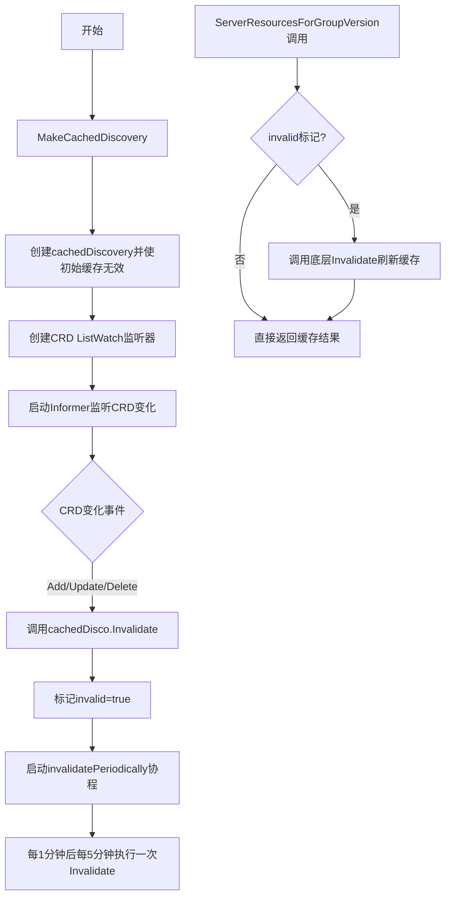
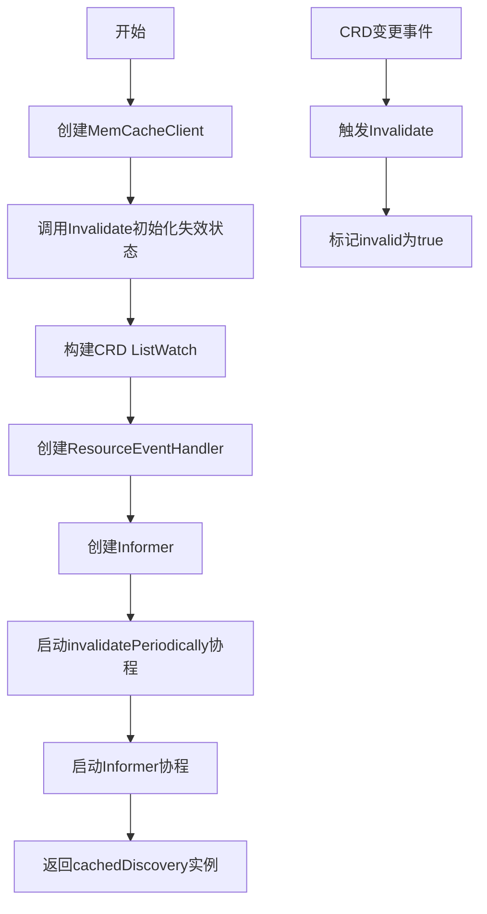
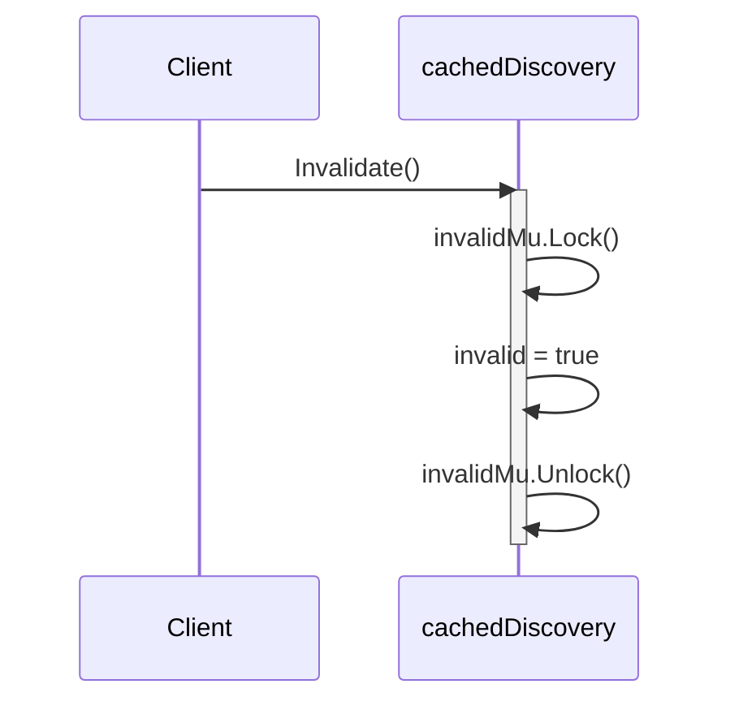
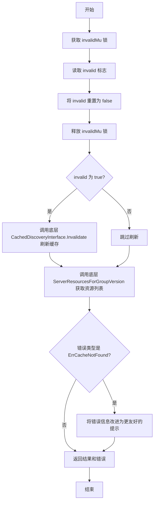
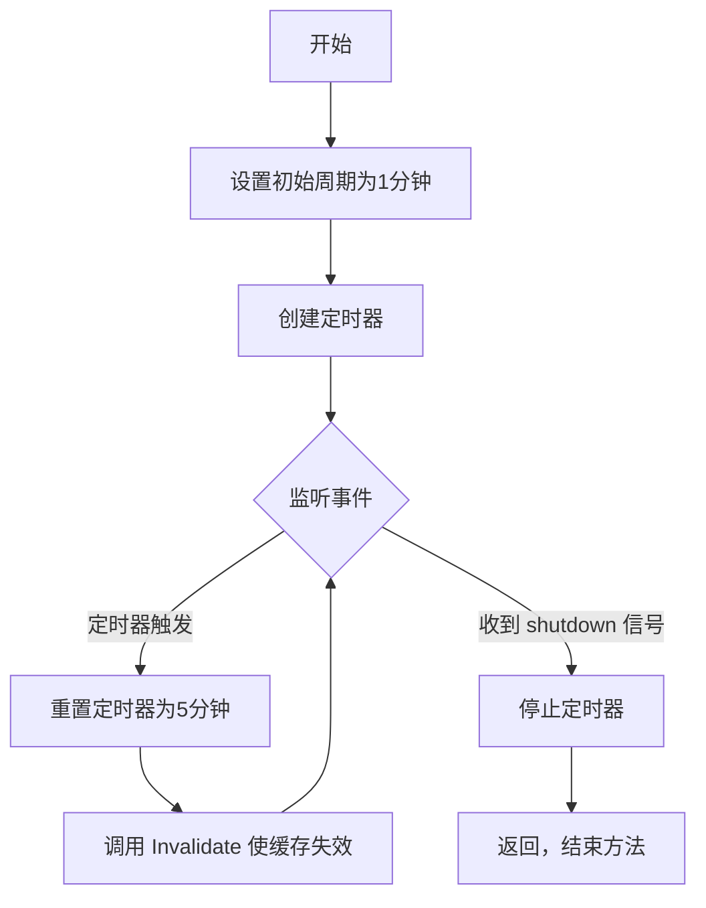

# `flux\pkg\cluster\kubernetes\cached_disco.go` 详细设计文档

该代码实现了一个具有智能缓存失效机制的Kubernetes Discovery客户端，通过监听CRD（自定义资源定义）的变化来自动使缓存失效，并在指定周期后重新刷新API资源缓存，从而保证客户端获取到最新的API资源信息。

## 整体流程



## 类结构

```
cachedDiscovery (实现CachedDiscoveryInterface)
```

## 全局变量及字段


### `cachedDiscovery.CachedDiscoveryInterface`
    
底层缓存Discovery接口

类型：`discovery.CachedDiscoveryInterface`
    


### `cachedDiscovery.invalidMu`
    
保护invalid字段的互斥锁

类型：`sync.Mutex`
    


### `cachedDiscovery.invalid`
    
缓存是否失效的标记

类型：`bool`
    
    

## 全局函数及方法


### MakeCachedDiscovery

创建一个带CRD监听功能的缓存Discovery客户端，通过监听Kubernetes自定义资源定义（CRD）的变化自动失效缓存，确保系统能够及时感知API资源的变化。

参数：

- `d`：`discovery.DiscoveryInterface`，底层Discovery接口，用于获取集群API资源信息
- `c`：`crd.Interface`，CRD客户端接口，用于监听CRD资源的变化
- `shutdown`：`<-chan struct{}`，关闭信号通道，用于优雅关闭后台协程

返回值：`discovery.CachedDiscoveryInterface`，缓存的Discovery接口，内部会自动监听CRD变化并失效缓存

#### 流程图



#### 带注释源码

```go
// MakeCachedDiscovery 构造一个CachedDiscoveryInterface
// 当CRD集合发生变化时会被失效。设计理念是：
// 系统中API资源变化的唯一途径是CRD的添加、更新或删除。
func MakeCachedDiscovery(d discovery.DiscoveryInterface, c crd.Interface, shutdown <-chan struct{}) discovery.CachedDiscoveryInterface {
	// 1. 创建内存缓存客户端，包装底层Discovery接口
	cachedDisco := &cachedDiscovery{CachedDiscoveryInterface: memory.NewMemCacheClient(d)}
	
	// 2. 初始失效缓存（因为缓存为空，必须视为无效）
	// 即使零值已经是false，但为了安全起见显式调用
	cachedDisco.Invalidate()

	// 3. 创建CRD客户端和ListWatch用于监听CRD变化
	crdClient := c.ApiextensionsV1().CustomResourceDefinitions()
	lw := &toolscache.ListWatch{
		// ListFunc: 初始化时获取所有CRD
		ListFunc: func(options metav1.ListOptions) (runtime.Object, error) {
			return crdClient.List(context.TODO(), options)
		},
		// WatchFunc: 监听CRD的变化事件
		WatchFunc: func(options metav1.ListOptions) (watch.Interface, error) {
			return crdClient.Watch(context.TODO(), options)
		},
	}
	
	// 4. 创建资源事件处理器，处理CRD的添加、更新、删除事件
	handle := toolscache.ResourceEventHandlerFuncs{
		// 添加CRD时失效缓存
		AddFunc: func(_ interface{}) {
			cachedDisco.Invalidate()
		},
		// 更新CRD时失效缓存
		UpdateFunc: func(_, _ interface{}) {
			cachedDisco.Invalidate()
		},
		// 删除CRD时失效缓存
		DeleteFunc: func(_ interface{}) {
			cachedDisco.Invalidate()
		},
	}
	
	// 5. 创建Informer监听CRD变化
	_, controller := toolscache.NewInformer(lw, &crdv1.CustomResourceDefinition{}, 0, handle)
	
	// 6. 启动后台协程：定期失效缓存 + 运行Informer
	go cachedDisco.invalidatePeriodically(shutdown)
	go controller.Run(shutdown)
	
	return cachedDisco
}
```


### `cachedDiscovery.Invalidate()`

标记缓存为失效状态。通过互斥锁保证线程安全，将 `invalid` 标志设置为 `true`，以便在后续读取缓存时触发缓存刷新。

参数：
- 无

返回值：`无`（该方法没有返回值）

#### 流程图



#### 带注释源码

```go
// Invalidate 将缓存标记为无效状态。
// 使用互斥锁确保在多线程环境下的线程安全性。
// 当 invalid 被设置为 true 后，后续调用 ServerResourcesForGroupVersion 
// 等方法时会检测到该标志并触发缓存刷新。
func (d *cachedDiscovery) Invalidate() {
	d.invalidMu.Lock()    // 获取互斥锁，保证对 invalid 字段操作的原子性
	d.invalid = true      // 将 invalid 标志设置为 true，表示缓存已失效
	d.invalidMu.Unlock()  // 释放互斥锁
}
```


### `cachedDiscovery.ServerResourcesForGroupVersion`

获取指定组版本的 API 资源列表，处理缓存失效逻辑。当检测到缓存已失效时，先调用底层缓存的 Invalidate 方法刷新缓存，然后获取资源列表。如果缓存中不存在指定组版本的资源信息，则返回自定义改进的错误提示。

#### 参数

- `groupVersion`：`string`，要查询的 Kubernetes API 组版本（例如 "v1"、"apps/v1" 等）

#### 返回值

- `*metav1.APIResourceList`，指定组版本下的 API 资源列表，包含资源名称、命名空间支持等信息
- `error`，执行过程中的错误信息，如果缓存未命中会返回改进过的错误描述

#### 流程图



#### 带注释源码

```go
// ServerResourcesForGroupVersion 获取指定组版本的 API 资源列表
// 这是 namespacer 组件使用的方法，因此需要在此处检查缓存是否已失效
// 对于更通用的 cachedDiscovery 实现，应该对所有方法都进行缓存失效检查
// （除非该方法完全基于其他方法实现）
func (d *cachedDiscovery) ServerResourcesForGroupVersion(groupVersion string) (*metav1.APIResourceList, error) {
	// ----------- 缓存失效检查阶段 -----------
	// 获取锁以安全地读写 invalid 标志
	d.invalidMu.Lock()
	// 读取当前的 invalid 状态
	invalid := d.invalid
	// 重置 invalid 标志为 false，表示即将处理本次失效
	d.invalid = false
	// 释放锁
	d.invalidMu.Unlock()

	// 如果检测到缓存已失效，调用底层缓存的 Invalidate 方法刷新缓存
	if invalid {
		d.CachedDiscoveryInterface.Invalidate()
	}

	// ----------- 获取资源列表阶段 -----------
	// 调用底层 CachedDiscoveryInterface 获取指定组版本的资源列表
	result, err := d.CachedDiscoveryInterface.ServerResourcesForGroupVersion(groupVersion)

	// ----------- 错误处理阶段 -----------
	// 如果缓存中未找到该组版本的资源信息，改进错误提示
	// 原始错误来自 memcacheclient，不够友好
	if err == memory.ErrCacheNotFound {
		// 改进错误信息：告知用户缓存每 5 分钟刷新一次
		err = fmt.Errorf("server resources for %s not found in cache; cache refreshes every 5 minutes", groupVersion)
	}

	// 返回结果和可能的错误
	return result, err
}
```


### `cachedDiscovery.invalidatePeriodically`

该方法实现定时自动失效缓存的逻辑，通过定时器定期调用 `Invalidate()` 方法使缓存失效。初始周期设为1分钟（因为新创建的集群资源定义可能尚未完成/稳定），后续周期为5分钟；同时监听 shutdown 通道以实现优雅停止。

参数：

- `shutdown`：`<-chan struct{}`，只读通道，用于接收系统关闭信号以优雅停止定时器

返回值：`无`（该方法没有返回值）

#### 流程图



#### 带注释源码

```go
// invalidatePeriodically 定期使缓存失效
// 参数 shutdown 是一个只读通道，用于接收关闭信号以优雅停止定时器
func (d *cachedDiscovery) invalidatePeriodically(shutdown <-chan struct{}) {
	// 初始周期设为1分钟，因为新创建的集群资源定义可能尚未完成/稳定
	initialPeriodDuration := 1 * time.Minute
	// 后续周期设为5分钟（初始周期的5倍）
	subsequentPeriodsDuration := 5 * initialPeriodDuration
	// 创建初始周期为1分钟的定时器
	timer := time.NewTimer(initialPeriodDuration)
	// 进入无限循环，持续监听定时器或关闭信号
	for {
		select {
		case <-timer.C:
			// 定时器触发后，重置为后续周期（5分钟）
			timer.Reset(subsequentPeriodsDuration)
			// 调用 Invalidate 使缓存失效
			d.Invalidate()
		case <-shutdown:
			// 收到关闭信号，停止定时器并退出
			timer.Stop()
			return
		}
	}
}
```

## 关键组件


### cachedDiscovery 结构体

缓存的Discovery客户端封装结构体，包含对CachedDiscoveryInterface的引用和失效状态跟踪。

### Invalidate 方法

标记缓存为失效状态，通过互斥锁保证线程安全，将invalid标志设置为true。

### ServerResourcesForGroupVersion 方法

检查缓存是否失效的核心方法，如果失效则调用底层接口刷新缓存，并改进错误信息。

### MakeCachedDiscovery 函数

工厂函数，构造一个支持CRD变更自动失效的CachedDiscoveryInterface，启动 informer 监听CRD变化和定期失效任务。

### invalidatePeriodically 函数

后台goroutine，定期失效缓存。首次失效间隔为1分钟，后续为5分钟，确保新创建的集群能够快速获取最新的资源定义。

### 关键组件总结

该代码包含三个核心策略：
1. **张量索引与惰性加载** - 通过invalid标志延迟真正的缓存刷新，只在读取时检查并刷新
2. **反量化支持** - 改进错误信息，将底层缓存未命中的错误转换为更友好的提示
3. **量化策略** - 定期失效机制（1分钟初始，5分钟周期）与CRD变更触发失效相结合


## 问题及建议


### 已知问题

- **context.TODO()的使用**：在ListWatch的ListFunc和WatchFunc中使用context.TODO()不是最佳实践，应使用传入的shutdown context或明确的context.Background()，因为无法通过context控制超时和取消
- **controller未接收shutdown信号**：toolscache.NewInformer创建的controller没有传入shutdown channel，可能导致controller无法优雅停止
- **定时刷新逻辑与设计意图冲突**：注释表明"only refresh values when we need to read the cached values"，但invalidatePeriodically会定期强制使缓存失效，违背了按需刷新的设计目标
- **错误处理不够全面**：在ServerResourcesForGroupVersion中只处理了ErrCacheNotFound，其他错误直接透传，可能丢失有用的调试信息
- **缺少日志记录**：没有任何日志输出，无法追踪缓存失效时机、刷新频率和潜在问题
- **硬编码的时间常量**：initialPeriodDuration和subsequentPeriodsDuration硬编码在函数内，无法根据不同场景配置
- **潜在的goroutine泄漏**：NewInformer返回的controller没有提供停止方法，且未保存stop channel，controller可能长期运行
- **nil指针风险**：在handle的AddFunc/UpdateFunc/DeleteFunc中未对interface{}参数进行类型断言检查，若传入错误类型可能导致panic

### 优化建议

- 使用sync.RWMutex替代sync.Mutex，提高读多写少场景下的并发性能
- 将硬编码的时间常量提取为配置参数或使用选项模式
- 为ListWatch提供可取消的context，支持优雅关闭和超时控制
- 在invalidatePeriodically中仅做定期刷新，而非使缓存无效，真正按需刷新
- 添加基本的日志记录，使用klog或zap等日志框架记录缓存操作
- 为controller保存并返回stop channel，支持外部调用停止
- 添加错误重试机制和更友好的错误消息
- 考虑实现完整的CachedDiscoveryInterface装饰器，确保所有方法都被正确处理

## 其它


### 设计目标与约束

本模块的设计目标是创建一个能够自动感知CRD变化的Kubernetes Discovery缓存客户端，解决传统MemCacheDiscovery无法及时感知CRD变更导致API资源列表过期的问题。设计约束包括：必须依赖k8s.io/client-go的discovery和cache包；需要使用CRD API监听资源变化；必须支持优雅关闭以避免资源泄漏；缓存失效策略采用延迟失效（读时失效）而非立即失效，以减少不必要的API调用。

### 错误处理与异常设计

代码中的错误处理主要体现在ServerResourcesForGroupVersion方法中，当缓存未命中时（memory.ErrCacheNotFound），会将原始错误转换为更友好的错误信息，明确告知调用者缓存刷新周期为5分钟。异常设计方面，invalidatePeriodically方法通过select语句监听shutdown channel，确保收到关闭信号时立即停止timer并返回，避免goroutine泄漏。此外，所有Kubernetes API调用均使用context.TODO()，生产环境建议传入带超时的context以支持更好的超时控制。

### 数据流与状态机

数据流主要包含三条路径：1）CRD变更触发路径：CRD发生Add/Update/Delete事件 → 调用cachedDisco.Invalidate() → 设置invalid标志为true；2）读操作触发路径：调用ServerResourcesForGroupVersion → 检查invalid标志 → 若为true则先调用底层Invalidate()刷新缓存 → 返回结果；3）定期刷新路径：timer到期 → 调用Invalidate() → 重置timer周期。状态机方面，缓存存在两种状态：invalid（需要刷新）和valid（可使用），初始状态为invalid。

### 外部依赖与接口契约

本模块依赖以下外部包和接口：discovery.CachedDiscoveryInterface（缓存Discovery接口定义，由memory.NewMemCacheClient实现）；crd.Interface（CRD客户端集，用于创建CRD客户端）；toolscache.ListWatch和toolscache.NewInformer（Kubernetes标准的List/Watch机制和Informer实现）；metav1.APIResourceList（API资源列表返回类型）。对外提供的接口为MakeCachedDiscovery函数，接收discovery.DiscoveryInterface、crd.Interface和shutdown channel，返回discovery.CachedDiscoveryInterface。

### 安全性考虑

当前代码没有实现身份验证和授权机制，假设在已配置好Kubernetes客户端凭证的环境中使用。安全性优化方向包括：1）对CRD ListWatch操作应考虑使用带field selector的过滤，仅关注特定namespace或特定CRD；2）定期刷新机制应设置合理的超时，避免长时间阻塞；3）应使用context而非context.TODO()以支持调用方的取消和超时控制。

### 性能要求与基准

性能考量包括：1）采用延迟失效策略，避免每次CRD变更都触发缓存刷新，仅在下次读取时刷新，降低API服务器压力；2）定期刷新使用初始1分钟、后续5分钟的策略，平衡及时性和资源消耗；3）使用sync.Mutex保护invalid标志的读写，确保并发安全。基准测试应关注：CRD变更后首次调用的延迟、缓存命中时的响应时间、定期刷新带来的额外负载。

### 配置说明

本模块的可配置项包括：initialPeriodDuration（初始刷新周期，代码中硬编码为1分钟）、subsequentPeriodsDuration（后续刷新周期，代码中硬编码为5分钟）。如需暴露为配置项，建议通过函数参数或结构体字段传入。当前实现不支持配置化，这是潜在的技术债务。

### 监控与可观测性

当前代码缺少监控指标暴露，建议添加以下可观测性能力：1）缓存失效次数计数器（区分CRD触发和定期触发）；2）缓存命中/未命中指标；3）底层Discovery API调用延迟直方图；4）定期刷新goroutine的运行状态。可通过Prometheus指标或Kubernetes事件进行暴露。

### 并发安全与线程安全性

代码中的并发安全主要依靠sync.Mutex保护invalid标志的读写。ServerResourcesForGroupVersion方法采用先解锁再调用底层接口的策略，避免在持有锁的情况下进行潜在的慢速I/O操作。invalidatePeriodically方法使用time.Timer而非time.After，避免每次创建新的timer导致的资源分配开销。所有公开方法均未阻塞调用方，符合非阻塞设计原则。

### 版本兼容性与迁移考虑

代码依赖k8s.io/client-go v8.0.0版本的接口，需确保使用兼容版本。CachedDiscoveryInterface接口在不同client-go版本间可能存在差异，建议在依赖管理中锁定版本。迁移考虑：未来可考虑将timer配置参数化，支持自定义刷新周期；可添加接口级别的mock以便单元测试；可考虑使用context替代shutdown channel以支持更优雅的退出机制。


    