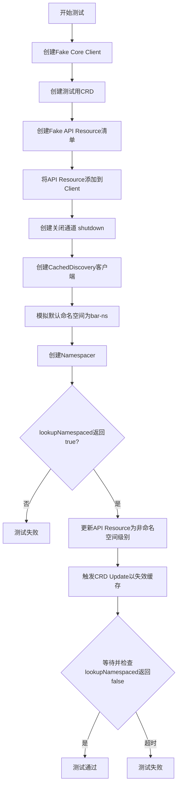
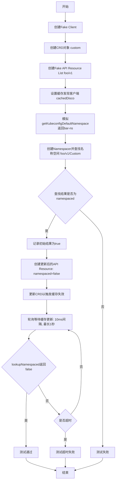
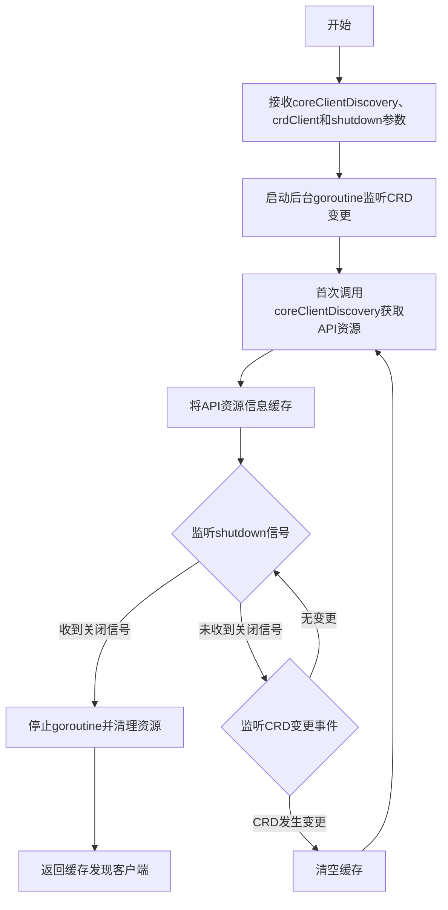
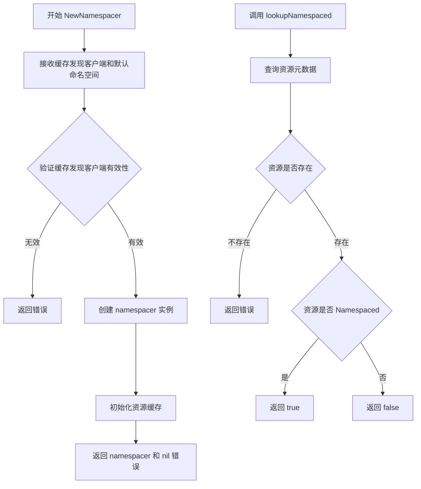
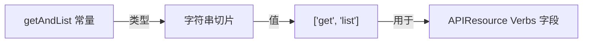

# `flux\pkg\cluster\kubernetes\cached_disco_test.go` 详细设计文档

这是一个Kubernetes缓存发现机制的测试文件，通过模拟CRD（自定义资源定义）的更新，验证缓存发现客户端能够正确重新加载API资源，并在CRD变化时准确判断资源是否为命名空间级别。

## 整体流程



## 类结构

```
Go测试文件 (无类定义)
└── TestCachedDiscovery (测试函数)
    ├── MakeCachedDiscovery (外部依赖)
    ├── NewNamespacer (外部依赖)
    └── Namespacer.lookupNamespaced (外部依赖)
```

## 全局变量及字段


### `coreClient`
    
Kubernetes Fake客户端，用于模拟API服务器

类型：`*fake.Clientset`
    


### `myCRD`
    
测试用的自定义资源定义对象

类型：`*crdv1.CustomResourceDefinition`
    


### `crdClient`
    
CRD专用Fake客户端

类型：`*fake.Clientset`
    


### `myAPI`
    
模拟的API资源列表，包含foo/v1组的Custom资源

类型：`*metav1.APIResourceList`
    


### `apiResources`
    
原始API资源列表备份

类型：`[]metav1.APIResource`
    


### `shutdown`
    
用于控制缓存发现客户端关闭的通道

类型：`chan struct{}`
    


### `cachedDisco`
    
缓存发现客户端实例

类型：`interface{}`
    


### `saved`
    
保存原始的getKubeconfigDefaultNamespace函数引用

类型：`func() (string, error)`
    


### `getKubeconfigDefaultNamespace`
    
获取Kubeconfig默认命名空间的全局函数

类型：`func() (string, error)`
    


### `namespacer`
    
命名空间解析器实例

类型：`interface{}`
    


### `namespaced`
    
资源是否为命名空间级别的判定结果

类型：`bool`
    


### `updatedAPI`
    
更新后的API资源列表（Kind变为非命名空间）

类型：`*metav1.APIResourceList`
    


### `c`
    
1秒超时定时器通道

类型：`<-chan time.Time`
    


    

## 全局函数及方法


### `TestCachedDiscovery`

主测试函数，验证缓存发现机制在CRD（Custom Resource Definition）更新时的正确性，确保当CRD被更新时，缓存的API资源能够正确失效并重新加载。

参数：

- `t`：`*testing.T`，Go测试框架的标准参数，表示测试对象，用于报告测试失败和错误

返回值：`无`（Go测试函数返回void）

#### 流程图



#### 带注释源码

```go
func TestCachedDiscovery(t *testing.T) {
	// 第一步：创建fake client用于模拟Kubernetes API服务器
	coreClient := makeFakeClient()

	// 第二步：创建自定义资源定义(CRD)对象
	myCRD := &crdv1.CustomResourceDefinition{
		ObjectMeta: metav1.ObjectMeta{
			Name: "custom", // CRD名称为"custom"
		},
	}
	// 使用fake客户端创建CRD
	crdClient := crdfake.NewSimpleClientset(myCRD)

	// 第三步：定义fake API资源列表，模拟foo/v1组的API资源
	myAPI := &metav1.APIResourceList{
		GroupVersion: "foo/v1", // API组版本
		APIResources: []metav1.APIResource{
			// 定义名为"customs"的资源，SingularName为"custom"，类型为Custom，verbs为getAndList
			{Name: "customs", SingularName: "custom", Namespaced: true, Kind: "Custom", Verbs: getAndList},
		},
	}

	// 第四步：将fake API资源添加到fake client的资源列表中
	apiResources := coreClient.Fake.Resources
	coreClient.Fake.Resources = append(apiResources, myAPI)

	// 第五步：创建关闭通道并设置defer确保资源释放
	shutdown := make(chan struct{})
	defer close(shutdown)

	// 第六步：创建缓存发现客户端，传入core client的discovery、crd client和关闭通道
	cachedDisco := MakeCachedDiscovery(coreClient.Discovery(), crdClient, shutdown)

	// 第七步：保存原始的getKubeconfigDefaultNamespace函数并替换为返回"bar-ns"的mock函数
	saved := getKubeconfigDefaultNamespace
	getKubeconfigDefaultNamespace = func() (string, error) { return "bar-ns", nil }
	defer func() { getKubeconfigDefaultNamespace = saved }() // 测试结束后恢复原始函数

	// 第八步：使用缓存发现客户端创建Namespacer，传入空字符串作为命名空间前缀
	namespacer, err := NewNamespacer(cachedDisco, "")
	if err != nil {
		t.Fatal(err) // 如果创建失败则致命错误
	}

	// 第九步：执行首次查找，验证初始状态下foo/v1的Custom资源是namespaced的
	namespaced, err := namespacer.lookupNamespaced("foo/v1", "Custom", nil)
	if err != nil {
		t.Fatal(err)
	}
	if !namespaced {
		t.Error("got false from lookupNamespaced, expecting true") // 期望初始结果为true
	}

	// 第十步：创建更新后的API资源列表，将Namespaced改为false（关键变化）
	// 注意：不能直接修改原对象，否则会同时改变所有人的记录，测试就失去意义
	updatedAPI := &metav1.APIResourceList{
		GroupVersion: "foo/v1",
		APIResources: []metav1.APIResource{
			// 关键变化：Namespaced从true改为false
			{Name: "customs", SingularName: "custom", Namespaced: false /* <-- changed */, Kind: "Custom", Verbs: getAndList},
		},
	}
	coreClient.Fake.Resources = append(apiResources, updatedAPI)

	// 第十一步：更新CRD以触发缓存失效机制
	// 在真实集群中，apiextensions server会反映CRD变化到API资源
	_, err = crdClient.ApiextensionsV1().CustomResourceDefinitions().Update(context.TODO(), myCRD, metav1.UpdateOptions{})
	if err != nil {
		t.Fatal(err)
	}

	// 第十二步：等待更新"生效"（通过轮询方式等待缓存刷新）
	c := time.After(time.Second) // 设置1秒超时
loop:
	for {
		select {
		default:
			// 执行名称空间查找
			namespaced, err = namespacer.lookupNamespaced("foo/v1", "Custom", nil)
			assert.NoError(t, err)
			// 当发现namespaced变为false时，说明缓存已更新，退出循环
			if !namespaced {
				break loop
			}
			time.Sleep(10 * time.Millisecond) // 每次轮询间隔10ms
		case <-c:
			t.Fatal("timed out waiting for Update to happen") // 超时则测试失败
		}
	}
}
```


### `MakeCachedDiscovery`

根据测试代码分析，该函数用于创建一个缓存的Kubernetes发现客户端，该客户端能够缓存API资源信息并在CRD（自定义资源定义）发生变化时自动刷新缓存。

参数：

- `coreClientDiscovery`：`discovery.DiscoveryInterface`，core client的发现接口，用于获取Kubernetes API资源列表
- `crdClient`：`apiextensionsv1.ApiextensionsV1Interface`，CRD客户端，用于监听CRD的创建、更新和删除事件以触发缓存刷新
- `shutdown`：`<-chan struct{}`，关闭信号通道，当通道关闭时，缓存刷新goroutine将停止运行

返回值：`discovery.DiscoveryInterface`，返回缓存后的发现客户端，支持在CRD变更时自动失效并重新加载缓存

#### 流程图



#### 带注释源码

```go
// 注意：以下是根据测试代码推断的函数签名和实现逻辑
// 实际实现可能在kubernetes包的discovery相关文件中

// MakeCachedDiscovery 创建一个带有缓存功能的发现客户端
// 参数：
//   - coreClientDiscovery: 核心客户端的发现接口，用于获取API资源
//   - crdClient: CRD客户端，用于监听CRD变更事件
//   - shutdown: 通道，用于接收关闭信号
//
// 返回值：
//   - discovery.DiscoveryInterface: 缓存后的发现客户端
func MakeCachedDiscovery(
    coreClientDiscovery discovery.DiscoveryInterface,
    crdClient apiextensionsv1.ApiextensionsV1Interface,
    shutdown <-chan struct{},
) discovery.DiscoveryInterface {
    // 1. 创建缓存存储结构，用于存储API资源列表
    // 2. 启动后台goroutine，监听CRD的Update/Delete事件
    // 3. 当CRD变更时，通过invalidate通道触发缓存失效
    // 4. 首次访问时从coreClientDiscovery获取数据并缓存
    // 5. 返回包装后的缓存发现客户端
    
    // 示例调用：
    // cachedDisco := MakeCachedDiscovery(coreClient.Discovery(), crdClient, shutdown)
    
    return cachedDiscoveryClient
}
```

#### 补充说明

根据测试代码分析，该函数的设计目标包括：

1. **缓存机制**：首次调用时从真实的Discovery客户端获取数据，后续请求直接返回缓存数据以提高性能
2. **自动失效**：当CRD客户端检测到CRD资源发生Update或Delete操作时，自动清空缓存并触发重新加载
3. **生命周期管理**：通过shutdown通道控制后台goroutine的生命周期，确保资源正确释放
4. **测试验证**：测试用例验证了CRD更新后，API资源的namespaced属性能够正确反映最新状态

该函数可能位于`kubernetes`包的discovery相关实现文件中。


### `NewNamespacer`

该外部函数根据缓存发现客户端创建命名空间解析器，用于判断 Kubernetes 资源是否为命名空间级别。函数接收缓存发现客户端和默认命名空间作为参数，返回命名空间解析器实例和可能的错误。

参数：

- `cachedDisco`：`cacheDiscoveryClient`，缓存发现客户端，用于查询 Kubernetes API 资源的元数据信息
- `defaultNamespace`：`string`，默认命名空间，当无法自动判断时使用的命名空间

返回值：

- `*namespacer`，命名空间解析器实例，用于判断资源是否为命名空间级别
- `error`，创建过程中的错误信息

#### 流程图



#### 带注释源码

```go
// NewNamespacer 根据缓存发现客户端创建命名空间解析器
// 参数 cachedDisco: 缓存发现客户端，用于获取 API 资源信息
// 参数 defaultNamespace: 默认命名空间
// 返回: 命名空间解析器实例和错误信息
namespacer, err := NewNamespacer(cachedDisco, "")
if err != nil {
    t.Fatal(err)
}

// 使用创建的 namespacer 查询资源是否为命名空间级别
// 参数: groupVersion="foo/v1", kind="Custom", scale=null
namespaced, err := namespacer.lookupNamespaced("foo/v1", "Custom", nil)
if err != nil {
    t.Fatal(err)
}
if !namespaced {
    t.Error("got false from lookupNamespaced, expecting true")
}
```

#### 关键组件信息

| 组件名称 | 一句话描述 |
|---------|-----------|
| `cachedDisco` | 缓存发现客户端，封装了 Kubernetes API 资源的缓存查询能力 |
| `MakeCachedDiscovery` | 创建缓存发现客户端的工厂函数 |
| `lookupNamespaced` | 命名空间解析器的核心方法，用于判断指定资源是否为命名空间级别 |
| `crdClient` | CRD 客户端，用于监听自定义资源定义的变更以触发缓存刷新 |

#### 潜在的技术债务或优化空间

1. **错误处理不完善**：代码中使用 `context.TODO()` 而非正式的 context，应该使用测试传入的 context
2. **轮询等待机制**：使用 `time.Sleep` 和 select 循环等待缓存更新，这种方式不够优雅，可以考虑使用 channel 或条件变量
3. **硬编码超时时间**：等待 CRD 更新生效使用了 1 秒硬编码超时，应该提取为配置参数
4. **测试隔离性**：修改了全局变量 `getKubeconfigDefaultNamespace`，虽然有 defer 恢复，但增加了测试耦合

#### 其它项目

**设计目标与约束**：
- 支持动态判断 Kubernetes 资源是否为命名空间级别
- 通过监听 CRD 变更自动刷新缓存的资源信息
- 提供缓存机制以减少 API server 查询压力

**错误处理与异常设计**：
- 缓存发现客户端无效时返回错误
- 资源不存在时返回错误
- 缓存刷新失败时返回错误

**数据流与状态机**：
1. 初始状态：加载 API 资源列表到缓存
2. CRD 更新事件触发缓存失效
3. 重新查询 API 资源获取最新命名空间信息

**外部依赖与接口契约**：
- 依赖 Kubernetes Discovery 客户端接口
- 依赖 CRD 客户端接口用于监听变更
- 返回的 namespacer 需要实现 lookupNamespaced 方法


### `getAndList`

描述：`getAndList` 是一个外部常量（或包级变量），定义了 Kubernetes API 资源的动词操作，包含 "get" 和 "list" 两种操作，用于指定自定义资源（CRD）支持的 API 方法。

参数：
- 无

返回值：
- 类型：`[]string`
- 描述：返回包含 "get" 和 "list" 的字符串切片，表示 API 资源支持的动词集合。

#### 流程图



#### 带注释源码

由于 `getAndList` 的定义未在给定代码片段中提供，以下为代码中使用该常量的上下文源码：

```go
// 在测试函数 TestCachedDiscovery 中，定义了一个模拟的 API 资源列表
myAPI := &metav1.APIResourceList{
    GroupVersion: "foo/v1",
    APIResources: []metav1.APIResource{
        // 使用 getAndList 常量设置资源的动词操作
        {Name: "customs", SingularName: "custom", Namespaced: true, Kind: "Custom", Verbs: getAndList},
    },
}
```

注意：`getAndList` 应在包的其他位置定义，典型定义为：

```go
// getAndList 定义了 API 资源支持的动词操作
var getAndList = []string{"get", "list"}
```

## 关键组件


### CachedDiscovery（缓存发现客户端）

缓存 Kubernetes API 发现信息，通过监听 CRD 变化来自动失效缓存，确保获取最新的 API 资源信息。

### Namespacer（命名空间判断器）

根据 API 资源的 GroupVersion、Kind 和命名空间信息，判断自定义资源是否需要命名空间作用域。

### CRD 变更检测机制

通过监听 CRD 的 Update 操作触发缓存失效，实现对 API 资源变化的响应式更新。

### Fake Kubernetes Clients（测试用假客户端）

模拟 Kubernetes API 服务器行为，用于隔离测试环境，无需真实集群即可验证发现缓存逻辑。

### 轮询等待机制

使用 select 语句和 time.After 实现超时控制的轮询逻辑，等待缓存刷新完成。


## 问题及建议


### 已知问题

- **测试逻辑缺陷**：`coreClient.Fake.Resources = append(apiResources, updatedAPI)` 将两个相同 `GroupVersion` ("foo/v1") 的资源追加到列表中，可能导致资源列表中有重复条目，测试行为不可预测
- **时序依赖的轮询方式**：使用 `time.Sleep` + for 循环轮询等待异步更新，不是可靠的测试方式，容易导致 flaky tests，且超时时间较长（1秒）
- **不完整的测试覆盖**：代码注释提到要测试 CRD 更新或删除两种情况，但实际只测试了更新场景，未测试删除场景
- **硬编码值**：超时时间（1秒）、轮询间隔（10毫秒）、命名空间（"bar-ns"）均硬编码，降低了测试的可配置性
- **测试隔离性问题**：通过修改全局变量 `getKubeconfigDefaultNamespace` 进行测试，虽然有 defer 恢复，但这种模式容易在测试失败时留下全局状态
- **Fake 客户端内部结构依赖**：直接操作 `coreClient.Fake.Resources` 依赖 fake 客户端的内部实现细节，fake 客户端升级可能导致测试失败

### 优化建议

- **改进资源更新逻辑**：在更新 fake 资源时，应先移除旧资源或直接替换，而非简单 append，避免重复的 GroupVersion
- **使用 channel 或条件变量替代轮询**：利用 Go 的并发原语等待事件，或使用专门的测试辅助库（如 testify 的 Eventually）来优雅处理异步等待
- **补充删除场景测试**：按照注释意图添加 CRD 删除后的缓存失效测试
- **提取超时配置为常量或变量**：将硬编码的超时和间隔时间提取为测试配置参数，提高测试灵活性
- **考虑使用 interface 替代全局函数依赖**：将 `getKubeconfigDefaultNamespace` 依赖通过接口注入，提高可测试性
- **使用固定 context**：将 `context.TODO()` 替换为 `context.Background()` 或为测试创建合适的 context

## 其它


### 设计目标与约束

本测试代码的设计目标是验证 Kubernetes 缓存发现客户端在 CustomResourceDefinition (CRD) 更新或删除时，能够正确触发 API 资源的重新加载机制。核心约束包括：测试环境使用 fake 客户端模拟真实集群行为；依赖 apiextensions server 将 CRD 变更反映到 API 资源的机制；测试必须在有限时间内完成（1秒超时）。

### 错误处理与异常设计

测试代码中的错误处理主要体现在：`if err != nil { t.Fatal(err) }` 模式用于致命错误立即终止测试；`assert.NoError(t, err)` 用于非致命错误的断言；超时处理使用 `time.After` 和 `select` 通道机制避免无限等待。潜在的异常情况包括：CRD 更新失败、缓存刷新超时、资源状态不一致等。

### 数据流与状态机

测试数据流如下：初始化阶段创建 fake coreClient 和 crdClient → 创建初始 API 资源列表（namespaced=true）→ 创建 CachedDiscovery 实例 → 创建 Namespacer → 首次调用 lookupNamespaced 验证初始状态 → 更新 API 资源列表（namespaced=false）→ 触发 CRD Update → 等待缓存刷新 → 验证更新后的行为。状态转换：初始状态（namespaced=true）→ 更新状态（namespaced=false）→ 验证状态。

### 外部依赖与接口契约

主要外部依赖包括：`k8s.io/apiextensions-apiserver` 提供的 CRD 相关类型和客户端；`k8s.io/apimachinery` 提供的元数据和相关类型；`github.com/stretchr/testify` 提供的测试断言工具。接口契约方面：MakeCachedDiscovery 接受 DiscoveryInterface、CRDClient 和关闭通道；NewNamespacer 接受缓存发现客户端和命名空间参数；lookupNamespaced 接受 groupVersion、kind 和 nil 参数。

### 并发与线程安全考量

代码中存在潜在的并发问题：更新 `coreClient.Fake.Resources` 时直接使用 append，可能存在竞态条件；测试中使用 `time.Sleep` 进行轮询而非条件变量，可能导致测试不稳定。建议：使用 sync.Mutex 保护共享资源；使用 channel 或条件变量替代轮询机制；考虑使用 `assert.Eventually` 替代手动轮询。

### 配置与环境要求

测试配置包括：默认命名空间通过 `getKubeconfigDefaultNamespace` 函数获取（测试中 mock 为 "bar-ns"）；超时时间设置为 1 秒；轮询间隔为 10 毫秒。环境要求：需要 Kubernetes API 扩展服务端点可用；需要 fake 客户端正确初始化。

### 测试覆盖与边界条件

当前测试覆盖的场景：CRD Update 触发缓存刷新；初始状态验证；更新后状态验证。未覆盖的边界条件：CRD 删除场景；并发更新场景；网络错误场景；大规模资源场景。测试仅覆盖了单个 CRD 和单个 API 资源的场景，未验证多资源并发更新的情况。

### 性能考量

测试性能瓶颈：轮询机制（10ms 间隔）可能导致不必要的 CPU 占用；1秒超时在慢速环境中可能不够稳定。建议优化：使用带超时的 context 进行异步通知；减少轮询频率或使用指数退避策略；考虑使用 Kubernetes 的 Watch 机制替代轮询。

### 依赖版本与兼容性

代码依赖以下版本：crdv1 (apiextensions/v1)；metav1 (apimachinery)；testify/assert。需要注意 Kubernetes API 版本演进的兼容性，当前使用 v1 版本的 CRD API。

### 潜在的测试不稳定性

测试存在以下不稳定性因素：依赖时间.Sleep 的轮询机制；1秒超时在 CI 环境可能不稳定；fake 客户端的行为可能与真实集群存在差异。改进建议：增加超时容忍度；使用更可靠的同步机制；添加重试逻辑。


    