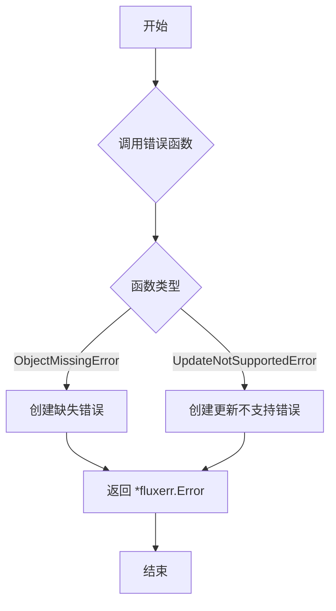
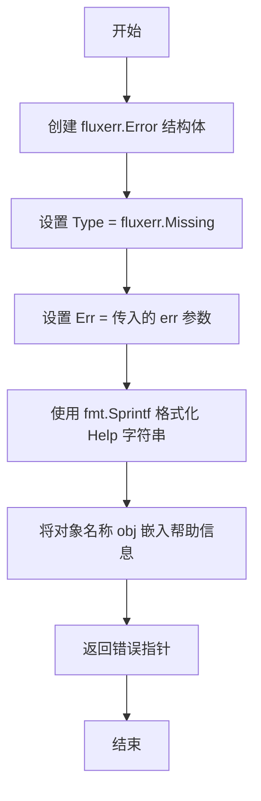
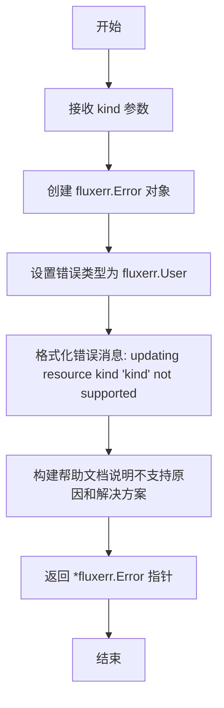

# `flux\pkg\cluster\kubernetes\errors.go` 详细设计文档

这是一个Kubernetes错误处理工具包，提供了两个错误创建函数，分别用于生成对象缺失错误和资源更新不支持错误，帮助Flux CD工具处理Kubernetes集群操作中的异常情况。

## 整体流程



## 类结构

```
Go包 (无类定义)
└── 只有函数定义
    ├── ObjectMissingError
    └── UpdateNotSupportedError
```

## 全局变量及字段


    

## 全局函数及方法


### `ObjectMissingError`

该函数用于生成一个表示集群中请求的对象不存在的错误信息，通过 `fluxerr.Error` 结构体封装错误类型、原始错误和帮助信息，帮助调用者理解和处理对象缺失的情况。

参数：

- `obj`：`string`，表示在集群中未找到的对象名称，用于错误消息中告知用户具体是哪个对象缺失
- `err`：`error`，表示原始错误，通常为触发此错误返回的底层错误

返回值：`*fluxerr.Error`，返回一个指向 fluxerr.Error 结构体的指针，包含错误类型（Missing）、原始错误和格式化的帮助文本

#### 流程图



#### 带注释源码

```go
// ObjectMissingError 创建一个表示集群对象缺失的错误
// 参数 obj: 缺失对象的名称
// 参数 err: 原始错误
// 返回: 指向 fluxerr.Error 的指针
func ObjectMissingError(obj string, err error) *fluxerr.Error {
    // 构造并返回 fluxerr.Error 结构体
    return &fluxerr.Error{
        // 设置错误类型为缺失类型
        Type: fluxerr.Missing,
        // 保留原始错误信息
        Err:  err,
        // 格式化帮助文本，包含对象名称和操作建议
        Help: fmt.Sprintf(`Cluster object %q not found

The object requested was not found in the cluster. Check spelling and
perhaps verify its presence using kubectl.
`, obj)}
}
```


### `UpdateNotSupportedError`

该函数用于生成一个 Flux 不支持更新特定 Kubernetes 资源类型的错误信息，帮助用户理解为何无法通过 Flux 更新某些资源。

参数：

- `kind`：`string`，要更新的 Kubernetes 资源类型（如 Deployment、Service 等）

返回值：`*fluxerr.Error`，返回一个包含错误类型、错误消息和帮助信息的 Flux 错误对象，用于提示用户该资源类型不支持更新操作。

#### 流程图



#### 带注释源码

```go
// UpdateNotSupportedError 创建并返回一个错误，表示 Flux 不支持更新指定的 Kubernetes 资源类型
// 参数 kind 表示不被支持的资源类型（如 "Deployment", "Service" 等）
// 返回 *fluxerr.Error 类型的错误指针，包含错误详情和用户帮助信息
func UpdateNotSupportedError(kind string) *fluxerr.Error {
    // 使用 fluxerr.Error 结构体构造错误对象
    return &fluxerr.Error{
        // 设置错误类型为 User，表示这是用户操作导致的错误
        Type: fluxerr.User,
        // 创建基础错误，包含资源类型信息
        Err:  fmt.Errorf("updating resource kind %q not supported", kind),
        // 提供详细的帮助信息，解释为什么不支持以及用户可以采取的替代方案
        Help: `Flux does not support updating ` + kind + ` resources.

This may be because those resources do not use images, you are trying
to use a YAML dot notation path annotation for a non HelmRelease
resource, or because it is a new kind of resource in Kubernetes, and
Flux does not support it yet.

If you can use a Deployment instead, Flux can work with
those. Otherwise, you may have to update the resource manually (e.g.,
using kubectl).
`,
    }
}
```

## 关键组件


### 核心功能概述

该代码是Flux CD Kubernetes集成包中的错误处理模块，提供了两个专门的错误工厂函数，用于生成符合Flux错误标准的错误对象，分别处理Kubernetes对象缺失和资源更新不支持的场景。

### 整体运行流程

该文件定义了两个公开的错误构造函数，它们接收特定参数（对象名称或资源类型），并返回格式化的`*fluxerr.Error`指针。这些函数通常被Kubernetes操作层在检测到相应错误条件时调用，帮助生成标准化的错误信息供上游错误处理机制使用。

### 关键组件信息

#### 1. ObjectMissingError 函数组件

**描述**：用于创建对象缺失错误的工厂函数，当请求的Kubernetes集群对象不存在时调用此函数生成错误信息。

#### 2. UpdateNotSupportedError 函数组件

**描述**：用于创建更新操作不支持错误的工厂函数，当尝试更新Flux不支持的Kubernetes资源类型时调用此函数生成错误信息。

#### 3. fluxerr.Error 结构组件

**描述**：来自Flux错误包的错误类型，包含错误类型、原始错误和帮助信息三个核心字段，用于标准化错误处理流程。

#### 4. 错误类型常量组件

**描述**：定义了Flux错误分类系统，包括fluxerr.Missing（资源缺失）和fluxerr.User（用户错误）两种类型，用于错误分类和分级处理。

### 潜在的技术债务或优化空间

1. **硬编码错误消息**：错误帮助文本直接嵌入代码中，多语言支持困难，建议外部化到国际化配置文件
2. **缺乏错误码系统**：仅依赖错误类型枚举，缺少具体的错误码来支持精确的错误定位和检索
3. **错误消息冗余**：UpdateNotSupportedError中的错误消息构建使用字符串拼接，违反了Go的错误处理最佳实践
4. **测试覆盖缺失**：未发现该文件的单元测试用例，错误生成逻辑缺乏自动化测试保障

### 其它项目

#### 设计目标与约束
- 遵循Flux统一的错误处理规范
- 提供用户友好的错误提示信息
- 保持与Flux错误包的类型兼容性

#### 错误处理与异常设计
- 使用错误工厂模式创建标准化的错误对象
- 错误包含Type字段用于分类（Missing/User）
- 提供Help字段用于向用户展示可操作的帮助信息

#### 数据流与状态机
- 错误对象从业务逻辑层流向API呈现层
- 不涉及状态机设计，纯错误生成逻辑

#### 外部依赖与接口契约
- 依赖github.com/fluxcd/flux/pkg/errors包中的fluxerr.Error类型
- 返回*fluxerr.Error指针，满足Flux错误处理接口契约


## 问题及建议


### 已知问题

- **硬编码的错误消息**：错误Help字符串直接内联在函数中，不利于国际化(i18n)和维护，修改时需要修改源码
- **缺乏结构化错误上下文**：错误对象仅包含基础字段，缺少时间戳、命名空间、相关资源等审计和调试所需的上下文信息
- **函数命名语义不清晰**：函数名以"Error"结尾，但实际返回的是错误指针，命名易产生误解，应使用如"NewMissingError"等更清晰的命名
- **错误包装不完整**：当传入err参数时，未使用errors.Wrap保留完整的错误堆栈信息，可能影响生产环境问题排查
- **缺乏日志记录**：错误创建时没有相应的日志记录事件，不利于监控和审计
- **错误类型覆盖不足**：仅支持两种错误类型，无法满足更细粒度的错误分类需求

### 优化建议

- 将错误消息模板提取到独立的配置文件或常量中，支持多语言和运行时配置
- 扩展fluxerr.Error结构，添加Timestamp、Namespace、Resource等字段以增强可观测性
- 重命名函数为`NewObjectMissingError`/`NewUpdateNotSupportedError`，明确其构造器角色
- 引入"github.com/pkg/errors"的Wrap方法封装底层错误，保留完整堆栈
- 在错误创建点添加结构化日志记录，支持日志聚合和分析
- 建立错误码体系，如定义常量`ErrObjectNotFound`等，便于程序化处理和国际化


## 其它


### 设计目标与约束

本代码模块的主要设计目标是提供Kubernetes资源操作的错误处理机制，帮助调用者识别和处理两类常见的错误场景：对象缺失和资源更新不支持。该模块作为fluxcd/flux项目的一部分，需要遵循项目整体的错误处理规范，使用fluxerr包定义的错误类型系统。设计约束包括：必须返回*fluxerr.Error类型以保持错误链的完整性，错误消息需要提供用户可操作的帮助信息。

### 错误处理与异常设计

本模块采用函数式错误工厂模式，通过两个导出的函数创建特定类型的错误。ObjectMissingError用于处理集群中不存在指定对象的情况，返回fluxerr.Missing类型的错误，包含对象名称和底层错误信息。UpdateNotSupportedError用于处理不支持的资源更新操作，返回fluxerr.User类型的错误，帮助用户理解为何某些操作无法执行。错误 Help 字段提供了用户友好的说明和可能的解决方案。

### 外部依赖与接口契约

本模块依赖外部包github.com/fluxcd/flux/pkg/errors，该包定义了Error结构体和错误类型常量（Missing、User等）。ObjectMissingError和UpdateNotSupportedError函数都接受特定参数并返回*fluxerr.Error类型的指针，调用者需要检查返回值是否为nil。调用者应确保传入有效的错误对象和非空的资源类型字符串。

### 安全性考虑

本模块本身不涉及敏感数据处理，但错误消息中可能包含用户提供的资源名称等信息。在日志记录或错误报告场景中，应注意避免泄露敏感的业务信息。Help文本中的示例命令（如kubectl）是安全的通用指令。

### 性能考虑

这两个函数都是轻量级的错误构造函数，没有外部I/O操作或复杂的计算。性能开销主要来自fmt.Sprintf的字符串格式化，但对于错误处理路径而言可以忽略不计。不存在明显的性能优化空间。

### 测试策略

建议为这两个函数编写单元测试，验证：1) 返回的Error对象非空；2) Error的Type字段符合预期；3) Help字段包含有意义的用户指导信息；4) 错误格式化正确处理特殊字符和边界情况。可以使用表驱动测试方法覆盖不同的输入组合。

### 版本兼容性

本代码依赖github.com/fluxcd/flux/pkg/errors包，需要与fluxcd/flux主项目版本保持同步。如果fluxerr包发生API变更（如新的错误类型常量），本模块需要相应更新。建议在go.mod中明确标注依赖版本。

### 使用示例

当需要检查对象是否存在时，调用ObjectMissingError并检查返回的错误类型。当需要提示用户某资源类型不支持更新时，调用UpdateNotSupportedError。这两个函数通常在Kubernetes API返回错误后被调用，作为错误转换层将底层错误转换为用户友好的错误消息。


    