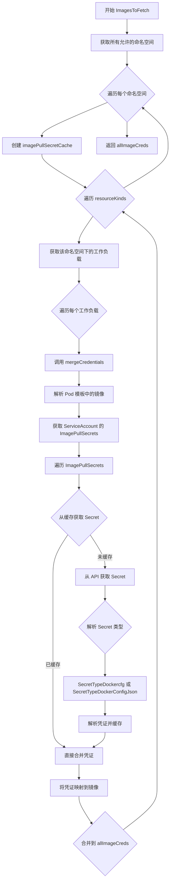
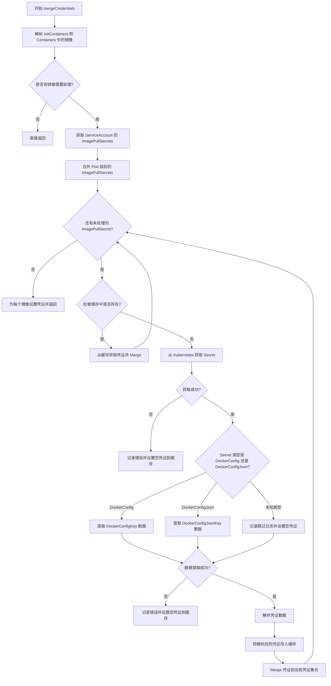
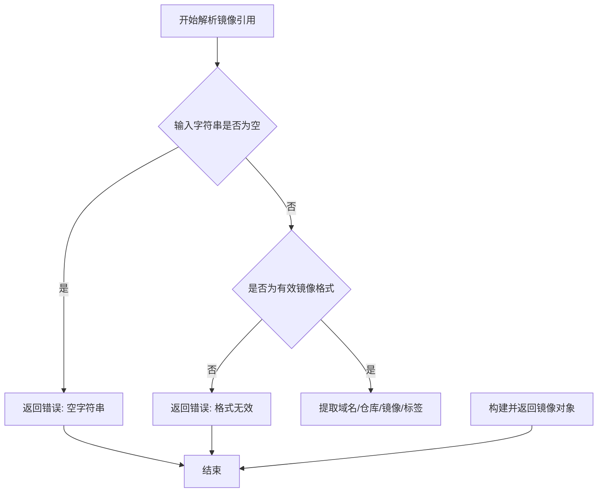
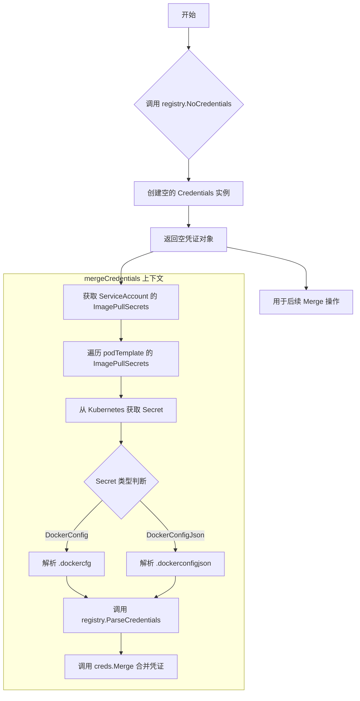
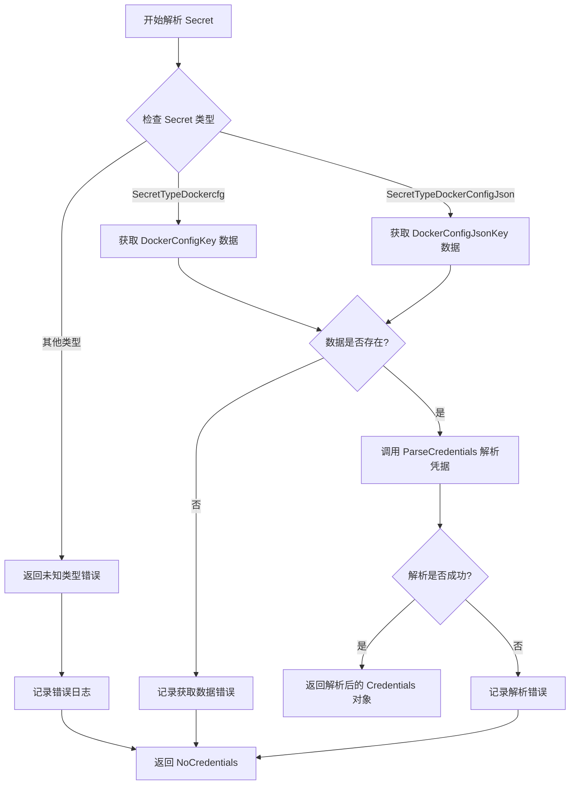
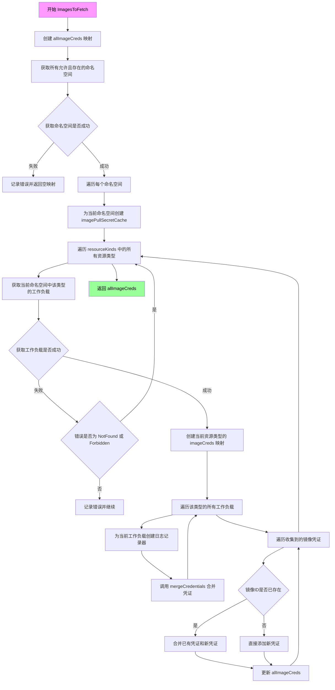

# `flux\pkg\cluster\kubernetes\images.go` 详细设计文档

该代码负责从 Kubernetes 集群中扫描所有 Pod 的容器镜像，并根据 ImagePullSecrets 获取对应的镜像拉取凭证，最终返回需要更新的镜像及其凭证映射。

## 整体流程



## 类结构

```
Cluster (外部定义类型)
└── ImagesToFetch() 方法
```

## 全局变量及字段


### `allImageCreds`
    
A map storing image names to their credentials across all namespaces

类型：`registry.ImageCreds`
    


### `imagePullSecretCache`
    
Cache for image pull secrets, indexed by namespace/secret name

类型：`map[string]registry.Credentials`
    


### `images`
    
A slice of container image names parsed from pod templates

类型：`[]image.Name`
    


### `creds`
    
Merged credentials accumulated from service accounts and image pull secrets

类型：`registry.Credentials`
    


### `imagePullSecrets`
    
A list of image pull secret names collected from service account and pod spec

类型：`[]string`
    


### `saName`
    
Service account name used for retrieving image pull secrets, defaults to 'default'

类型：`string`
    


### `Cluster.client`
    
Kubernetes client for interacting with cluster resources

类型：`ExtendedClient`
    


### `Cluster.logger`
    
Logger instance for recording operational events and errors

类型：`log.Logger`
    


### `Cluster.imageIncluder`
    
Filter interface to determine which images should be included in credential processing

类型：`镜像过滤器`
    
    

## 全局函数及方法


### `mergeCredentials`

该函数是 Kubernetes 包中的一个核心函数，负责将 Pod 模板中引用的所有镜像与对应的镜像拉取凭证进行合并匹配。它首先解析 Pod 中的 InitContainers 和 Containers 镜像，然后从 ServiceAccount 和 Pod 规范的 ImagePullSecrets 中获取凭证，最后将凭证关联到对应的镜像并存储到缓存中供后续使用。

参数：

- `log`：`func(...interface{}) error`，日志记录函数，用于输出错误和调试信息
- `includeImage`：`func(imageName string) bool`，判断是否需要包含指定镜像的过滤函数
- `client`：`ExtendedClient`，Kubernetes 客户端接口，用于访问集群资源
- `namespace`：`string`，Kubernetes 命名空间，用于限定资源查询范围
- `podTemplate`：`apiv1.PodTemplateSpec`，Pod 模板规范，包含容器和镜像信息
- `imageCreds`：`registry.ImageCreds`，镜像凭证映射表，将镜像名称映射到凭证（输出参数）
- `imagePullSecretCache`：`map[string]registry.Credentials`，镜像拉取密钥缓存，以 "namespace/secretName" 为键

返回值：`void`（无返回值），通过 `imageCreds` 参数间接返回结果

#### 流程图



#### 带注释源码

```go
// mergeCredentials 将 Pod 模板中的镜像与镜像拉取凭证进行合并匹配
// 参数：
//   - log: 日志记录函数
//   - includeImage: 判断镜像是否需要处理的过滤函数
//   - client: Kubernetes 客户端
//   - namespace: 命名空间
//   - podTemplate: Pod 模板规范
//   - imageCreds: 输出参数，存储镜像到凭证的映射
//   - imagePullSecretCache: 镜像拉取密钥缓存，避免重复查询
func mergeCredentials(log func(...interface{}) error,
	includeImage func(imageName string) bool,
	client ExtendedClient,
	namespace string, podTemplate apiv1.PodTemplateSpec,
	imageCreds registry.ImageCreds,
	imagePullSecretCache map[string]registry.Credentials) {

	// --- 第一步：解析 Pod 模板中的所有镜像 ---
	var images []image.Name
	// 处理 InitContainers
	for _, container := range podTemplate.Spec.InitContainers {
		r, err := image.ParseRef(container.Image)
		if err != nil {
			log("err", err.Error())
			continue
		}
		// 根据 includeImage 函数判断是否需要包含此镜像
		if includeImage(r.CanonicalName().Name.String()) {
			images = append(images, r.Name)
		}
	}

	// 处理 Containers
	for _, container := range podTemplate.Spec.Containers {
		r, err := image.ParseRef(container.Image)
		if err != nil {
			log("err", err.Error())
			continue
		}
		if includeImage(r.CanonicalName().Name.String()) {
			images = append(images, r.Name)
		}
	}

	// 如果没有需要处理的镜像，直接返回
	if len(images) < 1 {
		return
	}

	// --- 第二步：获取镜像拉取凭证来源 ---
	creds := registry.NoCredentials() // 初始化为空凭证
	var imagePullSecrets []string

	// 获取 ServiceAccount 名称，默认为 "default"
	saName := podTemplate.Spec.ServiceAccountName
	if saName == "" {
		saName = "default"
	}

	// 从 ServiceAccount 获取 ImagePullSecrets
	sa, err := client.CoreV1().ServiceAccounts(namespace).Get(context.TODO(), saName, meta_v1.GetOptions{})
	if err == nil {
		for _, ips := range sa.ImagePullSecrets {
			imagePullSecrets = append(imagePullSecrets, ips.Name)
		}
	}

	// 合并 Pod 规范中直接定义的 ImagePullSecrets
	for _, imagePullSecret := range podTemplate.Spec.ImagePullSecrets {
		imagePullSecrets = append(imagePullSecrets, imagePullSecret.Name)
	}

	// --- 第三步：处理每个镜像拉取密钥 ---
	for _, name := range imagePullSecrets {
		// 构造缓存键：namespace/secretName
		namespacedSecretName := fmt.Sprintf("%s/%s", namespace, name)

		// 检查缓存中是否已存在
		if seen, ok := imagePullSecretCache[namespacedSecretName]; ok {
			creds.Merge(seen) // 合并已缓存的凭证
			continue
		}

		// 从 Kubernetes 获取 Secret 资源
		secret, err := client.CoreV1().Secrets(namespace).Get(context.TODO(), name, meta_v1.GetOptions{})
		if err != nil {
			log("err", errors.Wrapf(err, "getting secret %q from namespace %q", name, namespace))
			imagePullSecretCache[namespacedSecretName] = registry.NoCredentials() // 缓存失败结果
			continue
		}

		// --- 第四步：根据 Secret 类型提取凭证数据 ---
		var decoded []byte
		var ok bool

		// 处理不同类型的 Docker 凭证 Secret
		switch apiv1.SecretType(secret.Type) {
		case apiv1.SecretTypeDockercfg:
			// 旧版 Docker 配置文件格式
			decoded, ok = secret.Data[apiv1.DockerConfigKey]
		case apiv1.SecretTypeDockerConfigJson:
			// 新版 Docker JSON 配置格式
			decoded, ok = secret.Data[apiv1.DockerConfigJsonKey]
		default:
			// 未知类型，跳过并记录日志
			log("skip", "unknown type", "secret", namespace+"/"+secret.Name, "type", secret.Type)
			imagePullSecretCache[namespacedSecretName] = registry.NoCredentials()
			continue
		}

		// 数据提取失败处理
		if !ok {
			log("err", errors.Wrapf(err, "retrieving pod secret %q", secret.Name))
			imagePullSecretCache[namespacedSecretName] = registry.NoCredentials()
			continue
		}

		// 解析 Secret 中的凭证数据
		crd, err := registry.ParseCredentials(fmt.Sprintf("%s:secret/%s", namespace, name), decoded)
		if err != nil {
			log("err", err.Error())
			imagePullSecretCache[namespacedSecretName] = registry.NoCredentials()
			continue
		}

		// 存入缓存供后续使用
		imagePullSecretCache[namespacedSecretName] = crd

		// 合并到当前 Pod 的凭证集合中
		creds.Merge(crd)
	}

	// --- 第五步：将凭证关联到所有镜像 ---
	for _, image := range images {
		imageCreds[image] = creds
	}
}
```


### `image.ParseRef`

该函数用于解析容器镜像的引用字符串，将其拆分为域名、仓库名、镜像名、标签等组成部分，以便后续进行镜像版本检查和凭证管理。

参数：

-  `{containerImage}`：`string`，容器镜像的完整引用字符串（如 `registry.example.com/namespace/image:tag`）

返回值：`{解析结果}`，`{error}`，返回解析后的镜像对象和可能的解析错误

#### 流程图



#### 带注释源码

```go
// 在 mergeCredentials 函数中的调用示例
for _, container := range podTemplate.Spec.Containers {
    // container.Image 为容器镜像字符串
    r, err := image.ParseRef(container.Image)
    if err != nil {
        log("err", err.Error())
        continue
    }
    // r.CanonicalName().Name.String() 获取规范化后的镜像名称
    if includeImage(r.CanonicalName().Name.String()) {
        images = append(images, r.Name)
    }
}
```

---

### 补充说明

**注意**：提供的代码文件中并未包含 `image.ParseRef` 函数的具体定义，仅有对其的调用。该函数定义于 `github.com/fluxcd/flux/pkg/image` 包中。根据代码中的调用方式推断：

| 属性 | 值 |
|------|-----|
| 函数名 | `image.ParseRef` |
| 所在包 | `github.com/fluxcd/flux/pkg/image` |
| 参数 | `ref string` |
| 返回值 | `image.Name, error` |
| 调用位置 | `mergeCredentials` 函数（第26、34行） |

如需获取 `image.ParseRef` 的完整源码，请参考 `pkg/image` 包源文件。


### `registry.NoCredentials`

该函数是 Flux 集群模块中用于获取空凭证对象的工厂函数，在 Kubernetes 镜像凭证合并流程中作为初始凭证容器使用。通过返回一个无凭据的 `Credentials` 实例，配合后续的 `Merge` 方法实现多来源凭证的聚合。

#### 参数

该函数无参数。

#### 流程图



#### 带注释源码

```go
// 定义在 pkg/registry 包中
// 此代码片段展示该函数在 kubernetes 包中的使用方式

// 1. 初始化空的凭证对象
creds := registry.NoCredentials()

// 2. 后续使用场景：
//    a) 从 ServiceAccount 获取 ImagePullSecrets
sa, err := client.CoreV1().ServiceAccounts(namespace).Get(context.TODO(), saName, meta_v1.GetOptions{})
if err == nil {
    for _, ips := range sa.ImagePullSecrets {
        imagePullSecrets = append(imagePullSecrets, ips.Name)
    }
}

//    b) 从 PodSpec 获取额外的 ImagePullSecrets
for _, imagePullSecret := range podTemplate.Spec.ImagePullSecrets {
    imagePullSecrets = append(imagePullSecrets, imagePullSecret.Name)
}

//    c) 遍历每个 secret 获取凭证并合并
for _, name := range imagePullSecrets {
    // 从缓存中获取已解析的凭证
    namespacedSecretName := fmt.Sprintf("%s/%s", namespace, name)
    if seen, ok := imagePullSecretCache[namespacedSecretName]; ok {
        creds.Merge(seen)  // 合并缓存的凭证
        continue
    }
    
    // 获取 Secret 资源
    secret, err := client.CoreV1().Secrets(namespace).Get(context.TODO(), name, meta_v1.GetOptions{})
    if err != nil {
        // 失败时设置为空凭证
        imagePullSecretCache[namespacedSecretName] = registry.NoCredentials()
        continue
    }
    
    // 解析 Secret 数据
    var decoded []byte
    var ok bool
    switch apiv1.SecretType(secret.Type) {
    case apiv1.SecretTypeDockercfg:
        decoded, ok = secret.Data[apiv1.DockerConfigKey]
    case apiv1.SecretTypeDockerConfigJson:
        decoded, ok = secret.Data[apiv1.DockerConfigJsonKey]
    default:
        // 未知类型时设置空凭证
        imagePullSecretCache[namespacedSecretName] = registry.NoCredentials()
        continue
    }
    
    // 解析为凭证对象
    crd, err := registry.ParseCredentials(...)
    if err != nil {
        imagePullSecretCache[namespacedSecretName] = registry.NoCredentials()
        continue
    }
    
    // 缓存并合并
    imagePullSecretCache[namespacedSecretName] = crd
    creds.Merge(crd)  // 核心合并操作
}
```

#### 关键组件信息

| 组件名称 | 一句话描述 |
|---------|-----------|
| `Credentials` | 镜像仓库凭证的抽象接口，支持合并操作 |
| `ImagePullSecrets` | Kubernetes 中存储镜像拉取凭证的 Secret 资源 |
| `mergeCredentials` | 将多个来源的凭证合并为单一凭证集合的函数 |
| `imagePullSecretCache` | 缓存已解析的 Secret 凭证，避免重复查询 |

#### 潜在技术债务与优化空间

1. **错误处理分散**：多处 `registry.NoCredentials()` 调用用于错误恢复，建议封装为统一错误处理模式
2. **缓存策略单一**：当前使用内存缓存，可考虑引入 TTL 或持久化缓存
3. **Context 使用**：`context.TODO()` 应替换为具体的 context 以支持超时和取消
4. **Secret 遍历效率**：每个 namespace 下的 secret 独立获取，可考虑批量查询优化


### `registry.ParseCredentials`

此函数用于解析 Kubernetes Secret 中的 Docker 凭据数据，支持解析 Docker 配置文件（`~/.docker/config.json` 格式）和 Docker Config JSON 格式的凭据信息，并将其转换为应用程序可用的凭据对象。

参数：

- `name`：`string`，Secret 的标识名称，格式为 `{namespace}/secret/{secretName}`
- `data`：`[]byte`，从 Kubernetes Secret 中获取的原始凭据数据

返回值：`registry.Credentials`，解析成功后的凭据对象；`error`，解析过程中发生的错误（如果存在）

#### 流程图



#### 带注释源码

```go
// Parse secret - 解析 Kubernetes Secret 中的凭据数据
// 参数 name: Secret 的标识名称，格式为 "{namespace}/secret/{secretName}"
// 参数 decoded: 从 Secret 中获取的原始字节数据
crd, err := registry.ParseCredentials(fmt.Sprintf("%s:secret/%s", namespace, name), decoded)
if err != nil {
    // 解析失败时记录错误，并缓存空凭据
    log("err", err.Error())
    imagePullSecretCache[namespacedSecretName] = registry.NoCredentials()
    continue
}
// 解析成功，缓存解析后的凭据
imagePullSecretCache[namespacedSecretName] = crd

// Merge into the credentials for this PodSpec
// 将解析后的凭据合并到 PodSpec 的凭据集合中
creds.Merge(crd)
```

#### 上下文调用说明

`registry.ParseCredentials` 在 `mergeCredentials` 函数中被调用，用于处理从 Kubernetes 获取的 Docker 镜像仓库 Secret。该函数内部会根据 Secret 的类型（`SecretTypeDockercfg` 或 `SecretTypeDockerConfigJson`）提取对应的数据，然后调用 `ParseCredentials` 完成凭据的解析和转换。解析结果会被缓存到 `imagePullSecretCache` 中，以便后续复用，同时也会合并到当前 Pod 模板的凭据集合中。


### `Cluster.ImagesToFetch`

该方法是Kubernetes集群特定的方法，用于获取需要更新的镜像列表及其对应的凭证信息。它遍历所有可访问的命名空间和各类工作负载（如Deployment、DaemonSet等），解析每个工作负载的容器镜像，并关联相应的镜像拉取凭证，最终返回所有镜像及其凭证的映射集合。

参数：
- 该方法为成员方法，隐含参数`c *Cluster`表示Cluster类型的接收者实例

返回值：`registry.ImageCreds`，返回所有需要更新的镜像及其对应凭证的映射集合

#### 流程图



#### 带注释源码

```go
// ImagesToFetch 是 Cluster 类型的成员方法
// 功能：获取需要更新的镜像列表及其凭证
// 返回值：registry.ImageCreds 类型，包含所有镜像名称到凭证的映射
func (c *Cluster) ImagesToFetch() registry.ImageCreds {
    // 初始化存放所有镜像凭证的映射
    allImageCreds := make(registry.ImageCreds)
    
    // 创建上下文对象
    ctx := context.Background()

    // 获取当前集群中所有被允许且实际存在的命名空间
    // 这是为了只处理有权限访问的命名空间
    namespaces, err := c.getAllowedAndExistingNamespaces(ctx)
    if err != nil {
        // 如果获取命名空间失败，记录错误并返回空的凭证映射
        c.logger.Log("err", errors.Wrap(err, "getting namespaces"))
        return allImageCreds
    }

    // 遍历每个命名空间
    for _, ns := range namespaces {
        // 为每个命名空间创建独立的镜像拉取密钥缓存
        // 缓存以 "namespace/secretName" 格式索引
        imagePullSecretCache := make(map[string]registry.Credentials)
        
        // 遍历所有支持的资源类型（如Deployment、DaemonSet等）
        for kind, resourceKind := range resourceKinds {
            // 获取当前命名空间中指定类型的所有工作负载
            workloads, err := resourceKind.getWorkloads(ctx, c, ns)
            if err != nil {
                // 如果发生错误，根据错误类型处理
                if apierrors.IsNotFound(err) || apierrors.IsForbidden(err) {
                    // 跳过不支持或无权限访问的资源类型
                    continue
                }
                // 其他错误需要记录日志
                c.logger.Log("err", errors.Wrapf(err, "getting kind %s for namespace %s", kind, ns))
            }

            // 为当前资源类型创建独立的镜像凭证映射
            imageCreds := make(registry.ImageCreds)
            
            // 遍历该类型下的所有工作负载
            for _, workload := range workloads {
                // 创建带有资源标识的日志记录器
                logger := log.With(c.logger, "resource", resource.MakeID(workload.GetNamespace(), kind, workload.GetName()))
                
                // 调用 mergeCredentials 函数合并镜像和凭证信息
                // 参数：日志函数、镜像过滤函数、客户端、命名空间、工作负载的Pod模板、凭证映射、密钥缓存
                mergeCredentials(logger.Log, c.imageIncluder.IsIncluded, c.client, workload.GetNamespace(), workload.podTemplate, imageCreds, imagePullSecretCache)
            }

            // 将当前资源类型的凭证合并到全局凭证映射中
            for imageID, creds := range imageCreds {
                // 检查该镜像是否已有凭证
                existingCreds, ok := allImageCreds[imageID]
                if ok {
                    // 如果已存在，合并新旧凭证
                    mergedCreds := registry.NoCredentials()
                    mergedCreds.Merge(existingCreds)
                    mergedCreds.Merge(creds)
                    allImageCreds[imageID] = mergedCreds
                } else {
                    // 如果不存在，直接添加新凭证
                    allImageCreds[imageID] = creds
                }
            }
        }
    }

    // 返回所有镜像及其凭证的映射
    return allImageCreds
}
```

## 关键组件


### 镜像凭证合并机制

负责将Kubernetes ServiceAccount和PodSpec中定义的ImagePullSecrets合并，为每个容器镜像关联相应的Docker registry凭证。包含凭证解析、缓存管理和跨多个Secret的合并逻辑。

### ImagePullSecrets处理组件

从Kubernetes Secret资源中提取Docker凭证，支持SecretTypeDockercfg和SecretTypeDockerConfigJson两种格式，并将解析后的凭证存储到缓存映射中供后续使用。

### ServiceAccount凭证获取组件

从Pod所属的ServiceAccount中提取ImagePullSecrets引用，结合PodTemplate中直接定义的ImagePullSecrets，形成完整的凭证来源列表。

### 凭证缓存机制

使用imagePullSecretCache map[string]registry.Credentials存储已解析的Secret凭证，以"namespace/secretname"为键索引，避免对同一Secret的重复API调用。

### 多命名空间遍历组件

通过getAllowedAndExistingNamespaces获取所有授权访问的命名空间，遍历每个命名空间下的工作负载以收集镜像信息。

### 多工作负载类型支持组件

遍历resourceKinds映射中的各种Kubernetes资源类型（如Deployment、DaemonSet、StatefulSet等），调用各自的getWorkloads方法获取该类型的工作负载列表。

### 镜像提取与过滤组件

从PodTemplateSpec的InitContainers和Containers中解析镜像引用，通过includeImage回调函数过滤需要处理的镜像，仅保留符合条件的目标镜像。

### 凭证聚合与返回组件

将所有命名空间和工作负载类型的镜像凭证汇总到registry.ImageCreds返回，支持同一镜像可能从多个来源获取凭证时的合并场景。


## 问题及建议


### 已知问题

-   **使用 `context.TODO()`**：在 `mergeCredentials` 函数中多处使用 `context.TODO()`，这是临时占位符，应该接受或使用正确的 context 以支持取消和超时
-   **静默失败**：API 调用错误（如获取 ServiceAccount、Secrets）仅记录日志但不返回错误，可能导致凭据缺失时无法感知
- **重复代码**：遍历 `InitContainers` 和 `Containers` 的逻辑几乎完全重复，可提取为单独函数
- **凭据合并逻辑重复**：在 `ImagesToFetch` 中合并 `allImageCreds` 的逻辑与 `mergeCredentials` 中的 `creds.Merge()` 重复
- **凭据类型误用**：`crd` 变量实际存储的是 `Credentials` 类型，但变量名 `crd`（Credential Resource Definition）容易引起误解
- **缺少并发控制**：遍历 namespaces 和 workloads 时顺序执行，没有利用并发，且可能触发 Kubernetes API 限流
- **Cache 作用域不当**：`imagePullSecretCache` 在内层循环（resourceKind 循环）内创建，导致不同资源类型无法共享 secret 缓存

### 优化建议

-   将 `mergeCredentials` 改为接受 context 参数，并在失败时返回 error
-   提取镜像遍历逻辑为单独函数 `extractImagesFromContainers`，减少重复代码
-   将 `imagePullSecretCache` 提升到 namespace 级别，避免重复获取相同 secret
-   考虑使用并发（如 goroutine + errgroup）并行处理不同 namespace 的请求，并添加速率限制
-   统一凭据合并逻辑，可在 `registry` 包中提供 `MergeAll` 方法
-   改进错误处理，对于关键错误（如无法获取必需的 secret）应考虑返回错误而非静默继续

## 其它


### 设计目标与约束

该代码的主要设计目标是从Kubernetes集群中自动收集镜像凭据，以便Flux CD能够自动更新容器镜像。核心约束包括：仅处理支持的Secret类型（DockerConfigJson和Dockercfg），依赖Kubernetes RBAC权限获取ServiceAccount和Secret资源，以及通过imageIncluder过滤只处理特定镜像。

### 错误处理与异常设计

错误处理采用分级策略：对于可忽略的错误（如单个镜像解析失败或Secret获取失败），使用log记录并继续处理；对于致命错误（如获取命名空间列表失败），直接返回空结果。对于NotFound和Forbidden错误，代码显式忽略这些资源类型，因为某些集群可能不支持CRD资源或没有相应权限。

### 数据流与状态机

数据流从ImagesToFetch方法开始，首先获取所有允许的命名空间，然后遍历每个命名空间中的资源类型。对于每个工作负载，调用mergeCredentials函数，该函数从ServiceAccount的ImagePullSecrets和Pod模板的ImagePullSecrets中收集Secret名称，接着查询每个Secret并解析凭据，最后将凭据映射到对应的镜像。最终将所有命名空间的凭据合并到allImageCreds返回。

### 外部依赖与接口契约

主要依赖包括：Kubernetes ClientSet（CoreV1接口）用于访问ServiceAccount和Secret资源；registry.ParseCredentials函数用于解析Secret数据为凭据对象；image包用于解析镜像引用；以及imageIncluder接口用于过滤需要处理的镜像。返回的registry.ImageCreds是一个map类型，key为image.Name，value为registry.Credentials。

### 性能考虑

代码中存在多个潜在的性能瓶颈：每个命名空间都创建新的imagePullSecretCache，这意味着Secret会被重复获取；没有实现凭据缓存的过期机制；遍历所有命名空间和所有工作负载是O(n*m)复杂度。建议优化：考虑在Cluster级别缓存凭据而非每次调用都重新获取；对于大规模集群，可能需要增加并发控制或分页机制。

### 安全考虑

代码处理敏感的镜像凭据数据，需要注意：Secret数据在内存中以明文形式存储；日志可能记录敏感信息（当前代码只记录错误和secret名称，未记录凭据内容）；需要确保运行权限最小化，只授予必要的Kubernetes API权限。建议：避免在日志中记录任何可能包含敏感信息的字段；考虑使用Kubernetes的Secret加密存储。

### 并发模型

当前实现是串行处理，没有显式的并发控制。在处理大量命名空间和工作负载时可能导致性能问题。可以考虑使用Go的goroutine和channel实现并发获取不同命名空间的凭据，但需要注意对Kubernetes API的并发请求进行限流以避免触发API Server的限流机制。

### 配置说明

主要配置通过Cluster结构体传入：client用于Kubernetes API通信；logger用于日志记录；imageIncluder用于过滤镜像。此外，mergeCredentials函数接受namespace和podTemplate参数来确定工作负载的范围。代码中没有显式的超时配置，使用context.Background()意味着可能使用默认的Kubernetes客户端超时设置。

### 使用示例

该代码通常由Flux CD的镜像自动更新功能调用。典型调用流程为：用户配置自动镜像更新策略 → Flux检测到新镜像 → 调用ImagesToFetch获取需要凭据的镜像列表 → 使用凭据从私有仓库拉取镜像 → 更新工作负载。


    