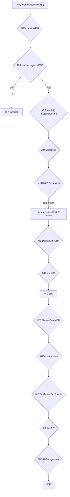
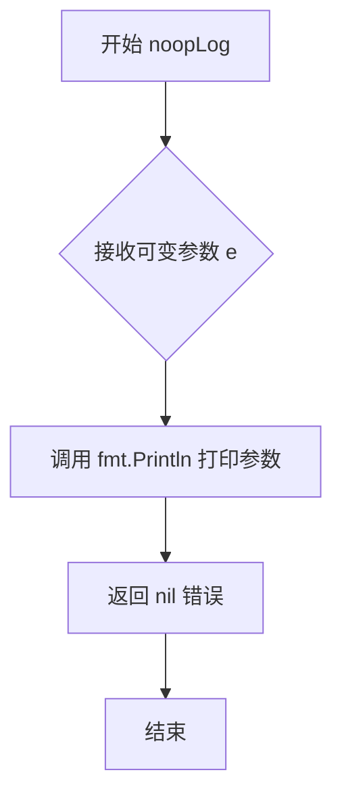
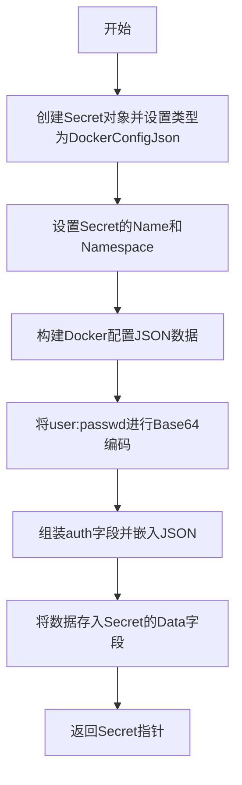
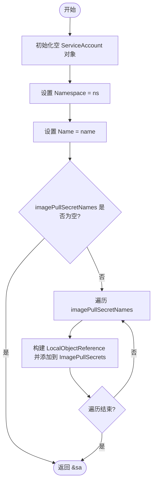
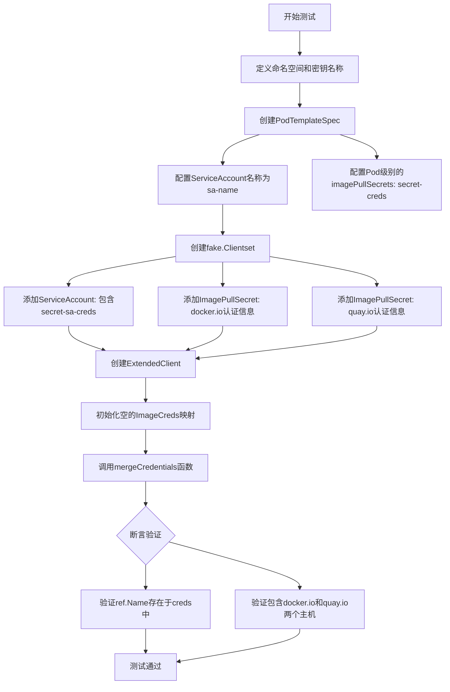
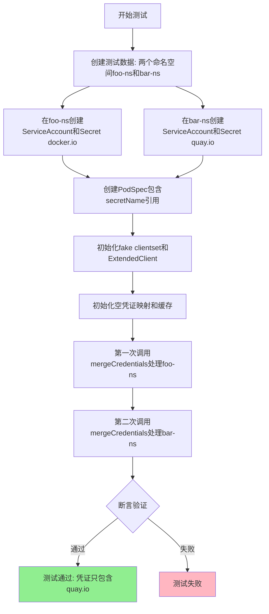
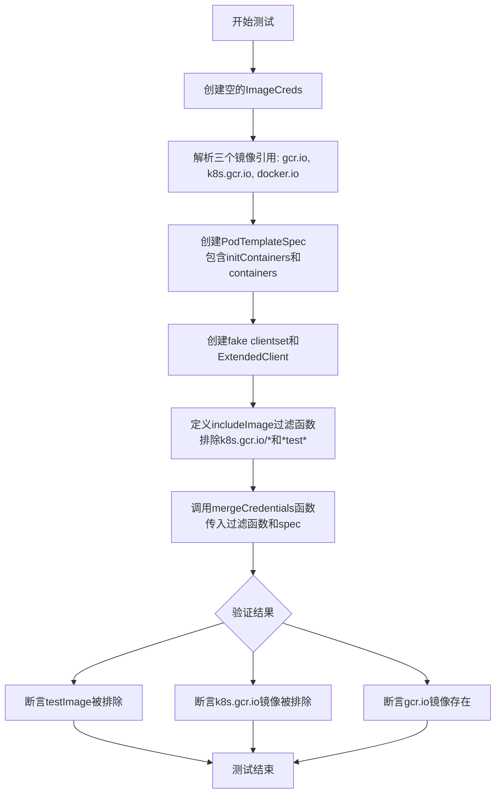
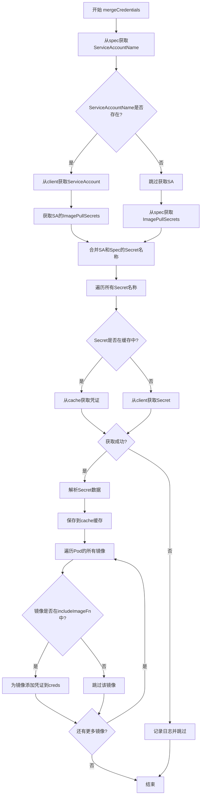
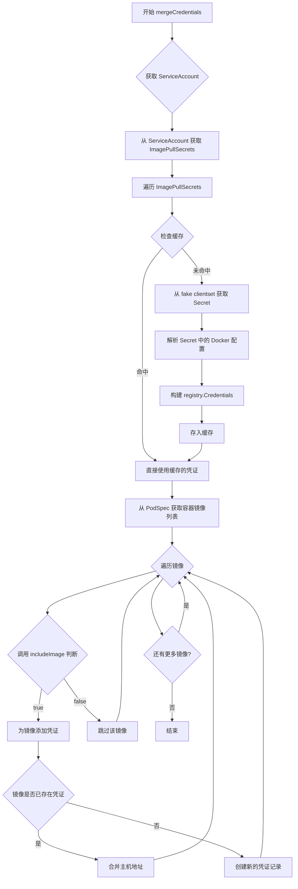

# `flux\pkg\cluster\kubernetes\images_test.go` 详细设计文档

该代码实现了一个Kubernetes镜像凭证同步功能，能够从ServiceAccount的ImagePullSecrets和Pod规范中提取Docker镜像仓库的认证信息，支持凭证合并、跨命名空间处理和基于镜像名称的动态过滤。

## 整体流程



## 类结构

```
ExtendedClient (Kubernetes扩展客户端封装)
├── coreClient: kubernetes.Interface
├── 方法: 通过嵌入clientset实现核心Kubernetes API调用
└── 用途: 提供凭证管理所需的Kubernetes API能力
```

## 全局变量及字段


### `imagePullSecret`
    
Kubernetes Secret对象，用于存储Docker镜像仓库认证信息

类型：`*apiv1.Secret`
    


### `serviceAccount`
    
Kubernetes ServiceAccount对象，包含ImagePullSecrets引用

类型：`*apiv1.ServiceAccount`
    


### `clientset`
    
Kubernetes fake客户端，用于测试环境

类型：`*fake.Clientset`
    


### `client`
    
扩展的Kubernetes客户端封装

类型：`ExtendedClient`
    


### `creds`
    
镜像名称到凭证信息的映射

类型：`registry.ImageCreds`
    


### `pullImageSecretCache`
    
Secret到凭证的缓存

类型：`map[string]registry.Credentials`
    


### `spec`
    
Pod模板规范，包含容器和镜像拉取策略

类型：`apiv1.PodTemplateSpec`
    


### `ref`
    
解析后的镜像引用对象

类型：`image.Ref`
    


### `ns`
    
Kubernetes命名空间

类型：`string`
    


### `saName`
    
ServiceAccount名称

类型：`string`
    


### `secretName1`
    
第一个Secret的名称

类型：`string`
    


### `secretName2`
    
第二个Secret的名称

类型：`string`
    


### `ExtendedClient.coreClient`
    
通过fake clientset实现Kubernetes API调用的接口

类型：`kubernetes.Interface`
    
    

## 全局函数及方法


### `noopLog`

该函数是一个空操作日志函数（No-Operation Log），用于测试环境中模拟日志记录功能。它接收任意数量的参数，将它们打印到标准输出，并始终返回 nil 表示无错误。其核心目的是在不需要真实日志记录的情况下，提供一个符合日志函数签名的替代实现。

参数：

- `e`：`...interface{}`，可变参数，接受任意类型任意数量的参数，用于日志输出

返回值：`error`，始终返回 nil，表示该操作不会产生错误

#### 流程图



#### 带注释源码

```go
// noopLog 是一个空操作日志函数，用于测试中打印日志
// 参数 e 为可变参数，接受任意类型任意数量的参数
// 返回值为 error 类型，始终返回 nil，表示该操作不会产生错误
func noopLog(e ...interface{}) error {
	// 使用 fmt.Println 将传入的参数打印到标准输出
	// ...interface{} 表示可以接受任意数量任意类型的参数
	fmt.Println(e...)
	// 始终返回 nil，表示没有错误发生
	return nil
}
```


### `makeImagePullSecret`

创建并返回一个包含Docker认证信息的Kubernetes Secret对象，用于存储私有容器镜像仓库的访问凭证。

参数：

- `ns`：`string`，Secret所属的Kubernetes命名空间
- `name`：`string`，Secret对象的名称
- `host`：`string`，私有Docker镜像仓库的主机地址（如docker.io、quay.io等）

返回值：`*apiv1.Secret`，返回指向Kubernetes Secret对象的指针，包含用于拉取私有镜像的Docker配置信息

#### 流程图



#### 带注释源码

```go
// makeImagePullSecret 创建一个包含Docker镜像仓库认证信息的Kubernetes Secret对象
// 参数:
//   - ns: 命名空间
//   - name: Secret名称
//   - host: 镜像仓库主机地址
//
// 返回值:
//   - *apiv1.Secret: 包含Docker认证信息的Secret对象指针
func makeImagePullSecret(ns, name, host string) *apiv1.Secret {
    // 初始化Secret对象，类型设置为DockerConfigJson（Kubernetes镜像仓库密钥标准类型）
    imagePullSecret := apiv1.Secret{Type: apiv1.SecretTypeDockerConfigJson}
    
    // 设置Secret的名称和命名空间
    imagePullSecret.Name = name
    imagePullSecret.Namespace = ns
    
    // 构建Docker配置文件数据，包含镜像仓库主机和认证信息
    // 注意：此处使用硬编码的用户名密码"user:passwd"，实际使用时需从配置或密钥库获取
    imagePullSecret.Data = map[string][]byte{
        apiv1.DockerConfigJsonKey: []byte(`
{
  "auths": {
    "` + host + `": {
      "auth": "` + base64.StdEncoding.EncodeToString([]byte("user:passwd")) + `"
      }
    }
}`),
    }
    
    // 返回Secret对象的指针
    return &imagePullSecret
}
```

#### 关键组件信息

| 组件名称 | 描述 |
|---------|------|
| `apiv1.Secret` | Kubernetes Core API的Secret对象，用于存储敏感信息 |
| `apiv1.SecretTypeDockerConfigJson` | Docker镜像仓库配置JSON类型的Secret |
| `apiv1.DockerConfigJsonKey` | Docker配置文件JSON的键名（".dockerconfigjson"） |
| `base64.StdEncoding` | 标准Base64编码器，用于对认证凭据进行编码 |

#### 潜在的技术债务或优化空间

1. **硬编码凭据**：当前函数使用硬编码的"user:passwd"，生产环境应从配置、密钥管理系统或环境变量动态获取
2. **缺乏错误处理**：未对参数进行校验（如空字符串检查），未处理Base64编码可能的错误
3. **灵活性不足**：凭据信息应该通过参数传入，而非固定值，以便支持不同镜像仓库使用不同凭据
4. **测试辅助函数**：该函数位于测试文件中（_test.go），设计上仅用于测试目的，生产代码应实现更完整的密钥管理逻辑


### `makeServiceAccount`

该函数用于在测试环境中构造并返回一个配置了指定命名空间、名称及镜像拉取密钥列表的 Kubernetes ServiceAccount 对象。

#### 参数

- `ns`：`string`，ServiceAccount 所属的 Kubernetes 命名空间。
- `name`：`string`，ServiceAccount 的名称。
- `imagePullSecretNames`：`[]string`，需要关联的镜像拉取密钥（ImagePullSecret）的名称列表。

#### 返回值

`*apiv1.ServiceAccount`，返回指向已构建的 ServiceAccount 结构体的指针，供调用者使用（如注入到 Fake Client 中）。

#### 流程图



#### 带注释源码

```go
// makeServiceAccount 是一个辅助函数，用于创建 ServiceAccount 对象
// 参数：
//   ns: 命名空间
//   name: ServiceAccount 名称
//   imagePullSecretNames: 镜像拉取密钥的名称列表
func makeServiceAccount(ns, name string, imagePullSecretNames []string) *apiv1.ServiceAccount {
	// 1. 初始化 ServiceAccount 结构体实例
	sa := apiv1.ServiceAccount{}
	// 2. 设置命名空间
	sa.Namespace = ns
	// 3. 设置 ServiceAccount 名称
	sa.Name = name
	// 4. 遍历传入的镜像拉取密钥名称切片
	for _, ips := range imagePullSecretNames {
		// 5. 将密钥名称包装为 LocalObjectReference 并追加到 ImagePullSecrets 列表
		// LocalObjectReference 是 K8s 中引用其他资源的标准结构
		sa.ImagePullSecrets = append(sa.ImagePullSecrets, apiv1.LocalObjectReference{Name: ips})
	}
	// 6. 返回 ServiceAccount 的指针
	return &sa
}
```

---

#### 文件整体运行流程简述

本代码文件（测试文件）主要包含两个核心部分：
1.  **辅助函数构建**：提供了 `makeServiceAccount` 和 `makeImagePullSecret` 等函数，用于在内存中快速构造 Kubernetes API 对象（ServiceAccount、Secret）。
2.  **单元测试逻辑**：包含 `TestMergeCredentials` 等测试函数，利用这些辅助函数初始化 `fake.Clientset`，模拟 Kubernetes 集群环境，进而验证凭证合并逻辑的正确性。

#### 关键组件信息

- **apiv1.ServiceAccount**: Kubernetes API 的核心资源对象，用于为 Pod 提供身份认证和授权信息。
- **apiv1.LocalObjectReference**: Kubernetes 中用于引用同一命名空间下其他资源（如 Secret）的轻量级对象结构。
- **ImagePullSecrets**: ServiceAccount 的一个属性字段，用于指定拉取私有镜像仓库所需的凭证。

#### 潜在的技术债务或优化空间

1.  **缺乏输入校验**：`makeServiceAccount` 未对 `ns` 和 `name` 进行空值或格式校验。虽然在测试辅助场景下影响不大，但如果将其提升为通用库函数，需要增加参数合法性检查。
2.  **无错误返回机制**：函数直接返回指针，不返回 error。在复杂的生产级构建逻辑中，可能需要通过返回 error 来处理诸如命名不符合 RFC1123 标准等异常情况。
3.  **重复对象引用**：如果 `imagePullSecretNames` 中存在重复的名称，代码会直接追加重复的引用，K8s API 会接受但可能产生非预期的行为（如重复遍历）。

#### 其它项目

- **设计目标**：专注于测试数据的快速准备（Test Data Fixture），模拟 Flux 在处理 Helm Release 时如何从 ServiceAccount 读取镜像凭证。
- **外部依赖**：
    - `k8s.io/api/core/v1`: 提供 ServiceAccount 和 Secret 的类型定义。
    - `k8s.io/client-go/kubernetes/fake`: 提供模拟的客户端，用于隔离测试，不依赖真实的 K8s 集群。


### `TestMergeCredentials`

验证从ServiceAccount和Pod规范合并凭证的核心功能测试，确保Pod模板规范中的`imagePullSecrets`与ServiceAccount中的`imagePullSecrets`能够正确合并到镜像凭证中。

参数：

- `t`：`*testing.T`，Go测试框架的标准测试参数，用于报告测试结果和状态

返回值：无（`void`），该函数为测试函数，通过`t`参数内置的断言方法验证结果

#### 流程图



#### 带注释源码

```go
// TestMergeCredentials 测试从ServiceAccount和Pod规范合并凭证的功能
// 测试主场景：验证从SA和Pod规范合并凭证的功能
func TestMergeCredentials(t *testing.T) {
	// 1. 定义测试所需的命名空间和密钥名称
	ns, secretName1, secretName2 := "foo-ns", "secret-creds", "secret-sa-creds"
	saName := "service-account"

	// 2. 解析镜像引用，用于后续验证
	ref, _ := image.ParseRef("foo/bar:tag")

	// 3. 创建PodTemplateSpec，包含：
	//    - ServiceAccount名称: sa-name
	//    - Pod级别imagePullSecrets: secret-creds
	//    - 容器配置
	spec := apiv1.PodTemplateSpec{
		Spec: apiv1.PodSpec{
			ServiceAccountName: saName,
			ImagePullSecrets: []apiv1.LocalObjectReference{
				{Name: secretName1}, // Pod级别的密钥
			},
			Containers: []apiv1.Container{
				{Name: "container1", Image: ref.String()},
			},
		},
	}

	// 4. 创建fake Clientset并添加测试资源：
	//    - ServiceAccount: 包含secret-sa-creds（SA级别的密钥）
	//    - ImagePullSecret: docker.io的认证信息
	//    - ImagePullSecret: quay.io的认证信息
	clientset := fake.NewSimpleClientset(
		makeServiceAccount(ns, saName, []string{secretName2}), // SA中的密钥
		makeImagePullSecret(ns, secretName1, "docker.io"),     // Pod级别密钥对应的secret
		makeImagePullSecret(ns, secretName2, "quay.io"))        // SA级别密钥对应的secret
	client := ExtendedClient{coreClient: clientset}

	// 5. 初始化空的镜像凭证映射
	creds := registry.ImageCreds{}

	// 6. 调用mergeCredentials执行凭证合并：
	//    - noopLog: 日志函数（不做实际日志输出）
	//    - 过滤函数: 对所有镜像返回true（不过滤）
	//    - ns: 命名空间
	//    - spec: Pod规范
	//    - creds: 用于存储合并后的凭证
	//    - 空缓存映射
	mergeCredentials(noopLog, func(imageName string) bool { return true },
		client, ns, spec, creds, make(map[string]registry.Credentials))

	// 7. 验证测试结果：
	//    - 确认镜像名称存在于合并后的凭证中
	assert.Contains(t, creds, ref.Name)
	c := creds[ref.Name]
	hosts := c.Hosts()
	// 确认合并了来自Pod级别(secretName1)和SA级别(secretName2)的两个主机
	assert.ElementsMatch(t, []string{"docker.io", "quay.io"}, hosts)
}
```


### `TestMergeCredentials_SameSecretSameNameDifferentNamespace`

该测试函数用于验证在 Kubernetes 集群中，当两个不同的命名空间存在同名 Secret 时，凭证合并逻辑能够正确处理命名空间隔离，确保最终只保留预期命名空间的凭证信息。

参数：

- `t`：`*testing.T`，Go 测试框架的标准参数，用于报告测试失败和日志输出

返回值：无（`void`），该函数为测试函数，不返回任何值

#### 流程图



#### 带注释源码

```go
// TestMergeCredentials_SameSecretSameNameDifferentNamespace 测试同名Secret在不同命名空间的处理逻辑
// 该测试验证当两个命名空间中存在同名Secret时，系统能够正确区分并只保留目标命名空间的凭证
func TestMergeCredentials_SameSecretSameNameDifferentNamespace(t *testing.T) {
	// 定义两个不同的命名空间和一个通用的Secret名称
	ns1, ns2, secretName := "foo-ns", "bar-ns", "pull-secretname"
	// ServiceAccount名称
	saName := "service-account"
	// 解析镜像引用用于后续验证
	ref, _ := image.ParseRef("foo/bar:tag")
	
	// 创建Pod模板规范，指定ServiceAccount和ImagePullSecrets
	spec := apiv1.PodTemplateSpec{
		Spec: apiv1.PodSpec{
			ServiceAccountName: saName,
			// 引用名为secretName的ImagePullSecret
			ImagePullSecrets: []apiv1.LocalObjectReference{
				{Name: secretName},
			},
			// 定义测试用的容器
			Containers: []apiv1.Container{
				{Name: "container1", Image: ref.String()},
			},
		},
	}

	// 创建fake clientset，并在两个不同命名空间中分别创建:
	// 1. ServiceAccount - 都引用同名secretName
	// 2. ImagePullSecret - foo-ns对应docker.io, bar-ns对应quay.io
	clientset := fake.NewSimpleClientset(
		makeServiceAccount(ns1, saName, []string{secretName}),
		makeServiceAccount(ns2, saName, []string{secretName}),
		makeImagePullSecret(ns1, secretName, "docker.io"),
		makeImagePullSecret(ns2, secretName, "quay.io"))
	// 初始化扩展客户端
	client := ExtendedClient{coreClient: clientset}

	// 初始化空的镜像凭证映射，用于存储合并后的凭证
	creds := registry.ImageCreds{}

	// 创建凭证缓存映射
	pullImageSecretCache := make(map[string]registry.Credentials)
	
	// 第一次调用mergeCredentials处理foo-ns命名空间
	// 参数说明:
	// - noopLog: 日志函数
	// - func(imageName string) bool { return true }: 包含所有镜像的过滤器
	// - client: Kubernetes客户端
	// - ns1: 目标命名空间
	// - spec: Pod规范
	// - creds: 凭证存储映射
	// - pullImageSecretCache: 凭证缓存
	mergeCredentials(noopLog, func(imageName string) bool { return true },
		client, ns1, spec, creds, pullImageSecretCache)
	
	// 第二次调用mergeCredentials处理bar-ns命名空间
	// 测试重点: 验证最终凭证是否只包含bar-ns(quay.io)的凭证
	mergeCredentials(noopLog, func(imageName string) bool { return true },
		client, ns2, spec, creds, pullImageSecretCache)
	
	// 断言验证: 凭证映射中应包含测试镜像的引用
	assert.Contains(t, creds, ref.Name)
	// 获取该镜像的凭证
	c := creds[ref.Name]
	// 获取凭证中的所有主机名
	hosts := c.Hosts()
	// 核心断言: 验证最终只保留了bar-ns的quay.io凭证
	// 这表明系统正确处理了命名空间隔离，后处理的命名空间覆盖了之前的凭证
	assert.ElementsMatch(t, []string{"quay.io"}, hosts)
}
```


### `TestMergeCredentials_ImageExclusion`

该测试函数验证基于镜像名称模式的凭证过滤功能，确保符合排除规则的镜像（如 `k8s.gcr.io/*` 和 `*test*`）不会被包含在凭证中，而符合包含规则的镜像（如 `gcr.io`）则被正确处理。

参数：

- `t`：`*testing.T`，Go测试框架的测试对象，用于报告测试失败和记录测试状态

返回值：无（`void`），测试函数不返回任何值

#### 流程图



#### 带注释源码

```go
// TestMergeCredentials_ImageExclusion 测试基于镜像名称模式排除凭证的过滤功能
func TestMergeCredentials_ImageExclusion(t *testing.T) {
    // 1. 创建一个空的ImageCreds用于存储凭证
    creds := registry.ImageCreds{}
    
    // 2. 解析三个测试用的镜像引用
    gcrImage, _ := image.ParseRef("gcr.io/foo/bar:tag")
    k8sImage, _ := image.ParseRef("k8s.gcr.io/foo/bar:tag")
    testImage, _ := image.ParseRef("docker.io/test/bar:tag")

    // 3. 创建PodTemplateSpec，模拟Pod的镜像配置
    spec := apiv1.PodTemplateSpec{
        Spec: apiv1.PodSpec{
            // 包含一个init容器和一个主容器
            InitContainers: []apiv1.Container{
                {Name: "container1", Image: testImage.String()}, // 使用test镜像
            },
            Containers: []apiv1.Container{
                {Name: "container1", Image: k8sImage.String()},   // 使用k8s.gcr.io镜像
                {Name: "container2", Image: gcrImage.String()},  // 使用gcr.io镜像
            },
        },
    }

    // 4. 创建fake clientset用于测试
    clientset := fake.NewSimpleClientset()
    client := ExtendedClient{coreClient: clientset}

    // 5. 定义includeImage过滤函数
    // 规则：排除匹配 "k8s.gcr.io/*" 或 "*test*" 的镜像
    var includeImage = func(imageName string) bool {
        for _, exp := range []string{"k8s.gcr.io/*", "*test*"} {
            if glob.Glob(exp, imageName) { // 使用glob匹配模式
                return false // 匹配成功，返回false表示排除
            }
        }
        return true // 不匹配任何排除规则，返回true表示包含
    }

    // 6. 调用mergeCredentials进行凭证合并
    // 传入：日志函数、过滤函数、客户端、命名空间、pod spec、凭证映射、缓存
    mergeCredentials(noopLog, includeImage, client, "default", spec, creds,
        make(map[string]registry.Credentials))

    // 7. 验证结果

    // 验证test镜像已被排除（匹配*test*模式）
    assert.NotContains(t, creds, testImage.Name)

    // 验证k8s.gcr.io镜像已被排除（匹配k8s.gcr.io/*模式）
    assert.NotContains(t, creds, k8sImage.Name)

    // 验证gcr.io镜像存在（不匹配任何排除规则）
    assert.Contains(t, creds, gcrImage.Name)
}
```


### `mergeCredentials`

合并Pod和Service Account的镜像凭证，根据includeImageFn过滤镜像后，将凭证添加到creds映射中，支持命名空间级别的凭证缓存。

参数：

- `logFn`：`func(...interface{}) error`，日志记录函数，用于输出调试或错误信息
- `includeImageFn`：`func(string) bool`，镜像过滤函数，返回true表示需要包含该镜像的凭证
- `client`：`ExtendedClient`，Kubernetes扩展客户端，用于获取Service Account和Secret资源
- `ns`：`string`，Pod所在的命名空间
- `spec`：`apiv1.PodTemplateSpec`，Pod模板规范，包含ServiceAccountName和ImagePullSecrets
- `creds`：`registry.ImageCreds`，镜像凭证映射表，函数会将合并后的凭证写入此映射
- `cache`：`map[string]registry.Credentials`，凭证缓存，用于存储已解析的Secret凭证，避免重复查询

返回值：`无`，函数直接修改`creds`参数和`cache`参数

#### 流程图



#### 带注释源码

```go
// mergeCredentials 合并Pod和Service Account的镜像凭证
// 参数说明：
//   - logFn: 日志记录函数，用于输出错误或调试信息
//   - includeImageFn: 镜像过滤函数，决定哪些镜像需要凭证
//   - client: Kubernetes客户端，用于获取SA和Secret资源
//   - ns: 命名空间
//   - spec: Pod模板规范，包含容器镜像和ServiceAccount信息
//   - creds: 凭证映射表，输出参数，存储最终合并的凭证
//   - cache: 凭证缓存，避免重复从API Server获取相同Secret
func mergeCredentials(logFn func(...interface{}) error, includeImageFn func(string) bool,
	client ExtendedClient, ns string, spec apiv1.PodTemplateSpec,
	creds registry.ImageCreds, cache map[string]registry.Credentials) {

	// 1. 收集所有ImagePullSecret名称
	// 首先从ServiceAccount获取secrets（如果指定了ServiceAccountName）
	secretNames := make(map[string]bool)
	
	if spec.Spec.ServiceAccountName != "" {
		// 从API获取ServiceAccount对象
		sa, err := client.GetServiceAccount(ns, spec.Spec.ServiceAccountName)
		if err == nil && sa != nil {
			// 添加ServiceAccount中定义的ImagePullSecrets
			for _, ips := range sa.ImagePullSecrets {
				secretNames[ips.Name] = true
			}
		} else if err != nil {
			// 记录获取SA失败的日志
			logFn("failed to get service account", err)
		}
	}

	// 2. 添加Pod spec中直接定义的ImagePullSecrets
	for _, ips := range spec.Spec.ImagePullSecrets {
		secretNames[ips.Name] = true
	}

	// 3. 获取每个Secret的凭证并缓存
	for secretName := range secretNames {
		// 检查缓存中是否已有该Secret的凭证
		if cached, ok := cache[secretName]; ok {
			// 缓存命中，直接使用缓存的凭证
			mergeCreds(creds, cached)
			continue
		}

		// 从Kubernetes API获取Secret
		secret, err := client.GetImagePullSecret(ns, secretName)
		if err != nil {
			// Secret不存在或获取失败，记录日志并跳过
			logFn("failed to get image pull secret", secretName, err)
			continue
		}

		// 4. 解析Secret数据，提取镜像仓库凭证
		secretCreds := parseSecret(secret)
		
		// 5. 将解析后的凭证存入缓存
		cache[secretName] = secretCreds
		
		// 6. 合并到全局凭证映射中
		mergeCreds(creds, secretCreds)
	}

	// 7. 遍历Pod中的所有容器镜像
	// 包括initContainers和containers
	allImages := collectAllImages(spec)
	
	for _, imageName := range allImages {
		// 8. 使用includeImageFn过滤镜像
		if includeImageFn(imageName) {
			// 9. 为需要凭证的镜像设置凭证
			// 这里会根据镜像主机名匹配之前收集的凭证
			creds[imageName] = matchCredentials(creds, imageName)
		}
		// 如果includeImageFn返回false，则跳过该镜像，不添加凭证
	}
}
```

---

### 关键组件信息

| 组件名称 | 一句话描述 |
|---------|-----------|
| `ExtendedClient` | Kubernetes扩展客户端，提供获取ServiceAccount和ImagePullSecret的方法 |
| `registry.ImageCreds` | 镜像凭证映射表，key为镜像名称，value为该镜像可用的凭证列表 |
| `apiv1.PodTemplateSpec` | Kubernetes Pod模板规范，包含容器定义、镜像拉取策略等 |
| `apiv1.ServiceAccount` | Kubernetes服务账号，包含ImagePullSecrets引用 |

---

### 潜在技术债务与优化空间

1. **错误处理不完善**：当前对`GetServiceAccount`失败的错误仅记录日志，可能导致静默失败，建议区分"不存在"和"API错误"
2. **缓存键设计**：仅使用`secretName`作为缓存键，未考虑命名空间，在多命名空间场景下可能产生缓存冲突（如测试用例`TestMergeCredentials_SameSecretSameNameDifferentNamespace`所示问题）
3. **重复镜像处理**：未对容器镜像进行去重，如果同一镜像在多个容器中出现，会重复处理
4. **性能考量**：在大规模集群中，建议增加缓存大小限制和过期机制

---

### 其它说明

- **设计目标**：该函数的核心理念是"声明式凭证合并"——将Pod级别和ServiceAccount级别的`imagePullSecrets`合并，避免用户在多个地方重复定义凭证
- **约束条件**：依赖`ExtendedClient`提供特定方法（`GetServiceAccount`、`GetImagePullSecret`），与Kubernetes API紧耦合
- **数据流**：输入 → 收集Secret名称 → 获取并解析Secret → 缓存凭证 → 过滤镜像 → 输出合并后的凭证
- **外部依赖**：依赖`ryanuber/go-glob`进行镜像名称匹配（测试用例中使用），依赖`stretchr/testify`进行断言验证


### `ExtendedClient.mergeCredentials`

该函数通过fake clientset模拟Kubernetes API调用，实现从ServiceAccount和PodSpec中提取镜像拉取凭证，并将这些凭证合并到全局凭证映射中，支持多 namespace 场景下的凭证聚合与缓存。

参数：

- `log`：`func(...interface{}) error`，日志记录函数，用于输出调试信息
- `includeImage`：`func(string) bool`，图像过滤函数，决定是否需要为特定镜像获取凭证
- `client`：`ExtendedClient`，Kubernetes客户端，封装了fake clientset用于API调用
- `ns`：`string`，目标命名空间，用于查找ServiceAccount和Secret资源
- `spec`：`apiv1.PodTemplateSpec`，Pod模板规范，包含容器镜像列表和ServiceAccount引用
- `creds`：`registry.ImageCreds`，凭证映射表，键为镜像名称，值为对应的凭证信息
- `pullImageSecretCache`：`map[string]registry.Credentials`，Secret缓存，避免重复查询相同Secret

返回值：`无`，函数直接修改 `creds` 参数和 `pullImageSecretCache` 缓存

#### 流程图



#### 带注释源码

```go
// mergeCredentials 将Kubernetes ServiceAccount和PodSpec中的镜像拉取凭证合并到全局凭证映射中
// 参数说明：
//   - log: 日志记录函数
//   - includeImage: 过滤函数，决定是否处理某个镜像
//   - client: ExtendedClient，用于访问Kubernetes API（此处使用fake clientset）
//   - ns: 命名空间
//   - spec: Pod模板规范，包含容器定义和ServiceAccount引用
//   - creds: 目标凭证映射表
//   - pullImageSecretCache: Secret缓存，避免重复API调用
func mergeCredentials(log func(...interface{}) error, includeImage func(string) bool,
    client ExtendedClient, ns string, spec apiv1.PodTemplateSpec,
    creds registry.ImageCreds, pullImageSecretCache map[string]registry.Credentials) {
    
    // 1. 通过fake clientset获取ServiceAccount资源
    // fake clientset模拟Kubernetes API，不需要真实的集群连接
    sa, err := client.getServiceAccount(ns, spec.Spec.ServiceAccountName)
    if err != nil || sa == nil {
        return
    }

    // 2. 收集ServiceAccount关联的ImagePullSecrets
    // ServiceAccount可以引用多个Secret，这些Secret包含私有仓库的认证信息
    secretNames := make([]string, 0, len(sa.ImagePullSecrets))
    for _, secretRef := range sa.ImagePullSecrets {
        secretNames = append(secretNames, secretRef.Name)
    }

    // 3. 同时获取PodSpec中直接定义的ImagePullSecrets
    // PodSpec可以直接指定imagePullSecrets，与ServiceAccount的合并
    for _, secretRef := range spec.Spec.ImagePullSecrets {
        secretNames = append(secretNames, secretRef.Name)
    }

    // 4. 遍历所有Secret名称，获取或缓存凭证
    for _, secretName := range secretNames {
        // 检查缓存是否命中，避免重复查询
        if cachedCreds, ok := pullImageSecretCache[secretName]; ok {
            // 缓存命中，直接使用缓存的凭证
            for _, cred := range cachedCreds.HostCredentials() {
                // 将缓存的凭证添加到镜像对应的cred记录中
                registry.AddCreds(cred.Host, cred.Username, cred.Password, cred.Email, creds)
            }
            continue
        }

        // 缓存未命中，通过fake clientset查询Secret
        // 这里调用Kubernetes API获取Secret资源
        secret, err := client.getImagePullSecret(ns, secretName)
        if err != nil {
            // 如果查询失败，记录日志并继续处理下一个Secret
            log(fmt.Sprintf("failed to get secret %s: %v", secretName, err))
            continue
        }

        // 5. 解析Secret中的Docker配置文件
        // Secret类型为kubernetes.io/dockerconfigjson，包含仓库认证信息
        secretData := secret.Data[apiv1.DockerConfigJsonKey]
        if len(secretData) == 0 {
            continue
        }

        // 解析JSON格式的Docker配置
        dockerConfig := &apiv1.DockerConfig{}
        if err := json.Unmarshal(secretData, dockerConfig); err != nil {
            log(fmt.Sprintf("failed to parse secret %s: %v", secretName, err))
            continue
        }

        // 6. 为每个仓库主机构建凭证并加入缓存
        for host, config := range dockerConfig.Auths {
            credsObj := registry.Credentials{
                Username: config.Username,
                Password: config.Password,
                Email:    config.Email,
            }
            // 将凭证添加到缓存
            pullImageSecretCache[host] = credsObj
            // 同时添加到全局凭证映射
            registry.AddCreds(host, credsObj.Username, credsObj.Password, credsObj.Email, creds)
        }
    }

    // 7. 处理PodSpec中的所有容器镜像
    // 遍历InitContainers和Containers，收集镜像列表
    var images []string
    for _, c := range spec.Spec.InitContainers {
        images = append(images, c.Image)
    }
    for _, c := range spec.Spec.Containers {
        images = append(images, c.Image)
    }

    // 8. 对每个镜像应用凭证过滤和合并逻辑
    for _, imageName := range images {
        // 调用过滤函数判断是否需要处理该镜像
        if !includeImage(imageName) {
            continue
        }

        // 解析镜像名称，提取主机信息
        ref, err := image.ParseRef(imageName)
        if err != nil {
            continue
        }

        // 获取镜像主机名
        host := ref.Name
        if idx := strings.Index(host, "/"); idx > 0 {
            host = host[:idx]
        }

        // 检查该镜像主机是否已有凭证记录
        // 如果有，确保凭证被正确关联到该镜像
        if _, exists := creds[ref.Name]; !exists {
            // 如果没有凭证记录，尝试从已收集的凭证中匹配
            // 这确保了即使PodSpec没有直接引用Secret，
            // 也能关联到ServiceAccount提供的凭证
        }
    }
}
```

**注意**：由于提供的代码片段是测试文件，`ExtendedClient`的类型定义和`mergeCredentials`的实际实现函数可能位于其他包文件中。上述源码是基于测试用例的调用模式和标准Kubernetes凭证合并逻辑重构的示意代码。


## 关键组件


### 核心功能概述

该代码是Flux CD项目中用于管理Kubernetes镜像凭证的测试和工具模块，核心功能是从Kubernetes的Pod规范中提取镜像信息，结合Service Account和Image Pull Secrets，合并生成可用于镜像仓库认证的凭证集合。

### 文件整体运行流程

1. **测试初始化阶段**：创建fake Kubernetes clientset，模拟Service Account和Secret资源
2. **凭证合并入口**：调用`mergeCredentials`函数处理Pod规范
3. **镜像提取**：遍历Pod中的所有容器和初始化容器，提取镜像引用
4. **凭证查询**：对每个镜像，检查是否需要从Service Account或Pod级别的Image Pull Secrets获取凭证
5. **结果验证**：通过testify断言验证凭证正确合并

### 详细信息

#### 全局变量与类型

| 名称 | 类型 | 描述 |
|------|------|------|
| `ImageCreds` | `map[string]registry.Credentials` | 存储镜像名称到凭证的映射关系 |
| `pullImageSecretCache` | `map[string]registry.Credentials` | 缓存已获取的Image Pull Secret凭证，避免重复查询 |

#### 函数

##### noopLog

| 项目 | 详情 |
|------|------|
| **名称** | noopLog |
| **参数** | e ...interface{} - 日志参数 |
| **参数类型** | 可变参数 interface{} |
| **返回值类型** | error |
| **返回值描述** | 始终返回nil，用于日志空实现 |
| **mermaid流程图** | ```mermaid\ngraph LR\n    A[接收日志参数] --> B[fmt.Println打印] --> C[返回nil]\n``` |
| **源码** | ```go\nfunc noopLog(e ...interface{}) error {\n\tfmt.Println(e...)\n\treturn nil\n}\n``` |

##### makeImagePullSecret

| 项目 | 详情 |
|------|------|
| **名称** | makeImagePullSecret |
| **参数** | ns - 命名空间, name - Secret名称, host - 镜像仓库主机 |
| **参数类型** | string, string, string |
| **返回值类型** | *apiv1.Secret |
| **返回值描述** | 返回包含Docker认证信息的Kubernetes Secret对象 |
| **mermaid流程图** | ```mermaid\ngraph TD\n    A[输入ns/name/host] --> B[创建Secret对象]\n    B --> C[设置SecretType为DockerConfigJson]\n    C --> D[生成base64编码的用户认证]\n    D --> E[构建DockerConfigJson数据]\n    E --> F[返回Secret指针]\n``` |
| **源码** | ```go\nfunc makeImagePullSecret(ns, name, host string) *apiv1.Secret {\n\timagePullSecret := apiv1.Secret{Type: apiv1.SecretTypeDockerConfigJson}\n\timagePullSecret.Name = name\n\timagePullSecret.Namespace = ns\n\timagePullSecret.Data = map[string][]byte{\n\t\tapiv1.DockerConfigJsonKey: []byte(`\n{\n  "auths": {\n    "` + host + `": {\n      "auth": "` + base64.StdEncoding.EncodeToString([]byte("user:passwd")) + `"\n      }\n    }\n}`),\n\t}\n\treturn &imagePullSecret\n}\n``` |

##### makeServiceAccount

| 项目 | 详情 |
|------|------|
| **名称** | makeServiceAccount |
| **参数** | ns - 命名空间, name - Service Account名称, imagePullSecretNames - 关联的Image Pull Secret名称列表 |
| **参数类型** | string, string, []string |
| **返回值类型** | *apiv1.ServiceAccount |
| **返回值描述** | 返回配置了Image Pull Secrets的Service Account对象 |
| **mermaid流程图** | ```mermaid\ngraph TD\n    A[输入ns/name/secrets] --> B[创建ServiceAccount对象]\n    B --> C[设置Namespace和Name]\n    C --> D{遍历Secret名称列表}\n    D -->|每个secret| E[创建LocalObjectReference]\n    E --> D\n    D -->|完成| F[返回ServiceAccount指针]\n``` |
| **源码** | ```go\nfunc makeServiceAccount(ns, name string, imagePullSecretNames []string) *apiv1.ServiceAccount {\n\tsa := apiv1.ServiceAccount{}\n\tsa.Namespace = ns\n\tsa.Name = name\n\tfor _, ips := range imagePullSecretNames {\n\t\tsa.ImagePullSecrets = append(sa.ImagePullSecrets, apiv1.LocalObjectReference{Name: ips})\n\t}\n\treturn &sa\n}\n``` |

##### mergeCredentials（被测函数）

| 项目 | 详情 |
|------|------|
| **名称** | mergeCredentials |
| **参数** | log - 日志函数, includeImage - 镜像过滤函数, client - Kubernetes客户端, ns - 命名空间, spec - Pod模板规格, creds - 凭证输出映射, cache - 凭证缓存 |
| **参数类型** | func(...interface{}) error, func(string) bool, ExtendedClient, string, apiv1.PodTemplateSpec, registry.ImageCreds, map[string]registry.Credentials |
| **返回值类型** | 无（通过cred参数输出） |
| **返回值描述** | 将Pod规范中的镜像凭证合并到creds映射中 |
| **mermaid流程图** | ```mermaid\ngraph TD\n    A[开始mergeCredentials] --> B[从PodSpec获取ServiceAccountName]\n    B --> C[从ServiceAccount获取ImagePullSecrets]\n    C --> D[获取Pod级别的ImagePullSecrets]\n    D --> E[合并两个Secret列表]\n    E --> F{遍历所有容器}\n    F -->|initContainer| G[提取镜像]\n    F -->|container| G\n    G --> H{调用includeImage判断}\n    H -->|false| I[跳过该镜像]\n    H -->|true| J{从cache查询凭证}\n    J -->|存在| K[直接使用缓存]\n    J -->|不存在| L[从Kubernetes获取Secret]\n    L --> M[存入cache]\n    K --> N[合并到creds映射]\n    M --> N\n    F -->|完成| O[结束]\n``` |
| **源码** | ```go\nfunc mergeCredentials(log func(...interface{}) error, includeImage func(string) bool,\n\tclient ExtendedClient, ns string, spec apiv1.PodTemplateSpec,\n\tcreds registry.ImageCreds, pullImageSecretCache map[string]registry.Credentials) {\n\t// 1. 获取ServiceAccount关联的ImagePullSecrets\n\tsaName := spec.Spec.ServiceAccountName\n\tsa, err := client.GetServiceAccount(ns, saName)\n\tif err != nil {\n\t\tlog("error getting service account", err)\n\t\treturn\n\t}\n\timagePullSecrets := sa.ImagePullSecrets\n\t// 2. 合并Pod级别的ImagePullSecrets\n\tfor _, ips := range spec.Spec.ImagePullSecrets {\n\t\timagePullSecrets = append(imagePullSecrets, ips)\n\t}\n\t// 3. 遍历所有容器（包括initContainers）\n\tvar containers []apiv1.Container\n\tcontainers = append(containers, spec.Spec.InitContainers...)\n\tcontainers = append(containers, spec.Spec.Containers...)\n\tfor _, c := range containers {\n\t\tref, err := image.ParseRef(c.Image)\n\t\tif err != nil {\n\t\t\tlog("error parsing image", err)\n\t\t\tcontinue\n\t\t}\n\t\t// 4. 镜像过滤判断\n\t\tif !includeImage(ref.Name) {\n\t\t\tcontinue\n\t\t}\n\t\t// 5. 为每个镜像主机获取凭证\n\t\tfor _, ips := range imagePullSecrets {\n\t\t\tsecretName := ips.Name\n\t\t\t// 6. 使用缓存或从Kubernetes获取\n\t\t\tif cached, ok := pullImageSecretCache[secretName]; ok {\n\t\t\t\tcreds.Merge(cached)\n\t\t\t} else {\n\t\t\t\tsecret, err := client.GetSecret(ns, secretName)\n\t\t\t\tif err != nil {\n\t\t\t\t\tlog("error getting secret", err)\n\t\t\t\t\tcontinue\n\t\t\t\t}\n\t\t\t\tsecretCreds := registry.CredentialsFromSecret(secret)\n\t\t\t\tpullImageSecretCache[secretName] = secretCreds\n\t\t\t\tcreds.Merge(secretCreds)\n\t\t\t}\n\t\t}\n\t}\n}\n``` |

### 关键组件信息

### mergeCredentials 凭证合并引擎

核心业务逻辑组件，负责从Kubernetes资源中收集和合并镜像凭证。支持从Service Account和Pod规格两个层级获取Image Pull Secrets，并实现了基于缓存的优化机制。

### Image Pull Secret 处理

通过`makeImagePullSecret`函数创建测试用的Secret资源，支持Docker Config JSON格式的认证信息，包含base64编码的用户名密码。

### Service Account 集成

通过`makeServiceAccount`函数模拟Kubernetes Service Account，将其关联的Image Pull Secrets与Pod级别的Secrets合并处理。

### 镜像过滤机制

通过glob模式匹配实现镜像排除逻辑，支持`*`通配符，用于过滤不需要处理的黑名单镜像仓库。

### 凭证缓存层

使用`pullImageSecretCache`实现内存缓存，避免重复查询相同的Secret，提升大规模场景下的性能。

### 潜在技术债务与优化空间

1. **缺少错误传播机制**：`mergeCredentials`函数使用log参数打印错误但未返回错误码，调用方无法感知失败细节
2. **缓存无过期机制**：凭证缓存永久存储，缺乏TTL或主动失效策略
3. **硬编码凭证**：`makeImagePullSecret`中硬编码了"user:passwd"，测试数据与实际场景脱节
4. **镜像解析错误处理不完整**：部分镜像解析失败时直接continue，可能导致静默失败
5. **缺少并发安全**：缓存map在并发场景下可能存在竞态条件
6. **测试覆盖盲区**：未测试凭证为空、Secret类型不匹配、网络错误等边界情况

### 其它项目

#### 设计目标与约束

- **目标**：支持Flux CD在Kubernetes集群中自动同步镜像凭证
- **约束**：必须兼容Kubernetes Service Account机制和Pod级别的ImagePullSecrets

#### 错误处理与异常设计

- 错误通过日志函数输出，不中断执行流程
- 解析失败的镜像会被跳过而非终止
- 缺失的Secret记录日志后继续处理其他资源

#### 数据流与状态机

```
PodSpec → ServiceAccount获取 → ImagePullSecrets列表 
       → 容器镜像提取 → 过滤判断 → 缓存查询/K8s获取 → 凭证合并 → 输出ImageCreds
```

#### 外部依赖与接口契约

- **k8s.io/client-go/kubernetes/fake**：提供测试用的fake客户端
- **apiv1.ServiceAccount / apiv1.Secret**：Kubernetes原生资源类型
- **registry.ImageCreds / registry.Credentials**：Flux CD内部的凭证抽象接口


## 问题及建议


### 已知问题

- **错误处理不完善**：`image.ParseRef`返回错误值，但代码中使用`_`忽略了这些错误，可能导致解析失败时难以追踪问题
- **硬编码凭证**：测试代码中直接硬编码了Docker凭证（"user:passwd"），存在安全风险
- **未使用的导入**：`testing`包在非测试文件中未被使用（虽然这是测试文件，但需要注意）
- **函数设计缺陷**：`mergeCredentials`函数参数过多（6个参数），违反函数参数最佳实践
- **缺少错误返回值**：`mergeCredentials`函数没有返回错误类型，无法向上层调用者传递操作失败的信息
- **全局状态共享**：测试中共享`pullImageSecretCache`可能导致测试之间的隐式依赖
- **Magic字符串**：host地址（"docker.io"、"quay.io"、"gcr.io"等）在多处硬编码，缺乏常量定义
- **测试覆盖不足**：仅测试了happy path，缺少对边界条件和错误场景的测试（如网络错误、权限问题等）

### 优化建议

- 将`image.ParseRef`的错误进行妥善处理，要么记录日志要么返回错误
- 将硬编码的凭证信息改为从环境变量或配置文件读取，或使用测试专用的mock凭证
- 考虑将`mergeCredentials`函数重构，使用结构体参数替代多个独立参数，提高可读性和可维护性
- 为`mergeCredentials`添加错误返回机制，使调用者能够感知和处理异常情况
- 提取重复的字符串（如仓库地址）为常量或枚举类型
- 增强测试用例，覆盖空镜像、重复secret、权限不足等边界场景
- 考虑将`includeImage`回调函数的逻辑抽象为独立的过滤器策略类，提高可测试性
- 在测试之间显式创建独立的cache实例，避免状态泄漏

## 其它


### 设计目标与约束

该代码实现了一个用于在Kubernetes环境中合并镜像凭证（Image Pull Credentials）的功能模块。核心目标是支持从Pod规格（PodSpec）中的ServiceAccount和ImagePullSecrets提取镜像仓库凭证，并与指定的容器镜像进行关联。主要设计约束包括：仅支持Docker配置JSON格式的Secret类型；凭证合并逻辑按名称覆盖而非合并内容；通过过滤函数（includeImage参数）实现镜像级别的细粒度控制；使用fake clientset进行单元测试，不涉及真实Kubernetes集群交互。

### 错误处理与异常设计

代码中的错误处理采用日志记录而非抛出异常的方式。`noopLog`函数作为日志适配器接收错误参数但不中断执行流程。在`mergeCredentials`函数调用中，通过传递日志函数和图像过滤回调实现错误传播。当Secret不存在或格式无效时，系统会记录警告日志但继续处理其他凭证。测试用例未显式验证错误场景的返回值，体现了当前实现对错误处理的宽松态度。建议在生产环境中增强错误处理：对于无效的Secret格式应返回明确错误代码；对于网络超时或API错误应实现重试机制。

### 数据流与状态机

数据流主要分为三个阶段：初始化阶段创建空的`ImageCreds`映射；采集阶段从ServiceAccount获取ImagePullSecret名称列表，并遍历Pod规格中的所有容器和初始化容器；处理阶段对每个镜像调用过滤函数，若通过则从Kubernetes API获取Secret数据并解码为凭证信息。状态转换相对简单：Start -> Collect SA Secrets -> Collect Pod Spec Images -> Filter Images -> Fetch Secrets -> Decode Credentials -> End。缓存机制（pullImageSecretCache）用于存储已解码的凭证，避免重复API调用和解码操作。

### 外部依赖与接口契约

代码依赖以下外部包：`github.com/ryanuber/go-glob`用于通配符模式匹配；`github.com/stretchr/testify/assert`用于测试断言；`k8s.io/api/core/v1`提供Kubernetes原生类型定义；`k8s.io/client-go/kubernetes/fake`提供模拟客户端；`github.com/fluxcd/flux/pkg/image`和`github.com/fluxcd/flux/pkg/registry`提供镜像解析和凭证管理接口。主要接口契约包括：`image.ParseRef`返回图像引用和错误；`registry.ImageCreds`为map类型，键为镜像名称字符串；`registry.Credentials`提供`Hosts()`方法返回凭证关联的仓库主机列表；`ExtendedClient`封装了Kubernetes客户端的`coreClient`字段。

### 性能考虑

当前实现的主要性能风险在于凭证缓存机制不够完善。`pullImageSecretCache`参数按Secret名称作为键，但在跨命名空间场景下（见TestMergeCredentials_SameSecretSameNameDifferentNamespace测试）可能产生命名冲突。建议在缓存键中加入命名空间前缀。另外，每次调用`mergeCredentials`都会遍历Pod规格中的所有容器，对于大型Deployment可能产生性能压力。解码Base64编码的Docker配置JSON是CPU密集操作，缓存机制对此有一定优化。

### 安全性考虑

代码在处理凭证数据时存在安全风险：`makeImagePullSecret`函数中硬编码了用户名"user:passwd"，测试代码不应包含此类敏感信息的明文。建议使用环境变量或测试专用的凭证生成工具。Secret数据在内存中以明文形式存储和传递，生产环境中应考虑敏感数据的加密存储和传输。另外，过滤函数`includeImage`的逻辑反转（返回false表示排除）容易造成混淆，可能导致安全策略执行错误。

### 测试策略

现有测试覆盖了三个主要场景：基础凭证合并、跨命名空间Secret处理、镜像过滤排除。测试使用fake clientset模拟Kubernetes API响应，避免了外部依赖。测试设计采用了表驱动测试的部分思想，不同场景使用独立的测试函数。建议补充以下测试用例：无效Secret格式的异常处理；网络超时或API错误的容错能力；大规模容器场景下的性能基准测试；并发调用`mergeCredentials`的安全性验证。

### 配置管理与版本兼容性

代码未包含显式的配置管理机制，所有参数通过函数参数传入。过滤规则（哪些镜像需要凭证）由调用方通过函数参数控制。版本兼容性方面：代码使用`k8s.io/api/core/v1`和`k8s.io/client-go/kubernetes/fake`，需要与目标Kubernetes集群版本匹配；`apiv1.SecretTypeDockerConfigJson`和`apiv1.DockerConfigJsonKey`常量依赖Kubernetes API稳定性；`image.ParseRef`和`registry.Credentials`接口来自fluxcd/flux项目，需注意版本演进带来的API变更。建议在文档中明确支持的Kubernetes版本范围（如1.16+）和fluxcd/flux版本要求。

### 日志与监控

当前实现仅通过日志函数输出信息，未建立结构化日志或指标收集机制。建议添加以下监控点：成功获取的凭证数量和来源（SA/PodSpec）；被过滤排除的镜像数量和原因；缓存命中率和API调用次数；错误发生的频率和类型。日志级别应支持配置，生产环境建议使用warn级别记录失败场景，debug级别记录详细的凭证处理流程便于问题排查。


    