# `flux\pkg\cluster\kubernetes\kubernetes.go` 详细设计文档

该代码是 Flux CD 项目中与 Kubernetes 集群交互的核心模块，提供了集群连接管理、工作负载同步、资源导出、命名空间过滤、SSH 密钥管理等功能，并支持通过 ExtendedClient 封装多种 Kubernetes 客户端（Core、Dynamic、HelmOperator、Discovery）实现对集群资源的统一操作。

## 整体流程

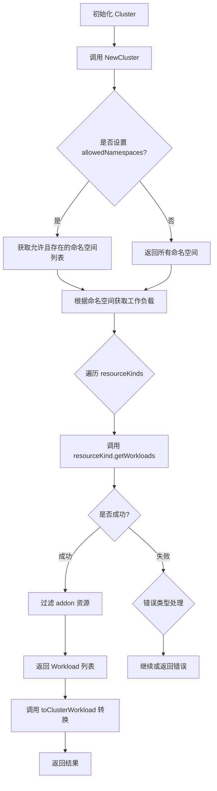

## 类结构

```
类型定义 (Type Aliases)
├── coreClient (k8sclient.Interface)
├── dynamicClient (k8sclientdynamic.Interface)
├── helmOperatorClient (hrclient.Interface)
└── discoveryClient (discovery.DiscoveryInterface)

ExtendedClient (组合客户端)
├── coreClient
├── dynamicClient
├── helmOperatorClient
└── discoveryClient

k8sObject (接口)
├── GetName() string
├── GetNamespace() string
├── GetLabels() map[string]string
└── GetAnnotations() map[string]string

Cluster (核心结构体)
├── 客户端字段
│   ├── client ExtendedClient
│   └── applier Applier
├── 配置字段
│   ├── GC bool
│   ├── DryGC bool
│   └── allowedNamespaces map[string]struct{}
├── 状态字段
│   ├── syncErrors map[resource.ID]error
│   ├── loggedAllowedNS map[string]bool
│   └── imageIncluder cluster.Includer
└── 其他字段
    ├── version string
    ├── logger log.Logger
    ├── sshKeyRing ssh.KeyRing
    └── resourceExcludeList []string

yamlThroughJSON (辅助结构体)
└── toMarshal interface{}
```

## 全局变量及字段


### `coreClient`
    
Kubernetes 核心客户端类型别名

类型：`k8sclient.Interface`
    


### `dynamicClient`
    
Kubernetes 动态客户端类型别名

类型：`k8sclientdynamic.Interface`
    


### `helmOperatorClient`
    
Helm Operator 客户端类型别名

类型：`hrclient.Interface`
    


### `discoveryClient`
    
发现客户端类型别名

类型：`discovery.DiscoveryInterface`
    


### `ExtendedClient.coreClient`
    
Kubernetes 核心客户端

类型：`k8sclient.Interface`
    


### `ExtendedClient.dynamicClient`
    
Kubernetes 动态客户端

类型：`k8sclientdynamic.Interface`
    


### `ExtendedClient.helmOperatorClient`
    
Helm Operator 客户端

类型：`hrclient.Interface`
    


### `ExtendedClient.discoveryClient`
    
发现客户端

类型：`discovery.DiscoveryInterface`
    


### `Cluster.GC`
    
是否执行垃圾回收

类型：`bool`
    


### `Cluster.DryGC`
    
干运行模式的垃圾回收

类型：`bool`
    


### `Cluster.client`
    
组合客户端

类型：`ExtendedClient`
    


### `Cluster.applier`
    
资源应用器

类型：`Applier`
    


### `Cluster.version`
    
版本信息

类型：`string`
    


### `Cluster.logger`
    
日志记录器

类型：`log.Logger`
    


### `Cluster.sshKeyRing`
    
SSH 密钥环

类型：`ssh.KeyRing`
    


### `Cluster.syncErrors`
    
同步错误记录

类型：`map[resource.ID]error`
    


### `Cluster.allowedNamespaces`
    
允许的命名空间

类型：`map[string]struct{}`
    


### `Cluster.loggedAllowedNS`
    
已记录的允许命名空间

类型：`map[string]bool`
    


### `Cluster.imageIncluder`
    
镜像包含器

类型：`cluster.Includer`
    


### `Cluster.resourceExcludeList`
    
资源排除列表

类型：`[]string`
    


### `Cluster.muSyncErrors`
    
同步错误互斥锁

类型：`sync.RWMutex`
    


### `Cluster.loggedAllowedNSLock`
    
命名空间日志互斥锁

类型：`sync.RWMutex`
    


### `Cluster.mu`
    
通用互斥锁

类型：`sync.Mutex`
    


### `yamlThroughJSON.toMarshal`
    
待序列化的对象

类型：`interface{}`
    
    

## 全局函数及方法


### `MakeClusterClientset`

该函数用于创建一个 ExtendedClient 组合客户端，将 Kubernetes 核心客户端、动态客户端、Helm Operator 客户端和发现客户端封装到一个统一的结构体中，方便在集群操作中同时访问多种 Kubernetes API。

参数：

- `core`：`coreClient`（即 `k8sclient.Interface`），Kubernetes 核心客户端，用于访问标准的 Kubernetes 资源（如 Pod、Service、Deployment 等）。
- `dyn`：`dynamicClient`（即 `k8sclientdynamic.Interface`），Kubernetes 动态客户端，用于访问自定义资源（CRD）。
- `helmop`：`helmOperatorClient`（即 `hrclient.Interface`），Helm Operator 客户端，用于管理 Helm Release 等资源。
- `disco`：`discoveryClient`（即 `discovery.DiscoveryInterface`），发现客户端，用于查询集群支持的 API 版本和资源类型。

返回值：`ExtendedClient`，组合了四种 Kubernetes 客户端接口的统一结构体。

#### 流程图

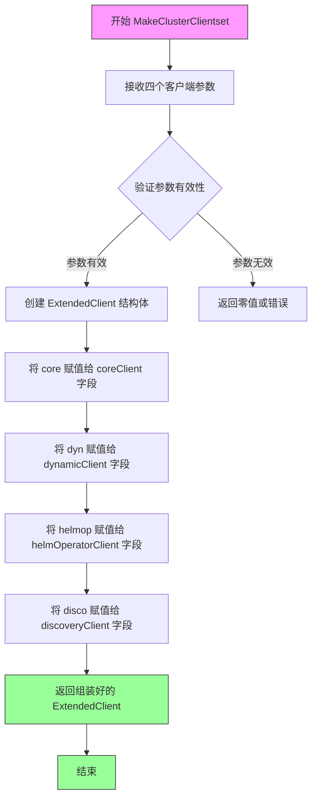

#### 带注释源码

```go
// MakeClusterClientset 创建一个 ExtendedClient 组合客户端
// 参数：
//   - core: Kubernetes 核心客户端接口
//   - dyn: Kubernetes 动态客户端接口
//   - helmop: Helm Operator 客户端接口
//   - disco: Kubernetes 发现客户端接口
//
// 返回值：
//   - ExtendedClient: 包含所有客户端的组合结构体
func MakeClusterClientset(core coreClient, dyn dynamicClient,
	helmop helmOperatorClient, disco discoveryClient) ExtendedClient {

	// 返回一个 ExtendedClient 结构体，将四个客户端封装在一起
	return ExtendedClient{
		coreClient:         core,         // 赋值核心客户端
		dynamicClient:      dyn,          // 赋值动态客户端
		helmOperatorClient: helmop,       // 赋值 Helm Operator 客户端
		discoveryClient:    disco,        // 赋值发现客户端
	}
}
```

#### 相关类型定义

```go
// 定义类型别名，隐藏具体实现细节
type coreClient k8sclient.Interface           // Kubernetes 核心客户端
type dynamicClient k8sclientdynamic.Interface  // Kubernetes 动态客户端
type helmOperatorClient hrclient.Interface      // Helm Operator 客户端
type discoveryClient discovery.DiscoveryInterface // 发现客户端

// ExtendedClient 是一个组合客户端结构体
// 嵌入了四种 Kubernetes 客户端接口
type ExtendedClient struct {
	coreClient           // 嵌入核心客户端
	dynamicClient        // 嵌入动态客户端
	helmOperatorClient   // 嵌入 Helm Operator 客户端
	discoveryClient      // 嵌入发现客户端
}
```

#### 使用场景

该函数通常在初始化 Kubernetes 集群连接时调用，将不同类型的客户端组合成一个统一的对象传递给 `NewCluster` 函数，以便在后续的集群操作中可以方便地访问各种 Kubernetes API。


### `NewCluster`

该函数是Kubernetes集群客户端的工厂方法，用于初始化并返回一个配置完整的Cluster实例。它接收Kubernetes客户端、应用器、SSH密钥环、日志记录器、命名空间过滤规则、镜像包含器和资源排除列表等参数，构建Cluster结构体并设置默认的镜像包含策略（当未指定时使用AlwaysInclude）。

参数：

- `client`：`ExtendedClient`，Kubernetes API客户端的扩展封装，包含core、dynamic、helm-operator和discovery四种客户端
- `applier`：`Applier`，资源应用器，负责将配置好的资源应用到Kubernetes集群
- `sshKeyRing`：`ssh.KeyRing`，SSH密钥环，用于管理GitOps所需的SSH密钥对
- `logger`：`log.Logger`，日志记录器，用于输出集群操作过程中的日志信息
- `allowedNamespaces`：`map[string]struct{}`，允许访问的命名空间集合，空值表示允许所有命名空间
- `imageIncluder`：`cluster.Includer`，镜像过滤器接口，用于决定哪些镜像需要被纳入自动化管理
- `resourceExcludeList`：`[]string`，资源排除列表，用于跳过特定资源的同步

返回值：`*Cluster`，返回初始化完成的Cluster指针，该实例包含了所有必要的配置用于与Kubernetes集群交互

#### 流程图

```mermaid
flowchart TD
    A[开始 NewCluster] --> B{imageIncluder == nil?}
    B -->|是| C[设置 imageIncluder = cluster.AlwaysInclude]
    B -->|否| D[保持原有 imageIncluder]
    C --> E[创建 Cluster 结构体]
    D --> E
    E --> F[设置 client: ExtendedClient]
    F --> G[设置 applier: Applier]
    G --> H[设置 logger: log.Logger]
    H --> I[设置 sshKeyRing: ssh.KeyRing]
    I --> J[设置 allowedNamespaces: map[string]struct{}]
    J --> K[设置 loggedAllowedNS: map[string]bool{}]
    K --> L[设置 imageIncluder: cluster.Includer]
    L --> M[设置 resourceExcludeList: []string]
    M --> N[返回 Cluster 指针]
    N --> O[结束]
```

#### 带注释源码

```go
// NewCluster returns a usable cluster.
// NewCluster是一个工厂函数，用于创建并初始化Cluster实例
// 该函数接收所有必要的依赖项和配置参数，返回一个配置完备的Cluster指针
func NewCluster(client ExtendedClient, applier Applier, sshKeyRing ssh.KeyRing, 
    logger log.Logger, allowedNamespaces map[string]struct{}, 
    imageIncluder cluster.Includer, resourceExcludeList []string) *Cluster {
    
    // 如果未提供imageIncluder，则使用默认的AlwaysInclude策略
    // 这确保了所有镜像都会被纳入自动化管理范围
	if imageIncluder == nil {
		imageIncluder = cluster.AlwaysInclude
	}

    // 构造Cluster结构体，初始化所有字段
	c := &Cluster{
        client:              client,               // Kubernetes API客户端
		applier:             applier,              // 资源同步应用器
		logger:              logger,               // 日志记录器
		sshKeyRing:          sshKeyRing,           // SSH密钥环
		allowedNamespaces:   allowedNamespaces,   // 允许的命名空间映射
		loggedAllowedNS:     map[string]bool{},   // 已记录的命名空间日志（防止重复警告）
		imageIncluder:       imageIncluder,       // 镜像包含策略
		resourceExcludeList: resourceExcludeList, // 资源排除列表
	}

    // 返回初始化完成的Cluster实例
	return c
}
```


### `isAddon`

判断 Kubernetes 对象是否为 addon（插件/附加组件）。该函数通过检查对象是否在 `kube-system` 命名空间以及是否包含特定的标签（`kubernetes.io/cluster-service` 或 `addonmanager.kubernetes.io/mode`）来识别 Kubernetes 原生的 addon 管理器所管理的资源。

参数：

- `obj`：`k8sObject`，一个接口类型，表示任意实现了 GetName、GetNamespace、GetLabels、GetAnnotations 方法的 Kubernetes 对象

返回值：`bool`，如果对象是 addon 则返回 true，否则返回 false

#### 流程图

```mermaid
flowchart TD
    A[开始 isAddon] --> B{obj.GetNamespace == 'kube-system'?}
    B -->|否| C[返回 false]
    B -->|是| D[获取 labels]
    D --> E{labels['kubernetes.io/cluster-service'] == 'true'?}
    E -->|是| F[返回 true]
    E -->|否| G{labels['addonmanager.kubernetes.io/mode'] == 'EnsureExists'?}
    G -->|是| F
    G -->|否| H{labels['addonmanager.kubernetes.io/mode'] == 'Reconcile'?}
    H -->|是| F
    H -->|否| I[返回 false]
```

#### 带注释源码

```go
// isAddon 判断给定的 Kubernetes 对象是否为 addon（插件/附加组件）
// addon 是 Kubernetes 的一种机制，manifest 文件放在 master 的特定目录会被自动应用
// addon manager 会忽略不符合特定条件的资源
func isAddon(obj k8sObject) bool {
	// 条件1：必须在 kube-system 命名空间中
	// 这是 addon 的典型特征，addon 通常部署在系统命名空间
	if obj.GetNamespace() != "kube-system" {
		return false
	}

	// 获取对象的标签，用于进一步判断
	labels := obj.GetLabels()

	// 条件2：必须满足以下标签之一，才会被 addon manager 识别
	// 1. kubernetes.io/cluster-service = "true" (旧版 addon 标签)
	// 2. addonmanager.kubernetes.io/mode = "EnsureExists" (确保存在)
	// 3. addonmanager.kubernetes.io/mode = "Reconcile" (调和/同步)
	if labels["kubernetes.io/cluster-service"] == "true" ||
		labels["addonmanager.kubernetes.io/mode"] == "EnsureExists" ||
		labels["addonmanager.kubernetes.io/mode"] == "Reconcile" {
		return true
	}

	// 不满足任何 addon 条件，返回 false
	return false
}
```


### `MakeClusterClientset`

该函数用于创建一个 `ExtendedClient` 实例，将 Kubernetes 原生客户端、动态客户端、Helm Operator 客户端和发现客户端封装在一起，以便在 Flux 集群操作中统一使用这些客户端。

参数：

- `core`：`coreClient`（即 `k8sclient.Interface`），Kubernetes 原生客户端，用于访问核心 API 资源
- `dyn`：`dynamicClient`（即 `k8sclientdynamic.Interface`），动态客户端，用于访问自定义资源
- `helmop`：`helmOperatorClient`（即 `hrclient.Interface`），Helm Operator 客户端，用于管理 Helm Release 资源
- `disco`：`discoveryClient`（即 `discovery.DiscoveryInterface`），发现客户端，用于查询集群能力信息

返回值：`ExtendedClient`，封装了四个 Kubernetes 客户端的复合结构体，用于后续集群操作

#### 流程图

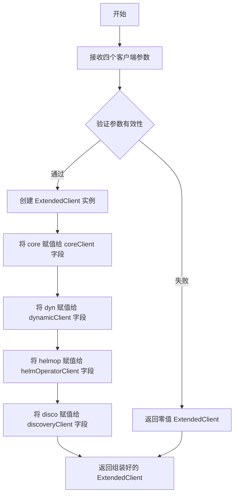

#### 带注释源码

```go
// MakeClusterClientset 创建一个 ExtendedClient 实例
// 该函数将四个独立的 Kubernetes 客户端封装为一个统一的对象
// 参数分别为：
//   - core: Kubernetes 原生客户端，处理核心 API 资源
//   - dyn: 动态客户端，处理 CRD 等自定义资源
//   - helmop: Helm Operator 客户端，处理 Helm Release 资源
//   - disco: 发现客户端，获取集群能力信息
func MakeClusterClientset(core coreClient, dyn dynamicClient,
	helmop helmOperatorClient, disco discoveryClient) ExtendedClient {

	// 使用传入的客户端参数构造并返回一个 ExtendedClient 实例
	return ExtendedClient{
		coreClient:         core,        // 赋值原生客户端
		dynamicClient:      dyn,         // 赋值动态客户端
		helmOperatorClient: helmop,      // 赋值 Helm Operator 客户端
		discoveryClient:    disco,       // 赋值发现客户端
	}
}
```


### `NewCluster`

创建新集群实例，初始化Kubernetes集群对象并设置相关配置

参数：

- `client`：`ExtendedClient`，Kubernetes客户端集合，包含core、dynamic、helmOperator和discovery客户端
- `applier`：`Applier`，用于将资源同步到Kubernetes集群的接口
- `sshKeyRing`：`ssh.KeyRing`，SSH密钥环，用于Git操作时的认证
- `logger`：`log.Logger`，日志记录器
- `allowedNamespaces`：`map[string]struct{}`，允许访问的命名空间映射，用于资源过滤
- `imageIncluder`：`cluster.Includer`，镜像包含器，用于决定哪些镜像应被包含在策略中
- `resourceExcludeList`：`[]string`，资源排除列表，用于跳过特定资源的同步

返回值：`*Cluster`，返回新创建的集群实例指针

#### 流程图

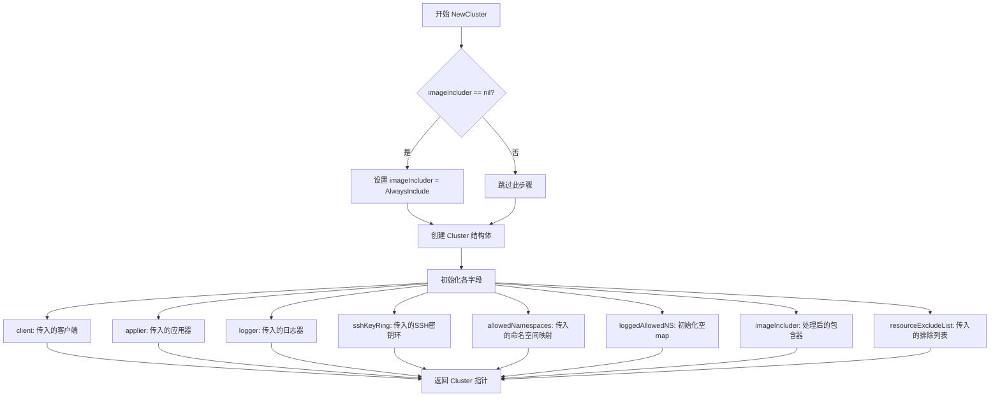

#### 带注释源码

```go
// NewCluster returns a usable cluster.
// NewCluster返回一个可用的集群实例
func NewCluster(client ExtendedClient, applier Applier, sshKeyRing ssh.KeyRing, logger log.Logger, allowedNamespaces map[string]struct{}, imageIncluder cluster.Includer, resourceExcludeList []string) *Cluster {
	// 如果没有提供imageIncluder，使用默认的AlwaysInclude策略
	// AlwaysInclude意味着所有镜像都会被包含在镜像策略中
	if imageIncluder == nil {
		imageIncluder = cluster.AlwaysInclude
	}

	// 创建并初始化Cluster结构体实例
	c := &Cluster{
		client:              client,              // Kubernetes API客户端
		applier:             applier,              // 资源同步应用器
		logger:              logger,               // 日志记录器
		sshKeyRing:          sshKeyRing,           // SSH密钥环用于Git认证
		allowedNamespaces:   allowedNamespaces,   // 允许访问的命名空间集合
		loggedAllowedNS:     map[string]bool{},   // 已记录的命名空间日志，避免重复警告
		imageIncluder:       imageIncluder,        // 镜像包含策略
		resourceExcludeList: resourceExcludeList, // 要排除的资源列表
	}

	// 返回新创建的集群实例指针
	return c
}
```


### `Cluster.SomeWorkloads`

获取指定的一组工作负载，返回满足条件的工作负载列表。该方法遍历传入的资源ID列表，检查每个资源是否在允许的命名空间中，然后从Kubernetes集群中获取对应的工作负载信息，同时过滤掉addon资源并附加同步错误状态。

参数：

- `ctx`：`context.Context`，请求的上下文，用于控制超时和取消
- `ids`：`[]resource.ID`，需要获取的工作负载资源ID列表

返回值：`([]cluster.Workload, error)`，返回符合条件的工作负载切片和可能的错误。返回的工作负载可能不按请求的顺序排列。

#### 流程图

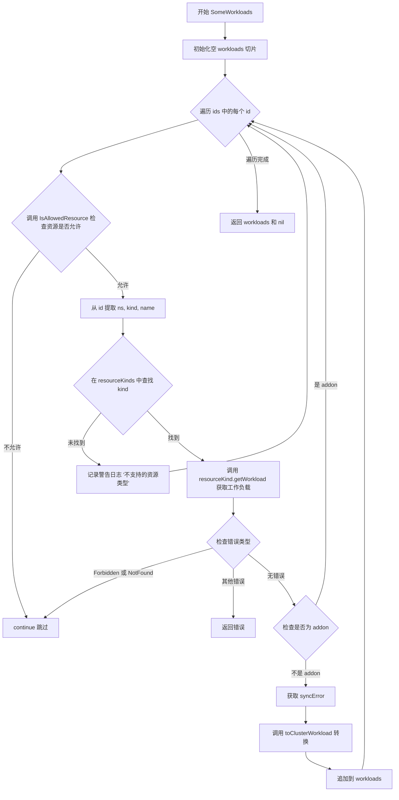

#### 带注释源码

```go
// SomeWorkloads returns the workloads named, missing out any that don't
// exist in the cluster or aren't in an allowed namespace.
// They do not necessarily have to be returned in the order requested.
func (c *Cluster) SomeWorkloads(ctx context.Context, ids []resource.ID) (res []cluster.Workload, err error) {
    // 初始化用于存储符合条件的工作负载的切片
    var workloads []cluster.Workload
    
    // 遍历传入的每一个资源ID
    for _, id := range ids {
        // 检查该资源是否在允许的命名空间列表中
        // 如果不在允许列表中，则跳过该资源
        if !c.IsAllowedResource(id) {
            continue
        }
        
        // 从资源ID中分解出命名空间、资源类型和名称
        ns, kind, name := id.Components()

        // 在预定义的资源类型映射表中查找对应的资源类型处理程序
        resourceKind, ok := resourceKinds[kind]
        if !ok {
            // 如果资源类型不支持，记录警告日志并跳过
            c.logger.Log("warning", "automation of this resource kind is not supported", "resource", id)
            continue
        }

        // 调用资源类型的getWorkload方法从集群获取具体工作负载
        workload, err := resourceKind.getWorkload(ctx, c, ns, name)
        if err != nil {
            // 如果是权限不足或资源不存在的错误，跳过该资源继续处理下一个
            if apierrors.IsForbidden(err) || apierrors.IsNotFound(err) {
                continue
            }
            // 其他错误直接返回
            return nil, err
        }

        // 过滤掉Kubernetes addon资源（由addon manager管理的资源）
        if !isAddon(workload) {
            // 从同步错误映射中获取该资源对应的同步错误
            c.muSyncErrors.RLock()
            workload.syncError = c.syncErrors[id]
            c.muSyncErrors.RUnlock()
            
            // 将工作负载转换为集群工作负载格式并添加到结果切片
            workloads = append(workloads, workload.toClusterWorkload(id))
        }
    }
    
    // 返回所有符合条件的工作负载
    return workloads, nil
}
```


### `Cluster.AllWorkloads`

获取所有工作负载，返回所有在允许的命名空间中且符合条件的工作负载列表（如果 `restrictToNamespace` 参数为空，则返回所有命名空间中的工作负载）

参数：

- `ctx`：`context.Context`，上下文对象，用于控制请求的取消和超时
- `restrictToNamespace`：`string`，可选的命名空间限制参数，如果为空则表示获取所有命名空间的工作负载

返回值：`([]cluster.Workload, error)`，返回工作负载列表和可能的错误

#### 流程图

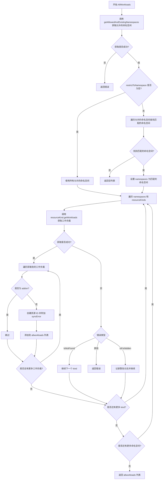

#### 带注释源码

```go
// AllWorkloads returns all workloads in allowed namespaces matching the criteria; that is, in
// the namespace (or any namespace if that argument is empty)
// AllWorkloads 返回所有在允许的命名空间中且符合条件的工作负载；如果参数为空，则返回所有命名空间中的工作负载
func (c *Cluster) AllWorkloads(ctx context.Context, restrictToNamespace string) (res []cluster.Workload, err error) {
	// 首先获取集群中允许且存在的命名空间列表
	allowedNamespaces, err := c.getAllowedAndExistingNamespaces(ctx)
	if err != nil {
		// 如果获取命名空间失败，包装错误并返回
		return nil, errors.Wrap(err, "getting namespaces")
	}
	// Those are the allowed namespaces (possibly just [<all of them>];
	// now intersect with the restriction requested, if any.
	// 上述是允许的命名空间列表（可能是全部），现在与请求的限制进行交集处理
	namespaces := allowedNamespaces
	if restrictToNamespace != "" {
		// 如果指定了命名空间限制，则遍历允许的命名空间查找匹配项
		namespaces = nil
		for _, ns := range allowedNamespaces {
			// 如果允许的命名空间是全部或者与限制的命名空间匹配
			if ns == meta_v1.NamespaceAll || ns == restrictToNamespace {
				namespaces = []string{restrictToNamespace}
				break
			}
		}
	}

	// 初始化工作负载列表
	var allworkloads []cluster.Workload
	// 遍历所有命名空间
	for _, ns := range namespaces {
		// 遍历所有资源类型
		for kind, resourceKind := range resourceKinds {
			// 获取该命名空间下指定类型的所有工作负载
			workloads, err := resourceKind.getWorkloads(ctx, c, ns)
			if err != nil {
				switch {
				case apierrors.IsNotFound(err):
					// Kind not supported by API server, skip
					// API 服务器不支持该资源类型，跳过
					continue
				case apierrors.IsForbidden(err):
					// K8s can return forbidden instead of not found for non super admins
					// 对于非超级管理员，K8s 可能返回 forbidden 而不是 not found
					c.logger.Log("warning", "not allowed to list resources", "err", err)
					continue
				default:
					// 其他错误直接返回
					return nil, err
				}
			}

			// 遍历获取到的每个工作负载
			for _, workload := range workloads {
				// 过滤掉 addon 类型的资源
				if !isAddon(workload) {
					// 创建资源 ID
					id := resource.MakeID(workload.GetNamespace(), kind, workload.GetName())
					// 获取该资源在同步过程中的错误
					c.muSyncErrors.RLock()
					workload.syncError = c.syncErrors[id]
					c.muSyncErrors.RUnlock()
					// 转换为 cluster.Workload 并添加到列表
					allworkloads = append(allworkloads, workload.toClusterWorkload(id))
				}
			}
		}
	}

	// 返回所有工作负载
	return allworkloads, nil
}
```


### `Cluster.setSyncErrors`

设置同步错误，将传入的错误列表更新到 Cluster 的内部错误映射中，用于记录 Git 到集群同步过程中每个资源发生的错误。

参数：

-  `errs`：`cluster.SyncError`，同步错误列表，包含资源 ID 和对应错误的映射

返回值：`无`（`void`），该方法没有返回值

#### 流程图

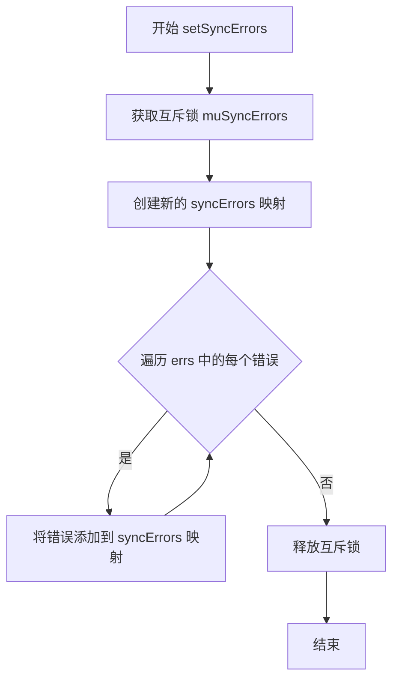

#### 带注释源码

```go
// setSyncErrors 设置同步错误列表
// 参数 errs: cluster.SyncError 类型，包含资源ID到错误的映射
// 该方法会更新 Cluster 结构体中的 syncErrors 字段
func (c *Cluster) setSyncErrors(errs cluster.SyncError) {
	// 获取写锁，确保并发安全
	c.muSyncErrors.Lock()
	// defer 确保锁会被释放，即使发生 panic
	defer c.muSyncErrors.Unlock()
	
	// 重新初始化 syncErrors 映射，清空之前的错误记录
	c.syncErrors = make(map[resource.ID]error)
	
	// 遍历传入的错误列表，将每个资源的错误存储到映射中
	for _, e := range errs {
		// e.ResourceID 是资源的唯一标识
		// e.Error 是该资源同步时发生的错误
		c.syncErrors[e.ResourceID] = e.Error
	}
}
```


### `Cluster.Ping()`

检查集群连接是否正常，通过调用 Kubernetes API Server 的版本信息接口来验证集群是否可达。

参数：
- 该方法没有参数。

返回值：`error`，如果集群连接失败（如无法访问 API Server 或权限不足），则返回错误；否则返回 nil 表示连接正常。

#### 流程图

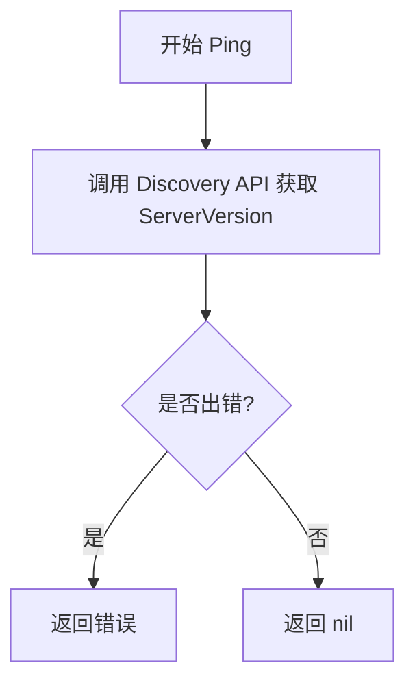

#### 带注释源码

```go
// Ping 检查集群连接是否正常
// 它通过调用 Kubernetes API Server 的 Discovery 接口来获取服务器版本信息
// 如果无法连接或权限不足，会返回相应的错误
func (c *Cluster) Ping() error {
	// 使用 coreClient 的 Discovery 方法调用 Kubernetes API Server 的 /version 端点
	// ServerVersion 返回 API Server 的版本信息（如 GitVersion、Platform 等）
	// 如果 API Server 不可达或请求被拒绝，err 会包含错误信息
	_, err := c.client.coreClient.Discovery().ServerVersion()
	// 直接返回错误，如果 err 为 nil 表示连接成功
	return err
}
```


### `Cluster.Export(ctx)`

导出集群资源为 YAML 格式。该方法遍历所有允许的命名空间，获取每个命名空间及其内部的工作负载资源（如 Deployment、DaemonSet、StatefulSet、Job、CronJob、Pod 等），并将其序列化为标准的 Kubernetes YAML 格式输出。

参数：

- `ctx`：`context.Context`，用于控制请求的截止时间、取消等上下文信息

返回值：

- `[]byte`，返回导出后的 YAML 格式字节数组
- `error`，返回在获取资源或序列化过程中发生的错误

#### 流程图

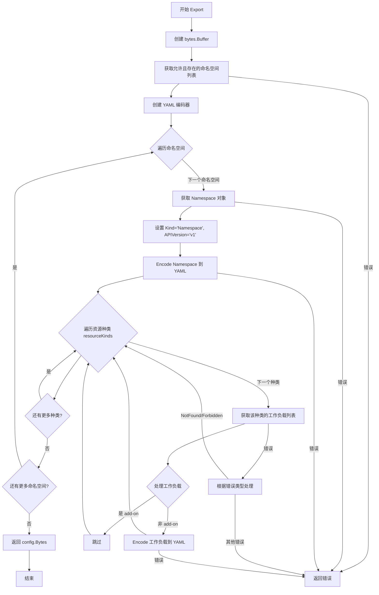

#### 带注释源码

```go
// Export exports cluster resources
// 导出集群资源为 YAML 格式的字节数组
func (c *Cluster) Export(ctx context.Context) ([]byte, error) {
    // 创建一个字节缓冲区用于存储最终的 YAML 输出
    var config bytes.Buffer

    // 获取当前集群中允许访问且实际存在的命名空间列表
    // 如果 Cluster 配置了 allowedNamespaces，则只返回这些命名空间
    // 否则返回所有命名空间
    namespaces, err := c.getAllowedAndExistingNamespaces(ctx)
    if err != nil {
        // 如果获取命名空间失败，包装错误并返回
        return nil, errors.Wrap(err, "getting namespaces")
    }

    // 创建 YAML 编码器，输出到 config 缓冲区
    encoder := yaml.NewEncoder(&config)
    // 确保方法返回前关闭编码器，释放资源
    defer encoder.Close()

    // 遍历所有允许的命名空间
    for _, ns := range namespaces {
        // 从 Kubernetes API 获取指定命名空间的完整信息
        namespace, err := c.client.CoreV1().Namespaces().Get(ctx, ns, meta_v1.GetOptions{})
        if err != nil {
            return nil, err
        }

        // 手动设置 Kind 和 APIVersion，因为从 API 获取的资源不包含这些元数据类型信息
        // 这是生成有效 Kubernetes YAML 所必需的
        namespace.Kind = "Namespace"
        namespace.APIVersion = "v1"

        // 使用自定义的 yamlThroughJSON 类型进行 YAML 编码
        // 该类型实现了 MarshalYAML 接口，通过 JSON 作为中间格式进行转换
        err = encoder.Encode(yamlThroughJSON{namespace})
        if err != nil {
            return nil, errors.Wrap(err, "marshalling namespace to YAML")
        }

        // 遍历所有支持的资源种类（如 Deployment、DaemonSet 等）
        for _, resourceKind := range resourceKinds {
            // 获取当前命名空间下指定种类的所有工作负载
            workloads, err := resourceKind.getWorkloads(ctx, c, ns)
            if err != nil {
                switch {
                case apierrors.IsNotFound(err):
                    // 资源种类在当前 API 服务器上不支持，跳过
                    continue
                case apierrors.IsForbidden(err):
                    // 对于非超级管理员，K8s 可能返回 Forbidden 而非 NotFound
                    c.logger.Log("warning", "not allowed to list resources", "err", err)
                    continue
                default:
                    return nil, err
                }
            }

            // 遍历每个工作负载
            for _, pc := range workloads {
                // 跳过 Kubernetes Add-on 资源，这些由 Add-on Manager 管理
                // 不应该通过 GitOps 或其他方式同步
                if !isAddon(pc) {
                    // 将工作负载的 k8sObject 编码为 YAML
                    // 注意：这里只导出原始的 k8sObject，不包含 syncError 等额外信息
                    if err := encoder.Encode(yamlThroughJSON{pc.k8sObject}); err != nil {
                        return nil, err
                    }
                }
            }
        }
    }
    // 返回完整的 YAML 内容作为字节数组
    return config.Bytes(), nil
}
```


### `Cluster.PublicSSHKey`

该方法用于获取 SSH 公钥，支持可选的密钥重新生成功能。

参数：

- `regenerate`：`bool`，指示是否需要重新生成 SSH 密钥

返回值：

- `ssh.PublicKey`，返回当前的 SSH 公钥
- `error`，操作过程中可能发生的错误

#### 流程图

```mermaid
flowchart TD
    A[开始] --> B{regenerate == true?}
    B -->|是| C[调用 c.sshKeyRing.Regenerate]
    C --> D{是否有错误?}
    D -->|是| E[返回 ssh.PublicKey{} 和错误]
    D -->|否| F[调用 c.sshKeyRing.KeyPair]
    B -->|否| F
    F --> G[返回 publicKey, nil]
    E --> H[结束]
    G --> H
```

#### 带注释源码

```go
// PublicSSHKey 返回 SSH 公钥，可选择是否重新生成密钥
// 参数：
//   - regenerate: bool 是否重新生成密钥
//
// 返回值：
//   - ssh.PublicKey: SSH 公钥
//   - error: 可能的错误
func (c *Cluster) PublicSSHKey(regenerate bool) (ssh.PublicKey, error) {
	// 如果需要重新生成密钥
	if regenerate {
		// 调用密钥环的重新生成方法
		if err := c.sshKeyRing.Regenerate(); err != nil {
			// 如果重新生成失败，返回空公钥和错误
			return ssh.PublicKey{}, err
		}
	}
	// 从密钥环获取密钥对，返回公钥部分
	publicKey, _ := c.sshKeyRing.KeyPair()
	// 返回公钥（忽略 KeyPair 返回的错误，假设密钥已存在）
	return publicKey, nil
}
```


### `Cluster.getAllowedAndExistingNamespaces`

获取允许且存在的命名空间列表。该方法首先检查 Cluster 实例是否配置了允许的命名空间（allowedNamespaces），如果有，则遍历这些命名空间，通过 Kubernetes API 验证每个命名空间是否存在且可访问，返回存在的命名空间列表；如果没有配置允许的命名空间，则返回所有命名空间（meta_v1.NamespaceAll）。

参数：

- `ctx`：`context.Context`，请求的上下文，用于控制超时和取消

返回值：

- `[]string`：允许且存在的命名空间名称列表
- `error`：执行过程中发生的错误（如上下文取消、API 错误等）

#### 流程图

```mermaid
flowchart TD
    A[开始 getAllowedAndExistingNamespaces] --> B{len(c.allowedNamespaces) > 0?}
    B -->|是| C[初始化空 nsList]
    C --> D[遍历 allowedNamespaces]
    D --> E{ctx.Err() != nil?}
    E -->|是| F[返回 ctx.Err]
    E -->|否| G[调用 API 获取命名空间]
    G --> H{err == nil?}
    H -->|是| I[重置 loggedAllowedNS 标志]
    I --> J[将 ns.Name 添加到 nsList]
    J --> K{还有更多命名空间?}
    K -->|是| D
    K -->|否| L[返回 nsList, nil]
    H -->|否| M{IsUnauthorized 或 IsForbidden 或 IsNotFound?}
    M -->|是| N{getLoggedAllowedNS?}
    N -->|否| O[记录警告日志]
    O --> P[设置 loggedAllowedNS 为 true]
    P --> K
    N -->|是| K
    M -->|否| Q[返回 nil, err]
    B -->|否| R{ctx.Err() != nil?}
    R -->|是| F
    R -->|否| S[返回 []string{meta_v1.NamespaceAll}, nil]
```

#### 带注释源码

```go
// getAllowedAndExistingNamespaces 返回 Flux 实例应该有权访问并可以查找资源的现有命名空间列表。
// 如果在 Cluster 实例上设置了允许的命名空间列表，则返回该列表与实际存在命名空间的交集；
// 如果没有设置，则返回所有命名空间。
func (c *Cluster) getAllowedAndExistingNamespaces(ctx context.Context) ([]string, error) {
    // 如果配置了允许的命名空间列表，则遍历检查每个命名空间是否存在
    if len(c.allowedNamespaces) > 0 {
        nsList := []string{}
        for name, _ := range c.allowedNamespaces {
            // 检查上下文是否已取消或超时
            if err := ctx.Err(); err != nil {
                return nil, err
            }
            // 调用 Kubernetes API 获取命名空间对象
            ns, err := c.client.CoreV1().Namespaces().Get(ctx, name, meta_v1.GetOptions{})
            switch {
            case err == nil:
                // 命名空间存在且可访问，重置日志标志以便未来若命名空间消失可以重新记录
                c.updateLoggedAllowedNS(name, false)
                nsList = append(nsList, ns.Name)
            // 如果出现未授权、禁止访问或不存在错误，记录一次警告后继续
            case apierrors.IsUnauthorized(err) || apierrors.IsForbidden(err) || apierrors.IsNotFound(err):
                if !c.getLoggedAllowedNS(name) {
                    c.logger.Log("warning", "cannot access allowed namespace",
                        "namespace", name, "err", err)
                    c.updateLoggedAllowedNS(name, true)
                }
            // 其他错误直接返回
            default:
                return nil, err
            }
        }
        return nsList, nil
    }

    // 没有配置允许的命名空间，检查上下文后返回所有命名空间
    if err := ctx.Err(); err != nil {
        return nil, err
    }
    return []string{meta_v1.NamespaceAll}, nil
}
```


### `Cluster.updateLoggedAllowedNS`

更新命名空间日志状态，用于记录是否已经对某个允许的命名空间记录过警告信息，以避免重复记录相同的警告。

参数：

- `key`：`string`，命名空间名称，作为 map 的键
- `value`：`bool`，日志状态标记，true 表示已记录过警告，false 表示重置状态

返回值：无（`void`），该方法直接修改 `Cluster` 结构体中的 `loggedAllowedNS` 映射，不返回任何值。

#### 流程图

```mermaid
flowchart TD
    A[开始] --> B[获取写锁 loggedAllowedNSLock]
    B --> C{获取锁成功}
    C -->|是| D[设置 loggedAllowedNS[key] = value]
    D --> E[延迟释放锁]
    E --> F[结束]
    C -->|否| G[等待锁...]
    G --> B
```

#### 带注释源码

```go
// updateLoggedAllowedNS 更新命名空间日志状态
// 该方法用于记录或重置某个命名空间的日志标记
// key: 命名空间名称
// value: 日志状态，true 表示已记录过警告，false 表示重置状态
func (c *Cluster) updateLoggedAllowedNS(key string, value bool) {
	// 获取写锁，确保并发安全地修改 loggedAllowedNS 映射
	c.loggedAllowedNSLock.Lock()
	// defer 确保锁会被及时释放，即使发生异常
	defer c.loggedAllowedNSLock.Unlock()

	// 更新指定命名空间的日志状态
	c.loggedAllowedNS[key] = value
}
```


### `Cluster.getLoggedAllowedNS`

获取命名空间日志状态，用于检查特定命名空间是否已经记录过日志（即是否已经输出过警告信息），避免重复输出相同命名空间的访问警告。

参数：

- `key`：`string`，命名空间键，用于查询该命名空间的日志记录状态

返回值：`bool`，返回 true 表示该命名空间的问题已经记录过日志，false 表示尚未记录

#### 流程图

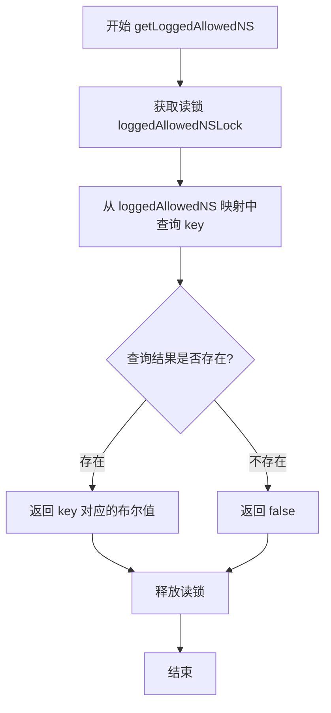

#### 带注释源码

```go
// getLoggedAllowedNS 获取命名空间日志状态
// 参数 key: string 类型，表示命名空间的名称键
// 返回值: bool 类型，表示该命名空间是否已经记录过日志问题
func (c *Cluster) getLoggedAllowedNS(key string) bool {
	// 获取读锁，用于并发安全地读取 loggedAllowedNS 映射
	c.loggedAllowedNSLock.RLock()
	// 确保函数返回前释放锁
	defer c.loggedAllowedNSLock.RUnlock()

	// 从映射中查询指定命名空间的日志记录状态
	// 返回 true 表示已经记录过警告，false 表示尚未记录
	return c.loggedAllowedNS[key]
}
```


### `Cluster.IsAllowedResource`

该方法用于检查给定的资源是否在允许的命名空间列表中，以确定是否允许对该资源进行操作。它支持集群范围的资源以及命名空间范围的资源，并根据配置白名单进行访问控制。

参数：

- `id`：`resource.ID`，需要检查的资源标识符，包含命名空间、种类和名称信息。

返回值：`bool`，返回 `true` 表示该资源在允许的命名空间列表中，可以进行操作；返回 `false` 表示该资源不在允许列表中，应被忽略。

#### 流程图

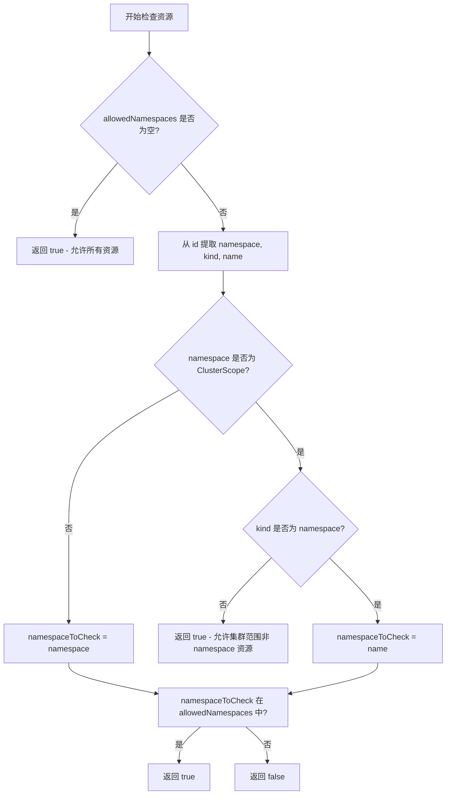

#### 带注释源码

```go
// IsAllowedResource 检查给定的资源是否在允许的命名空间列表中
// 参数 id: 资源的唯一标识符，包含命名空间、种类和名称信息
// 返回值: 如果允许访问该资源则返回 true，否则返回 false
func (c *Cluster) IsAllowedResource(id resource.ID) bool {
	// 如果没有配置允许的命名空间列表，则默认允许所有资源
	if len(c.allowedNamespaces) == 0 {
		// All resources are allowed when all namespaces are allowed
		return true
	}

	// 从资源 ID 中解析出命名空间、种类和名称
	namespace, kind, name := id.Components()
	namespaceToCheck := namespace

	// 处理集群范围的资源（非命名空间范围的资源）
	if namespace == kresource.ClusterScope {
		// 所有集群范围的资源（不是 namespace 类型的）默认允许访问
		// All cluster-scoped resources (not namespaced) are allowed ...
		if kind != "namespace" {
			return true
		}
		// ... 除了 namespace 资源本身，其名称需要显式配置在允许列表中
		// ... except namespaces themselves, whose name needs to be explicitly allowed
		namespaceToCheck = name
	}

	// 检查目标命名空间是否在允许的命名空间映射中
	_, ok := c.allowedNamespaces[namespaceToCheck]
	return ok
}
```


### `yamlThroughJSON.MarshalYAML`

该方法实现了 `yaml.Marshaler` 接口，通过将对象先序列化为 JSON 再反序列化为 YAML 兼容对象的方式，实现从对象到 YAML 格式的转换，利用 JSON 作为中间介质来处理 YAML 中的特殊类型（如日期、null 等）。

参数：

- `y`：`yamlThroughJSON`，方法接收者，包含待序列化的对象

返回值：`interface{}`，返回可用于 YAML 编码的对象；`error`，转换过程中出现的错误（如 JSON 序列化失败或 YAML 反序列化失败）

#### 流程图

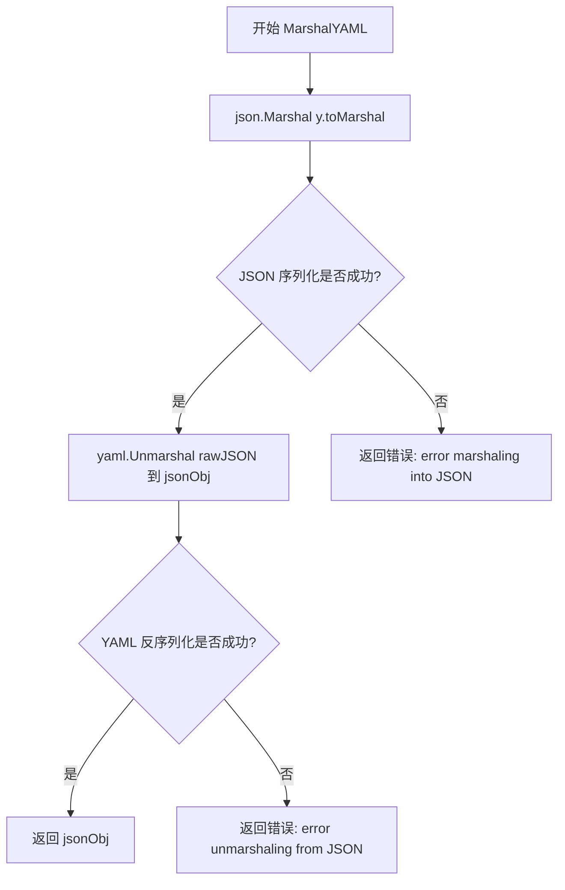

#### 带注释源码

```go
// yamlThroughJSON 是一个适配器结构体，用于通过 JSON 中间格式实现 YAML 序列化
type yamlThroughJSON struct {
	toMarshal interface{} // 要序列化为 YAML 的对象
}

// MarshalYAML 实现了 yaml.Marshaler 接口，将对象转换为 YAML 兼容的对象
// 实现思路：先将对象序列化为 JSON，再将 JSON 反序列化为 YAML 兼容的 Go 对象
// 这样可以正确处理 YAML 中的特殊类型（如 null、时间戳等）
func (y yamlThroughJSON) MarshalYAML() (interface{}, error) {
	// 步骤 1: 将对象序列化为 JSON 字节切片
	rawJSON, err := json.Marshal(y.toMarshal)
	if err != nil {
		// JSON 序列化失败时返回错误
		return nil, fmt.Errorf("error marshaling into JSON: %s", err)
	}

	// 步骤 2: 声明一个通用接口用于接收反序列化结果
	var jsonObj interface{}

	// 步骤 3: 将 JSON 字节反序列化为 YAML 兼容的对象
	// yaml.Unmarshal 会将 JSON 对象转换为 YAML 兼容的 map/array/基础类型
	if err = yaml.Unmarshal(rawJSON, &jsonObj); err != nil {
		// YAML 反序列化失败时返回错误
		return nil, fmt.Errorf("error unmarshaling from JSON: %s", err)
	}

	// 步骤 4: 返回可用于 YAML 编码的对象
	return jsonObj, nil
}
```

### 关键组件信息

- **名称**：`yamlThroughJSON`
- **描述**：适配器结构体，通过 JSON 中间介质实现 YAML 序列化功能的包装类型

### 潜在的技术债务或优化空间

1. **双重序列化开销**：该方法涉及两次编组（JSON 编码）和一次反编码（YAML 解码），在大规模资源导出场景下可能带来性能问题
2. **错误信息不够具体**：返回的错误仅包含错误类型，缺少上下文信息（如对象类型、具体字段等）
3. **类型信息丢失**：通过 `interface{}` 中间转换可能导致原始类型信息丢失，某些复杂类型可能无法正确还原
4. **缺少缓存机制**：对于相同对象的重复序列化，每次都需要重新执行完整的转换流程

## 关键组件


### ExtendedClient

封装多个Kubernetes客户端接口的复合客户端，包含coreClient（核心API）、dynamicClient（动态API）、helmOperatorClient（Helm Operator）和discoveryClient（发现接口），用于统一提供Kubernetes各种API的访问能力。

### Cluster

核心集群管理结构体，负责与Kubernetes API服务器交互，实现资源同步、垃圾回收、工作负载查询、命名空间过滤等功能，是Flux对集群进行操作的主要入口。

### k8sObject接口

定义Kubernetes资源对象的通用元数据访问接口，包含GetName、GetNamespace、GetLabels、GetAnnotations方法，是识别和处理Kubernetes资源的基础抽象。

### isAddon函数

识别Kubernetes Add-on资源的辅助函数，通过检查命名空间为kube-system及特定标签（kubernetes.io/cluster-service或addonmanager.kubernetes.io/mode）来判断资源是否为系统add-on，以避免Flux误管理这些由addon manager控制的资源。

### yamlThroughJSON结构体

自定义YAML序列化辅助类型，通过将对象先序列化为JSON再反序列化为YAML的方式，实现更友好的YAML输出格式，用于Export功能中的资源导出。

### SomeWorkloads方法

根据给定的资源ID列表查询对应工作负载的方法，包含命名空间过滤、资源类型映射、权限错误处理、add-on过滤和同步错误关联等逻辑。

### AllWorkloads方法

查询所有允许命名空间下工作负载的方法，支持命名空间过滤限制，遍历所有资源类型并收集符合条件的工作负载，包含完整的错误处理和add-on过滤机制。

### Export方法

导出集群资源为YAML格式的方法，遍历所有允许的命名空间，导出Namespace和各类工作负载资源，使用yamlThroughJSON进行格式转换。

### getAllowedAndExistingNamespaces方法

获取Flux实例有权访问的现有命名空间列表，如果没有设置allowedNamespaces则返回所有命名空间，处理各种API错误并记录警告日志。

### IsAllowedResource方法

检查给定资源是否在允许的命名空间内的方法，处理集群级别资源（ClusterScope）的特殊逻辑，验证资源所属命名空间是否在允许列表中。

### setSyncErrors方法

线程安全地更新同步错误映射的方法，使用互斥锁保护syncErrors map的并发访问，将集群级别的同步错误记录到本地缓存。

### PublicSSHKey方法

获取SSH公钥的方法，支持可选的密钥对重新生成，用于Flux的Git SSH认证机制。

### Ping方法

健康检查方法，通过调用Discovery API的ServerVersion验证集群连接性。


## 问题及建议


### 已知问题

- **类型别名使用不当**：使用 `type coreClient k8sclient.Interface` 等类型别名而非直接使用接口或自定义接口，降低了代码的可测试性和可替换性。
- **硬编码字符串缺乏灵活性**：add-on 判断逻辑中的标签和命名空间值（如 `"kube-system"`, `"kubernetes.io/cluster-service"`, `"addonmanager.kubernetes.io/mode"`）被硬编码，无法通过配置自定义。
- **错误处理逻辑不一致**：在 `SomeWorkloads` 和 `AllWorkloads` 中，对于 `apierrors.IsForbidden` 和 `apierrors.IsNotFound` 的处理方式不同，可能导致行为不一致。
- **并发控制潜在性能瓶颈**：使用 `sync.RWMutex` 保护 `syncErrors`、`loggedAllowedNS` 等字段，在高频访问场景下可能导致锁竞争。
- **资源导出效率低下**：`Export` 方法遍历所有命名空间和资源类型，逐个获取并编码，在大规模集群中可能产生大量 API 调用。
- **上下文取消检查不完整**：`getAllowedAndExistingNamespaces` 中只在循环外部和部分位置检查 `ctx.Err()`，循环内部未充分检查，可能导致不必要的 API 调用。
- **日志记录缺少关键上下文**：日志中缺少请求追踪信息（如 correlation ID），在分布式调试时难以关联请求链路。
- **命名空间检查逻辑复杂**：`IsAllowedResource` 方法对集群作用域资源的处理逻辑嵌套较深，可读性和可维护性较差。

### 优化建议

- **引入配置结构体**：将硬编码的 add-on 标签和命名空间值提取到配置结构体中，通过构造函数注入。
- **统一错误处理策略**：定义明确的错误处理策略，确保在各类方法中对相同类型的错误处理方式一致。
- **减少锁竞争**：考虑使用原子操作或分段锁优化并发访问，或将只读数据在初始化时固化。
- **批量获取资源**：在 `Export` 和 `AllWorkloads` 中使用 `List` 而非多次 `Get`，或引入客户端缓存减少 API 调用。
- **完善上下文取消**：在所有循环和 API 调用路径上统一检查 `ctx.Err()`，及时取消操作。
- **增强日志上下文**：在日志中添加请求级别的追踪信息，便于问题排查。
- **简化条件逻辑**：将 `IsAllowedResource` 中的复杂条件拆分为多个小方法，提高可读性。
- **使用接口替代具体类型**：为客户端定义接口，便于单元测试时使用 mock。

## 其它


### 一段话描述

这是一个Flux项目的Kubernetes集群客户端库，封装了对Kubernetes API的访问，提供了工作负载查询、资源导出、命名空间管理、同步错误记录等功能，支持通过SSH密钥进行认证，并实现了对Kubernetes插件（add-ons）的识别和过滤。

### 文件的整体运行流程

该代码文件主要处理以下流程：初始化时通过`MakeClusterClientset`创建包含多种Kubernetes客户端的`ExtendedClient`，然后通过`NewCluster`创建`Cluster`实例。运行时通过`SomeWorkloads`或`AllWorkloads`获取指定或所有工作负载，调用相应的`resourceKind.getWorkload/getWorkloads`方法遍历不同资源类型。导出流程`Export`遍历所有允许的命名空间和资源类型，将资源序列化为YAML格式。同步过程中记录的错误通过`setSyncErrors`存储，支持后续查询。命名空间管理通过`getAllowedAndExistingNamespaces`获取授权访问的命名空间列表。

### 类的详细信息

### ExtendedClient

**描述**: 扩展的Kubernetes客户端集合，封装了四种Kubernetes客户端接口

**类字段**:

- coreClient: coreClient类型 - Kubernetes核心API客户端
- dynamicClient: dynamicClient类型 - 动态资源客户端
- helmOperatorClient: helmOperatorClient类型 - Helm Operator客户端
- discoveryClient: discoveryClient类型 - API发现客户端

**类方法**:

#### MakeClusterClientset

参数: core (coreClient类型, Kubernetes核心客户端), dyn (dynamicClient类型, 动态客户端), helmop (helmOperatorClient类型, Helm Operator客户端), disco (discoveryClient类型, 发现客户端)

返回值: ExtendedClient类型, 返回组合后的扩展客户端

方法实现: 创建并返回包含所有客户端的ExtendedClient实例

源码:
```go
func MakeClusterClientset(core coreClient, dyn dynamicClient,
	helmop helmOperatorClient, disco discoveryClient) ExtendedClient {

	return ExtendedClient{
		coreClient:         core,
		dynamicClient:      dyn,
		helmOperatorClient: helmop,
		discoveryClient:    disco,
	}
}
```

### Cluster

**描述**: Kubernetes集群的主要操作类，提供了与Kubernetes API交互的各种方法

**类字段**:

- GC: bool类型 - 是否在同步时执行垃圾回收
- DryGC: bool类型 - 是否干运行垃圾回收（不实际执行）
- client: ExtendedClient类型 - Kubernetes客户端集合
- applier: Applier类型 - 资源应用器
- version: string类型 - 版本命令的字符串响应
- logger: log.Logger类型 - 日志记录器
- sshKeyRing: ssh.KeyRing类型 - SSH密钥环
- syncErrors: map[resource.ID]error类型 - 同步期间每个资源的错误记录
- muSyncErrors: sync.RWMutex类型 - syncErrors的读写锁
- allowedNamespaces: map[string]struct{}类型 - 允许访问的命名空间映射
- loggedAllowedNS: map[string]bool类型 - 记录是否已记录过允许命名空间的问题
- loggedAllowedNSLock: sync.RWMutex类型 - loggedAllowedNS的读写锁
- imageIncluder: cluster.Includer类型 - 镜像包含器
- resourceExcludeList: []string类型 - 资源排除列表
- mu: sync.Mutex类型 - 互斥锁

**类方法**:

#### NewCluster

参数: client (ExtendedClient类型, 扩展客户端), applier (Applier类型, 资源应用器), sshKeyRing (ssh.KeyRing类型, SSH密钥环), logger (log.Logger类型, 日志记录器), allowedNamespaces (map[string]struct{}类型, 允许的命名空间), imageIncluder (cluster.Includer类型, 镜像包含器), resourceExcludeList ([]string类型, 资源排除列表)

返回值: *Cluster类型, 返回新创建的集群实例

方法实现: 初始化Cluster结构体，如果imageIncluder为nil则使用默认的AlwaysInclude

源码:
```go
func NewCluster(client ExtendedClient, applier Applier, sshKeyRing ssh.KeyRing, logger log.Logger, allowedNamespaces map[string]struct{}, imageIncluder cluster.Includer, resourceExcludeList []string) *Cluster {
	if imageIncluder == nil {
		imageIncluder = cluster.AlwaysInclude
	}

	c := &Cluster{
		client:              client,
		applier:             applier,
		logger:              logger,
		sshKeyRing:          sshKeyRing,
		allowedNamespaces:   allowedNamespaces,
		loggedAllowedNS:     map[string]bool{},
		imageIncluder:       imageIncluder,
		resourceExcludeList: resourceExcludeList,
	}

	return c
}
```

#### SomeWorkloads

参数: ctx (context.Context类型, 上下文), ids ([]resource.ID类型, 资源ID列表)

返回值: ([]cluster.Workload, error)类型, 返回工作负载列表和错误

方法实现: 根据提供的ID列表获取工作负载，过滤掉不在允许命名空间的资源，跳过add-ons，填充同步错误

mermaid流程图:
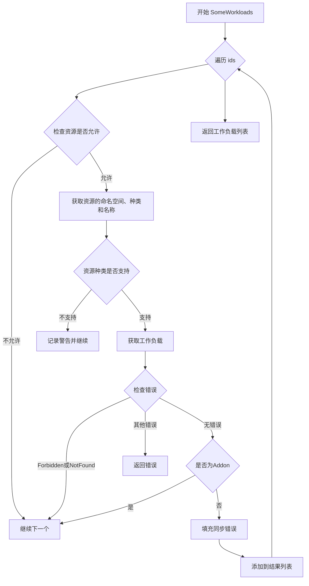

#### AllWorkloads

参数: ctx (context.Context类型, 上下文), restrictToNamespace (string类型, 命名空间限制)

返回值: ([]cluster.Workload, error)类型, 返回工作负载列表和错误

方法实现: 获取所有允许且存在的命名空间，遍历每个命名空间中的所有资源类型，过滤add-ons并返回工作负载列表

mermaid流程图:
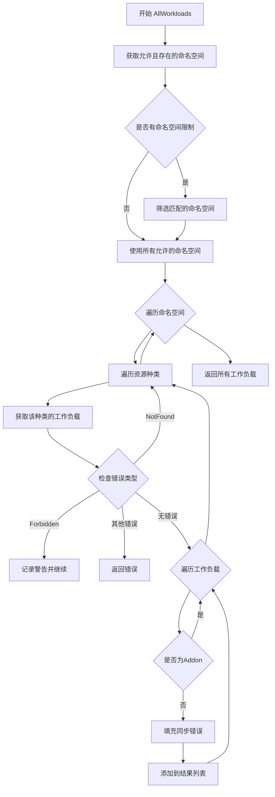

#### setSyncErrors

参数: errs (cluster.SyncError类型, 同步错误集合)

返回值: 无

方法实现: 清空现有的syncErrors映射，然后逐个填充新的错误记录

源码:
```go
func (c *Cluster) setSyncErrors(errs cluster.SyncError) {
	c.muSyncErrors.Lock()
	defer c.muSyncErrors.Unlock()
	c.syncErrors = make(map[resource.ID]error)
	for _, e := range errs {
		c.syncErrors[e.ResourceID] = e.Error
	}
}
```

#### Ping

参数: 无

返回值: error类型, 返回连接检查的错误

方法实现: 通过Discovery API获取服务器版本，检查集群连接性

源码:
```go
func (c *Cluster) Ping() error {
	_, err := c.client.coreClient.Discovery().ServerVersion()
	return err
}
```

#### Export

参数: ctx (context.Context类型, 上下文)

返回值: ([]byte, error)类型, 返回导出的YAML格式资源和错误

方法实现: 遍历所有允许的命名空间，导出命名空间定义和各类型资源为YAML格式

mermaid流程图:
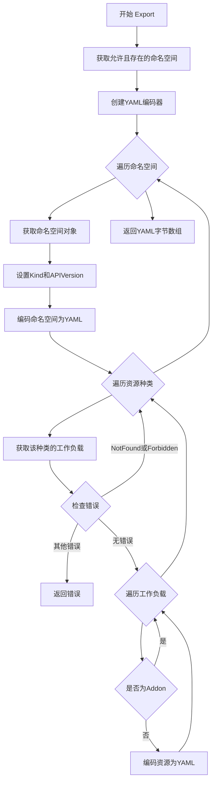

#### PublicSSHKey

参数: regenerate (bool类型, 是否重新生成密钥)

返回值: (ssh.PublicKey, error)类型, 返回SSH公钥和错误

方法实现: 可选地重新生成SSH密钥对，然后返回公钥

源码:
```go
func (c *Cluster) PublicSSHKey(regenerate bool) (ssh.PublicKey, error) {
	if regenerate {
		if err := c.sshKeyRing.Regenerate(); err != nil {
			return ssh.PublicKey{}, err
		}
	}
	publicKey, _ := c.sshKeyRing.KeyPair()
	return publicKey, nil
}
```

#### getAllowedAndExistingNamespaces

参数: ctx (context.Context类型, 上下文)

返回值: ([]string, error)类型, 返回允许的命名空间列表和错误

方法实现: 如果设置了allowedNamespaces则逐个检查是否存在且可访问，否则返回所有命名空间

#### updateLoggedAllowedNS

参数: key (string类型, 命名空间名称), value (bool类型, 记录值)

返回值: 无

方法实现: 线程安全地更新loggedAllowedNS映射

#### getLoggedAllowedNS

参数: key (string类型, 命名空间名称)

返回值: bool类型, 返回是否已记录该命名空间的警告

方法实现: 线程安全地读取loggedAllowedNS映射

#### IsAllowedResource

参数: id (resource.ID类型, 资源ID)

返回值: bool类型, 返回是否允许访问该资源

方法实现: 检查资源所属命名空间是否在允许列表中，处理集群级别资源的特殊情况

### yamlThroughJSON

**描述**: YAML序列化辅助类型，通过JSON作为中间格式

**类字段**:

- toMarshal: interface{}类型 - 要序列化的对象

**类方法**:

#### MarshalYAML

参数: 无

返回值: (interface{}, error)类型, 返回YAML兼容的对象和错误

方法实现: 将对象序列化为JSON，再从JSON反序列化为YAML可用的结构

源码:
```go
func (y yamlThroughJSON) MarshalYAML() (interface{}, error) {
	rawJSON, err := json.Marshal(y.toMarshal)
	if err != nil {
		return nil, fmt.Errorf("error marshaling into JSON: %s", err)
	}
	var jsonObj interface{}
	if err = yaml.Unmarshal(rawJSON, &jsonObj); err != nil {
		return nil, fmt.Errorf("error unmarshaling from JSON: %s", err)
	}
	return jsonObj, nil
}
```

### k8sObject

**描述**: Kubernetes对象元数据接口

**接口方法**:

- GetName() string - 获取资源名称
- GetNamespace() string - 获取命名空间
- GetLabels() map[string]string - 获取标签映射
- GetAnnotations() map[string]string - 获取注解映射

### isAddon

**描述**: 判断Kubernetes对象是否为系统插件（addon）

参数: obj (k8sObject类型, Kubernetes对象)

返回值: bool类型, 返回是否为addon

方法实现: 检查对象是否在kube-system命名空间且满足addon标签条件

### 关键组件信息

- ExtendedClient: 聚合多种Kubernetes客户端的统一入口
- Cluster: 核心业务逻辑类，提供集群操作的主要接口
- Applier: 资源应用器接口（依赖注入）
- ssh.KeyRing: SSH密钥管理组件
- cluster.Includer: 镜像过滤器接口
- resourceKinds: 资源种类注册表（外部定义）
- k8sObject: Kubernetes资源元数据抽象接口

### 设计目标与约束

- 支持多种Kubernetes客户端的统一访问
- 命名空间级别的访问控制，支持白名单机制
- 插件（add-on）识别与过滤，避免管理冲突
- 线程安全的错误记录和命名空间日志
- 支持干运行模式（DryGC）用于测试
- 通过context支持取消和超时控制

### 错误处理与异常设计

- 使用apierrors包区分不同类型的API错误（Forbidden、NotFound、Unauthorized）
- 对于列表操作，部分资源类型不支持时跳过而非失败
- 命名空间访问失败时记录警告但继续处理其他命名空间
- 同步错误存储在内存映射中，支持按资源ID查询
- 所有K8s API调用都检查context是否取消

### 数据流与状态机

- 工作负载查询流程：Cluster → ExtendedClient → resourceKind → Kubernetes API
- 导出流程：遍历命名空间 → 获取资源 → YAML序列化 → 字节数组
- 同步错误流程：外部设置 → 内存存储 → 查询时填充到工作负载对象
- 命名空间验证流程：允许列表 → 存在性检查 → 访问权限验证 → 返回交集

### 外部依赖与接口契约

- k8s.io/client-go/kubernetes: Kubernetes官方Go客户端
- k8s.io/client-go/dynamic: 动态客户端，用于处理自定义资源
- k8s.io/client-go/discovery: 发现客户端，用于获取API能力
- github.com/fluxcd/helm-operator: Helm Operator客户端
- github.com/fluxcd/flux/pkg/cluster: Flux集群接口定义
- github.com/fluxcd/flux/pkg/resource: 资源ID和类型定义
- gopkg.in/yaml.v2: YAML处理库
- github.com/go-kit/kit/log: 日志接口

### 潜在的技术债务或优化空间

- syncErrors使用内存map存储，集群规模大时可能存在内存压力，考虑持久化或LRU缓存
- loggedAllowedNS的警告日志没有去重时间控制，可能产生大量重复日志
- AllWorkloads使用嵌套循环遍历所有资源种类，效率较低，可考虑并行化
- 缺少重试机制，临时性API错误会导致整个操作失败
- Export方法逐个命名空间串行处理，大规模集群导出耗时长
- 缺少对CustomResourceDefinition的支持测试，dynamicClient未被充分利用
- 错误处理中直接continue或return，缺乏统一的错误转换层

### 其它项目

- 并发控制：使用sync.Mutex和sync.RWMutex保护共享状态，但锁粒度可能需要优化
- 资源清理：GC和DryGC字段定义但未在代码中实现实际逻辑
- 性能考量：getAllowedAndExistingNamespaces在每个请求时都重新验证命名空间，可考虑缓存
- 测试覆盖：缺少单元测试和集成测试代码
- 配置管理：resourceExcludeList在初始化时传入但未被实际使用
- 可观测性：仅使用logger记录警告，缺少指标（metrics）收集
- 兼容性：依赖特定版本的Kubernetes API，不同版本可能存在兼容性问题

    