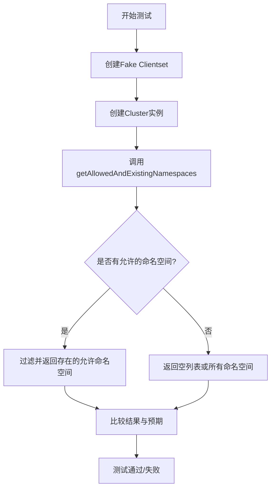
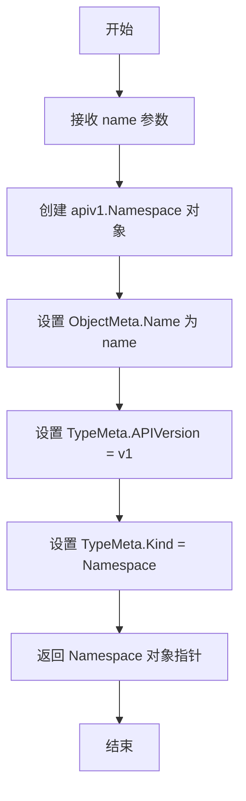
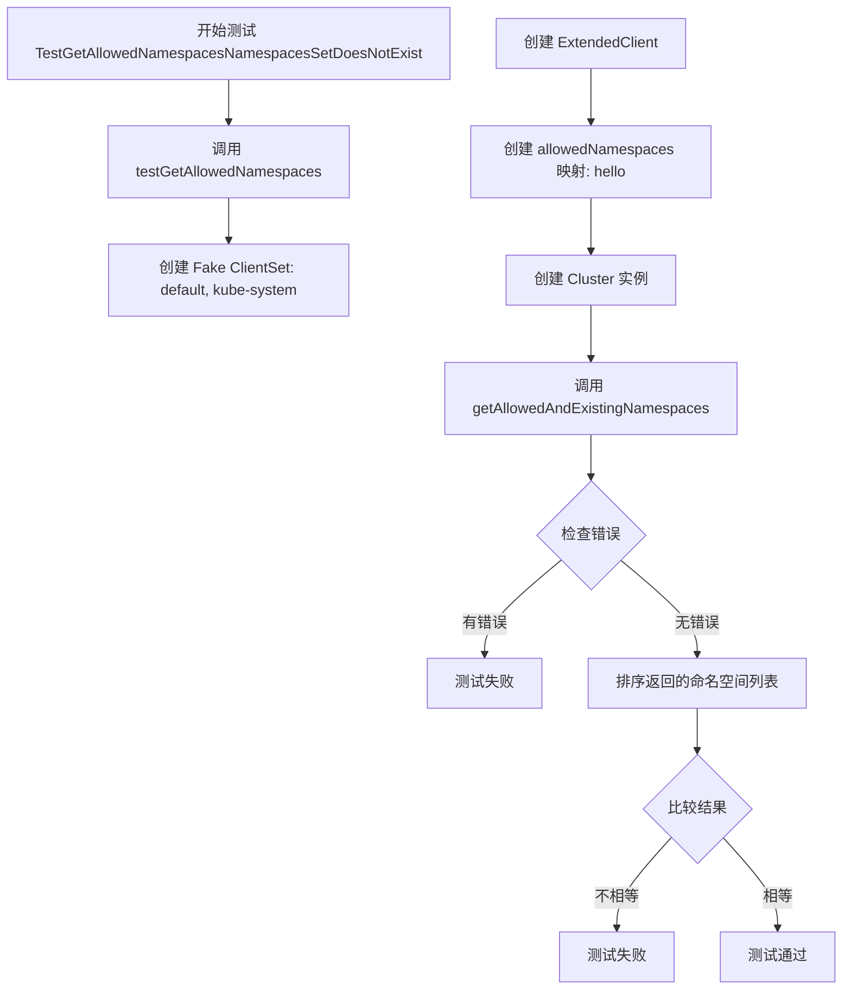
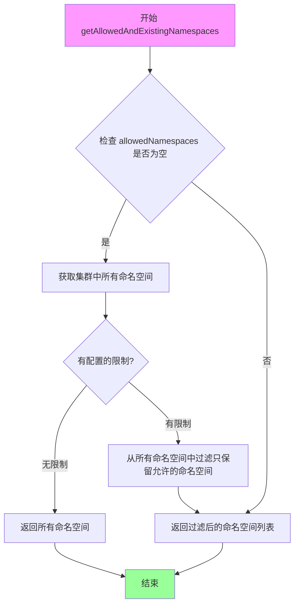

# `flux\pkg\cluster\kubernetes\kubernetes_test.go` 详细设计文档

这是一个Go语言编写的Kubernetes命名空间过滤测试文件，通过模拟Kubernetes客户端测试Cluster类中获取允许访问的命名空间的功能，验证了不同场景下（默认、nil、指定名称、不存在、多名称）命名空间过滤逻辑的正确性。

## 整体流程



## 类结构

```
测试文件结构
├── newNamespace (辅助函数)
├── testGetAllowedNamespaces (测试助手)
└── TestGetAllowedNamespaces* (测试用例)
```

## 全局变量及字段


### `clientset`
    
A fake Kubernetes clientset for testing, pre-populated with default and kube-system namespaces

类型：`*fakekubernetes.Clientset`
    


### `allowedNamespaces`
    
A map of allowed namespace names stored as keys for O(1) lookup

类型：`map[string]struct{}`
    


### `namespaces`
    
A slice of namespace names returned from getAllowedAndExistingNamespaces method

类型：`[]string`
    


### `expected`
    
A slice of expected namespace names used in test assertions

类型：`[]string`
    


### `ExtendedClient.coreClient`
    
The underlying Kubernetes client interface for API operations

类型：`kubernetes.Interface`
    


### `Cluster.client`
    
Extended Kubernetes client for cluster operations

类型：`ExtendedClient`
    


### `Cluster.logger`
    
Logger instance for logging cluster operations

类型：`log.Logger`
    


### `Cluster.metricsClient`
    
Metrics client for collecting cluster metrics (may be nil)

类型：`metrics.Interface`
    


### `Cluster.allowedNamespaces`
    
Map of allowed namespaces to restrict namespace access

类型：`map[string]struct{}`
    


### `Cluster.whitelist`
    
List of whitelisted resources or patterns (may be nil)

类型：`[]string`
    


### `Cluster.blacklist`
    
List of blacklisted resources or patterns to exclude

类型：`[]string`
    
    

## 全局函数及方法


### `newNamespace`

该函数用于创建一个具有指定名称的 Kubernetes Namespace 对象，并设置相应的元数据信息。

参数：

- `name`：`string`，要创建的 Namespace 的名称

返回值：`*apiv1.Namespace`，返回新创建的 Kubernetes Namespace 对象的指针

#### 流程图



#### 带注释源码

```go
// newNamespace 创建一个新的 Kubernetes Namespace 对象
// 参数 name: 要创建的 Namespace 的名称
// 返回值: 指向新创建的 Namespace 对象的指针
func newNamespace(name string) *apiv1.Namespace {
    // 创建并初始化 Namespace 对象，设置元数据
    return &apiv1.Namespace{
        // ObjectMeta 包含对象的元数据信息
        ObjectMeta: meta_v1.ObjectMeta{
            Name: name, // 设置 Namespace 的名称
        },
        // TypeMeta 包含对象的类型信息，用于 API 序列化和反序列化
        TypeMeta: meta_v1.TypeMeta{
            APIVersion: "v1", // 指定 API 版本为 v1
            Kind:       "Namespace", // 指定资源类型为 Namespace
        },
    }
}
```


### `testGetAllowedNamespaces`

这是一个测试辅助函数，用于验证 Cluster 类型的 `getAllowedAndExistingNamespaces` 方法是否能正确返回允许且存在的命名空间列表。该函数通过创建模拟的 Kubernetes 客户端和 Cluster 实例，测试不同输入（空列表、nil、包含特定命名空间等）下的行为是否符合预期。

参数：

- `t`：`*testing.T`，Go 测试框架的测试对象，用于报告测试失败
- `namespace`：`[]string`，允许的命名空间列表，用于配置 Cluster 的 allowedNamespaces
- `expected`：`[]string`，期望返回的命名空间列表，用于与实际结果比对

返回值：无返回值（通过 `*testing.T` 对象报告测试结果）

#### 流程图

```mermaid
flowchart TD
    A[开始 testGetAllowedNamespaces] --> B[创建假 Kubernetes 客户端<br/>包含 default 和 kube-system 命名空间]
    B --> C[创建 ExtendedClient 实例]
    C --> D[将 namespace 参数转换为 map[string]struct{}]
    D --> E[创建 Cluster 实例<br/>配置 allowedNamespaces]
    E --> F[调用 c.getAllowedAndExistingNamespaces]
    F --> G{是否返回错误?}
    G -->|是| H[报告测试失败]
    G -->|否| I[对结果排序]
    I --> J[对期望值排序]
    J --> K{结果是否等于期望值?}
    K -->|是| L[测试通过]
    K -->|否| M[报告测试失败<br/>显示实际值与期望值]
```

#### 带注释源码

```go
// testGetAllowedNamespaces 是一个测试辅助函数，用于验证 getAllowedAndExistingNamespaces 方法的正确性
// 参数：
//   - t: 测试框架提供的测试对象
//   - namespace: 允许的命名空间列表
//   - expected: 期望返回的命名空间列表
func testGetAllowedNamespaces(t *testing.T, namespace []string, expected []string) {
    // 创建一个包含预定义命名空间的假 Kubernetes 客户端
    // 这里模拟了 default 和 kube-system 两个命名空间
    clientset := fakekubernetes.NewSimpleClientset(newNamespace("default"),
        newNamespace("kube-system"))
    
    // 使用假客户端创建 ExtendedClient 实例
    client := ExtendedClient{coreClient: clientset}
    
    // 将传入的命名空间列表转换为 map，用于去重和快速查找
    // map 的 key 是命名空间名称，value 为空结构体（不占用内存）
    allowedNamespaces := make(map[string]struct{})
    for _, n := range namespace {
        allowedNamespaces[n] = struct{}{}
    }
    
    // 创建 Cluster 实例，传入允许的命名空间配置
    // 参数顺序：client, config, namespace informer, logger, allowedNamespaces, deniedNamespaces, labelFilters
    c := NewCluster(client, nil, nil, log.NewNopLogger(), allowedNamespaces, nil, []string{})

    // 调用被测试的方法，获取实际允许且存在的命名空间
    namespaces, err := c.getAllowedAndExistingNamespaces(context.Background())
    
    // 验证方法执行过程中是否发生错误
    if err != nil {
        t.Errorf("The error should be nil, not: %s", err)
    }

    // 对命名空间列表进行排序
    // 原因：map 的迭代顺序是不确定的，需要排序后才能进行可靠的比对
    sort.Strings(namespaces)
    sort.Strings(expected)

    // 使用 DeepEqual 比较实际结果与期望结果
    // 如果不相等，报告测试失败并显示差异
    if reflect.DeepEqual(namespaces, expected) != true {
        t.Errorf("Unexpected namespaces: %v != %v.", namespaces, expected)
    }
}
```


### `TestGetAllowedNamespacesDefault`

该测试函数用于验证当配置中未指定任何允许的命名空间（即传入空切片）时的默认行为。根据代码逻辑，空字符串""在系统中表示"允许所有命名空间"，因此预期返回包含所有现有命名空间的列表（测试中预设了"default"和"kube-system"两个命名空间）。

参数：

- `t`：`testing.T`，Go语言标准测试框架中的测试用例指针，用于报告测试失败和日志输出

返回值：无（测试函数无返回值，通过`t.Errorf`报告错误）

#### 流程图

```mermaid
flowchart TD
    A[开始测试] --> B[调用testGetAllowedNamespaces辅助函数]
    B --> C[传入空切片[]string{}作为allowedNamespaces参数]
    C --> D[传入包含空字符串的切片[]string{""}作为expected参数]
    D --> E{执行集群命名空间获取逻辑}
    E -->|无错误| F[获取当前所有命名空间: default, kube-system]
    E -->|有错误| G[报告错误并失败测试]
    F --> H[对命名空间列表排序以确保顺序一致]
    H --> I[比较实际结果与预期结果]
    I -->|匹配| J[测试通过]
    I -->|不匹配| K[报告 Unexpected namespaces 错误并失败测试]
    J --> L[结束测试]
    K --> L
```

#### 带注释源码

```go
// TestGetAllowedNamespacesDefault 测试默认命名空间获取行为
// 当allowedNamespaces为空切片时，系统应返回所有现有的命名空间
func TestGetAllowedNamespacesDefault(t *testing.T) {
	// 调用通用测试辅助函数
	// 第一个参数: t - 测试框架指针
	// 第二个参数: []string{} - 空的命名空间列表，表示未限制命名空间
	// 第三个参数: []string{""} - 预期返回结果，空字符串""表示"所有命名空间"
	testGetAllowedNamespaces(t, []string{}, []string{""}) // this will be empty string which means all namespaces
}
```


### `TestGetAllowedNamespacesNamespacesIsNil`

这是一个测试函数，用于验证当允许的命名空间列表为 `nil` 时，系统是否正确返回所有命名空间（表示为包含空字符串的切片）。

参数：

- `t`：`*testing.T`，Go 测试框架提供的测试对象，用于报告测试失败和日志输出

返回值：无（`void`），该函数为测试函数，不返回任何值

#### 流程图

```mermaid
flowchart TD
    A[开始: TestGetAllowedNamespacesNamespacesIsNil] --> B[调用testGetAllowedNamespaces]
    B --> C[传入参数: nil, []string{""}]
    C --> D[创建fake clientset]
    D --> E[添加default和kube-system命名空间]
    E --> F[创建ExtendedClient实例]
    F --> G[创建allowedNamespaces映射: nil]
    G --> H[调用NewCluster创建集群对象]
    H --> I[调用getAllowedAndExistingNamespaces方法]
    I --> J{错误检查}
    J -->|有错误| K[测试失败: 报告错误]
    J -->|无错误| L[对namespaces和expected排序]
    L --> M{比较结果}
    M -->|不相等| N[测试失败: 报告Unexpected namespaces]
    M -->|相等| O[测试通过]
```

#### 带注释源码

```go
// TestGetAllowedNamespacesNamespacesIsNil 测试当允许的命名空间为nil时的行为
// 当allowedNamespaces为nil时，表示允许所有命名空间，因此返回包含空字符串的切片
func TestGetAllowedNamespacesNamespacesIsNil(t *testing.T) {
    // 调用通用测试函数，传入nil作为允许的命名空间
    // 期望返回包含空字符串的切片，表示所有命名空间
    testGetAllowedNamespaces(t, nil, []string{""}) // this will be empty string which means all namespaces
}
```

---

### 关联函数分析

#### `testGetAllowedNamespaces`

这是一个通用的测试辅助函数，用于测试 `getAllowedAndExistingNamespaces` 方法在不同场景下的行为。

参数：

- `t`：`*testing.T`，测试框架的测试对象
- `namespace`：`[]string`，允许的命名空间列表
- `expected`：`[]string`，期望返回的命名空间列表

返回值：无（测试函数）

```go
func testGetAllowedNamespaces(t *testing.T, namespace []string, expected []string) {
    // 创建一个包含 default 和 kube-system 的 fake clientset
    clientset := fakekubernetes.NewSimpleClientset(newNamespace("default"),
        newNamespace("kube-system"))
    // 创建 ExtendedClient 实例
    client := ExtendedClient{coreClient: clientset}
    // 将允许的命名空间列表转换为 map
    allowedNamespaces := make(map[string]struct{})
    for _, n := range namespace {
        allowedNamespaces[n] = struct{}{}
    }
    // 创建 Cluster 实例，传入允许的命名空间
    c := NewCluster(client, nil, nil, log.NewNopLogger(), allowedNamespaces, nil, []string{})

    // 调用被测试的方法获取允许且存在的命名空间
    namespaces, err := c.getAllowedAndExistingNamespaces(context.Background())
    if err != nil {
        t.Errorf("The error should be nil, not: %s", err)
    }

    // 对结果排序以确保顺序一致（因为map的迭代顺序不确定）
    sort.Strings(namespaces)
    sort.Strings(expected)

    // 验证结果是否符合预期
    if reflect.DeepEqual(namespaces, expected) != true {
        t.Errorf("Unexpected namespaces: %v != %v.", namespaces, expected)
    }
}
```

---

### 关键设计说明

| 项目 | 说明 |
|------|------|
| **设计目标** | 验证当允许的命名空间为 `nil` 时，系统能够正确返回所有命名空间（用空字符串表示） |
| **测试策略** | 使用 fake client 模拟 Kubernetes 集群环境，避免对真实集群的依赖 |
| **命名空间约定** | 空字符串 `""` 表示允许所有命名空间，这是该系统的特殊约定 |
| **边界条件** | 测试了 `nil` 输入的情况，这是 Go 语言中常见的关键边界条件 |


### `TestGetAllowedNamespacesNamespacesSet`

该测试函数用于验证当在允许的命名空间集合中设置特定的命名空间（如 "default"）时，系统能够正确返回该命名空间作为允许且存在的命名空间。

参数：

- `t`：`testing.T`，Go 测试框架中的测试对象，用于报告测试失败和控制测试行为

返回值：无（`void`），该函数为测试函数，不返回任何值，通过 `t.Errorf` 报告测试结果

#### 流程图

```mermaid
flowchart TD
    A[开始测试 TestGetAllowedNamespacesNamespacesSet] --> B[调用 testGetAllowedNamespaces]
    B --> C[创建 Fake ClientSet 包含 default 和 kube-system 命名空间]
    C --> D[创建 allowedNamespaces map: {default: struct{}{}}]
    D --> E[创建 Cluster 实例并设置 allowedNamespaces]
    E --> F[调用 getAllowedAndExistingNamespaces 获取命名空间列表]
    F --> G{是否有错误?}
    G -->|是| H[报告错误: t.Errorf]
    G -->|否| I[对结果排序]
    I --> J{结果是否等于预期 [default]?}
    J -->|是| K[测试通过]
    J -->|否| L[报告错误: Unexpected namespaces]
```

#### 带注释源码

```go
// TestGetAllowedNamespacesNamespacesSet 测试当允许的命名空间设置为特定命名空间时的行为
// 该测试验证当 allowedNamespaces 包含 "default" 时，
// getAllowedAndExistingNamespaces 方法能够正确返回 "default" 命名空间
func TestGetAllowedNamespacesNamespacesSet(t *testing.T) {
	// 调用通用测试函数，传入参数：
	// - t: 测试对象
	// - []string{"default"}: 允许的命名空间列表
	// - []string{"default"}: 预期的返回命名空间列表
	testGetAllowedNamespaces(t, []string{"default"}, []string{"default"})
}
```

#### 相关上下文源码（testGetAllowedNamespaces 辅助函数）

```go
// testGetAllowedNamespaces 是一个辅助测试函数，用于测试 getAllowedAndExistingNamespaces 方法
// 参数：
//   - t: 测试对象
//   - namespace: 允许的命名空间列表
//   - expected: 预期的返回命名空间列表
func testGetAllowedNamespaces(t *testing.T, namespace []string, expected []string) {
	// 1. 创建包含 default 和 kube-system 命名空间的 Fake ClientSet
	clientset := fakekubernetes.NewSimpleClientset(newNamespace("default"),
		newNamespace("kube-system"))
	
	// 2. 创建 ExtendedClient
	client := ExtendedClient{coreClient: clientset}
	
	// 3. 将命名空间列表转换为 map 结构（用于快速查找）
	allowedNamespaces := make(map[string]struct{})
	for _, n := range namespace {
		allowedNamespaces[n] = struct{}{}
	}
	
	// 4. 创建 Cluster 实例，配置允许的命名空间
	c := NewCluster(client, nil, nil, log.NewNopLogger(), allowedNamespaces, nil, []string{})

	// 5. 调用被测试的方法获取允许且存在的命名空间
	namespaces, err := c.getAllowedAndExistingNamespaces(context.Background())
	if err != nil {
		t.Errorf("The error should be nil, not: %s", err)
	}

	// 6. 对结果排序（因为 map 的迭代顺序不确定）
	sort.Strings(namespaces)
	sort.Strings(expected)

	// 7. 验证结果是否符合预期
	if reflect.DeepEqual(namespaces, expected) != true {
		t.Errorf("Unexpected namespaces: %v != %v.", namespaces, expected)
	}
}
```


### `TestGetAllowedNamespacesNamespacesSetDoesNotExist`

该测试函数用于验证当用户在允许的命名空间列表中配置了一个不存在的命名空间（"hello"）时，系统能够正确处理并返回空的结果列表，而不会抛出错误。

参数：

- `t`：`testing.T`，Go 测试框架的标准参数，用于报告测试失败

返回值：`无`（Go 测试函数无返回值）

#### 流程图



#### 带注释源码

```go
// TestGetAllowedNamespacesNamespacesSetDoesNotExist 测试当配置的命名空间不存在时的行为
// 参数 namespace 为 ["hello"]，该命名空间在集群中不存在
// 期望返回空切片，因为 "hello" 不存在于 fake clientset 中
func TestGetAllowedNamespacesNamespacesSetDoesNotExist(t *testing.T) {
    // 调用辅助测试函数，传入：
    // - t: 测试框架参数
    // - []string{"hello"}: 用户配置的允许命名空间（集群中不存在）
    // - []string{}: 期望返回的空命名空间列表
    testGetAllowedNamespaces(t, []string{"hello"}, []string{})
}
```

#### 相关上下文源码（被调用的辅助函数）

```go
// testGetAllowedNamespaces 是通用的测试辅助函数
// 参数：
//   - t: 测试框架参数
//   - namespace: 用户配置的允许命名空间列表
//   - expected: 期望返回的命名空间列表
func testGetAllowedNamespaces(t *testing.T, namespace []string, expected []string) {
    // 创建包含 default 和 kube-system 的 fake clientset
    clientset := fakekubernetes.NewSimpleClientset(newNamespace("default"),
        newNamespace("kube-system"))
    
    // 创建 ExtendedClient
    client := ExtendedClient{coreClient: clientset}
    
    // 将用户配置的命名空间转换为 map
    allowedNamespaces := make(map[string]struct{})
    for _, n := range namespace {
        allowedNamespaces[n] = struct{}{}
    }
    
    // 创建 Cluster 实例
    c := NewCluster(client, nil, nil, log.NewNopLogger(), allowedNamespaces, nil, []string{})

    // 调用 getAllowedAndExistingNamespaces 获取允许且存在的命名空间
    namespaces, err := c.getAllowedAndExistingNamespaces(context.Background())
    
    // 验证错误应该为 nil
    if err != nil {
        t.Errorf("The error should be nil, not: %s", err)
    }

    // 排序结果以确保顺序一致
    sort.Strings(namespaces)
    sort.Strings(expected)

    // 验证结果是否符合预期
    if reflect.DeepEqual(namespaces, expected) != true {
        t.Errorf("Unexpected namespaces: %v != %v.", namespaces, expected)
    }
}
```

#### 设计意图与约束

| 类别 | 说明 |
|------|------|
| **设计目标** | 验证系统在用户配置不存在的命名空间时的容错能力，返回空列表而非报错 |
| **约束条件** | 该测试依赖于 fakekubernetes 客户端，不涉及真实 API 调用 |
| **测试数据** | 配置了 "hello" 命名空间，但 fake clientset 中只包含 "default" 和 "kube-system" |

#### 潜在问题

1. **边界条件处理**：该测试假设返回空列表是正确行为，但实际业务可能需要区分"无权限"和"不存在"两种情况
2. **测试覆盖**：未验证当多个命名空间部分存在时的行为（如 "default", "hello" 混合配置）


### `TestGetAllowedNamespacesNamespacesMultiple`

这是一个测试函数，用于验证当允许的命名空间列表包含多个命名空间（包括一个不存在的"hello"）时，只能获取到实际存在的命名空间（"default"和"kube-system"），而不存在的命名空间会被过滤掉。

参数：

-  `t`：`*testing.T`，Go测试框架的测试对象，用于报告测试失败

返回值：无返回值（`void`），该函数为测试函数，不返回任何值

#### 流程图

```mermaid
flowchart TD
    A[开始测试] --> B[调用testGetAllowedNamespaces]
    B --> C[传入参数: namespaces=['default', 'hello', 'kube-system'], expected=['default', 'kube-system']]
    C --> D[创建fake clientset包含default和kube-system命名空间]
    E[创建allowedNamespaces映射] --> F[构建Cluster对象]
    F --> G[调用getAllowedAndExistingNamespaces方法]
    G --> H{是否存在错误?}
    H -->|是| I[报告错误]
    H -->|否| J[对结果排序]
    J --> K{结果是否等于预期?}
    K -->|是| L[测试通过]
    K -->|否| M[报告错误: 命名空间不匹配]
```

#### 带注释源码

```go
// TestGetAllowedNamespacesNamespacesMultiple 测试当允许的命名空间列表包含多个命名空间时的行为
// 输入: ["default", "hello", "kube-system"]
// 预期输出: ["default", "kube-system"]（"hello"不存在于集群中，应被过滤）
func TestGetAllowedNamespacesNamespacesMultiple(t *testing.T) {
    // 调用通用测试函数，传入:
    // - 允许的命名空间列表: ["default", "hello", "kube-system"]
    // - 预期返回的命名空间: ["default", "kube-system"]
    // 注意: "hello" 不存在于 fake clientset 中，所以应该被过滤掉
    testGetAllowedNamespaces(t, []string{"default", "hello", "kube-system"}, []string{"default", "kube-system"})
}
```


# 分析结果

经过代码分析，我发现提供的代码是一个测试文件，其中只包含了 `getAllowedAndExistingNamespaces` 方法的**调用代码**，而**没有该方法的实际实现**。

代码中展示了该方法的调用方式和使用场景，但没有展示 `Cluster` 类的定义和 `getAllowedAndExistingNamespaces` 方法的具体实现。

因此，我将基于代码中的调用信息来提取该方法的相关规格。

### `Cluster.getAllowedAndExistingNamespaces`

该方法用于获取集群中允许访问且实际存在的命名空间列表。它首先检查 Cluster 结构体中是否配置了允许的命名空间列表，如果没有配置（为空或 nil），则返回所有已存在的命名空间；如果配置了允许的命名空间列表，则只返回该列表中实际存在的命名空间。

参数：

- 无显式参数（但从调用上下文可见接收一个隐式的 `Cluster` 指针 receiver）

返回值：`(namespaces []string, err error)`

- `namespaces`：`[]string`，返回的命名空间列表
- `err`：`error`，如果发生错误则返回错误信息，否则返回 nil

#### 流程图



#### 带注释源码

```go
// 从测试代码中提取的方法调用示例
// 注意：以下代码基于测试文件中的调用推断，并非原始实现

namespaces, err := c.getAllowedAndExistingNamespaces(context.Background())
if err != nil {
    t.Errorf("The error should be nil, not: %s", err)
}

// 测试用例揭示的业务逻辑：
// 1. 当 allowedNamespaces 为空 slice []string{} 时，相当于允许所有命名空间，返回所有存在的命名空间
// 2. 当 allowedNamespaces 为 nil 时，相当于允许所有命名空间，返回所有存在的命名空间
// 3. 当 allowedNamespaces 有具体值时，如 ["default"]，只返回存在的允许命名空间
// 4. 当允许的命名空间不存在时，返回空列表
// 5. 当允许多个命名空间时，只返回实际存在的允许命名空间
```

#### 补充说明

由于提供的代码片段仅包含测试代码，未包含 `Cluster` 类的定义和 `getAllowedAndExistingNamespaces` 方法的完整实现，上述信息是从以下代码线索推断得出的：

1. **方法调用**：通过 `c.getAllowedAndExistingNamespaces(context.Background())` 推断方法签名
2. **返回值**：通过 `namespaces, err :=` 推断返回两个值
3. **业务逻辑**：通过测试用例的预期结果推断方法行为

---

## ⚠️ 重要提示

**该文档中缺少关键实现代码**。若需要完整的类信息（如 `Cluster` 类的定义、`allowedNamespaces` 字段、`NewCluster` 函数等），请提供包含完整类定义和 `getAllowedAndExistingNamespaces` 方法实现的源代码文件。

## 关键组件


### ExtendedClient

扩展的Kubernetes客户端封装，封装了coreClient用于与Kubernetes API交互，提供集群操作的底层能力。

### Cluster

集群结构体，包含客户端配置和允许访问的命名空间列表，用于管理Kubernetes集群的访问控制和命名空间过滤。

### getAllowedAndExistingNamespaces方法

获取用户允许访问且在集群中实际存在的命名空间列表，过滤掉不存在或不在白名单中的命名空间。

### newNamespace函数

辅助函数，用于快速创建Kubernetes Namespace对象，包含基本的ObjectMeta和TypeMeta信息。

### testGetAllowedNamespaces函数

核心测试函数，验证获取允许命名空间的功能是否正确，包括空列表、nil、具体命名空间和不存在命名空间等多种场景。

### allowedNamespaces映射

存储允许访问的命名空间集合，使用map[string]struct{}结构实现高效的查找和去重。

### fakekubernetes客户端

用于测试的模拟Kubernetes客户端，不需要真实的Kubernetes集群即可进行单元测试，提供NewSimpleClientset方法创建测试数据。

### NewCluster函数

工厂函数，用于创建Cluster实例，初始化客户端、日志记录器和命名空间过滤规则。


## 问题及建议


### 已知问题

-   **魔法值与隐式语义**：使用空字符串 `""` 表示"所有命名空间"的语义不够明确，代码中缺少对这一约定的文档说明，后续维护者可能难以理解
-   **测试命名不规范**：函数名 `TestGetAllowedNamespacesNamespacesIsNil` 存在重复命名空间（NamespacesNamespaces），应改为 `TestGetAllowedNamespaces_NilNamespaces` 等更清晰的命名方式
-   **断言写法冗余**：`reflect.DeepEqual(namespaces, expected) != true` 应简化为 `!reflect.DeepEqual(namespaces, expected)`，当前写法不够直观
-   **错误后未终止测试**：在 `testGetAllowedNamespaces` 中，检查到 `err != nil` 后仅使用 `t.Errorf` 记录错误，未调用 `t.Fatal` 或 `t.FailNow`，导致测试继续执行可能产生空指针异常
-   **缺少对 Kubernetes API 错误的测试**：测试仅覆盖正常路径，未验证 Kubernetes API 返回错误时的行为（如网络超时、权限不足等场景）
-   **硬编码重复字符串**：`"default"` 和 `"kube-system"` 在多个测试中重复出现，应提取为常量以提高可维护性

### 优化建议

-   定义常量 `const AllNamespaces = ""` 替代隐式的空字符串，并在代码注释中说明其用途
-   提取公共测试常量为：`const TestNamespaceDefault = "default"` 和 `const TestNamespaceKubeSystem = "kube-system"`
-   将错误检查后的 `t.Errorf` 改为 `t.Fatalf`，确保测试在遇到错误时立即停止
-   添加更多边界测试用例：空客户端集（nil clientset）、API 返回错误、命名空间列表为空等情况
-   考虑使用测试表驱动模式（Table-Driven Tests）重构 `testGetAllowedNamespaces` 相关的多个测试函数，减少代码重复并提高可扩展性

## 其它


### 设计目标与约束

该代码的核心设计目标是实现一个Kubernetes命名空间过滤机制，允许用户指定可访问的命名空间列表，并通过与Kubernetes集群中实际存在的命名空间进行交集运算，确定最终可用的命名空间。约束条件包括：1）使用fake client进行测试，不连接真实集群；2）支持空列表表示所有命名空间；3）返回结果需要排序以保证测试一致性。

### 错误处理与异常设计

代码中错误处理主要通过t.Errorf报告测试失败。getAllowedAndExistingNamespaces方法返回error类型，但在测试场景下错误始终为nil。异常情况包括：1）客户端初始化失败；2）Kubernetes API调用失败；3）网络超时；4）权限不足。当前实现缺少对Kubernetes API错误的显式处理，建议在生产环境中添加重试机制和超时控制。

### 数据流与状态机

数据流如下：1）输入：allowedNamespaces（用户指定的命名空间映射）+ cluster中已有的命名空间列表；2）处理：首先调用Kubernetes API获取所有存在的命名空间，然后与允许的命名空间列表取交集；3）输出：符合条件的命名空间列表。状态机转换：初始化→获取集群命名空间→过滤allowedNamespaces→返回结果。

### 外部依赖与接口契约

主要外部依赖包括：1）k8s.io/api/core/v1：Kubernetes核心API；2）k8s.io/apimachinery/pkg/apis/meta/v1：元数据对象；3）k8s.io/client-go/kubernetes/fake：fake客户端；4）github.com/go-kit/kit/log：日志库。接口契约：NewCluster函数接受client、logger、allowedNamespaces等参数，返回Cluster实例；getAllowedAndExistingNamespaces方法返回([]string, error)。

### 关键组件信息

1. ExtendedClient：封装了Kubernetes客户端，提供与集群交互的能力
2. Cluster：核心结构体，包含clientcore、allowedNamespaces等字段，负责命名空间过滤逻辑
3. fakekubernetes.SimpleClientset：用于测试的Kubernetes fake客户端

### 潜在的技术债务与优化空间

1. 测试覆盖不完整：缺少对Kubernetes API返回错误的测试场景
2. 硬编码的API版本：TypeMeta中APIVersion和Kind硬编码为"v1"和"Namespace"
3. 缺乏日志记录：生产环境需要添加详细的日志记录
4. 并发安全：未看到对allowedNamespaces map的并发保护
5. 可配置性不足：超时、重试策略等未作为配置参数
6. 测试辅助函数newNamespace可抽取为测试工具包
7. 错误信息不够具体，建议返回更具描述性的错误信息

### 类的详细信息

#### Cluster结构体

##### 类字段
- coreClient：ExtendedClient类型，Kubernetes客户端封装
- logger：log.Logger类型，日志记录器
- allowedNamespaces：map[string]struct{}类型，允许访问的命名空间映射
- client：kubernetes.Interface类型，Kubernetes客户端接口
- namespaces：[]string类型，命名空间列表

##### 类方法
- getAllowedAndExistingNamespaces(ctx context.Context)：获取允许且存在的命名空间列表
  - 参数：ctx context.Context（上下文）
  - 返回值：([]string, error)
  - 描述：返回用户允许访问且集群中实际存在的命名空间列表

#### ExtendedClient结构体

##### 类字段
- coreClient：kubernetes.Interface类型，Kubernetes核心客户端

### 全局变量与全局函数

##### newNamespace
- 参数：name string（命名空间名称）
- 返回值：*apiv1.Namespace
- 描述：创建一个用于测试的Namespace对象

##### testGetAllowedNamespaces
- 参数：t *testing.T（测试框架）、namespace []string（允许的命名空间列表）、expected []string（期望结果）
- 返回值：无
- 描述：测试获取允许命名空间的核心逻辑

##### TestGetAllowedNamespacesDefault
- 参数：t *testing.T
- 返回值：无
- 描述：测试默认空列表场景

##### TestGetAllowedNamespacesNamespacesIsNil
- 参数：t *testing.T
- 返回值：无
- 描述：测试nil场景

##### TestGetAllowedNamespacesNamespacesSet
- 参数：t *testing.T
- 返回值：无
- 描述：测试指定命名空间场景

##### TestGetAllowedNamespacesNamespacesSetDoesNotExist
- 参数：t *testing.T
- 返回值：无
- 描述：测试指定不存在的命名空间场景

##### TestGetAllowedNamespacesNamespacesMultiple
- 参数：t *testing.T
- 返回值：无
- 描述：测试多个命名空间场景

    