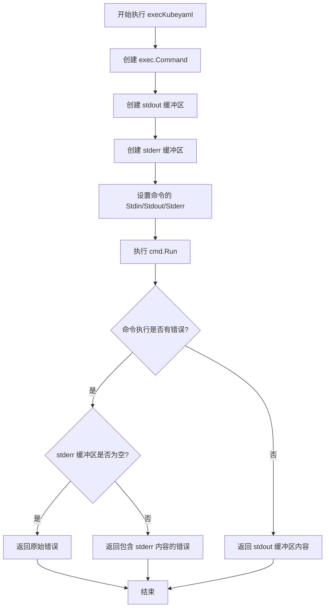
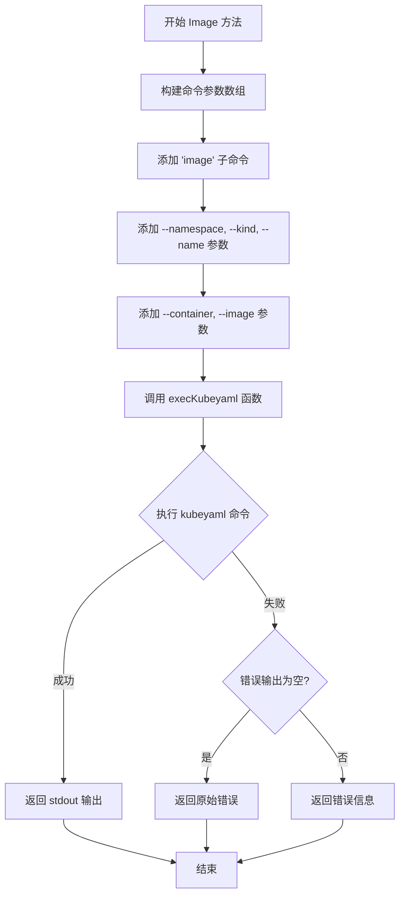
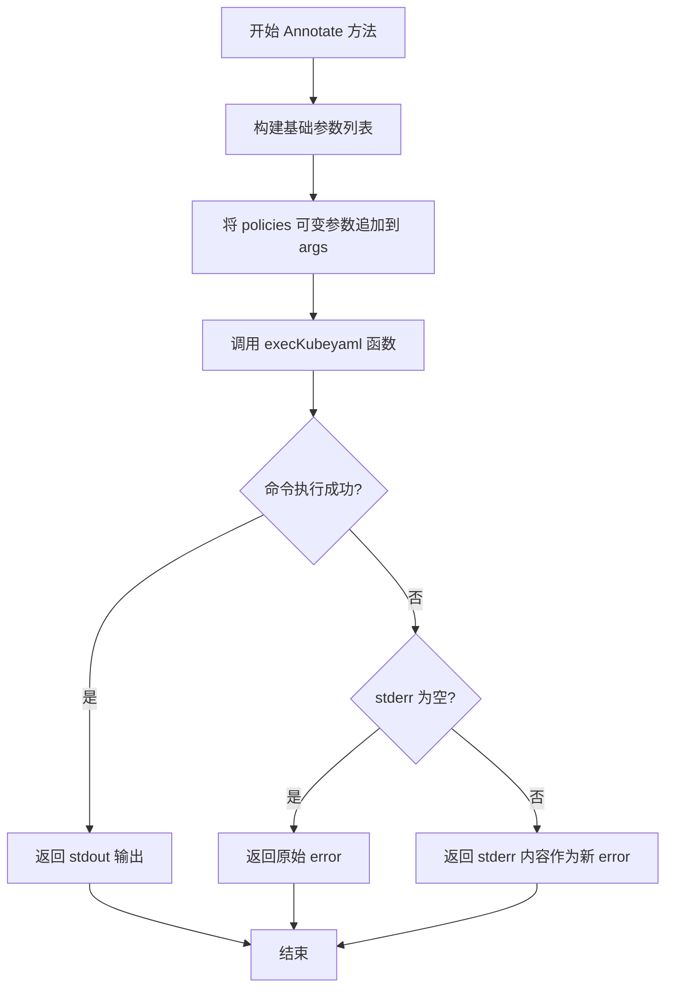
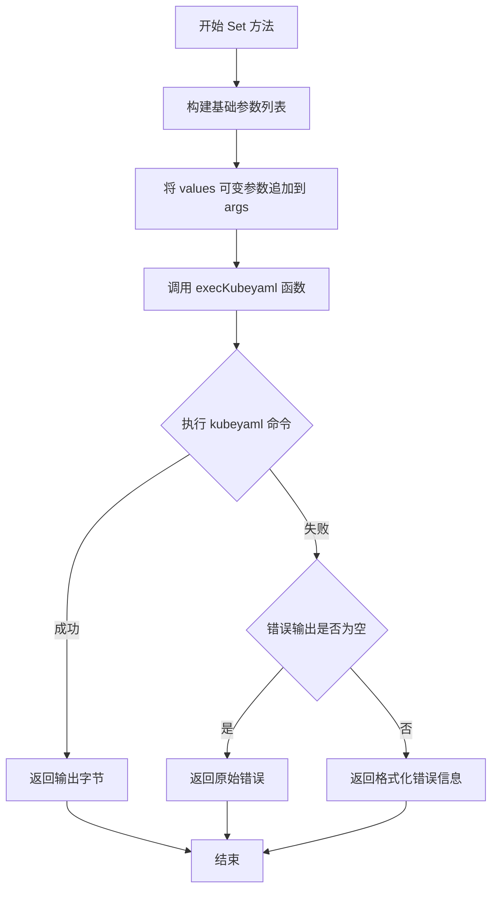
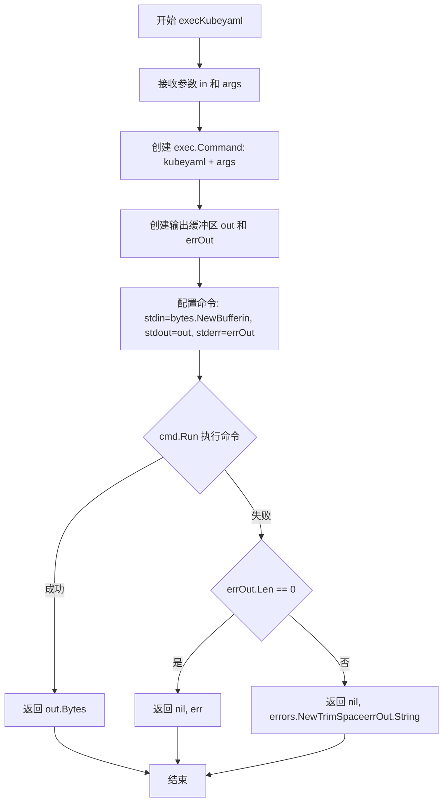

# `flux\pkg\cluster\kubernetes\kubeyaml.go` 详细设计文档

这是一个Kubernetes YAML处理包，提供了一个KubeYAML结构体，用于调用外部kubeyaml可执行文件来修改Kubernetes资源的镜像、注解和配置值。

## 整体流程

```mermaid
graph TD
    A[用户调用KubeYAML方法] --> B{选择方法类型}
    B --> C[Image方法]
    B --> D[Annotate方法]
    B --> E[Set方法]
    C --> F[构建image相关参数]
    D --> G[构建annotate相关参数]
    E --> H[构建set相关参数]
    F --> I[调用execKubeyaml函数]
    G --> I
    H --> I
    I --> J[创建exec.Cmd对象]
    J --> K[设置stdin/stdout/stderr]
    K --> L[执行cmd.Run()]
    L --> M{执行成功?}
    M -- 是 --> N[返回stdout内容]
    M -- 否 --> O{有错误输出?}
    O -- 是 --> P[返回包含stderr的错误]
O -- 否 --> Q[返回系统错误]
```

## 类结构

```
KubeYAML (结构体)
└── 方法:
    ├── Image()
    ├── Annotate()
    ├── Set()
    └── execKubeyaml() (私有函数)
```

## 全局变量及字段


### `execKubeyaml`
    
内部函数，执行外部kubeyaml可执行文件并返回结果或错误

类型：`func(in []byte, args []string) ([]byte, error)`
    


### `KubeYAML.KubeYAML`
    
用于调用helper可执行文件kubeyaml的占位符结构体

类型：`struct{}`
    


### `KubeYAML.Image`
    
调用kubeyaml子命令image，用给定参数修改Kubernetes资源的容器镜像

类型：`func(in []byte, ns, kind, name, container, image string) ([]byte, error)`
    


### `KubeYAML.Annotate`
    
调用kubeyaml子命令annotate，为Kubernetes资源添加注解策略

类型：`func(in []byte, ns, kind, name string, policies ...string) ([]byte, error)`
    


### `KubeYAML.Set`
    
调用kubeyaml子命令set，为Kubernetes资源设置指定的键值对

类型：`func(in []byte, ns, kind, name string, values ...string) ([]byte, error)`
    
    

## 全局函数及方法


### `execKubeyaml`

execKubeyaml 是一个内部辅助函数，用于通过执行外部可执行文件 `kubeyaml` 并传递标准输入和命令行参数来执行 Kubernetes YAML 操作的底层实现函数。

参数：

- `in`：`[]byte`，表示要传递给 kubeyaml 命令的标准输入数据，通常是 Kubernetes YAML 文档内容
- `args`：`[]string`，表示传递给 kubeyaml 子命令的命令行参数数组，如子命令名称（image/annotate/set）及其相关参数

返回值：`([]byte, error)`，返回执行成功时为标准输出的字节数组，失败时返回包含错误信息的 error 类型

#### 流程图



#### 带注释源码

```go
// execKubeyaml 是一个内部辅助函数，用于执行外部 kubeyaml 可执行文件
// 参数:
//   - in: []byte - 要传递给 kubeyaml 的标准输入数据（通常是 YAML 内容）
//   - args: []string - 命令行参数数组，包含子命令及其参数
//
// 返回值:
//   - []byte: 命令的标准输出内容
//   - error: 执行过程中的错误信息
func execKubeyaml(in []byte, args []string) ([]byte, error) {
    // 使用 exec.Command 创建一个执行 kubeyaml 命令的对象
    // 第一个参数是命令名称，后面的 args 是命令行参数
    cmd := exec.Command("kubeyaml", args...)
    
    // 创建两个 bytes.Buffer 用于捕获命令的标准输出和标准错误
    out := &bytes.Buffer{}
    errOut := &bytes.Buffer{}
    
    // 将输入的字节数组转换为缓冲区并设置为命令的标准输入
    cmd.Stdin = bytes.NewBuffer(in)
    
    // 将输出缓冲区和错误缓冲区分别设置为命令的标准输出和标准错误
    cmd.Stdout = out
    cmd.Stderr = errOut
    
    // 执行命令并等待其完成
    err := cmd.Run()
    
    // 检查命令执行是否出错
    if err != nil {
        // 如果标准错误缓冲区为空，直接返回原始错误
        if errOut.Len() == 0 {
            return nil, err
        }
        // 如果标准错误缓冲区有内容，创建一个包含错误信息的新错误
        // 使用 strings.TrimSpace 去除可能的空白字符
        return nil, errors.New(strings.TrimSpace(errOut.String()))
    }
    
    // 命令执行成功，返回标准输出的字节内容
    return out.Bytes(), nil
}
```


### `KubeYAML.Image`

该函数调用外部`kubeyaml`可执行文件的`image`子命令，用于更新Kubernetes YAML配置文件中的容器镜像标签，接受Kubernetes资源的命名空间、类型、名称、目标容器名称及新镜像地址作为参数，并返回处理后的YAML字节流或错误信息。

参数：

- `in`：`[]byte`，输入的Kubernetes YAML文档内容
- `ns`：`string`，Kubernetes命名空间
- `kind`：`string`，Kubernetes资源类型（如Deployment、Pod、DaemonSet等）
- `name`：`string`，目标资源的名称
- `container`：`string`，要更新镜像的容器名称
- `image`：`string`，新的镜像地址

返回值：`([]byte, error)`，返回处理后的YAML字节流，如果执行失败则返回错误信息

#### 流程图



#### 带注释源码

```go
// Image calls the kubeyaml subcommand `image` with the arguments given.
// 该方法接收Kubernetes资源的元数据和新镜像地址，构建命令行参数后调用execKubeyaml执行
// 参数：
//   - in: 输入的YAML字节数组
//   - ns: Kubernetes命名空间
//   - kind: 资源类型（如Deployment、StatefulSet等）
//   - name: 资源名称
//   - container: 容器名称
//   - image: 新镜像地址
// 返回：
//   - []byte: kubeyaml处理后的输出
//   - error: 执行过程中的错误
func (k KubeYAML) Image(in []byte, ns, kind, name, container, image string) ([]byte, error) {
	// 第一步：构建基础命令行参数，包含子命令和必要的标识参数
	args := []string{"image", "--namespace", ns, "--kind", kind, "--name", name}
	
	// 第二步：追加容器和镜像参数
	args = append(args, "--container", container, "--image", image)
	
	// 第三步：调用内部执行函数处理实际的命令运行
	return execKubeyaml(in, args)
}
```

---

#### 潜在技术债务与优化空间

1. **缺少输入验证**：参数`ns`、`kind`、`name`等未进行有效性校验，可能导致`kubeyaml`执行失败时错误信息不够友好
2. **硬编码可执行文件路径**：直接调用`"kubeyaml"`命令，假设该命令已存在于系统PATH中，建议添加可配置性或错误提示
3. **错误处理粒度不足**：错误信息仅返回`kubeyaml`的stderr内容，缺少针对不同错误类型的处理逻辑
4. **无重试机制**：网络或命令执行失败时缺乏重试策略
5. **日志缺失**：未记录命令执行过程，难以排查问题

#### 设计目标与约束

- **设计目标**：提供简洁的API用于修改Kubernetes YAML配置文件中的容器镜像
- **约束条件**：依赖外部`kubeyaml`工具的存在，对输入格式有一定要求

#### 错误处理与异常设计

- 当`kubeyaml`命令执行失败时，若存在标准错误输出则返回包含stderr内容的错误，否则返回原始执行错误
- 错误信息通过`strings.TrimSpace`去除首尾空白字符


### `KubeYAML.Annotate`

`KubeYAML.Annotate` 是一个 Kubernetes YAML 处理方法，通过调用外部 `kubeyaml` 可执行文件的 `annotate` 子命令，为指定的 Kubernetes 资源添加注解。

#### 参数

- `in`：`[]byte`，输入的 Kubernetes YAML 文档字节数组
- `ns`：`string`，目标资源的命名空间
- `kind`：`string`，目标资源的类型（如 Deployment、Service 等）
- `name`：`string`，目标资源的名称
- `policies`：`...string`，可变参数，要添加的注解策略列表（如 key=value 形式）

#### 返回值

- `[]byte`，执行成功时返回处理后的 YAML 输出
- `error`，执行失败时返回错误信息（可能是命令执行错误或 stderr 输出）

#### 流程图



#### 带注释源码

```go
// Annotate calls the kubeyaml subcommand `annotate` with the arguments as given.
// Annotate 方法接收 Kubernetes 资源的元数据信息和注解策略，
// 构建参数列表后调用 execKubeyaml 执行外部 kubeyaml 工具
func (k KubeYAML) Annotate(in []byte, ns, kind, name string, policies ...string) ([]byte, error) {
    // 构建 annotate 子命令的基础参数，包含子命令名和资源定位参数
    args := []string{"annotate", "--namespace", ns, "--kind", kind, "--name", name}
    
    // 将可变数量的策略参数追加到参数列表中
    // policies 格式通常为 key=value 或 key=value,owner=xxx 等
    args = append(args, policies...)
    
    // 调用通用的 kubeyaml 执行函数，传入输入数据和完整参数列表
    return execKubeyaml(in, args)
}
```


### `KubeYAML.Set`

该方法是一个 Kubernetes YAML 工具类方法，用于调用外部 `kubeyaml` 可执行文件的 `set` 子命令，通过指定的命名空间、资源类型、资源名称和键值对来设置 YAML 文档中的配置值。

参数：

- `in`：`[]byte`，输入的 Kubernetes YAML 文档内容
- `ns`：`string`，Kubernetes 命名空间（namespace）
- `kind`：`string`，Kubernetes 资源类型（如 Deployment、Service 等）
- `name`：`string`，Kubernetes 资源的名称
- `values`：`...string`，可变参数，表示要设置的键值对（如 key=value 格式）

返回值：`([]byte, error)`，返回命令执行后的输出内容（字节切片）和可能的错误信息

#### 流程图



#### 带注释源码

```go
// Set 调用 kubeyaml 子命令 `set`，根据传入的参数设置 YAML 中的值
// 参数：
//   - in: 输入的 YAML 字节切片
//   - ns: Kubernetes 命名空间
//   - kind: Kubernetes 资源类型
//   - name: 资源名称
//   - values: 可变字符串参数，格式应为 key=value
//
// 返回值：
//   - []byte: 命令执行后的标准输出
//   - error: 执行过程中的错误信息
func (k KubeYAML) Set(in []byte, ns, kind, name string, values ...string) ([]byte, error) {
    // 初始化基础命令参数，包含 set 子命令及 namespace、kind、name 参数
    args := []string{"set", "--namespace", ns, "--kind", kind, "--name", name}
    
    // 将用户提供的 key=value 形式的值追加到参数列表中
    // 例如：values = ["key1=value1", "key2=value2"]
    args = append(args, values...)
    
    // 调用底层 execKubeyaml 函数执行实际的命令
    return execKubeyaml(in, args)
}
```


### KubeYAML.execKubeyaml

这是一个私有方法，用于执行外部`kubeyaml`可执行文件。它接收输入的YAML内容和命令行参数，配置并运行系统命令，将标准输入传递给kubeyaml，并捕获其标准输出和错误输出，最后返回命令执行结果或错误信息。

参数：

- `in`：`[]byte`，输入的字节数组，通常是待处理的YAML内容
- `args`：`[]string`，命令行参数列表，用于指定kubeyaml的子命令和相关选项

返回值：`([]byte, error)`，返回命令执行后的标准输出字节数组，若发生错误则返回错误信息

#### 流程图



#### 带注释源码

```go
// execKubeyaml 是 KubeYAML 类型的私有方法，用于执行外部 kubeyaml 命令
// 参数：
//   - in: 输入的字节数组，通常是 YAML 格式的内容
//   - args: 命令行参数列表，包含子命令及其选项
//
// 返回值：
//   - []byte: 命令执行后的标准输出内容
//   - error: 如果命令执行失败，返回错误信息
func execKubeyaml(in []byte, args []string) ([]byte, error) {
    // 使用指定的命令名称 "kubeyaml" 和参数列表创建命令对象
    cmd := exec.Command("kubeyaml", args...)
    
    // 创建两个缓冲区分别用于捕获标准输出和标准错误输出
    out := &bytes.Buffer{}
    errOut := &bytes.Buffer{}
    
    // 将输入的字节数组转换为缓冲区并设置为命令的标准输入
    cmd.Stdin = bytes.NewBuffer(in)
    
    // 将输出缓冲区和错误输出缓冲区分别设置为命令的标准输出和标准错误
    cmd.Stdout = out
    cmd.Stderr = errOut
    
    // 执行命令并等待其完成
    err := cmd.Run()
    
    // 如果命令执行过程中发生错误
    if err != nil {
        // 检查是否有错误输出内容
        if errOut.Len() == 0 {
            // 没有错误输出，直接返回原始错误
            return nil, err
        }
        // 有错误输出，将错误输出内容作为新的错误返回
        // 使用 TrimSpace 去除首尾空白字符
        return nil, errors.New(strings.TrimSpace(errOut.String()))
    }
    
    // 命令执行成功，返回标准输出内容
    return out.Bytes(), nil
}
```


## 关键组件


### KubeYAML 结构体

KubeYAML 是一个空结构体，作为调用 kubeyaml 辅助可执行文件的占位符类型，提供对 Kubernetes 资源进行操作的方法入口。

### Image 方法

Image 方法调用 kubeyaml 子命令 `image`，用于更新 Kubernetes 资源中指定容器的镜像标签，接收原始 YAML 内容、命名空间、资源类型、资源名称、容器名称和新镜像名称作为参数，返回处理后的 YAML 字节数据和可能的错误。

### Annotate 方法

Annotate 方法调用 kubeyaml 子命令 `annotate`，用于为 Kubernetes 资源添加注解，接收原始 YAML 内容、命名空间、资源类型、资源名称以及可变数量的策略字符串作为参数，返回处理后的 YAML 字节数据和可能的错误。

### Set 方法

Set 方法调用 kubeyaml 子命令 `set`，用于设置 Kubernetes 资源中指定字段的键值对，接收原始 YAML 内容、命名空间、资源类型、资源名称以及可变数量的键值对字符串作为参数，返回处理后的 YAML 字节数据和可能的错误。

### execKubeyaml 函数

execKubeyaml 是内部函数，负责执行 kubeyaml 可执行文件并处理输入输出，通过 os/exec 执行命令，将输入的 YAML 内容传递给标准输入，捕获标准输出和标准错误返回处理结果。

## 问题及建议


### 已知问题

- **缺少上下文支持**：未使用 `context.Context`，无法实现超时控制和取消操作，在高并发场景下可能导致 goroutine 泄漏或服务阻塞
- **无命令查找错误处理**：`exec.Command` 未处理 `exec.ErrNotFound` 情况，当 `kubeyaml` 可执行文件不存在时返回的错误信息不够友好
- **无超时机制**：外部命令执行没有任何超时限制，可能导致无限等待
- **硬编码可执行文件路径**：`"kubeyaml"` 字符串硬编码在 `execKubeyaml` 函数中，无法灵活配置或注入依赖，单元测试难以 mock
- **参数未验证**：方法参数（如 ns、kind、name 等）没有任何校验，可能导致传递给底层命令无效参数
- **空结构体设计**：`KubeYAML` 结构体为空，仅作为方法接收器存在，缺乏实际状态，可考虑改为纯函数或提供有意义的配置
- **错误信息不够具体**：错误发生时仅返回原始错误或拼接 stderr 内容，缺乏统一的错误码或错误类型定义
- **无日志记录**：代码中没有任何日志输出，生产环境难以追踪问题
- **缓冲区资源未显式释放**：`bytes.Buffer` 虽然在函数结束时会被 GC 回收，但在高频调用场景下可能造成资源浪费
- **缺乏接口抽象**：未定义接口导致无法在不修改业务代码的情况下替换实现（如使用 client-go 直接操作 Kubernetes API）

### 优化建议

- 引入 `context.Context` 参数支持超时和取消，例如 `func (k KubeYAML) Image(ctx context.Context, in []byte, ns, kind, name, container, image string) ([]byte, error)`
- 将可执行文件路径提取为配置项或通过依赖注入方式传入，便于测试和部署配置
- 为每个方法添加参数校验，检查空字符串或非法格式
- 定义自定义错误类型或错误码，提升错误可追溯性
- 考虑添加日志记录关键操作和错误信息
- 评估是否可以用 Kubernetes client-go 库直接替代外部可执行文件调用，以提升性能和可靠性

## 其它


### 设计目标与约束

本代码的设计目标是通过调用外部工具`kubeyaml`来实现对Kubernetes YAML资源的修改操作，提供Image（镜像更新）、Annotate（注解添加）、Set（属性设置）三个核心功能。约束条件包括：依赖外部可执行文件`kubeyaml`必须在系统PATH中可用；所有操作均通过标准输入输出与外部进程通信；不支持异步操作或并发调用。

### 错误处理与异常设计

错误处理采用分层策略：execKubeyaml函数负责捕获命令执行错误，当命令返回非零退出码时，会检查stderr输出是否为空，不为空则将stderr内容作为错误信息返回，否则返回标准exec错误。调用方通过检查返回的error是否为nil来判断操作是否成功。异常场景包括：kubeyaml命令不存在、命令参数错误、YAML格式错误、目标资源不存在等。

### 数据流与状态机

数据流主要分为输入和输出两部分。输入：调用方将原始Kubernetes YAML内容作为[]byte通过stdin传递给kubeyaml；输出：处理后的YAML内容通过stdout返回。状态机较为简单，无复杂状态转换，调用流程为：准备参数 → 构建命令 → 执行 → 处理结果 → 返回。

### 外部依赖与接口契约

外部依赖包括：1）kubeyaml可执行文件，必须存在于系统PATH中；2）Go标准库bytes、errors、os/exec、strings包。接口契约方面：KubeYAML结构体无需实例化配置，所有方法签名一致，均接收YAML内容、命名空间、资源类型、资源名称及操作特定参数，返回处理后的YAML内容或错误。

### 安全性考虑

当前实现存在安全风险：1）命令注入风险，args参数直接拼接到命令中，虽未使用shell解释但仍需确保调用方输入经过验证；2）无超时控制，长时间运行的kubeyaml命令可能导致goroutine泄漏；3）无权限检查，无法验证操作是否合规。建议增加输入参数校验、命令执行超时设置及操作审计日志。

### 性能考量

性能特点：每次调用都会启动新的进程，存在进程创建开销；通过stdin/stdout传递数据，无临时文件IO。优化方向：可考虑批量操作合并、连接池复用（若kubeyaml支持守护进程模式）、结果缓存等。

### 测试策略

当前代码缺少单元测试。测试应覆盖：1）正常流程测试，模拟kubeyaml返回预期输出；2）错误处理测试，包括命令不存在、参数错误、YAML解析失败等场景；3）边界条件测试，如空输入、超长参数、特殊字符处理等。建议使用mock或wrapper模式隔离外部命令依赖。

### 版本兼容性

代码依赖Go 1.0及以上版本（使用exec.Command标准用法）。kubeyaml工具版本需与代码兼容，当前无版本协商机制。建议在文档中明确支持的kubeyaml版本范围，并考虑增加版本检测逻辑。

### 部署要求

部署时需确保：1）目标环境已安装kubeyaml工具；2）kubeyaml已加入系统PATH；3）运行用户具有执行kubeyaml的权限；4）网络可达性（如kubeyaml需要访问Kubernetes API）。建议提供安装脚本或容器化部署方案。

### 配置管理

当前实现无外部配置需求，所有参数通过方法参数传入。潜在配置项包括：kubeyaml可执行文件路径、默认命名空间、超时时间、日志级别等。建议后续版本引入配置结构体或环境变量支持。


    