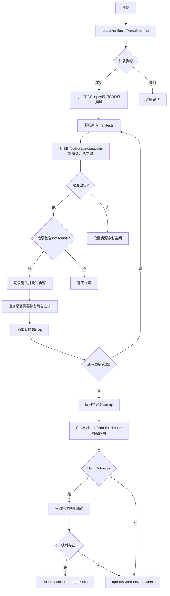
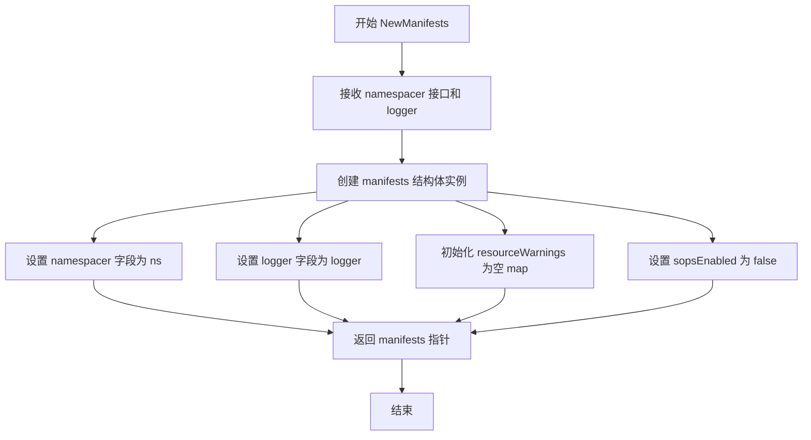
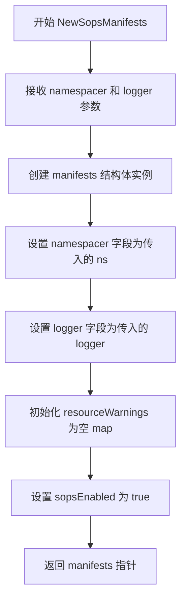
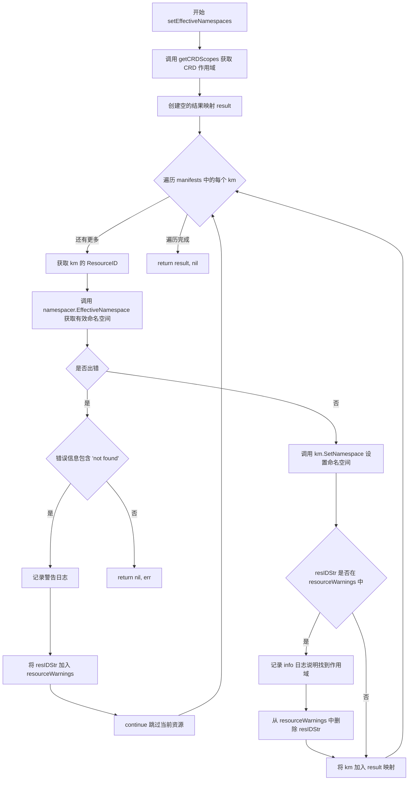
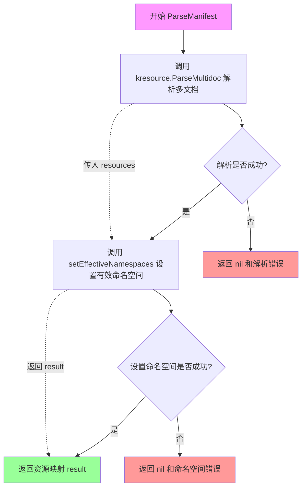
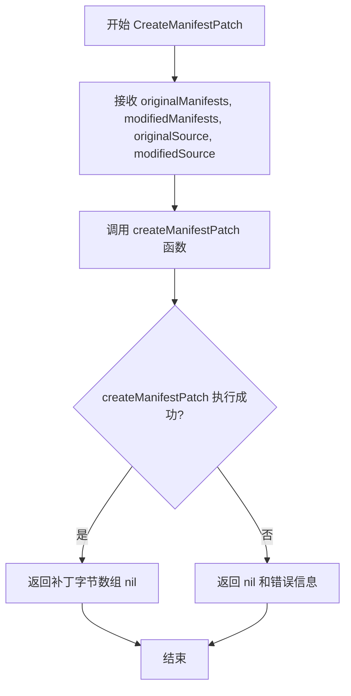
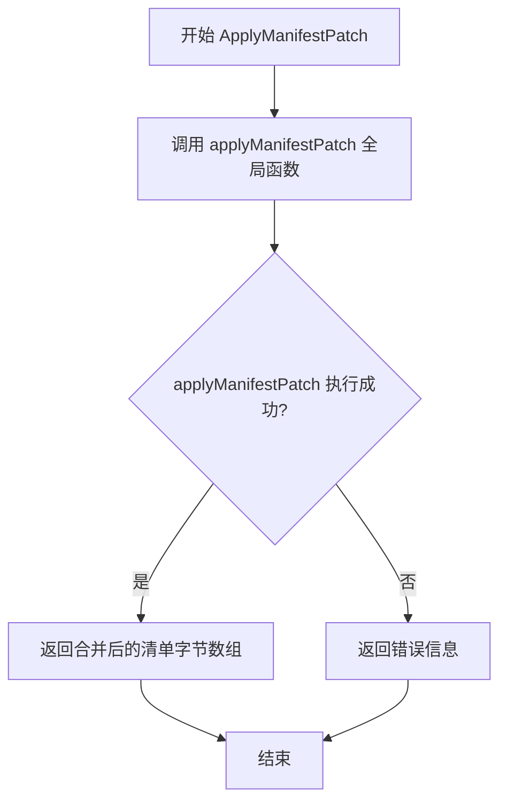
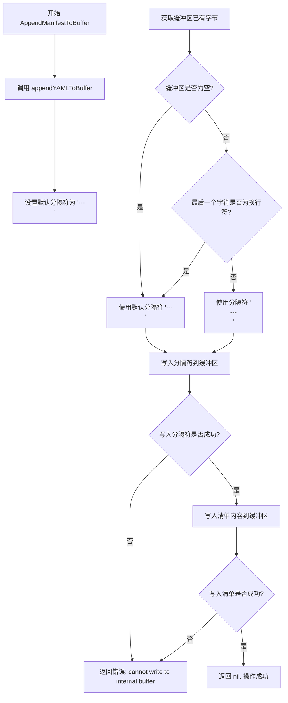

# `flux\pkg\cluster\kubernetes\manifests.go` 详细设计文档

该代码是一个Kubernetes manifests处理库，实现了manifests接口以加载、解析和管理Kubernetes资源。它通过CRD定义确定资源的作用域（集群级或命名空间级），并支持对工作负载容器镜像的更新操作，同时提供了manifest补丁的创建和应用功能。

## 整体流程



## 类结构

```
ResourceScopes (map类型别名)
├── schema.GroupVersionKind -> v1beta1.ResourceScope
namespacer (接口)
└── EffectiveNamespace(manifest, scopes) (string, error)
manifests (结构体)
├── namespacer (字段)
├── logger (字段)
├── resourceWarnings (字段)
└── sopsEnabled (字段)
```

## 全局变量及字段


### `ResourceScopes`
    
Maps resource definitions (GroupVersionKind) to whether they are namespaced or not.

类型：`map[schema.GroupVersionKind]v1beta1.ResourceScope`
    


### `manifests.namespacer`
    
Assigns namespaces to manifests that need it (or "" if the manifest should not have a namespace).

类型：`namespacer`
    


### `manifests.logger`
    
Logger for logging messages.

类型：`log.Logger`
    


### `manifests.resourceWarnings`
    
A map to track resource warnings and prevent duplicate logging.

类型：`map[string]struct{}`
    


### `manifests.sopsEnabled`
    
Flag indicating whether SOPS encryption is enabled.

类型：`bool`
    
    

## 全局函数及方法


### `getCRDScopes`

该函数用于从给定的 Kubernetes Manifest 清单中提取所有 CustomResourceDefinition (CRD) 的作用域信息，并将这些信息映射为 `GroupVersionKind` 到 `v1beta1.ResourceScope` 的关系，以供后续命名空间解析使用。

参数：

- `manifests`：`map[string]kresource.KubeManifest`，待扫描的 Kubernetes 资源清单映射，键为资源标识符字符串，值为具体的 Kubernetes Manifest 对象

返回值：`ResourceScopes`，返回 CRD 作用域映射表，键为 `schema.GroupVersionKind`（表示 CRD 的 Group/Version/Kind），值为 `v1beta1.ResourceScope`（表示该 CRD 是集群级别 "Cluster" 还是命名空间级别 "Namespaced"）

#### 流程图

```mermaid
flowchart TD
    A[开始: 获取 manifests] --> B[初始化空的 ResourceScopes 结果集]
    B --> C{遍历 manifests}
    C -->|遍历每个 km| D{km.GetKind == 'CustomResourceDefinition'?}
    D -->|否| C
    D -->|是| E[使用 yaml.Unmarshal 解析 CRD]
    E --> F{解析成功?}
    F -->|否| G[跳过继续下一个 manifest]
    F -->|是| H{检查 crd.Spec.Versions 长度}
    H -->|长度 > 0| I[使用 crd.Spec.Versions]
    H -->|长度 == 0| J[使用单个版本: Name: crd.Spec.Version]
    I --> K{遍历每个 crdVersion}
    J --> K
    K --> L[构建 gvk: Group + Version + Kind]
    L --> M[result[gvk] = crd.Spec.Scope]
    M --> K
    K --> C
    C -->|遍历完成| N[返回 result]
    N --> O[结束]
```

#### 带注释源码

```go
// getCRDScopes 从 manifest 映射中提取所有 CustomResourceDefinition 的作用域信息
// 参数 manifests: 包含多个 Kubernetes 资源清单的映射
// 返回值: ResourceScopes 类型的映射表，记录每个 CRD 的 GroupVersionKind 对应的作用域
func getCRDScopes(manifests map[string]kresource.KubeManifest) ResourceScopes {
	// 初始化结果映射，用于存储 CRD 作用域信息
	result := ResourceScopes{}
	
	// 遍历传入的所有 manifest 资源
	for _, km := range manifests {
		// 检查当前资源是否为 CustomResourceDefinition
		if km.GetKind() == "CustomResourceDefinition" {
			// 声明 CRD 变量用于反序列化
			var crd v1beta1.CustomResourceDefinition
			
			// 将 manifest 的字节内容反序列化为 CRD 对象
			if err := yaml.Unmarshal(km.Bytes(), &crd); err != nil {
				// CRD 无法解析时，故意忽略它
				// 期望 EffectiveNamespace() 在需要时从集群中查找其作用域
				continue
			}
			
			// 获取 CRD 的版本列表
			// 注意：CRD 可能使用新版结构（Spec.Versions）或旧版结构（Spec.Version）
			crdVersions := crd.Spec.Versions
			if len(crdVersions) == 0 {
				// 兼容处理：旧版 CRD 使用单一 Version 字段
				crdVersions = []v1beta1.CustomResourceDefinitionVersion{{Name: crd.Spec.Version}}
			}
			
			// 遍历 CRD 的所有版本，为每个版本建立作用域映射
			for _, crdVersion := range crdVersions {
				// 构造 GroupVersionKind 元组
				// Group: CRD 所属的 API 组
				// Version: 具体版本号
				// Kind: CRD 定义的资源类型名称
				gvk := schema.GroupVersionKind{
					Group:   crd.Spec.Group,
					Version: crdVersion.Name,
					Kind:    crd.Spec.Names.Kind,
				}
				
				// 将该 CRD 版本的作用域（Cluster 或 Namespaced）记录到结果中
				result[gvk] = crd.Spec.Scope
			}
		}
	}
	
	// 返回完整的 CRD 作用域映射
	return result
}
```


### `appendYAMLToBuffer`

该函数负责将 Kubernetes YAML 清单内容追加到缓冲区中，并在清单前添加适当的 YAML 文档分隔符（`---`），同时处理缓冲区现有内容末尾是否已有换行符的情况。

参数：

- `manifest`：`[]byte`，要追加的 Kubernetes YAML 清单内容
- `buffer`：`*bytes.Buffer`，用于写入清单的字节缓冲区指针

返回值：`error`，如果在写入过程中发生错误则返回错误信息，否则返回 nil

#### 流程图

```mermaid
flowchart TD
    A[开始 appendYAMLToBuffer] --> B[定义默认分隔符 "---\n"]
    B --> C[获取 buffer 的现有字节内容]
    C --> D{buffer 是否非空且末尾不是换行符?}
    D -->|是| E[将分隔符改为 "\n---\n"]
    D -->|否| F[保持分隔符为 "---\n"]
    E --> G[写入分隔符到 buffer]
    F --> G
    G --> H{写入分隔符是否出错?}
    H -->|是| I[返回错误]
    H -->|否| J[写入 manifest 内容到 buffer]
    J --> K{写入 manifest 是否出错?}
    K -->|是| L[返回错误]
    K -->|否| M[返回 nil]
    I --> N[结束]
    L --> N
    M --> N
```

#### 带注释源码

```go
// appendYAMLToBuffer 将 YAML 清单追加到 buffer 中，并在清单前添加适当的 YAML 文档分隔符
// 参数:
//   - manifest: []byte, 要追加的 Kubernetes YAML 清单内容
//   - buffer: *bytes.Buffer, 用于写入清单的字节缓冲区指针
// 返回值:
//   - error: 如果写入过程中发生错误则返回错误信息，否则返回 nil
func appendYAMLToBuffer(manifest []byte, buffer *bytes.Buffer) error {
	// 定义默认的 YAML 文档分隔符，YAML 多文档通常以 "---" 开头
	separator := "---\n"
	
	// 获取 buffer 中现有的字节内容
	bytes := buffer.Bytes()
	
	// 检查 buffer 是否非空，且最后一个字符不是换行符
	// 如果末尾没有换行符，需要在分隔符前添加换行符以确保格式正确
	if len(bytes) > 0 && bytes[len(bytes)-1] != '\n' {
		separator = "\n---\n"
	}
	
	// 尝试写入分隔符到 buffer
	if _, err := buffer.WriteString(separator); err != nil {
		// 如果写入失败，返回格式化的错误信息
		return fmt.Errorf("cannot write to internal buffer: %s", err)
	}
	
	// 尝试写入 manifest 内容到 buffer
	if _, err := buffer.Write(manifest); err != nil {
		// 如果写入失败，返回格式化的错误信息
		return fmt.Errorf("cannot write to internal buffer: %s", err)
	}
	
	// 所有操作成功完成，返回 nil
	return nil
}
```


### `NewManifests`

创建并返回一个 `manifests` 结构体实例，用于管理 Kubernetes 清单（manifests）的加载、解析和处理。该函数初始化了命名空间分配器、日志记录器以及资源警告跟踪等核心组件。

参数：

- `ns`：`namespacer` 接口，用于为清单分配有效命名空间的实现
- `logger`：`log.Logger` 日志记录器，用于输出运行时的日志信息

返回值：`*manifests`，返回新创建的 manifests 指针实例

#### 流程图



#### 带注释源码

```go
// NewManifests 创建并返回一个 manifests 结构体实例
// 参数：
//   - ns: namespacer 接口，用于为 manifest 分配有效命名空间
//   - logger: 日志记录器，用于输出运行时日志
//
// 返回值：
//   - *manifests: 新创建的 manifests 指针实例
func NewManifests(ns namespacer, logger log.Logger) *manifests {
	return &manifests{
		namespacer:       ns,                            // 命名空间分配器
		logger:           logger,                        // 日志记录器
		resourceWarnings: map[string]struct{}{},         // 资源警告跟踪映射，初始为空
		sopsEnabled:      false,                          // SOPS 加密功能默认禁用
	}
}
```


### `NewSopsManifests`

创建并返回一个启用SOPS（Secret Operations）支持的Kubernetes manifests实例，用于管理和操作Kubernetes资源，同时支持命名空间分配和资源范围验证。

参数：

- `ns`：`namespacer`，命名空间分配器接口，用于确定资源应使用的有效命名空间
- `logger`：`log.Logger`，日志记录器实例，用于输出警告和信息日志

返回值：`*manifests`，返回新创建的manifests实例指针，该实例已启用SOPS支持

#### 流程图



#### 带注释源码

```go
// NewSopsManifests 创建一个新的 manifests 实例，启用 SOPS 支持
// 参数:
//   - ns: namespacer 接口，用于确定资源的有效命名空间
//   - logger: 日志记录器，用于输出警告和信息日志
//
// 返回值:
//   - *manifests: 启用 SOPS 的 manifests 实例指针
func NewSopsManifests(ns namespacer, logger log.Logger) *manifests {
	return &manifests{
		namespacer:       ns,           // 注入命名空间分配器
		logger:           logger,       // 注入日志记录器
		resourceWarnings: map[string]struct{}{}, // 初始化警告缓存，避免重复日志
		sopsEnabled:      true,         // 启用 SOPS 支持，允许处理加密的配置文件
	}
}
```

#### 关键组件信息

| 组件名称 | 一句话描述 |
|---------|-----------|
| `manifests` | Kubernetes资源清单管理核心结构，支持SOPS加密和命名空间自动处理 |
| `namespacer` | 命名空间分配接口，决定资源应该应用到的命名空间 |
| `ResourceScopes` | CRD资源范围映射表，记录自定义资源的集群级或命名空间级作用域 |
| `kresource.KubeManifest` | Kubernetes资源清单的内存表示，包含原始YAML和元数据 |

#### 潜在的技术债务或优化空间

1. **重复代码**：与 `NewManifests` 函数结构高度相似，仅 `sopsEnabled` 字段不同，可考虑使用工厂模式或配置参数合并
2. **错误处理缺失**：构造函数未对输入参数进行有效性校验，`ns` 和 `logger` 为 nil 时可能导致运行时 panic
3. **硬编码默认值**：`resourceWarnings` 初始化为空 map，在大规模场景下可能导致内存占用，建议按需初始化
4. **缺少上下文传递**：构造函数未考虑从外部配置加载默认行为，扩展性受限

#### 其它项目

**设计目标与约束**：
- 明确区分普通manifests和SOPS-enabled manifests的创建路径
- 确保日志记录和命名空间解析能力在两种实例间共享

**错误处理与异常设计**：
- 当前构造函数不返回错误，依赖调用方保证参数有效性
- 建议增加参数校验，nil logger 可降级为 NOP Logger

**数据流与状态机**：
- 实例创建后通过 `LoadManifests` 或 `ParseManifest` 加载资源
- 通过 `setEffectiveNamespaces` 方法动态计算并设置资源命名空间

**外部依赖与接口契约**：
- 依赖 `github.com/go-kit/kit/log` 的日志接口
- 依赖内部 `namespacer` 接口进行命名空间解析
- SOPS 启用状态影响 `kresource.Load` 的资源加载行为


### `manifests.setEffectiveNamespaces`

该方法为 Kubernetes 资源清单中的每个资源计算并设置有效的命名空间。它首先解析所有 CustomResourceDefinition (CRD) 的作用域信息（集群级或命名空间级），然后遍历每个资源，通过 `namespacer.EffectiveNamespace` 获取该资源应使用的命名空间，最后将计算出的命名空间设置到资源中。对于无法确定作用域的资源会记录警告并跳过，同时处理之前因作用域未知而跳过的资源恢复情况。

**参数：**

- `manifests`：`map[string]kresource.KubeManifest`，包含需要设置命名空间的 Kubernetes 资源清单映射

**返回值：**

- `map[string]resource.Resource`，包含已设置有效命名空间的资源映射
- `error`：如果处理过程中发生错误则返回错误信息

#### 流程图



#### 带注释源码

```go
// setEffectiveNamespaces 为传入的 manifest 集合中的每个资源计算并设置有效的命名空间
// 它会根据资源的类型（集群级或命名空间级）以及 CRD 的作用域信息来确定正确的命名空间
func (m *manifests) setEffectiveNamespaces(manifests map[string]kresource.KubeManifest) (map[string]resource.Resource, error) {
	// 第一步：解析所有 CustomResourceDefinition (CRD) 的作用域信息
	// 这用于后续判断 CRD 资源是集群级还是命名空间级
	knownScopes := getCRDScopes(manifests)
	
	// 创建结果映射，用于存储设置好命名空间的资源
	result := map[string]resource.Resource{}
	
	// 遍历每个 Kubernetes manifest
	for _, km := range manifests {
		// 获取资源的唯一标识符
		resID := km.ResourceID()
		resIDStr := resID.String()
		
		// 调用 namespacer 计算该资源的有效命名空间
		// 对于集群级资源返回空字符串，命名空间级资源返回具体命名空间
		ns, err := m.namespacer.EffectiveNamespace(km, knownScopes)
		if err != nil {
			// 如果错误信息包含 "not found"，说明无法确定资源的作用域
			// 这通常是因为关联的 CRD 尚未创建或不在当前清单中
			if strings.Contains(err.Error(), "not found") {
				// 记录警告并跳过该资源，但继续处理其他资源
				// 确保每个资源的警告只记录一次
				if _, warningLogged := m.resourceWarnings[resIDStr]; !warningLogged {
					// 提取 kind 和 name 用于日志
					_, kind, name := resID.Components()
					partialResIDStr := kind + "/" + name
					// 记录警告日志，说明该资源将被排除直到其作用域可用
					m.logger.Log(
						"warn", fmt.Sprintf("cannot find scope of resource %s: %s", partialResIDStr, err),
						"impact", fmt.Sprintf("resource %s will be excluded until its scope is available", partialResIDStr))
					// 标记该资源已记录过警告
					m.resourceWarnings[resIDStr] = struct{}{}
				}
				// 跳过当前资源，继续处理下一个
				continue
			}
			// 对于其他类型的错误，直接返回
			return nil, err
		}
		
		// 成功获取命名空间后，设置到资源对象中
		km.SetNamespace(ns)
		
		// 检查该资源之前是否因作用域未知被跳过
		// 如果是，现在已经找到作用域，需要清理警告状态
		if _, warningLogged := m.resourceWarnings[resIDStr]; warningLogged {
			// 记录 info 日志，表示该资源已恢复正常
			m.logger.Log("info", fmt.Sprintf("found scope of resource %s, back in business!", km.ResourceID().String()))
			// 从警告映射中删除，允许未来再次记录相关警告
			delete(m.resourceWarnings, resIDStr)
		}
		
		// 将处理后的资源添加到结果映射中，使用资源 ID 作为键
		result[km.ResourceID().String()] = km
	}
	
	// 返回所有处理后的资源，nil 表示没有错误
	return result, nil
}
```


### `manifests.LoadManifests`

该方法用于从指定的基础目录和文件路径加载 Kubernetes 清单文件，并通过 `setEffectiveNamespaces` 方法为每个清单设置有效的命名空间，最终返回资源ID到资源的映射。

参数：

- `baseDir`：`string`，基础目录路径，用于相对路径的解析
- `paths`：`[]string`，要加载的清单文件路径列表

返回值：

- `map[string]resource.Resource`，资源ID到资源的映射
- `error`，加载过程中发生的错误

#### 流程图

```mermaid
flowchart TD
    A[LoadManifests 开始] --> B[调用 kresource.Load 加载清单]
    B --> C{加载是否成功?}
    C -->|否| D[返回错误]
    C -->|是| E[调用 setEffectiveNamespaces 设置命名空间]
    E --> F{设置命名空间是否成功?}
    F -->|否| G[返回错误]
    F -->是> H[返回资源映射]
    D --> I[结束]
    G --> I
    H --> I
```

#### 带注释源码

```go
// LoadManifests 从指定的基础目录和路径加载 Kubernetes 清单文件
// 参数:
//   - baseDir: 基础目录路径，用于相对路径的解析
//   - paths: 要加载的清单文件路径列表
// 返回:
//   - map[string]resource.Resource: 资源ID到资源的映射
//   - error: 加载过程中发生的错误
func (m *manifests) LoadManifests(baseDir string, paths []string) (map[string]resource.Resource, error) {
    // 调用 kresource.Load 加载清单文件，m.sopsEnabled 控制是否启用 SOPS 解密
    manifests, err := kresource.Load(baseDir, paths, m.sopsEnabled)
    if err != nil {
        // 加载失败直接返回错误
        return nil, err
    }
    // 加载成功后，调用 setEffectiveNamespaces 为每个清单设置有效的命名空间
    // 这包括解析 CRD 的作用域（ClusterScoped 或 NamespaceScoped）
    // 并为没有明确命名空间的资源分配合适的默认命名空间
    return m.setEffectiveNamespaces(manifests)
}
```


### `manifests.ParseManifest`

该方法接收Kubernetes清单定义的多文档YAML内容，解析其中的资源，并根据已知的CRD作用域信息设置每个资源的有效命名空间，最终返回资源ID到资源对象的映射。

参数：

- `def`：`[]byte`，待解析的Kubernetes多文档YAML清单字节数组
- `source`：`string`，清单来源标识，用于错误日志和调试信息

返回值：`map[string]resource.Resource, error`，成功时返回以资源ID字符串为键、资源对象为值的映射；失败时返回nil和错误信息

#### 流程图



#### 带注释源码

```go
// ParseManifest 解析Kubernetes多文档清单并设置有效的命名空间
// 参数 def: 包含一个或多个Kubernetes资源定义的YAML文档
// 参数 source: 标识清单来源，用于日志记录和错误追踪
// 返回: 资源ID到资源对象的映射，以及可能发生的错误
func (m *manifests) ParseManifest(def []byte, source string) (map[string]resource.Resource, error) {
	// 第一步：解析多文档YAML，提取所有资源对象
	resources, err := kresource.ParseMultidoc(def, source)
	if err != nil {
		// 解析失败直接返回错误，不进行后续处理
		return nil, err
	}
	
	// 注意：setEffectiveNamespaces() 对于CRD尚未创建的CRD实例无法正常工作
	// （因为CRD不在kresources中）。我们可以尝试修复这个问题或提供更好的错误提示，但：
	// 1. 除了HelmReleases CRD实例外，其他CRD实例都不是工作负载
	// 2. 这个问题会在首次成功同步后自然解决
	
	// 第二步：为每个资源设置有效的命名空间
	// 这需要查询已知的CRD作用域来确定资源是否应该被限定在命名空间中
	result, err := m.setEffectiveNamespaces(resources)
	if err != nil {
		// 设置命名空间失败时返回错误
		return nil, err
	}
	
	// 第三步：返回解析并处理后的资源映射
	return result, nil
}
```

#### 关键说明

1. **多文档解析**：该方法使用`kresource.ParseMultidoc`处理YAML多文档分隔符（`---`），支持在一个字节数组中包含多个Kubernetes资源定义

2. **命名空间处理机制**：通过`setEffectiveNamespaces`方法查询已知的CRD作用域，为每个资源确定应该应用的命名空间。对于集群级资源（Cluster-scoped），命名空间将被设置为空字符串

3. **CRD限制**：注释中明确指出该方法无法处理CRD尚未创建的CRD实例，这是设计上的已知限制，但影响范围有限

4. **错误处理策略**：采用短路模式——解析失败则立即返回，只有解析成功才会进行命名空间处理


### `manifests.SetWorkloadContainerImage`

该函数用于在Kubernetes清单中更新指定工作负载的容器镜像。它首先解析清单定义，然后根据资源ID查找目标资源。如果资源是HelmRelease类型，则尝试使用镜像映射路径更新；否则直接更新容器镜像。

参数：

- `def`：`[]byte`，清单定义的字节数组，包含要修改的Kubernetes资源定义
- `id`：`resource.ID`，要更新的目标资源的唯一标识符
- `container`：`string`，要更新镜像的容器名称
- `image`：`image.Ref`，新的容器镜像引用

返回值：`([]byte, error)`，返回更新后的清单字节数组，如果发生错误则返回错误信息

#### 流程图

```mermaid
flowchart TD
    A[开始 SetWorkloadContainerImage] --> B[调用 ParseManifest 解析清单]
    B --> C{解析是否成功?}
    C -->|否| D[返回错误]
    C -->|是| E[根据 id.String() 查找资源]
    E --> F{资源是否存在?}
    F -->|否| G[返回资源未找到错误]
    F -->|是| H{资源是否为 HelmRelease?}
    H -->|是| I[调用 GetContainerImageMap 获取镜像映射路径]
    I --> J{获取映射路径是否成功?}
    J -->|是| K[调用 updateWorkloadImagePaths 更新]
    J -->|否| L[调用 updateWorkloadContainer 更新]
    H -->|否| L
    K --> M[返回更新后的清单]
    L --> M
    D --> N[结束]
    G --> N
    M --> N
```

#### 带注释源码

```go
// SetWorkloadContainerImage 更新指定工作负载的容器镜像
// 参数：
//   - def: 清单定义的字节数组
//   - id: 资源ID
//   - container: 容器名称
//   - image: 新的镜像引用
// 返回值：
//   - []byte: 更新后的清单定义
//   - error: 如果发生错误则返回错误信息
func (m *manifests) SetWorkloadContainerImage(def []byte, id resource.ID, container string, image image.Ref) ([]byte, error) {
	// 第一步：解析清单定义，将其转换为资源映射
	resources, err := m.ParseManifest(def, "stdin")
	if err != nil {
		// 解析失败，返回错误
		return nil, err
	}
	
	// 第二步：根据资源ID查找目标资源
	res, ok := resources[id.String()]
	if !ok {
		// 资源不存在，返回错误
		return nil, fmt.Errorf("resource %s not found", id.String())
	}
	
	// 第三步：检查是否为HelmRelease类型
	// 如果是HelmRelease，尝试使用镜像映射路径更新
	// 这样可以支持Helm values中的自定义YAML路径
	if hr, ok := res.(*kresource.HelmRelease); ok {
		// 尝试获取容器镜像映射路径
		if paths, err := hr.GetContainerImageMap(container); err == nil {
			// 获取成功，使用映射路径更新镜像
			return updateWorkloadImagePaths(def, id, paths, image)
		}
	}
	
	// 第四步：如果是普通资源或HelmRelease映射失败
	// 使用容器名称直接更新镜像
	return updateWorkloadContainer(def, id, container, image)
}
```


### `manifests.CreateManifestPatch`

该方法是 `manifests` 类的成员方法，用于生成原始 Kubernetes 清单与修改后清单之间的差异补丁（patch）。它内部委托给 `createManifestPatch` 函数执行实际的补丁生成逻辑，并返回包含差异内容的字节数组或错误信息。

参数：

- `originalManifests`：`[]byte`，原始 Kubernetes 清单的字节数组内容
- `modifiedManifests`：`[]byte`，修改后 Kubernetes 清单的字节数组内容
- `originalSource`：`string`，原始清单的来源标识（如 "stdin"、文件路径等）
- `modifiedSource`：`string`，修改后清单的来源标识

返回值：`([]byte, error)`，返回生成的补丁字节数组，若操作失败则返回错误信息

#### 流程图



#### 带注释源码

```go
// CreateManifestPatch 生成原始清单与修改后清单之间的差异补丁
// 参数 originalManifests: 原始清单的字节数据
// 参数 modifiedManifests: 修改后清单的字节数据
// 参数 originalSource: 原始清单的来源标识字符串
// 参数 modifiedSource: 修改后清单的来源标识字符串
// 返回: 补丁字节数组和可能的错误
func (m *manifests) CreateManifestPatch(originalManifests, modifiedManifests []byte, originalSource, modifiedSource string) ([]byte, error) {
	// 委托给 createManifestPatch 函数执行实际的补丁生成逻辑
	// 该函数内部应该实现了比较两个 YAML/JSON 清单并生成差异化补丁的逻辑
	return createManifestPatch(originalManifests, modifiedManifests, originalSource, modifiedSource)
}
```


### `manifests.ApplyManifestPatch`

该方法用于将补丁清单（patch manifests）应用到原始清单（original manifests）上，返回合并后的清单内容。它是一个包装方法，内部调用全局函数 `applyManifestPatch` 来执行实际的多文档 YAML 补丁应用逻辑。

参数：

- `originalManifests`：`[]byte`，原始 Kubernetes 清单的字节内容
- `patchManifests`：`[]byte`，补丁清单的字节内容（包含需要应用的修改）
- `originalSource`：`string`，原始清单的来源标识（如文件名或 stdin）
- `patchSource`：`string`，补丁清单的来源标识

返回值：`([]byte, error)`，返回应用补丁后的清单字节内容，如果操作失败则返回错误信息

#### 流程图



#### 带注释源码

```go
// ApplyManifestPatch 将补丁清单应用到原始清单上
// 参数:
//   - originalManifests: 原始 Kubernetes 清单的 YAML 内容
//   - patchManifests: 需要应用的补丁清单内容
//   - originalSource: 原始清单的来源标识
//   - patchSource: 补丁清单的来源标识
//
// 返回值:
//   - []byte: 应用补丁后的清单内容
//   - error: 如果应用失败，返回错误信息
func (m *manifests) ApplyManifestPatch(originalManifests, patchManifests []byte, originalSource, patchSource string) ([]byte, error) {
	// 委托给全局函数 applyManifestPatch 执行实际的补丁应用逻辑
	// 该全局函数内部使用 YAML 补丁策略（如 strategic merge patch 或 JSON patch）
	// 来合并多个 Kubernetes 资源清单
	return applyManifestPatch(originalManifests, patchManifests, originalSource, patchSource)
}
```


### `manifests.AppendManifestToBuffer`

该方法用于将 Kubernetes 清单（manifest）内容追加到字节缓冲区中，自动处理 YAML 文档分隔符（`---`）的添加，确保多文档 YAML 格式的正确性。

参数：

- `manifest`：`[]byte`，要追加的 Kubernetes 清单内容（YAML 格式的字节数组）
- `buffer`：`*bytes.Buffer`，目标字节缓冲区，用于存储追加后的清单内容

返回值：`error`，如果写入过程中发生错误则返回错误信息，否则返回 nil

#### 流程图



#### 带注释源码

```go
// AppendManifestToBuffer 将 Kubernetes 清单追加到字节缓冲区
// 参数:
//   - manifest: []byte - 要追加的清单内容（YAML 格式）
//   - buffer: *bytes.Buffer - 目标缓冲区
// 返回值:
//   - error: 写入错误时返回错误信息
func (m *manifests) AppendManifestToBuffer(manifest []byte, buffer *bytes.Buffer) error {
	return appendYAMLToBuffer(manifest, buffer)
}

// appendYAMLToBuffer 是实际的实现函数，处理 YAML 文档分隔符
// 参数:
//   - manifest: []byte - 要追加的清单内容
//   - buffer: *bytes.Buffer - 目标缓冲区
// 返回值:
//   - error: 写入错误时返回错误信息
func appendYAMLToBuffer(manifest []byte, buffer *bytes.Buffer) error {
	// 默认为标准的 YAML 文档分隔符
	separator := "---\n"
	
	// 获取缓冲区当前的内容
	bytes := buffer.Bytes()
	
	// 如果缓冲区不为空，且最后一个字符不是换行符，
	// 则需要在分隔符前添加一个换行符，避免格式错误
	if len(bytes) > 0 && bytes[len(bytes)-1] != '\n' {
		separator = "\n---\n"
	}
	
	// 尝试写入分隔符
	if _, err := buffer.WriteString(separator); err != nil {
		// 写入失败，返回格式化错误信息
		return fmt.Errorf("cannot write to internal buffer: %s", err)
	}
	
	// 写入实际的清单内容
	if _, err := buffer.Write(manifest); err != nil {
		// 写入失败，返回格式化错误信息
		return fmt.Errorf("cannot write to internal buffer: %s", err)
	}
	
	// 所有操作成功，返回 nil
	return nil
}
```

## 关键组件


### ResourceScopes

映射Kubernetes资源定义（GroupVersionKind）到其作用域（Namespaced或Cluster），用于判断资源是否需要命名空间。

### namespacer接口

定义有效命名空间的计算逻辑，用于确定Kubernetes清单在应用时应该属于哪个命名空间，返回空字符串表示集群级别资源。

### manifests结构体

Kubernetes清单管理的核心实现结构体，包含命名空间赋值器、日志记录器、资源警告缓存和SOPS启用标志四个字段，负责清单的加载、解析和后处理工作。

### getCRDScopes函数

遍历Kubernetes清单提取CustomResourceDefinition（CRD）资源，解析其版本信息构建GroupVersionKind映射，将CRD的Scope（Namespaced或Cluster）存入结果集合供后续命名空间决策使用。

### setEffectiveNamespaces方法

遍历所有Kubernetes清单调用namespacer计算有效命名空间，处理资源找不到作用域的错误情况（记录警告后跳过），成功设置命名空间的资源存入结果映射并返回。

### LoadManifests方法

调用kresource.Load从指定目录和路径加载原始清单，支持SOPS加密资源解密，随后执行命名空间后处理并返回标准化资源映射。

### ParseManifest方法

解析多文档YAML格式的字节数组为Kubernetes资源列表，同样执行命名空间后处理，注释说明了CRD实例在CRD本身未创建时的处理限制。

### SetWorkloadContainerImage方法

解析清单后定位目标资源，若为HelmRelease类型则尝试获取容器镜像映射路径，否则使用容器名称直接更新镜像引用，支持灵活的镜像更新策略。

### CreateManifestPatch与ApplyManifestPatch方法

封装清单差异计算和应用逻辑，接收原始和修改后的清单字节流及来源标识，返回合并或应用补丁后的清单字节。

### AppendManifestToBuffer方法

将YAML清单追加到字节缓冲区，自动处理文档分隔符（"---\n"），确保多文档清单正确分隔。


## 问题及建议


```json
### 已知问题

-   **错误处理不一致**：`getCRDScopes`函数在解析CRD失败时直接`continue`忽略错误，未记录日志；而`setEffectiveNamespaces`中对类似情况有日志记录，两处处理风格不统一
-   **资源警告map无清理机制**：`resourceWarnings` map在资源scope找不到时写入，但即使后续找到scope删除后，如果大量资源有问题，map可能持续增长且无上限
-   **map遍历顺序不确定**：`setEffectiveNamespaces`遍历`manifests map[string]kresource.KubeManifest`，Go的map遍历顺序是随机的，可能导致输出结果非确定性
-   **重复代码**：`NewManifests`和`NewSopsManifests`两个构造函数几乎完全相同，仅`sopsEnabled`字段不同，可通过参数合并
-   **注释中提到的已知问题未解决**：`ParseManifest`方法注释明确提到"setEffectiveNamespaces() won't work for CRD instances whose CRD is yet to be created"，但代码中未做任何补偿或提示
-   **类型断言缺乏校验**：`SetWorkloadContainerImage`中将`res`转换为`kresource.HelmRelease`时，未检查类型断言成功后的进一步验证

### 优化建议

-   **统一错误处理**：在`getCRDScopes`中添加日志记录，与`setEffectiveNamespaces`保持一致的错误处理风格
-   **实现警告map上限保护**：为`resourceWarnings`添加最大容量限制或定期清理机制，防止内存泄漏
-   **添加确定性输出**：在返回结果前对资源map的key进行排序，或使用有序数据结构（如切片）保证输出顺序一致性
-   **重构构造函数**：创建单一构造函数，通过参数控制`sopsEnabled`，消除代码重复
-   **改进CRD处理**：对于CRD实例在CRD定义不存在时，提供更友好的错误信息或降级处理策略
-   **增强类型安全**：在类型断言后增加更详细的校验逻辑，确保HelmRelease资源的image map配置有效
-   **考虑接口分离**：当前`manifests`结构体承担过多职责（namespace处理、SOPS、logging），可考虑拆分或引入更小的接口
```

## 其它


### 设计目标与约束

本模块旨在为Flux CD提供Kubernetes manifests的加载、解析和修改功能，核心目标包括：1）支持从文件系统加载多文档YAML manifests；2）自动处理资源的有效命名空间（考虑CRD作用域和默认命名空间）；3）支持HelmRelease资源的镜像更新（包括自定义YAML路径映射）；4）提供manifest补丁的创建和应用功能。约束条件包括：依赖Kubernetes API Machinery和apiextensions-apiserver包；仅支持v1beta1版本的CRD；需要配合kresource包进行资源解析。

### 错误处理与异常设计

错误处理采用分层策略：1）对于可恢复的错误（如找不到CRD作用域），记录警告日志后跳过该资源继续处理；2）对于致命错误（如YAML解析失败），立即返回错误并终止操作；3）特定错误消息包含"not found"时会被识别为可忽略的资源不存在错误。在ParseManifest中，CRD实例的namespace设置可能失败（因为CRD尚未创建），这是已知限制并通过注释说明。

### 数据流与状态机

主要数据流如下：LoadManifests流程为：加载文件 -> kresource.Load -> setEffectiveNamespaces -> 返回resource.Resource映射。ParseManifest流程为：解析多文档YAML -> kresource.ParseMultidoc -> setEffectiveNamespaces -> 返回结果。SetWorkloadContainerImage流程为：解析manifest -> 查找目标资源 -> 判断是否为HelmRelease -> 如是则尝试获取镜像映射路径 -> 调用updateWorkloadImagePaths或updateWorkloadContainer。setEffectiveNamespaces方法内部维护knownScopes状态，用于缓存已解析的CRD作用域信息。

### 外部依赖与接口契约

外部依赖包括：github.com/go-kit/kit/log（日志记录）；gopkg.in/yaml.v2（YAML解析）；k8s.io/apiextensions-apiserver/pkg/apis/apiextensions/v1beta1（CRD类型定义）；k8s.io/apimachinery/pkg/runtime/schema（GVK类型）；github.com/fluxcd/flux/pkg/cluster/kubernetes.resource（KubeManifest和HelmRelease）；github.com/fluxcd/flux/pkg/image（镜像引用）；github.com/fluxcd/flux/pkg/resource（资源接口）。核心接口契约：实现了cluster.Manifests接口（包括LoadManifests、ParseManifest、SetWorkloadContainerImage、CreateManifestPatch、ApplyManifestPatch、AppendManifestToBuffer方法）；依赖namespacer接口获取有效命名空间。

### 安全性考虑

sopsEnabled字段表明代码支持处理加密的YAML文件（通过sops工具），但当前实现中sopsEnabled默认为false。资源警告信息可能暴露内部路径和资源名称到日志系统。LoadManifests和ParseManifest返回的resource.Resource映射不包含敏感度过滤机制。

### 性能考量

getCRDScopes在每次setEffectiveNamespaces调用时都会重新解析所有CRD manifests，可能导致性能瓶颈，特别是manifests数量较多时。resourceWarnings使用map存储用于去重，但未设置上限或清理机制，长期运行可能导致内存增长。

### 测试策略

代码中未包含显式的测试代码。测试应覆盖：正常资源加载和命名空间设置；CRD作用域正确映射；HelmRelease镜像更新（含/不含镜像映射）；错误场景（资源不存在、YAML解析失败）；多文档manifests解析；边界条件（空manifests、仅有注释的文档）。

### 配置与可扩展性

NewManifests和NewSopsManifests工厂函数支持不同的配置模式（是否启用sops）。namespacer接口允许自定义命名空间解析策略。ResourceScopes类型可扩展支持更多作用域类型。

    