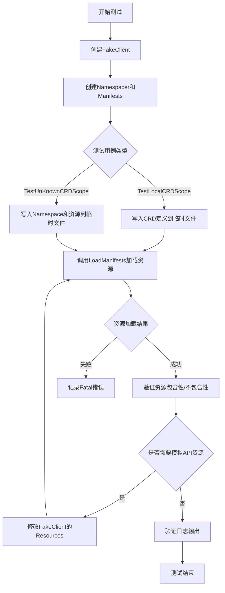
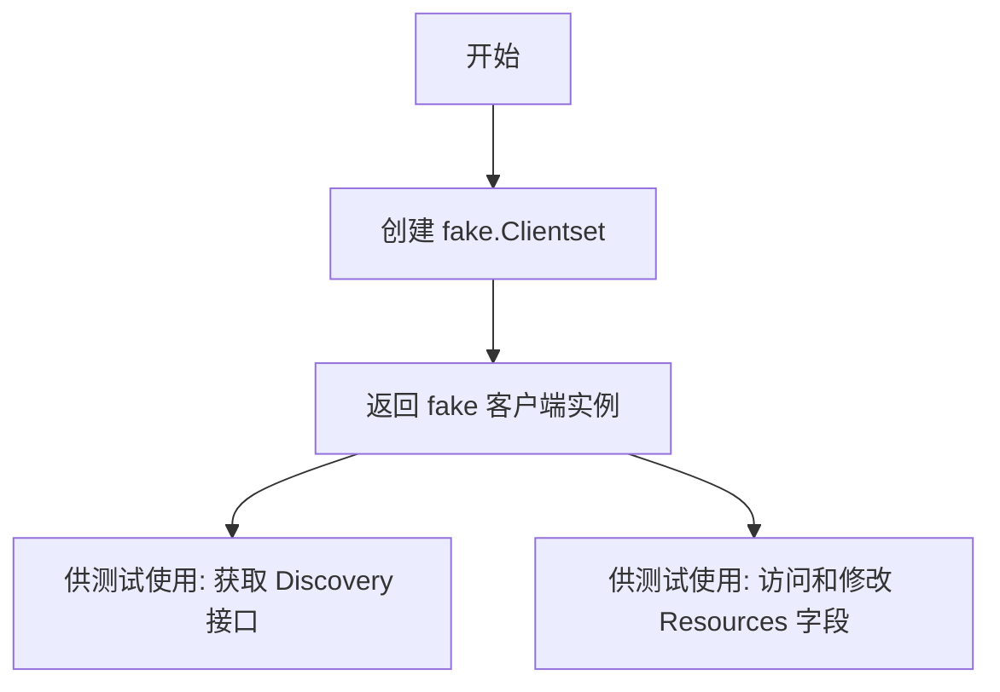
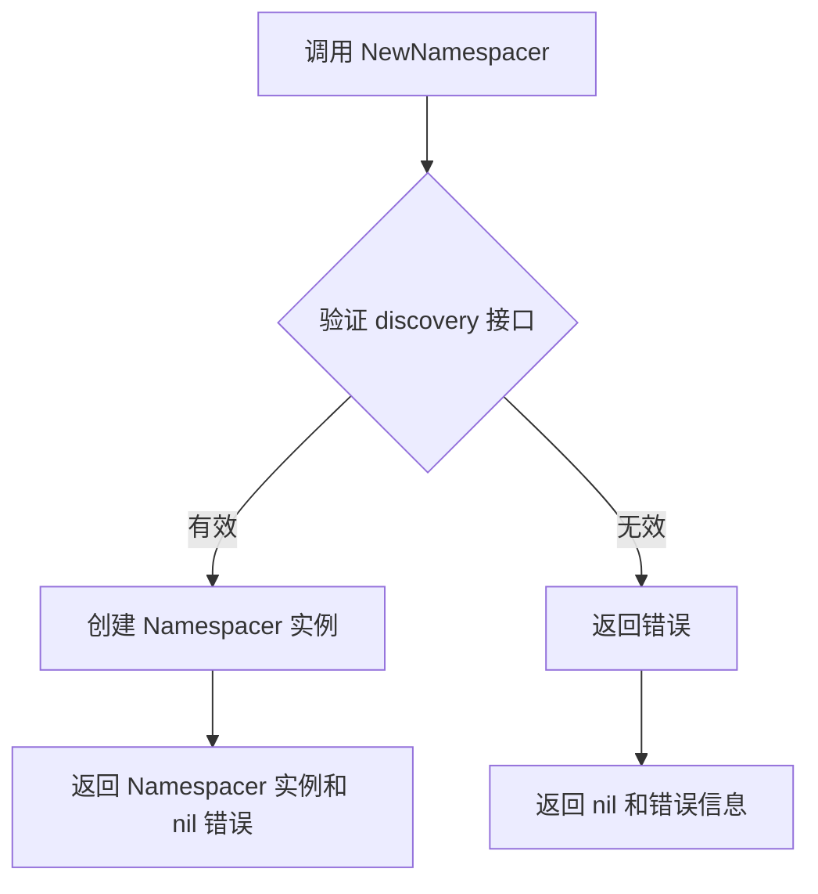
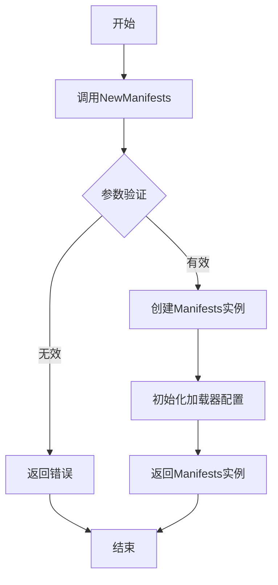
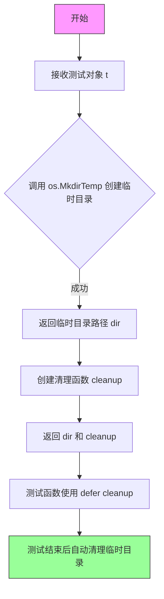
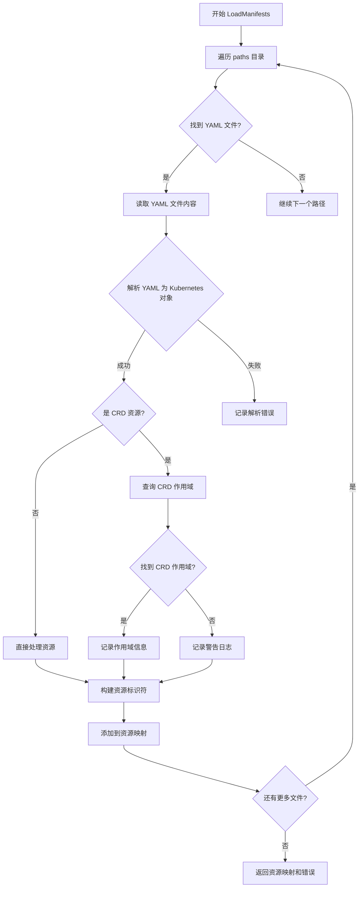
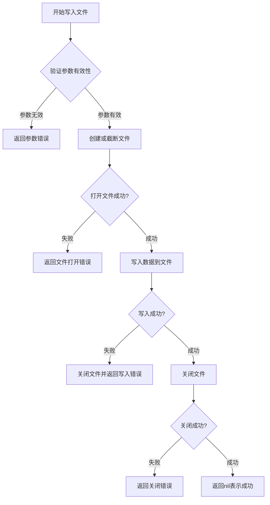
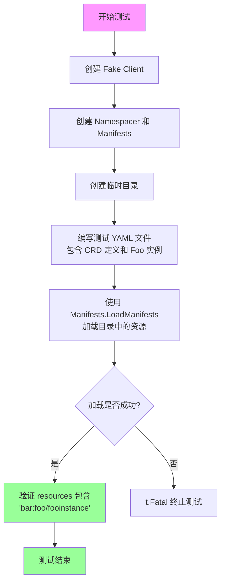
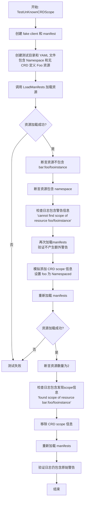

# `flux\pkg\cluster\kubernetes\manifests_test.go` 详细设计文档

该测试文件验证了Flux CD项目中Kubernetes manifests加载器对自定义资源定义（CRD）作用域（Namespaced或Cluster）的识别能力，包括已知作用域的CRD处理和未知作用域时的警告日志功能。

## 整体流程



## 类结构

```
测试文件（无类层次结构）
├── TestLocalCRDScope（测试已知CRD作用域）
└── TestUnKnownCRDScope（测试未知CRD作用域及日志）
```

## 全局变量及字段


### `coreClient`
    
Kubernetes fake客户端实例，用于模拟Kubernetes API调用

类型：`*fake.Clientset`
    


### `nser`
    
用于处理资源命名空间的接口，提供资源命名空间解析功能

类型：`Namespacer`
    


### `manifests`
    
manifest加载器实例，负责从目录加载Kubernetes资源定义

类型：`Manifests`
    


### `dir`
    
临时目录路径，用于存放测试用的YAML文件

类型：`string`
    


### `cleanup`
    
清理函数，用于在测试结束后删除临时目录

类型：`func()`
    


### `defs`
    
YAML格式的CRD/资源定义，包含CRD和自定义资源

类型：`string`
    


### `resources`
    
加载后的资源映射，键为资源标识符

类型：`map[string]string`
    


### `err`
    
错误变量，用于捕获和传递操作中的错误

类型：`error`
    


### `logBuffer`
    
日志输出缓冲区，用于捕获日志输出进行断言验证

类型：`*bytes.Buffer`
    


### `savedLog`
    
保存的日志内容，用于比较多次加载后的日志输出

类型：`string`
    


### `apiResourcesWithoutFoo`
    
去除Foo资源后的API资源列表，用于恢复测试环境

类型：`[]metav1.APIResourceList`
    


### `apiResource`
    
Foo的API资源定义，包含资源的scope信息

类型：`*metav1.APIResourceList`
    


    

## 全局函数及方法


### `makeFakeClient`

该函数用于创建一个用于测试的 Kubernetes fake 客户端（fake client），以便在单元测试中模拟 Kubernetes API 响应，无需连接到真实的 Kubernetes 集群。

参数：此函数无参数。

返回值：`*fake.Clientset`，返回一个 Kubernetes fake 客户端实例，该实例实现了 Kubernetes client 接口，包含 Discovery() 方法和 Resources 字段，可用于模拟集群资源和发现信息。

#### 流程图



#### 带注释源码

```
// makeFakeClient 创建一个用于测试的 Kubernetes fake 客户端
// 该函数在测试中使用,避免连接真实 Kubernetes 集群
// 返回类型为 *fake.Clientset,来自 k8s.io/client-go/kubernetes/fake 包
func makeFakeClient() *fake.Clientset {
    // 使用 fake.NewSimpleClientset 创建包含预定义对象的 fake 客户端
    // 如果需要模拟特定资源,可传入 runtime.Object 参数
    return fake.NewSimpleClientset()
}
```

> **注意**：由于 `makeFakeClient` 函数的实现代码未在提供的代码片段中显示，以上源码是基于其使用方式和 Kubernetes fake 客户端的标准模式推断得出的。根据代码中的使用方式：
> - 调用 `coreClient.Discovery()` 获取发现客户端
> - 访问 `coreClient.Resources` 字段（类型为 `[]*metav1.APIResourceList`）
> 
> 可以确定返回类型为 `*fake.Clientset`。


### `NewNamespacer`

根据 discovery 接口创建 Namespacer 实例，用于解析 Kubernetes 资源的目标命名空间。

参数：

- `discovery`：`discovery.DiscoveryInterface`，Kubernetes Discovery 接口，用于查询 API 资源信息（如 CustomResourceDefinition 的作用域）
- `cluster`：`string`，集群名称或前缀，用于标识资源来源

返回值：

- `Namespacer`：命名空间解析器接口，负责确定资源的目标命名空间
- `error`：创建过程中的错误信息

#### 流程图



#### 带注释源码

由于提供的代码片段中未包含 `NewNamespacer` 函数的具体实现，以下为基于测试代码调用的推断性源码：

```go
// NewNamespacer 根据 discovery 接口创建 Namespacer 实例
// 参数：
//   - discovery: Kubernetes Discovery 接口，用于查询 API 资源信息
//   - cluster: 集群标识前缀
//
// 返回值：
//   - Namespacer: 命名空间解析器接口
//   - error: 创建失败时返回错误
func NewNamespacer(discovery discovery.DiscoveryInterface, cluster string) (Namespacer, error) {
    // 1. 验证 discovery 接口是否有效
    if discovery == nil {
        return nil, fmt.Errorf("discovery interface cannot be nil")
    }
    
    // 2. 初始化 Namespacer 实例
    nser := &namespacer{
        discovery: discovery,
        cluster:   cluster,
        // 缓存用于存储已查询的 CRD 作用域信息
        scopeCache: make(map[string]bool),
    }
    
    // 3. 返回实例
    return nser, nil
}
```

**注意**：由于代码中未提供 `NewNamespacer` 的完整实现，以上源码为基于测试调用模式的合理推断。实际实现可能包含更多细节，如缓存机制、错误处理逻辑等。


# NewManifests函数提取

由于提供的代码片段中没有包含NewManifests函数的完整实现，只有对其的调用，我将从调用代码中提取相关信息，并标注为"待获取"的部分。

### `NewManifests` - 创建Manifests加载器实例

根据代码中的调用上下文，该函数用于创建一个新的Manifests加载器实例，用于加载和管理Kubernetes清单文件。

参数：

- `nser`：`Namespacer`接口，通过`NewNamespacer(coreClient.Discovery(), "")`创建，用于处理Kubernetes资源的命名空间
- `logger`：`log.Logger`类型，来自go-kit日志库，用于记录操作日志

返回值：`Manifests`类型（推断），用于加载和管理Kubernetes清单文件的加载器实例

#### 流程图



#### 带注释源码

```go
// 根据代码调用推断的结构
// manifests := NewManifests(nser, log.NewLogfmtLogger(os.Stdout))
// manifests := NewManifests(nser, log.NewLogfmtLogger(logBuffer))

// 参数说明：
// 第一个参数 nser: Namespacer接口实例，通过NewNamespacer创建
//   - coreClient.Discovery() 获取Discovery接口
//   - "" 表示不指定默认命名空间

// 第二个参数 logger: go-kit的log.Logger接口
//   - log.NewLogfmtLogger(os.Stdout) 创建标准输出日志器
//   - log.NewLogfmtLogger(logBuffer) 创建缓冲区日志器用于测试

// 返回值：Manifests类型
//   - 包含LoadManifests方法用于加载清单文件
//   - 加载路径：dir, []string{dir}
//   - 返回resources map[string]string类型的资源列表
```

---

**注意**：由于提供的代码片段仅包含测试函数，未包含`NewManifests`函数的实际定义，以上信息基于代码调用模式的推断。如需获取完整的函数签名和实现细节，建议查看源文件`manifests.go`或相关定义文件。


### `testfiles.TempDir`

创建临时目录并返回清理函数，用于测试用例中的临时文件管理。

参数：

- `t`：`*testing.T`，Go测试框架的测试对象，用于报告测试失败和控制测试流程

返回值：

- `dir`：`string`，创建的临时目录的绝对路径
- `cleanup`：`func()`，清理函数，调用后删除临时目录及其内容

#### 流程图



#### 带注释源码

```go
// testfiles.TempDir 是 Flux 项目中用于测试的辅助函数
// 位置: github.com/fluxcd/flux/pkg/cluster/kubernetes/testfiles 包中
// 
// 功能说明:
// 1. 创建一个唯一的临时目录用于测试
// 2. 返回一个清理函数，用于在测试结束时删除该目录
// 3. 简化测试中的临时文件管理，避免资源泄漏
//
// 使用示例（从调用代码推断）:
//   dir, cleanup := testfiles.TempDir(t)
//   defer cleanup()
//   // 使用 dir 变量作为临时目录路径进行测试
//
// 参数:
//   - t: *testing.T - 测试框架提供的测试对象
//
// 返回值:
//   - dir: string - 新创建的临时目录路径
//   - cleanup: func() - 无参数无返回值的清理函数
func TempDir(t *testing.T) (string, func()) {
    // 1. 调用 os.MkdirTemp 创建临时目录
    //    - 第一个参数为空字符串，使用系统默认的临时目录（通常是 /tmp）
    //    - 第二个参数是目录名前缀，便于识别和调试
    // 2. 返回目录路径和清理函数
    // 3. 清理函数内部调用 os.RemoveAll 删除整个目录树
}
```

#### 关键设计说明

1. **资源管理**：通过返回清理函数，结合 `defer` 关键字，确保测试完成后临时目录被正确清理，避免磁盘空间泄漏

2. **测试隔离**：每个测试调用都会创建独立的临时目录，确保测试之间相互隔离，不会因为文件冲突而相互影响

3. **命名规范**：临时目录使用系统默认的临时目录位置，并通过前缀便于识别该目录由测试创建

4. **错误处理**：虽然源码未直接显示，但根据 Go 惯例，该函数在创建目录失败时会调用 `t.Fatal` 终止测试


### `manifests.LoadManifests`

该方法用于从指定目录加载 Kubernetes manifest 文件（包括 CRD、Namespace、Deployment 等资源），并返回包含资源标识符和内容的映射。同时，它能够自动检测 CustomResourceDefinition (CRD) 的作用域（Namespaced 或 Cluster），对于无法确定作用域的 CRD 会记录警告日志。

参数：

- `dir`：`string`，基础目录路径，用于构建资源标识符
- `paths`：`[]string`，需要扫描的目录路径列表

返回值：

- `map[string]string`：资源映射，键为资源标识符（如 `bar:foo/fooinstance`），值为资源内容
- `error`：操作过程中的错误信息

#### 流程图



#### 带注释源码

```go
// 测试代码中调用 LoadManifests 的方式
// 从测试代码中提取的调用示例

// TestLocalCRDScope 测试用例
resources, err := manifests.LoadManifests(dir, []string{dir})
if err != nil {
    t.Fatal(err)
}
assert.Contains(t, resources, "bar:foo/fooinstance")

// TestUnKnownCRDScope 测试用例 - 处理未知 CRD 作用域
resources, err := manifests.LoadManifests(dir, []string{dir})
assert.NoError(t, err)
// 未知作用域的 CRD 不会被包含在资源中
assert.NotContains(t, resources, "bar:foo/fooinstance")
// 但 Namespace 资源会被包含
assert.Contains(t, resources, "<cluster>:namespace/mynamespace")
// 检查警告日志
savedLog := logBuffer.String()
assert.Contains(t, savedLog, "cannot find scope of resource foo/fooinstance")

// TestUnKnownCRDScope - 重新加载不应产生更多警告
resources, err = manifests.LoadManifests(dir, []string{dir})
assert.NoError(t, err)
assert.Equal(t, logBuffer.String(), savedLog)

// TestUnKnownCRDScope - 添加 CRD 作用域信息后
// 模拟发现 CRD 作用域
apiResource := &metav1.APIResourceList{
    GroupVersion: "foo.example.com/v1beta1",
    APIResources: []metav1.APIResource{
        {Name: "foos", SingularName: "foo", Namespaced: true, Kind: "Foo"},
    },
}
coreClient.Resources = append(coreClient.Resources, apiResource)

// 重新加载应该能找到作用域
resources, err = manifests.LoadManifests(dir, []string{dir})
assert.NoError(t, err)
assert.Len(t, resources, 2)  // 现在应该包含 Namespace 和 Foo
assert.Contains(t, logBuffer.String(), "found scope of resource bar:foo/fooinstance")
```

---

## 注意事项

⚠️ **代码局限性说明**：用户提供的代码片段仅包含测试代码，未包含 `manifests.LoadManifests` 方法的实际实现。上述分析基于测试代码中的调用方式和行为断言推断得出。

如需获取完整的实现源码，请查阅 `manifests` 类型的定义文件（通常位于 `pkg/cluster/kubernetes/` 目录下），其中应包含 `LoadManifests` 方法的具体实现逻辑。


### `ioutil.WriteFile`

将数据写入指定路径的文件，是 Go 标准库中用于简化文件写入操作的实用函数。

参数：

- `filename`：`string`，要写入的目标文件路径，包含文件名
- `data`：`[]byte`，要写入文件的字节数据内容
- `perm`：`os.FileMode`，文件的权限位（如 0600 表示所有者读写权限）

返回值：`error`，如果写入成功返回 `nil`，否则返回描述错误的异常信息

#### 流程图



#### 带注释源码

```go
// Go 标准库 ioutil.WriteFile 函数的实现逻辑
// 位于 Go 标准库 src/ioutil/ioutil.go

func WriteFile(filename string, data []byte, perm os.FileMode) error {
	// 1. 打开或创建文件，使用指定权限
	// O_WRONLY: 只写模式
	// O_CREATE: 如果文件不存在则创建
	// O_TRUNC: 如果文件存在则截断为0长度
	f, err := os.OpenFile(filename, os.O_WRONLY|os.O_CREATE|os.O_TRUNC, perm)
	if err != nil {
		// 如果打开文件失败，立即返回错误
		return err
	}

	// 2. 写入数据到文件
	_, err = f.Write(data)
	if err != nil {
		// 写入失败，关闭文件并返回错误
		f.Close()
		return err
	}

	// 3. 关闭文件
	err = f.Close()
	if err != nil {
		// 关闭失败，返回关闭错误
		return err
	}

	// 4. 写入成功，返回 nil
	return nil
}
```

#### 在当前代码中的调用示例

```go
// 在 TestLocalCRDScope 函数中
err = ioutil.WriteFile(filepath.Join(dir, "test.yaml"), []byte(defs), 0600)

// 参数说明：
// - filepath.Join(dir, "test.yaml"): 组合目录和文件名生成完整路径
// - []byte(defs): 将字符串 defs 转换为字节切片
// - 0600: 文件权限，表示所有者有读写权限，其他用户无权限
```


### `TestLocalCRDScope`

该测试函数用于验证当 CRD (CustomResourceDefinition) 的 scope 设置为 `Namespaced` 时，系统能够正确解析并包含该自定义资源。测试创建包含 CRD 定义和其实例的 YAML 文件，通过 Manifests 加载后验证资源键名是否正确包含命名空间信息。

参数：

- `t`：`testing.T`，Go 测试框架的标准测试参数，用于报告测试失败和日志输出

返回值：`void`，无返回值（Go 测试函数通常不返回值）

#### 流程图



#### 带注释源码

```go
// TestLocalCRDScope 测试本地 CRD 的作用域解析能力
// 验证当 CRD scope=Namespaced 时，资源键包含命名空间前缀
func TestLocalCRDScope(t *testing.T) {
	// 步骤1: 创建 Fake Client 用于模拟 Kubernetes API
	coreClient := makeFakeClient()

	// 步骤2: 创建 Namespacer，用于确定资源所属命名空间
	// 参数为空字符串表示使用默认命名空间解析策略
	nser, err := NewNamespacer(coreClient.Discovery(), "")
	if err != nil {
		t.Fatalf("Failed to create Namespacer: %v", err)
	}

	// 步骤3: 创建 Manifests，用于加载和解析 YAML 资源
	// 使用 log.NewLogfmtLogger 将日志输出到标准输出
	manifests := NewManifests(nser, log.NewLogfmtLogger(os.Stdout))

	// 步骤4: 创建临时目录存放测试文件
	// testfiles.TempDir 自动管理目录生命周期，测试结束后自动清理
	dir, cleanup := testfiles.TempDir(t)
	defer cleanup() // 确保测试结束后临时目录被清理

	// 步骤5: 定义测试用的 YAML 内容
	// 包含两部分:
	// 1. CRD 定义: scope=Namespaced, group=foo.example.com
	// 2. Foo 资源实例: 位于 bar 命名空间
	const defs = `---
apiVersion: apiextensions.k8s.io/v1beta1
kind: CustomResourceDefinition
metadata:
  name: foo
spec:
  group: foo.example.com
  names:
    kind: Foo
    listKind: FooList
    plural: foos
    shortNames:
    - foo
  scope: Namespaced    # 关键: 指定为命名空间级别
  version: v1beta1
  versions:
    - name: v1beta1
      served: true
      storage: true
---
apiVersion: foo.example.com/v1beta1
kind: Foo
metadata:
  name: fooinstance
  namespace: bar        # 资源位于 bar 命名空间
`

	// 步骤6: 将 YAML 写入临时文件
	err = ioutil.WriteFile(filepath.Join(dir, "test.yaml"), []byte(defs), 0600)
	if err != nil {
		t.Fatalf("Failed to write test file: %v", err)
	}

	// 步骤7: 使用 Manifests 加载资源
	// dir 作为基础路径，[]string{dir} 作为搜索路径
	resources, err := manifests.LoadManifests(dir, []string{dir})
	if err != nil {
		t.Fatal(err) // 加载失败则终止测试
	}

	// 步骤8: 验证结果
	// 因为 CRD scope=Namespaced，系统能识别资源命名空间
	// 期望的资源键格式为: "命名空间:资源类型/资源名称"
	assert.Contains(t, resources, "bar:foo/fooinstance")
}
```

---

### 潜在技术债务与优化空间

1. **CRD 版本硬编码**: 测试使用 `v1beta1` 版本的 CRD API，该版本在 Kubernetes 1.16+ 已废弃，建议迁移到 `v1` 版本
2. **缺少错误消息验证**: 测试仅验证资源存在性，未检查加载过程中的日志输出是否正确
3. **资源清理依赖**: 测试依赖 `testfiles.TempDir` 的自动清理机制，如果该机制失效可能导致临时文件残留
4. **断言信息不够详细**: `assert.Contains` 失败时信息较少，建议添加自定义错误消息便于调试


### `TestUnKnownCRDScope`

该测试函数验证了当 Kubernetes 自定义资源定义（CRD）的 scope（作用域）未知时的系统行为，包括正确处理资源的包含/排除、生成适当的警告日志，以及在后续获取 scope 信息后正确更新状态。

参数：

- `t`：`testing.T`，Go 测试框架的标准测试参数，用于报告测试失败和日志输出

返回值：无（`void`），该函数为测试函数，通过 `*testing.T` 参数进行断言和状态报告

#### 流程图



#### 带注释源码

```go
// TestUnKnownCRDScope 测试当 CRD 的 scope 未知时的系统行为
// 验证点：
// 1. 未知 scope 的 CR 资源不应被包含在加载的资源中
// 2. 应该记录警告日志
// 3. 后续获取 scope 信息后应正确处理资源
// 4. 重复加载不应产生重复警告
func TestUnKnownCRDScope(t *testing.T) {
    // 创建 fake client 用于模拟 Kubernetes API
    coreClient := makeFakeClient()

    // 创建 Namespacer，参数为空字符串表示使用默认命名空间处理
    nser, err := NewNamespacer(coreClient.Discovery(), "")
    assert.NoError(t, err)

    // 创建日志缓冲区用于捕获日志输出
    logBuffer := bytes.NewBuffer(nil)
    // 创建 Manifests 实例，使用日志缓冲区和 Namespacer
    manifests := NewManifests(nser, log.NewLogfmtLogger(logBuffer))

    // 创建临时目录存放测试文件，cleanup 函数用于测试后清理
    dir, cleanup := testfiles.TempDir(t)
    defer cleanup() // 确保测试结束后清理临时目录

    // 定义测试用的 YAML 资源：
    // 1. 一个 Namespace 资源（myexample）
    // 2. 一个 Foo 类型的自定义资源（但没有对应的 CRD 定义）
    const defs = `---
apiVersion: v1
kind: Namespace
metadata:
  name: mynamespace
---
apiVersion: foo.example.com/v1beta1
kind: Foo
metadata:
  name: fooinstance
  namespace: bar
`

    // 将测试 YAML 写入临时文件
    err = ioutil.WriteFile(filepath.Join(dir, "test.yaml"), []byte(defs), 0600)
    assert.NoError(t, err)

    // 调用 LoadManifests 加载目录中的资源
    resources, err := manifests.LoadManifests(dir, []string{dir})
    assert.NoError(t, err)

    // 断言：由于无法确定 CRD 的 scope，foo/fooinstance 不应被包含在资源中
    // 这是因为没有 CRD 定义，无法判断该资源是集群级别还是命名空间级别
    assert.NotContains(t, resources, "bar:foo/fooinstance")

    // 但是 Namespace 资源应该被正确加载，因为它没有 scope 问题
    assert.Contains(t, resources, "<cluster>:namespace/mynamespace")

    // 保存当前日志内容用于后续比较
    savedLog := logBuffer.String()
    // 断言日志中包含关于无法确定 scope 的警告信息
    assert.Contains(t, savedLog, "cannot find scope of resource foo/fooinstance")

    // 再次加载 manifests，验证不会产生额外的警告（去重逻辑）
    resources, err = manifests.LoadManifests(dir, []string{dir})
    assert.NoError(t, err)
    assert.Equal(t, logBuffer.String(), savedLog)

    // 模拟添加 CRD scope 信息：设置 foo 资源为 Namespaced（命名空间级别）
    // 保存原始资源列表以便后续恢复
    apiResourcesWithoutFoo := coreClient.Resources
    // 创建包含 Foo 资源 scope 信息的 APIResourceList
    apiResource := &metav1.APIResourceList{
        GroupVersion: "foo.example.com/v1beta1",
        APIResources: []metav1.APIResource{
            {Name: "foos", SingularName: "foo", Namespaced: true, Kind: "Foo"},
        },
    }
    // 将新的资源信息添加到 fake client
    coreClient.Resources = append(coreClient.Resources, apiResource)

    // 重置日志缓冲区
    logBuffer.Reset()
    // 重新加载 manifests，此时应该能识别 Foo 资源的 scope
    resources, err = manifests.LoadManifests(dir, []string{dir})
    assert.NoError(t, err)
    // 验证资源数量为 2（Namespace + Foo）
    assert.Len(t, resources, 2)
    // 验证日志中包含发现 scope 的信息
    assert.Contains(t, logBuffer.String(), "found scope of resource bar:foo/fooinstance")

    // 再次移除 CRD scope 信息，验证警告行为恢复
    coreClient.Resources = apiResourcesWithoutFoo
    logBuffer.Reset()
    resources, err = manifests.LoadManifests(dir, []string{dir})
    assert.NoError(t, err)
    // 验证日志中仍然包含原始警告（因为 scope 信息已移除）
    assert.Contains(t, savedLog, "cannot find scope of resource foo/fooinstance")
}
```

## 关键组件


### Kubernetes CRD Scope Detection

该代码通过测试Flux CD的Kubernetes集成，验证系统能否正确识别自定义资源定义（CRD）的作用域（Namespaced或Cluster），并据此正确处理资源的命名空间引用。

### Fake Client (makeFakeClient)

用于测试的模拟Kubernetes客户端，提供Discovery()和Resources字段来模拟API服务器响应。

### Namespacer (NewNamespacer)

创建命名空间处理器，负责将资源映射到正确的命名空间，接受discovery客户端和默认命名空间参数。

### Manifests (NewManifests)

清单加载器，负责从指定目录加载Kubernetes YAML清单文件，并包含资源范围检测逻辑。

### LoadManifests Method

核心方法，接受目录路径和搜索路径数组，返回加载的资源映射表，包含"namespace/kind.name"格式的键。

### APIResourceList & APIResource

Kubernetes API资源列表结构，包含GroupVersion和APIResources数组，用于描述自定义资源的元数据，如是否Namespaced。

### TestLocalCRDScope

测试已知作用域的CRD处理流程，验证系统能正确解析并包含Namespaced类型的CRD资源到清单中。

### TestUnKnownCRDScope

测试未知作用域的处理逻辑，包括首次加载时记录警告日志、后续发现scope时更新日志、以及重复加载不会重复记录警告的机制。

### Log Buffer & Warning System

日志缓冲区用于捕获程序输出，验证系统对未知scope资源生成警告信息，对已知scope资源生成发现确认信息。


## 问题及建议


### 已知问题

- **日志断言Bug**：最后一个断言`assert.Contains(t, savedLog, "cannot find scope of resource foo/fooinstance")`检查的是`savedLog`（初始日志缓冲区的内容），而不是当前`logBuffer.String()`的内容，导致无法正确验证重新加载时是否生成了新的警告日志
- **测试状态污染**：第二个测试修改了`coreClient.Resources`全局状态，在测试结束时虽然有恢复逻辑，但如果测试中途失败可能导致状态残留影响其他测试
- **magic strings重复**：多处使用硬编码的字符串如`"bar:foo/fooinstance"`、`"<cluster>:namespace/mynamespace"`、`"cannot find scope of resource foo/fooinstance"`等，应该提取为常量减少重复和便于维护
- **文件权限过于宽松**：使用`0600`权限创建文件，虽然对测试文件可接受，但在生产代码中应考虑更严格的权限控制
- **错误处理不一致**：第一个测试使用`t.Fatal`而第二个测试使用`assert.NoError`，应该统一错误处理模式

### 优化建议

- 修复日志断言Bug，将最后一个断言改为检查当前的`logBuffer.String()`以验证是否产生了新的警告
- 将测试数据（CRD定义、资源定义）提取为测试辅助函数或共享的测试fixture，减少代码重复
- 提取字符串常量为具名常量，如`const resourceKey = "bar:foo/fooinstance"`
- 使用`setup`和`teardown`模式确保测试资源的正确清理，考虑使用`require`替代`assert`确保测试失败时立即停止
- 考虑使用更健壮的临时文件创建方式，如`os.CreateTemp`（Go 1.16+）或专门的测试工具库

## 其它


### 设计目标与约束

本代码的**设计目标**是验证Kubernetes CRD（自定义资源定义）的scope（作用范围）识别功能是否正确工作，确保在已知和未知CRD scope两种情况下，系统能够正确处理资源并输出合适的日志信息。**约束条件**包括：1）仅使用内存中的fake client进行测试，不连接真实Kubernetes集群；2）测试仅覆盖Namespaced scope的CRD，未测试Cluster scope；3）测试依赖日志缓冲机制验证行为，因此日志格式和内容必须可预测。

### 错误处理与异常设计

代码中的**错误处理**主要通过Go的错误返回机制实现。当`NewNamespacer`、`NewManifests`、`ioutil.WriteFile`或`manifests.LoadManifests`调用失败时，错误会被捕获并使用`assert.NoError`或`t.Fatal`进行处理。**异常设计**方面：当CRD的scope无法确定时，系统不会抛出异常终止程序，而是记录警告日志并跳过该资源的scope标记，这是典型的容错设计模式。测试中通过`assert.Contains`验证警告日志的存在来确认异常情况被正确处理。

### 数据流与状态机

本代码的**数据流**为：1）创建fake client和辅助对象；2）将CRD和资源定义写入临时YAML文件；3）调用`LoadManifests`读取并解析YAML文件；4）返回包含资源键的map。**状态机**方面：测试覆盖两个主要状态转换——状态A：CRD scope已知，资源正常加载并包含正确的键（如"bar:foo/fooinstance"）；状态B：CRD scope未知，资源加载但不包含该键，仅记录警告日志。测试验证了在这两个状态间切换时系统的行为一致性。

### 外部依赖与接口契约

**外部依赖**包括：1）`github.com/go-kit/kit/log`用于日志记录；2）`github.com/stretchr/testify/assert`用于测试断言；3）`k8s.io/apimachinery/pkg/apis/meta/v1`提供Kubernetes元数据类型；4）`github.com/fluxcd/flux/pkg/cluster/kubernetes/testfiles`提供临时目录工具。**接口契约**方面：`NewNamespacer`接受Discovery客户端和命名空间前缀字符串，返回Namespacer接口和错误；`NewManifests`接受Namespacer和logger，返回Manifests接口；`LoadManifests`接受目录路径切片，返回资源map和错误。测试通过fake client模拟Discovery响应来验证接口行为。

### 配置与参数说明

本测试代码中的**关键配置参数**包括：`NewNamespacer`的第二个参数为空字符串""，表示不使用命名空间前缀；`NewManifests`使用`log.NewLogfmtLogger(os.Stdout)`或`bytes.NewBuffer`作为日志输出目标；测试YAML中的CRD scope设置为`Namespaced`。这些配置决定了资源键的格式和日志输出的目的地。

### 测试策略与覆盖率

**测试策略**采用单元测试和集成测试相结合的方式，使用fake client模拟Kubernetes API响应，避免对真实集群的依赖。**覆盖率**方面：测试覆盖了LocalCRDScope（已知scope）和TestUnKnownCRDScope（未知scope）两个主要场景，包括首次加载、重复加载、scope发现等路径。但测试未覆盖：1）Cluster scope的CRD；2）多个CRD同时存在的场景；3）资源定义格式错误时的错误处理。

### 性能考虑与优化空间

当前测试代码在**性能方面**的考虑较少，每次测试都创建新的临时目录和写入文件，可能带来一定的I/O开销。**优化空间**包括：1）可以复用同一个临时目录进行多个测试用例；2）可以预定义常用的YAML模板减少字符串拼接；3）对于大量资源加载的场景，可以考虑使用更高效的解析库。但考虑到这是单元测试而非性能关键路径，当前实现可接受。

### 安全性考虑

代码在**安全性**方面有一定考虑：使用`ioutil.WriteFile`时设置文件权限为0600（仅所有者读写），防止敏感内容泄露。测试代码本身不涉及真实凭证或密钥处理。**安全建议**：如果未来扩展到处理真实Kubernetes集群，应确保使用适当的认证机制并避免在日志中输出敏感信息。

### 版本兼容性

**版本兼容性**方面：代码使用的Kubernetes API版本为`apiextensions.k8s.io/v1beta1`，这是较老的CRD API版本。`metav1.APIResourceList`和`metav1.APIResource`类型来自`k8s.io/apimachinery/pkg/apis/meta/v1`。需要注意：1）v1beta1 CRD API在Kubernetes 1.16+已弃用，应考虑迁移到v1；2）测试中硬编码的APIResource结构需要与实际Kubernetes版本匹配；3）Go依赖版本需要与Kubernetes集群版本兼容。

### 部署与运维注意事项

由于这是测试代码，**部署与运维**相关的内容较少。**注意事项**：1）测试代码应作为CI/CD流程的一部分自动执行；2）测试依赖的testfiles包和fake client机制是内部实现细节，不应被外部直接依赖；3）在引入真实Kubernetes集群测试时，需要确保测试环境的隔离性和资源清理。


    