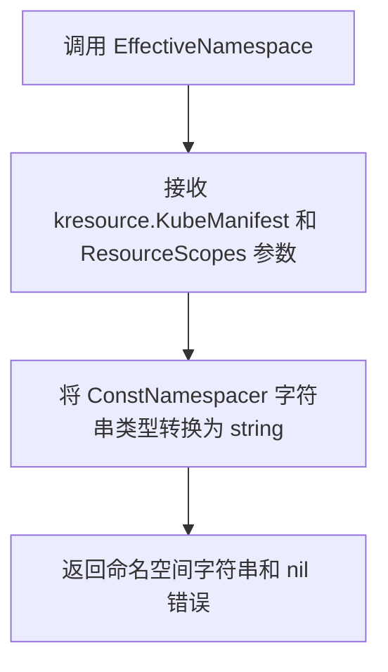
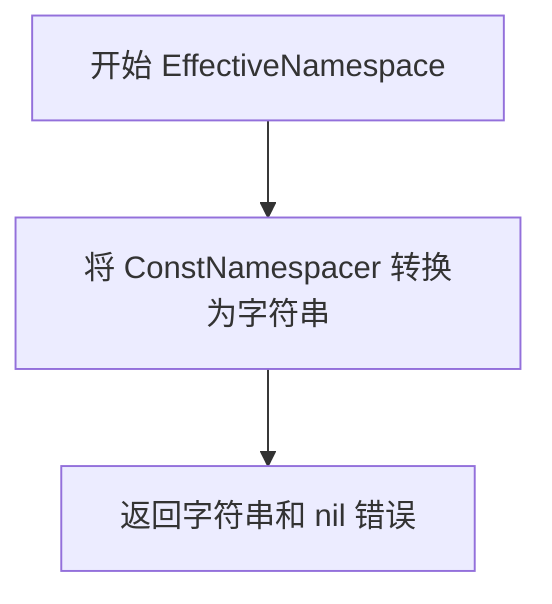

# `flux\pkg\cluster\kubernetes\mock.go` 详细设计文档

该代码定义了一个 ConstNamespacer 类型，基于 string 实现了一个简单的命名空间解析器，其 EffectiveNamespace 方法直接返回固定的命名空间字符串，实现了 NamespaceResolver 接口。

## 整体流程



## 类结构

```
kubernetes 包
└── ConstNamespacer (类型定义，基于 string)
    └── EffectiveNamespace 方法 (实现 NamespaceResolver 接口)
```

## 全局变量及字段


    

## 全局函数及方法


### `ConstNamespacer.EffectiveNamespace`

该方法实现了命名空间提供者接口，返回一个固定的命名空间值，即 ConstNamespacer 本身所包含的字符串值。

参数：

- `manifest`：`kresource.KubeManifest`，Kubernetes 资源清单
- `_`：`ResourceScopes`，资源作用域（未使用）

返回值：`(string, error)`，返回命名空间字符串，错误始终为 nil

#### 流程图



#### 带注释源码

```go
// ConstNamespacer 是一个字符串类型，实现了 NamespaceProvider 接口
type ConstNamespacer string

// EffectiveNamespace 返回由 ConstNamespacer 本身表示的命名空间
// 参数:
//   - manifest: Kubernetes 资源清单 (未使用)
//   - _: 资源作用域 (未使用)
//
// 返回值:
//   - string: 命名空间字符串
//   - error: 始终返回 nil，因为没有错误情况
func (ns ConstNamespacer) EffectiveNamespace(manifest kresource.KubeManifest, _ ResourceScopes) (string, error) {
    // 将 ConstNamespacer 字符串类型转换为 string 类型并返回
    // 错误始终为 nil，表示该方法永远不会失败
    return string(ns), nil
}
```

## 关键组件


### ConstNamespacer 类型

一个字符串类型别名，用于表示常量命名空间实现，通过实现 EffectiveNamespace 方法返回固定的命名空间值。

### EffectiveNamespace 方法

实现命名空间接口的核心方法，接收 KubeManifest 资源和资源作用域，返回常量字符串形式的命名空间，忽略输入的资源内容，始终返回预定义的命名空间值。


## 问题及建议


### 已知问题

-   **未使用的参数**：方法签名中的 `manifest` 参数未被使用，参数 `_` 明确表示 `ResourceScopes` 也未使用，这种写法虽然符合 Go 惯例但应确认是否为设计意图
-   **总是返回 nil 错误**：`EffectiveNamespace` 方法始终返回 `nil` 错误，这使得错误处理机制形同虚设，调用者无法依赖返回的错误进行有效的异常处理
-   **功能局限性**：`ConstNamespacer` 作为简单的 `string` 类型别名，功能极为有限，无法处理动态命名空间场景，缺乏扩展性
-   **缺少文档注释**：类型和方法均无任何 Go 文档注释（godoc），影响代码可读性和维护性
-   **命名不清晰**：`ConstNamespacer` 的命名语义不够明确，"Const" 前缀的含义不清晰，可能造成理解困惑

### 优化建议

-   **移除未使用参数或添加用途**：如果 `manifest` 参数确实不需要，考虑移除该参数或添加注释说明为何需要此参数（可能用于未来扩展）
-   **改进错误处理设计**：如果当前场景下确实不会出错，考虑移除返回的 error 类型，采用更简洁的函数签名；或者保留 error 以便未来扩展
-   **增强类型语义**：考虑将 `ConstNamespacer` 封装为结构体，增加更多元数据字段，提高扩展性
-   **添加文档注释**：为类型和方法添加清晰的 godoc 注释，说明用途、使用场景和行为
-   **考虑接口一致性**：检查此实现是否符合预期的 `NamespaceResolver` 或类似接口契约，确保与其他实现保持一致


## 其它


### 设计目标与约束

该代码实现了一个简单的命名空间抽象接口，用于在Kubernetes资源管理中提供固定的命名空间解决方案。设计目标是提供一个轻量级的命名空间包装器，使得资源可以强制使用预定义的命名空间，不受其他配置的影响。约束包括必须实现`NamespaceReader`接口的`EffectiveNamespace`方法，返回值必须是有效的Kubernetes命名空间字符串。

### 错误处理与异常设计

当前实现中`EffectiveNamespace`方法始终返回字符串值和nil错误，不进行任何验证。在生产环境中应考虑添加命名空间格式验证，确保返回的命名空间符合Kubernetes命名规范（如长度限制、字符集限制等）。建议在方法内部添加验证逻辑，当命名空间无效时返回适当的错误信息。

### 数据流与状态机

该组件作为命名空间解析链中的一个环节，数据流为：调用方传入KubeManifest和ResourceScopes → ConstNamespacer.EffectiveNamespace方法 → 返回固定命名空间字符串。该组件不维护任何状态，是无状态的函数对象，每次调用都返回相同的值（基于构造时的常量值）。

### 外部依赖与接口契约

主要依赖项为`github.com/fluxcd/flux/pkg/cluster/kubernetes/resource`包中的`KubeManifest`类型。接口契约要求实现`NamespaceReader`接口，具体为`EffectiveNamespace(manifest KubeManifest, scopes ResourceScopes) (string, error)`方法签名。调用方必须传入有效的KubeManifest对象，scopes参数当前未使用但必须提供以满足接口要求。

### 性能考虑

该实现性能开销极低，仅涉及字符串类型转换操作，无任何I/O操作或复杂计算。在高频调用场景下性能表现优异，不存在内存泄漏风险。建议在性能关键路径中作为首选的命名空间解析策略。

### 安全性考虑

当前实现不进行输入验证，可能存在潜在的安全风险。如果ConstNamespacer的值来自外部配置，应在赋值前进行严格的命名空间名称验证，防止注入恶意内容。建议添加白名单验证机制，确保只使用预先批准的命名空间。

### 测试策略

应包含以下测试用例：基本功能测试验证返回值的正确性、接口兼容性测试确保实现NamespaceReader接口、边界条件测试验证空字符串和特殊字符处理、集成测试验证与Flux资源管理系统的协同工作。单元测试应覆盖正常路径和异常路径。

### 版本兼容性

该代码依赖于特定版本的Flux包，需要在项目依赖管理中明确版本约束。接口设计应保持稳定，避免破坏性变更。考虑使用Go模块版本管理，确保在不同版本的Kubernetes集群和Flux版本间保持兼容性。

### 配置管理

ConstNamespacer的值应在配置层进行管理，建议通过配置中心或环境变量注入。配置项应包括命名空间名称、验证规则等。配置变更应触发相应的重新加载机制，确保运行时配置更新生效。

### 监控与可观测性

建议添加指标收集功能，监控EffectiveNamespace方法的调用频率和执行时间。日志记录应包含方法入参和返回值，便于问题排查和审计追踪。关键路径应添加分布式追踪上下文传播，支持全链路追踪。

### 部署架构

该组件通常部署为Kubernetes Operator或Controller的一部分，作为命名空间解析策略的可插拔实现。建议与Flux的GitOps流程集成，通过Git仓库管理命名空间配置。部署时应考虑高可用性设计，确保控制器实例间的一致性。


    