# `flux\pkg\cluster\kubernetes\namespacer.go` 详细设计文档

该代码实现了一个Kubernetes命名空间解析器，通过查询Kubernetes API Discovery服务来确定资源清单的有效命名空间，处理了集群内查询和已知作用域回退两种策略，模拟了kubectl的默认命名空间行为。

## 整体流程

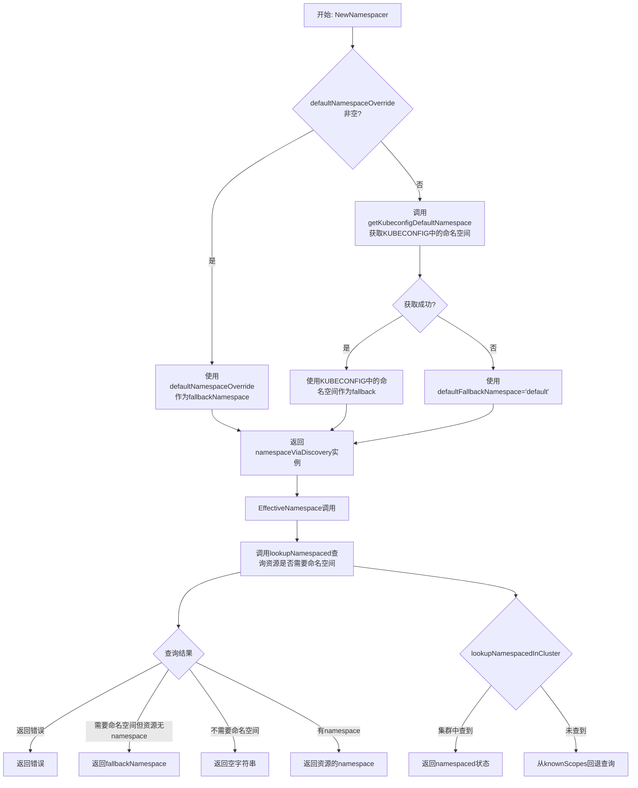

## 类结构

```
namespaceViaDiscovery (struct)
└── fields:
    ├── fallbackNamespace (string)
    └── disco (discovery.DiscoveryInterface)

全局函数:
├── NewNamespacer
├── getKubeconfigDefaultNamespace (函数变量)
├── EffectiveNamespace (方法)
├── lookupNamespaced (方法)
└── lookupNamespacedInCluster (方法)
```

## 全局变量及字段


### `getKubeconfigDefaultNamespace`
    
函数变量，用于获取KUBECONFIG中配置的默认命名空间（可mock用于测试）

类型：`func() (string, error)`
    


### `namespaceViaDiscovery.fallbackNamespace`
    
当资源未指定命名空间时的回退命名空间

类型：`string`
    


### `namespaceViaDiscovery.disco`
    
Kubernetes API发现客户端接口

类型：`discovery.DiscoveryInterface`
    
    

## 全局函数及方法


### `defaultFallbackNamespace`

该常量为 Kubernetes 资源命名空间解析提供默认回退值，当资源未指定命名空间且配置中无可用默认值时使用，等同于 kubectl 的默认行为。

参数：无

返回值：无

#### 流程图

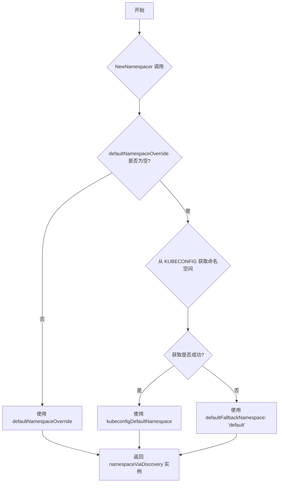

#### 带注释源码

```go
// The namespace to presume if something doesn't have one, and we
// haven't been told what to use as a fallback. This is what
// `kubectl` uses when there's no config setting the fallback
// namespace.
const defaultFallbackNamespace = "default"
```

#### 关联使用场景

在 `NewNamespacer` 函数中，当既没有提供 `defaultNamespaceOverride` 且无法从 KUBECONFIG 获取默认命名空间时，该常量被使用：

```go
return &namespaceViaDiscovery{fallbackNamespace: defaultFallbackNamespace, disco: d}, nil
```

#### 技术债务或优化空间

- **硬编码值**：当前 `"default"` 为硬编码值，可考虑提取为配置项以提高灵活性
- **文档完善性**：常量定义注释可补充更多上下文说明为何选择该值


### `NewNamespacer`

创建 Namespacer 实现，根据参数 `defaultNamespaceOverride` 或 KUBECONFIG 中的上下文确定回退命名空间。如果 `defaultNamespaceOverride` 不为空则使用该值，否则尝试从 KUBECONFIG 获取命名空间，若仍为空则使用 "default" 作为回退，模拟 kubectl 的行为。

参数：

- `d`：`discovery.DiscoveryInterface`，Kubernetes API 发现接口，用于查询集群中的资源信息
- `defaultNamespaceOverride`：`string`，可选的命名空间覆盖值，若不为空则优先使用

返回值：`*namespaceViaDiscovery`，返回命名空间发现器的实现实例；`error`，若创建过程中出现错误则返回错误信息

#### 流程图

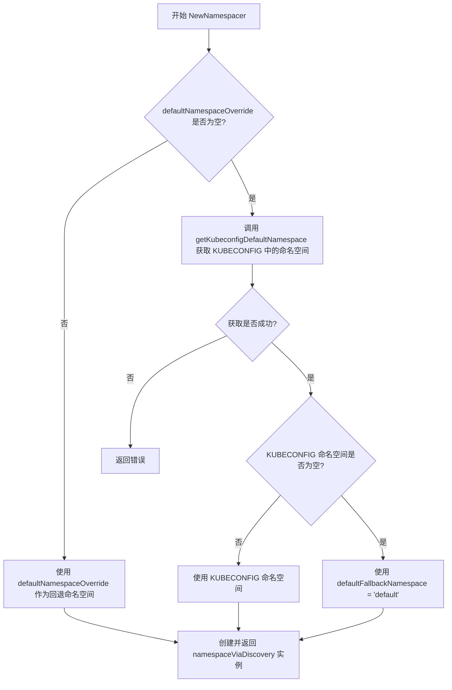

#### 带注释源码

```go
// NewNamespacer creates an implementation of Namespacer
// If not empty `defaultNamespaceOverride` is used as the namespace when
// a resource doesn't have a namespace specified. If empty the namespace
// from the context in the KUBECONFIG is used, otherwise the "default"
// namespace is used mimicking kubectl behavior
func NewNamespacer(d discovery.DiscoveryInterface, defaultNamespaceOverride string) (*namespaceViaDiscovery, error) {
	// 步骤1: 如果用户提供了命名空间覆盖值，直接使用
	if defaultNamespaceOverride != "" {
		return &namespaceViaDiscovery{fallbackNamespace: defaultNamespaceOverride, disco: d}, nil
	}
	
	// 步骤2: 尝试从 KUBECONFIG 配置文件中获取默认命名空间
	kubeconfigDefaultNamespace, err := getKubeconfigDefaultNamespace()
	if err != nil {
		// 如果获取失败，返回错误
		return nil, err
	}
	
	// 步骤3: 如果从 KUBECONFIG 获取到了命名空间，使用它
	if kubeconfigDefaultNamespace != "" {
		return &namespaceViaDiscovery{fallbackNamespace: kubeconfigDefaultNamespace, disco: d}, nil
	}
	
	// 步骤4: 以上都未获取到命名空间，使用 kubectl 的默认命名空间 "default"
	return &namespaceViaDiscovery{fallbackNamespace: defaultFallbackNamespace, disco: d}, nil
}
```

#### 相关辅助函数

```go
// getKubeconfigDefaultNamespace 返回 KUBECONFIG 中当前上下文指定的命名空间
// 使用变量以便在测试中进行 mock
var getKubeconfigDefaultNamespace = func() (string, error) {
	// 加载 KUBECONFIG 配置（使用默认加载规则）
	config, err := clientcmd.NewNonInteractiveDeferredLoadingClientConfig(
		clientcmd.NewDefaultClientConfigLoadingRules(),
		&clientcmd.ConfigOverrides{},
	).RawConfig()
	if err != nil {
		return "", err
	}

	// 获取当前上下文名称
	cc := config.CurrentContext
	// 从上下文中获取命名空间
	if c, ok := config.Contexts[cc]; ok && c.Namespace != "" {
		return c.Namespace, nil
	}

	// 未设置命名空间时返回空字符串
	return "", nil
}
```


### `getKubeconfigDefaultNamespace`

该函数是一个包级变量（函数类型），用于从KUBECONFIG配置文件中解析当前kubeconfig上下文的默认命名空间，模拟kubectl在未指定命名空间时的默认行为。

参数：该函数无参数。

返回值：
- `string`，返回当前kubeconfig上下文中配置的命名空间，若未配置则返回空字符串。
- `error`，若加载kubeconfig或解析上下文时发生错误，则返回错误信息。

#### 流程图

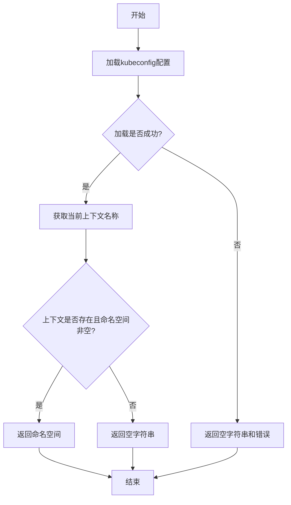

#### 带注释源码

```go
// getKubeconfigDefaultNamespace 返回KUBECONFIG中当前配置指定的命名空间
// 使用变量以便在测试中进行mock
var getKubeconfigDefaultNamespace = func() (string, error) {
    // 使用非交互式延迟加载客户端配置加载kubeconfig
    // 默认加载规则会读取KUBECONFIG环境变量或~/.kube/config
    config, err := clientcmd.NewNonInteractiveDeferredLoadingClientConfig(
        clientcmd.NewDefaultClientConfigLoadingRules(),
        &clientcmd.ConfigOverrides{},
    ).RawConfig()
    
    // 如果加载失败（如文件不存在、格式错误等），返回空字符串和错误
    if err != nil {
        return "", err
    }

    // 获取当前上下文名称
    cc := config.CurrentContext
    
    // 检查当前上下文是否存在，且是否配置了命名空间
    // config.Contexts是一个map，key是上下文名称，value是Context结构体
    if c, ok := config.Contexts[cc]; ok && c.Namespace != "" {
        // 如果配置了命名空间，返回该命名空间
        return c.Namespace, nil
    }

    // 如果没有配置命名空间，返回空字符串（而非错误）
    // 调用方会使用fallback逻辑处理这种情况
    return "", nil
}
```


### `namespaceViaDiscovery.EffectiveNamespace`

该方法用于确定资源的有效命名空间。它首先通过 `lookupNamespaced` 查询资源在集群中的作用域（命名空间作用域或集群作用域），然后根据资源是否指定了命名空间以及查询结果返回适当的命名空间。如果资源是命名空间作用域但未指定命名空间，则返回配置的备用命名空间；如果资源不是命名空间作用域，则返回空字符串。

参数：

- `m`：`kresource.KubeManifest`，Kubernetes 资源清单，包含资源的元数据（如命名空间、种类等）
- `knownScopes`：`ResourceScopes`，已知的资源作用域映射表，用于在集群查询失败时作为备用查询来源

返回值：`(string, error)`，返回有效的命名空间字符串（如果是集群作用域资源则返回空字符串），如果查询过程中发生错误则返回 error

#### 流程图

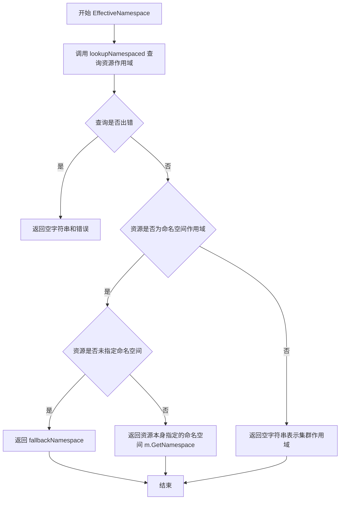

#### 带注释源码

```go
// EffectiveNamespace 确定资源的有效命名空间
// 考虑资源的种类和本地配置，返回资源应用时实际使用的命名空间
func (n *namespaceViaDiscovery) EffectiveNamespace(m kresource.KubeManifest, knownScopes ResourceScopes) (string, error) {
    // 调用 lookupNamespaced 方法查询资源是否是命名空间作用域的
    // namespaced 为 true 表示命名空间级别，false 表示集群级别
    namespaced, err := n.lookupNamespaced(m.GroupVersion(), m.GetKind(), knownScopes)
    
    // 检查查询是否出错
    switch {
    case err != nil:
        // 查询失败，返回空字符串和错误信息
        return "", err
    case namespaced && m.GetNamespace() == "":
        // 资源是命名空间作用域但未指定命名空间
        // 使用配置的备用命名空间
        return n.fallbackNamespace, nil
    case !namespaced:
        // 资源不是命名空间作用域（集群级别资源）
        // 返回空字符串表示没有命名空间
        return "", nil
    }
    
    // 资源是命名空间作用域且已指定命名空间
    // 返回资源本身配置的命名空间
    return m.GetNamespace(), nil
}
```


### `namespaceViaDiscovery.lookupNamespaced`

该方法用于确定给定 Kubernetes 资源是否属于命名空间作用域。它首先尝试通过集群发现 API 查询资源信息，如果查询失败则回退到使用预知的资源作用域映射来判断资源是命名空间作用域（Namespaced）还是集群作用域（Cluster-scoped）。

参数：

- `groupVersion`：`string`，API 组的版本（例如 `v1`、`apps/v1`）
- `kind`：`string`，资源的类型（例如 `Pod`、`Deployment`、`Node`）
- `knownScopes`：`ResourceScopes`，已知资源作用域的映射表，当集群查询失败时用作备选方案

返回值：`(bool, error)`，第一个 bool 值表示资源是否为命名空间作用域，error 表示查询过程中发生的错误

#### 流程图

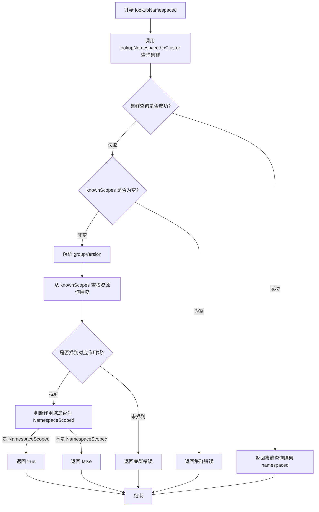

#### 带注释源码

```go
// lookupNamespaced 确定指定资源是否为命名空间作用域
// 优先通过集群发现 API 查询，若失败且存在 knownScopes 则回退查询
func (n *namespaceViaDiscovery) lookupNamespaced(groupVersion string, kind string, knownScopes ResourceScopes) (bool, error) {
	// 第一步：尝试在集群中查询资源的 namespaced 状态
	namespaced, clusterErr := n.lookupNamespacedInCluster(groupVersion, kind)
	
	// 如果集群查询成功，或者没有预知的 knownScopes，直接返回结果
	if clusterErr == nil || knownScopes == nil {
		return namespaced, nil
	}
	
	// 集群查询失败，但存在 knownScopes，尝试从已知作用域中查找
	// 解析 GroupVersion
	gv, err := schema.ParseGroupVersion(groupVersion)
	if err != nil {
		// 解析失败，返回集群错误
		return false, clusterErr
	}
	
	// 从 knownScopes 中查找该资源类型对应的作用域
	scope, found := knownScopes[gv.WithKind(kind)]
	if !found {
		// 未找到对应作用域，返回集群错误
		return false, clusterErr
	}
	
	// 判断找到的作用域是否为 NamespaceScoped
	return scope == v1beta1.NamespaceScoped, nil
}
```


### `namespaceViaDiscovery.lookupNamespacedInCluster`

该方法通过 Kubernetes Discovery API 查询指定 GroupVersion 下的所有资源，查找匹配 kind 的资源是否属于命名空间作用域（namespaced）或集群作用域（cluster-scoped）。

参数：

- `groupVersion`：`string`，Kubernetes API 的组版本（如 "v1"、"apps/v1"）
- `kind`：`string`，资源的 Kind（如 "Pod"、"Deployment"）

返回值：`bool, error`，第一个返回值表示资源是否为命名空间作用域（true 为命名空间作用域，false 为集群作用域），第二个返回值为查询过程中出现的错误。

#### 流程图

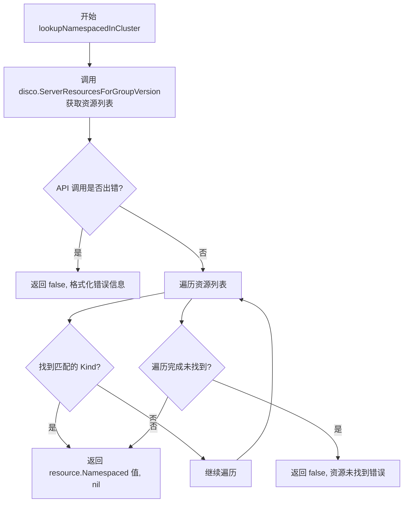

#### 带注释源码

```go
// lookupNamespacedInCluster 通过 Discovery API 查询集群中指定 GroupVersion 和 Kind 的资源属性
// 返回该资源是否为命名空间作用域（namespaced）
// 参数:
//   - groupVersion: API 组的版本，如 "v1", "apps/v1", "extensions/v1beta1"
//   - kind: 资源类型，如 "Pod", "Deployment", "ConfigMap"
//
// 返回值:
//   - bool: true 表示该资源是命名空间作用域，false 表示集群作用域
//   - error: 查询失败或资源未找到时返回错误
func (n *namespaceViaDiscovery) lookupNamespacedInCluster(groupVersion, kind string) (bool, error) {
	// 调用 Kubernetes Discovery 接口获取指定 GroupVersion 下所有可用的 API 资源
	resourceList, err := n.disco.ServerResourcesForGroupVersion(groupVersion)
	
	// 如果调用 Discovery API 出错，返回错误信息
	if err != nil {
		return false, fmt.Errorf("error looking up API resources for %s.%s: %s", kind, groupVersion, err.Error())
	}
	
	// 遍历返回的资源列表，查找匹配 kind 的资源
	for _, resource := range resourceList.APIResources {
		// 找到匹配的 Kind
		if resource.Kind == kind {
			// 返回该资源的 Namespaced 标记（true 表示命名空间作用域，false 表示集群作用域）
			return resource.Namespaced, nil
		}
	}

	// 遍历完所有资源未找到匹配的 kind，返回资源未找到错误
	return false, fmt.Errorf("resource not found for API %s, kind %s", groupVersion, kind)
}
```


### NewNamespacer

这是 `namespaceViaDiscovery` 类型的构造函数，用于创建一个命名空间发现器实例。该函数根据优先级规则确定资源回退命名空间：优先使用传入的 `defaultNamespaceOverride` 参数，其次尝试从 KUBECONFIG 上下文中获取，最后回退到 Kubernetes 默认的 "default" 命名空间（模拟 kubectl 行为）。

参数：

- `d`：`discovery.DiscoveryInterface`，Kubernetes API 发现接口，用于查询集群支持的 API 资源信息
- `defaultNamespaceOverride`：`string`，可选的命名空间覆盖值；如果非空则优先使用，否则从 KUBECONFIG 或默认命名空间获取

返回值：`*namespaceViaDiscovery, error`，成功时返回新创建的命名空间发现器实例，失败时返回 nil 和错误信息

#### 流程图

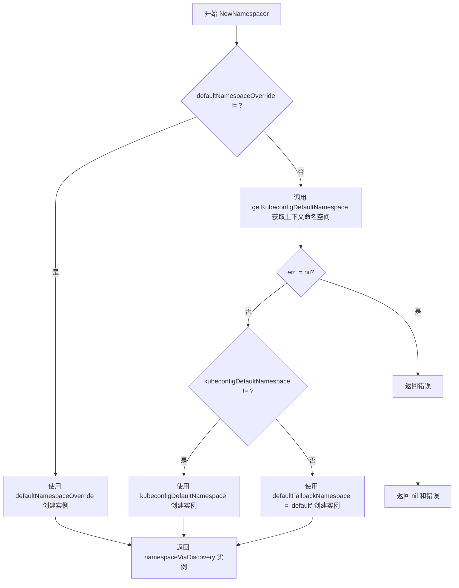

#### 带注释源码

```go
// NewNamespacer creates an implementation of Namespacer
// If not empty `defaultNamespaceOverride` is used as the namespace when
// a resource doesn't have a namespace specified. If empty the namespace
// from the context in the KUBECONFIG is used, otherwise the "default"
// namespace is used mimicking kubectl behavior
func NewNamespacer(d discovery.DiscoveryInterface, defaultNamespaceOverride string) (*namespaceViaDiscovery, error) {
	// 步骤1：如果用户提供了命名空间覆盖值，直接使用该值创建实例
	if defaultNamespaceOverride != "" {
		return &namespaceViaDiscovery{fallbackNamespace: defaultNamespaceOverride, disco: d}, nil
	}
	
	// 步骤2：尝试从 KUBECONFIG 配置中获取当前上下文的默认命名空间
	kubeconfigDefaultNamespace, err := getKubeconfigDefaultNamespace()
	if err != nil {
		// 获取失败时返回错误（如配置文件不存在、格式错误等）
		return nil, err
	}
	
	// 步骤3：如果从 KUBECONFIG 获取到了命名空间，使用该命名空间创建实例
	if kubeconfigDefaultNamespace != "" {
		return &namespaceViaDiscovery{fallbackNamespace: kubeconfigDefaultNamespace, disco: d}, nil
	}
	
	// 步骤4：以上都未获取到命名空间时，使用 kubectl 风格的默认命名空间 "default"
	return &namespaceViaDiscovery{fallbackNamespace: defaultFallbackNamespace, disco: d}, nil
}
```


### `namespaceViaDiscovery.EffectiveNamespace`

确定资源清单的有效命名空间，根据资源的类型、本地配置和集群信息返回正确的命名空间。

参数：

- `m`：`kresource.KubeManifest`，Kubernetes 资源清单，包含资源的元数据（如 GroupVersion、Kind、Namespace 等）
- `knownScopes`：`ResourceScopes`，已知的作用域信息，用于在集群无法访问时作为备选查询

返回值：

- `string`，有效的命名空间字符串（如果资源不是命名空间作用域则返回空字符串）
- `error`，如果查询过程中发生错误则返回错误信息

#### 流程图

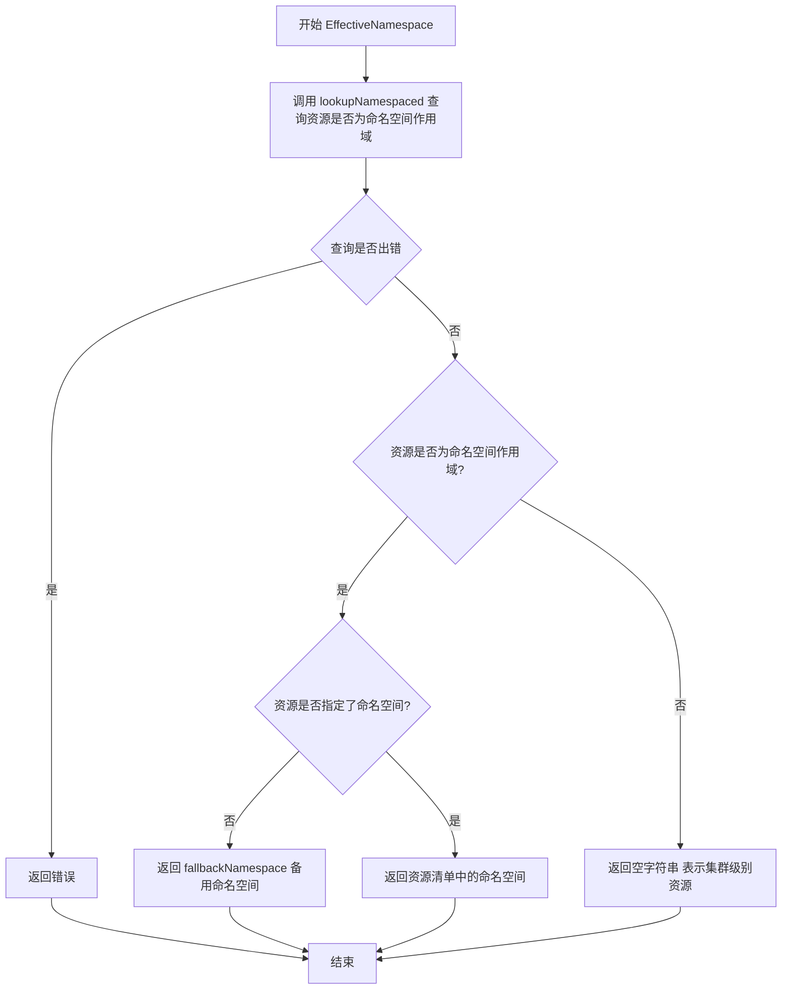

#### 带注释源码

```go
// EffectiveNamespace 确定资源在应用时使用的命名空间
// 考虑资源的种类和本地配置
// 参数 m: Kubernetes 资源清单，包含资源的 GroupVersion、Kind、Namespace 等元数据
// 参数 knownScopes: 已知的作用域信息，当无法访问集群时用于确定资源是否为命名空间作用域
// 返回值: 有效的命名空间字符串（非命名空间作用域资源返回空字符串），以及可能的错误信息
func (n *namespaceViaDiscovery) EffectiveNamespace(m kresource.KubeManifest, knownScopes ResourceScopes) (string, error) {
	// 第一步：查询资源的命名空间作用域属性
	// 调用 lookupNamespaced 方法，传入资源的 GroupVersion 和 Kind
	namespaced, err := n.lookupNamespaced(m.GroupVersion(), m.GetKind(), knownScopes)
	
	// 处理查询结果，根据不同情况返回对应的命名空间
	switch {
	// 如果查询过程中发生错误，直接返回错误
	case err != nil:
		return "", err
	// 如果资源是命名空间作用域（namespaced=true）且未指定命名空间（m.GetNamespace() == ""）
	// 则返回配置的备用命名空间（fallbackNamespace）
	case namespaced && m.GetNamespace() == "":
		return n.fallbackNamespace, nil
	// 如果资源不是命名空间作用域（集群级别资源），返回空字符串表示无命名空间
	case !namespaced:
		return "", nil
	}
	// 资源是命名空间作用域且已指定命名空间，返回资源清单中定义的命名空间
	return m.GetNamespace(), nil
}
```


### `namespaceViaDiscovery.lookupNamespaced`

该方法用于查询指定资源是否需要命名空间。它首先尝试通过集群的Discovery API查询资源的命名空间信息，如果集群查询失败且提供了已知的作用域信息，则回退到使用预定义的ResourceScopes来确定资源是否为命名空间作用域。如果都无法确定，则返回错误。

参数：

- `groupVersion`：string，资源的组版本（如 "v1"、"apps/v1" 等）
- `kind`：string，资源的类型（如 "Deployment"、"Service" 等）
- `knownScopes`：ResourceScopes，已知的资源作用域映射，用于集群查询失败时的回退查询

返回值：`(bool, error)`，如果资源需要命名空间则返回 true，否则返回 false；错误信息在无法确定作用域时返回。

#### 流程图

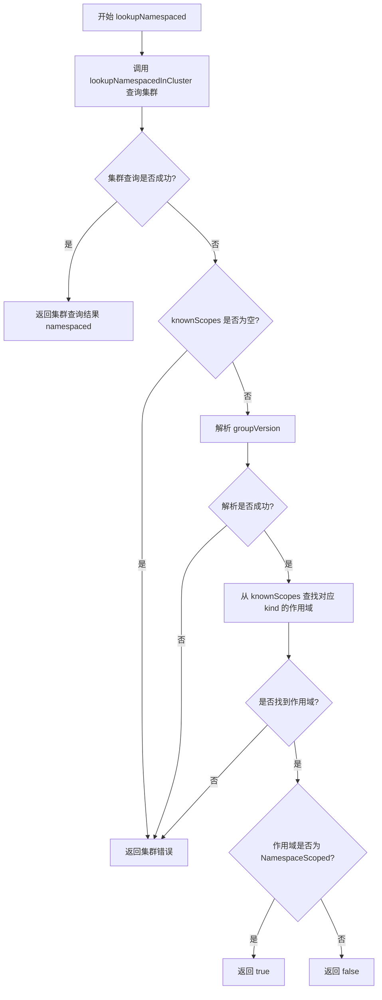

#### 带注释源码

```go
// lookupNamespaced 查询指定资源是否需要命名空间
// 参数：
//   - groupVersion: 资源的组版本字符串
//   - kind: 资源的类型名称
//   - knownScopes: 已知的作用域映射表，用于集群查询失败时的回退
//
// 返回值：
//   - bool: 资源是否需要命名空间
//   - error: 查询过程中的错误信息
func (n *namespaceViaDiscovery) lookupNamespaced(groupVersion string, kind string, knownScopes ResourceScopes) (bool, error) {
    // 第一步：尝试通过集群的 Discovery API 查询资源是否为命名空间作用域
    // 这是首选的查询方式，可以获取集群实际的资源定义
    namespaced, clusterErr := n.lookupNamespacedInCluster(groupVersion, kind)
    
    // 如果集群查询成功，或者没有提供 knownScopes 回退机制
    // 直接返回集群查询的结果（可能为错误）
    if clusterErr == nil || knownScopes == nil {
        return namespaced, nil
    }
    
    // 第二步：集群查询失败，尝试使用已知的 scopes 进行回退查询
    // 解析 groupVersion 为 schema.GroupVersion 对象
    gv, err := schema.ParseGroupVersion(groupVersion)
    if err != nil {
        // 解析失败，返回集群查询时的错误
        return false, clusterErr
    }
    
    // 使用解析后的 groupVersion 和 kind 构建完整的资源标识
    // 从 knownScopes 中查找预定义的作用域信息
    scope, found := knownScopes[gv.WithKind(kind)]
    if !found {
        // 未找到预定义的作用域信息，返回集群查询错误
        return false, clusterErr
    }
    
    // 比较预定义的作用域与 NamespaceScoped 常量
    // 如果相等说明该资源是命名空间级别的，否则是集群级别的
    return scope == v1beta1.NamespaceScoped, nil
}
```


### `namespaceViaDiscovery.lookupNamespacedInCluster`

直接查询集群API资源确定指定资源类型（Kind）在集群中是否是命名空间范围的（namespaced），通过调用Kubernetes Discovery API获取指定GroupVersion的资源列表并匹配Kind来确认其作用域。

参数：

- `groupVersion`：`string`，API资源的组版本（GroupVersion），格式如 "v1"、"apps/v1" 等
- `kind`：`string`，资源的种类（Kind），如 "Pod"、"Deployment" 等

返回值：`bool, error`

- `bool`：表示该资源类型是否是命名空间范围的（true 表示是命名空间范围的，false 表示集群级别的）
- `error`：如果查询失败或资源未找到，返回错误信息

#### 流程图

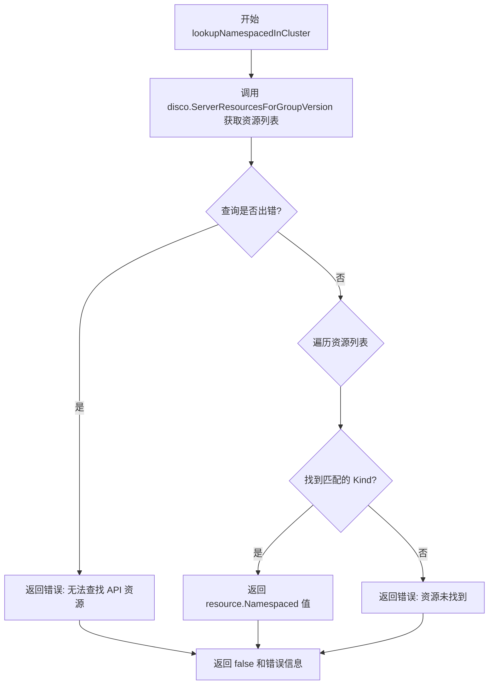

#### 带注释源码

```go
// lookupNamespacedInCluster 查询集群API以确定指定资源类型是否是命名空间范围的
// 参数:
//   - groupVersion: API资源的组版本 (如 "v1", "apps/v1")
//   - kind: 资源的种类 (如 "Pod", "Deployment")
//
// 返回值:
//   - bool: 资源是否是命名空间范围的
//   - error: 查询过程中的错误信息
func (n *namespaceViaDiscovery) lookupNamespacedInCluster(groupVersion, kind string) (bool, error) {
    // 调用 Discovery 接口获取指定 GroupVersion 下所有可用的 API 资源列表
    resourceList, err := n.disco.ServerResourcesForGroupVersion(groupVersion)
    
    // 如果查询失败，返回格式化的错误信息
    if err != nil {
        return false, fmt.Errorf("error looking up API resources for %s.%s: %s", kind, groupVersion, err.Error())
    }
    
    // 遍历返回的资源列表，查找匹配 kind 的资源
    for _, resource := range resourceList.APIResources {
        // 找到匹配的 Kind
        if resource.Kind == kind {
            // 返回该资源的 Namespaced 属性（true 表示命名空间范围，false 表示集群级别）
            return resource.Namespaced, nil
        }
    }

    // 未在集群中找到指定的资源类型
    return false, fmt.Errorf("resource not found for API %s, kind %s", groupVersion, kind)
}
```

#### 关键组件信息

| 名称 | 描述 |
|------|------|
| `discovery.DiscoveryInterface` | Kubernetes 客户端的发现接口，用于查询集群支持的 API 资源和版本信息 |
| `ServerResourcesForGroupVersion` | DiscoveryInterface 的方法，返回指定 GroupVersion 下所有可用资源的信息 |
| `APIResource.Namespaced` | 布尔字段，标识该资源类型是否是命名空间范围的 |

#### 技术债务与优化空间

1. **错误处理粒度**：当前方法对所有错误统一返回格式化字符串，可考虑区分"资源组不存在"和"资源类型不存在"等不同错误场景
2. **缓存机制**：每次调用都会请求集群 Discovery API，可考虑在 `namespaceViaDiscovery` 结构体中添加缓存层，避免重复查询
3. **重试逻辑**：当前实现没有重试机制，在集群负载高时可能失败，可考虑添加短暂重试
4. **日志记录**：缺少调用日志，在排查问题时可能不够便利

## 关键组件


### namespaceViaDiscovery 结构体

核心结构体，用于通过 Kubernetes Discovery API 解析资源的命名空间作用域，包含回退命名空间字段和 Discovery 接口。

### fallbackNamespace 字段

字符串类型，存储当资源未指定命名空间时的回退命名空间值，优先级依次为：显式传入的默认值 > KUBECONFIG 上下文中的命名空间 > "default"。

### disco 字段

discovery.DiscoveryInterface 类型，提供与 Kubernetes API Server 交互的能力，用于查询 API 资源的命名空间作用域信息。

### NewNamespacer 构造函数

创建 namespaceViaDiscovery 实例的核心工厂方法，支持三种命名空间来源：显式覆盖值、KUBECONFIG 配置、默认值 "default"，模拟 kubectl 行为。

### EffectiveNamespace 方法

主入口方法，根据资源清单和已知作用域确定资源的有效命名空间，处理命名空间作用域资源和非命名空间作用域资源两种情况。

### lookupNamespaced 方法

两阶段查询策略：首先尝试从集群获取资源的作用域信息，若失败则回退到已缓存的 knownScopes 映射中查找，实现容错机制。

### lookupNamespacedInCluster 方法

直接调用 Kubernetes Discovery API 的 ServerResourcesForGroupVersion 接口，遍历 APIResource 列表匹配 Kind 并返回 Namespaced 布尔值。

### getKubeconfigDefaultNamespace 全局函数变量

可被测试 mock 的函数变量，用于从 KUBECONFIG 当前上下文中提取默认命名空间，支持依赖注入便于单元测试。

### ResourceScopes 映射

knownScopes 参数类型，作为集群不可达时的备用数据源，提供预计算的 GroupVersionKind 到命名空间作用域的映射关系。

### defaultFallbackNamespace 常量

常量值 "default"，当无任何配置指定命名空间时使用，与 kubectl 的默认行为保持一致。


## 问题及建议


### 已知问题

- **错误信息丢失**: 在 `lookupNamespaced` 方法中，当从 `knownScopes` 获取 scope 失败时，直接返回 `clusterErr`，原始的 scope 查询错误被丢弃，可能导致调试困难
- **缺少上下文支持**: 代码未使用 `context.Context` 传递上下文，无法支持超时控制和取消操作，不符合现代 Kubernetes Go 客户端的最佳实践
- **无缓存机制**: `lookupNamespacedInCluster` 每次都调用 Discovery API 获取资源信息，在高频调用场景下会产生显著的性能开销
- **API 调用错误处理不一致**: `lookupNamespacedInCluster` 中资源未找到时返回 `fmt.Errorf`，但调用方在 `lookupNamespaced` 中将错误作为"未找到"处理，语义不清晰
- **全局可变性**: `getKubeconfigDefaultNamespace` 作为全局函数变量，虽然便于测试，但增加了代码的理解和维护成本

### 优化建议

- **引入缓存层**: 使用内存缓存存储 Discovery 查询结果，设置 TTL 或基于事件驱动的失效机制，减少 API 调用次数
- **增加上下文支持**: 为 `EffectiveNamespace`、`lookupNamespaced` 等方法添加 `context.Context` 参数，支持超时和取消
- **统一错误处理**: 定义明确的错误类型或使用 sentinel errors，区分"资源不存在"和"API 调用失败"等不同场景
- **添加重试机制**: 对 Discovery API 调用增加指数退避重试，提高在网络抖动场景下的鲁棒性
- **考虑懒加载**: 将 Discovery 结果的获取延迟到真正需要时，并使用 sync.Once 确保只调用一次


## 其它


### 设计目标与约束

本模块的核心设计目标是提供一种机制来确定Kubernetes资源的有效命名空间（effective namespace），确保在资源部署时能够正确关联到指定的命名空间。设计约束包括：1）必须遵循kubectl的命名空间解析逻辑，即优先使用资源自身指定的命名空间，其次使用KUBECONFIG上下文中的默认命名空间，最后使用"default"命名空间；2）必须支持集群级别资源（ClusterScoped）和命名空间级别资源（NamespaceScoped）的正确区分；3）需要支持对无法访问集群时通过已知作用域（knownScopes）进行回退处理。

### 错误处理与异常设计

代码中的错误处理采用以下策略：1）NewNamespacer构造函数返回error，当KUBECONFIG解析失败时返回具体错误；2）EffectiveNamespace方法通过switch语句区分错误类型，返回对应的错误信息；3）lookupNamespaced方法优先使用集群查询结果，当集群查询失败且knownScopes不为nil时回退到已知作用域；4）lookupNamespacedInCluster方法在资源未找到时返回格式化的错误信息。异常场景包括：集群不可达、KUBECONFIG配置错误、资源类型无法识别等。

### 数据流与状态机

数据流如下：1）客户端调用NewNamespacer创建namespaceViaDiscovery实例；2）调用EffectiveNamespace方法传入KubeManifest和ResourceScopes；3）内部调用lookupNamespaced方法查询资源是否为命名空间级别；4）lookupNamespaced首先尝试lookupNamespacedInCluster查询集群，如果失败且有knownScopes则回退查询；5）根据查询结果和资源自身namespace属性确定最终命名空间。状态机包含两个主要状态：集群可用状态和集群不可用回退状态。

### 外部依赖与接口契约

主要外部依赖包括：1）k8s.io/apiextensions-apiserver/pkg/apis/apiextensions/v1beta1 - 用于NamespaceScoped常量定义；2）k8s.io/apimachinery/pkg/runtime/schema - 用于GroupVersion解析；3）k8s.io/client-go/discovery - DiscoveryInterface用于查询集群API资源；4）k8s.io/client-go/tools/clientcmd - 用于加载KUBECONFIG配置；5）github.com/fluxcd/flux/pkg/cluster/kubernetes/resource - KubeManifest接口。接口契约：Namespacer接口需要实现EffectiveNamespace方法，接收KubeManifest和ResourceScopes参数，返回string和error。

### 性能考虑

性能优化点：1）ServerResourcesForGroupVersion调用会产生API请求，理论上可以缓存结果，但当前实现每次都重新查询；2）getKubeconfigDefaultNamespace只在初始化时调用一次，后续通过fallbackNamespace字段复用；3）可以考虑在namespaceViaDiscovery中添加缓存机制存储已查询的资源作用域信息，避免重复的API调用。

### 安全性考虑

安全相关设计：1）使用clientcmd模块加载KUBECONFIG，确保凭证安全处理；2）只读取必要的配置信息（当前上下文和命名空间），不暴露敏感配置内容；3）错误信息中不包含敏感的集群认证信息，仅返回必要的错误描述。

### 测试策略

测试建议：1）单元测试应覆盖NewNamespacer的各种场景（自定义命名空间、KUBECONFIG有命名空间、无配置）；2）使用getKubeconfigDefaultNamespace变量注入mock函数进行测试；3）lookupNamespacedInCluster需要mock DiscoveryInterface；4）测试边界条件：集群返回空资源列表、资源类型不存在、网络错误等场景。

### 并发与线程安全性

并发考虑：1）当前namespaceViaDiscovery结构体包含disco DiscoveryInterface字段，该接口的方法调用通常不是线程安全的；2）如果在同一实例上并发调用EffectiveNamespace，可能存在资源竞争；3）建议在并发场景下创建独立的namespaceViaDiscovery实例，或在调用方添加同步机制。

### 资源管理

资源管理方面：1）disco字段引用外部的DiscoveryInterface，由调用方负责生命周期管理；2）不持有任何需要主动释放的资源（如连接、文件句柄等）；3）内存占用主要是fallbackNamespace字符串和可能的临时错误信息，规模可控。

    