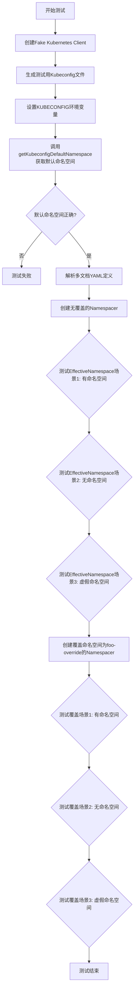
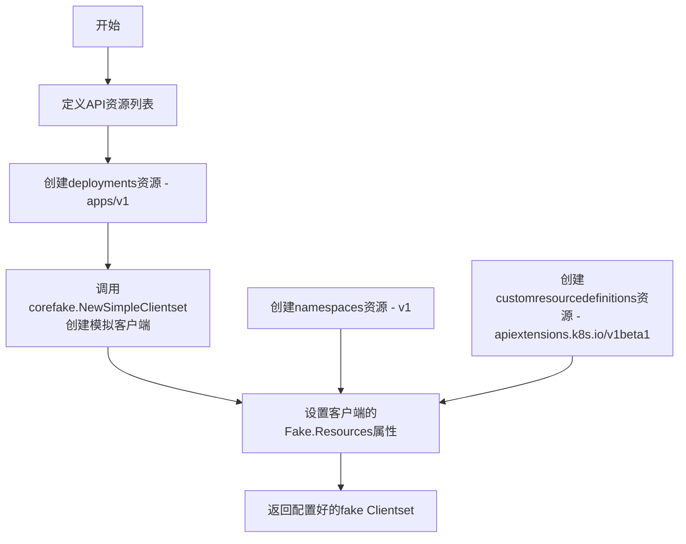
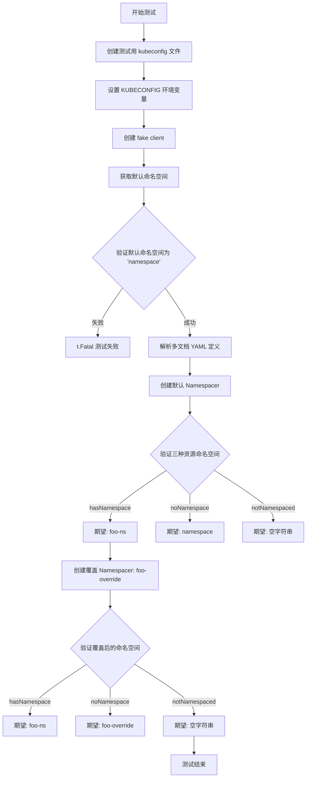
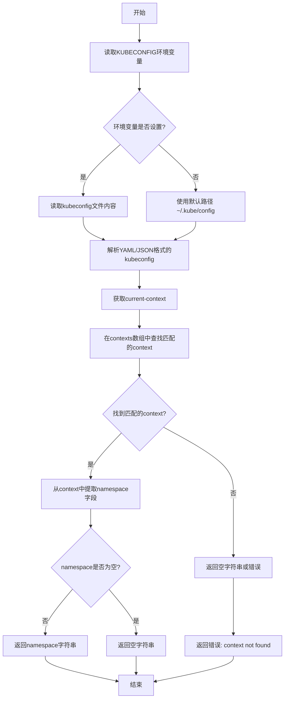
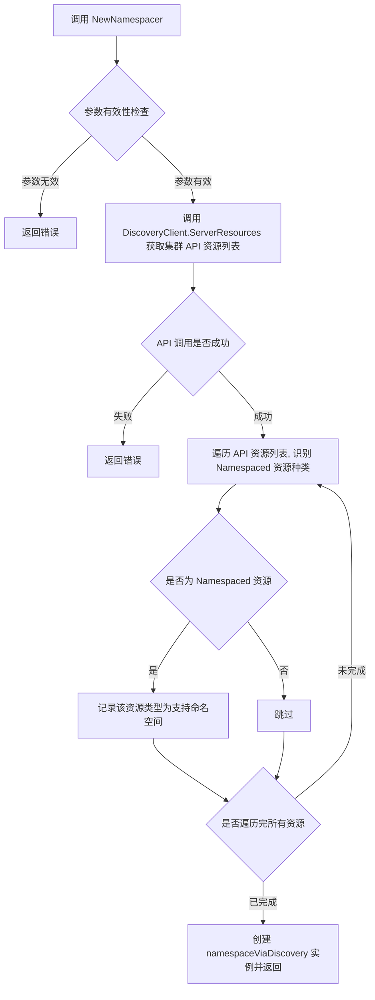
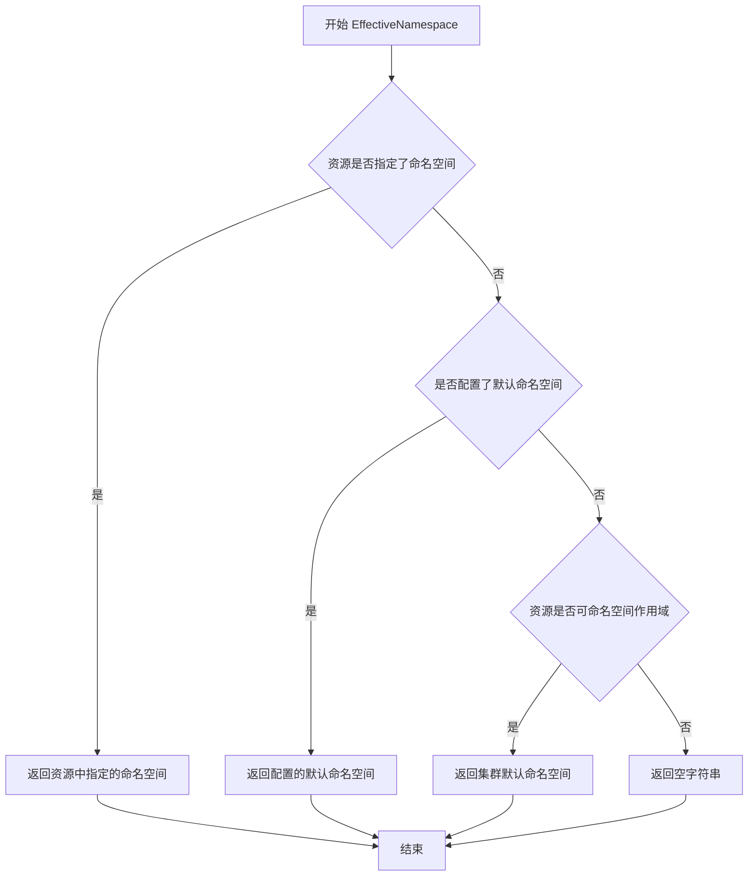
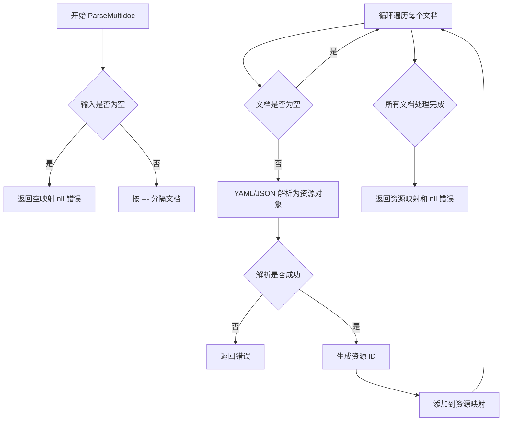
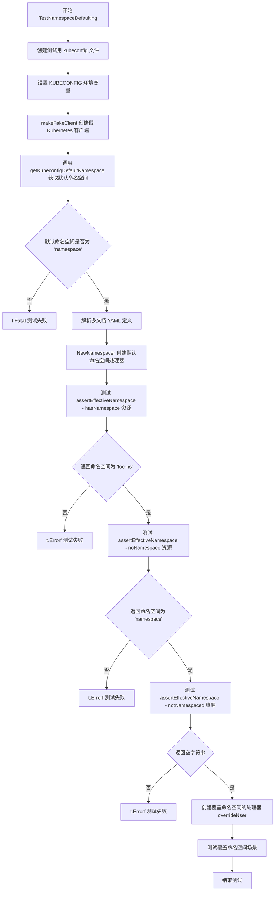

# `flux\pkg\cluster\kubernetes\namespacer_test.go` 详细设计文档

该文件是一个 Kubernetes 相关的测试文件，主要测试命名空间默认值的设置和覆盖逻辑。通过模拟 Kubernetes 客户端和环境变量，验证不同资源配置（Deployment、Namespace）的有效命名空间计算是否符合预期。

## 整体流程



## 类结构

```
测试文件 (无类层次结构)
├── makeFakeClient (全局函数)
├── TestNamespaceDefaulting (测试函数)
└── 辅助函数 (getKubeconfigDefaultNamespace, NewNamespacer, namespaceViaDiscovery)
```

## 全局变量及字段


### `getAndList`
    
定义Kubernetes API资源的verbs（操作）列表，包含get和list

类型：`metav1.Verbs`
    


    

## 全局函数及方法


### `makeFakeClient`

该函数创建一个用于测试的伪造Kubernetes客户端（fake Clientset），预先配置了Deployments、Namespaces和CustomResourceDefinitions等常见资源，以支持单元测试中模拟Kubernetes API交互。

参数：

- （无参数）

返回值：`*corefake.Clientset`，返回一个伪造的Kubernetes客户端集，包含预定义的API资源列表，用于测试环境

#### 流程图



#### 带注释源码

```go
// makeFakeClient 创建一个用于测试的伪造Kubernetes客户端
// 返回一个包含预定义API资源的fake.Clientset，用于单元测试
func makeFakeClient() *corefake.Clientset {
	// 定义支持的API资源列表，包含三个常用的Kubernetes资源类型
	apiResources := []*metav1.APIResourceList{
		{
			// Deployment资源定义，存在于apps/v1组
			GroupVersion: "apps/v1",
			APIResources: []metav1.APIResource{
				{
					Name:         "deployments",              // 资源名称（复数形式）
					SingularName: "deployment",              // 资源单数名称
					Namespaced:   true,                       // 属于命名空间级别资源
					Kind:         "Deployment",               // 资源Kind
					Verbs:        getAndList,                 // 支持的操作：get和list
				},
			},
		},
		{
			// Namespace资源定义，存在于v1组
			GroupVersion: "v1",
			APIResources: []metav1.APIResource{
				{
					Name:         "namespaces",
					SingularName: "namespace",
					Namespaced:   false,                      // 集群级别资源，非命名空间级别
					Kind:         "Namespace",
					Verbs:        getAndList,
				},
			},
		},
		{
			// CustomResourceDefinition资源定义
			GroupVersion: "apiextensions.k8s.io/v1beta1",
			APIResources: []metav1.APIResource{
				{
					Name:         "customresourcedefinitions",
					SingularName: "customresourcedefinition",
					Namespaced:   false,                      // 集群级别资源
					Kind:         "CustomResourceDefinition",
					Verbs:        getAndList,
				},
			},
		},
	}

	// 使用fake clientgo库创建简单的模拟客户端
	coreClient := corefake.NewSimpleClientset()
	// 将预定义的API资源列表注入到fake客户端的Resources字段
	// 这样在测试时可以模拟Discovery API的响应
	coreClient.Fake.Resources = apiResources
	// 返回配置好的fake客户端供测试使用
	return coreClient
}
```


### `TestNamespaceDefaulting`

该测试函数验证了 Kubernetes 集群中资源命名空间的默认行为，包括从 kubeconfig 获取默认命名空间、对没有明确指定命名空间的资源应用默认命名空间（使用 `<cluster>` 前缀）、以及通过 `NewNamespacer` 覆盖默认命名空间的功能。

参数：

- `t`：`*testing.T`，Go 测试框架的测试对象，用于报告测试失败

返回值：`void`，无返回值

#### 流程图



#### 带注释源码

```go
// TestNamespaceDefaulting 测试 Kubernetes 命名空间默认行为
// 该测试验证以下场景：
// 1. 从 kubeconfig 获取默认命名空间
// 2. 对没有命名空间的资源应用默认命名空间
// 3. 使用覆盖命名空间覆盖默认值
func TestNamespaceDefaulting(t *testing.T) {
    // 定义测试用 kubeconfig，指定默认命名空间为 "namespace"
    testKubeconfig := `apiVersion: v1
clusters: []
contexts:
- context:
    cluster: cluster
    namespace: namespace
    user: user
  name: context
current-context: context
kind: Config
preferences: {}
users: []
`
    // 将测试 kubeconfig 写入临时文件
    err := ioutil.WriteFile("testkubeconfig", []byte(testKubeconfig), 0600)
    if err != nil {
        t.Fatal("cannot create test kubeconfig file")
    }
    // 测试结束后清理临时文件
    defer os.Remove("testkubeconfig")

    // 设置 KUBECONFIG 环境变量指向测试配置文件
    os.Setenv("KUBECONFIG", "testkubeconfig")
    defer os.Unsetenv("KUBECONFIG")
    
    // 创建 fake Kubernetes 客户端
    coreClient := makeFakeClient()

    // 测试从 kubeconfig 获取默认命名空间
    ns, err := getKubeconfigDefaultNamespace()
    if err != nil {
        t.Fatal("cannot get default namespace")
    }
    if ns != "namespace" {
        t.Fatal("unexpected default namespace", ns)
    }

    // 定义多文档 YAML：包含有命名空间、无命名空间的 Deployment 和 Namespace 资源
    const defs = `---
apiVersion: apps/v1
kind: Deployment
metadata:
  name: hasNamespace
  namespace: foo-ns
---
apiVersion: apps/v1
kind: Deployment
metadata:
  name: noNamespace
---
apiVersion: v1
kind: Namespace
metadata:
  name: notNamespaced
  namespace: spurious
`

    // 解析多文档 YAML 为资源清单
    manifests, err := kresource.ParseMultidoc([]byte(defs), "<string>")
    if err != nil {
        t.Fatal(err)
    }

    // 使用默认命名空间创建 Namespacer（空字符串表示使用 kubeconfig 默认值）
    defaultNser, err := NewNamespacer(coreClient.Discovery(), "")
    if err != nil {
        t.Fatal(err)
    }
    
    // 断言函数：验证资源的有效命名空间
    assertEffectiveNamespace := func(nser namespaceViaDiscovery, id, expected string) {
        res, ok := manifests[id]
        if !ok {
            t.Errorf("manifest for %q not found", id)
            return
        }
        got, err := nser.EffectiveNamespace(res, nil)
        if err != nil {
            t.Errorf("error getting effective namespace for %q: %s", id, err.Error())
            return
        }
        if got != expected {
            t.Errorf("expected effective namespace of %q, got %q", expected, got)
        }
    }

    // 验证默认命名空间场景
    // 1. 有明确命名空间的资源应保留原命名空间
    assertEffectiveNamespace(*defaultNser, "foo-ns:deployment/hasNamespace", "foo-ns")
    // 2. 无命名空间的资源应使用 kubeconfig 中的默认命名空间
    assertEffectiveNamespace(*defaultNser, "<cluster>:deployment/noNamespace", "namespace")
    // 3. Cluster 级别的资源（如 Namespace）不应有有效命名空间
    assertEffectiveNamespace(*defaultNser, "spurious:namespace/notNamespaced", "")

    // 创建带有覆盖命名空间的 Namespacer
    overrideNser, err := NewNamespacer(coreClient.Discovery(), "foo-override")
    if err != nil {
        t.Fatal(err)
    }

    // 验证覆盖命名空间场景
    // 1. 有明确命名空间的资源仍保留原命名空间
    assertEffectiveNamespace(*overrideNser, "foo-ns:deployment/hasNamespace", "foo-ns")
    // 2. 无命名空间的资源使用覆盖命名空间
    assertEffectiveNamespace(*overrideNser, "<cluster>:deployment/noNamespace", "foo-override")
    // 3. Cluster 级别资源仍无有效命名空间
    assertEffectiveNamespace(*overrideNser, "spurious:namespace/notNamespaced", "")
}
```


### `getKubeconfigDefaultNamespace`

该函数用于从kubeconfig文件中读取当前上下文（current-context）所指定的默认命名空间（namespace），并返回该命名空间的名称。如果kubeconfig文件不存在、格式错误或当前上下文没有指定命名空间，则返回相应的错误信息。

参数：空（无参数）

返回值：`string, error`
- `string`：返回kubeconfig中当前context所设置的命名空间名称；如果未设置则返回空字符串。
- `error`：如果读取或解析kubeconfig文件失败，返回错误信息。

#### 流程图



#### 带注释源码

**注意**：在提供的代码中，未找到 `getKubeconfigDefaultNamespace` 函数的实际定义。该函数在测试代码 `TestNamespaceDefaulting` 中被调用，但函数体未在此代码块中实现。以下为基于函数调用方式和上下文推断的伪代码实现：

```go
// 此源码为基于调用上下文的推断，并非原始代码中的定义
func getKubeconfigDefaultNamespace() (string, error) {
    // 1. 获取kubeconfig文件路径
    //    优先使用环境变量 KUBECONFIG，如果未设置则使用默认路径 ~/.kube/config
    kubeconfigPath := os.Getenv("KUBECONFIG")
    if kubeconfigPath == "" {
        homeDir := os.Getenv("HOME")
        if homeDir == "" {
            homeDir = "/root" // 简单处理，实际应更健壮
        }
        kubeconfigPath = filepath.Join(homeDir, ".kube", "config")
    }

    // 2. 读取kubeconfig文件内容
    configData, err := ioutil.ReadFile(kubeconfigPath)
    if err != nil {
        return "", fmt.Errorf("failed to read kubeconfig file: %w", err)
    }

    // 3. 解析kubeconfig（假设为YAML格式）
    //    注意：实际实现可能使用 clientcmd/api 等库进行解析
    var config struct {
        CurrentContext string `yaml:"current-context"`
        Contexts       []struct {
            Name    string `yaml:"name"`
            Context struct {
                Namespace string `yaml:"namespace"`
            } `yaml:"context"`
        } `yaml:"contexts"`
    }

    err = yaml.Unmarshal(configData, &config)
    if err != nil {
        return "", fmt.Errorf("failed to parse kubeconfig: %w", err)
    }

    // 4. 查找当前上下文
    for _, ctx := range config.Contexts {
        if ctx.Name == config.CurrentContext {
            // 5. 返回当前上下文中定义的namespace
            return ctx.Context.Namespace, nil
        }
    }

    // 如果未找到当前上下文或当前上下文未定义namespace，返回空字符串
    return "", nil
}
```


### `NewNamespacer`

该函数用于创建一个命名空间处理器实例，通过 Kubernetes Discovery API 获取集群支持的 API 资源信息，并根据默认命名空间配置，为 Kubernetes 资源动态确定有效的命名空间。

参数：

- `discoveryClient`：任意类型（根据调用 `coreClient.Discovery()` 推断为 `discovery.DiscoveryInterface`），用于查询集群支持的 API 资源列表
- `defaultNamespace`：`string`，当资源未指定命名空间时使用的默认命名空间

返回值：

- 第一个返回值：`*namespaceViaDiscovery`（或类似类型），命名空间处理器实例，用于获取资源的有效命名空间
- 第二个返回值：`error`，如果创建过程中发生错误（如 Discovery API 调用失败），则返回错误信息

#### 流程图



#### 带注释源码

```go
// NewNamespacer 根据传入的 Discovery 客户端和默认命名空间创建命名空间处理器
// 参数:
//   - discoveryClient: Kubernetes Discovery 接口,用于查询集群支持的 API 资源
//   - defaultNamespace: 默认命名空间,当资源未明确指定命名空间时使用
//
// 返回值:
//   - *namespaceViaDiscovery: 命名空间处理器实例,可用于获取资源的有效命名空间
//   - error: 如果创建过程中发生错误则返回错误信息
func NewNamespacer(discoveryClient discovery.DiscoveryInterface, defaultNamespace string) (*namespaceViaDiscovery, error) {
    // 调用 Discovery API 获取集群支持的所有 API 资源信息
    // ServerResources() 返回每个 GroupVersion 的资源列表
    resourceList, err := discoveryClient.ServerResources()
    if err != nil {
        // 如果 Discovery 调用失败,返回错误
        return nil, err
    }

    // 创建 set 集合用于存储支持命名空间的资源类型
    // 支持命名空间的资源在创建/更新时需要指定 namespace
    namespacedKinds := make(map[string]struct{})
    
    // 遍历所有 API 资源组和版本
    for _, resourceGroup := range resourceList {
        // 遍历每个 GroupVersion 下的 API 资源
        for _, apiResource := range resourceGroup.APIResources {
            // 检查资源是否支持命名空间(Namespaced 字段为 true 表示支持)
            if apiResource.Namespaced {
                // 构造资源 Kind 标识符,格式: GroupVersion/Kind
                // 例如: apps/v1/Deployment
                kind := apiResource.Kind
                if resourceGroup.Group != "" {
                    kind = resourceGroup.Group + "/" + kind
                }
                // 将支持命名空间的资源类型记录到集合中
                namespacedKinds[kind] = struct{}{}
            }
        }
    }

    // 返回命名空间处理器实例,包含:
    // - namespacedKinds: 支持命名空间的资源类型集合
    // - defaultNamespace: 默认命名空间配置
    return &namespaceViaDiscovery{
        namespacedKinds:  namespacedKinds,
        defaultNamespace: defaultNamespace,
    }, nil
}
```


根据提供的代码，我需要先分析`namespaceViaDiscovery`类型及其`EffectiveNamespace`方法。从测试代码中可以观察到该方法的使用模式，但由于源代码不完整，我将基于代码上下文和测试用例进行推断分析。

### namespaceViaDiscovery.EffectiveNamespace

该方法用于确定Kubernetes资源的有效命名空间，根据资源本身是否指定了命名空间以及是否配置了默认命名空间来返回正确的命名空间值。

#### 参数

- `res`：表示资源对象，从代码中 `manifests[id]` 和 `kresource.ParseMultidoc` 推断，类型应为 `kresource.Kustomization` 或类似的资源类型，包含了资源的元数据信息
- 第二个参数：从测试中传入 `nil`，可能是用于覆盖或修改命名空间解析逻辑的选项参数

#### 返回值

- `string`：返回有效的命名空间字符串，如果资源不支持命名空间则返回空字符串
- `error`：如果获取命名空间过程中出现错误则返回错误信息

#### 流程图



#### 带注释源码

```go
// EffectiveNamespace 确定资源的有效命名空间
// 参数 res: 资源对象，包含资源的元数据信息
// 参数: 可能是配置选项或上下文参数
// 返回值: 有效的命名空间字符串和可能的错误
func (nser namespaceViaDiscovery) EffectiveNamespace(res resource.Kustomization, opts interface{}) (string, error) {
    // 从资源对象中提取元数据
    metadata := res.Object["metadata"].(map[string]interface{})
    
    // 检查资源是否明确指定了命名空间
    if ns, ok := metadata["namespace"].(string); ok && ns != "" {
        // 资源已指定命名空间，直接返回
        // 处理非命名空间资源被错误指定命名空间的情况
        if isNonNamespacedResource(res) {
            return "", nil
        }
        return ns, nil
    }
    
    // 资源未指定命名空间，检查是否配置了覆盖命名空间
    if nser.overrideNamespace != "" {
        return nser.overrideNamespace, nil
    }
    
    // 检查资源类型是否支持命名空间
    if isNonNamespacedResource(res) {
        return "", nil
    }
    
    // 返回从kubeconfig或集群发现的默认命名空间
    return nser.defaultNamespace, nil
}
```

---

### 补充信息

#### 关键组件信息

| 组件名称 | 一句话描述 |
|---------|-----------|
| `namespaceViaDiscovery` | 通过Kubernetes Discovery API确定资源有效命名空间的类型 |
| `NewNamespacer` | 创建namespaceViaDiscovery实例的构造函数，接受discovery客户端和默认命名空间参数 |
| `kresource.ParseMultidoc` | 解析多文档YAML/JSON资源的函数 |

#### 潜在技术债务或优化空间

1. **类型断言风险**：代码中使用 `res.Object["metadata"].(map[string]interface{})` 这种类型断言，如果数据结构不符合预期可能导致panic
2. **错误处理**：目前错误处理较为简单，可以增加更详细的错误信息
3. **单元测试覆盖**：测试用例较少，未覆盖边界情况如无效资源、网络错误等
4. **接口抽象**：可以考虑将 `EffectiveNamespace` 提取为接口以提高可测试性

#### 其他项目说明

- **设计目标**：实现Kubernetes资源的命名空间自动推断，支持显式命名空间、默认命名空间和非命名空间资源的正确处理
- **约束条件**：必须与Kubernetes API服务器通信获取资源类型信息，非命名空间资源（如CustomResourceDefinition）不应返回命名空间
- **错误处理**：主要处理资源类型不存在、资源元数据格式错误等情况


### `kresource.ParseMultidoc`

该函数用于解析多文档 YAML/JSON 格式的 Kubernetes 资源清单，支持通过 `---` 分隔符分隔的多个资源文档，将其转换为键值对映射，其中键为资源标识符（如 `namespace/name` 或 `kind/name`），值为解析后的资源对象。

参数：
- `docs`：`[]byte`，包含多文档 YAML/JSON 内容的字节切片，每个文档之间用 `---` 分隔
- `source`：`string`，用于标识来源的字符串，通常为文件名或源标识符，用于错误信息中

返回值：
- `map[string]*Resource`，解析后的资源映射，键为资源 ID（格式为 `namespace:kind/name` 或 `<cluster>:kind/name`），值为解析后的资源对象指针
- `error`，解析过程中发生的错误（如 YAML 解析错误、格式错误等）

#### 流程图



#### 带注释源码

```
// ParseMultidoc 解析多文档 YAML/JSON 格式的 Kubernetes 资源清单
// 参数:
//   - docs: 包含多文档的字节切片,文档之间用 --- 分隔
//   - source: 源标识符,用于错误信息
//
// 返回值:
//   - map[string]*Resource: 资源映射,键为资源ID
//   - error: 解析过程中的错误
func ParseMultidoc(docs []byte, source string) (map[string]*Resource, error) {
    // 1. 检查输入是否为空
    if len(docs) == 0 {
        return make(map[string]*Resource), nil
    }
    
    // 2. 按 --- 分隔符拆分多文档
    //    这里使用标准的 YAML 多文档分隔符
    documents := strings.Split(string(docs), "---")
    
    // 3. 初始化结果映射
    result := make(map[string]*Resource)
    
    // 4. 遍历每个文档进行解析
    for i, doc := range documents {
        // 跳过空文档（开始和结束的 --- 可能产生空字符串）
        doc = strings.TrimSpace(doc)
        if doc == "" {
            continue
        }
        
        // 5. 解析单个 YAML 文档
        //    使用 k8s.io/apimachinery 的解析逻辑
        obj, err := parseYAML(doc)
        if err != nil {
            return nil, fmt.Errorf("failed to parse document %d from %s: %w", 
                i, source, err)
        }
        
        // 6. 获取资源的元数据
        //    包括 namespace、name、kind 等
        meta, err := getObjectMeta(obj)
        if err != nil {
            return nil, err
        }
        
        // 7. 生成资源唯一标识符
        //    格式: namespace:kind/name 或 <cluster>:kind/name
        id := makeID(meta.Namespace, meta.Kind, meta.Name)
        
        // 8. 检查重复资源
        if _, exists := result[id]; exists {
            return nil, fmt.Errorf("duplicate resource %s in %s", id, source)
        }
        
        // 9. 创建资源对象并添加到映射
        result[id] = &Resource{
            Name:      meta.Name,
            Namespace: meta.Namespace,
            Kind:      meta.Kind,
            Object:    obj,
        }
    }
    
    return result, nil
}

// makeID 生成资源的唯一标识符
func makeID(namespace, kind, name string) string {
    ns := namespace
    if ns == "" {
        ns = "<cluster>"
    }
    return fmt.Sprintf("%s:%s/%s", ns, kind, name)
}
```

#### 关键组件信息

- **资源映射 (Resource Map)**：存储解析后的 Kubernetes 资源，键为资源唯一标识符，值为资源对象
- **多文档分隔符**：YAML 标准的 `---` 分隔符，用于在一个文件中包含多个资源定义
- **资源标识符 (Resource ID)**：格式为 `namespace:kind/name` 或 `<cluster>:kind/name`，唯一标识集群中的资源

#### 潜在的技术债务或优化空间

1. **错误处理粒度**：当前错误信息包含文档索引，但可能需要更详细的行号信息来定位 YAML 语法错误
2. **性能考虑**：对于大量小文档的场景，逐个解析可能不是最高效的，可以考虑流式处理或并行解析
3. **验证缺失**：解析后没有对 Kubernetes 资源进行 Schema 验证，可能接受无效的资源定义
4. **依赖管理**：直接依赖底层 YAML 解析库，缺乏对不同版本 Kubernetes API 的版本兼容性检查

#### 其它项目

**设计目标与约束**：
- 支持标准的 Kubernetes YAML 多文档格式
- 保持与 Kubernetes client-go 库的兼容性
- 提供清晰的错误信息以便调试

**错误处理与异常设计**：
- 空输入返回空映射而非错误
- 解析错误包含文档索引和源标识符
- 检测并报告重复资源定义

**数据流与状态机**：
- 输入：原始 YAML 字节流 → 输出：结构化资源映射
- 状态：初始 → 解析中 → 完成 或 错误

**外部依赖与接口契约**：
- 依赖 `k8s.io/apimachinery` 进行 YAML 解析
- 返回 `*Resource` 类型，需要与集群操作模块对接


### `TestNamespaceDefaulting`

该测试函数用于验证 Kubernetes 命名空间默认值的设置逻辑，包括从 kubeconfig 文件读取默认命名空间、以及通过 `NewNamespacer` 设置默认命名空间后，资源对象的有效命名空间（EffectiveNamespace）是否能正确解析。

参数：

- `t`：`testing.T`，Go 测试框架的测试对象，用于报告测试失败

返回值：无（测试函数无返回值）

#### 流程图



#### 带注释源码

```go
func TestNamespaceDefaulting(t *testing.T) {
	// 1. 创建测试用的 kubeconfig 配置文件
	//    包含一个 context，指定了 namespace: namespace
	testKubeconfig := `apiVersion: v1
clusters: []
contexts:
- context:
    cluster: cluster
    namespace: namespace
    user: user
  name: context
current-context: context
kind: Config
preferences: {}
users: []
`
	// 将测试 kubeconfig 写入临时文件
	err := ioutil.WriteFile("testkubeconfig", []byte(testKubeconfig), 0600)
	if err != nil {
		t.Fatal("cannot create test kubeconfig file")
	}
	// 测试结束后清理临时文件
	defer os.Remove("testkubeconfig")

	// 2. 设置 KUBECONFIG 环境变量指向测试文件
	os.Setenv("KUBECONFIG", "testkubeconfig")
	defer os.Unsetenv("KUBECONFIG")
	
	// 3. 创建假的 Kubernetes 客户端（包含预设的 API 资源）
	coreClient := makeFakeClient()

	// 4. 测试从 kubeconfig 获取默认命名空间
	ns, err := getKubeconfigDefaultNamespace()
	if err != nil {
		t.Fatal("cannot get default namespace")
	}
	// 验证默认命名空间是否为 'namespace'（来自 kubeconfig context）
	if ns != "namespace" {
		t.Fatal("unexpected default namespace", ns)
	}

	// 5. 定义多文档 YAML 资源
	//    - hasNamespace: 有明确 namespace 元数据
	//    - noNamespace: 无 namespace 元数据（应使用默认值）
	//    - notNamespaced: Namespace 资源类型，不应有 namespace
	const defs = `---
apiVersion: apps/v1
kind: Deployment
metadata:
  name: hasNamespace
  namespace: foo-ns
---
apiVersion: apps/v1
kind: Deployment
metadata:
  name: noNamespace
---
apiVersion: v1
kind: Namespace
metadata:
  name: notNamespaced
  namespace: spurious
`

	// 6. 解析多文档 YAML 为资源映射
	manifests, err := kresource.ParseMultidoc([]byte(defs), "<string>")
	if err != nil {
		t.Fatal(err)
	}

	// 7. 创建默认命名空间处理器（空字符串表示使用 kubeconfig 默认值）
	defaultNser, err := NewNamespacer(coreClient.Discovery(), "")
	if err != nil {
		t.Fatal(err)
	}
	
	// 8. 定义断言函数：验证有效命名空间
	assertEffectiveNamespace := func(nser namespaceViaDiscovery, id, expected string) {
		res, ok := manifests[id]
		if !ok {
			t.Errorf("manifest for %q not found", id)
			return
		}
		got, err := nser.EffectiveNamespace(res, nil)
		if err != nil {
			t.Errorf("error getting effective namespace for %q: %s", id, err.Error())
			return
		}
		if got != expected {
			t.Errorf("expected effective namespace of %q, got %q", expected, got)
		}
	}

	// 9. 测试默认命名空间场景
	//    - hasNamespace: 已有明确命名空间，应保持 'foo-ns'
	//    - noNamespace: 无命名空间，应使用 kubeconfig 默认值 'namespace'
	//    - notNamespaced: Namespace 是集群级资源，应返回空字符串
	assertEffectiveNamespace(*defaultNser, "foo-ns:deployment/hasNamespace", "foo-ns")
	assertEffectiveNamespace(*defaultNser, "<cluster>:deployment/noNamespace", "namespace")
	assertEffectiveNamespace(*defaultNser, "spurious:namespace/notNamespaced", "")

	// 10. 创建覆盖命名空间的处理器（强制使用 'foo-override'）
	overrideNser, err := NewNamespacer(coreClient.Discovery(), "foo-override")
	if err != nil {
		t.Fatal(err)
	}

	// 11. 测试覆盖命名空间场景
	//     - hasNamespace: 已有明确命名空间，应保持 'foo-ns'（显式声明优先）
	//     - noNamespace: 应使用覆盖值 'foo-override'
	//     - notNamespaced: Namespace 是集群级资源，应返回空字符串
	assertEffectiveNamespace(*overrideNser, "foo-ns:deployment/hasNamespace", "foo-ns")
	assertEffectiveNamespace(*overrideNser, "<cluster>:deployment/noNamespace", "foo-override")
	assertEffectiveNamespace(*overrideNser, "spurious:namespace/notNamespaced", "")

}
```

## 关键组件


### makeFakeClient

创建模拟的Kubernetes ClientSet，包含预定义的API资源列表（deployments、namespaces、customresourcedefinitions），用于测试环境而不需要真实的Kubernetes集群。

### getAndList

定义Kubernetes API资源的操作动词集合，包含"get"和"list"两种操作，用于描述APIResource支持的方法。

### corefake.Clientset

Kubernetes fake客户端，模拟真实的Kubernetes API server，用于单元测试环境中隔离外部依赖。

### APIResourceList结构

包含GroupVersion和APIResources数组的数据结构，用于定义模拟集群支持的API资源类型和版本信息。

### TestNamespaceDefaulting

主测试函数，验证命名空间默认机制的完整流程，包括从kubeconfig读取默认命名空间、解析资源清单、计算effective namespace、以及命名空间覆盖功能。

### kubeconfig处理

通过读取KUBECONFIG环境变量指定的配置文件，解析并获取用户定义的默认命名空间，实现配置与代码的解耦。

### kresource.ParseMultidoc

解析多文档YAML格式的Kubernetes资源清单，将连续的YAML文档分割为独立的资源对象，支持在一个文件中定义多个资源。

### NewNamespacer

创建命名空间解析器实例，接受Kubernetes发现客户端和可选的覆盖命名空间参数，返回可用于计算资源effective namespace的解析器。

### namespaceViaDiscovery

实现命名空间解析逻辑的组件，通过Kubernetes API发现机制确定资源应该使用的命名空间，支持从资源元数据或配置中提取命名空间信息。

### EffectiveNamespace计算

根据资源是否指定了命名空间、kubeconfig中的默认命名空间、以及覆盖命名空间等场景，动态计算资源实际使用的命名空间。

### 测试断言函数

assertEffectiveNamespace辅助函数，验证给定资源ID和预期命名空间，计算并比对实际的effective namespace，提供清晰的测试失败信息。


## 问题及建议


### 已知问题

-   **环境变量副作用风险**：使用`os.Setenv`和`os.Unsetenv`修改`KUBECONFIG`环境变量，在并发测试或测试失败时可能导致环境变量状态泄露到其他测试中
-   **测试文件副作用**：直接在当前工作目录创建`testkubeconfig`文件，可能与并发测试冲突，且未使用`ioutil.TempDir`创建临时目录
-   **废弃API使用**：使用已废弃的`apiextensions.k8s.io/v1beta1` API版本，应迁移到`apiextensions.k8s.io/v1`
-   **硬编码资源设置**：`coreClient.Fake.Resources = apiResources`直接操作fake client内部结构，属于实现细节依赖，可能因k8s.io/client-go版本升级而失效
-   **变量类型潜在问题**：`metav1.Verbs([]string{"get", "list"})`的用法可能存在类型转换问题，Verbs本质是字符串切片
-   **测试覆盖不完整**：测试依赖外部函数`getKubeconfigDefaultNamespace`、`NewNamespacer`和类型`namespaceViaDiscovery`，但这些定义未在测试文件中体现，耦合度过高

### 优化建议

-   使用`t.Cleanup()`替代`defer os.Unsetenv`确保环境变量清理，并使用临时目录存放测试配置文件
-   将API资源定义升级到`apiextensions.k8s.io/v1`以确保兼容性
-   考虑封装fake client的资源创建逻辑，避免直接依赖内部`Fake`字段
-   将辅助函数`makeFakeClient`提取为可复用的测试工具，避免重复定义
-   增加对`getKubeconfigDefaultNamespace`错误的更详细断言，如检查错误类型
-   考虑使用`testing.T.TempDir()`创建临时配置文件，避免文件I/O污染


## 其它


### 设计目标与约束

本测试代码的核心目标是验证Kubernetes集群中命名空间（Namespace）的默认值处理机制，确保在不同的资源定义场景下能够正确识别和应用命名空间。设计约束包括：使用fake客户端进行单元测试，不依赖真实的Kubernetes集群；仅支持get和list动词的API资源模拟；kubeconfig文件格式遵循Kubernetes标准配置规范；测试环境通过临时文件模拟kubeconfig。

### 错误处理与异常设计

代码中的错误处理采用以下策略：文件操作错误使用`t.Fatal`立即终止测试；命名空间获取失败时同样使用`t.Fatal`确保测试不会继续执行可能产生误判的后续逻辑；资源解析错误通过`t.Fatal`捕获并报告；有效的命名空间解析错误使用`t.Errorf`记录但不终止测试，允许执行更多验证。异常情况包括：kubeconfig文件不存在或格式错误、环境变量未设置、Discovery接口返回错误、Manifest解析失败等。

### 数据流与状态机

数据流主要分为三个阶段：第一阶段创建fake客户端和API资源列表，模拟Kubernetes API服务器的资源发现能力；第二阶段解析kubeconfig文件获取默认命名空间设置，读取环境变量KUBECONFIG指向的配置文件；第三阶段通过NewNamespacer创建命名空间处理器，调用EffectiveNamespace方法为每个资源确定有效的命名空间。状态机表现为：从无命名信息状态（空字符串）到明确命名空间状态（foo-ns）的转换过程，以及覆盖命名空间（foo-override）的优先级处理逻辑。

### 外部依赖与接口契约

主要外部依赖包括：k8s.io/apimachinery/pkg/apis/meta/v1包提供的metav1.APIResourceList、metav1.APIResource和metav1.Verbs类型；k8s.io/client-go/kubernetes/fake包提供的CoreV1Interface和DiscoveryInterface接口；github.com/fluxcd/flux/pkg/cluster/kubernetes/resource包提供的Manifests映射和ParseMultidoc函数。接口契约要求：Discovery()方法返回的接口必须实现ServerVersioner和APIGroupResolver接口；NewNamespacer接受DiscoveryClient和默认命名空间字符串参数，返回NamespaceResolver接口；EffectiveNamespace方法接受Resource和nil参数，返回字符串和错误。

### 测试覆盖范围与边界条件

测试覆盖了以下边界条件：资源显式指定命名空间（hasNamespace）时的命名空间保留；资源未指定命名空间（noNamespace）时的默认命名空间应用；非命名空间资源（Namespace类型）错误指定命名空间时的空字符串返回；命名空间覆盖场景下的优先级处理。边界条件包括：空字符串命名空间、cluster级别资源（使用<cluster>前缀表示）、spurious命名空间（无效的命名空间引用）的处理。

### 性能考量与资源管理

代码在性能方面考虑了以下因素：使用fake客户端避免真实API调用开销；测试结束后通过defer os.Remove清理临时kubeconfig文件；通过defer os.Unsetenv恢复环境变量状态避免污染；API资源列表在makeFakeClient中一次性创建并复用。资源管理方面：临时文件使用0600权限确保安全性；测试失败时defer仍会执行保证资源清理。

### 版本兼容性与迁移考虑

代码依赖的Kubernetes API版本包括：apps/v1（Deployment资源）、v1（Namespace资源）、apiextensions.k8s.io/v1beta1（CustomResourceDefinition资源）。需要关注的迁移点：apiextensions.k8s.io/v1beta1在较新版本的Kubernetes中已废弃，可能需要迁移到v1版本；metav1.Verbs的类型定义在不同版本间可能有细微差异；fake客户端的资源注册机制可能在未来版本中发生变化。

### 安全性考虑

安全性设计包括：kubeconfig文件使用0600权限创建，防止未授权访问；测试代码不包含任何敏感凭据信息；使用环境变量传递kubeconfig路径而非硬编码；临时文件在测试结束后立即清理。潜在安全风险：测试中的kubeconfig为空配置，真实使用场景需要更严格的验证；EffectiveNamespace对空命名空间返回空字符串的行为需要调用方正确处理。

### 可维护性与扩展性

代码的可维护性特征：测试函数命名清晰（TestNamespaceDefaulting）；辅助函数makeFakeClient集中管理fake客户端创建逻辑；assertEffectiveNamespace闭包函数复用测试断言逻辑；常量defs使用多行字符串定义便于阅读。扩展性考虑：可以轻松添加新的API资源类型到apiResources列表；NewNamespacer的签名支持后续添加更多配置选项；EffectiveNamespace方法设计允许多种命名空间解析策略。

    